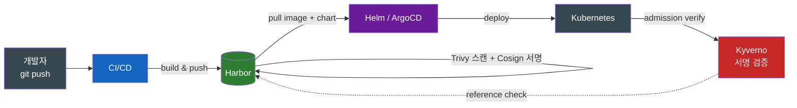
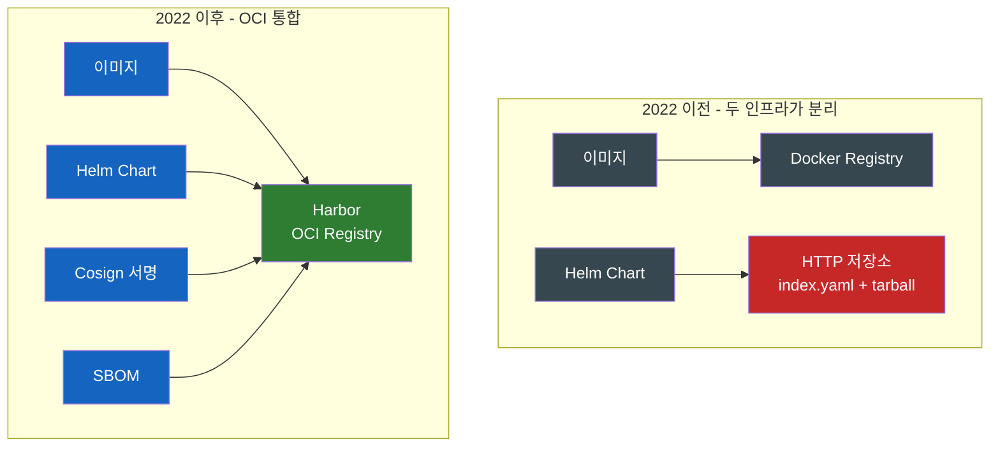
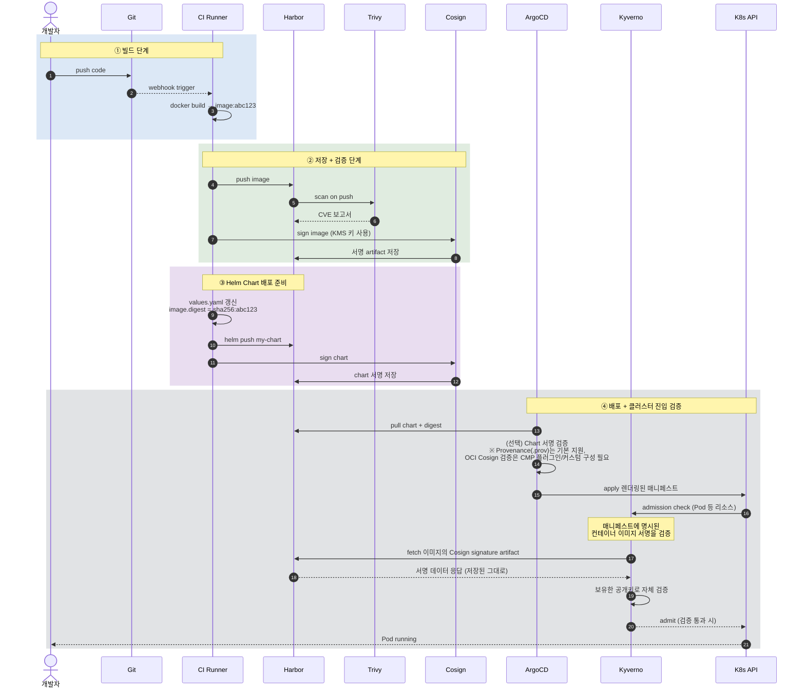
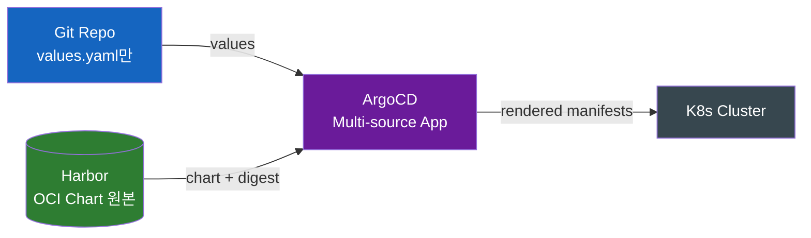
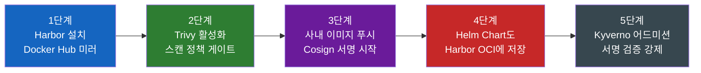
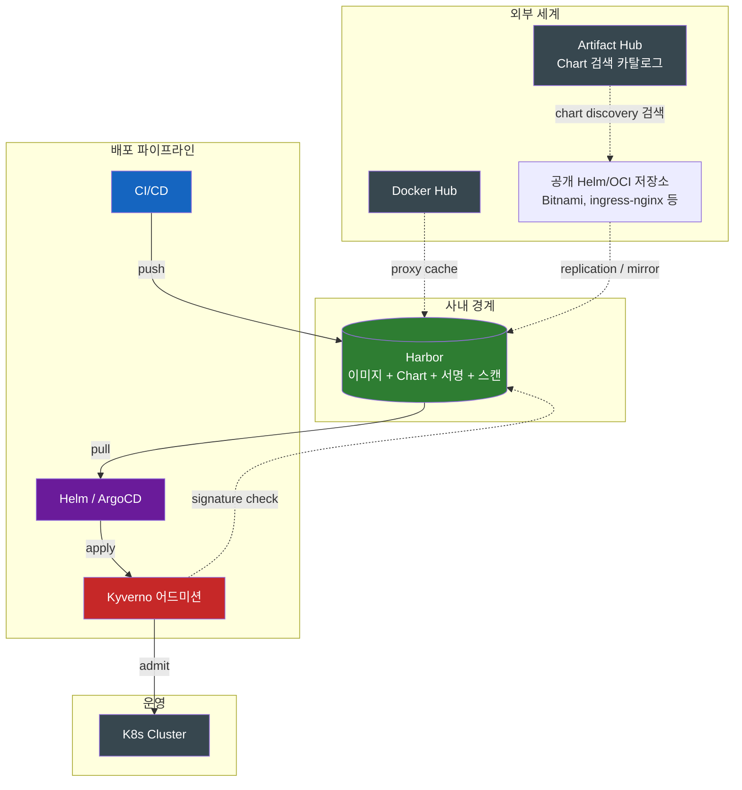

# Helm과 Harbor를 왜 같이 써야 하는가

같은 운영 흐름의 다른 단계라서, 비교가 아니라 협업이 답이다.

## 결론부터 말하면

이전 두 글에서 본 Helm과 Harbor는 흔히 "CNCF Graduated 프로젝트"라는 공통점으로 묶여 비교 대상으로 오해된다. 그러나 두 도구는 **카테고리 자체가 다르고**, 실제 운영에서는 **같은 파이프라인의 다른 단계**로 함께 작동한다. **Helm은 "어떻게 배포하는가"의 답이고, Harbor는 "어디서 가져와 무엇으로 신뢰하는가"의 답이다.** 그리고 이 둘이 만나는 지점이 **OCI Artifact 표준**이다 — 2022년 Helm 3.8 이후 Helm Chart도 컨테이너 이미지와 같은 레지스트리에 저장되기 시작하면서, "사내 컨테이너 레지스트리(Harbor) + K8s 패키지 매니저(Helm)"의 조합이 클라우드 네이티브 공급망의 사실상 표준 베이스라인이 되었다.

| 질문 | 답 |
|------|---|
| **무엇을 배포하지?** | Helm Chart |
| **어디에 저장하지?** | Harbor |
| **어디서 받아오지?** | Harbor (OCI registry) |
| **무엇으로 신뢰하지?** | Harbor에 저장된 Trivy 스캔 결과 + Cosign 서명 |
| **누가 배포 실행하지?** | Helm (또는 ArgoCD/Flux 같은 GitOps 도구가 Helm을 호출) |
| **롤백은 어떻게?** | (운영자 직접) Helm rollback / (GitOps) git revert |

---

## 1. 카테고리부터 다르다 — 비교의 함정

쿠버네티스 입문자가 자주 던지는 질문이 있다.

> "Helm이랑 Harbor 중에 뭐가 더 좋아요? 둘 다 CNCF Graduated인데."

이 질문 자체가 함정이다. 자바 개발자에게 같은 형식으로 묻는다고 상상해보자.

> "Maven이랑 Nexus 중에 뭐가 더 좋아요?"

문장이 어색하게 들린다. Maven은 빌드/의존성 관리 도구, Nexus는 그 의존성이 저장되는 사내 저장소이기 때문이다. **같은 흐름의 다른 단계의 도구**이지 대체재가 아니다. Helm과 Harbor도 정확히 같은 관계다.

| 자바 세계 | K8s 세계 | 역할 |
|----------|----------|------|
| **Maven** | **Helm** | 패키지를 가져와 빌드/배포 |
| **Nexus / Artifactory** | **Harbor** | 패키지가 저장되는 사내 저장소 |
| Maven Central | Docker Hub / GHCR / 공개 OCI 레지스트리 | 외부 공개 저장소 |
| 검색 사이트 (mvnrepository.com) | Artifact Hub | 패키지 검색 카탈로그 (직접 저장하지 않음) |

각자의 책임을 명확히 정리하면 다음과 같다.

| 책임 영역 | Helm | Harbor |
|----------|------|--------|
| K8s 리소스 매니페스트 생성 (템플릿 → YAML) | ✅ | ✗ |
| Release 라이프사이클 관리 (install/upgrade/rollback) | ✅ | ✗ |
| 컨테이너 이미지 저장 | ✗ | ✅ |
| Chart 저장 (OCI) | ✗ (CLI는 푸시만) | ✅ |
| 컨테이너 이미지 취약점 스캔 | ✗ | ✅ (Trivy. Chart 자체는 미지원) |
| Chart 서명/권한/RBAC/리플리케이션 | ✗ | ✅ (이미지와 같은 정책 체계에 묶임) |
| 디지털 서명 저장 | ✗ | ✅ (Cosign/Notation) |
| 접근 권한 분리 (RBAC) | ✗ (K8s RBAC에 위임) | ✅ |
| 다른 레지스트리와 동기화 | ✗ | ✅ |

겹치는 영역이 거의 없다. 그래서 **둘 중 하나를 고르는 게 아니라 둘 다 도입하는 것**이 자연스러운 결론이다.

---

## 2. 두 도구가 만나는 지점 — OCI Artifact

두 도구가 **하나의 운영 흐름으로 묶이는 결정적 사건**은 2022년에 있었다. Helm 3.8이 OCI 레지스트리 지원을 정식화하면서, **Helm Chart도 컨테이너 이미지와 같은 레지스트리에 저장되기 시작**했다.

이전에는 어떻게 했을까? Chart는 별도의 HTTP 저장소(`index.yaml` + tarball)에 두고, 이미지는 Docker Registry에 두는 식이었다. 두 인프라가 따로 굴러갔다.

통합 이후 얻는 이점이 단순한 "저장 위치 일원화"보다 크다. **권한 정책과 보안 정책이 한 곳에서 일관 적용**된다는 점이 핵심이다.

| 항목 | 통합 전 (분리) | 통합 후 (Harbor OCI) |
|------|---------------|---------------------|
| 인증 | 두 시스템 각각 | Harbor의 RBAC 하나로 |
| 권한 분리 | 따로 관리 | 프로젝트 단위로 묶임 |
| 취약점 스캔 | 이미지만 | 이미지는 Trivy로 스캔. Chart 자체는 Harbor가 직접 스캔하지 않지만, Chart에 명시된 이미지 참조와 같은 레지스트리에 묶이므로 정책/RBAC 통제는 일관 적용 |
| 서명 정책 | 각자 따로 | 같은 Cosign 키로 둘 다 서명 가능 |
| 리플리케이션 | 따로 동기화 | 한 번의 replication 규칙으로 같이 |
| 폐쇄망 반입 | 두 번 작업 | Harbor 하나만 옮기면 끝 |

Helm 4(2025년 11월)가 **OCI digest 기반 설치/검증의 안정성과 표준화를 한층 강화**한 것도 이 흐름의 연장선이다. `helm install`로 가변 태그(`my-chart:1.0`) 대신 digest(`oci://harbor.example.com/my-chart@sha256:...`)로 차트를 지정해 받는 기능 자체는 Helm 3에서도 지원되었지만, Helm 4는 **OCI digest 지원 + Server-Side Apply**를 한층 표준화해 이 흐름을 권장 경로로 자리잡게 했다. 참고로 Helm은 **자체적으로 GnuPG 기반의 provenance 서명/검증** 기능(`helm package --sign`, `helm install --verify`)을 핵심 기능으로 제공한다 — 다만 이는 차트 단일 검증에 한정된 전통적 방식이고, OCI Artifact 시대의 자동화된 공급망 정책은 **Harbor의 content trust + Cosign/Notation + Kyverno** 같은 별도 정책 계층을 함께 깔아야 완성된다. 이 흐름을 통해 "내가 배포한 정확히 그 차트"를 사후에 보증할 수 있다.

---

## 3. 실제 CI/CD 파이프라인 — 풀 시나리오

말로만 "통합한다"가 아니라, 진짜 운영 파이프라인이 어떻게 흐르는지 시퀀스로 보자.

각 단계의 책임을 다시 정리하면 다음과 같다.

| 단계 | 도구 | 검증되는 것 |
|------|------|-------------|
| ① 빌드 | CI/CD | "우리 빌드 시스템이 만든 결과물인가" |
| ② 저장 + 스캔 + 서명 | **Harbor** + Trivy + Cosign | "취약점이 없고 우리 키로 서명된 이미지인가" |
| ③ Chart 작성 + 푸시 | **Helm** + Harbor | "검증된 이미지를 참조하는 Chart인가" |
| ④ 배포 + 어드미션 | ArgoCD/Helm + Kyverno | "클러스터에 들어가도 되는가" |

이 흐름의 핵심 통찰은 **"검증 시점이 분산되어 있다"** 는 것이다. 보안 사고는 어느 한 지점에서 막는 게 아니라 여러 지점에 게이트를 깔아 막는다 — Harbor 푸시 시 스캔, 풀 시 서명 정책, 클러스터 진입 시 admission. 같은 의도를 세 번 다른 방식으로 검증한다.

> 💡 **Cosign 키 운영의 실무 주의점**: 서명 키 자체를 어디에 두느냐가 또 다른 운영 과제다. 로컬 파일에 두면 분실/유출 위험이 크고, AWS KMS/GCP KMS/HashiCorp Vault 같은 KMS에 두는 것이 사실상 표준이다. 또한 KMS 장애나 키 만료로 정상 빌드가 admission에서 차단되는 사태를 막기 위해 **break-glass(비상 우회) 절차**를 미리 설계해 둬야 한다.

---

## 4. GitOps 환경에서의 역할 분담

ArgoCD나 Flux 같은 GitOps 도구가 끼어드는 순간 Helm의 역할이 재정의된다. 이전 글에서도 짧게 짚었지만 시리즈를 마무리하는 의미에서 정리해 둘 만하다.

| 운영 모델 | 변경 트리거 | 롤백 방법 | Helm의 역할 |
|----------|-----------|----------|-------------|
| **순수 Helm CLI** | 운영자가 `helm upgrade` | `helm rollback` | 풀 라이프사이클 (install/upgrade/rollback) |
| **GitOps (ArgoCD/Flux)** | Git 커밋 | `git revert` | **템플릿 렌더링 + 의존성 묶음**만 |

단 GitOps 도구마다 Helm을 다루는 방식이 다르다는 점을 짚어둘 필요가 있다. **ArgoCD는 `helm template`만 호출해 렌더링한 뒤 자체 동기화 엔진으로 적용**한다 — 이 모델에서 Helm은 "렌더링 엔진"으로 격하되며 `helm list`로 Release가 보이지 않는다. 반면 **Flux의 helm-controller는 `HelmRelease`라는 CRD를 통해 실제 `helm install/upgrade/rollback`을 선언적으로 실행**한다 — 이쪽은 Helm의 라이프사이클 명령을 그대로 활용한다. 어느 쪽이든 공통점은 **변경 트리거가 Git 커밋**이라는 점이다. 그래서 GitOps 환경에서는 **운영자가 콘솔에서 `helm rollback`을 직접 쓰면 오히려 위험하다** — ArgoCD/Flux가 그 상태를 "Out of Sync"로 감지해 Git에 선언된 상태로 즉시 되돌려버리기 때문이다.

이 모델에서 **Harbor의 위치는 변하지 않는다.** GitOps든 아니든 Harbor는 항상 "신뢰할 수 있는 아티팩트의 중앙 저장소"로 작동한다. ArgoCD가 Helm Chart를 끌어오는 곳도, Trivy 스캔 결과를 조회하는 곳도, Cosign 서명을 검증하는 곳도 모두 Harbor다.

ArgoCD 2.6 이후 도입된 **Multi-source 기능**을 쓰면 한 Application이 여러 소스를 묶을 수 있다 — 예를 들어 Chart는 Harbor에서, values는 Git에서, 두 소스를 합쳐 배포하는 식이다. 이 패턴이 모던 GitOps + Helm 결합의 표준에 가깝다.

---

## 5. 흔한 안티패턴

운영하면서 자주 마주치는 잘못된 패턴들이다.

| 안티패턴 | 왜 문제인가 | 해결 |
|---------|-----------|------|
| **Chart의 `image.tag`만 쓰고 digest 안 씀** | 같은 태그가 다른 시점에 다른 이미지를 가리킬 수 있어 재현성이 깨진다 | **이미지 측면**: values에 `image.digest`(sha256) 함께 기록. **Chart 측면**: 별개로 `helm install oci://...@sha256:...` 식의 OCI chart digest 설치를 활용 — 두 digest는 대상이 다른 별개 장치다 |
| **Harbor에 이미지만 두고 Chart는 Git에 둠** | 서명 정책, 권한, 스캔이 두 시스템에 분산되어 일관성 깨짐 | Chart도 Harbor에 OCI artifact로 푸시 |
| **Proxy Cache 프로젝트에 사내 이미지 푸시 시도** | Proxy Cache는 pull-only 미러라 푸시 불가 → 혼선 | `dockerhub-cache`(외부)와 `service-prod`(내부) 프로젝트 명확히 분리 |
| **GitOps 환경에서 `helm rollback` 직접 실행** | ArgoCD가 Out of Sync로 감지해 즉시 덮어씀 → 의도와 정반대 결과 | GitOps에서는 `git revert`로 롤백 |
| **이미지에만 서명, Chart에 서명 안 함** | Chart가 변조되면 image.digest를 바꿔치기당할 수 있다 | Chart도 서명. 단 Helm 기본 **provenance**(`.prov`/OpenPGP)와 **OCI/Sigstore 서명**(`helm-sigstore`/Cosign)은 별개 흐름이므로 어느 쪽을 채택할지 정책으로 정해두기 |
| **Trivy 설치만 하고 자동 스캔 옵션 꺼둠** | 푸시 직후 스캔이 안 돼 정책 게이트가 무의미 | 프로젝트별 "Automatically scan images on push" 활성화 |
| **외부 미러를 익명으로만 쓰기** | 캐시 미스 시 Harbor 아웃바운드 IP가 익명 풀 제한에 걸려 갱신 실패 | Harbor의 Registry Endpoint에 인증 정보 등록 |

---

## 6. 도입 순서 — 작게 시작하기

이 모든 걸 한 번에 도입하려면 부담이 크다. 실무에서 검증된 점진적 도입 순서는 다음과 같다.

각 단계는 **그 단계만 완성해도 가치가 있다** 는 것이 중요하다. 1단계만 해도 Docker Hub rate limit 문제가 사라진다. 2단계까지 가면 사고 한 번 막을 수 있다. 3단계는 사내 빌드의 신원을 확보한다. 4단계는 패키지 전체를 같은 통제 안으로 들인다. 5단계는 어떤 우회 경로도 막는다.

처음부터 5단계를 동시에 굴리려고 하면 학습 곡선과 운영 부담이 합쳐져 도입 자체가 좌초된다. 단계별로 운영 안정화 시간을 두고 위로 쌓아 올리는 것이 현실적이다.

---

## 7. 정리 — 클라우드 네이티브 공급망의 베이스라인

세 편의 글을 한 장의 그림으로 요약하면 이렇다.

세 편의 핵심을 다시 한 줄씩 요약하면 다음과 같다.

| 글 | 한 줄 핵심 |
|----|----------|
| **1편 Helm** | K8s YAML 지옥을 "Chart"라는 패키지로 추상화해 배포의 재현성과 롤백 가능성을 확보한다 |
| **2편 Harbor** | Docker Hub의 한계와 공급망 보안 요구에 대응해 "사내 자재창고 + 검증 지점"을 둔다 |
| **3편 통합** | 둘은 같은 흐름의 다른 단계이며, OCI Artifact 표준 위에서 한 인프라로 묶인다 |

자바 개발자의 관점에서 마지막으로 비교하자면 — **Maven 없이는 자바 프로젝트가 빌드 안 되고, Nexus 없이는 사내 배포가 안전하지 않다. 둘 다 있어야 자바 인프라가 돈다.** K8s 시대의 같은 자리에 Helm과 Harbor가 있다. 둘 다 갖춰야 운영이 돈다.

CNCF 전체 프로젝트 220여 개(2026-05 기준 Graduated 36개, Incubating 37개, Sandbox 151개) 중에서도 이 둘이 **거의 모든 클라우드 네이티브 조직의 베이스라인 인프라**가 된 데에는 그만한 이유가 있다. "K8s 위에서 무언가를 운영한다"는 행위 자체가 둘 없이는 성립하기 어렵게 진화한 것이다.

---

## 출처

- [Helm 공식 문서 — OCI Registry 지원](https://helm.sh/docs/topics/registries/) — Helm 3.8 OCI 정식 지원
- [CNCF — Helm Marks 10 Years With Release of Version 4 (2025-11-12)](https://www.cncf.io/announcements/2025/11/12/helm-marks-10-years-with-release-of-version-4/) — Helm 4의 OCI digest 흐름
- [Harbor docs — Sign Artifacts with Cosign or Notation (최신)](https://goharbor.io/docs/edge/working-with-projects/working-with-images/sign-images/) — 서명 통합
- [ArgoCD docs — Multiple Sources for an Application](https://argo-cd.readthedocs.io/en/stable/user-guide/multiple_sources/) — Multi-source 패턴
- [Sigstore Cosign 공식 문서](https://docs.sigstore.dev/cosign/overview/) — Cosign 사용법
- [Kyverno — Verify Container Image Signatures](https://kyverno.io/docs/writing-policies/verify-images/) — 어드미션 시점 서명 검증
- [Nirmata — Harbor, Cosign, Kyverno for Software Supply Chain Security](https://nirmata.com/2022/05/26/harbor-cosign-and-kyverno/) — 실무 통합 가이드
- [CNCF Blog — Harbor: Enterprise-grade container registry (2025-12-08)](https://www.cncf.io/blog/2025/12/08/harbor-enterprise-grade-container-registry-for-modern-private-cloud/) — Harbor 운영
