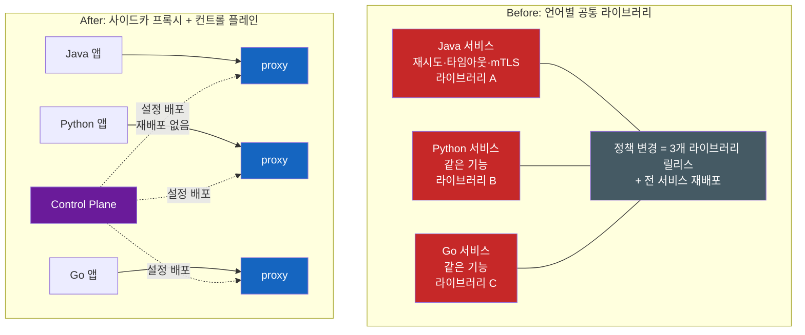
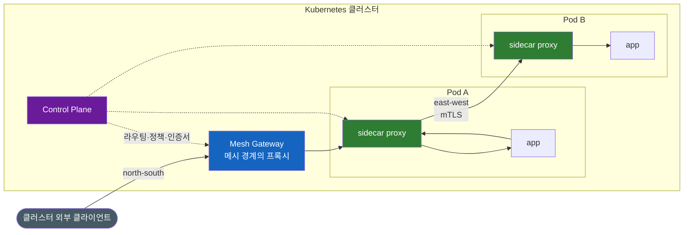
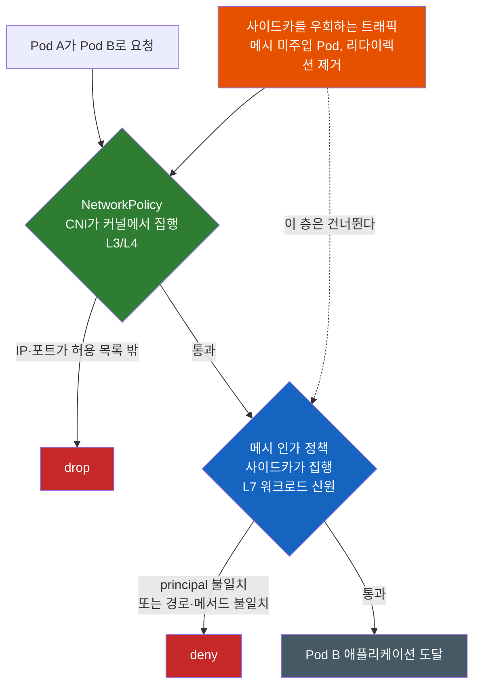

# Ingress 리소스가 하나도 없는데 트래픽은 어떻게 들어올까 — 서비스 메시가 대체하는 것들

`kubectl get ingress --all-namespaces`가 비어 있는데 브라우저로는 서비스가 열린다. 그러면 라우팅 규칙은 대체 어디에 적혀 있는 걸까?

낯선 클러스터에 처음 붙었을 때 이런 상황을 만나면 잠깐 당황한다. 외부에서 접속이 되니 무언가가 트래픽을 받아 내부 서비스로 넘기고 있는 게 분명한데, 그 규칙을 담고 있어야 할 `Ingress` 리소스가 클러스터 전체에 하나도 없다. 그리고 `kubectl get pod`을 보면 두 번째 단서가 나온다 — 컨테이너를 하나만 정의했는데 모든 Pod가 `2/2`다. 내가 만들지 않은 컨테이너가 앱마다 하나씩 붙어 있다.

이 두 가지는 별개의 미스터리가 아니라 **같은 이야기의 앞뒤** 다. 이 글은 그 이야기를 처음부터 끝까지 따라간다.

---

## 결론부터 말하면

**이 클러스터에는 서비스 메시(service mesh)가 깔려 있다.** 서비스 메시를 설치하면 두 가지가 동시에 일어난다.

1. 메시가 제공하는 **게이트웨이** 가 Ingress Controller 역할을 대신한다. 그래서 클러스터 외부 트래픽은 정상적으로 들어오지만, 라우팅 규칙은 `Ingress` 리소스가 아니라 **메시 자신의 커스텀 리소스(CRD)** 에 적혀 있다. `kubectl get ingress`가 비어 있는 이유다.
2. **주입이 활성화된 네임스페이스** 의 Pod에는 **사이드카 프록시** 가 자동으로 주입된다. 그래서 `2/2`가 된다. 클러스터의 모든 Pod가 아니라는 점이 중요하다 — 대상은 네임스페이스 라벨이나 Pod 어노테이션으로 선별되며, 그 선별이 왜 안전 장치인지는 4-1절에서 다룬다.

그래서 `2/2`만으로 메시 여부를 판정하면 안 된다. 사이드카를 쓰지 않는 ambient 모드에서는 Pod가 `1/1`이어도 메시에 포함되기 때문이다. 확실한 판정은 아래 세 가지를 함께 보는 것이다 — 주입 웹훅 설정(`kubectl get mutatingwebhookconfigurations`), 네임스페이스의 주입 라벨, 그리고 메시가 등록한 라우팅 CRD의 존재.

그러니 `kubectl get ingress`가 비었을 때 포기하지 말고 다음 명령으로 넘어가면 된다.

```bash
# 표준 Ingress가 아니라, 메시가 정의한 리소스에 규칙이 있다
kubectl get gateway,httproute --all-namespaces          # Gateway API 기반
kubectl get gateway.networking.istio.io,virtualservice -A  # Istio 자체 API 기반

# 그리고 Pod에 무엇이 더 붙었는지 확인
kubectl get pod -o jsonpath='{.items[*].spec.containers[*].name}'
```

쿠버네티스가 자기 API에 없던 이런 리소스를 어떻게 가질 수 있는지는 [쿠버네티스는 어떻게 자기 자신을 확장할까 — CRD와 컨트롤러 그리고 Operator](쿠버네티스는-어떻게-자기-자신을-확장할까-CRD와-컨트롤러-그리고-Operator.md)에서 다룬다. 여기서는 **왜** 그런 리소스를 따로 만들었고, 왜 앱마다 프록시를 붙이는가에 집중한다.

| 관심사 | Ingress + Ingress Controller | 서비스 메시 |
|--------|------------------------------|-------------|
| 다루는 트래픽 방향 | 외부 → 클러스터 (north-south) **만** | north-south + 서비스 간(east-west) |
| 라우팅 규칙 표현 | 표준 스펙 + **컨트롤러별 annotation** | 메시 CRD의 **1급 필드** |
| 재시도·타임아웃·서킷 브레이커 | 표준 스펙에 없음 (annotation) | 라우팅 리소스의 필드 |
| 서비스 간 암호화 | 범위 밖 | mTLS 자동 (워크로드 인증서) |
| 인가 기준 | 범위 밖 | **워크로드 신원**(L7) |
| 대가 | Controller Pod 몇 개 | Pod마다 프록시 + 컨트롤 플레인 운영 |

---

## 1. 왜 프록시를 앱 옆에 두는가

여기서 가장 중요한 질문부터 풀어야 한다. 사이드카 프록시가 **왜** 존재하는지 이해하면 나머지는 따라온다.

### 1-1. 서비스가 스무 개가 되면 생기는 요구

서비스 하나로 시작한 시스템이 마이크로서비스 스무 개로 늘었다고 하자. 그러면 어느 팀에서든 똑같은 요구가 올라온다.

- 서비스 간 통신을 **암호화** 하자 (클러스터 내부라도 평문은 곤란하다)
- 일시적 오류는 **재시도** 하고, 응답이 늦으면 **타임아웃** 을 걸자
- 한 서비스가 죽었을 때 호출 측이 같이 무너지지 않게 **서킷 브레이커** 를 두자
- 요청 단위로 **레이턴시·에러율** 을 재고, 여러 서비스를 거치는 요청을 하나로 이어 볼 수 있게 **트레이스 컨텍스트를 전파** 하자

지극히 상식적인 요구다. 문제는 이걸 어디에 구현하느냐다.

### 1-2. 직관적인 해법: 라이브러리 — 그리고 그것이 무너지는 지점

가장 자연스러운 답은 **공통 라이브러리** 다. 재시도·서킷 브레이커·메트릭 수집을 담은 사내 라이브러리를 만들어 모든 서비스가 의존하게 한다. 실제로 마이크로서비스 초기에는 이 방식이 주류였다.

그런데 이 직관은 두 지점에서 무너진다.

**첫째, 언어마다 하나씩 만들어야 한다.** Java 서비스에 넣은 그 로직을 Python 서비스에도, Go 서비스에도 각각 다시 구현해야 한다. 세 언어면 세 개의 라이브러리이고, 세 개의 버전 정책과 세 개의 버그 목록이다. 재시도 백오프 계산 방식이 언어별로 미묘하게 다르면 장애가 났을 때 원인 파악이 두 배로 어려워진다.

**둘째, 정책 변경이 전 서비스 재배포다.** "모든 서비스의 기본 타임아웃을 3초에서 1초로 줄이자"는 한 줄짜리 결정을 실행하려면, 라이브러리 새 버전을 릴리스하고 스무 개 서비스가 각자 의존성을 올려 다시 빌드·배포해야 한다. 팀이 스무 개면 이 작업은 몇 주가 걸린다. 운영 파라미터를 바꾸려고 애플리케이션을 재배포하는 것 자체가 이상하다.

### 1-3. 발상의 전환: 이건 전부 "네트워크 요청을 다루는 일"이다

여기서 관점을 바꿔 보자. 위에 나열한 기능 목록을 다시 읽으면 공통점이 보인다. **암호화, 재시도, 타임아웃, 서킷 브레이커, 요청 메트릭 — 어느 것도 비즈니스 로직이 아니고, 전부 "네트워크 요청이 오갈 때 벌어지는 일"이다.** 애플리케이션이 무슨 언어로 쓰였는지와 아무 상관이 없다.

그렇다면 앱 프로세스 **안** 에 있을 이유도 없다. 앱과 네트워크 사이에 프록시를 하나 세우고, 그 프록시가 들어오고 나가는 모든 요청을 처리하게 하면 된다. 앱은 평범한 HTTP 호출을 하고, 프록시가 그 호출을 가로채 암호화하고 재시도하고 측정한다. **프록시는 앱의 언어를 알 필요가 없으므로, 이 순간 모든 기능이 언어 중립이 된다.**

프록시를 Pod 안, 앱 컨테이너 옆에 두면 앱은 `localhost`로 나가는 것처럼 동작하면서도 프록시의 모든 기능을 얻는다. 이것이 **사이드카 프록시(sidecar proxy)** 다.



### 1-4. 데이터 플레인과 컨트롤 플레인

프록시를 흩뿌려 놓기만 하면 두 번째 문제(정책 변경)는 그대로다. 스무 개 Pod의 프록시 설정을 손으로 고칠 수는 없다. 그래서 프록시들을 **한곳에서 설정해 주는 컴포넌트** 가 필요하다.

이 둘을 합친 것이 서비스 메시다.

| 층 | 무엇인가 | 하는 일 |
|----|----------|---------|
| **데이터 플레인**(data plane) | 실제 트래픽을 통과시키는 프록시들의 집합 | 요청을 가로채 암호화·재시도·라우팅·측정을 수행 |
| **컨트롤 플레인**(control plane) | 프록시들을 설정하는 중앙 컴포넌트 | 서비스 목록·라우팅 규칙·인증서를 프록시에 배포 |

이 구조 덕분에 "타임아웃을 1초로" 같은 변경이 **CRD 하나를 수정하는 일** 로 바뀐다. 컨트롤 플레인이 변경을 감지해 모든 프록시에 새 설정을 밀어 넣고, 애플리케이션은 재배포되지 않는다. 라이브러리 방식의 두 번째 붕괴 지점이 여기서 해소된다.

구현체는 여러 개다. Istio는 Envoy를 사이드카로 쓰고 `istiod`가 컨트롤 플레인 역할을 한다. Linkerd처럼 전용 경량 프록시를 쓰는 구현도 있다. 어느 쪽이든 "데이터 플레인 + 컨트롤 플레인"이라는 뼈대는 같다.

### 1-5. 그런데 그 프록시는 내 YAML에 없다

여기서 처음의 두 번째 미스터리가 남는다. Deployment에 컨테이너를 하나만 적었는데 왜 `2/2`인가? 답은 짧다 — **API 서버가 Pod를 저장하기 전에, 메시의 webhook이 요청 본문을 고쳐 프록시 컨테이너를 끼워 넣는다.** 이 mutating admission webhook의 동작 원리는 [내가 만들지 않은 컨테이너가 왜 Pod에 들어와 있을까 — Admission Webhook](내가-만들지-않은-컨테이너가-왜-Pod에-들어와-있을까-Admission-Webhook.md)이 소유하므로 여기서는 링크만 걸어 둔다.

---

## 2. north-south와 east-west — Ingress로는 왜 부족한가

이제 첫 번째 미스터리로 돌아가자. 서비스 메시가 왜 `Ingress` 리소스를 쓰지 않고 자기 CRD를 만들었을까. 이유는 두 겹이다.

### 2-1. Ingress는 방향이 하나뿐이다

쿠버네티스의 `Ingress` 리소스는 **클러스터 밖에서 안으로 들어오는 HTTP 트래픽** 만 다룬다. 관례적으로 이를 **north-south** 트래픽이라 부른다. 반대로 클러스터 안의 서비스와 서비스 사이를 오가는 트래픽은 **east-west** 다.

그리고 여기가 핵심이다. **east-west 라우팅 규칙을 표현하는 쿠버네티스 표준 리소스는 없다.** `Service`가 있지만 Service는 "이 라벨을 가진 Pod들의 안정적인 주소"를 제공하는 도구이고, "이 요청의 10%는 v2로 보내라"거나 "이 헤더가 있으면 다른 백엔드로 가라"를 표현하는 도구가 아니다. Service의 역할은 [Kubernetes Service](Kubernetes-Service-ClusterIP-NodePort-LoadBalancer.md)에서 다룬다.

즉 표준 리소스의 지도는 이렇게 비어 있다.

| 방향 | 무엇을 하고 싶은가 | 쿠버네티스 표준 리소스 |
|------|--------------------|------------------------|
| north-south | 외부 요청을 host/path로 분기, TLS 종료 | `Ingress` (있다) |
| east-west | 서비스 간 요청을 가중치·헤더로 분기, 재시도·타임아웃 | **없다** |

서비스 메시는 이 빈칸을 채우면서, 동시에 north-south도 **같은 모델** 로 표현한다. 메시의 게이트웨이는 결국 "메시 경계에 서 있는 프록시"이고, 사이드카는 "Pod 경계에 서 있는 프록시"다. 둘 다 프록시이므로 같은 문법으로 설정할 수 있다. 그래서 메시를 도입하면 Ingress Controller와 별개로 게이트웨이를 하나 더 두는 대신, 게이트웨이가 Ingress Controller 역할까지 흡수하는 구성이 자연스러워진다. **"Ingress로는 부족한 이유"의 정확한 답은 "Ingress는 절반의 방향만 다룬다"** 다.

(`Ingress`라는 단어가 `Ingress` 리소스와 NetworkPolicy의 `ingress` 방향을 동시에 가리켜 생기는 혼란, 그리고 `kind: Egress`가 없는 비대칭은 [쿠버네티스 Ingress와 Egress는 왜 대칭이 아닐까](쿠버네티스-Ingress와-Egress는-왜-대칭이-아닐까.md)에서 정리했다.)



### 2-2. 표현력의 문제 — annotation으로 확장된 역사

두 번째 이유는 **표현력** 이다. 표준 `Ingress` 스펙에는 트래픽 가중치 분배, 헤더 기반 라우팅, 재시도, 타임아웃, 오류 주입 같은 필드가 **아예 없다.** 스펙이 다루는 것은 host, path, backend, TLS 정도다.

현실의 요구는 그보다 넓었고, Ingress Controller들은 이를 **annotation** 으로 채웠다. 타임아웃은 `nginx.ingress.kubernetes.io/proxy-read-timeout`, 헬스 체크는 `alb.ingress.kubernetes.io/healthcheck-path` 같은 식이다(구체적인 목록은 [Kubernetes Ingress](Kubernetes-Ingress.md)의 annotation 섹션에 정리돼 있다). 결과는 예상 가능하다 — **같은 기능을 컨트롤러마다 다른 문자열로 외워야 하고, 컨트롤러를 바꾸면 매니페스트를 다시 써야 한다.** annotation은 스키마 검증도 받지 못하는 문자열이라 오타가 조용히 무시된다.

메시의 라우팅 CRD는 이것들을 **1급 필드** 로 가진다. 그래서 가중치 기반 배포가 annotation 조합이 아니라 스펙의 일부가 된다.

```yaml
# Istio VirtualService — 가중치·재시도·타임아웃이 모두 스키마의 필드
apiVersion: networking.istio.io/v1
kind: VirtualService
metadata:
  name: my-app
spec:
  hosts:
  - my-app                      # 클러스터 내부 이름 = east-west도 같은 문법으로
  http:
  - match:
    - headers:
        x-canary:               # 헤더 기반 분기가 필드다 (annotation 아님)
          exact: "true"
    route:
    - destination:
        host: my-app
        subset: v2
  - route:                      # 그 외 트래픽은 가중치로 분배
    - destination:
        host: my-app
        subset: v1
      weight: 90
    - destination:
        host: my-app
        subset: v2
      weight: 10
    retries:
      attempts: 3
      perTryTimeout: 2s         # 재시도·타임아웃도 필드
    timeout: 5s
```

오해하지 말아야 할 것이 하나 있다. **가중치 기반 Canary를 하려면 반드시 메시가 필요한 건 아니다.** NGINX Ingress처럼 annotation으로 정밀한 가중치 Canary를 지원하는 컨트롤러도 있다(자세한 비교는 [Kubernetes Deployment Strategy](Kubernetes-Deployment-Strategy.md)에 있다). 차이는 "가능/불가능"이 아니라 **"컨트롤러별 annotation이냐, 표준화된 스키마 필드냐"** 다. 그리고 메시에서는 이 규칙이 north-south에만 적용되지 않고 **서비스 간 호출에도 그대로 적용된다** — 외부에 노출되지 않은 내부 서비스의 Canary도 같은 문법으로 쓸 수 있다는 점이 실질적인 차이다.

---

## 3. mTLS와 신원 기반 인가 — NetworkPolicy와 무엇이 다른가

라우팅보다 메시 도입의 결정적 동기가 되는 쪽은 보안이다. 그리고 여기서 기존 도구와의 경계를 정확히 그어야 한다.

### 3-1. 메시는 워크로드마다 인증서를 발급한다

메시의 컨트롤 플레인은 내부에 CA(인증 기관)를 두고, **워크로드마다 짧은 수명의 X.509 인증서** 를 발급한다. Istio의 경우 각 Pod의 에이전트가 키를 만들고 CSR을 `istiod`에 보내면, `istiod`가 자격을 검증해 서명하고, 프록시는 이를 받아 상호 TLS(mTLS)에 사용한다. 에이전트는 만료를 감시하며 주기적으로 갱신을 반복한다. 애플리케이션 코드는 이 과정을 전혀 모른다.

이 인증서에 담기는 **신원(identity)** 이 무엇인지가 중요하다. 쿠버네티스에서 그 신원은 **ServiceAccount** 를 기반으로 만들어진다. 인가 정책에서 보이는 principal 형태가 `cluster.local/ns/production/sa/checkout`처럼 네임스페이스와 ServiceAccount로 구성되는 이유다. ServiceAccount가 왜 워크로드 신원의 기반이 되는지는 [Pod는 어떻게 쿠버네티스 API에 자기를 증명할까 — ServiceAccount와 RBAC](Pod는-어떻게-쿠버네티스-API에-자기를-증명할까-ServiceAccount와-RBAC.md)를 보라.

그 위에 정책 두 개가 얹힌다. **PeerAuthentication** 은 mTLS를 어느 강도로 요구할지 정한다 — `STRICT`은 mTLS만 받고, `PERMISSIVE`는 mTLS와 평문을 모두 받는다(메시로 점진 이행할 때 쓰는 모드이며, 메시 전역 기본값이 설정돼 있지 않으면 `PERMISSIVE`다). **AuthorizationPolicy** 는 "누가 무엇을 할 수 있는지"를 정한다.

```yaml
# "결제 서비스는 checkout ServiceAccount로 실행되는 워크로드의 POST만 받는다"
apiVersion: security.istio.io/v1
kind: AuthorizationPolicy
metadata:
  name: payment-allow-checkout
  namespace: production
spec:
  selector:
    matchLabels:
      app: payment
  action: ALLOW
  rules:
  - from:
    - source:
        principals: ["cluster.local/ns/production/sa/checkout"]  # IP가 아니라 신원
    to:
    - operation:
        methods: ["POST"]
        paths: ["/api/charge"]        # 경로까지 좁힐 수 있다 (L7)
```

### 3-2. IP로는 "누구인지"를 말할 수 없다

여기서 [쿠버네티스 Egress 통제는 왜 NetworkPolicy 하나로 끝나지 않을까](쿠버네티스-Egress-통제는-왜-NetworkPolicy-하나로-끝나지-않을까.md)에서 다룬 이야기와 정면으로 이어진다. NetworkPolicy는 CNI가 커널의 패킷 필터로 집행하는 **L3/L4 규칙** 이다. 커널이 패킷에서 볼 수 있는 것은 출발지·목적지 IP와 포트뿐이다.

그런데 Pod IP는 Pod가 재시작될 때마다 바뀌고, 회수돼 다른 Pod에 재활용된다. "방금 이 IP에서 온 요청이 정말 결제 서비스인가?"를 IP만으로 확신할 방법이 없다. NetworkPolicy가 라벨 셀렉터로 이 문제를 상당 부분 우회하지만(`podSelector`로 지정하면 CNI가 해당 Pod의 현재 IP를 추적한다), 그것은 여전히 **"어떤 IP를 허용할지 계산하는 방식"** 이고, 요청 자체가 그 신원을 **증명** 하지는 않는다. 메시의 mTLS는 요청마다 상대가 인증서로 자기 신원을 증명하게 만든다는 점에서 층이 다르다.

### 3-3. 그러나 메시 정책은 NetworkPolicy를 대체하지 않는다

여기서 가장 중요한 함정이 나온다. **메시의 인가 정책은 사이드카를 통과하는 트래픽만 통제한다.** 사이드카가 주입되지 않은 Pod, 혹은 리다이렉션 규칙을 걷어낸 컨테이너가 보내는 트래픽에는 메시 정책이 걸리지 않는다.

이건 외부의 비판이 아니라 Istio 공식 문서가 직접 인정하는 사실이다. Istio 보안 운영 가이드는 애플리케이션이 "리다이렉션 규칙을 제거하고 사이드카 프록시를 제거·변경·종료·교체할 수 있다"고 적으면서, 결론을 이렇게 못 박는다.

> "it is not secure to rely on all traffic being captured unconditionally by Istio" — 모든 트래픽이 무조건 Istio에 포착된다고 믿는 것은 안전하지 않다. 실제 보안 경계는 "클라이언트가 **다른** Pod의 사이드카를 우회할 수는 없다"는 것이다.

그래서 같은 문서가 **"Defense in depth with NetworkPolicy"** 라는 제목으로 두 층을 함께 쓰라고 권고한다. NetworkPolicy는 커널에서 집행되므로 사이드카를 우회한 트래픽에도 그대로 걸린다. Pod가 침해되거나 취약점이 터졌을 때 공격자의 진행을 막거나 늦추는 층이 바로 이것이다.



정리하면 이렇다.

| 축 | NetworkPolicy | 메시 인가 정책 |
|----|---------------|----------------|
| 계층 | L3/L4 (IP·포트) | L7 (신원·경로·메서드·JWT 클레임) |
| 집행 주체 | CNI 플러그인 (커널) | 사이드카 프록시 |
| 사이드카 우회 트래픽 | **막는다** | 막지 못한다 |
| 표현 단위 | IP/CIDR, Pod·Namespace 라벨 | 워크로드 신원(ServiceAccount 기반) |
| 결론 | 둘 중 하나를 고르는 문제가 아니다 — **함께 쓴다** | |

---

## 4. 비용과 함정

여기까지가 메시의 값이다. 이제 청구서를 봐야 한다. 서비스 메시는 공짜가 아니고, 도입 후에 부딪히는 문제들이 꽤 구체적이다.

### 4-1. 오버헤드는 Pod 수에 비례한다

프록시가 Pod마다 하나씩 붙으므로, CPU·메모리 오버헤드는 **Pod 개수에 비례해 늘어난다.** Pod가 500개면 프록시도 500개다. 게다가 예측 불가능한 부하를 대비해 프록시에 여유 있게 requests/limits를 잡는 관행 때문에, 실제 사용량보다 훨씬 큰 자원이 예약된 상태로 묶이기 쉽다.

레이턴시도 늘어난다. A가 B를 호출할 때 요청은 A의 프록시와 B의 프록시를 각각 통과하므로 **홉이 두 개 추가** 된다. 개별 요청에서는 밀리초 단위지만, 요청이 여러 서비스를 거쳐 흐르는 호출 사슬에서는 그 지연이 누적된다.

### 4-2. 이 500은 내 앱이 낸 게 아닐 수도 있다

디버깅 난도는 체감상 가장 큰 비용이다. 클라이언트가 500이나 503을 받았을 때, **그것을 낸 주체가 내 애플리케이션인지 프록시인지부터 구분해야 한다.** 앱 로그에는 아무 흔적이 없는데 클라이언트는 503을 받는 상황이 흔하다.

그래서 새로운 독해 능력이 필요해진다. Envoy 기반 프록시는 액세스 로그에 상태 코드 뒤에 **response flag** 를 남기는데, 이것이 "왜 그 응답이 나왔는지"를 알려준다.

```bash
# 앱 컨테이너가 아니라 프록시 컨테이너의 로그를 봐야 한다
kubectl logs my-app-7d9f8b6c4-x2n8p -c istio-proxy --tail=100

# 예: [...] "GET /api/users HTTP/1.1" 503 UF via_upstream ...
#                                     ^^^ ^^
#                          상태 코드  response flag
```

| flag | 의미 | 흔한 원인 |
|------|------|-----------|
| `UF` | Upstream Failure — TCP 연결 자체가 실패 | 포트 불일치, mTLS 설정 충돌 |
| `UH` | No healthy Upstream Host — 건강한 엔드포인트가 없음 | Pod가 Ready가 아님, outlier detection에 의한 축출 |
| `UC` | Upstream Connection termination — 연결된 뒤 끊김 | 앱이 커넥션을 먼저 닫음, keep-alive 불일치 |
| `UO` | Upstream Overflow — 커넥션 풀 초과 | 서킷 브레이커 발동 |
| `UT` | Upstream Timeout | 라우팅 리소스에 설정한 타임아웃 초과 |
| `NR` | No Route — 매칭되는 라우팅 규칙 없음 | 라우팅 CRD 설정 오류 |

플래그 이름은 대문자를 따라 읽으면 그대로 코드가 된다 — `UF`는 Upstream Failure, `NR`은 No Route다.

`-`(플래그 없음)이면 프록시가 특별히 개입하지 않았다는 뜻이니, 그 응답은 애플리케이션이 낸 것이다. 이 한 글자 두 글자를 읽을 수 있느냐가 메시 환경의 장애 대응 속도를 결정한다.

### 4-3. 시작 순서 문제 — 그리고 native sidecar가 해결한 것

전통적인 사이드카에는 고약한 경쟁 조건이 있었다. 프록시가 트래픽을 가로채도록 iptables 규칙은 이미 설정됐는데 프록시 프로세스는 아직 준비되지 않은 짧은 창이 생긴다. 이때 앱이 시작 직후 DB나 다른 서비스를 호출하면 그 요청은 **아무도 듣고 있지 않은 곳으로 리다이렉트되어 실패** 한다. 시작 시 외부 호출을 하는 앱이 CrashLoop에 빠지는 전형적인 원인이었다.

Istio는 이를 `holdApplicationUntilProxyStarts`로 우회해 왔다. 프록시를 컨테이너 목록 맨 앞에 주입하고, 프록시가 준비될 때까지 나머지 컨테이너의 시작을 막는 방식이다.

그런데 쿠버네티스가 이 문제를 **표준 기능** 으로 해결했다. `initContainers`에 `restartPolicy: Always`를 주면 그 컨테이너는 사이드카로 취급되어, 앱보다 먼저 시작하고 앱이 완전히 멈춘 뒤에 종료된다. 공식 문서 기준 이 기능은 **v1.29부터 기본 활성화(beta)** 였고 **v1.33에서 Stable(GA)** 이 됐다. 문법과 동작 상세는 [Kubernetes Pod](Kubernetes-Pod.md)의 Sidecar Container 섹션이 다룬다.

메시 쪽 소식이 중요하다. **Istio는 1.27.0에서 `ENABLE_NATIVE_SIDECARS` 환경변수의 기본값을 `true`로 승격했다.** 즉 최신 Istio를 쿠버네티스 1.29 이상에 올리면, 별도 설정 없이 프록시가 native sidecar로 주입된다. 필요하면 Pod 단위 annotation(`sidecar.istio.io/nativeSidecar`)으로 끌 수 있다. 예전 블로그에서 보이는 `holdApplicationUntilProxyStarts` 설정이나 "init container에서는 네트워크를 쓸 수 없다" 같은 제약은 이 조합에서는 대체로 과거의 이야기가 됐다.

같은 변화가 **Job/CronJob이 완료되지 않던 문제** 도 해소한다. 메인 컨테이너가 Exit 0으로 끝났는데 프록시가 계속 살아 있어 Pod가 `Completed`로 가지 못하던 그 증상이다. 이 문제와 대응책은 [Kubernetes DaemonSet Job CronJob](Kubernetes-DaemonSet-Job-CronJob.md)의 서비스 메시 섹션이 이미 다루므로 링크만 남긴다.

### 4-4. 업그레이드와 새로운 장애 도메인

두 가지가 더 남는다.

**메시 업그레이드는 사실상 전 Pod 재시작이다.** 사이드카 프록시 이미지는 Pod 스펙에 박혀 있으므로, 프록시 버전을 올리려면 Pod를 다시 만들어야 한다. 컨트롤 플레인만 올리는 것으로 끝나지 않고 워크로드 전체를 순차 재시작하는 작업이 따라온다. 이 재시작을 안전하게 굴리려면 PodDisruptionBudget과 롤링 업데이트 설계가 그대로 필요하다([Kubernetes Deployment Strategy](Kubernetes-Deployment-Strategy.md), [Kubernetes ReplicaSet Deployment](Kubernetes-ReplicaSet-Deployment.md) 참고).

**컨트롤 플레인이 새 장애 도메인이 된다.** 컨트롤 플레인이 죽어도 이미 설정을 받은 프록시들은 마지막 설정으로 계속 동작하므로 데이터 플레인이 즉시 멈추지는 않는다. 그러나 그 순간부터 새 Pod는 설정을 받지 못하고, 엔드포인트 변경이 전파되지 않으며, 인증서 갱신도 멈춘다. 인증서가 만료되기 시작하면 mTLS 통신이 깨진다. 없던 컴포넌트가 하나 늘었고, 그것이 클러스터 전체 통신의 전제가 되었다는 뜻이다.

---

## 5. 사이드카를 없애는 방향 — ambient

위 청구서를 다시 보면 항목 중 셋이 **"Pod마다 프록시가 있다"** 는 사실에서 직접 파생된다. Pod 수에 비례하는 오버헤드, 업그레이드 때의 전 Pod 재시작, 그리고 앱 컨테이너가 자기 사이드카를 우회할 수 있다는 보안 구멍. 이 셋을 한꺼번에 겨냥한 것이 **사이드카 없는(sidecarless) 데이터 플레인** 이다.

Istio의 **ambient mode** 가 대표적이고, **Istio 1.24에서 GA(2024년 11월)** 에 도달했다. 구조는 기능을 두 층으로 쪼개는 것이다.

| 컴포넌트 | 배치 단위 | 담당 |
|----------|-----------|------|
| **ztunnel** (zero-trust tunnel) | **노드마다 하나** | L3/L4 — mTLS, L4 인가 정책, 워크로드 신원과 인증서 회전, TCP 텔레메트리 |
| **waypoint proxy** | 필요한 서비스·네임스페이스에만 | L7 — HTTP 라우팅과 트래픽 분배, 재시도, 풍부한 인가 정책(경로·메서드), L7 관측 |

이 분리가 만드는 차이는 **점진적 도입** 이다. 사이드카 모델은 주입하면 L4와 L7 기능이 한꺼번에 들어오는 all-in 방식이었다. ambient에서는 라벨 하나로 L4 보안 오버레이(mTLS + L4 인가 + 텔레메트리)만 먼저 켤 수 있고, HTTP 라우팅이나 세밀한 인가가 실제로 필요한 곳에만 waypoint를 세운다. 메시를 도입하는 흔한 동기 대부분이 L4 층에 있다는 관찰에 기반한 설계다.

Istio는 ztunnel이 자원 예약 과다 문제를 없애 준다고 설명하며, GA 발표에서 일부 사례에서는 절감이 90%를 넘을 수 있다고 밝혔다. **다만 이건 "일부 사례"라는 한정이 붙은 수치이므로 일반적인 기대값으로 읽으면 안 된다.** 확실한 것은 방향이다 — 프록시 개수가 Pod 수에서 노드 수로 줄고, 프록시 업그레이드가 워크로드 재시작과 분리된다.

보안 측면의 이득도 명확하다. GA 발표는 ambient에서 "컨테이너가 사이드카를 우회하는 능력(악의적이든 아니든)이 제거된다"고 밝힌다. 프록시가 앱과 같은 Pod 안에 없으므로 앱이 손댈 수 없다. 그렇다고 §3-3의 결론이 뒤집히지는 않는다 — 층을 나눠 방어하는 원칙은 그대로 유효하다.

**한계도 공식 문서에 명시돼 있다.** 메시 밖에서 오는 트래픽은 목적지에 waypoint가 설정돼 있어도 waypoint를 거치지 않고, 사이드카와 게이트웨이에서 오는 트래픽도 현재는 waypoint를 통과하지 않는다(향후 지원 예정). 그리고 사이드카 모드가 사라지는 것도 아니다. Istio 프로젝트는 사이드카가 여전히 1급 시민이며 사용자가 있는 한 지원을 종료할 계획이 없다고 반복해 밝히고 있고, 2025–2026 로드맵의 목표는 두 데이터 플레인의 기능 격차를 좁혀 사이드카 사용자에게 이행 경로를 제공하는 것이다. **"사이드카는 끝났다"가 아니라 "새 도입이라면 ambient를 먼저 검토할 만한 선택지가 됐다"** 가 현재 상태에 맞는 문장이다.

---

## 6. Gateway API와 GAMMA — 표준으로의 수렴

메시가 CRD를 만들어 쓰다 보니 자연스러운 문제가 생겼다. **메시마다 라우팅 CRD가 다르다.** Istio에서 쓴 `VirtualService`는 다른 메시로 옮길 때 다시 써야 한다. Ingress의 annotation 지옥이 CRD 단위로 재현된 셈이다.

이 문제를 표준으로 풀려는 시도가 두 번 있었다. 첫 번째는 **SMI(Service Mesh Interface)** 였다. 벤더 중립 CRD 집합으로 메시를 설정하겠다는 CNCF Sandbox 프로젝트였고, 여러 메시가 부분적으로 구현했다. 그러나 **CNCF는 2023년 10월 3일 SMI 프로젝트를 아카이브했다.** 아카이브 사유는 명확하다 — 유지관리자들이 노력을 **Gateway API의 GAMMA** 로 통합하기로 결정했기 때문이다. 오래된 자료에서 SMI를 보게 되면, 그것은 역사적 표준이라는 뜻이다.

두 번째이자 현재의 답은 **Gateway API** 다. Ingress의 후계 표준으로 설계됐고(전망은 [쿠버네티스 Ingress와 Egress는 왜 대칭이 아닐까](쿠버네티스-Ingress와-Egress는-왜-대칭이-아닐까.md)에서 다뤘다), 원래는 north-south만 겨냥했다. 여기서 메시 관점의 핵심이 등장한다.

**GAMMA(Gateway API for Mesh Management and Administration)** 는 2022년에 시작된 워크스트림으로, Gateway API를 east-west 트래픽에도 쓸 수 있게 정의하는 것이 목표다. 그리고 현재 상태가 중요하다 — **GAMMA의 메시 지원은 Gateway API의 Standard Channel에 v1.1.0부터 포함되어 GA로 간주된다.**

메커니즘은 놀랄 만큼 단순하다. 가장 큰 변화 하나뿐이다.

| 용도 | `HTTPRoute`의 `parentRef` |
|------|---------------------------|
| north-south (ingress) | **Gateway** 를 가리킨다 |
| east-west (mesh) | **Service** 를 직접 가리킨다 |

같은 `HTTPRoute` 리소스를, 붙이는 대상만 바꿔서 두 방향에 쓴다. Service에 Route가 하나도 붙어 있지 않으면 메시의 기본 동작대로 요청이 흐르고, Route가 붙으면 그중 우선순위가 가장 높은 매칭 Route의 `backendRefs`가 목적지를 결정한다.

```yaml
# east-west: parentRef가 Gateway가 아니라 Service다
apiVersion: gateway.networking.k8s.io/v1
kind: HTTPRoute
metadata:
  name: my-app-internal
  namespace: production
spec:
  parentRefs:
  - group: ""
    kind: Service          # 메시 내부 서비스 간 라우팅
    name: my-app
  rules:
  - backendRefs:
    - name: my-app-v1
      port: 8080
      weight: 90           # 가중치가 표준 필드
    - name: my-app-v2
      port: 8080
      weight: 10
```

메시 구현들은 이 방향으로 수렴하고 있다. Istio는 ambient mode에서 waypoint의 L7 라우팅을 Gateway API로 설정하며, ingress 용도에서는 자체 API 대신 Gateway API를 우선하는 방향으로 움직여 왔다. 실무적 의미는 이렇다 — **새로 라우팅 규칙을 쓴다면 메시 고유 CRD보다 Gateway API 리소스를 먼저 검토하는 게 이식성 면에서 유리하다.** 메시를 교체해도 `HTTPRoute` 정의가 살아남을 가능성이 커진다.

---

## 7. 언제 쓰지 말아야 하는가

마지막으로 가장 실용적인 질문이다. 지금까지의 이득과 비용을 저울에 올리면, **메시가 손해인 상황이 분명히 있다.**

서비스가 세 개고 팀이 다섯 명이라면 메시는 거의 확실히 과하다. 언어별 라이브러리 중복 문제는 서비스가 스무 개일 때 아픈 것이지 세 개일 때 아프지 않고, 반면 컨트롤 플레인 운영·프록시 오버헤드·새로운 디버깅 지식은 규모와 무관하게 즉시 청구된다. 필요한 것이 TLS 종료와 경로 라우팅뿐이라면 Ingress Controller나 Gateway API 구현체 하나로 충분하다.

| 요구 | 적절한 도구 |
|------|-------------|
| TLS 종료 + host/path 라우팅 | Ingress Controller 또는 Gateway API 구현체 |
| north-south 가중치 Canary만 | Ingress Controller의 Canary 기능 또는 Gateway API `HTTPRoute` |
| Pod 간 통신을 IP·포트로 격리 | **NetworkPolicy** (메시 없이) |
| 나가는 트래픽을 도메인·고정 IP로 통제 | CNI FQDN 정책 / Egress Gateway |
| 서비스 간 통신 전면 암호화 + 신원 기반 인가 | **서비스 메시** (ambient의 L4 층만으로도 상당 부분) |
| 서비스 간 재시도·타임아웃·서킷 브레이커를 코드 밖에서 | **서비스 메시** |
| 서비스 간 요청 단위 관측·분산 트레이스 전파 | **서비스 메시** |

판단 기준을 한 문장으로 줄이면 이렇다. **east-west 트래픽에 대한 요구가 여러 개 겹칠 때 메시가 이득이 된다.** 한두 개라면 그 하나를 직접 푸는 편이 싸다.

---

## 정리

1. **`kubectl get ingress`가 비어 있어도 트래픽은 들어온다 — 규칙이 메시의 CRD에 있기 때문이다**
   - 메시의 게이트웨이가 Ingress Controller 역할을 하고, 라우팅은 메시 CRD나 Gateway API 리소스로 표현된다. 다음에 볼 명령은 `kubectl get gateway,httproute -A`다. Pod가 `2/2`인 것은 같은 이야기의 다른 쪽 면이다.

2. **사이드카 프록시의 존재 이유는 "이 기능들이 전부 네트워크 요청을 다루는 일"이라는 관찰이다**
   - 암호화·재시도·타임아웃·관측을 라이브러리로 구현하면 언어마다 하나씩 만들어야 하고 정책 변경이 전 서비스 재배포가 된다. 앱 밖의 프록시로 빼면 언어 중립이 되고, 컨트롤 플레인이 프록시들을 중앙에서 설정한다(데이터 플레인 / 컨트롤 플레인).

3. **Ingress로 부족한 이유는 방향과 표현력, 두 가지다**
   - Ingress는 north-south만 다루고 east-west 라우팅에는 표준 리소스가 없다. 게다가 표준 Ingress 스펙에는 가중치·헤더 라우팅·재시도·타임아웃 필드가 없어 컨트롤러별 annotation으로 확장됐다. 메시 CRD는 이를 1급 필드로 가진다.

4. **메시 인가는 신원(L7) 기준, NetworkPolicy는 IP·포트(L3/L4) 기준 — 그리고 서로를 대체하지 않는다**
   - 메시는 ServiceAccount 기반 신원으로 워크로드마다 인증서를 발급해 상호 인증한다. 그러나 Istio 공식 문서 스스로 "모든 트래픽이 무조건 포착된다고 믿는 것은 안전하지 않다"고 못 박으며 NetworkPolicy와의 defense in depth를 권고한다. 두 층을 함께 쓴다.

5. **비용은 구체적이다 — 그리고 그 일부는 native sidecar와 ambient가 실제로 걷어냈다**
   - Pod 수에 비례하는 오버헤드, 프록시가 낸 오류를 읽는 새 지식(Envoy response flag), 업그레이드 = 전 Pod 재시작, 컨트롤 플레인이라는 새 장애 도메인. 시작 순서와 Job 완료 문제는 쿠버네티스 native sidecar(v1.33 Stable)와 Istio 1.27의 기본값 승격으로 대체로 해소됐고, 나머지 셋은 노드 단위 프록시를 쓰는 ambient mode(Istio 1.24 GA)가 겨냥한다.

6. **표준은 Gateway API로 수렴 중이다**
   - SMI는 2023년 10월 CNCF에서 아카이브되며 GAMMA로 통합됐다. GAMMA의 메시 지원은 Gateway API Standard Channel에 v1.1.0부터 포함되어 GA이며, `HTTPRoute`의 `parentRef`를 Gateway 대신 Service로 두면 east-west 라우팅이 된다. 새 라우팅 규칙은 메시 고유 CRD보다 Gateway API를 먼저 검토할 만하다.

> 관련 문서
> - [쿠버네티스는 어떻게 자기 자신을 확장할까 — CRD와 컨트롤러 그리고 Operator](쿠버네티스는-어떻게-자기-자신을-확장할까-CRD와-컨트롤러-그리고-Operator.md) — 메시 CRD가 어떻게 존재할 수 있는가
> - [내가 만들지 않은 컨테이너가 왜 Pod에 들어와 있을까 — Admission Webhook](내가-만들지-않은-컨테이너가-왜-Pod에-들어와-있을까-Admission-Webhook.md) — 사이드카 주입의 기술적 메커니즘
> - [Pod는 어떻게 쿠버네티스 API에 자기를 증명할까 — ServiceAccount와 RBAC](Pod는-어떻게-쿠버네티스-API에-자기를-증명할까-ServiceAccount와-RBAC.md) — 워크로드 신원의 기반
> - [쿠버네티스 Ingress와 Egress는 왜 대칭이 아닐까](쿠버네티스-Ingress와-Egress는-왜-대칭이-아닐까.md) · [쿠버네티스 Egress 통제는 왜 NetworkPolicy 하나로 끝나지 않을까](쿠버네티스-Egress-통제는-왜-NetworkPolicy-하나로-끝나지-않을까.md)
> - [Kubernetes Ingress](Kubernetes-Ingress.md) · [Kubernetes Deployment Strategy](Kubernetes-Deployment-Strategy.md) · [Kubernetes Pod](Kubernetes-Pod.md) · [Kubernetes DaemonSet Job CronJob](Kubernetes-DaemonSet-Job-CronJob.md)

---

## 출처

- [Kubernetes 공식 — Sidecar Containers](https://kubernetes.io/docs/concepts/workloads/pods/sidecar-containers/) — `restartPolicy: Always` 사이드카, v1.29 기본 활성화 / **v1.33 Stable**, 시작·종료 순서, Job 완료 동작
- [Kubernetes 공식 — Ingress](https://kubernetes.io/docs/concepts/services-networking/ingress/) — 표준 Ingress 스펙의 범위
- [Gateway API — Gateway API for Service Mesh](https://gateway-api.sigs.k8s.io/docs/mesh/mesh-overview/) — **GAMMA는 Standard Channel v1.1.0부터 포함, GA로 간주**, Route를 Service에 붙이는 모델
- [Gateway API — The GAMMA Initiative](https://gateway-api.sigs.k8s.io/docs/mesh/gamma/) — GAMMA의 목표와 범위(2022년 시작)
- [Istio 공식 — Security Best Practices](https://istio.io/latest/docs/ops/best-practices/security/) — "it is not secure to rely on all traffic being captured unconditionally by Istio", **Defense in depth with NetworkPolicy**
- [Istio 공식 — Security (concepts)](https://istio.io/latest/docs/concepts/security/) — ServiceAccount 기반 워크로드 신원, CSR·SDS 기반 인증서 발급과 회전, PeerAuthentication STRICT/PERMISSIVE, AuthorizationPolicy principals
- [Istio 공식 — Authorization Policy 레퍼런스](https://istio.io/latest/docs/reference/config/security/authorization-policy/) — CUSTOM/DENY/ALLOW 평가 순서
- [Istio 공식 — Ambient Data Plane Architecture](https://istio.io/latest/docs/ambient/architecture/data-plane/) — ztunnel(노드 단위 L4)과 waypoint(L7)의 역할 분담, HBONE, 메시 밖·사이드카·게이트웨이 트래픽이 waypoint를 거치지 않는 한계
- [Istio 공식 — Ambient Mode Overview](https://istio.io/latest/docs/ambient/overview/) — sidecar-less 구조 개요
- [Istio Blog — Ambient Mode Reaches General Availability in v1.24 (2024-11)](https://istio.io/latest/blog/2024/ambient-reaches-ga/) — **ambient GA 시점**, L4/L7 점진 도입, "사이드카 우회 능력 제거", 사이드카 계속 지원 방침
- [Istio 1.27.0 Change Notes](https://istio.io/latest/news/releases/1.27.x/announcing-1.27/change-notes/) — **`ENABLE_NATIVE_SIDECARS` 기본값 `true`로 승격**
- [Istio 공식 — Resource Annotations](https://istio.io/latest/docs/reference/config/annotations/) — `sidecar.istio.io/nativeSidecar`
- [Istio 공식 — Sidecar Injection Problems](https://istio.io/latest/docs/ops/common-problems/injection/) — `holdApplicationUntilProxyStarts`와 프록시 준비 전 시작 문제
- [Istio 공식 — Traffic Management Problems](https://istio.io/latest/docs/ops/common-problems/network-issues/) — response flag `NR`·`UO`·`UF` 해석
- [Istio Blog — Istio Roadmap for 2025-2026](https://istio.io/latest/blog/2025/roadmap/) — 사이드카·ambient 기능 격차 축소와 사이드카 지속 지원 방침
- [CNCF — CNCF Archives the Service Mesh Interface (SMI) Project (2023-10-03)](https://www.cncf.io/blog/2023/10/03/cncf-archives-the-service-mesh-interface-smi-project/) — **SMI 아카이브와 GAMMA로의 통합**
- [Google Cloud — Cloud Service Mesh security best practices](https://docs.cloud.google.com/service-mesh/docs/istio-apis/security/best-practices) — 인가 정책과 Kubernetes NetworkPolicy(L3/L4)의 병행 사용 권고
