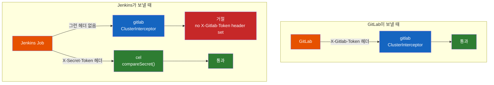
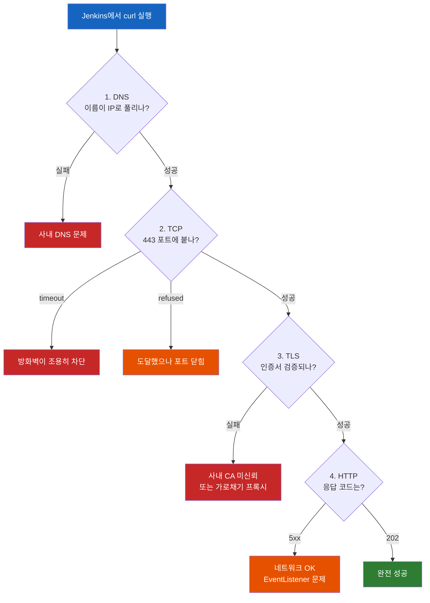
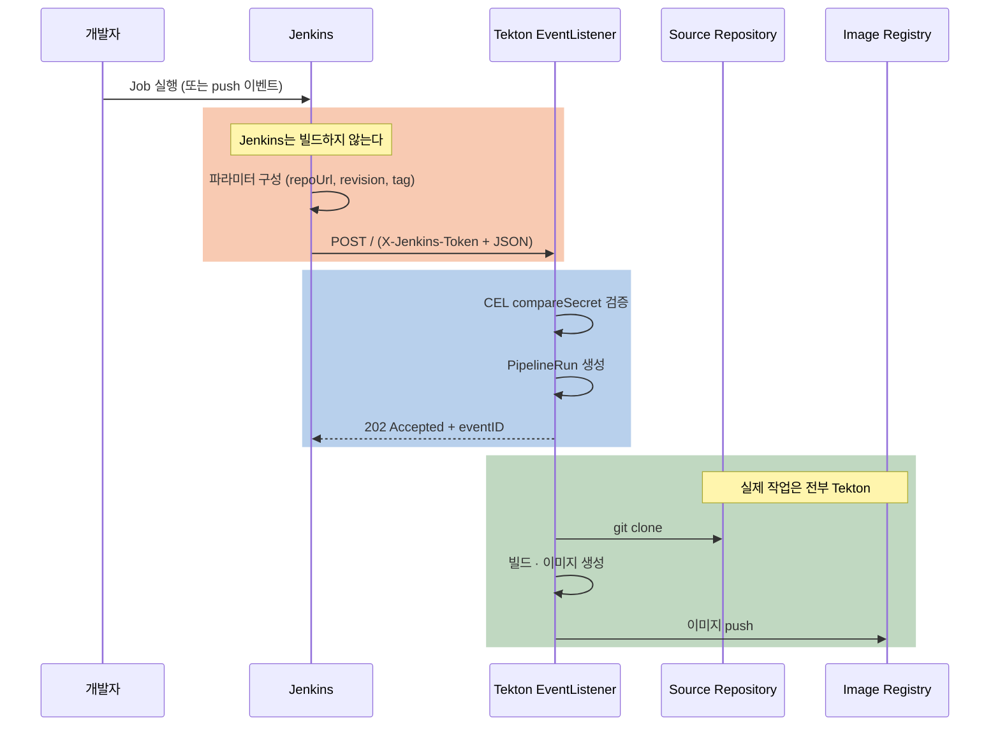

# Jenkins Job에서 Tekton EventListener로 webhook을 쏠 수 있을까?

Tekton EventListener를 띄워놨다. GitLab push는 잘 받는다. 그런데 우리 회사엔 이미 Jenkins가 돌고 있고, Jenkins가 빌드를 끝낸 다음에 Tekton 배포 파이프라인을 이어서 돌리고 싶다. Jenkins가 webhook을 "받는" 건 익숙한데, **보내는** 것도 될까?

## 결론부터 말하면

**된다. 그리고 생각보다 훨씬 시시하다.** webhook은 GitLab이나 GitHub만 쓸 수 있는 특별한 프로토콜이 아니라, **그냥 JSON을 담은 HTTP POST** 다. `curl`을 실행할 수 있는 모든 것이 webhook을 보낼 수 있고, Jenkins Job은 당연히 `curl`을 실행할 수 있다.

**하지만 진짜 문제는 그다음에 있다.** Jenkins가 보낸 POST에는 `X-Gitlab-Token`도 `X-Hub-Signature-256`도 없다. 그래서 **Tekton의 `gitlab`·`github` 인터셉터를 그대로 쓸 수 없다.** 이걸 모르고 기존 Trigger에 Jenkins만 붙이면 요청이 조용히 거절된다. 정답은 **CEL 인터셉터의 `compareSecret`** 이다.



Tekton Triggers의 구성요소(EventListener·Trigger·TriggerBinding·TriggerTemplate·Interceptor)를 아직 모른다면 [Tekton Triggers는 어떻게 git push를 PipelineRun으로 바꿀까](Tekton-Triggers는-어떻게-git-push를-PipelineRun으로-바꿀까.md)를 먼저 읽는 게 좋다. 이 글은 그 위에서 "그럼 GitLab 말고 다른 놈이 쏘면?"을 다룬다.

## 1. 먼저 방향부터 정리하자 — 받는 Jenkins와 보내는 Jenkins

Jenkins와 webhook을 이야기할 때 대화가 자꾸 엇나가는 이유가 있다. **Jenkins는 webhook의 수신자도 되고 발신자도 되는데, 사람들이 이 둘을 섞어서 말하기 때문이다.** 검색해도 대부분 수신자 쪽 이야기만 나온다.

| | **받는 Jenkins** (receiver) | **보내는 Jenkins** (sender) |
|---|---|---|
| 상황 | GitLab이 push하면 Jenkins Job이 돈다 | Jenkins Job이 끝나면 다른 시스템을 깨운다 |
| Jenkins의 역할 | HTTP 서버 | HTTP 클라이언트 |
| 구현 | "Trigger builds remotely" 토큰,<br>Generic Webhook Trigger 플러그인 | `sh 'curl'`, HTTP Request 플러그인 |
| 검색하면 | 자료가 넘친다 | 상대적으로 적다 |

이 글의 주제는 **오른쪽 열** 이다. Jenkins가 Tekton EventListener라는 남의 서버를 두드리는 이야기. 왼쪽 열은 8절에서 대비용으로 짧게 다룬다.

## 2. webhook의 실체 — 특별한 게 아무것도 없다

"webhook을 보낸다"는 말이 거창하게 들리지만, GitLab이 실제로 하는 일을 `curl`로 옮겨 적으면 이게 전부다.

```bash
curl -X POST https://webhook.example.com \
  -H 'Content-Type: application/json' \
  -H 'X-Gitlab-Event: Push Hook' \
  -H 'X-Gitlab-Token: 8f2c1a9e4b7d3f6a0c5e8b1d4f7a2c9e6b3d0f5a' \
  -d '{"ref": "refs/heads/main", "checkout_sha": "3ac79d5..."}'
```

**URL 하나, 헤더 몇 개, JSON body 하나.** 이게 webhook의 전부다. 별도의 핸드셰이크도, 등록 절차도, 전용 포트도 없다. 서버 입장에서는 그냥 평범한 HTTP 요청 하나가 들어온 것이다.

이 사실을 인정하고 나면 질문의 답이 자명해진다. **Jenkins Job은 셸을 실행할 수 있다. 셸에서는 `curl`을 쓸 수 있다. 따라서 Jenkins는 webhook을 보낼 수 있다.** GitLab이 하는 일과 기술적으로 완전히 동일한 일을 한다.

같은 논리로 webhook을 쏠 수 있는 것들: GitHub Actions, GitLab CI, ArgoCD 알림, Prometheus Alertmanager, Grafana, Slack 워크플로, cron, 심지어 개발자의 노트북 터미널. **HTTP POST를 할 수 있으면 전부 발신자가 될 수 있다.**

## 3. Jenkins에서 POST를 쏘는 세 가지 방법

### 3.1 `sh` + `curl` — 가장 단순하고 확실하다

```groovy
pipeline {
    agent any
    stages {
        stage('Trigger Tekton Build') {
            steps {
                sh """
                    curl -X POST https://webhook.example.com \
                      -H 'Content-Type: application/json' \
                      -d '{"repoUrl": "https://gitlab.example.com/team/my-app.git",
                           "revision": "main",
                           "imageTag": "b${env.BUILD_NUMBER}"}'
                """
            }
        }
    }
}
```

의존성이 없고(에이전트에 `curl`만 있으면 된다) 로컬에서 그대로 테스트할 수 있다는 게 장점이다. 단점은 응답 처리와 에러 핸들링을 직접 짜야 한다는 것 — 기본적으로 `curl`은 HTTP 500을 받아도 종료 코드 0을 반환하므로, 실패를 감지하려면 `--fail`이나 `-w '%{http_code}'`를 붙여야 한다.

**그리고 위 예제에는 나중에 고칠 보안 문제가 하나 숨어 있다.** 5절에서 시크릿을 붙일 때 다시 온다.

### 3.2 `httpRequest` — HTTP Request 플러그인

**Manage Jenkins → Plugins** 에서 `HTTP Request Plugin`을 설치하면 `httpRequest` 스텝이 생긴다.

```groovy
stage('Trigger Tekton Deploy') {
    steps {
        script {
            def payload = """
                {
                  "repoUrl": "https://gitlab.example.com/team/my-app.git",
                  "revision": "${params.REVISION}",
                  "imageName": "registry.example.com/my-app",
                  "imageTag": "b${env.BUILD_NUMBER}"
                }
            """
            def response = httpRequest(
                url: 'https://webhook.example.com',
                httpMode: 'POST',
                contentType: 'APPLICATION_JSON',
                acceptType: 'APPLICATION_JSON',
                requestBody: payload,
                validResponseCodes: '200:299',   // 범위 밖이면 빌드 실패
                timeout: 30
            )
            echo "HTTP ${response.status}: ${response.content}"
        }
    }
}
```

`curl`보다 나은 점이 명확하다. `validResponseCodes`로 **응답 코드 검증이 선언적** 이고, `response.status`·`response.content`·`response.headers`로 응답을 구조적으로 다루며, Jenkins 자격증명(Credentials)을 `authentication:`으로 바로 연결할 수 있다. `timeout`도 옵션 하나다.

주의할 점 하나. 플러그인 README에 명시된 대로 **이 스텝은 실행 시 모든 파라미터를 빌드 로그에 남긴다.** 그래서 시크릿을 헤더에 담을 때는 반드시 마스킹해야 한다(5절).

### 3.3 `post` 블록 — 빌드 결과에 따라 다르게 쏘기

빌드가 끝난 뒤 결과에 따라 다른 곳에 알리고 싶다면 `post` 블록이 자연스럽다.

```groovy
pipeline {
    agent any
    stages {
        stage('Build') { steps { sh 'mvn package' } }
    }
    post {
        success {
            // 성공했을 때만 Tekton 배포 파이프라인 트리거
            sh 'curl -sf -X POST https://webhook.example.com -d @payload.json'
        }
        failure {
            // 실패는 Slack으로
            sh 'curl -sf -X POST $SLACK_WEBHOOK -d "{\\"text\\":\\"빌드 실패\\"}"'
        }
        always {
            echo "결과: ${currentBuild.currentResult}"
        }
    }
}
```

### 셋 중 무엇을 쓸까

| 상황 | 선택 |
|------|------|
| 빠르게 확인, 에이전트에 플러그인 못 깜 | `sh` + `curl` |
| 응답 코드 검증·자격증명 연동이 필요 | `httpRequest` |
| 빌드 성공/실패에 따라 분기 | `post` 블록 (안에서 둘 중 하나 사용) |

실무 기본값은 `httpRequest`다. 응답 검증이 선언적이라는 게 생각보다 크다.

## 4. 그 전에 확인할 것: 길이 뚫려 있는가?

`curl` 한 줄이면 된다고 했지만, **사내망에서는 그 한 줄이 나가는 것부터가 일이다.** 특히 금융권처럼 아웃바운드가 기본 차단인 환경에서는 "코드는 맞는데 요청이 안 나간다"가 첫 번째 벽이다.

여기서 중요한 건 **"뚫렸나 안 뚫렸나"가 아니라 "어느 층에서 막혔나"** 를 구분하는 것이다. 층마다 고쳐야 할 사람이 다르기 때문이다.



### 4.1 증상별 원인과 담당

이 표 하나가 이 절의 핵심이다. 에러 메시지만 보고 **누구에게 요청해야 하는지** 를 바로 판단할 수 있다.

| 증상 | 의미 | 조치 주체 |
|------|------|----------|
| `Could not resolve host` | 이름이 IP로 안 풀림 | 사내 DNS |
| `Connection timed out` | **방화벽이 패킷을 조용히 버림(DROP)** — 가장 흔한 차단 방식 | 방화벽 정책 |
| `Connection refused` | 도달은 했으나 포트가 안 열려 있음 | Ingress·Service 설정 (또는 방화벽 REJECT) |
| `SSL certificate problem` | 사내 CA를 신뢰하지 않거나 TLS 가로채기 프록시 존재 | 인증서 배포 |
| `HTTP 502` / `503` | 네트워크는 뚫렸고 Ingress는 살아 있으나 EventListener가 죽음 | Tekton 구성 담당 |
| `HTTP 401` / `403` | 네트워크 정상, **토큰 문제** | 시크릿 교환 |
| `HTTP 202` | 접수 성공 | — |

**`timed out`과 `refused`를 구분하는 게 특히 중요하다.** 앞은 방화벽이 막은 것이고 뒤는 목적지까지 갔다는 뜻이라, 요청할 상대가 완전히 다르다. 이 둘을 뭉뚱그려 "안 됩니다"라고 전달하면 며칠이 날아간다.

### 4.2 점검 스크립트

**일회용 점검 전용 Jenkins Job을 하나 만들어서** 아래를 실행하는 것을 권한다. 실제 연동 파이프라인을 건드리기 전에 결과를 확보할 수 있고, 출력을 그대로 회의 자료로 쓸 수 있다.

```bash
#!/bin/sh
# Tekton EventListener 연결 점검 — Jenkins Job의 sh 스텝에 그대로 붙여 실행
TARGET_HOST="webhook.example.com"
TARGET_PORT="443"
TARGET_URL="https://${TARGET_HOST}"

echo "===== 0. 프록시 설정 ====="
env | grep -i -E 'proxy' || echo "(프록시 환경변수 없음)"

echo "===== 1. 사용 가능한 도구 ====="
for t in curl jq nc openssl getent python3; do
  command -v "$t" >/dev/null 2>&1 && echo "OK   $t" || echo "없음 $t"
done

echo "===== 2. DNS ====="
getent hosts "$TARGET_HOST" || nslookup "$TARGET_HOST" || echo "DNS 실패"

echo "===== 3. TCP 도달성 ====="
if command -v nc >/dev/null 2>&1; then
  nc -z -w 5 -v "$TARGET_HOST" "$TARGET_PORT" 2>&1
else
  # nc가 없을 때 폴백 (bash 필요)
  timeout 5 bash -c "cat < /dev/null > /dev/tcp/${TARGET_HOST}/${TARGET_PORT}" \
    && echo "TCP 연결 성공" || echo "TCP 연결 실패"
fi

echo "===== 4. TLS 인증서 ====="
echo | openssl s_client -connect "${TARGET_HOST}:${TARGET_PORT}" \
  -servername "$TARGET_HOST" 2>&1 \
  | grep -E 'Verify return code|subject=|issuer=' || echo "TLS 확인 불가"

echo "===== 5. HTTP 단계별 소요 시간 ====="
curl -sS -o /dev/null \
  --connect-timeout 10 --max-time 30 \
  -w 'DNS조회 : %{time_namelookup}s
TCP연결 : %{time_connect}s
TLS완료 : %{time_appconnect}s
전체    : %{time_total}s
HTTP    : %{http_code}
' \
  -X POST "$TARGET_URL" \
  -H 'Content-Type: application/json' \
  -d '{}'
```

**5번의 단계별 타이밍이 가장 실용적인 도구다.** 어느 단계에서 멈췄는지가 한눈에 보인다.

- `time_namelookup`만 찍히고 끝났다 → DNS는 됐는데 TCP에서 막힘
- `time_connect`까지 갔는데 `time_appconnect`가 0 → TLS 실패
- 전부 찍히고 `http_code`가 나옴 → 네트워크는 완전히 뚫림

`nc`가 없는 이미지가 흔하므로 폴백을 함께 넣었다. `/dev/tcp`는 bash 기능이라 `sh`에서는 `bash -c`로 감싸야 한다. 둘 다 없다면 `python3 -c "import socket;socket.create_connection(('$TARGET_HOST',$TARGET_PORT),5)"` 로도 확인된다.

### 4.3 프록시를 빼먹으면 오진한다

**0번을 맨 앞에 둔 이유가 있다.** 사내 Jenkins에는 `http_proxy`·`https_proxy` 환경변수가 걸려 있는 경우가 많고, `curl`은 이를 **자동으로 따른다.** 그래서 이런 오진이 생긴다.

- 방화벽은 열렸는데 프록시가 막아서 실패 → "방화벽 안 뚫렸다"고 잘못 보고
- 사내 대상인데 프록시를 타서 실패 → `no_proxy`에 넣었어야 하는 경우

```bash
# 프록시를 무시하고 직접 붙여보기 — 프록시가 원인인지 가르는 실험
curl --noproxy '*' -sS -o /dev/null -w '%{http_code}\n' "$TARGET_URL"
```

이 결과가 위의 5번과 다르다면 **원인은 방화벽이 아니라 프록시다.**

### 4.4 Tekton이 아직 없어도 지금 확인할 수 있다

협의 일정상 네트워크 확인이 먼저 필요한 경우가 많다. **EventListener가 아직 안 떠 있어도 1~4단계(DNS·TCP·TLS)는 그대로 검증된다.** Ingress 호스트까지의 경로가 열려 있는지만 보면 되기 때문이다.

| 확인 항목 | Tekton 준비 전에 가능? |
|-----------|----------------------|
| DNS 해석 | 가능 (DNS 등록만 되어 있으면) |
| TCP 443 도달 | 가능 (Ingress만 떠 있으면) |
| TLS 인증서 | 가능 |
| HTTP 202 응답 | **불가** — Trigger 구성이 있어야 함 |

그래서 순서는 이렇게 잡으면 된다. **네트워크 경로 확인 → 토큰 교환 → Trigger 구성 → 전 구간 검증.** 앞의 두 개는 Tekton 구성과 병렬로 진행할 수 있다.

### 4.5 executor가 있는지부터 확인하려면

3절에서 "최소 실행 주체는 있어야 한다"고 했는데, 그것부터 확인하고 싶다면 30초면 된다. 추측할 필요가 없다.

```groovy
pipeline {
    agent any
    stages {
        stage('환경 확인') {
            steps {
                sh 'echo ok && which curl jq && curl --version | head -1'
            }
        }
    }
}
```

이 Job이 돌면 **executor가 있다는 뜻** 이고, 출력에 `curl` 경로가 찍히면 도구까지 갖춰진 것이다. `jq`는 7절에서 `eventID`를 뽑을 때 쓰이므로 함께 확인해두면 좋다. Job이 큐에 걸린 채 시작조차 안 하면 executor가 없는 것이다.

## 5. 그런데 여기서 진짜 문제가 시작된다 — 인증

여기까지는 쉬웠다. 이제 Tekton 쪽에 이 Jenkins 요청을 받을 Trigger를 만들어야 하는데, **기존 GitLab용 Trigger에 그냥 붙이면 안 된다.**

기존 Trigger는 이렇게 생겼다.

```yaml
interceptors:
  - ref: { name: "gitlab", kind: ClusterInterceptor }
    params:
      - name: "secretRef"
        value: { secretName: gitlab-webhook-secret, secretKey: token }
```

`gitlab` 인터셉터는 **`X-Gitlab-Token` 헤더를 읽어서 Secret과 문자열 비교** 한다. Jenkins의 `curl`에는 그런 헤더가 없다. 그래서 EventListener 로그에 이게 찍히고 요청은 버려진다.

```
no X-Gitlab-Token header set
```

**정리하면 이렇다.** `github`·`gitlab`·`bitbucket` 인터셉터는 각 플랫폼이 보내는 **고유한 헤더 형식** 에 묶여 있다. Git 호스팅이 아닌 발신자(Jenkins, Alertmanager, 내부 스크립트)에게는 애초에 맞지 않는 도구다.

선택지는 세 가지다.

| 방법 | 어떻게 | 평가 |
|------|--------|------|
| (a) GitLab 흉내내기 | `X-Gitlab-Token`·`X-Gitlab-Event` 헤더를 Jenkins가 직접 붙임 | 동작은 한다. 하지만 GitLab이 아닌 것을 GitLab인 척하게 만드는 거짓말이라, 나중에 로그를 보는 사람이 반드시 헷갈린다 |
| (b) **CEL `compareSecret`** | 임의의 헤더를 Secret과 상수시간 비교 | **권장.** 발신자가 Jenkins임이 설정에 그대로 드러난다 |
| (c) Webhook 인터셉터 | 외부 Service로 payload를 넘겨 커스텀 검증 | 서명 검증 등 복잡한 로직이 필요할 때만. `v1alpha1` 레거시 방식 |

### CEL `compareSecret`이 정답인 이유

Tekton의 CEL 인터셉터에는 시크릿 비교 전용 함수가 있다.

```
<string>.compareSecret(<secretKey>, <secretName>) -> bool
```

이 함수는 **Kubernetes Secret에서 값을 읽어 상수시간(constant-time)으로 비교** 한다. 상수시간 비교는 문자열이 몇 글자째부터 틀렸는지를 응답 시간 차이로 추측하는 타이밍 공격을 막는다. `filter` 안에서 단순히 `header.canonical('X-Token') == 'abc'`라고 쓰면 이 보호가 없다.

```yaml
interceptors:
  - name: "Jenkins가 보낸 게 맞는지 확인"
    ref: { name: "cel", kind: ClusterInterceptor }
    params:
      - name: "filter"
        value: >
          header.canonical('X-Jenkins-Token')
            .compareSecret('token', 'jenkins-webhook-secret')
```

`header.canonical()`은 Go의 HTTP 헤더 표준 표기법(`x-jenkins-token` → `X-Jenkins-Token`)으로 정규화해서 읽는다. HTTP 헤더 이름은 대소문자를 구분하지 않는데 Tekton의 `$(header.X)` 접근은 구분하므로, 인터셉터에서는 `canonical()`을 쓰는 게 안전하다.

**인자 순서를 반드시 확인하고 넘어가자. 이름이 아니라 키가 먼저다.**

```
header.canonical('X-Jenkins-Token').compareSecret('token', 'jenkins-webhook-secret')
                                                   ↑ key    ↑ Secret 이름
```

대부분의 API가 `(이름, 키)` 순서를 쓰기 때문에 반대로 적기 쉽다. 순서를 바꿔 쓰면 `token`이라는 이름의 Secret에서 `jenkins-webhook-secret`이라는 키를 찾게 되고, 당연히 검증에 실패한다. Tekton 소스(`pkg/interceptors/cel/triggers.go`)의 구현이 근거다.

```go
secretKey, ok := vals[1].(types.String)   // 첫 번째 인자 = 키
secretName, ok := vals[2].(types.String)  // 두 번째 인자 = Secret 이름
secretRef := &triggersv1.SecretRef{
    SecretKey:  string(secretKey),
    SecretName: string(secretName),
}
```

2-인자 형태는 **EventListener와 같은 네임스페이스** 의 Secret을 찾는다. 다른 네임스페이스라면 3-인자 형태(`compareSecret(key, name, namespace)`)를 쓴다.

## 6. 전체 예제: Jenkins는 방아쇠만, Tekton이 빌드한다

가장 현실적인 시나리오로 조립해보자. **Jenkins에 빌드용 Agent가 없어서, Jenkins는 "이 저장소를 빌드해줘"라고 요청만 보내고 소스 clone·빌드·이미지 push는 전부 Tekton이 한다.** 왜 이런 구조가 나오는지는 [Jenkins가 있는데 왜 Tekton이 빌드할까](Jenkins가-있는데-왜-Tekton이-빌드할까.md)에서 다뤘다.

**여기서 payload의 내용이 결정된다. Jenkins는 이미지를 넘기지 않는다 — 아직 만들지 않았으니까.** 넘기는 것은 **소스의 주소**(저장소 URL + 커밋)와 **만들어야 할 이미지의 이름** 이다. 이 방향을 거꾸로 잡으면 전체 설계가 어긋난다.



### 6.1 Tekton 쪽

```yaml
# 시크릿 — openssl rand -hex 24 로 생성
apiVersion: v1
kind: Secret
metadata:
  name: jenkins-webhook-secret
  namespace: ci
type: Opaque
stringData:
  token: "d4f8a1c7e2b9d6f3a0c5e8b1d4f7a2c9e6b3d0f5a8c1e4b7"
---
apiVersion: triggers.tekton.dev/v1beta1
kind: TriggerBinding
metadata:
  name: jenkins-build-binding
  namespace: ci
spec:
  params:
    # 소스의 "주소" — 소스 자체가 아니다
    - name: repo-url
      value: $(body.repoUrl)
    - name: revision
      value: $(body.revision)
    # 만들어야 할 이미지의 "이름" — 이미지 자체가 아니다
    - name: image-name
      value: $(body.imageName)
    - name: image-tag
      value: $(body.imageTag)
    - name: jenkins-build-url
      value: $(body.buildUrl)        # 나중에 추적용
---
apiVersion: triggers.tekton.dev/v1beta1
kind: TriggerTemplate
metadata:
  name: build-template
  namespace: ci
spec:
  params:
    - name: repo-url
    - name: revision
      default: main
    - name: image-name
    - name: image-tag
    - name: jenkins-build-url
      default: ""
  resourcetemplates:
    - apiVersion: tekton.dev/v1
      kind: PipelineRun
      metadata:
        generateName: build-
        annotations:
          # 어느 Jenkins 빌드에서 왔는지 남겨둔다 — 장애 추적에 큰 도움
          ci.example.com/jenkins-build: $(tt.params.jenkins-build-url)
      spec:
        pipelineRef:
          name: build-and-push-pipeline    # clone → build → push
        params:
          - name: repo-url
            value: $(tt.params.repo-url)
          - name: revision
            value: $(tt.params.revision)
          - name: image
            value: $(tt.params.image-name):$(tt.params.image-tag)
        # Tekton이 소스를 clone하므로 작업 공간이 필요하다
        workspaces:
          - name: source
            volumeClaimTemplate:
              spec:
                accessModes: ["ReadWriteOnce"]
                resources: { requests: { storage: 2Gi } }
          # Git 자격증명과 레지스트리 인증도 Tekton 쪽에 붙는다
          - name: git-credentials
            secret:
              secretName: git-ssh-key
          - name: docker-config
            secret:
              secretName: registry-credentials
---
apiVersion: triggers.tekton.dev/v1beta1
kind: Trigger
metadata:
  name: build-from-jenkins
  namespace: ci
spec:
  serviceAccountName: tekton-triggers-sa
  interceptors:
    - name: "Jenkins 인증"
      ref: { name: "cel", kind: ClusterInterceptor }
      params:
        - name: "filter"
          value: >
            header.canonical('X-Jenkins-Token')
              .compareSecret('token', 'jenkins-webhook-secret')
    - name: "필수 필드 검증"
      ref: { name: "cel", kind: ClusterInterceptor }
      params:
        - name: "filter"
          value: >
            has(body.repoUrl) &&
            has(body.revision) &&
            has(body.imageName) &&
            body.repoUrl.startsWith('https://gitlab.example.com/')
  bindings:
    - ref: jenkins-build-binding
  template:
    ref: build-template
---
apiVersion: triggers.tekton.dev/v1beta1
kind: EventListener
metadata:
  name: jenkins-listener
  namespace: ci
spec:
  serviceAccountName: tekton-triggers-sa
  triggers:
    - triggerRef: build-from-jenkins
```

**두 가지를 눈여겨보자.**

첫째, **TriggerTemplate에 `workspaces`와 자격증명 Secret이 붙어 있다.** Jenkins가 빌드했다면 필요 없었을 것들이다. Tekton이 직접 `git clone`하고 이미지를 push하므로, **Git 자격증명과 레지스트리 인증 정보가 Tekton 쪽에 있어야 한다.** 준비물 목록을 만들 때 이 항목들이 Jenkins가 아니라 Kubernetes 쪽에 잡히는 이유다.

둘째, 마지막 인터셉터의 `startsWith` 검사다. **발신자가 Git 호스팅이 아니면 payload 형식을 보장해주는 주체가 없다.** GitLab이라면 스키마가 고정돼 있지만, Jenkins가 보내는 JSON은 우리가 Jenkinsfile에서 만든 것이라 오타 하나로 형태가 달라진다. 게다가 `repoUrl`을 그대로 clone하는 구조이므로, **검증 없이 두면 토큰을 아는 사람이 임의의 저장소를 클러스터 안에서 빌드시킬 수 있다.** 허용 저장소를 접두사로 제한하는 것이 최소한의 방어다.

### 6.2 Jenkins 쪽 — 시크릿을 안전하게 다루기

여기가 이 문서에서 가장 조심해야 할 부분이다. **잘못 쓰면 토큰이 빌드 로그에 그대로 남는다.**

먼저 Jenkins에 자격증명을 등록한다. **Manage Jenkins → Credentials → System → Global credentials → Add Credentials** 에서 Kind를 `Secret text`로 골라 위 Secret과 같은 값을 넣고, ID를 `tekton-webhook-token`으로 준다.

```groovy
pipeline {
    agent any
    parameters {
        string(name: 'REVISION', defaultValue: 'main',
               description: '빌드할 브랜치 또는 커밋 해시')
    }
    environment {
        REPO_URL   = 'https://gitlab.example.com/code-serving/my-app.git'
        IMAGE_NAME = 'registry.example.com/code-serving/my-app'
        TEKTON_URL = 'https://webhook.example.com'
    }
    stages {
        // 빌드 stage가 없다. Jenkins는 빌드하지 않는다.
        stage('Trigger Tekton Build') {
            steps {
                withCredentials([string(credentialsId: 'tekton-webhook-token',
                                        variable: 'TEKTON_TOKEN')]) {
                    // JSON은 Groovy가 만들어 파일로 떨군다 — 셸 이스케이프 문제를 원천 차단
                    writeJSON file: 'tekton-payload.json', json: [
                        repoUrl  : env.REPO_URL,             // 소스의 주소
                        revision : params.REVISION,          // 어느 시점을
                        imageName: env.IMAGE_NAME,           // 무슨 이름으로
                        imageTag : "b${env.BUILD_NUMBER}",   // 어떤 태그로
                        buildUrl : env.BUILD_URL             // 추적용
                    ]
                    // 홑따옴표(''')가 핵심이다 — 아래 설명 참조
                    sh '''
                        curl --fail --silent --show-error \
                          -X POST "$TEKTON_URL" \
                          -H 'Content-Type: application/json' \
                          -H "X-Jenkins-Token: $TEKTON_TOKEN" \
                          --data @tekton-payload.json
                    '''
                }
            }
        }
    }
}
```

**stage가 하나뿐이라는 게 이 구조의 핵심이다.** `mvn package`도, `docker build`도, `docker push`도 없다. Jenkins가 하는 일은 **파라미터를 조립해 HTTP 요청 한 번 보내는 것** 이 전부이고, 그래서 빌드 도구가 설치된 Agent 없이도 돌아간다.

payload의 네 필드가 5.1의 `TriggerBinding`·CEL 필터와 정확히 대응한다는 점도 확인하자. `repoUrl`·`revision`·`imageName`이 빠지면 인터셉터가 걸러낸다.

`writeJSON`은 Pipeline Utility Steps 플러그인이 제공한다. **JSON을 문자열로 조립하지 않는 것이 요령이다.** 커밋 메시지나 브랜치 이름에 따옴표가 하나 들어가는 순간 payload가 깨지는데, 그 버그는 재현이 잘 안 돼서 오래 산다. Groovy 맵으로 넘기면 직렬화는 플러그인이 책임진다.

**한 가지 더 알아둘 것.** 위 `sh '''...'''` 블록의 줄 끝 `\`는 셸의 줄 연결 기호처럼 보이지만, 실제로는 **Groovy가 먼저 소비한다.** 삼중 홑따옴표 문자열도 이스케이프 시퀀스는 처리하기 때문이다. 결과적으로 셸에는 한 줄짜리 명령이 도착하고 `curl`은 정상 동작하지만, "셸이 줄을 잇는다"고 이해하면 나중에 헷갈린다. 헷갈리기 싫다면 아예 한 줄로 쓰거나, 아래처럼 셸 배열 없이 단순하게 유지하는 편이 낫다.

**왜 홑따옴표 `'''`인가?** 이게 Jenkins Pipeline에서 시크릿을 다룰 때 가장 흔한 사고 지점이다.

```groovy
// 위험: 쌍따옴표 → Groovy가 먼저 문자열을 조립한다
sh """
    curl -H "X-Jenkins-Token: ${TEKTON_TOKEN}"
"""
```

쌍따옴표를 쓰면 **셸이 실행되기 전에 Groovy가 `${TEKTON_TOKEN}`을 실제 토큰 값으로 치환** 한다. 그 결과 토큰이 박힌 완성된 명령 문자열이 만들어지고, 이건 빌드 로그와 프로세스 목록(`ps`)에 노출될 수 있다. Jenkins도 이 경우 "Warning: A secret was passed to sh using Groovy String interpolation"이라고 경고를 띄운다.

홑따옴표를 쓰면 Groovy는 `$TEKTON_TOKEN`을 그냥 글자로 넘기고, **셸이 자기 환경변수로 확장** 한다. `withCredentials`가 그 환경변수를 마스킹해두므로 로그에는 `****`로 찍힌다. **원칙: 시크릿이 들어가는 `sh`는 항상 홑따옴표.**

다만 이것이 막아주는 것은 **빌드 로그 노출** 까지다. 셸이 확장한 뒤에는 토큰이 `curl` 프로세스의 실행 인자(argv)에 담기므로, 같은 노드에서 `ps`를 볼 수 있는 사람에게는 여전히 보인다. 이 수준까지 막아야 하는 환경이라면 토큰을 명령행 인자로 넘기지 않는 방식(`httpRequest`의 `maskValue`, 또는 `curl --config`로 헤더를 파일에서 읽기)을 검토한다.

`httpRequest`를 쓴다면 `maskValue`로 같은 목적을 달성한다.

```groovy
withCredentials([string(credentialsId: 'tekton-webhook-token', variable: 'TEKTON_TOKEN')]) {
    httpRequest(
        url: env.TEKTON_URL,
        httpMode: 'POST',
        contentType: 'APPLICATION_JSON',
        customHeaders: [[name: 'X-Jenkins-Token',
                         value: env.TEKTON_TOKEN,
                         maskValue: true]],        // 로그에 ****로 표시
        requestBody: writeJSON(returnText: true, json: [
            repoUrl  : env.REPO_URL,
            revision : params.REVISION,
            imageName: env.IMAGE_NAME,
            imageTag : "b${env.BUILD_NUMBER}",
            buildUrl : env.BUILD_URL
        ]),
        validResponseCodes: '200:299'
    )
}
```

`writeJSON(returnText: true, ...)`은 Pipeline Utility Steps 플러그인이 제공하며, **문자열 템플릿으로 JSON을 조립할 때 생기는 이스케이프 사고를 없애준다.** 커밋 메시지에 따옴표가 들어 있어서 JSON이 깨지는 종류의 버그를 원천 차단한다.

## 7. 202를 받았다고 배포가 시작된 건 아니다

Jenkins 로그에 `HTTP 202`가 찍혔다. 성공인가? **아니다.**

[Triggers 문서에서 다뤘듯이](Tekton-Triggers는-어떻게-git-push를-PipelineRun으로-바꿀까.md) EventListener의 `202 Accepted`는 "요청을 접수하고 처리할 Trigger를 골랐다"는 뜻이지, PipelineRun이 만들어졌다는 보장이 아니다. CEL filter가 걸러내도 202, TriggerTemplate에 오류가 있어 생성에 실패해도 202가 나간다.

Jenkins 파이프라인이 "배포 트리거 완료"라고 초록불을 켰는데 실제로는 아무것도 안 돌고 있는 상황 — 이게 이 구조에서 가장 위험한 실패 모드다. 아무도 모른 채로 지나간다.

선택지는 세 가지다.

**(a) Jenkins 에이전트에 클러스터 접근 권한이 있다면 — `eventID`로 확정 확인한다.** 가장 확실한 방법이다.

```groovy
stage('Trigger Tekton Build') {
    steps {
        withCredentials([string(credentialsId: 'tekton-webhook-token',
                                variable: 'TEKTON_TOKEN')]) {
            script {
                writeJSON file: 'tekton-payload.json', json: [
                    repoUrl  : env.REPO_URL,
                    revision : params.REVISION,
                    imageName: env.IMAGE_NAME,
                    imageTag : "b${env.BUILD_NUMBER}",
                    buildUrl : env.BUILD_URL
                ]
                // 1. POST하고 eventID를 받는다
                def eventId = sh(returnStdout: true, script: '''
                    curl --fail --silent -X POST "$TEKTON_URL" \
                      -H 'Content-Type: application/json' \
                      -H "X-Jenkins-Token: $TEKTON_TOKEN" \
                      --data @tekton-payload.json \
                    | jq -r .eventID
                ''').trim()

                echo "eventID: ${eventId}"

                // 2. 그 eventID label을 가진 PipelineRun이 실제로 생겼는지 확인
                //    EventListener는 만든 리소스에 이 label을 자동으로 붙인다
                timeout(time: 2, unit: 'MINUTES') {
                    waitUntil {
                        def found = sh(returnStdout: true, script: """
                            kubectl get pipelinerun -n ci \
                              -l triggers.tekton.dev/triggers-eventid=${eventId} \
                              -o name | head -1
                        """).trim()
                        if (found) { echo "생성 확인: ${found}" }
                        return found != ''
                    }
                }
            }
        }
    }
}
```

`triggers.tekton.dev/triggers-eventid`는 EventListener가 자기가 만든 모든 리소스에 자동으로 붙이는 label이다. 이게 없다면 이 요청은 PipelineRun을 만들지 못한 것이다.

다만 이 방법은 **Jenkins에 클러스터 조회 권한을 주는 대가** 를 치른다. 그렇다면 딱 필요한 만큼만 준다 — 해당 네임스페이스의 `pipelineruns`에 대한 `get`/`list`/`watch`가 전부다.

```yaml
apiVersion: rbac.authorization.k8s.io/v1
kind: Role
metadata:
  name: jenkins-pipelinerun-reader
  namespace: ci
rules:
  - apiGroups: ["tekton.dev"]
    resources: ["pipelineruns"]
    verbs: ["get", "list", "watch"]     # 생성·삭제 권한은 주지 않는다
```

**(b) 클러스터 접근이 없다면 — Tekton이 Jenkins로 되알린다 (콜백 패턴).** 보안 정책상 Jenkins 에이전트에 `kubeconfig`를 주지 않는 조직이 많다. 이때는 방향을 뒤집어서, **배포 파이프라인의 `finally`가 결과를 Jenkins로 POST** 하게 만든다. `finally`는 성공·실패와 무관하게 항상 실행되므로 알림 용도에 정확히 맞는다.

받는 창구는 이미 8.3절에서 본 Generic Webhook Trigger다. 두 문서가 여기서 한 바퀴 돌아 만난다.

```yaml
apiVersion: tekton.dev/v1
kind: Pipeline
metadata:
  name: deploy-pipeline
  namespace: ci
spec:
  params:
    - name: image
    - name: app-name
  tasks:
    - name: deploy
      taskRef: { name: kubectl-apply }
      params:
        - name: image
          value: $(params.image)
  finally:
    - name: notify-jenkins           # 성공하든 실패하든 항상 실행
      taskRef: { name: notify-jenkins }
      params:
        - name: status
          # Pipeline 전체의 집계 상태: Succeeded / Failed / Completed / None
          value: $(tasks.status)
        - name: app-name
          value: $(params.app-name)
---
apiVersion: tekton.dev/v1
kind: Task
metadata:
  name: notify-jenkins
  namespace: ci
spec:
  params:
    - name: status
    - name: app-name
  steps:
    - name: post
      image: curlimages/curl:8.11.0
      env:
        - name: JENKINS_TOKEN
          valueFrom:
            secretKeyRef:
              name: jenkins-generic-trigger-secret
              key: token
      script: |
        #!/bin/sh
        curl --fail --silent --show-error \
          -X POST "https://jenkins.example.com/generic-webhook-trigger/invoke" \
          -H "token: $JENKINS_TOKEN" \
          -H 'Content-Type: application/json' \
          -d "{
                \"app\": \"$(params.app-name)\",
                \"deployStatus\": \"$(params.status)\"
              }"
```

`$(tasks.status)`는 `finally` 안에서만 쓸 수 있는 변수로, 앞선 `tasks`들의 **집계 실행 상태(Aggregate Execution Status)** 를 담는다. 네 가지 값이 있는데, **`Completed`를 "일부 실패"로 오해하기 쉬우니 주의** 한다.

| 값 | 의미 |
|----|------|
| `Succeeded` | 모든 Task가 성공했다 |
| `Failed` | **하나 이상의 Task가 실패했다** |
| `Completed` | 모든 Task가 성공했으나, **그중 하나 이상이 skip** 되었다 (실패 아님) |
| `None` | 위 어디에도 해당하지 않음 — pending·running·cancelled·timeout 상태의 Task가 있다 |

즉 실패 판정은 `Failed` 하나뿐이다. `Completed`는 `when` 조건 때문에 건너뛴 Task가 섞였을 뿐 **성공 계열** 이다. 알림 로직을 짤 때 `Completed`를 경고로 처리하면 정상 실행에 매번 빨간불이 켜진다.

참고로 개별 Task 상태를 보는 `$(tasks.<이름>.status)`는 `Succeeded`·`Failed`·`None` 세 가지뿐이다 — `Completed`는 집계 상태에만 존재한다.

**이 구조의 장점은 권한 분리에 있다.** Jenkins에 `kubeconfig`나 Kubernetes API 권한을 전혀 주지 않고도 배포 결과를 실시간으로 받는다.

다만 **네트워크 요건은 오히려 늘어난다는 점을 분명히 하자.** 콜백은 이름 그대로 되돌아오는 호출이므로, HTTP 경로가 양방향으로 열려야 한다.

| 방향 | 무엇이 필요한가 |
|------|----------------|
| Jenkins → EventListener | Jenkins 에이전트가 `webhook.example.com`에 도달 가능 |
| Tekton → Jenkins | **파이프라인 Pod가 `jenkins.example.com`에 도달 가능** |

즉 "Jenkins가 클러스터를 몰라도 된다"는 것은 **Kubernetes API 권한** 이야기지 네트워크 이야기가 아니다. 사내망 방화벽이나 `NetworkPolicy`로 egress를 막아둔 클러스터라면 두 번째 행이 걸린다. 그리고 두 시스템이 서로를 호출하므로 **양쪽 시크릿을 모두 관리해야 한다.**

**(c) fire-and-forget을 의식적으로 선택한다.** 확인을 포기하되, **"Jenkins 초록불 = 배포 시작 아님"을 팀에 명시** 하고 Tekton 쪽 알림에 의존한다. 나쁜 선택은 아니지만, 이걸 모른 채로 (c) 상태에 있는 것이 문제다.

| | Jenkins의 클러스터 권한 | 결과 확인 시점 | 관리할 시크릿 |
|---|---|---|---|
| (a) eventID 폴링 | 필요 (읽기 전용) | 생성 직후 | Tekton 방향 1개 |
| (b) 콜백 | 불필요 | 배포 완료 시 | 양방향 2개 |
| (c) fire-and-forget | 불필요 | 확인 안 함 | Tekton 방향 1개 |

## 8. 반대 방향: 외부에서 Jenkins Job을 트리거하기

대비를 위해 왼쪽 열도 짧게 보자. Tekton 파이프라인이 끝난 뒤 Jenkins Job을 깨우고 싶을 때다.

### 8.1 "Trigger builds remotely" 토큰

Job 설정의 **Build Triggers → Trigger builds remotely (e.g., from scripts)** 를 켜고 토큰을 정한다.

```bash
# 파라미터 없는 Job
curl -X POST "https://jenkins.example.com/job/deploy/build?token=MY_JOB_TOKEN"

# 파라미터 있는 Job
curl -X POST "https://jenkins.example.com/job/deploy/buildWithParameters?token=MY_JOB_TOKEN&ENV=staging&VERSION=42"
```

이 방식의 실용적 장점은 **CSRF crumb이 필요 없다는 것** 이다. Job 단위 토큰은 CSRF 보호를 우회하도록 설계돼 있다. 단점은 정확히 같은 이유로 **Job 이름과 토큰만 알면 누구나 실행할 수 있다** 는 점이다. 토큰을 충분히 길게 만들고 유출에 주의해야 한다.

### 8.2 사용자 API 토큰

사용자 계정 + API 토큰(User → Configure → API Token)으로 인증하는 방식이다.

```bash
curl -X POST "https://jenkins.example.com/job/deploy/build" \
  --user "ci-bot:11a2b3c4d5e6f7890abcdef123456789ab"
```

**여기서 CSRF crumb 이야기가 나온다.** Jenkins 2.176.2부터 API 토큰은 기본적으로 CSRF 검사에서 면제되므로 위 명령이 그대로 동작하는 경우가 많다. 하지만 **strict crumb issuer 같은 설정을 쓰는 인스턴스에서는 `403 No valid crumb was included in the request`가 나온다.** 이 경우 crumb을 먼저 받아 헤더에 실어야 한다.

```bash
CRUMB=$(curl -s --user "ci-bot:TOKEN" \
  "https://jenkins.example.com/crumbIssuer/api/json" | jq -r .crumb)

curl -X POST "https://jenkins.example.com/job/deploy/build" \
  --user "ci-bot:TOKEN" \
  -H "Jenkins-Crumb: ${CRUMB}"
```

403이 나오면 이걸 의심하면 된다. 결론적으로 **인스턴스 설정에 따라 다르므로 실제로 쏴보고 확인해야 한다.**

### 8.3 Generic Webhook Trigger 플러그인

임의의 JSON payload를 받아 그 내용에서 값을 뽑아 빌드 파라미터로 쓰고 싶다면 이 플러그인이 답이다. **역할이 Tekton의 TriggerBinding과 거의 같다.**

```groovy
pipeline {
    agent any
    triggers {
        GenericTrigger(
            genericVariables: [
                [key: 'image',  value: '$.image'],        // JSONPath로 추출
                [key: 'appName', value: '$.app']
            ],
            token: 'my-secret-token',
            regexpFilterText: '$appName',
            regexpFilterExpression: '^(my-app|other-app)$'   // 필터링
        )
    }
    stages {
        stage('Deploy') {
            steps { echo "배포: ${image}" }
        }
    }
}
```

엔드포인트는 `JENKINS_URL/generic-webhook-trigger/invoke`이고, 토큰은 쿼리 파라미터·`token` 헤더·`Authorization: Bearer` 중 아무 방식으로나 줄 수 있다.

```bash
curl -X POST "https://jenkins.example.com/generic-webhook-trigger/invoke" \
  -H 'token: my-secret-token' \
  -H 'Content-Type: application/json' \
  -d '{"image": "registry.example.com/my-app:42", "app": "my-app"}'
```

**대응 관계를 보면 두 시스템이 같은 문제를 같은 방식으로 풀었다는 게 보인다.**

| Tekton Triggers | Generic Webhook Trigger |
|-----------------|-------------------------|
| `EventListener` (엔드포인트) | `/generic-webhook-trigger/invoke` |
| `TriggerBinding` (`$(body.x)`) | `genericVariables` (JSONPath `$.x`) |
| CEL `filter` | `regexpFilterText` / `regexpFilterExpression` |
| CEL `compareSecret` | `token` 파라미터 |
| `TriggerTemplate` → PipelineRun | Job 자체 + 빌드 파라미터 |

## 9. 정리

### 핵심 포인트

1. **webhook은 그냥 HTTP POST다 — Jenkins Job은 당연히 보낼 수 있다**
   - GitLab이 하는 일의 실체는 URL 하나, 헤더 몇 개, JSON body 하나짜리 `curl`이다. 전용 프로토콜이 아니므로 `curl`을 실행할 수 있는 모든 것(Jenkins, Alertmanager, GitHub Actions, 터미널)이 발신자가 될 수 있다.

2. **하지만 `gitlab`·`github` 인터셉터는 Jenkins에게 맞지 않는다 — CEL `compareSecret`을 쓴다**
   - 이 인터셉터들은 각 플랫폼 고유 헤더(`X-Gitlab-Token`, `X-Hub-Signature-256`)에 묶여 있어서, Jenkins 요청은 `no X-Gitlab-Token header set`으로 거절된다. `header.canonical('X-Jenkins-Token').compareSecret('token', 'secret-name')`이 정답이며, 상수시간 비교로 타이밍 공격까지 막아준다. GitLab 헤더를 흉내내는 건 동작은 해도 로그를 보는 사람을 속이는 일이다.

3. **받는 Jenkins와 보내는 Jenkins를 섞지 마라**
   - 받는 쪽은 "Trigger builds remotely" 토큰(CSRF 면제)이나 Generic Webhook Trigger 플러그인. 보내는 쪽은 `sh 'curl'`이나 `httpRequest` 스텝. 검색 결과 대부분이 받는 쪽 이야기라 헷갈리기 쉽다.

4. **시크릿이 들어가는 `sh`는 반드시 홑따옴표로 쓴다**
   - 쌍따옴표 `"""`는 Groovy가 먼저 토큰을 문자열에 박아 넣어 빌드 로그와 `ps`에 노출시킨다. 홑따옴표 `'''`를 쓰면 셸이 환경변수를 확장하고 `withCredentials`의 마스킹이 살아난다. `httpRequest`라면 `customHeaders`에 `maskValue: true`.

5. **202를 성공으로 읽으면 조용히 실패한다**
   - 인터셉터에 걸려도, PipelineRun 생성에 실패해도 202가 나간다. Jenkins가 초록불인데 배포는 시작조차 안 된 상태가 만들어진다. 응답의 `eventID`를 `triggers.tekton.dev/triggers-eventid` label로 조회해 확정하거나, Tekton이 되알리게 하거나, 최소한 "확인하지 않고 있다"는 사실을 팀이 알아야 한다.

---

## 출처

- [Tekton Triggers CEL Expressions](https://tekton.dev/docs/triggers/cel_expressions/) - `compareSecret`, `header.canonical`, cel-go 확장 함수 목록
- [Tekton Interceptors](https://tekton.dev/docs/triggers/interceptors/) - github/gitlab/cel 인터셉터 파라미터와 Webhook 인터셉터
- [Tekton EventListeners](https://tekton.dev/docs/triggers/eventlisteners/) - 202 응답 정의, `triggers.tekton.dev/triggers-eventid` label
- [tektoncd/triggers - gitlab.go 소스](https://github.com/tektoncd/triggers/blob/main/pkg/interceptors/gitlab/gitlab.go) - `X-Gitlab-Token` 평문 비교 구현
- [Jenkins HTTP Request Plugin](https://github.com/jenkinsci/http-request-plugin/blob/master/README.adoc) - `httpRequest` 파라미터, `maskValue`, 파라미터 로깅 경고
- [Jenkins Generic Webhook Trigger Plugin](https://plugins.jenkins.io/generic-webhook-trigger/) - JSONPath 추출, token 전달 방식, regexp 필터
- [Build Triggers in Jenkins 정리](https://www.drizz.dev/post/build-triggers-in-jenkins) - remote trigger 토큰과 활용 사례
- [Trigger Jenkins Job (GitHub Action) 문서](https://github.com/marketplace/actions/trigger-jenkins-job) - job 토큰의 CSRF 우회, API 토큰의 crumb 요구 차이
- [GitLab Webhooks 문서](https://docs.gitlab.com/user/project/integrations/webhooks/) - webhook 헤더 구성
