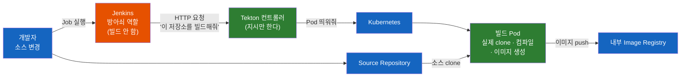
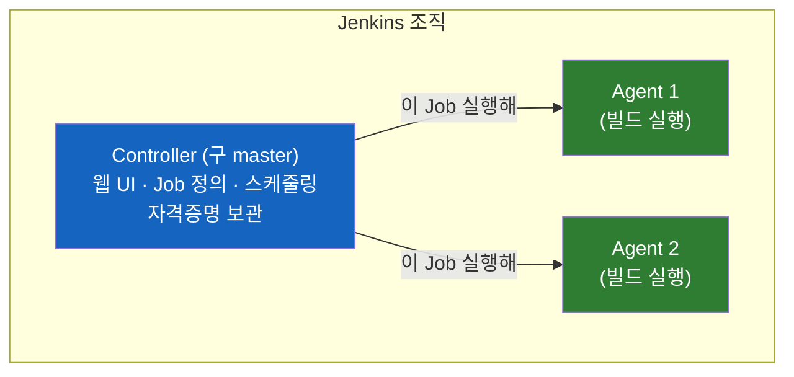
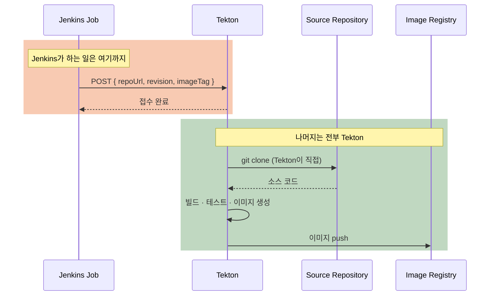
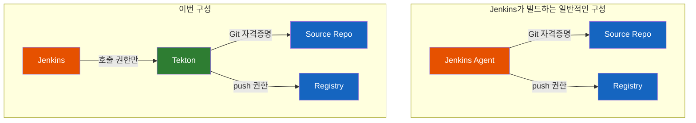

# Jenkins가 있는데 왜 Tekton이 빌드할까?

회사에는 이미 Jenkins가 잘 돌고 있다. 그런데 새로 만드는 CI/CD 구성을 보면 **Jenkins는 실행 버튼만 누르고, 빌드는 Tekton 쪽에서 일어난다.** 왜 굳이 두 개를 쓸까? Jenkins가 그냥 다 하면 안 되나?

## 0. 먼저: Tekton이 대체 뭐하는 물건인가?

본론에 들어가기 전에 세 가지 질문부터 답하고 가자. 이 순서 그대로 질문받게 된다.

### "Tekton이 뭐예요?"

**Kubernetes에게 "이런 순서로 빌드해줘"라고 시키는 도구다.**

조금 더 정확히 말하면 — **Tekton은 혼자 도는 서버 프로그램이 아니다.** 설치하면 Kubernetes에 두 가지가 생긴다.

1. **새로운 어휘.** `kubectl get pipeline`, `kubectl get pipelinerun` 같은 명령이 동작하게 된다. Kubernetes가 원래 모르던 `Pipeline`·`Task` 같은 단어를 알아듣게 만드는 것이다. (이렇게 어휘를 늘리는 방식을 **CRD** 라고 부른다)
2. **감시자.** 그 어휘로 만들어진 것들을 지켜보다가 실제로 일을 벌이는 프로그램. (이걸 **컨트롤러** 라고 부른다)

즉 Tekton을 설치한다는 것은 **Kubernetes에 "빌드"라는 말을 가르치고, 그 말을 알아듣는 직원 하나를 붙이는 일** 이다.

### "그래서 뭐하는 애예요?"

**빌드를 직접 하지 않는다. 빌드할 Pod를 띄운다.**

이 구분이 이 문서 전체에서 가장 중요하다. 순서를 따라가 보자.

1. 우리가 "이 저장소를 빌드해줘"라고 요청한다
2. **Tekton 컨트롤러** 가 그걸 보고 Pod를 만들어달라고 Kubernetes에 요청한다
3. **Kubernetes** 가 여유 있는 노드를 찾아 Pod를 띄운다
4. **그 Pod 안에서** 실제 컴파일과 이미지 빌드가 일어난다
5. 끝나면 Pod가 정리된다

**컴파일하는 것은 Pod이고, Tekton은 그 Pod를 언제 어떤 순서로 띄울지 정하고 지시하는 층이다.** 공장으로 치면 Tekton은 작업 지시서를 쓰고 관리하는 사무실이지, 기계를 돌리는 작업장이 아니다.

### "그럼 Tekton이 빌드 서버인가요?"

**아니오.** 그리고 여기서 "네"라고 답하면 바로 다음 질문에서 막힌다 — *"그럼 서버 몇 대예요? 사양은요?"*

Jenkins에 빗대면 가장 빠르다.

| | Jenkins | Tekton |
|---|---|---|
| 지시하는 쪽 | Controller | **Tekton 컨트롤러** |
| 실제로 일하는 쪽 | Agent (미리 준비해둔 서버) | **Kubernetes가 그때그때 띄우는 Pod** |
| 둘이 한 제품인가 | 예, 둘 다 Jenkins | **아니오.** 일하는 쪽은 Kubernetes 담당 |

**Tekton은 Controller 역할만 맡고, Agent 역할은 통째로 Kubernetes에 넘긴다.** 그래서 "빌드 서버"라는 물건 자체가 사라진다.

따라서 "Tekton 서버가 몇 대 필요하냐"는 질문에는 이렇게 답하면 된다.

| 질문 | 답 |
|------|-----|
| 상시 떠 있는 것은? | 컨트롤러 Pod 몇 개. 아주 가볍다 |
| 빌드 용량은 어디서? | 클러스터의 여유 자원에서 그때그때 빌려 쓴다 |
| 따로 살 빌드 서버는? | **없다.** 대신 클러스터에 여유 자원이 있어야 한다 |

즉 **"서버를 몇 대 사야 하나"가 아니라 "클러스터에 자원이 얼마나 남아 있나"** 가 맞는 질문이다.

### 한 가지만 더: Tekton은 하나가 아니다

이름이 하나라 단일 프로그램처럼 보이지만, 필요한 것을 골라 설치한다. 이 시리즈에서 쓰는 건 두 개다.

| 구성요소 | 하는 일 | 언제 필요한가 |
|---|---|---|
| **Tekton Pipelines** | 빌드를 정의하고 실행 | 항상 (기반) |
| **Tekton Triggers** | 외부 HTTP 요청을 받는 창구를 제공 | **HTTP로 호출받으려면** |

설치할 때 매니페스트를 여러 번 `apply`하게 되는 이유가 이것이다. **Pipelines만 깔면 빌드는 되지만, 밖에서 HTTP로 부를 창구가 없다.**

Triggers가 항상 필수인 것은 아니다. Jenkins가 클러스터에 접근할 수 있다면 `kubectl`이나 `tkn` CLI로 빌드를 직접 만들 수도 있다. 다만 그러려면 **Jenkins에 클러스터 자격증명을 줘야 한다.** 어느 쪽을 택하느냐는 결국 "Jenkins에 무엇을 허용할 것인가"의 문제이며, 이 문서는 자격증명을 주지 않는 쪽(HTTP 호출)을 전제로 한다.

## 결론부터 말하면

**Jenkins에 "빌드할 컴퓨터"가 없기 때문이다.**

이 한 문장이 전부다. Jenkins는 일을 시키는 쪽(Controller)과 일을 하는 쪽(Agent)이 나뉘어 있는데, 일을 하는 쪽이 준비돼 있지 않은 것이다. 그래서 Jenkins가 할 수 있는 일은 **"시작해줘"라고 요청을 보내는 것** 까지다.

반대로 Tekton은 **빌드할 컴퓨터를 미리 준비해둘 필요가 없다.** 빌드가 필요한 순간 Kubernetes가 Pod를 하나 띄우고, 끝나면 지워버린다. 상시 대기하는 빌드 서버라는 개념 자체가 없다.



**여기서 가장 헷갈리기 쉬운 지점 하나를 미리 못 박고 가자. 소스 코드를 가져오는 것도 Jenkins가 아니라 Tekton 쪽이다.** Jenkins는 소스를 내려받아 전달하지 않는다. "이 저장소의 이 커밋을 빌드해줘"라는 **주소만** 넘긴다. 실제로 `git clone`을 하는 것은 Tekton이 띄운 빌드 Pod다.

이 문서에서 앞으로 **"Tekton이 빌드한다"** 고 쓰는 것은 편의상의 줄임말이다. 정확히는 **"Tekton이 띄운 Pod가 빌드한다"** 이며, 0절에서 본 대로 이 구분이 "빌드 서버가 몇 대냐"는 질문의 답을 바꾼다.

| | Jenkins | Tekton 쪽 |
|---|---|---|
| 역할 | CI 실행의 **진입점** | **지시자(컨트롤러) + 실행자(Pod)** |
| 소스 clone | ❌ | ✅ (Pod가) |
| 컴파일·테스트 | ❌ | ✅ (Pod가) |
| 이미지 빌드 | ❌ | ✅ (Pod가) |
| 이미지 push | ❌ | ✅ (Pod가) |
| 하는 일 | 파라미터 구성 + HTTP 요청 1번 | 위의 전부를 Pod에 시킴 |

## 1. "Jenkins는 있는데 빌드 서버가 없다"가 무슨 말일까?

이 말이 바로 안 와닿는다면, Jenkins가 어떻게 생긴 물건인지부터 봐야 한다. **Jenkins는 한 덩어리가 아니라 두 종류의 구성원으로 이루어진 조직이다.**



**Controller** 는 관리자다. 웹 화면을 띄우고, Job이 어떻게 생겼는지 기억하고, 언제 무엇을 돌릴지 정하고, 자격증명을 보관한다. 하지만 **직접 일하지 않는다.**

**Agent** 는 실무자다. 실제로 `mvn package`를 실행하고, 이미지를 만들고, 테스트를 돌리는 것은 전부 Agent다. Jenkins 공식 문서의 표현을 빌리면 "Agent가 executor를 제공해 Controller가 요청한 작업을 수행한다".

### 왜 Controller가 직접 빌드하면 안 될까?

"그냥 Controller에서 빌드하면 되지 않나?" 기술적으로는 가능하다. Jenkins에는 `Built-In Node`라는 게 있어서 Controller 자신에게도 일을 시킬 수 있다. 그런데 **모든 Jenkins 가이드가 이걸 하지 말라고 한다.** 이유가 두 가지다.

**첫째, 보안이다.** Controller에서 도는 빌드는 `$JENKINS_HOME`을 읽고 쓸 수 있다. 그 안에는 **모든 Job의 설정과 저장된 자격증명이 들어 있다.** 즉 누군가 빌드 스크립트에 코드 한 줄만 넣으면 Jenkins 전체의 비밀번호를 빼갈 수 있다. 그래서 CloudBees 문서는 아예 "Controller의 executor를 0으로 설정하라"고 권고한다.

**둘째, 안정성이다.** 빌드는 CPU와 디스크를 많이 먹는다. Controller가 빌드하느라 바쁘면 웹 UI가 느려지고 다른 Job의 스케줄링이 밀린다.

### 그래서 "빌드 서버가 없다"의 정확한 의미

정리하면 이렇다. **Jenkins Controller는 있는데, 빌드를 맡길 만한 Agent가 준비돼 있지 않은 상태.**

### 여기서 반드시 구분해야 할 것: "실행할 곳"과 "빌드할 곳"은 다르다

"빌드 서버가 없다"를 **"Jenkins에 아무것도 없다"** 로 읽으면 안 된다. 협의 자리에서 "그럼 Jenkins 쪽엔 아무 준비도 필요 없나요?"라는 질문이 반드시 나오는데, 답은 "아니오"다.

Jenkins Job이 `curl` 한 줄을 실행하려 해도, 그걸 **실행할 주체(executor)** 는 있어야 한다. Jenkins Pipeline의 `sh` 스텝은 어딘가에서 셸을 띄우는 일이라, 돌릴 곳이 없으면 Job은 큐에 걸린 채 영원히 대기한다. 즉 필요한 것이 두 층으로 나뉜다.

| 무엇 | 이번 구성에서 | 왜 |
|------|--------------|-----|
| **빌드용 Agent**<br>(JDK·Maven·컨테이너 빌더·대용량 디스크) | **필요 없음** | 빌드를 Tekton이 하므로 |
| **최소 실행 주체**<br>(`curl`을 돌릴 executor 하나) | **필요함** | Jenkins가 HTTP 요청을 보내려면 |

**이 구분이 실무에서 갖는 의미가 크다.** 삼성증권이 준비해야 하는 것은 "빌드 서버 도입"이 아니라 **"HTTP 요청 한 번 보낼 수 있는 최소 실행 환경 + Tekton까지의 아웃바운드 네트워크 경로"** 다. 요구사항의 무게가 완전히 달라진다.

그 최소 실행 환경은 여러 형태가 될 수 있다 — 가벼운 Agent 한 대, 혹은 `curl`만 돌릴 수 있는 제한적인 노드, 혹은 HTTP 호출을 대신해주는 Jenkins 플러그인. 어느 쪽이든 **빌드 도구가 설치된 서버를 새로 세우는 일에 비하면 비교가 안 되게 가볍다.**

그래서 이렇게 갈린다.

| Jenkins가 하는 일 | Jenkins가 안 하는 일 |
|------------------|---------------------|
| Job 정의·실행·이력 관리 | 소스 컴파일 |
| 파라미터 구성 | 컨테이너 이미지 빌드 |
| **HTTP 요청 보내기** | 이미지 레지스트리에 push |
| 승인·감사 흔적 남기기 | 대용량 작업 |

컨테이너 이미지를 빌드하려면 Agent에 **빌드 도구와 충분한 디스크·CPU** 가 있어야 하고, 그걸 새로 갖추는 건 서버를 도입하고 운영 인력을 붙이는 일이다. 금융권이라면 여기에 반입 심사와 보안 검토까지 붙는다.

**그럼 이미 Kubernetes 클러스터가 있는데, 거기서 빌드하면 안 되나?** 이게 바로 Tekton이 등장하는 지점이다.

## 2. Tekton은 왜 빌드 서버가 필요 없을까?

Tekton의 구조는 [Pipeline과 PipelineRun 문서](Tekton의-Pipeline과-PipelineRun은-왜-따로-존재할까.md)에서 자세히 다뤘지만, 지금 필요한 것은 딱 한 줄이다.

**Tekton에서 작업 하나가 실행되면 Kubernetes Pod 하나가 뜬다. 작업이 끝나면 그 Pod는 실행을 멈추고 CPU·메모리를 반환한다.**

(정확히는 완료된 Pod 오브젝트가 로그 확인용으로 잠시 남아 있다가 정리 정책에 따라 삭제된다. 자원을 계속 붙들고 있는 것은 아니다.)

이게 Jenkins Agent와 결정적으로 다른 점이다.

아래 비교는 **전통적인(정적) Jenkins Agent 구성** 기준이다. Jenkins도 Kubernetes 플러그인을 쓰면 빌드할 때만 Pod를 띄우는 동적 Agent가 가능하지만, 그러려면 **Jenkins에 클러스터 Pod 생성 권한을 줘야 한다** — 이번 구성이 피하려는 바로 그 지점이다.

| | Jenkins Agent (정적 구성) | Tekton |
|---|---|---|
| 빌드 서버 | **미리 준비해둬야 함** | 없음 |
| 언제 존재하나 | 항상 떠 있음 (대기) | 빌드할 때만 생겼다 사라짐 |
| 누가 만드나 | 사람이 서버를 구축 | Kubernetes가 자동 생성 |
| 빌드 도구 설치 | Agent에 미리 설치 | **컨테이너 이미지에 들어 있음** |
| 동시 빌드 10개 | executor 10개 분량의 용량을 **미리 확보** | Pod 10개를 그때 생성 |
| 안 쓸 때 비용 | 서버가 계속 떠 있음 | 0 |

**세 번째와 네 번째 행이 핵심이다.** Jenkins에서 Java 17로 빌드하려면 Agent 서버에 JDK 17을 설치해야 한다. 다른 팀이 Java 21을 쓰면 그것도 설치해야 하고, 버전이 충돌하면 Agent를 나눠야 한다. **Agent는 관리 대상 서버다.**

Tekton은 각 작업이 "어떤 컨테이너 이미지로 실행할지"를 지정한다. Java 17이 필요하면 `maven:3.9-eclipse-temurin-17` 이미지를 쓰고, Java 21이 필요하면 다른 이미지를 쓴다. **설치할 것이 없다. 이미지를 고르면 끝이다.**

```yaml
# Tekton에서 "빌드 환경"은 설치가 아니라 선택이다
steps:
  - name: build
    image: maven:3.9-eclipse-temurin-17   # 이 한 줄이 빌드 환경 전체
    script: mvn package
```

그래서 **"빌드 서버가 없어서 Tekton을 쓴다"는 말은 정확히는 "빌드 서버를 안 만들어도 되니까 Tekton을 쓴다"** 는 뜻이다. 이미 클러스터가 있다면 추가 서버 도입 없이 빌드 능력이 생긴다.

## 3. 그래서 Jenkins는 정확히 무엇을 넘기나?

이제 가장 실무적인 질문이다. Jenkins가 빌드를 안 한다면, Tekton에게 **무엇을** 줘야 할까?

답은 **"소스 코드"가 아니라 "소스 코드가 어디 있는지"** 다.



넘기는 것과 넘기지 않는 것을 명확히 구분하자.

| 넘기는 것 (주소·지시) | 넘기지 않는 것 (실물) |
|---------------------|---------------------|
| 저장소 URL | 소스 코드 파일 |
| 커밋 해시 또는 브랜치 이름 | 빌드 산출물(jar 등) |
| 만들 이미지 이름과 태그 | 컨테이너 이미지 |
| 빌드 옵션·환경 구분(dev/prod) | — |

실제 요청은 이런 모습이 된다. 특별할 게 없다 — **JSON 하나를 HTTP POST로 보내는 것** 이 전부다.

```json
{
  "repoUrl":   "https://gitlab.samsung.example.com/code-serving/my-app.git",
  "revision":  "3ac79d5c3a1d415351a12edbf68c1a8cbca2bcbf",
  "imageName": "registry.samsung.example.com/code-serving/my-app",
  "imageTag":  "20260816-3ac79d5"
}
```

Jenkins Job 쪽에서는 이렇게 보낸다.

```groovy
stage('Tekton 빌드 요청') {
    steps {
        sh '''
            curl --fail --silent --show-error \
              -X POST "$TEKTON_URL" \
              -H 'Content-Type: application/json' \
              --data @payload.json
        '''
    }
}
```

**`curl` 한 줄이면 된다는 게 중요하다.** 빌드 도구도, Docker도, 큰 디스크도 필요 없다. 앞서 구분했듯 **빌드용 Agent 없이, `curl`을 실행할 최소 executor 하나만 있으면 된다** — 그래서 이 구조가 성립한다.

### 그럼 빌드가 실패하면 누가 알까?

여기서 자연스럽게 따라오는 질문이다. Jenkins는 요청만 보내고 끝나는데, 빌드 실패는 어떻게 확인할까?

**책임 경계가 권한과 함께 이동했다는 점을 알아야 한다.**

| 무엇이 실패했나 | 어디서 확인하나 |
|----------------|----------------|
| Tekton에 요청이 도달하지 못함 (네트워크·인증) | **Jenkins Job이 실패** |
| `git clone` 실패, 컴파일 오류, 이미지 push 실패 | **Tekton의 PipelineRun 상태와 로그** |

즉 **Jenkins Job이 초록불이라고 빌드가 성공한 게 아니다.** Jenkins가 보장하는 것은 "요청이 접수됐다"까지다. 이 간극을 그대로 두면 "Jenkins는 성공인데 이미지가 안 올라왔다"는 상황이 생긴다.

그래서 실제 구성에서는 **Jenkins가 Tekton의 실행 결과를 되확인하거나, Tekton이 끝난 뒤 결과를 알려주는 장치** 를 함께 설계한다. 구체적인 방법과 이때 물리는 함정은 [Jenkins Job에서 Tekton EventListener로 webhook을 쏠 수 있을까](Jenkins-Job에서-Tekton-EventListener로-webhook을-쏠-수-있을까.md)에서 다룬다 — 호출 방법, 인증, 응답 확인이 모두 거기 있다.

## 4. 이 구조에서 진짜 중요한 것: 권한이 이동한다

여기가 실무에서 가장 자주 놓치는 부분이고, 협의할 때 반드시 짚어야 할 지점이다.

**Jenkins가 빌드를 안 한다는 것은, Jenkins가 빌드에 필요한 권한도 갖지 않는다는 뜻이다.** 그 권한은 전부 Tekton 쪽으로 옮겨간다.



정리하면 이렇게 나뉜다.

| 필요한 것 | 누가 가져야 하나 | 왜 |
|-----------|----------------|-----|
| 소스 저장소 읽기 권한 | **Tekton** | Tekton이 직접 clone하므로 |
| 이미지 레지스트리 push 권한 | **Tekton** | Tekton이 이미지를 만들고 올리므로 |
| Tekton 호출 권한 | **Jenkins** | Jenkins가 하는 유일한 일 |
| Tekton까지의 네트워크 경로 | **Jenkins → Tekton** | 요청이 이 방향으로 흐름 |

**이걸 놓치면 어떻게 되냐면**, Jenkins 쪽에 Git 자격증명을 준비해놓고 "왜 빌드가 안 되지?"라고 헤매게 된다. Tekton이 소스를 못 가져오는 게 원인인데, 자격증명은 엉뚱한 곳에 있는 것이다.

반대로 이 구조의 장점도 분명하다. **Jenkins에는 클러스터 자격증명이나 레지스트리 비밀번호를 두지 않아도 된다.** 금융권처럼 시스템 간 책임 분리를 따지는 환경에서 이건 설명하기 좋은 성질이다.

**다만 "그래서 Jenkins가 뚫려도 안전하다"고 말하면 과장이다.** Jenkins가 침해되면 자격증명을 직접 훔칠 수는 없지만, **Tekton을 호출해서 원하는 것을 빌드시킬 수는 있다.** `repoUrl`을 공격자 저장소로, `imageTag`를 운영 태그로 지정해 보내면 Tekton이 대신 이미지를 만들어 push해준다. 자격증명은 Tekton이 갖고 있으니 실행은 정상적으로 된다.

그래서 **자격증명을 옮기는 것만으로는 절반** 이고, Tekton 쪽에서 요청 내용을 검증해야 나머지 절반이 채워진다.

| 무엇을 검증하나 | 왜 |
|----------------|-----|
| 허용된 저장소인지 (`repoUrl` 접두사) | 임의 소스를 클러스터 안에서 빌드하지 못하게 |
| 허용된 이미지 이름인지 (`imageName` 접두사) | 남의 이미지 태그를 덮어쓰지 못하게 |
| 요청자가 맞는지 (공유 토큰) | 아무나 호출하지 못하게 |

이 검증을 어디에 어떻게 거는지는 [Jenkins Job에서 Tekton EventListener로 webhook을 쏠 수 있을까](Jenkins-Job에서-Tekton-EventListener로-webhook을-쏠-수-있을까.md) 5·6절에서 다룬다.

## 5. 한 가지 더: Kubernetes 안에서는 `docker build`를 못 쓴다

마지막으로 알아두면 좋은 함정이다. "Tekton이 이미지를 빌드한다"고 했는데, **일반적인 Kubernetes 구성에서 Tekton은 `docker build`를 쓰지 않는다.**

이유는 이렇다. `docker build` 명령은 사실 혼자 일하지 않는다. **뒤에서 도는 Docker 데몬에게 "이거 만들어줘"라고 요청** 할 뿐이다. 그런데 Kubernetes Pod 안에는 그 데몬이 없다.

억지로 뚫는 방법이 두 가지 있긴 하다. 호스트의 `/var/run/docker.sock`을 Pod에 마운트하거나, Pod를 `privileged` 모드로 띄우는 것이다. 즉 **기술적으로 불가능한 게 아니라, 운영상 해서는 안 되는 것** 이다. Docker 소켓에 접근할 수 있다는 것은 사실상 그 노드 전체를 장악할 수 있다는 뜻이고, `privileged` Pod는 대부분의 기업 클러스터에서 정책으로 금지된다. 금융권 클러스터라면 애초에 승인이 안 난다.

그래서 Kubernetes에서는 **Docker 데몬 없이, 관리자 권한을 요구하지 않는 방식으로 이미지를 만드는 전용 도구** 를 쓴다. (Buildah는 데몬 자체가 없고, BuildKit은 자체 데몬 `buildkitd`를 쓰되 rootless로 띄울 수 있다.)

| 도구 | 상태 | 특징 |
|------|------|------|
| **Buildah** | 활발 (Red Hat / containers 프로젝트) | rootless 지원, Dockerfile 호환, 데몬 없음 |
| **BuildKit** | 활발 (Docker 진영) | 빠름, 캐싱 우수, 멀티아키텍처 |
| ~~kaniko~~ | **2025-06 아카이브** | 오랫동안 사실상 표준이었으나 Google이 유지보수 중단 |

**kaniko를 조심해야 한다.** 검색하면 "Kubernetes에서 이미지 빌드는 kaniko"라는 글이 압도적으로 많고, 오래된 Tekton 예제도 대부분 kaniko를 쓴다. 하지만 Google이 2025년 6월 저장소를 read-only로 전환했다.

### 이미 kaniko를 쓰고 있다면

**당장 고장나지는 않는다.** 아카이브는 "개발 중단"이지 "동작 중단"이 아니다. Google이 마지막으로 배포한 `gcr.io/kaniko-project/executor:v1.24.0`은 지금도 공개돼 있고 그대로 돈다. 급한 일이 아니다.

다만 **아카이브된 프로젝트에는 새 CVE가 나와도 패치가 나오지 않는다.** 정기 이미지 취약점 스캔을 도는 환경이라면 언젠가 반드시 걸린다. "지금 당장 교체"는 아니고 **"계획은 지금"** 이 맞는 온도다.

선택지를 정리하면 이렇다.

| 경로 | 내용 | 걸리는 지점 |
|------|------|------------|
| 그대로 둔다 | Google 최종 이미지 `v1.24.0` 유지 | CVE 패치 없음 — 스캔에서 결국 걸림 |
| Chainguard fork | 원 개발자들이 보안 패치만 유지 | **이미지를 무료 배포하지 않는다** (아래) |
| **Buildah로 이전** | Dockerfile 그대로, Task만 교체 | 새 이미지 반입 절차 |
| BuildKit으로 이전 | 성능·캐싱 우수 | 데몬 구성 필요, 권한 요건 확인 |

**Chainguard fork에는 함정이 있다.** kaniko를 만든 개발자들이 Chainguard로 옮겨 fork(`chainguard-forks/kaniko`)를 유지하고 있어서 좋은 선택처럼 보이지만, 저장소 README가 이렇게 못 박는다.

> Binary release artifacts such as container images are not published.

즉 **소스만 공개하고 컨테이너 이미지는 배포하지 않는다.** 완성된 이미지는 Chainguard의 유료 제품(`cgr.dev/<조직>/kaniko`)으로만 제공된다. 무료로 쓰려면 소스를 직접 빌드해야 하는데, 그러면 **"직접 빌드 + 반입"** 이라 오히려 부담이 늘어난다. 게다가 "No major feature work is planned" — 보안 패치만 하고 기능 개발은 없다.

정리하면, **반입 절차를 다시 밟아야 하는 건 Chainguard든 Buildah든 마찬가지다.** 같은 비용이라면 활발히 개발되는 쪽으로 가는 편이 낫다.

### 전환할 때 실제로 물리는 것

기술적 전환 자체는 가볍다. **Dockerfile은 그대로 쓴다.** `buildah build`(구 `buildah bud`)가 Dockerfile을 그대로 해석하므로, 바뀌는 것은 Tekton Task의 `image`와 인자뿐이다. 실제로 "파일 1개 수정, 파이프라인 변경 0"으로 옮긴 사례가 보고돼 있다.

**진짜 비용은 두 가지다.**

**첫째, 반입 절차.** 이미 kaniko 이미지를 반입해둔 상태라면, 새 이미지(`quay.io/buildah/stable` 등)는 보안 검토와 반입을 처음부터 다시 받아야 한다. YAML 수정보다 이쪽이 몇 배 무겁다. **일정을 잡을 때 이걸 기준으로 삼아야 한다.**

**둘째, 캐시 모델이 다르다.** 이걸 모르고 옮기면 빌드가 느려진 원인을 못 찾는다.

| | kaniko | Buildah |
|---|--------|---------|
| 기본 캐시 | **레지스트리** (`--cache-repo`) | **로컬 스토리지** |
| Kubernetes 일회성 Pod에서 | 잘 맞음 (Pod가 사라져도 캐시는 레지스트리에) | **매번 사라짐** |
| 분산 캐시 쓰려면 | 기본 동작 | `--layers` + `--cache-to`/`--cache-from` 명시 |

Tekton은 작업마다 Pod를 새로 만들고 버리므로, **로컬 캐시는 매번 초기화된다.** Buildah로 옮기면서 `--layers`와 캐시 옵션을 안 챙기면 캐시가 통째로 사라진 채 돌게 된다.

그리고 rootless로 돌릴 때 **스토리지 드라이버를 무엇으로 잡느냐** 가 성능을 좌우한다. 클러스터가 rootless overlay나 fuse-overlayfs를 지원하지 않으면 `--storage-driver=vfs`로 내려가야 하는데, **VFS는 각 레이어를 통째로 복사하는 방식이라 느리고 디스크를 더 쓴다.** 커널 버전과 보안 정책(user namespace, AppArmor 등)에 따라 갈리는 부분이라 **환경에서 직접 확인하고 빌드 시간을 미리 측정해두는 게 안전하다.**

이 이야기가 왜 중요하냐면, Tekton 빌드 Task를 열어봤을 때 `docker build`가 아니라 낯선 명령이 들어 있는 이유를 설명해주기 때문이다. 그건 이상한 게 아니라 **Kubernetes에서 이미지를 만드는 정상적인 방법** 이다.

## 6. 정리

### 핵심 포인트

1. **Tekton은 빌드 서버가 아니다 — 빌드를 "시키는" 층이다**
   - Tekton은 혼자 도는 서버 프로그램이 아니라, Kubernetes에 **어휘(CRD)를 추가하고 그것을 감시하는 컨트롤러** 를 붙이는 물건이다. 실제로 컴파일하는 것은 Kubernetes가 띄운 **Pod** 이고, Tekton은 그 Pod를 언제 어떤 순서로 띄울지 지시한다. Jenkins에 빗대면 **Controller 역할만 맡고 Agent 역할은 Kubernetes에 넘긴 것** 이다. 그래서 "Tekton 서버 몇 대냐"가 아니라 "클러스터에 자원이 얼마나 남았냐"가 맞는 질문이 된다.

2. **이 구조의 출발점은 "Jenkins에 빌드할 Agent가 없다"는 사실이다**
   - Jenkins는 Controller(관리)와 Agent(실행)로 나뉘고, 실제 빌드는 Agent가 한다. Controller에서 빌드하는 것은 `$JENKINS_HOME`의 자격증명이 노출되기 때문에 보안상 금기다. Agent가 없으면 Jenkins가 할 수 있는 일은 **HTTP 요청을 보내는 것** 까지다. 단, `curl`을 실행할 최소 executor는 여전히 필요하다.

3. **그래서 빌드 서버를 새로 도입하지 않아도 된다**
   - 작업 하나가 Pod 하나로 뜨고, 끝나면 실행 자원이 반환된다(오브젝트는 정리 정책에 따라 나중에 삭제된다). 빌드 환경은 서버에 설치하는 것이 아니라 **컨테이너 이미지를 고르는 것** 이라, JDK 버전이 달라도 Agent를 나눌 필요가 없다.

4. **Jenkins는 소스를 넘기지 않는다 — 소스의 주소를 넘긴다**
   - Jenkins가 보내는 것은 저장소 URL, 커밋 해시, 만들 이미지 이름·태그가 담긴 **JSON 한 덩어리** 다. `git clone`도, 빌드도, 이미지 push도 전부 Tekton이 띄운 Pod가 한다. Jenkins가 이미지를 만들어 넘긴다고 이해하면 역할 분담을 거꾸로 설명하게 된다.

4. **빌드를 안 한다는 것은 빌드 권한도 갖지 않는다는 뜻이다**
   - **소스 저장소 읽기 권한과 레지스트리 push 권한은 Tekton이 가져야 한다.** Jenkins가 갖는 것은 Tekton을 호출할 권한과 그 네트워크 경로뿐이다. 준비물을 챙길 때 이 구분을 놓치면 "자격증명은 준비했는데 빌드가 안 되는" 상황이 생긴다.

5. **Kubernetes에서는 `docker build`를 쓰지 않는다**
   - Pod 안에 Docker 데몬이 없고, 소켓 마운트나 `privileged`는 보안상 막힌다. 대신 Buildah나 BuildKit 같은 데몬 없는 빌더를 쓴다. **오래 표준처럼 쓰이던 kaniko는 아카이브되어 유지보수가 중단됐으므로** 신규 구성에서는 피하는 게 좋다.

### 더 깊이 들어가려면

이 문서는 "왜 이런 구조인가"만 다뤘다. 실제로 만들려면 순서대로 읽으면 된다.

1. [Tekton의 Pipeline과 PipelineRun은 왜 따로 존재할까](Tekton의-Pipeline과-PipelineRun은-왜-따로-존재할까.md) — Tekton이 빌드를 어떻게 구성하는지
2. [Tekton Triggers는 어떻게 git push를 PipelineRun으로 바꿀까](Tekton-Triggers는-어떻게-git-push를-PipelineRun으로-바꿀까.md) — 외부 요청을 받는 창구를 만드는 법
3. [Jenkins Job에서 Tekton EventListener로 webhook을 쏠 수 있을까](Jenkins-Job에서-Tekton-EventListener로-webhook을-쏠-수-있을까.md) — Jenkins에서 실제로 호출하는 법

---

## 출처

- [Using Jenkins agents (Jenkins 공식 문서)](https://www.jenkins.io/doc/book/using/using-agents/) - Controller와 Agent의 역할 분담, executor 개념
- [Set up agents on CloudBees CI](https://docs.cloudbees.com/docs/cloudbees-ci/latest/setup/installing-build-agents) - Controller에서 빌드하면 안 되는 이유, executor 0 권고
- [Tekton Tasks 공식 문서](https://tekton.dev/docs/pipelines/tasks/) - Step이 컨테이너 이미지로 실행되는 구조
- [kaniko GitHub 저장소](https://github.com/GoogleContainerTools/kaniko) - 프로젝트 아카이브 공지 (2025-06 read-only)
- [chainguard-forks/kaniko](https://github.com/chainguard-forks/kaniko) - "컨테이너 이미지는 배포하지 않는다", 보안 패치만 유지한다는 방침
- [Fork Yeah: We're Bringing Kaniko Back (Chainguard)](https://www.chainguard.dev/unchained/fork-yeah-were-bringing-kaniko-back) - fork 배경과 상용 이미지 제공 정책
- [Buildah - replacement of Kaniko after its archival (Strimzi 제안서)](https://github.com/strimzi/proposals/blob/main/114-use-buildah-instead-of-kaniko.md) - Chainguard fork 대신 Buildah를 택한 판단 근거
- [buildah-bud(1) man page](https://man.archlinux.org/man/buildah-bud.1.en) - `--layers`·`--cache-to`/`--cache-from` 캐시 동작이 kaniko와 다른 점
- [Kaniko vs. Buildah: Rootless, Daemonless Container Builds in Kubernetes](https://ayedo.de/en/posts/kaniko-buildah-rootless-builds) - 데몬 없는 빌더가 필요한 이유, privileged·docker.sock의 보안 문제
- [How to Set Up Buildah for Rootless Container Image Builds](https://oneuptime.com/blog/post/2026-02-09-buildah-rootless-builds-kubernetes/view) - Buildah rootless 빌드 구성
