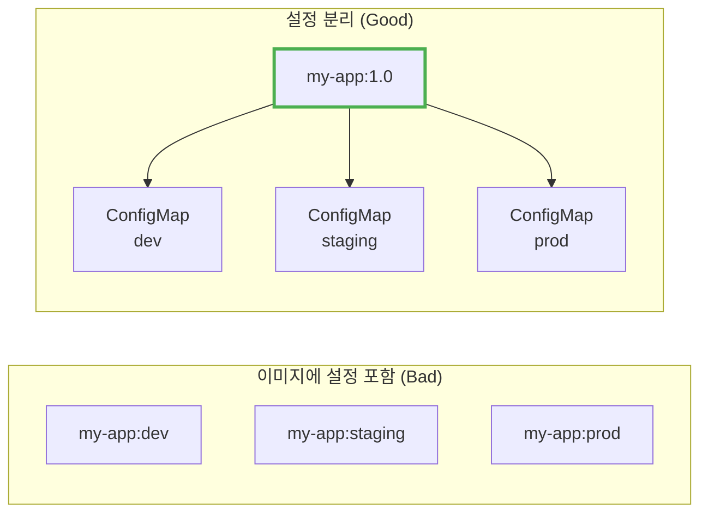
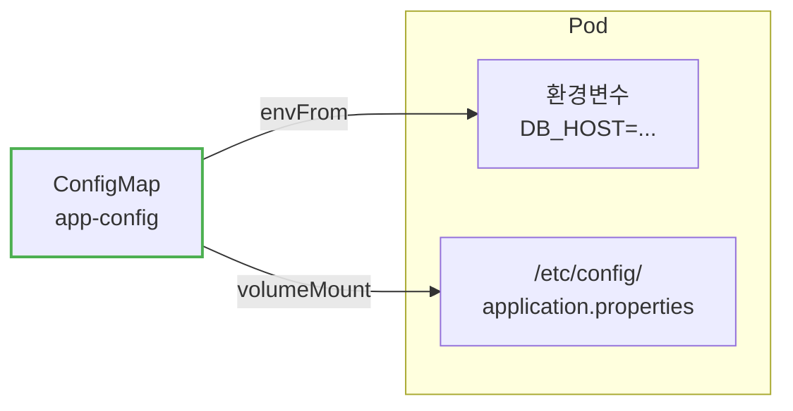
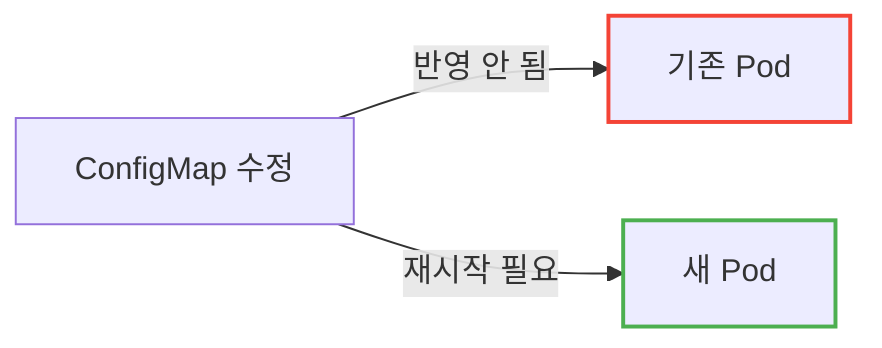
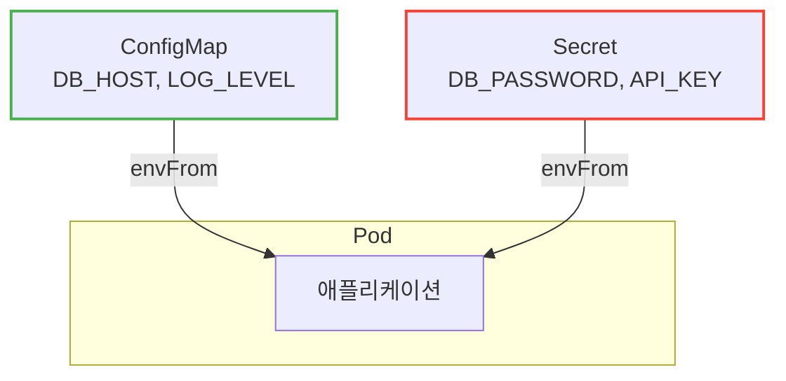
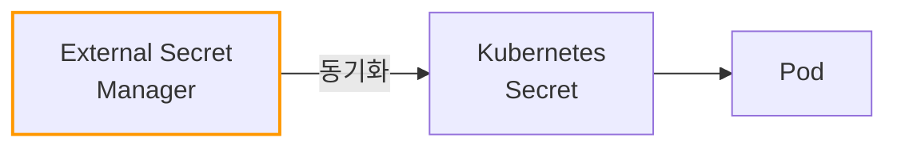
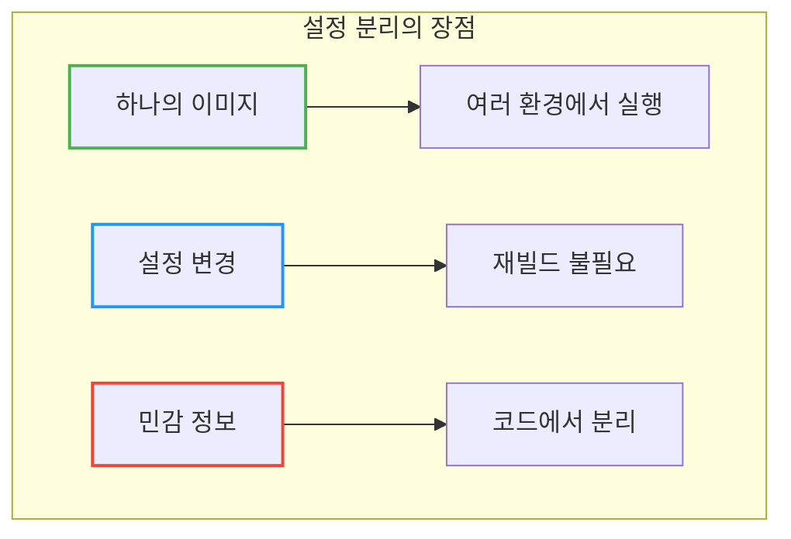

# Kubernetes ConfigMap & Secret

이미지에 설정값을 하드코딩하면 환경마다 다른 이미지를 빌드해야 하는데, 이게 맞는 걸까?

## 결론부터 말하면

**ConfigMap**은 일반 설정값을, **Secret**은 민감한 정보를 저장한다. 둘 다 애플리케이션 코드와 설정을 **분리**하여, 하나의 이미지로 여러 환경에서 실행할 수 있게 한다.



| 리소스 | 용도 | 저장 예시 | 인코딩 |
|--------|------|----------|--------|
| **ConfigMap** | 일반 설정 | DB 호스트, 로그 레벨, 기능 플래그 | 평문 |
| **Secret** | 민감 정보 | 비밀번호, API 키, 인증서 | Base64 |

---

## 1. 왜 설정 분리가 필요한가?

### 1.1 설정이 코드에 포함되면?

Docker 이미지에 환경변수를 하드코딩하면 어떻게 될까?

```dockerfile
# ❌ Bad: 설정이 이미지에 포함
ENV DB_HOST=prod-db.example.com
ENV LOG_LEVEL=info
```

**문제 1: 환경마다 다른 이미지**

```
my-app:1.0-dev       # DB_HOST=dev-db
my-app:1.0-staging   # DB_HOST=staging-db
my-app:1.0-prod      # DB_HOST=prod-db
```

같은 코드인데 이미지가 3개다. 빌드도 3번, 테스트도 3번, 저장소 용량도 3배.

**문제 2: 설정 변경 = 재빌드**

로그 레벨만 바꾸려고 해도 이미지를 다시 빌드해야 한다. CI/CD 파이프라인 전체가 돌아간다.

**문제 3: 민감 정보 노출**

비밀번호가 이미지에 포함되면 이미지에 접근할 수 있는 누구나 볼 수 있다.

### 1.2 Twelve-Factor App 원칙

유명한 [Twelve-Factor App](https://12factor.net/ko/) 방법론에서도 **설정을 환경에 저장**하라고 한다:

> "설정을 코드에서 엄격하게 분리해야 한다. 설정은 배포(개발, 스테이징, 프로덕션 등)마다 달라질 수 있지만 코드는 그렇지 않다."

Kubernetes의 ConfigMap과 Secret이 바로 이 원칙을 구현한다.

---

## 2. ConfigMap: 일반 설정값 저장

### 2.1 ConfigMap 생성

**방법 1: YAML로 생성**

```yaml
apiVersion: v1
kind: ConfigMap
metadata:
  name: app-config
data:
  # 키-값 형태
  DB_HOST: "db.example.com"
  DB_PORT: "5432"
  LOG_LEVEL: "info"

  # 파일 형태
  application.properties: |
    server.port=8080
    spring.profiles.active=prod
```

**방법 2: 명령어로 생성**

```bash
# 리터럴 값으로
kubectl create configmap app-config \
  --from-literal=DB_HOST=db.example.com \
  --from-literal=LOG_LEVEL=info

# 파일에서
kubectl create configmap app-config \
  --from-file=application.properties

# 디렉토리에서 (모든 파일)
kubectl create configmap app-config \
  --from-file=config/
```

### 2.2 Pod에서 ConfigMap 사용하기

**방법 1: 환경변수로 주입**

```yaml
apiVersion: v1
kind: Pod
metadata:
  name: my-app
spec:
  containers:
  - name: app
    image: my-app:1.0
    env:
    - name: DB_HOST                    # 컨테이너 내 환경변수 이름
      valueFrom:
        configMapKeyRef:
          name: app-config             # ConfigMap 이름
          key: DB_HOST                 # ConfigMap의 키
    - name: LOG_LEVEL
      valueFrom:
        configMapKeyRef:
          name: app-config
          key: LOG_LEVEL
```

**방법 2: 모든 키를 한 번에 환경변수로**

```yaml
spec:
  containers:
  - name: app
    image: my-app:1.0
    envFrom:
    - configMapRef:
        name: app-config       # app-config의 모든 키가 환경변수로
```

**방법 3: 볼륨으로 마운트 (파일로 사용)**

```yaml
spec:
  containers:
  - name: app
    image: my-app:1.0
    volumeMounts:
    - name: config-volume
      mountPath: /etc/config       # 마운트 경로
  volumes:
  - name: config-volume
    configMap:
      name: app-config             # ConfigMap 이름
```

결과: `/etc/config/DB_HOST`, `/etc/config/application.properties` 파일이 생성됨



---

## 3. Secret: 민감 정보 저장

### 3.1 Secret vs ConfigMap

Secret은 ConfigMap과 거의 동일하지만, **민감 정보**를 위해 설계되었다.

| 구분 | ConfigMap | Secret |
|------|-----------|--------|
| 용도 | 일반 설정 | 민감 정보 |
| 저장 형식 | 평문 | Base64 인코딩 |
| etcd 저장 | 평문 | 암호화 가능 |
| 볼륨 마운트 시 | 디스크 | tmpfs (메모리) |

> **왜 tmpfs?** Secret을 볼륨으로 마운트하면 인메모리 파일시스템(tmpfs)을 사용한다. 민감한 데이터가 노드 디스크에 기록되지 않아 보안에 유리하다.

> **주의:** Base64는 **인코딩**이지 **암호화**가 아니다! 누구나 디코딩할 수 있다. 보안을 위해서는 etcd 암호화, RBAC 설정이 필요하다.

### 3.2 Secret 생성

**방법 1: YAML로 생성 (Base64 인코딩 필요)**

```yaml
apiVersion: v1
kind: Secret
metadata:
  name: app-secret
type: Opaque
data:
  # Base64로 인코딩된 값
  DB_PASSWORD: cGFzc3dvcmQxMjM=     # echo -n "password123" | base64
  API_KEY: c2VjcmV0LWtleQ==
```

**방법 2: stringData 사용 (평문 가능, 자동 인코딩)** ✅ 권장

```yaml
apiVersion: v1
kind: Secret
metadata:
  name: app-secret
type: Opaque
stringData:
  # 평문으로 작성 → Kubernetes가 자동으로 Base64 인코딩
  DB_PASSWORD: password123
  API_KEY: secret-key
```

> **Tip:** YAML을 직접 작성할 때는 `stringData`를 사용하라. Base64 인코딩 실수를 방지하고 가독성도 좋다.

**방법 3: 명령어로 생성**

```bash
# 리터럴 값 (자동 인코딩)
kubectl create secret generic app-secret \
  --from-literal=DB_PASSWORD=password123 \
  --from-literal=API_KEY=secret-key

# 파일에서
kubectl create secret generic app-secret \
  --from-file=ssh-privatekey=~/.ssh/id_rsa
```

### 3.3 Secret 타입

| 타입 | 용도 |
|------|------|
| `Opaque` | 일반 용도 (기본값) |
| `kubernetes.io/tls` | TLS 인증서 |
| `kubernetes.io/dockerconfigjson` | Docker 레지스트리 인증 |
| `kubernetes.io/basic-auth` | 기본 인증 |
| `kubernetes.io/ssh-auth` | SSH 인증 |

```bash
# TLS Secret 생성
kubectl create secret tls my-tls \
  --cert=cert.crt \
  --key=cert.key

# Docker 레지스트리 Secret
kubectl create secret docker-registry regcred \
  --docker-server=registry.example.com \
  --docker-username=user \
  --docker-password=pass
```

### 3.4 Pod에서 Secret 사용하기

ConfigMap과 동일한 방식으로 사용한다.

**환경변수로:**

```yaml
spec:
  containers:
  - name: app
    image: my-app:1.0
    env:
    - name: DB_PASSWORD
      valueFrom:
        secretKeyRef:              # configMapKeyRef 대신 secretKeyRef
          name: app-secret
          key: DB_PASSWORD
```

**볼륨으로:**

```yaml
spec:
  containers:
  - name: app
    image: my-app:1.0
    volumeMounts:
    - name: secret-volume
      mountPath: /etc/secrets
      readOnly: true              # 읽기 전용 권장
  volumes:
  - name: secret-volume
    secret:
      secretName: app-secret
```

---

## 4. ConfigMap/Secret 업데이트

### 4.1 환경변수로 사용할 때

**환경변수는 Pod 재시작 전까지 업데이트되지 않는다.**



```bash
# ConfigMap 수정 후 Pod 재시작
kubectl rollout restart deployment my-app
```

### 4.2 볼륨으로 마운트할 때

**볼륨 마운트는 자동으로 업데이트된다** (kubelet sync 주기, 기본 1분).

단, 두 가지 조건이 있다:
1. 애플리케이션이 파일 변경을 감지해서 다시 읽어야 한다 (Spring Boot `@RefreshScope` 등)
2. **`subPath`를 사용하면 자동 업데이트가 안 된다!**

```yaml
# ❌ subPath 사용 → 자동 업데이트 안 됨
volumeMounts:
- name: config
  mountPath: /app/config/application.yml
  subPath: application.yml

# ✅ 디렉토리 마운트 → 자동 업데이트 됨
volumeMounts:
- name: config
  mountPath: /app/config
```

### 4.3 Immutable ConfigMap/Secret

변경 불가능하게 만들어서 실수로 인한 장애를 방지할 수 있다:

```yaml
apiVersion: v1
kind: ConfigMap
metadata:
  name: app-config
immutable: true          # 생성 후 수정 불가
data:
  DB_HOST: "db.example.com"
```

**장점:**
- 실수로 변경하는 것을 방지
- kube-apiserver 부하 감소 (변경 감시 불필요)
- 수정하려면 삭제 후 재생성 필요

---

## 5. 실전 패턴

### 5.1 환경별 ConfigMap

```yaml
# base/configmap.yaml (공통)
apiVersion: v1
kind: ConfigMap
metadata:
  name: app-config
data:
  APP_NAME: my-app

---
# overlays/dev/configmap.yaml
apiVersion: v1
kind: ConfigMap
metadata:
  name: app-config
data:
  DB_HOST: dev-db.internal
  LOG_LEVEL: debug

---
# overlays/prod/configmap.yaml
apiVersion: v1
kind: ConfigMap
metadata:
  name: app-config
data:
  DB_HOST: prod-db.internal
  LOG_LEVEL: info
```

> Kustomize나 Helm을 사용하면 환경별 설정을 더 효율적으로 관리할 수 있다.

### 5.2 설정 파일 전체 마운트

Spring Boot `application.yml` 같은 설정 파일 전체를 ConfigMap으로:

```yaml
apiVersion: v1
kind: ConfigMap
metadata:
  name: spring-config
data:
  application.yml: |
    server:
      port: 8080
    spring:
      datasource:
        url: jdbc:postgresql://db:5432/mydb
    logging:
      level:
        root: INFO
```

```yaml
spec:
  containers:
  - name: app
    volumeMounts:
    - name: config
      mountPath: /app/config/application.yml
      subPath: application.yml       # 특정 파일만 마운트
  volumes:
  - name: config
    configMap:
      name: spring-config
```

### 5.3 ConfigMap + Secret 조합

```yaml
spec:
  containers:
  - name: app
    image: my-app:1.0
    envFrom:
    - configMapRef:
        name: app-config       # 일반 설정
    - secretRef:
        name: app-secret       # 민감 정보
```



---

## 6. 보안 고려사항

### 6.1 Secret은 정말 안전한가?

기본 설정에서 Secret의 보안 수준:

| 보안 요소 | 기본값 | 권장 설정 |
|----------|--------|----------|
| etcd 저장 | 평문 | **암호화 활성화** |
| RBAC | 누구나 조회 가능 | **최소 권한 원칙** |
| Base64 | 인코딩 (복호화 가능) | 외부 Secret 관리자 사용 |

### 6.2 더 안전한 Secret 관리

**방법 1: etcd 암호화**

```yaml
# EncryptionConfiguration
apiVersion: apiserver.config.k8s.io/v1
kind: EncryptionConfiguration
resources:
- resources:
  - secrets
  providers:
  - aescbc:
      keys:
      - name: key1
        secret: <base64-encoded-key>
```

**방법 2: 외부 Secret 관리자**

- **HashiCorp Vault**: 가장 대중적, 동적 Secret 지원
- **AWS Secrets Manager**: AWS 환경
- **Azure Key Vault**: Azure 환경
- **External Secrets Operator**: 외부 → Kubernetes Secret 동기화



### 6.3 RBAC으로 접근 제한

```yaml
apiVersion: rbac.authorization.k8s.io/v1
kind: Role
metadata:
  name: secret-reader
rules:
- apiGroups: [""]
  resources: ["secrets"]
  resourceNames: ["app-secret"]    # 특정 Secret만
  verbs: ["get"]                   # 읽기만
```

---

## 7. 자주 쓰는 명령어

```bash
# ConfigMap 조회
kubectl get configmaps
kubectl describe configmap app-config

# ConfigMap 내용 확인
kubectl get configmap app-config -o yaml

# Secret 조회
kubectl get secrets
kubectl describe secret app-secret

# Secret 값 디코딩
kubectl get secret app-secret -o jsonpath='{.data.DB_PASSWORD}' | base64 -d

# ConfigMap/Secret 삭제
kubectl delete configmap app-config
kubectl delete secret app-secret
```

---

## 8. 정리



| 질문 | 답변 |
|------|------|
| 설정을 이미지에 넣어도 되나요? | ❌ 환경별 이미지 필요, 재빌드 필요 |
| ConfigMap vs Secret 차이? | 일반 설정 vs 민감 정보 |
| Secret은 안전한가요? | ⚠️ 기본값은 Base64 인코딩뿐, 추가 설정 필요 |

**핵심 기억:**
1. **설정과 코드 분리** → 하나의 이미지로 여러 환경
2. **ConfigMap** = 일반 설정, **Secret** = 민감 정보
3. **환경변수**로 주입하거나 **볼륨**으로 마운트
4. 환경변수는 **재시작** 필요, 볼륨은 **자동 업데이트**
5. Secret은 **Base64 인코딩**일 뿐, 암호화가 아님 → 추가 보안 필요

---

## 출처

- [Kubernetes Documentation - ConfigMaps](https://kubernetes.io/docs/concepts/configuration/configmap/) - 공식 문서
- [Kubernetes Documentation - Secrets](https://kubernetes.io/docs/concepts/configuration/secret/) - 공식 문서
- [Twelve-Factor App - Config](https://12factor.net/ko/config) - 설정 분리 원칙
- [Kubernetes Documentation - Encrypting Secret Data at Rest](https://kubernetes.io/docs/tasks/administer-cluster/encrypt-data/) - 공식 문서
