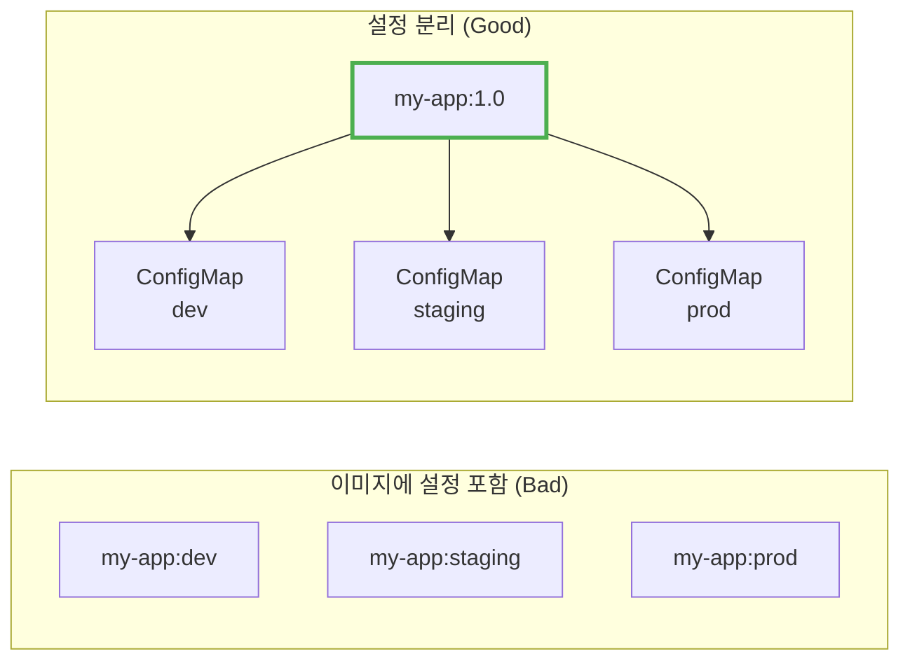
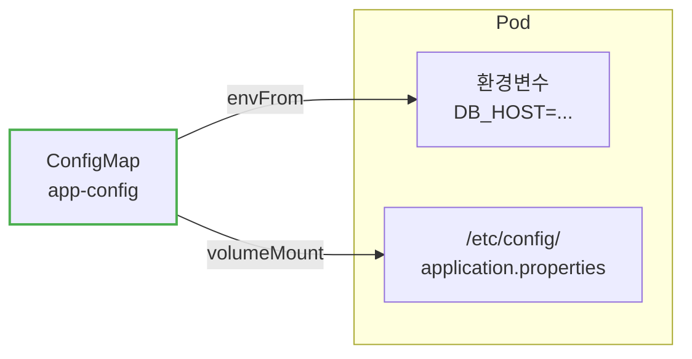
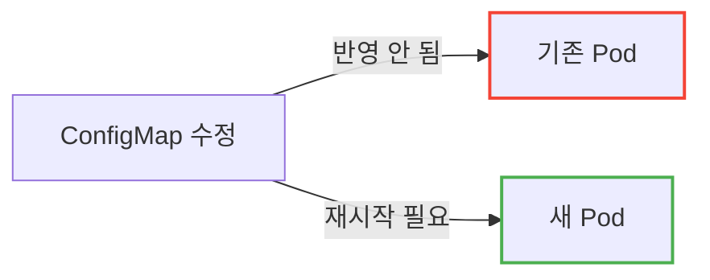
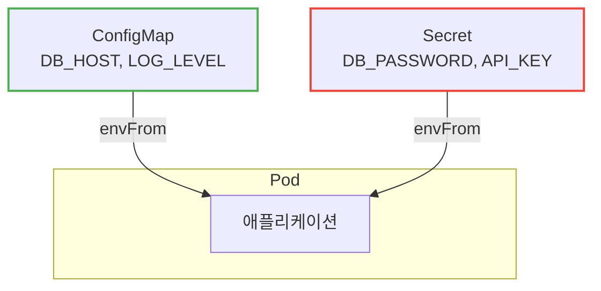
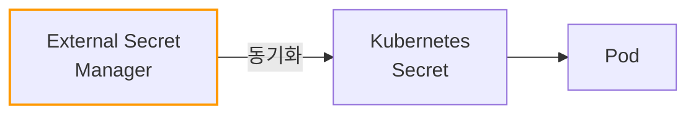
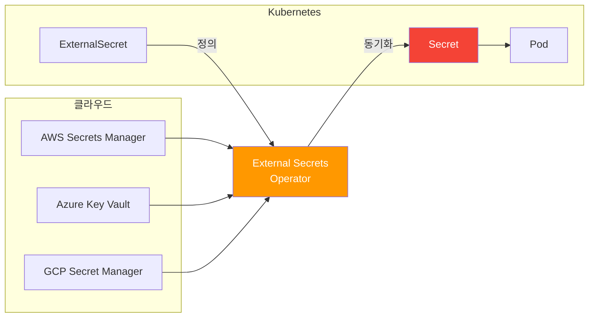
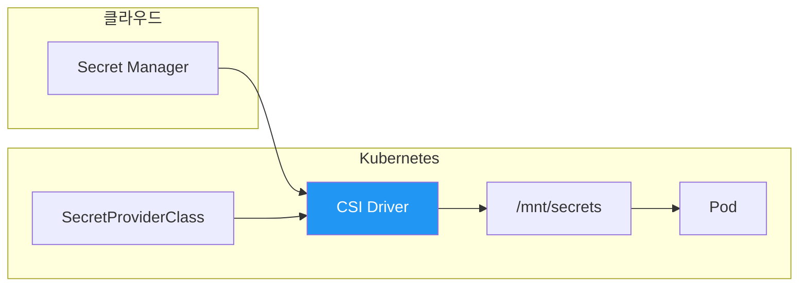
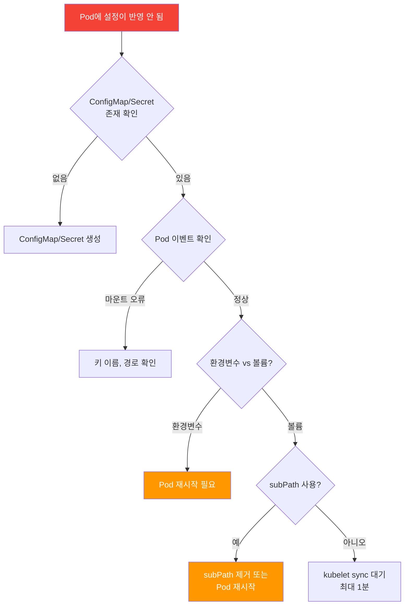
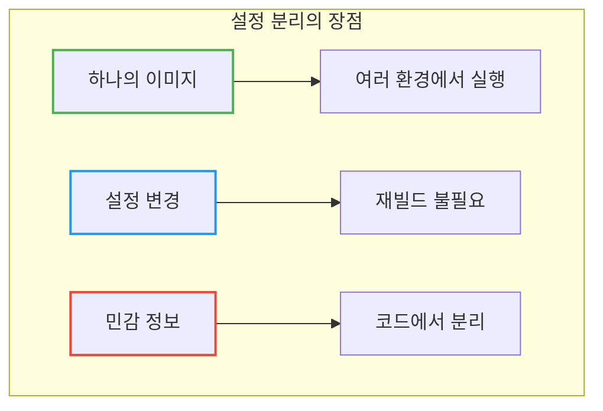

# Kubernetes ConfigMap & Secret

이미지에 설정값을 하드코딩하면 환경마다 다른 이미지를 빌드해야 하는데, 이게 맞는 걸까?

## 결론부터 말하면

**ConfigMap**은 일반 설정값을, **Secret**은 민감한 정보를 저장한다. 둘 다 애플리케이션 코드와 설정을 **분리**하여, 하나의 이미지로 여러 환경에서 실행할 수 있게 한다.



| 리소스 | 용도 | 저장 예시 | 인코딩 |
|--------|------|----------|--------|
| **ConfigMap** | 일반 설정 | DB 호스트, 로그 레벨, 기능 플래그 | 평문 |
| **Secret** | 민감 정보 | 비밀번호, API 키, 인증서 | Base64 |

---

## 1. 왜 설정 분리가 필요한가?

### 1.1 설정이 코드에 포함되면?

Docker 이미지에 환경변수를 하드코딩하면 어떻게 될까?

```dockerfile
# ❌ Bad: 설정이 이미지에 포함
ENV DB_HOST=prod-db.example.com
ENV LOG_LEVEL=info
```

**문제 1: 환경마다 다른 이미지**

```
my-app:1.0-dev       # DB_HOST=dev-db
my-app:1.0-staging   # DB_HOST=staging-db
my-app:1.0-prod      # DB_HOST=prod-db
```

같은 코드인데 이미지가 3개다. 빌드도 3번, 테스트도 3번, 저장소 용량도 3배.

**문제 2: 설정 변경 = 재빌드**

로그 레벨만 바꾸려고 해도 이미지를 다시 빌드해야 한다. CI/CD 파이프라인 전체가 돌아간다.

**문제 3: 민감 정보 노출**

비밀번호가 이미지에 포함되면 이미지에 접근할 수 있는 누구나 볼 수 있다.

### 1.2 Twelve-Factor App 원칙

유명한 [Twelve-Factor App](https://12factor.net/ko/) 방법론에서도 **설정을 환경에 저장**하라고 한다:

> "설정을 코드에서 엄격하게 분리해야 한다. 설정은 배포(개발, 스테이징, 프로덕션 등)마다 달라질 수 있지만 코드는 그렇지 않다."

Kubernetes의 ConfigMap과 Secret이 바로 이 원칙을 구현한다.

---

## 2. ConfigMap: 일반 설정값 저장

### 2.1 ConfigMap 생성

**방법 1: YAML로 생성**

```yaml
apiVersion: v1
kind: ConfigMap
metadata:
  name: app-config
data:
  # 키-값 형태
  DB_HOST: "db.example.com"
  DB_PORT: "5432"
  LOG_LEVEL: "info"

  # 파일 형태
  application.properties: |
    server.port=8080
    spring.profiles.active=prod
```

**방법 2: 명령어로 생성**

```bash
# 리터럴 값으로
kubectl create configmap app-config \
  --from-literal=DB_HOST=db.example.com \
  --from-literal=LOG_LEVEL=info

# 파일에서
kubectl create configmap app-config \
  --from-file=application.properties

# 디렉토리에서 (모든 파일)
kubectl create configmap app-config \
  --from-file=config/
```

### 2.2 Pod에서 ConfigMap 사용하기

**방법 1: 환경변수로 주입**

```yaml
apiVersion: v1
kind: Pod
metadata:
  name: my-app
spec:
  containers:
  - name: app
    image: my-app:1.0
    env:
    - name: DB_HOST                    # 컨테이너 내 환경변수 이름
      valueFrom:
        configMapKeyRef:
          name: app-config             # ConfigMap 이름
          key: DB_HOST                 # ConfigMap의 키
    - name: LOG_LEVEL
      valueFrom:
        configMapKeyRef:
          name: app-config
          key: LOG_LEVEL
```

**방법 2: 모든 키를 한 번에 환경변수로**

```yaml
spec:
  containers:
  - name: app
    image: my-app:1.0
    envFrom:
    - configMapRef:
        name: app-config       # app-config의 모든 키가 환경변수로
```

**방법 3: 볼륨으로 마운트 (파일로 사용)**

```yaml
spec:
  containers:
  - name: app
    image: my-app:1.0
    volumeMounts:
    - name: config-volume
      mountPath: /etc/config       # 마운트 경로
  volumes:
  - name: config-volume
    configMap:
      name: app-config             # ConfigMap 이름
```

결과: `/etc/config/DB_HOST`, `/etc/config/application.properties` 파일이 생성됨



---

## 3. Secret: 민감 정보 저장

### 3.1 Secret vs ConfigMap

Secret은 ConfigMap과 거의 동일하지만, **민감 정보**를 위해 설계되었다.

| 구분 | ConfigMap | Secret |
|------|-----------|--------|
| 용도 | 일반 설정 | 민감 정보 |
| 저장 형식 | 평문 | Base64 인코딩 |
| etcd 저장 | 평문 | 암호화 가능 |
| 볼륨 마운트 시 | 디스크 | tmpfs (메모리) |

> **왜 tmpfs?** Secret을 볼륨으로 마운트하면 인메모리 파일시스템(tmpfs)을 사용한다. 민감한 데이터가 노드 디스크에 기록되지 않아 보안에 유리하다.

> **주의:** Base64는 **인코딩**이지 **암호화**가 아니다! 누구나 디코딩할 수 있다. 보안을 위해서는 etcd 암호화, RBAC 설정이 필요하다.

### 3.2 Secret 생성

**방법 1: YAML로 생성 (Base64 인코딩 필요)**

```yaml
apiVersion: v1
kind: Secret
metadata:
  name: app-secret
type: Opaque
data:
  # Base64로 인코딩된 값
  DB_PASSWORD: cGFzc3dvcmQxMjM=     # echo -n "password123" | base64
  API_KEY: c2VjcmV0LWtleQ==
```

**방법 2: stringData 사용 (평문 가능, 자동 인코딩)** ✅ 권장

```yaml
apiVersion: v1
kind: Secret
metadata:
  name: app-secret
type: Opaque
stringData:
  # 평문으로 작성 → Kubernetes가 자동으로 Base64 인코딩
  DB_PASSWORD: password123
  API_KEY: secret-key
```

> **Tip:** YAML을 직접 작성할 때는 `stringData`를 사용하라. Base64 인코딩 실수를 방지하고 가독성도 좋다.

> **참고:** `stringData`는 **쓰기 전용** 편의 기능이다. 생성 후 `kubectl get secret -o yaml`로 조회하면 `stringData`는 사라지고 `data` 필드에 Base64 인코딩된 값만 표시된다.

**방법 3: 명령어로 생성**

```bash
# 리터럴 값 (자동 인코딩)
kubectl create secret generic app-secret \
  --from-literal=DB_PASSWORD=password123 \
  --from-literal=API_KEY=secret-key

# 파일에서
kubectl create secret generic app-secret \
  --from-file=ssh-privatekey=~/.ssh/id_rsa
```

### 3.3 Secret 타입

| 타입 | 용도 |
|------|------|
| `Opaque` | 일반 용도 (기본값) |
| `kubernetes.io/tls` | TLS 인증서 |
| `kubernetes.io/dockerconfigjson` | Docker 레지스트리 인증 |
| `kubernetes.io/basic-auth` | 기본 인증 |
| `kubernetes.io/ssh-auth` | SSH 인증 |

```bash
# TLS Secret 생성
kubectl create secret tls my-tls \
  --cert=cert.crt \
  --key=cert.key

# Docker 레지스트리 Secret
kubectl create secret docker-registry regcred \
  --docker-server=registry.example.com \
  --docker-username=user \
  --docker-password=pass
```

### 3.4 Pod에서 Secret 사용하기

ConfigMap과 동일한 방식으로 사용한다.

**환경변수로:**

```yaml
spec:
  containers:
  - name: app
    image: my-app:1.0
    env:
    - name: DB_PASSWORD
      valueFrom:
        secretKeyRef:              # configMapKeyRef 대신 secretKeyRef
          name: app-secret
          key: DB_PASSWORD
```

**볼륨으로:**

```yaml
spec:
  containers:
  - name: app
    image: my-app:1.0
    volumeMounts:
    - name: secret-volume
      mountPath: /etc/secrets
      readOnly: true              # 읽기 전용 권장
  volumes:
  - name: secret-volume
    secret:
      secretName: app-secret
```

> **보안 관점: 환경변수 vs 볼륨**
>
> | 방식 | 장점 | 단점 |
> |------|------|------|
> | **환경변수** | 코드에서 접근 간편 | 자식 프로세스에 상속, `kubectl describe pod`에 노출 가능 |
> | **볼륨 마운트** | tmpfs 사용(디스크 미기록), 파일 권한 세밀 제어 가능 | 파일 읽기 로직 필요 |
>
> **보안이 중요하면 볼륨 마운트를 권장한다.**

---

## 4. ConfigMap/Secret 업데이트

### 4.1 환경변수로 사용할 때

**환경변수는 Pod 재시작 전까지 업데이트되지 않는다.**



```bash
# ConfigMap 수정 후 Pod 재시작
kubectl rollout restart deployment my-app
```

> **실무 팁: Reloader로 자동 재시작**
>
> 매번 수동으로 `rollout restart`하는 것은 번거롭다. [Stakater Reloader](https://github.com/stakater/Reloader)를 사용하면 ConfigMap/Secret 변경을 감지하여 자동으로 롤링 업데이트를 수행한다.
>
> ```yaml
> apiVersion: apps/v1
> kind: Deployment
> metadata:
>   name: my-app
>   annotations:
>     reloader.stakater.com/auto: "true"   # 참조하는 모든 ConfigMap/Secret 감시
> ```
>
> 특정 ConfigMap만 감시하려면:
> ```yaml
> annotations:
>   configmap.reloader.stakater.com/reload: "app-config"  # 특정 ConfigMap만
>   secret.reloader.stakater.com/reload: "app-secret"     # 특정 Secret만
> ```

### 4.2 볼륨으로 마운트할 때

**볼륨 마운트는 자동으로 업데이트된다** (kubelet sync 주기, 기본 1분).

단, 두 가지 조건이 있다:
1. 애플리케이션이 파일 변경을 감지해서 다시 읽어야 한다 (Spring Boot `@RefreshScope` 등)
2. **`subPath`를 사용하면 자동 업데이트가 안 된다!**

```yaml
# ❌ subPath 사용 → 자동 업데이트 안 됨
volumeMounts:
- name: config
  mountPath: /app/config/application.yml
  subPath: application.yml

# ✅ 디렉토리 마운트 → 자동 업데이트 됨
volumeMounts:
- name: config
  mountPath: /app/config
```

### 4.3 Immutable ConfigMap/Secret

변경 불가능하게 만들어서 실수로 인한 장애를 방지할 수 있다:

```yaml
apiVersion: v1
kind: ConfigMap
metadata:
  name: app-config
immutable: true          # 생성 후 수정 불가
data:
  DB_HOST: "db.example.com"
```

**장점:**
- 실수로 변경하는 것을 방지
- kube-apiserver 부하 감소 (변경 감시 불필요)

**변경이 필요할 때:** 새 이름으로 생성 후 Deployment 업데이트 (다운타임 없음)

```yaml
# GitOps 패턴: 내용 기반 이름 또는 버전 붙이기
metadata:
  name: app-config-v2          # 또는 app-config-<hash>
```

Kustomize의 `configMapGenerator`는 이 패턴을 자동으로 지원한다 (내용 해시를 이름에 추가).

---

## 5. 실전 패턴

### 5.1 환경별 ConfigMap

```yaml
# base/configmap.yaml (공통)
apiVersion: v1
kind: ConfigMap
metadata:
  name: app-config
data:
  APP_NAME: my-app

---
# overlays/dev/configmap.yaml
apiVersion: v1
kind: ConfigMap
metadata:
  name: app-config
data:
  DB_HOST: dev-db.internal
  LOG_LEVEL: debug

---
# overlays/prod/configmap.yaml
apiVersion: v1
kind: ConfigMap
metadata:
  name: app-config
data:
  DB_HOST: prod-db.internal
  LOG_LEVEL: info
```

> Kustomize나 Helm을 사용하면 환경별 설정을 더 효율적으로 관리할 수 있다.

### 5.2 설정 파일 전체 마운트

Spring Boot `application.yml` 같은 설정 파일 전체를 ConfigMap으로:

```yaml
apiVersion: v1
kind: ConfigMap
metadata:
  name: spring-config
data:
  application.yml: |
    server:
      port: 8080
    spring:
      datasource:
        url: jdbc:postgresql://db:5432/mydb
    logging:
      level:
        root: INFO
```

```yaml
spec:
  containers:
  - name: app
    volumeMounts:
    - name: config
      mountPath: /app/config/application.yml
      subPath: application.yml       # 특정 파일만 마운트
  volumes:
  - name: config
    configMap:
      name: spring-config
```

> **⚠️ 주의:** `subPath` 사용 시 ConfigMap이 변경되어도 **자동 업데이트되지 않는다**. 변경 반영이 필요하면 Pod 재시작 필요. (→ 10.3절 참조)

### 5.3 ConfigMap + Secret 조합

```yaml
spec:
  containers:
  - name: app
    image: my-app:1.0
    envFrom:
    - configMapRef:
        name: app-config       # 일반 설정
    - secretRef:
        name: app-secret       # 민감 정보
```



---

## 6. 보안 고려사항

### 6.1 Secret은 정말 안전한가?

기본 설정에서 Secret의 보안 수준:

| 보안 요소 | 기본값 | 권장 설정 |
|----------|--------|----------|
| etcd 저장 | 평문 | **암호화 활성화** |
| RBAC | 누구나 조회 가능 | **최소 권한 원칙** |
| Base64 | 인코딩 (복호화 가능) | 외부 Secret 관리자 사용 |

### 6.2 더 안전한 Secret 관리

**방법 1: etcd 암호화** (클러스터 관리자 권한 필요)

```yaml
# EncryptionConfiguration (kube-apiserver 설정)
apiVersion: apiserver.config.k8s.io/v1
kind: EncryptionConfiguration
resources:
- resources:
  - secrets
  providers:
  - aescbc:
      keys:
      - name: key1
        secret: <base64-encoded-key>
```

**방법 2: 외부 Secret 관리자**

- **HashiCorp Vault**: 가장 대중적, 동적 Secret 지원
- **AWS Secrets Manager**: AWS 환경
- **Azure Key Vault**: Azure 환경
- **External Secrets Operator**: 외부 → Kubernetes Secret 동기화



### 6.3 RBAC으로 접근 제한

```yaml
apiVersion: rbac.authorization.k8s.io/v1
kind: Role
metadata:
  name: secret-reader
rules:
- apiGroups: [""]
  resources: ["secrets"]
  resourceNames: ["app-secret"]    # 특정 Secret만
  verbs: ["get"]                   # 읽기만
```

---

## 7. 클라우드 Secret 관리

클라우드 환경에서는 Kubernetes Secret을 직접 관리하는 것보다 **클라우드 Secret 관리 서비스**를 사용하는 것이 권장된다. 왜일까?

| 문제 | Kubernetes Secret | 클라우드 Secret Manager |
|------|-------------------|------------------------|
| 암호화 | etcd 설정 필요 | **기본 암호화** |
| 접근 제어 | RBAC 설정 복잡 | **IAM 기반 세밀한 제어** |
| 감사 로그 | 별도 설정 필요 | **자동 로깅** |
| 로테이션 | 수동 | **자동 로테이션 지원** |
| 버전 관리 | 불가능 | **버전 이력 관리** |

### 7.1 External Secrets Operator (ESO)

**External Secrets Operator** 는 외부 Secret 관리 서비스의 값을 자동으로 Kubernetes Secret으로 동기화한다.



**ESO 설치:**

```bash
# Helm으로 설치
helm repo add external-secrets https://charts.external-secrets.io
helm install external-secrets external-secrets/external-secrets \
  -n external-secrets --create-namespace
```

### 7.2 AWS EKS + Secrets Manager

AWS에서는 **IRSA(IAM Roles for Service Accounts)** 또는 **Pod Identity** 로 인증한다.

**Step 1: IAM 정책 생성**

```json
{
  "Version": "2012-10-17",
  "Statement": [
    {
      "Effect": "Allow",
      "Action": [
        "secretsmanager:GetSecretValue",
        "secretsmanager:DescribeSecret"
      ],
      "Resource": "arn:aws:secretsmanager:ap-northeast-2:*:secret:my-app/*"
    }
  ]
}
```

**Step 2: IRSA 설정**

```bash
# Service Account에 IAM Role 연결
eksctl create iamserviceaccount \
  --name external-secrets-sa \
  --namespace external-secrets \
  --cluster my-cluster \
  --attach-policy-arn arn:aws:iam::123456789:policy/SecretsManagerReadOnly \
  --approve
```

**Step 3: SecretStore 생성**

```yaml
apiVersion: external-secrets.io/v1beta1
kind: SecretStore
metadata:
  name: aws-secrets-manager
  namespace: default
spec:
  provider:
    aws:
      service: SecretsManager
      region: ap-northeast-2
      auth:
        jwt:
          serviceAccountRef:
            name: external-secrets-sa    # IRSA Service Account
```

**Step 4: ExternalSecret 생성**

```yaml
apiVersion: external-secrets.io/v1beta1
kind: ExternalSecret
metadata:
  name: my-app-secret
  namespace: default
spec:
  refreshInterval: 1h                    # 동기화 주기
  secretStoreRef:
    name: aws-secrets-manager
    kind: SecretStore
  target:
    name: my-app-secret                  # 생성될 K8s Secret 이름
    creationPolicy: Owner
  data:
  - secretKey: DB_PASSWORD               # K8s Secret의 키
    remoteRef:
      key: my-app/database               # AWS Secret 이름
      property: password                 # JSON 내 필드
```

> **IRSA vs Pod Identity:** IRSA는 Service Account 토큰을 사용하고, Pod Identity(신규)는 EKS가 직접 IAM Role을 Pod에 할당한다. 신규 클러스터에서는 Pod Identity를 권장한다.

### 7.3 Azure AKS + Key Vault

Azure에서는 **Workload Identity** 로 인증한다.

**Step 1: Workload Identity 설정**

```bash
# AKS 클러스터에 Workload Identity 활성화
az aks update \
  --resource-group myResourceGroup \
  --name myAKSCluster \
  --enable-oidc-issuer \
  --enable-workload-identity

# Managed Identity 생성
az identity create \
  --name external-secrets-identity \
  --resource-group myResourceGroup
```

**Step 2: Key Vault 접근 권한 부여**

```bash
# Key Vault에 접근 권한 부여
az keyvault set-policy \
  --name myKeyVault \
  --object-id <identity-principal-id> \
  --secret-permissions get list
```

**Step 3: SecretStore 생성**

```yaml
apiVersion: external-secrets.io/v1beta1
kind: SecretStore
metadata:
  name: azure-keyvault
  namespace: default
spec:
  provider:
    azurekv:
      tenantId: "xxxxxxxx-xxxx-xxxx-xxxx-xxxxxxxxxxxx"
      vaultUrl: "https://mykeyvault.vault.azure.net"
      authType: WorkloadIdentity
      serviceAccountRef:
        name: external-secrets-sa
```

**Step 4: ExternalSecret 생성**

```yaml
apiVersion: external-secrets.io/v1beta1
kind: ExternalSecret
metadata:
  name: my-app-secret
spec:
  refreshInterval: 1h
  secretStoreRef:
    name: azure-keyvault
    kind: SecretStore
  target:
    name: my-app-secret
  data:
  - secretKey: DB_PASSWORD
    remoteRef:
      key: database-password             # Key Vault Secret 이름
```

### 7.4 GCP GKE + Secret Manager

GCP에서는 **Workload Identity Federation** 으로 인증한다.

**Step 1: Workload Identity 설정**

```bash
# GKE 클러스터 생성 시 Workload Identity 활성화
gcloud container clusters create my-cluster \
  --workload-pool=my-project.svc.id.goog \
  --zone=asia-northeast3-a

# GCP Service Account 생성
gcloud iam service-accounts create external-secrets-sa

# Secret Manager 접근 권한 부여
gcloud projects add-iam-policy-binding my-project \
  --member="serviceAccount:external-secrets-sa@my-project.iam.gserviceaccount.com" \
  --role="roles/secretmanager.secretAccessor"
```

**Step 2: Kubernetes SA와 GCP SA 연결**

```bash
# Workload Identity 바인딩
gcloud iam service-accounts add-iam-policy-binding \
  external-secrets-sa@my-project.iam.gserviceaccount.com \
  --role="roles/iam.workloadIdentityUser" \
  --member="serviceAccount:my-project.svc.id.goog[external-secrets/external-secrets-sa]"
```

**Step 3: SecretStore 생성**

```yaml
apiVersion: external-secrets.io/v1beta1
kind: SecretStore
metadata:
  name: gcp-secret-manager
  namespace: default
spec:
  provider:
    gcpsm:
      projectID: my-project
      auth:
        workloadIdentity:
          clusterLocation: asia-northeast3-a
          clusterName: my-cluster
          serviceAccountRef:
            name: external-secrets-sa
```

**Step 4: ExternalSecret 생성**

```yaml
apiVersion: external-secrets.io/v1beta1
kind: ExternalSecret
metadata:
  name: my-app-secret
spec:
  refreshInterval: 1h
  secretStoreRef:
    name: gcp-secret-manager
    kind: SecretStore
  target:
    name: my-app-secret
  data:
  - secretKey: DB_PASSWORD
    remoteRef:
      key: projects/my-project/secrets/database-password
      version: latest
```

### 7.5 클라우드 비교

| 항목 | AWS EKS | Azure AKS | GCP GKE |
|------|---------|-----------|---------|
| **Secret 서비스** | Secrets Manager | Key Vault | Secret Manager |
| **인증 방식** | IRSA / Pod Identity | Workload Identity | Workload Identity Federation |
| **ESO Provider** | `aws` | `azurekv` | `gcpsm` |
| **자동 로테이션** | ✅ (Lambda 연동) | ✅ (자동 갱신) | ✅ (로테이션 일정) |
| **비용** | Secret당 $0.40/월 | 10,000 트랜잭션당 $0.03 | 활성 Secret 버전당 $0.06/월 |

> **참고:** 비용 모델과 API 호출 비용은 클라우드마다 다르며 변경될 수 있다. 정확한 정보는 각 클라우드의 공식 요금 문서를 참고하라.

---

## 8. Secrets Store CSI Driver

**Secrets Store CSI Driver** 는 외부 Secret을 **Pod 볼륨으로 직접 마운트**하는 방식이다. ESO와 달리 Kubernetes Secret을 거치지 않을 수 있다.



### 8.1 ESO vs CSI Driver

| 비교 | External Secrets Operator | Secrets Store CSI Driver |
|------|---------------------------|-------------------------|
| **동작 방식** | K8s Secret으로 동기화 | 볼륨으로 직접 마운트 |
| **Secret 노출** | etcd에 저장됨 | 메모리에만 존재 (옵션) |
| **환경변수 사용** | ✅ 가능 | ⚠️ secretObjects로 동기화 후 가능 |
| **복잡도** | 상대적으로 단순 | 설정이 더 복잡 |
| **Fargate 지원** | ✅ (Deployment) | ❌ (DaemonSet 필요) |

> **권장:** 환경변수로 Secret을 사용해야 하면 **ESO**, 볼륨 마운트만 필요하고 etcd 저장을 피하고 싶으면 **CSI Driver**.

### 8.2 Azure AKS 예시 (CSI Driver)

AKS는 CSI Driver를 **애드온**으로 쉽게 활성화할 수 있다.

```bash
# CSI Driver 애드온 활성화
az aks enable-addons \
  --addons azure-keyvault-secrets-provider \
  --name myAKSCluster \
  --resource-group myResourceGroup
```

**SecretProviderClass 생성:**

```yaml
apiVersion: secrets-store.csi.x-k8s.io/v1
kind: SecretProviderClass
metadata:
  name: azure-keyvault-secrets
spec:
  provider: azure
  parameters:
    usePodIdentity: "false"
    useVMManagedIdentity: "true"         # Managed Identity 사용
    userAssignedIdentityID: "<client-id>"
    keyvaultName: "myKeyVault"
    tenantId: "<tenant-id>"
    objects: |
      array:
        - |
          objectName: database-password
          objectType: secret
  secretObjects:                          # K8s Secret으로도 동기화 (선택)
  - secretName: my-app-secret
    type: Opaque
    data:
    - objectName: database-password
      key: DB_PASSWORD
```

**Pod에서 사용:**

```yaml
spec:
  containers:
  - name: app
    image: my-app:1.0
    volumeMounts:
    - name: secrets-store
      mountPath: "/mnt/secrets"
      readOnly: true
  volumes:
  - name: secrets-store
    csi:
      driver: secrets-store.csi.k8s.io
      readOnly: true
      volumeAttributes:
        secretProviderClass: "azure-keyvault-secrets"
```

---

## 9. GitOps에서 Secret 관리

GitOps 환경에서는 Secret을 Git에 평문으로 저장할 수 없다. 두 가지 접근법이 있다:

| 접근법 | 설명 | 도구 |
|--------|------|------|
| **암호화 저장** | Git에 암호화된 Secret 저장 | Sealed Secrets, SOPS |
| **참조 저장** | Secret 참조만 Git에 저장 | External Secrets Operator |

### 9.1 Sealed Secrets

**Sealed Secrets** 는 클러스터의 공개키로 암호화하여 Git에 안전하게 저장한다.


**설치 및 사용:**

```bash
# Controller 설치
kubectl apply -f https://github.com/bitnami-labs/sealed-secrets/releases/download/v0.24.0/controller.yaml

# kubeseal CLI 설치 (Mac)
brew install kubeseal

# Secret 암호화
kubectl create secret generic my-secret \
  --from-literal=password=mysecret \
  --dry-run=client -o yaml | \
  kubeseal --format yaml > sealed-secret.yaml
```

**생성된 SealedSecret:**

```yaml
apiVersion: bitnami.com/v1alpha1
kind: SealedSecret
metadata:
  name: my-secret
spec:
  encryptedData:
    password: AgBy3i4OJSWK+...  # 클러스터 공개키로 암호화됨
```

> **주의:** SealedSecret은 특정 클러스터에서만 복호화된다. 멀티 클러스터 환경에서는 각 클러스터별로 별도 암호화 필요.

### 9.2 SOPS (Secrets OPerationS)

**SOPS** 는 클라우드 KMS를 사용해 YAML/JSON 파일의 값을 암호화한다.

```bash
# SOPS 설치 (Mac)
brew install sops

# AWS KMS로 암호화
sops --encrypt --kms arn:aws:kms:ap-northeast-2:123:key/abc \
  secret.yaml > secret.enc.yaml
```

**암호화된 파일:**

```yaml
apiVersion: v1
kind: Secret
metadata:
  name: my-secret
stringData:
  password: ENC[AES256_GCM,data:...,tag:...,type:str]
sops:
  kms:
  - arn: arn:aws:kms:ap-northeast-2:123:key/abc
```

**Flux에서 SOPS 사용:**

```yaml
# Flux Kustomization에 SOPS 설정
apiVersion: kustomize.toolkit.fluxcd.io/v1
kind: Kustomization
metadata:
  name: my-app
spec:
  decryption:
    provider: sops
    secretRef:
      name: sops-age    # age 키가 담긴 Secret
```

### 9.3 GitOps Secret 관리 비교

| 항목 | Sealed Secrets | SOPS | External Secrets |
|------|----------------|------|------------------|
| **암호화 위치** | 클러스터 내 | 클라우드 KMS | 외부 서비스 |
| **Git에 저장** | 암호화된 값 | 암호화된 값 | 참조만 |
| **멀티 클러스터** | 각각 암호화 | ✅ 동일 키 사용 | ✅ 동일 설정 |
| **키 관리** | 클러스터가 관리 | 클라우드 KMS | 클라우드 IAM |
| **Flux 지원** | ✅ | ✅ 네이티브 | ✅ |
| **ArgoCD 지원** | ✅ | Plugin 필요 | ✅ |

> **권장:** 이미 클라우드 Secret Manager를 사용 중이라면 **External Secrets**, 클라우드 의존 없이 Git만으로 관리하려면 **SOPS**.

---

## 10. 제한사항과 주의점

### 10.1 크기 제한

**ConfigMap과 Secret 모두 최대 1MiB(1,048,576 bytes)** 로 제한된다.

```bash
# 크기 확인
kubectl get configmap my-config -o json | wc -c
```

**1MiB 초과 시 해결 방법:**

| 방법 | 설명 |
|------|------|
| 분할 | 여러 ConfigMap/Secret으로 분할 |
| 외부 저장 | S3, GCS 등에 저장 후 Init Container로 다운로드 |
| 압축 | gzip 압축 후 binaryData로 저장 |

### 10.2 Optional 참조

ConfigMap/Secret이 없을 때 Pod가 시작되지 않는 문제를 방지하려면 `optional: true`를 사용한다.

```yaml
spec:
  containers:
  - name: app
    env:
    - name: OPTIONAL_CONFIG
      valueFrom:
        configMapKeyRef:
          name: might-not-exist
          key: some-key
          optional: true    # ConfigMap이 없어도 Pod 시작
```

### 10.3 subPath 사용 시 자동 업데이트 불가

`subPath`를 사용하면 ConfigMap/Secret이 업데이트되어도 **자동으로 반영되지 않는다**.

**왜 그럴까?** Kubernetes는 ConfigMap/Secret 볼륨을 **심볼릭 링크**로 관리한다. 업데이트 시 새 디렉토리를 만들고 심볼릭 링크를 원자적으로 교체하는 방식이다. 하지만 `subPath`는 특정 파일을 직접 마운트하므로 이 메커니즘을 우회하게 된다.

```yaml
# ❌ 자동 업데이트 안 됨 (subPath가 심볼릭 링크 메커니즘 우회)
volumeMounts:
- name: config
  mountPath: /app/config/app.yml
  subPath: app.yml

# ✅ 자동 업데이트 됨 (디렉토리 전체 마운트)
volumeMounts:
- name: config
  mountPath: /app/config
```

### 10.4 네임스페이스 제한

ConfigMap과 Secret은 **같은 네임스페이스의 Pod만** 사용할 수 있다.

```yaml
# ❌ 다른 네임스페이스의 ConfigMap 사용 불가
spec:
  containers:
  - env:
    - valueFrom:
        configMapKeyRef:
          name: other-namespace/config  # 불가능!
```

> **해결:** 여러 네임스페이스에서 같은 설정이 필요하면 ConfigMap을 각 네임스페이스에 복사하거나, Kustomize/Helm으로 자동 생성하도록 설정한다.

---

## 11. 디버깅

### 11.1 디버깅 플로우



### 11.2 자주 쓰는 디버깅 명령어

```bash
# ConfigMap/Secret 존재 확인
kubectl get configmap,secret -n default

# ConfigMap 상세 내용
kubectl describe configmap my-config
kubectl get configmap my-config -o yaml

# Secret 값 디코딩
kubectl get secret my-secret -o jsonpath='{.data.password}' | base64 -d

# Pod에서 환경변수 확인
kubectl exec my-pod -- env | grep DB_

# Pod에서 마운트된 파일 확인
kubectl exec my-pod -- ls -la /etc/config
kubectl exec my-pod -- cat /etc/config/app.yml

# Pod 이벤트 확인 (마운트 실패 등)
kubectl describe pod my-pod | grep -A 10 Events

# External Secret 동기화 상태 확인
kubectl get externalsecret
kubectl describe externalsecret my-secret
```

### 11.3 흔한 문제와 해결

| 증상 | 원인 | 해결 |
|------|------|------|
| Pod 시작 실패 "configmap not found" | ConfigMap이 없거나 이름 오타 | ConfigMap 생성 또는 이름 확인 |
| 환경변수 값이 안 바뀜 | 환경변수는 자동 갱신 안 됨 | `kubectl rollout restart deployment` |
| 볼륨 파일 내용이 안 바뀜 | subPath 사용 중 | subPath 제거 또는 Pod 재시작 |
| Secret 값이 깨져 보임 | Base64 인코딩 확인 | `base64 -d`로 디코딩 확인 |
| ExternalSecret READY=False | SecretStore 인증 실패 | IAM 권한, SA 어노테이션 확인 |

---

## 12. 자주 쓰는 명령어

```bash
# ConfigMap 조회
kubectl get configmaps
kubectl describe configmap app-config

# ConfigMap 내용 확인
kubectl get configmap app-config -o yaml

# Secret 조회
kubectl get secrets
kubectl describe secret app-secret

# Secret 값 디코딩
kubectl get secret app-secret -o jsonpath='{.data.DB_PASSWORD}' | base64 -d

# ConfigMap/Secret 삭제
kubectl delete configmap app-config
kubectl delete secret app-secret
```

---

## 13. 정리



| 질문 | 답변 |
|------|------|
| 설정을 이미지에 넣어도 되나요? | ❌ 환경별 이미지 필요, 재빌드 필요 |
| ConfigMap vs Secret 차이? | 일반 설정 vs 민감 정보 |
| Secret은 안전한가요? | ⚠️ 기본값은 Base64 인코딩뿐, 추가 설정 필요 |

**핵심 기억:**
1. **설정과 코드 분리** → 하나의 이미지로 여러 환경
2. **ConfigMap** = 일반 설정, **Secret** = 민감 정보
3. **환경변수**로 주입하거나 **볼륨**으로 마운트
4. 환경변수는 **재시작** 필요, 볼륨은 **자동 업데이트**
5. Secret은 **Base64 인코딩**일 뿐, 암호화가 아님 → 추가 보안 필요

---

## 출처

- [Kubernetes Documentation - ConfigMaps](https://kubernetes.io/docs/concepts/configuration/configmap/) - 공식 문서
- [Kubernetes Documentation - Secrets](https://kubernetes.io/docs/concepts/configuration/secret/) - 공식 문서
- [Kubernetes Documentation - Mounted ConfigMaps are updated automatically](https://kubernetes.io/docs/concepts/configuration/configmap/#mounted-configmaps-are-updated-automatically) - subPath 제한사항
- [Twelve-Factor App - Config](https://12factor.net/ko/config) - 설정 분리 원칙
- [Kubernetes Documentation - Encrypting Secret Data at Rest](https://kubernetes.io/docs/tasks/administer-cluster/encrypt-data/) - 공식 문서
- [External Secrets Operator](https://external-secrets.io/) - ESO 공식 문서
- [External Secrets - AWS Secrets Manager](https://external-secrets.io/latest/provider/aws-secrets-manager/) - AWS 연동
- [External Secrets - Google Secret Manager](https://external-secrets.io/latest/provider/google-secrets-manager/) - GCP 연동
- [Azure Key Vault Provider for Secrets Store CSI Driver](https://azure.github.io/secrets-store-csi-driver-provider-azure/docs/) - Azure CSI Driver
- [Bitnami Sealed Secrets](https://github.com/bitnami-labs/sealed-secrets) - GitOps Secret 암호화
- [Mozilla SOPS](https://github.com/getsops/sops) - Secret 파일 암호화
- [Flux - Manage Kubernetes secrets with SOPS](https://fluxcd.io/flux/guides/mozilla-sops/) - Flux SOPS 연동
