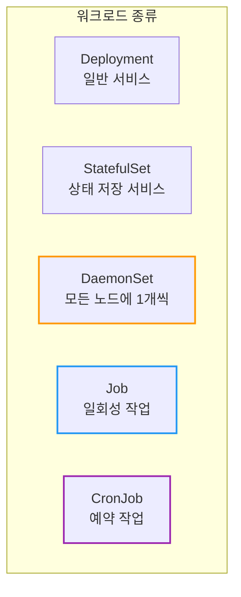
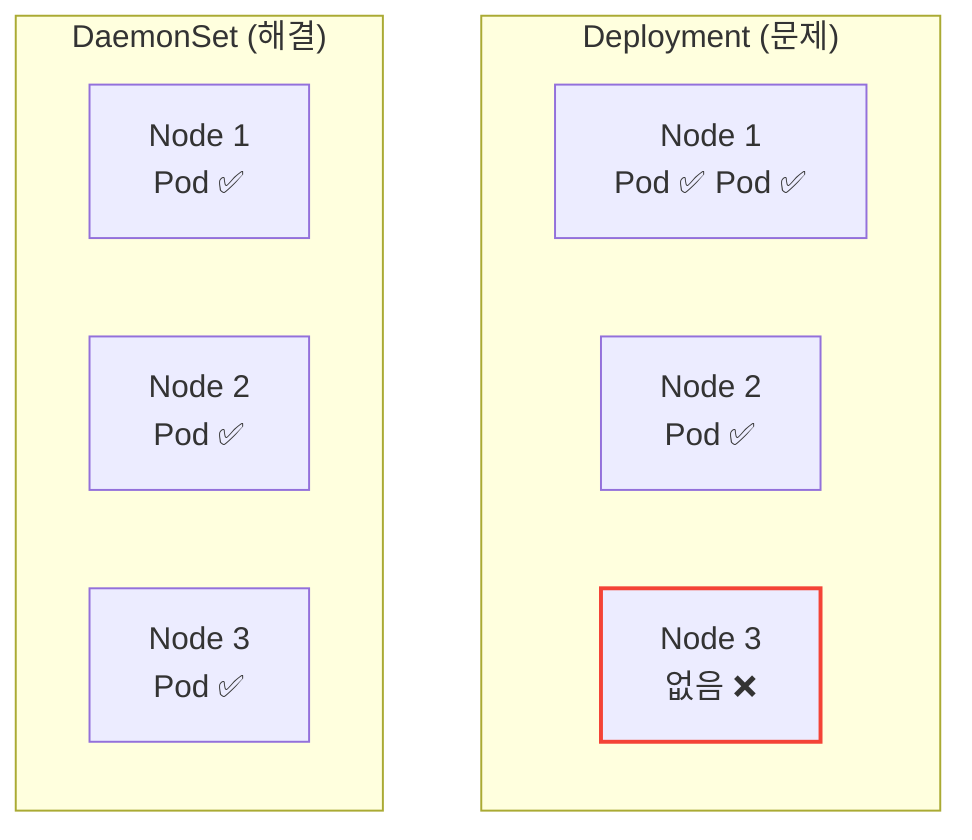
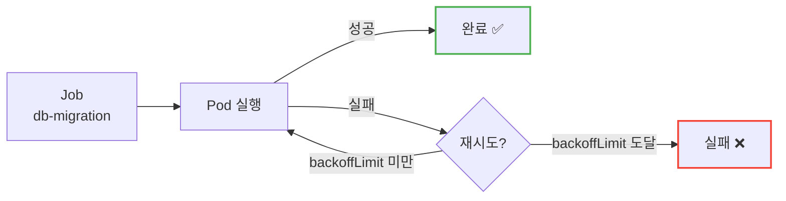
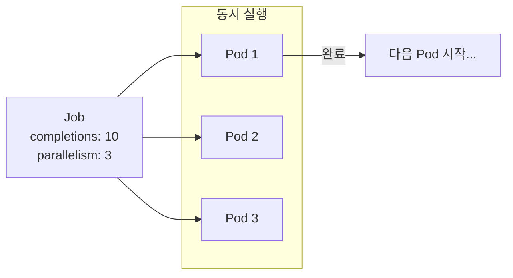
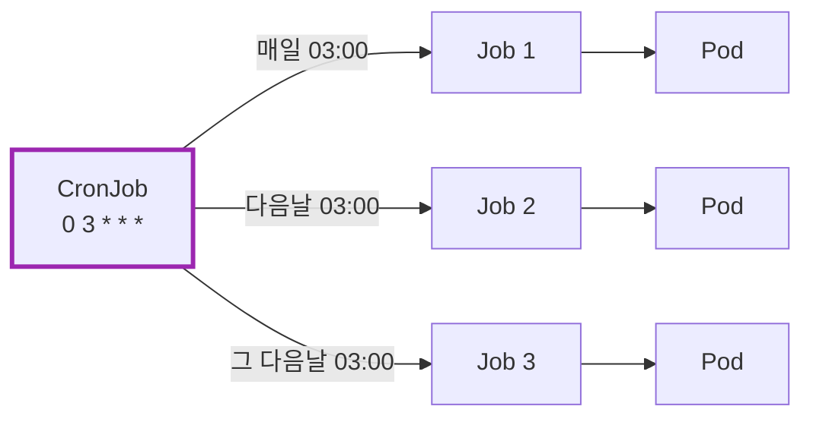
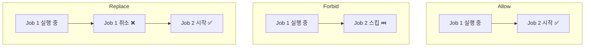
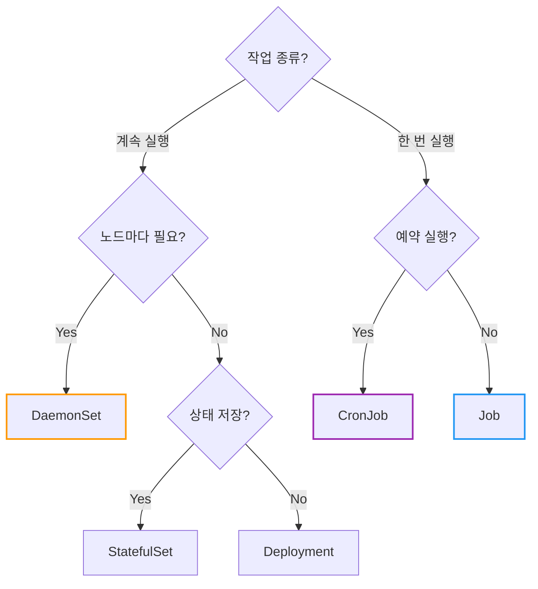
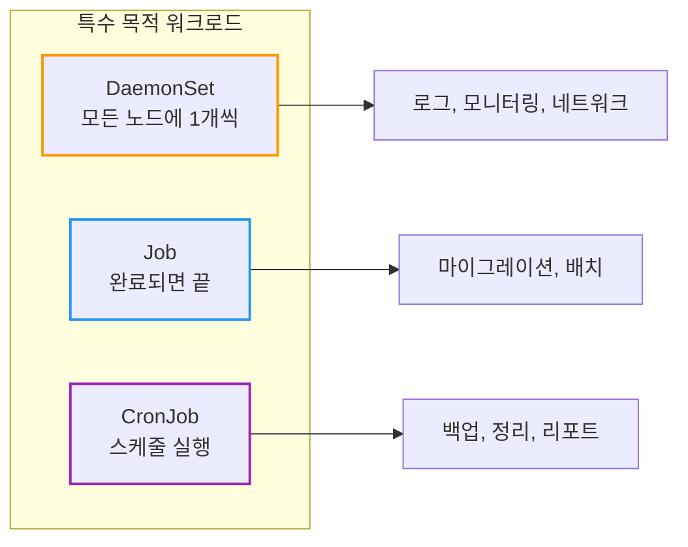

# Kubernetes DaemonSet, Job, CronJob: 특수 목적 워크로드

모든 노드에서 로그 수집기를 실행하려면 어떻게 해야 할까? 배치 작업은?

## 결론부터 말하면

Deployment, StatefulSet 외에도 **특수 목적**을 위한 워크로드 컨트롤러가 있다.



| 워크로드 | 특징 | 사용 예 |
|----------|------|---------|
| **DaemonSet** | 모든(또는 특정) 노드에 Pod 1개씩 | 로그 수집, 모니터링, 네트워크 플러그인 |
| **Job** | 완료될 때까지 실행, 성공하면 종료 | DB 마이그레이션, 배치 처리 |
| **CronJob** | 스케줄에 따라 Job 생성 | 백업, 리포트, 정리 작업 |

---

## 1. DaemonSet: 모든 노드에 Pod 배포

### 1.1 왜 DaemonSet이 필요한가?

**시나리오:** 모든 노드에서 로그를 수집해서 중앙 서버로 보내고 싶다.

Deployment로 `replicas: 3`을 설정하면?



Deployment는 Pod를 **어디에** 배치할지 보장하지 않는다. 한 노드에 2개가 갈 수도 있고, 어떤 노드에는 0개가 될 수도 있다.

**DaemonSet의 특징:**
- **모든 노드**에 정확히 **1개씩** Pod 배포
- 노드가 추가되면 **자동으로** Pod 생성
- 노드가 삭제되면 **자동으로** Pod 삭제

### 1.2 DaemonSet 사용 예

| 사용 예 | 설명 |
|---------|------|
| **로그 수집** | Fluentd, Filebeat |
| **모니터링** | Prometheus Node Exporter, Datadog Agent |
| **네트워크** | Calico, Cilium, kube-proxy |
| **스토리지** | CSI 드라이버 |

### 1.3 DaemonSet YAML 예시

```yaml
apiVersion: apps/v1
kind: DaemonSet
metadata:
  name: fluentd
  labels:
    app: fluentd
spec:
  selector:
    matchLabels:
      app: fluentd
  template:
    metadata:
      labels:
        app: fluentd
    spec:
      containers:
      - name: fluentd
        image: fluentd:v1.14
        volumeMounts:
        - name: varlog
          mountPath: /var/log
        - name: containers
          mountPath: /var/lib/docker/containers
          readOnly: true
      volumes:
      - name: varlog
        hostPath:
          path: /var/log
      - name: containers
        hostPath:
          path: /var/lib/docker/containers
```

**핵심:** `replicas` 필드가 없다! 노드 수에 따라 자동 결정.

### 1.4 특정 노드에만 배포하기

모든 노드가 아닌 **특정 노드**에만 배포하고 싶다면 `nodeSelector`나 `affinity`를 사용한다.

```yaml
spec:
  template:
    spec:
      nodeSelector:
        disk: ssd           # disk=ssd 라벨이 있는 노드에만
      containers:
      - name: app
        image: my-app
```

```yaml
# 또는 affinity로 더 세밀하게
spec:
  template:
    spec:
      affinity:
        nodeAffinity:
          requiredDuringSchedulingIgnoredDuringExecution:
            nodeSelectorTerms:
            - matchExpressions:
              - key: node-type
                operator: In
                values:
                - worker
```

### 1.5 Tolerations: 특수 노드에도 배포

Master 노드나 Taint가 있는 노드에도 배포하려면 `tolerations`이 필요하다.

```yaml
spec:
  template:
    spec:
      tolerations:
      - key: node-role.kubernetes.io/control-plane
        operator: Exists
        effect: NoSchedule
      containers:
      - name: monitoring
        image: monitoring-agent
```

---

## 2. Job: 일회성 작업

### 2.1 왜 Job이 필요한가?

**시나리오:** DB 마이그레이션 스크립트를 실행하고 싶다.

Deployment로 실행하면?
- 스크립트가 성공적으로 종료되면 Pod가 **죽은 것**으로 간주
- Deployment가 다시 Pod를 생성 → 무한 반복!

**Job의 특징:**
- Pod가 **성공적으로 완료**되면 끝
- 실패하면 **재시도** (설정에 따라)
- 완료된 Pod를 **유지** (로그 확인 가능)

### 2.2 Job YAML 예시

```yaml
apiVersion: batch/v1
kind: Job
metadata:
  name: db-migration
spec:
  template:
    spec:
      containers:
      - name: migration
        image: my-app:1.0
        command: ["python", "migrate.py"]
      restartPolicy: Never      # Job에서는 Never 또는 OnFailure
  backoffLimit: 3               # 최대 재시도 횟수
  ttlSecondsAfterFinished: 3600 # 완료 후 1시간 뒤 자동 삭제
```



### 2.3 Job 핵심 필드

| 필드 | 설명 | 기본값 |
|------|------|--------|
| `backoffLimit` | 최대 재시도 횟수 | 6 |
| `activeDeadlineSeconds` | 최대 실행 시간 (초) | 없음 |
| `ttlSecondsAfterFinished` | 완료 후 자동 삭제까지 시간 | 없음 (유지) |
| `completions` | 성공해야 할 Pod 수 | 1 |
| `parallelism` | 동시 실행 Pod 수 | 1 |

### 2.4 병렬 Job

여러 작업을 **동시에** 실행하고 싶을 때:

```yaml
apiVersion: batch/v1
kind: Job
metadata:
  name: batch-process
spec:
  completions: 10       # 총 10번 성공해야 완료
  parallelism: 3        # 동시에 3개씩 실행
  template:
    spec:
      containers:
      - name: worker
        image: batch-worker:1.0
      restartPolicy: Never
```



### 2.5 restartPolicy

Job에서는 `restartPolicy`가 **Never** 또는 **OnFailure**만 가능하다.

| 값 | 동작 |
|----|----- |
| `Never` | 실패 시 **새 Pod** 생성 (실패한 Pod 로그 유지) |
| `OnFailure` | 실패 시 **같은 Pod**에서 컨테이너 재시작 |

---

## 3. CronJob: 예약 작업

### 3.1 왜 CronJob이 필요한가?

**시나리오:** 매일 새벽 3시에 DB 백업을 실행하고 싶다.

CronJob은 **정해진 스케줄**에 따라 Job을 생성한다.



### 3.2 CronJob YAML 예시

```yaml
apiVersion: batch/v1
kind: CronJob
metadata:
  name: db-backup
spec:
  schedule: "0 3 * * *"           # 매일 03:00
  concurrencyPolicy: Forbid       # 이전 Job이 실행 중이면 스킵
  successfulJobsHistoryLimit: 3   # 성공한 Job 기록 보관 수
  failedJobsHistoryLimit: 1       # 실패한 Job 기록 보관 수
  jobTemplate:
    spec:
      template:
        spec:
          containers:
          - name: backup
            image: backup-tool:1.0
            command: ["./backup.sh"]
          restartPolicy: OnFailure
```

### 3.3 Cron 스케줄 문법

```
┌───────────── 분 (0 - 59)
│ ┌───────────── 시 (0 - 23)
│ │ ┌───────────── 일 (1 - 31)
│ │ │ ┌───────────── 월 (1 - 12)
│ │ │ │ ┌───────────── 요일 (0 - 6, 일요일 = 0)
│ │ │ │ │
* * * * *
```

| 예시 | 설명 |
|------|------|
| `0 * * * *` | 매시 정각 |
| `0 3 * * *` | 매일 03:00 |
| `0 0 * * 0` | 매주 일요일 00:00 |
| `*/15 * * * *` | 15분마다 |
| `0 9-18 * * 1-5` | 평일 9시~18시 매시 정각 |

> **타임존 주의!** 기본적으로 컨트롤러 매니저의 타임존을 따른다. 한국 시간으로 실행하려면 `timeZone`을 명시하라:
> ```yaml
> spec:
>   schedule: "0 3 * * *"
>   timeZone: "Asia/Seoul"    # Kubernetes 1.27+
> ```

### 3.4 CronJob 핵심 필드

| 필드 | 설명 |
|------|------|
| `schedule` | Cron 표현식 |
| `concurrencyPolicy` | `Allow`, `Forbid`, `Replace` |
| `startingDeadlineSeconds` | 스케줄 시간 후 이 시간 내에 시작 못하면 스킵 |
| `successfulJobsHistoryLimit` | 성공 Job 보관 수 (기본 3) |
| `failedJobsHistoryLimit` | 실패 Job 보관 수 (기본 1) |
| `suspend` | `true`면 일시 중지 |

### 3.5 Concurrency Policy

| 값 | 동작 |
|----|------|
| `Allow` | 동시 실행 허용 (기본값) |
| `Forbid` | 이전 Job이 실행 중이면 **스킵** |
| `Replace` | 이전 Job을 **취소**하고 새로 시작 |



---

## 4. 비교 정리

### 4.1 워크로드별 특성

| 특성 | Deployment | StatefulSet | DaemonSet | Job | CronJob |
|------|------------|-------------|-----------|-----|---------|
| 실행 방식 | 지속 실행 | 지속 실행 | 지속 실행 | 완료까지 | 스케줄 |
| Pod 수 | replicas 지정 | replicas 지정 | 노드당 1개 | completions | Job당 |
| 재시작 | 항상 | 항상 | 항상 | 제한적 | 제한적 |
| 순서 | 없음 | 있음 | 없음 | 없음 | 없음 |

### 4.2 선택 가이드



---

## 5. 자주 쓰는 명령어

```bash
# DaemonSet
kubectl get daemonset
kubectl describe daemonset fluentd
kubectl rollout status daemonset fluentd

# Job
kubectl get jobs
kubectl describe job db-migration
kubectl logs job/db-migration      # Job의 Pod 로그

# Job 수동 삭제
kubectl delete job db-migration

# CronJob
kubectl get cronjobs
kubectl describe cronjob db-backup

# CronJob 일시 중지
kubectl patch cronjob db-backup -p '{"spec":{"suspend":true}}'

# CronJob에서 수동으로 Job 생성
kubectl create job --from=cronjob/db-backup manual-backup
```

---

## 6. 정리



| 질문 | 답변 |
|------|------|
| 모든 노드에 로그 수집기를 배포하려면? | **DaemonSet** |
| DB 마이그레이션을 한 번만 실행하려면? | **Job** |
| 매일 백업을 예약 실행하려면? | **CronJob** |

**핵심 기억:**
1. **DaemonSet** = 노드당 1개, 로그/모니터링 에이전트
2. **Job** = 완료되면 끝, 재시도 가능, `restartPolicy: Never/OnFailure`
3. **CronJob** = Job을 스케줄에 따라 생성, Cron 문법 사용
4. Job의 `ttlSecondsAfterFinished`로 **자동 정리**
5. CronJob의 `concurrencyPolicy`로 **동시 실행 제어**

---

## 출처

- [Kubernetes Documentation - DaemonSet](https://kubernetes.io/docs/concepts/workloads/controllers/daemonset/) - 공식 문서
- [Kubernetes Documentation - Jobs](https://kubernetes.io/docs/concepts/workloads/controllers/job/) - 공식 문서
- [Kubernetes Documentation - CronJob](https://kubernetes.io/docs/concepts/workloads/controllers/cron-jobs/) - 공식 문서
