# Kubernetes DaemonSet, Job, CronJob: 특수 목적 워크로드

모든 노드에서 로그 수집기를 실행하려면 어떻게 해야 할까? 배치 작업은?

## 결론부터 말하면

Deployment, StatefulSet 외에도 **특수 목적**을 위한 워크로드 컨트롤러가 있다.

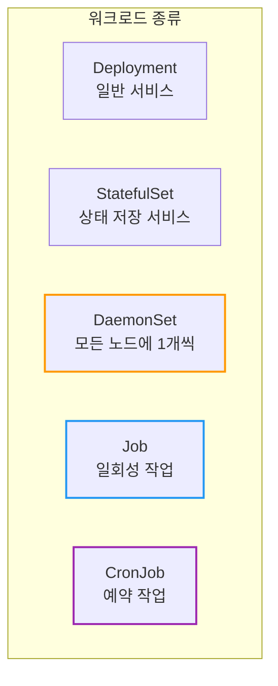

| 워크로드 | 특징 | 사용 예 |
|----------|------|---------|
| **DaemonSet** | 모든(또는 특정) 노드에 Pod 1개씩 | 로그 수집, 모니터링, 네트워크 플러그인 |
| **Job** | 완료될 때까지 실행, 성공하면 종료 | DB 마이그레이션, 배치 처리 |
| **CronJob** | 스케줄에 따라 Job 생성 | 백업, 리포트, 정리 작업 |

---

## 1. DaemonSet: 모든 노드에 Pod 배포

### 1.1 왜 DaemonSet이 필요한가?

**시나리오:** 모든 노드에서 로그를 수집해서 중앙 서버로 보내고 싶다.

Deployment로 `replicas: 3`을 설정하면?

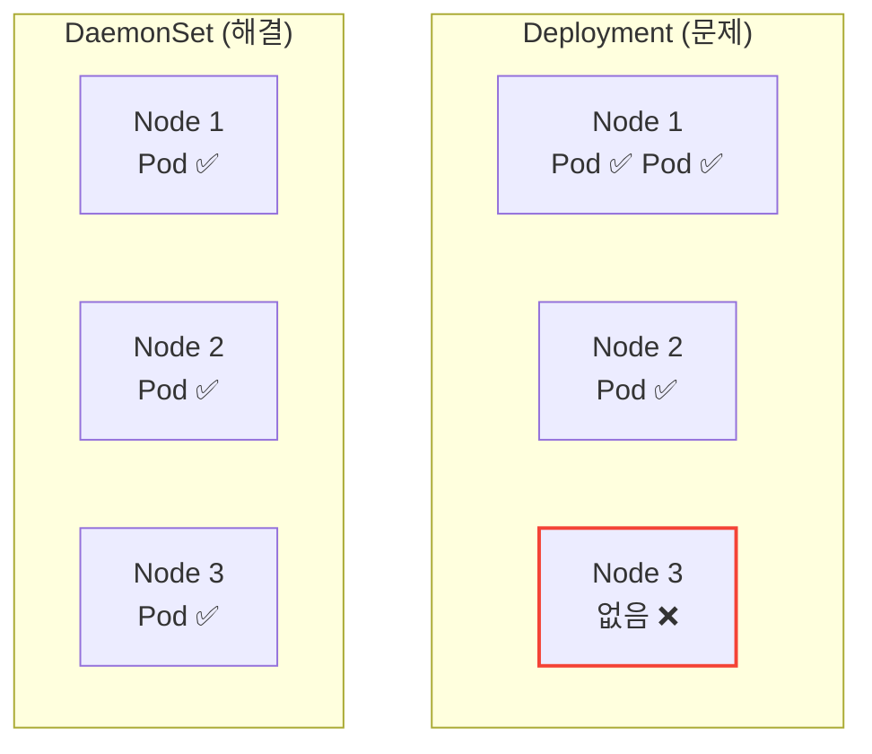

Deployment는 Pod를 **어디에** 배치할지 보장하지 않는다. 한 노드에 2개가 갈 수도 있고, 어떤 노드에는 0개가 될 수도 있다.

**DaemonSet의 특징:**
- **모든 노드**에 정확히 **1개씩** Pod 배포
- 노드가 추가되면 **자동으로** Pod 생성
- 노드가 삭제되면 **자동으로** Pod 삭제

### 1.2 DaemonSet 사용 예

| 사용 예 | 설명 |
|---------|------|
| **로그 수집** | Fluentd, Filebeat |
| **모니터링** | Prometheus Node Exporter, Datadog Agent |
| **네트워크** | Calico, Cilium, kube-proxy |
| **스토리지** | CSI 드라이버 |

### 1.3 DaemonSet YAML 예시

```yaml
apiVersion: apps/v1
kind: DaemonSet
metadata:
  name: fluentd
  labels:
    app: fluentd
spec:
  selector:
    matchLabels:
      app: fluentd
  template:
    metadata:
      labels:
        app: fluentd
    spec:
      containers:
      - name: fluentd
        image: fluentd:v1.14
        volumeMounts:
        - name: varlog
          mountPath: /var/log
        - name: containers
          mountPath: /var/lib/docker/containers
          readOnly: true
      volumes:
      - name: varlog
        hostPath:
          path: /var/log
      - name: containers
        hostPath:
          path: /var/lib/docker/containers
```

**핵심:** `replicas` 필드가 없다! 노드 수에 따라 자동 결정.

### 1.4 특정 노드에만 배포하기

모든 노드가 아닌 **특정 노드**에만 배포하고 싶다면 `nodeSelector`나 `affinity`를 사용한다.

```yaml
spec:
  template:
    spec:
      nodeSelector:
        disk: ssd           # disk=ssd 라벨이 있는 노드에만
      containers:
      - name: app
        image: my-app
```

```yaml
# 또는 affinity로 더 세밀하게
spec:
  template:
    spec:
      affinity:
        nodeAffinity:
          requiredDuringSchedulingIgnoredDuringExecution:
            nodeSelectorTerms:
            - matchExpressions:
              - key: node-type
                operator: In
                values:
                - worker
```

### 1.5 Tolerations: 특수 노드에도 배포

Master 노드나 Taint가 있는 노드에도 배포하려면 `tolerations`이 필요하다.

```yaml
spec:
  template:
    spec:
      tolerations:
      - key: node-role.kubernetes.io/control-plane
        operator: Exists
        effect: NoSchedule
      containers:
      - name: monitoring
        image: monitoring-agent
```

### 1.6 Update Strategy: RollingUpdate vs OnDelete

DaemonSet도 업데이트 전략이 있다. Deployment와 비슷하지만 노드당 1개라는 특성 때문에 동작이 다르다.

| 전략 | 동작 | 사용 시점 |
|------|------|----------|
| **RollingUpdate** (기본) | 자동으로 이전 Pod 삭제 후 새 Pod 생성 | 대부분의 경우 |
| **OnDelete** | 수동으로 Pod 삭제해야 새 Pod 생성 | 점진적 수동 배포 필요 시 |

```yaml
spec:
  updateStrategy:
    type: RollingUpdate
    rollingUpdate:
      maxUnavailable: 1        # 동시에 업데이트할 노드 수
      maxSurge: 0              # 기본값: 기존 Pod 삭제 후 새 Pod 생성
  minReadySeconds: 30          # 새 Pod가 Ready 후 대기 시간
```

**maxSurge 옵션 (Kubernetes 1.22+):**

> **참고:** Kubernetes 1.22 이전에는 `maxSurge: 0` 방식만 가능했다. 1.22부터 다운타임을 줄이기 위한 `maxSurge: 1` 옵션이 추가되었다.

| maxSurge | 동작 | 트레이드오프 |
|----------|------|-------------|
| `0` (기본) | 기존 Pod 삭제 → 새 Pod 생성 | 일시적 서비스 중단 |
| `1` 또는 `"10%"` | 새 Pod 생성 → 기존 Pod 삭제 | 리소스 일시 추가 사용, 다운타임 최소화 |

> **팁:** 대규모 클러스터에서는 `"10%"`처럼 백분율로 지정하면 더 유연하다.

다운타임에 민감한 모니터링/로그 에이전트라면 `maxSurge: 1`을 고려하라.

**RollingUpdate 동작 원리:**

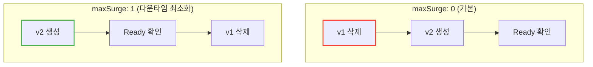

**운영 팁:**
- **모니터링/로그 에이전트**는 `maxUnavailable: 1`로 안전하게
- **네트워크 플러그인(CNI)** 은 `OnDelete`로 신중하게

> **왜 CNI는 OnDelete인가?** CNI 업데이트 실패 시 해당 노드의 네트워크가 **완전히 두절**될 수 있다. 이 경우 컨트롤 플레인이 해당 노드를 더 이상 제어(롤백 포함)할 수 없게 된다. `OnDelete`를 사용하면 운영자가 한 노드씩 수동으로 업데이트하고 연결성을 확인한 후 다음 노드로 넘어갈 수 있다.

### 1.7 Priority Class: 리소스 부족 시 보호

**문제 상황:** 노드에 리소스가 부족하면 DaemonSet Pod도 eviction 대상이 될 수 있다.

로그 수집기나 모니터링 에이전트가 eviction되면? 장애 시점의 로그가 사라진다!

```yaml
spec:
  template:
    spec:
      priorityClassName: system-node-critical   # 최고 우선순위
      containers:
      - name: fluentd
        image: fluentd:v1.14
```

**내장 Priority Class:**

| PriorityClass | 값 | 용도 |
|---------------|-----|------|
| `system-node-critical` | 2000001000 | 노드 필수 컴포넌트 (CNI, kube-proxy) |
| `system-cluster-critical` | 2000000000 | 클러스터 필수 컴포넌트 (DNS) |

**실무 가이드:**

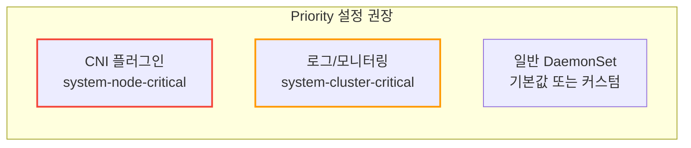

**Disk Pressure에서도 보호하려면:**

```yaml
spec:
  template:
    spec:
      priorityClassName: system-cluster-critical
      tolerations:
      - key: node.kubernetes.io/disk-pressure
        operator: Exists
        effect: NoExecute      # Disk pressure에서도 유지
```

### 1.8 EKS Fargate: DaemonSet이 안 된다!

**중요:** AWS Fargate에서는 DaemonSet을 사용할 수 없다.

Fargate의 특성:
- Pod 하나 = 가상 노드 하나
- 노드에 직접 접근 불가
- hostPath, hostNetwork, privileged 모두 불가

**문제:** EC2 + Fargate 혼합 클러스터에서 DaemonSet을 배포하면?

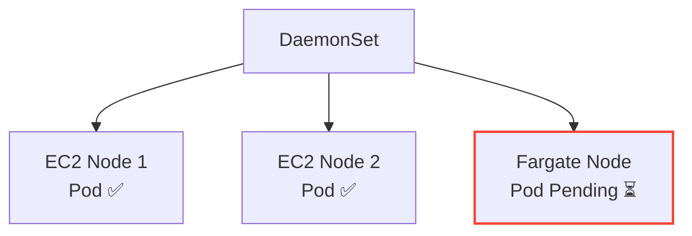

Fargate 노드에는 스케줄링되지만 **Pending 상태**로 남는다.

**해결: NodeAffinity로 Fargate 제외**

```yaml
spec:
  template:
    spec:
      affinity:
        nodeAffinity:
          requiredDuringSchedulingIgnoredDuringExecution:
            nodeSelectorTerms:
            - matchExpressions:
              - key: eks.amazonaws.com/compute-type
                operator: NotIn
                values:
                - fargate
      containers:
      - name: fluentd
        image: fluentd:v1.14
```

**Fargate에서 로그/모니터링은?**

| 대안 | 설명 |
|------|------|
| **Sidecar 패턴** | 각 Pod에 로그 수집 컨테이너 추가 |
| **AWS 네이티브** | FireLens, CloudWatch Container Insights |

### 1.9 Karpenter와 DaemonSet

[Karpenter](https://karpenter.sh/)를 사용하면 DaemonSet이 노드 프로비저닝에 영향을 준다.

**문제:** 새 DaemonSet을 배포하면 기존 노드에 공간이 없을 수 있다.

Karpenter는 DaemonSet Pod를 위해 직접 노드를 프로비저닝하지 않는다. 왜일까?

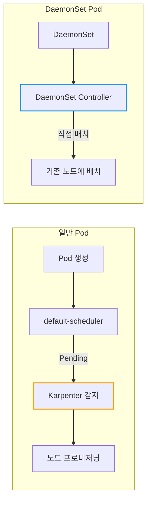

DaemonSet Pod는 `default-scheduler`가 아닌 **DaemonSet Controller**가 직접 노드에 배치한다. Karpenter는 기본 스케줄러가 Pending 상태로 둔 Pod만 감지하므로, DaemonSet Pod는 프로비저닝을 유발하지 않는다.

**해결:** Priority Class로 기존 Pod를 eviction

```yaml
spec:
  template:
    spec:
      priorityClassName: system-node-critical   # 일반 Pod보다 높은 우선순위
```

이렇게 하면 Karpenter가 프로비저닝한 노드에서 일반 Pod가 eviction되고 DaemonSet Pod가 배치된다.

---

## 2. Job: 일회성 작업

### 2.1 왜 Job이 필요한가?

**시나리오:** DB 마이그레이션 스크립트를 실행하고 싶다.

Deployment로 실행하면?
- 스크립트가 성공적으로 종료되면 Pod가 **죽은 것**으로 간주
- Deployment가 다시 Pod를 생성 → 무한 반복!

**Job의 특징:**
- Pod가 **성공적으로 완료**되면 끝
- 실패하면 **재시도** (설정에 따라)
- 완료된 Pod를 **유지** (로그 확인 가능)

### 2.2 Job YAML 예시

```yaml
apiVersion: batch/v1
kind: Job
metadata:
  name: db-migration
spec:
  template:
    spec:
      containers:
      - name: migration
        image: my-app:1.0
        command: ["python", "migrate.py"]
      restartPolicy: Never      # Job에서는 Never 또는 OnFailure
  backoffLimit: 3               # 최대 재시도 횟수
  ttlSecondsAfterFinished: 3600 # 완료 후 1시간 뒤 자동 삭제
```

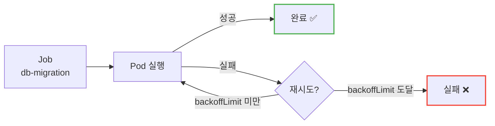

### 2.3 Job 핵심 필드

| 필드 | 설명 | 기본값 |
|------|------|--------|
| `backoffLimit` | 최대 재시도 횟수 | 6 |
| `activeDeadlineSeconds` | 최대 실행 시간 (초) | 없음 |
| `ttlSecondsAfterFinished` | 완료 후 자동 삭제까지 시간 | 없음 (유지) |
| `completions` | 성공해야 할 Pod 수 | 1 |
| `parallelism` | 동시 실행 Pod 수 | 1 |

### 2.4 병렬 Job

여러 작업을 **동시에** 실행하고 싶을 때:

```yaml
apiVersion: batch/v1
kind: Job
metadata:
  name: batch-process
spec:
  completions: 10       # 총 10번 성공해야 완료
  parallelism: 3        # 동시에 3개씩 실행
  template:
    spec:
      containers:
      - name: worker
        image: batch-worker:1.0
      restartPolicy: Never
```

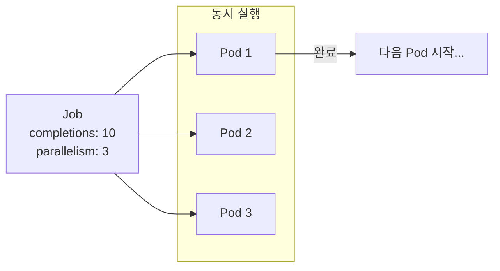

### 2.5 restartPolicy

Job에서는 `restartPolicy`가 **Never** 또는 **OnFailure**만 가능하다. 둘의 차이를 정확히 이해해야 한다.

| 값 | 동작 |
|----|----- |
| `OnFailure` | **(권장)** 컨테이너 실패 시 **같은 Pod에서 재시작** 시도. 재시작 백오프 한도 초과 또는 노드 장애 시 새 Pod 생성 |
| `Never` | 컨테이너 실패 시 재시작 없이 **즉시 Pod 실패** 처리. Job 컨트롤러가 `backoffLimit`에 따라 새 Pod 생성 |

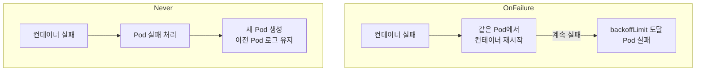

**실무 가이드:**
- 일반적인 배치 작업 → `OnFailure` (리소스 효율적)
- 디버깅이 필요한 작업 → `Never` (실패 Pod 보존)

**Never의 장점:**

| 장점 | 설명 |
|------|------|
| **디버깅** | 실패한 Pod가 보존되어 로그, 이벤트, 종료 코드 확인 가능 |
| **클린 환경** | 새 Pod는 다른 노드에 배치될 수 있어, 노드 문제로 인한 실패 시 깨끗한 환경에서 재시도 |

```bash
# 실패한 Pod 분석
kubectl logs <failed-pod>
kubectl describe pod <failed-pod>
```

`OnFailure`는 같은 Pod(같은 노드)에서 컨테이너만 재시작하므로, 노드 수준의 문제(네트워크, 디스크 등)가 해결되지 않은 채 재시도할 수 있다.

### 2.6 Indexed Job: 병렬 작업 분배

`parallelism`으로 여러 Pod를 실행할 때, 각 Pod가 **어떤 작업을 처리해야 하는지** 어떻게 알 수 있을까?

**Indexed Job**을 사용하면 각 Pod에 고유한 인덱스가 할당된다.

**JOB_COMPLETION_INDEX 환경 변수:**

`completionMode: Indexed` 설정 시, 각 Pod에 `JOB_COMPLETION_INDEX` 환경 변수가 **별도 설정 없이 자동 주입**된다 (0부터 completions-1까지).

```yaml
apiVersion: batch/v1
kind: Job
metadata:
  name: indexed-job
spec:
  completions: 5
  parallelism: 3
  completionMode: Indexed      # 핵심! Indexed 모드 활성화
  template:
    spec:
      containers:
      - name: worker
        image: batch-worker:1.0
        # 자동 주입된 JOB_COMPLETION_INDEX를 바로 사용
        command: ["./process.sh", "$(JOB_COMPLETION_INDEX)"]
      restartPolicy: Never
```

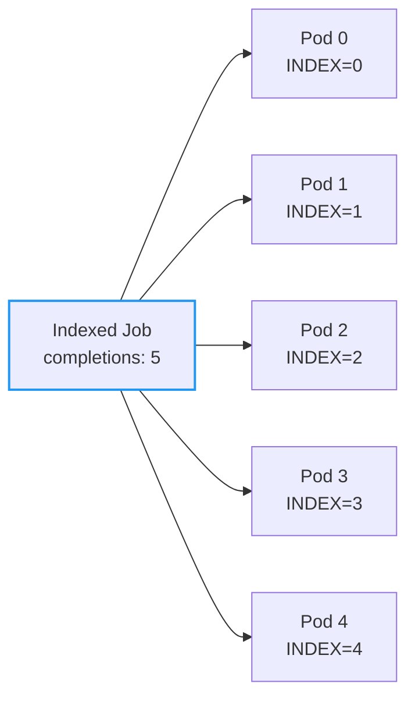

**사용 예:**
- 데이터 분할 처리 (파일 1000개를 10개씩 나눠서)
- 분산 시뮬레이션 (파라미터별 실험)
- 병렬 테스트 (테스트 케이스 분배)

### 2.7 Pod Failure Policy: 스마트한 재시도

기본적으로 Job은 모든 실패에 대해 동일하게 재시도한다. 하지만 어떤 실패는 재시도해도 의미가 없다.

**예시:**
- Exit Code 42 = "설정 오류" → 재시도 무의미, 즉시 실패 처리
- Exit Code 137 = "OOM Killed" → 재시도 가치 있음

```yaml
apiVersion: batch/v1
kind: Job
metadata:
  name: smart-retry-job
spec:
  backoffLimit: 3
  podFailurePolicy:
    rules:
    - action: FailJob           # 이 조건이면 Job 전체 실패
      onExitCodes:
        containerName: main
        operator: In
        values: [42]            # 설정 오류는 재시도 무의미
    - action: Ignore            # 이 조건은 무시 (재시도 횟수에 포함 안 함)
      onPodConditions:
      - type: DisruptionTarget  # 노드 drain으로 인한 종료
    - action: Count             # 기본: 재시도 횟수에 포함
      onExitCodes:
        operator: NotIn
        values: [0]             # 성공이 아닌 모든 경우
  template:
    spec:
      containers:
      - name: main
        image: my-job:1.0
      restartPolicy: Never
```

**podFailurePolicy Actions:**

| Action | 동작 |
|--------|------|
| `FailJob` | Job 전체를 즉시 실패 처리 |
| `Ignore` | 재시도 횟수에 포함하지 않음 |
| `Count` | 재시도 횟수에 포함 (기본 동작) |

**⚠️ 규칙 순서가 중요하다:** `rules`는 **순서대로** 평가되며, 첫 번째로 일치하는 규칙이 적용된다. 예를 들어 `Ignore` 규칙이 `FailJob` 규칙보다 먼저 있으면 의도와 다르게 동작할 수 있다.

### 2.8 TTL 기반 자동 정리

**문제:** Job과 Pod가 쌓인다.

완료된 Job을 정리하지 않으면 어떻게 될까?

실제 사례: 1년간 Job을 정리하지 않은 클러스터에서 **10만 개 이상의 Job**이 쌓여 etcd가 느려지고 클러스터가 불안정해졌다.

```yaml
spec:
  ttlSecondsAfterFinished: 86400   # 완료 후 24시간 뒤 자동 삭제
```

**실무 가이드:**

| 상황 | TTL 설정 |
|------|----------|
| 짧은 배치 작업 | `3600` (1시간) |
| 디버깅이 필요한 작업 | `86400` (24시간) |
| 감사 로그가 필요한 작업 | 미설정 + 별도 정리 스크립트 |

**⚠️ 주의:** TTL이 설정되지 않으면 Job이 영구 보존된다. 반드시 설정하거나 별도 정리 프로세스를 만들어라.

### 2.9 멱등성(Idempotency) 설계

**중요:** Job 컨트롤러는 멱등성을 보장하지 않는다.

**시나리오:** DB 마이그레이션 Job이 실행 중 노드가 죽었다.

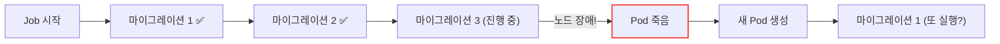

마이그레이션 1, 2가 **다시 실행**될 수 있다!

**해결책:**

| 방법 | 설명 |
|------|------|
| **상태 테이블** | 완료된 작업을 DB에 기록, 재실행 시 스킵 |
| **버전 체크** | 이미 적용된 버전이면 스킵 |
| **트랜잭션** | 작업 단위를 원자적으로 처리 |

```python
# 멱등성 있는 마이그레이션 예시
def migrate():
    if is_already_applied("migration_001"):
        return  # 이미 적용됨, 스킵

    with transaction():
        apply_migration()
        mark_as_applied("migration_001")
```

---

## 3. CronJob: 예약 작업

### 3.1 왜 CronJob이 필요한가?

**시나리오:** 매일 새벽 3시에 DB 백업을 실행하고 싶다.

CronJob은 **정해진 스케줄**에 따라 Job을 생성한다.

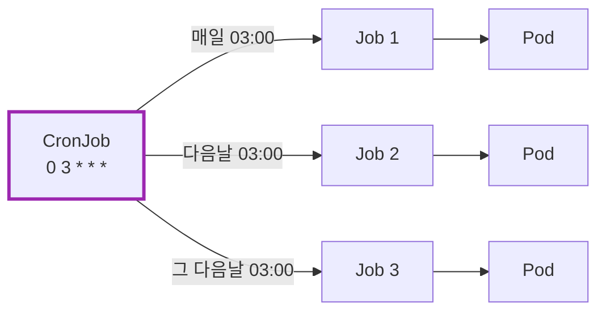

### 3.2 CronJob YAML 예시

```yaml
apiVersion: batch/v1
kind: CronJob
metadata:
  name: db-backup
spec:
  schedule: "0 3 * * *"           # 매일 03:00
  concurrencyPolicy: Forbid       # 이전 Job이 실행 중이면 스킵
  successfulJobsHistoryLimit: 3   # 성공한 Job 기록 보관 수
  failedJobsHistoryLimit: 1       # 실패한 Job 기록 보관 수
  jobTemplate:
    spec:
      template:
        spec:
          containers:
          - name: backup
            image: backup-tool:1.0
            command: ["./backup.sh"]
          restartPolicy: OnFailure
```

### 3.3 Cron 스케줄 문법

```
┌───────────── 분 (0 - 59)
│ ┌───────────── 시 (0 - 23)
│ │ ┌───────────── 일 (1 - 31)
│ │ │ ┌───────────── 월 (1 - 12)
│ │ │ │ ┌───────────── 요일 (0 - 6, 일요일 = 0)
│ │ │ │ │
* * * * *
```

| 예시 | 설명 |
|------|------|
| `0 * * * *` | 매시 정각 |
| `0 3 * * *` | 매일 03:00 |
| `0 0 * * 0` | 매주 일요일 00:00 |
| `*/15 * * * *` | 15분마다 |
| `0 9-18 * * 1-5` | 평일 9시~18시 매시 정각 |

> **타임존 주의!** 기본적으로 컨트롤러 매니저의 타임존을 따른다. 한국 시간으로 실행하려면 `timeZone`을 명시하라:
> ```yaml
> spec:
>   schedule: "0 3 * * *"
>   timeZone: "Asia/Seoul"    # Kubernetes 1.27+
> ```

### 3.4 CronJob 핵심 필드

| 필드 | 설명 |
|------|------|
| `schedule` | Cron 표현식 |
| `concurrencyPolicy` | `Allow`, `Forbid`, `Replace` |
| `startingDeadlineSeconds` | 스케줄 시간 후 이 시간 내에 시작 못하면 스킵 |
| `successfulJobsHistoryLimit` | 성공 Job 보관 수 (기본 3) |
| `failedJobsHistoryLimit` | 실패 Job 보관 수 (기본 1) |
| `suspend` | `true`면 일시 중지 |

### 3.5 Concurrency Policy

| 값 | 동작 |
|----|------|
| `Allow` | 동시 실행 허용 (기본값) |
| `Forbid` | 이전 Job이 실행 중이면 **스킵** |
| `Replace` | 이전 Job을 **취소**하고 새로 시작 |

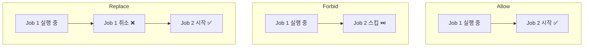

**⚠️ Forbid 주의:** 스킵된 실행은 **영구적으로 누락**된다. 나중에 따라잡기(catch-up)하지 않는다.

**Forbid 사용 시 모니터링:**

Job 실행 시간이 스케줄 간격보다 길면 작업이 "조용히" 중단될 수 있다.

```bash
# 마지막 스케줄 시간 확인
kubectl get cronjob db-backup -o jsonpath='{.status.lastScheduleTime}'
```

`.status.lastScheduleTime`이 예상보다 오래되었다면 Job이 계속 스킵되고 있는 것이다.

### 3.6 startingDeadlineSeconds: 누락 스케줄 처리

**문제:** kube-controller-manager가 잠시 장애가 났다. 예약된 Job이 정시에 실행되지 못했다.

`startingDeadlineSeconds`는 스케줄 시점 이후 **얼마나 늦게까지** Job을 시작할 수 있는지 정의한다.

```yaml
spec:
  schedule: "0 3 * * *"
  startingDeadlineSeconds: 200   # 03:00 이후 200초(3분 20초)까지 시작 가능
```

**concurrencyPolicy: Forbid vs startingDeadlineSeconds:**

| 상황 | 동작 |
|------|------|
| **Forbid로 스킵** | 이전 Job이 아직 실행 중 → **영구 누락** |
| **startingDeadlineSeconds 초과** | 컨트롤러 장애로 늦음 → **영구 누락** |
| **startingDeadlineSeconds 이내** | 컨트롤러 복구 후 **따라잡기 실행** |

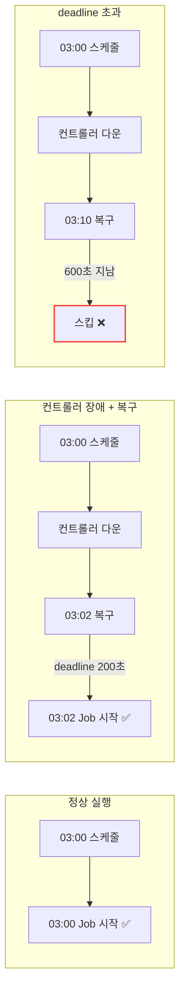

**⚠️ 중요:** `startingDeadlineSeconds`를 **10초 미만**으로 설정하면 CronJob이 스케줄되지 않을 수 있다. CronJob 컨트롤러가 10초마다 체크하기 때문이다.

### 3.7 100회 이상 누락 시 보호 메커니즘

**시나리오:** 클러스터가 오랫동안 다운되었다가 복구되었다.

컨트롤러가 **100회 이상** 누락된 스케줄을 감지하면 Job을 시작하지 않고 에러를 기록한다.

```
Cannot determine if job needs to be started. Too many missed start times (> 100).
Set or decrease .spec.startingDeadlineSeconds or check clock skew.
```

**왜 이런 보호가 필요할까?**

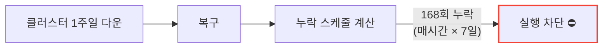

만약 100회 모두 실행하면? 리소스 폭발, 동시 실행 충돌 등 심각한 문제 발생.

**해결책:**
1. `startingDeadlineSeconds`를 적절히 설정 (예: 3600초)
2. 복구 후 수동으로 필요한 Job 실행

### 3.8 Timezone 설정 (Kubernetes 1.27+)

**문제:** 한국에서 "매일 새벽 3시"에 실행하고 싶다. `0 3 * * *`로 설정했는데...

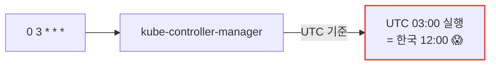

기본적으로 CronJob은 **kube-controller-manager의 타임존**을 따른다. 대부분 UTC다.

**해결: timeZone 필드 (1.27+ 정식 지원)**

```yaml
apiVersion: batch/v1
kind: CronJob
metadata:
  name: korea-backup
spec:
  schedule: "0 3 * * *"
  timeZone: "Asia/Seoul"      # 한국 시간 03:00에 실행
  jobTemplate:
    spec:
      template:
        spec:
          containers:
          - name: backup
            image: backup:1.0
          restartPolicy: OnFailure
```

**⚠️ 절대 하지 마라:**

```yaml
# ❌ CRON_TZ, TZ 변수는 공식 지원 아님!
spec:
  schedule: "CRON_TZ=Asia/Seoul 0 3 * * *"   # 동작하지 않음
```

`CRON_TZ`나 `TZ` 변수를 스케줄에 넣으면 **validation error**가 발생한다.

**Kubernetes 버전별 지원:**

| 버전 | 상태 |
|------|------|
| 1.24 | Alpha (`CronJobTimeZone` feature gate 필요) |
| 1.25-1.26 | Beta (기본 활성화) |
| **1.27+** | **Stable** (정식 지원) |

**1.27 미만 버전 대안:**

`timeZone` 필드를 사용할 수 없다면, 스케줄을 **UTC 기준으로 변환**해서 작성한다.

```yaml
# 한국 시간 오전 9시 = UTC 오전 0시 (KST = UTC+9)
spec:
  schedule: "0 0 * * *"    # UTC 00:00 = KST 09:00
```

| 한국 시간 (KST) | UTC | 스케줄 |
|-----------------|-----|--------|
| 09:00 | 00:00 | `0 0 * * *` |
| 03:00 | 18:00 (전날) | `0 18 * * *` |
| 12:00 | 03:00 | `0 3 * * *` |

### 3.9 TTL과 History Limit의 상호작용

CronJob에는 두 가지 정리 메커니즘이 있다:

| 메커니즘 | 기준 | 설정 위치 |
|----------|------|----------|
| **History Limit** | Job **개수** | CronJob spec |
| **TTL** | Job **완료 후 시간** | jobTemplate spec |

```yaml
spec:
  successfulJobsHistoryLimit: 3    # 성공 Job 3개 유지
  failedJobsHistoryLimit: 1
  jobTemplate:
    spec:
      ttlSecondsAfterFinished: 3600  # 완료 후 1시간 뒤 삭제
```

**⚠️ 주의:** 두 메커니즘은 독립적으로 동작한다.

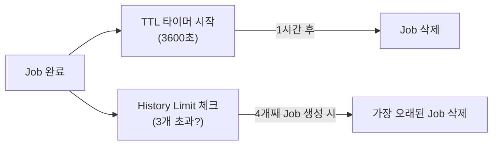

- TTL이 너무 짧으면 History Limit 이전에 Job이 삭제될 수 있다
- History Limit만 사용하면 Job 간격이 길 때 오래된 Job이 계속 남아있을 수 있다

**실무 권장:**
- 짧은 간격 CronJob (분/시간 단위): `historyLimit`만 사용
- 긴 간격 CronJob (일/주 단위): `ttlSecondsAfterFinished`도 함께 설정

### 3.10 CronJob의 멱등성

Job과 마찬가지로 **CronJob도 멱등성을 보장하지 않는다**.

더 나쁜 점: 특정 조건에서 **같은 스케줄에 Job이 2개** 생성될 수 있다.

```yaml
# 멱등성이 중요한 이유
spec:
  schedule: "0 * * * *"
  concurrencyPolicy: Allow    # 동시 실행 허용 시 더 위험
```

**실무 가이드:**
- CronJob의 작업은 **반드시 멱등성**을 가지도록 설계
- 중복 실행되어도 결과가 같아야 함
- 예: "전날 데이터 집계"는 같은 날짜에 2번 실행해도 같은 결과

---

## 4. 비교 정리

### 4.1 워크로드별 특성

| 특성 | Deployment | StatefulSet | DaemonSet | Job | CronJob |
|------|------------|-------------|-----------|-----|---------|
| 실행 방식 | 지속 실행 | 지속 실행 | 지속 실행 | 완료까지 | 스케줄 |
| Pod 수 | replicas 지정 | replicas 지정 | 노드당 1개 | completions | Job당 |
| 재시작 | 항상 | 항상 | 항상 | 제한적 | 제한적 |
| 순서 | 없음 | 있음 | 없음 | 없음 | 없음 |

### 4.2 선택 가이드

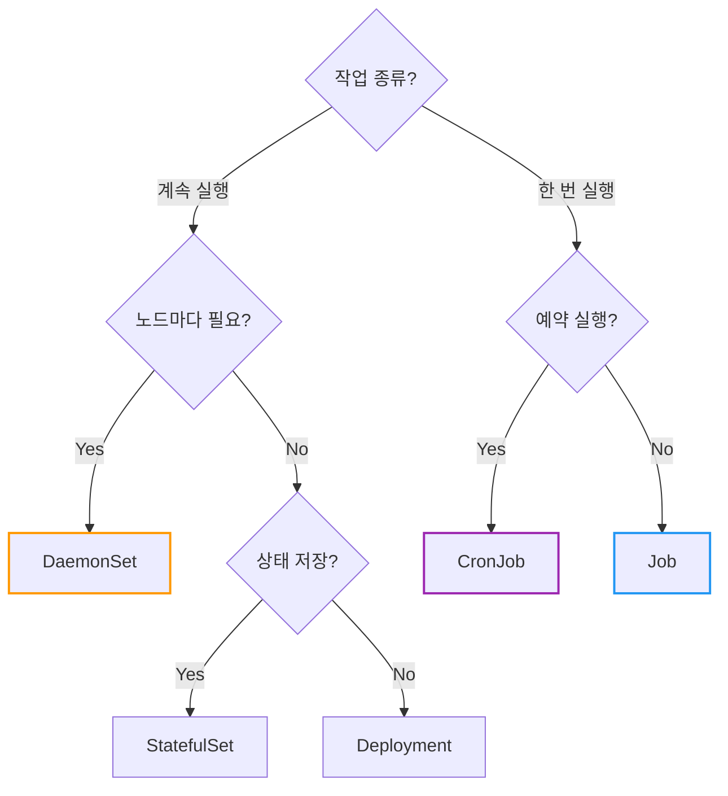

---

## 5. 자주 쓰는 명령어

```bash
# DaemonSet
kubectl get daemonset
kubectl describe daemonset fluentd
kubectl rollout status daemonset fluentd

# Job
kubectl get jobs
kubectl describe job db-migration
kubectl logs job/db-migration      # Job의 Pod 로그

# Job 수동 삭제
kubectl delete job db-migration

# CronJob
kubectl get cronjobs
kubectl describe cronjob db-backup

# CronJob 일시 중지
kubectl patch cronjob db-backup -p '{"spec":{"suspend":true}}'

# CronJob에서 수동으로 Job 생성
kubectl create job --from=cronjob/db-backup manual-backup
```

---

## 6. 클라우드별 운영 가이드

### 6.1 AWS EKS

**DaemonSet과 Fargate:**

EKS에서 EC2 + Fargate 혼합 클러스터를 운영한다면 DaemonSet에 반드시 Fargate 제외 설정을 추가하라. (1.8절 참조)

```yaml
# 모든 DaemonSet에 추가
spec:
  template:
    spec:
      affinity:
        nodeAffinity:
          requiredDuringSchedulingIgnoredDuringExecution:
            nodeSelectorTerms:
            - matchExpressions:
              - key: eks.amazonaws.com/compute-type
                operator: NotIn
                values: [fargate]
```

**Karpenter 사용 시:**

DaemonSet에 높은 Priority Class를 설정하라. (1.9절 참조)

| 컴포넌트 | 권장 설정 |
|----------|----------|
| CNI (VPC CNI) | `system-node-critical` (이미 설정됨) |
| 모니터링 에이전트 | `system-cluster-critical` |
| 로그 수집기 | `system-cluster-critical` |

### 6.2 Azure AKS

**Virtual Nodes (ACI):**

AWS Fargate와 마찬가지로 Azure Virtual Nodes(ACI 기반)에서도 DaemonSet이 지원되지 않는다.

```yaml
# ACI 노드 제외
spec:
  template:
    spec:
      affinity:
        nodeAffinity:
          requiredDuringSchedulingIgnoredDuringExecution:
            nodeSelectorTerms:
            - matchExpressions:
              - key: type
                operator: NotIn
                values: [virtual-kubelet]
```

**노드 풀 업그레이드:**

AKS에서 노드 풀을 업그레이드하면 노드가 순차적으로 교체된다. DaemonSet의 `maxUnavailable`을 적절히 설정하라.

### 6.3 Google GKE

**Autopilot 모드:**

GKE Autopilot에서는 DaemonSet 사용에 제한이 있다. Google이 관리하는 DaemonSet만 허용된다.

| 모드 | DaemonSet |
|------|-----------|
| **Standard** | 자유롭게 사용 가능 |
| **Autopilot** | Google 관리형만 허용 (사용자 정의 불가) |

Autopilot에서 로그/모니터링이 필요하면 **Sidecar 패턴** 또는 Google Cloud의 관리형 서비스를 사용하라.

**노드 업그레이드 전략:**

GKE는 Surge Upgrade와 Blue-Green Upgrade를 지원한다.

| 전략 | 특징 |
|------|------|
| **Surge Upgrade** (기본) | 추가 노드를 만들어 롤링 업그레이드 |
| **Blue-Green Upgrade** | 새 노드 풀 생성 후 트래픽 전환 |

DaemonSet 업데이트와 노드 업그레이드가 동시에 발생하면 복잡해질 수 있으므로, 노드 업그레이드 중에는 DaemonSet 업데이트를 피하라.

### 6.4 공통: CronJob 스케줄 분산

**문제:** 모든 CronJob을 같은 시간에 실행하면 "Thundering Herd" 현상이 발생한다.

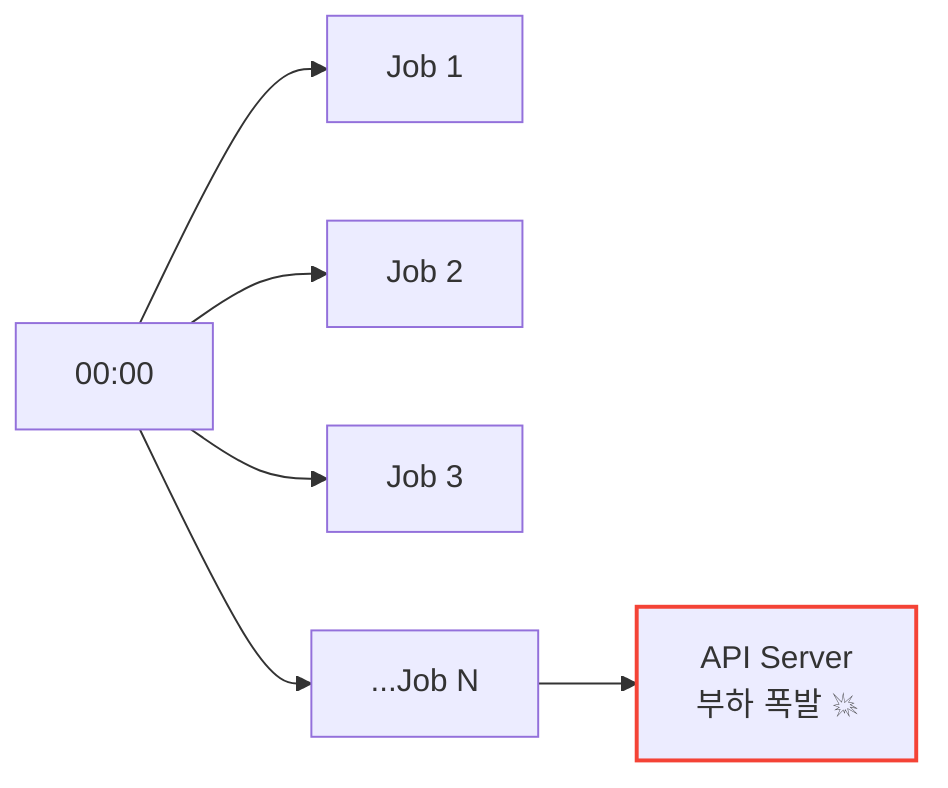

**해결: 스케줄에 Jitter 추가**

```yaml
# ❌ 모두 같은 시간
# schedule: "0 0 * * *"   # Job A
# schedule: "0 0 * * *"   # Job B
# schedule: "0 0 * * *"   # Job C

# ✅ 분산된 스케줄
# schedule: "0 0 * * *"   # Job A - 00:00
# schedule: "3 0 * * *"   # Job B - 00:03
# schedule: "7 0 * * *"   # Job C - 00:07
```

**권장 사항:**
- CronJob 간 최소 1-5분 간격
- 중요 작업은 피크 시간대 회피
- 대규모 클러스터에서는 스케줄 분산 필수

---

## 7. 정리

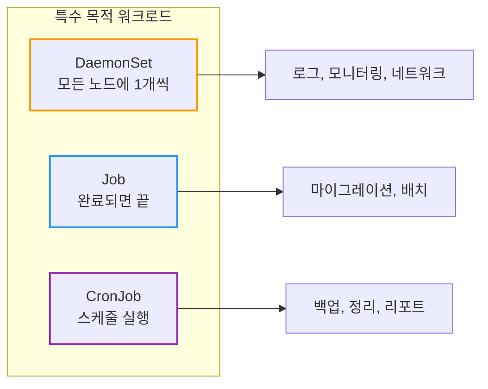

| 질문 | 답변 |
|------|------|
| 모든 노드에 로그 수집기를 배포하려면? | **DaemonSet** |
| DB 마이그레이션을 한 번만 실행하려면? | **Job** |
| 매일 백업을 예약 실행하려면? | **CronJob** |

**핵심 기억:**
1. **DaemonSet** = 노드당 1개, 로그/모니터링 에이전트
2. **Job** = 완료되면 끝, 재시도 가능, `restartPolicy: Never/OnFailure`
3. **CronJob** = Job을 스케줄에 따라 생성, Cron 문법 사용
4. Job의 `ttlSecondsAfterFinished`로 **자동 정리**
5. CronJob의 `concurrencyPolicy`로 **동시 실행 제어**

---

## 출처

- [Kubernetes Documentation - DaemonSet](https://kubernetes.io/docs/concepts/workloads/controllers/daemonset/) - 공식 문서
- [Kubernetes Documentation - Jobs](https://kubernetes.io/docs/concepts/workloads/controllers/job/) - 공식 문서
- [Kubernetes Documentation - CronJob](https://kubernetes.io/docs/concepts/workloads/controllers/cron-jobs/) - 공식 문서
- [Kubernetes Documentation - Pod Priority and Preemption](https://kubernetes.io/docs/concepts/scheduling-eviction/pod-priority-preemption/) - Priority Class 공식 문서
- [Kubernetes Documentation - TTL After Finished](https://kubernetes.io/docs/concepts/workloads/controllers/ttlafterfinished/) - Job TTL 공식 문서
- [EKS Best Practices - Data Plane](https://aws.github.io/aws-eks-best-practices/reliability/docs/dataplane/) - AWS EKS 운영 가이드
- [GKE Node Pool Upgrade Strategies](https://cloud.google.com/kubernetes-engine/docs/concepts/node-pool-upgrade-strategies) - GKE 노드 업그레이드 전략
