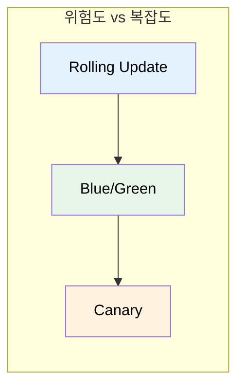
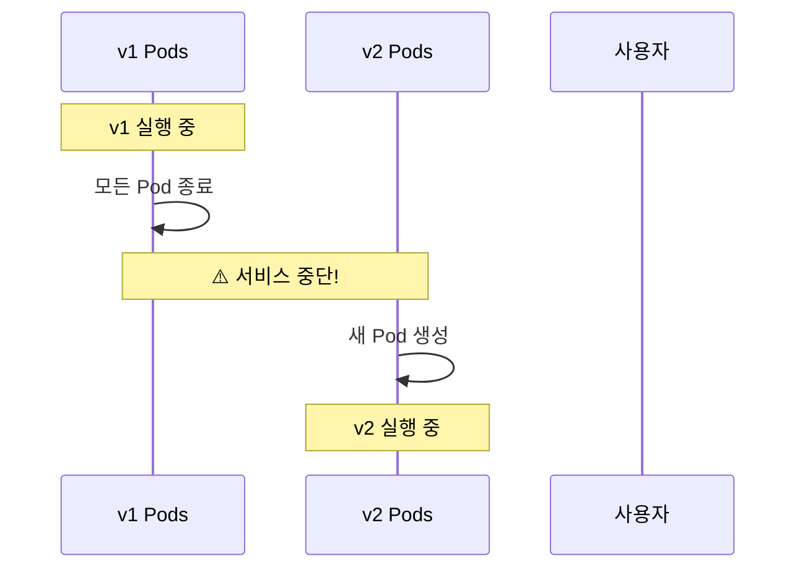
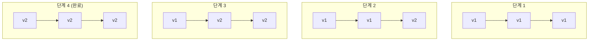
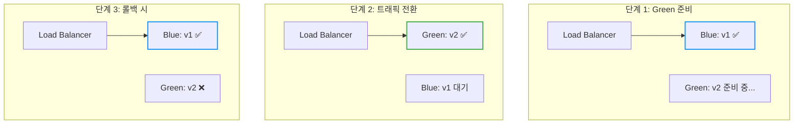
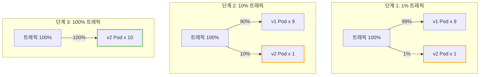
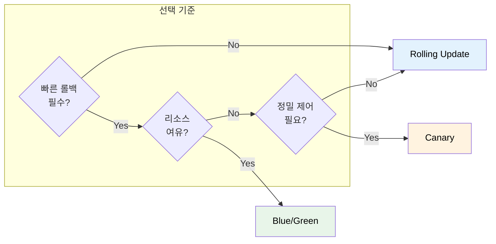
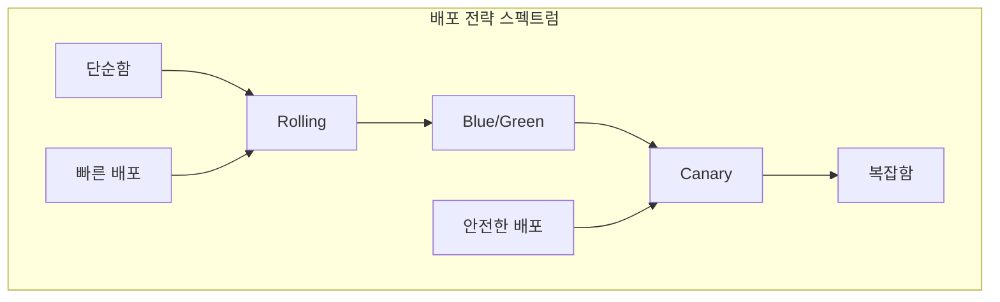

# Kubernetes Deployment Strategy

새 버전을 배포할 때 서비스 중단 없이, 그리고 안전하게 배포하려면 어떻게 해야 할까?

## 결론부터 말하면

배포 전략은 **위험을 얼마나 감수할 것인가**에 따라 선택한다.



| 전략 | 핵심 아이디어 | 롤백 속도 | 리소스 비용 | 복잡도 |
|------|--------------|----------|------------|--------|
| **Rolling Update** | 점진적 교체 | 느림 | 낮음 | ⭐ |
| **Blue/Green** | 전체 교체 후 전환 | **즉시** | **2배** | ⭐⭐ |
| **Canary** | 일부만 먼저 배포 | 빠름 | 중간 | ⭐⭐⭐ |

---

## 1. 왜 배포 전략이 필요한가?

### 1.1 가장 단순한 배포: Recreate

모든 Pod를 죽이고 새 버전을 띄운다.



**문제:** 서비스 중단이 발생한다. 프로덕션에서는 사용할 수 없다.

### 1.2 무중단 배포의 조건

무중단 배포를 위해선 두 가지 조건이 필요하다:

1. **최소 N개의 Pod가 항상 실행 중**이어야 한다
2. **새 버전에 문제가 생기면 빠르게 롤백**할 수 있어야 한다

각 배포 전략은 이 두 조건을 다른 방식으로 만족시킨다.

---

## 2. Rolling Update: 점진적 교체

### 2.1 동작 원리

**하나씩 교체한다.** 새 Pod를 하나 띄우고, 정상이면 기존 Pod를 하나 내린다.



### 2.2 Kubernetes에서 기본 제공

Deployment의 기본 전략이 Rolling Update다. 별도 설정 없이 바로 사용 가능하다.

```yaml
apiVersion: apps/v1
kind: Deployment
metadata:
  name: my-app
spec:
  replicas: 3
  strategy:
    type: RollingUpdate
    rollingUpdate:
      maxSurge: 1        # 추가로 생성 가능한 Pod 수
      maxUnavailable: 0  # 줄어들 수 있는 Pod 수
```

### 2.3 장단점

| 장점 | 단점 |
|------|------|
| ✅ 설정 간단 (K8s 기본) | ❌ 롤백이 느림 (다시 롤링) |
| ✅ 리소스 효율적 | ❌ v1과 v2가 동시에 실행됨 |
| ✅ 점진적이라 안전 | ❌ 문제 발견까지 시간 소요 |

### 2.4 언제 사용하나?

- **대부분의 일반적인 배포**
- v1과 v2가 동시에 실행되어도 문제없는 경우
- 빠른 롤백이 필수가 아닌 경우

---

## 3. Blue/Green 배포: 전체 교체 후 전환

### 3.1 동작 원리

**두 개의 환경을 준비한다.** 현재 버전(Blue)과 새 버전(Green)을 동시에 띄워놓고, 트래픽을 한 번에 전환한다.



### 3.2 핵심 포인트

1. **Green 환경을 완전히 준비**한 후 트래픽 전환
2. **전환은 즉시** (Service의 selector만 변경)
3. **롤백도 즉시** (selector를 다시 Blue로)

### 3.3 Kubernetes에서 구현

Kubernetes 기본 기능만으로도 구현 가능하다.

```yaml
# Blue Deployment (현재 버전)
apiVersion: apps/v1
kind: Deployment
metadata:
  name: my-app-blue
spec:
  replicas: 3
  selector:
    matchLabels:
      app: my-app
      version: blue
  template:
    metadata:
      labels:
        app: my-app
        version: blue
    spec:
      containers:
      - name: app
        image: my-app:1.0
---
# Green Deployment (새 버전)
apiVersion: apps/v1
kind: Deployment
metadata:
  name: my-app-green
spec:
  replicas: 3
  selector:
    matchLabels:
      app: my-app
      version: green
  template:
    metadata:
      labels:
        app: my-app
        version: green
    spec:
      containers:
      - name: app
        image: my-app:2.0
---
# Service (트래픽 전환)
apiVersion: v1
kind: Service
metadata:
  name: my-app
spec:
  selector:
    app: my-app
    version: blue    # ← 여기를 green으로 바꾸면 전환!
  ports:
  - port: 80
```

**트래픽 전환:**
```bash
# Blue → Green 전환
kubectl patch service my-app -p '{"spec":{"selector":{"version":"green"}}}'

# 롤백 (Green → Blue)
kubectl patch service my-app -p '{"spec":{"selector":{"version":"blue"}}}'
```

### 3.4 장단점

| 장점 | 단점 |
|------|------|
| ✅ **즉시 롤백** 가능 | ❌ **리소스 2배** 필요 |
| ✅ 전환 전 충분한 테스트 가능 | ❌ 수동 관리 필요 |
| ✅ v1/v2 동시 실행 없음 | ❌ DB 스키마 변경 시 주의 |

### 3.5 언제 사용하나?

- **즉시 롤백이 중요**한 경우
- **v1과 v2가 동시에 실행되면 안 되는** 경우 (호환성 문제)
- 충분한 리소스가 있는 경우

---

## 4. Canary 배포: 일부만 먼저 배포

### 4.1 동작 원리

**새 버전을 소수에게만 먼저 배포한다.** 문제가 없으면 점진적으로 비율을 늘린다.



### 4.2 왜 "Canary"인가?

이름의 유래는 **탄광의 카나리아**다. 과거 광부들은 유독 가스를 감지하기 위해 카나리아 새를 데리고 갔다. 새가 먼저 위험을 감지하면 대피할 수 있었다.

마찬가지로 Canary 배포는 **소수의 사용자가 먼저 새 버전을 경험**하게 해서, 문제가 있으면 전체 사용자에게 영향이 가기 전에 발견한다.

### 4.3 핵심 포인트

1. **트래픽 비율 제어**가 핵심 (1% → 10% → 50% → 100%)
2. **모니터링 필수** (에러율, 응답 시간 등)
3. 문제 발견 시 **Canary Pod만 제거**하면 됨

### 4.4 Kubernetes 기본 기능으로 구현 (제한적)

Pod 수 비율로 간접적으로 구현할 수 있다.

```yaml
# v1 Deployment: 9개
apiVersion: apps/v1
kind: Deployment
metadata:
  name: my-app-v1
spec:
  replicas: 9
  selector:
    matchLabels:
      app: my-app
      version: v1
  template:
    metadata:
      labels:
        app: my-app
    spec:
      containers:
      - name: app
        image: my-app:1.0
---
# v2 Deployment (Canary): 1개
apiVersion: apps/v1
kind: Deployment
metadata:
  name: my-app-v2
spec:
  replicas: 1
  selector:
    matchLabels:
      app: my-app
      version: v2
  template:
    metadata:
      labels:
        app: my-app
    spec:
      containers:
      - name: app
        image: my-app:2.0
---
# Service: 둘 다 선택
apiVersion: v1
kind: Service
metadata:
  name: my-app
spec:
  selector:
    app: my-app    # version 없음 → v1, v2 모두 선택
  ports:
  - port: 80
```

**한계:** Pod 수 비율 = 트래픽 비율이라 정밀한 제어가 어렵다. 1%를 하려면 100개 Pod 중 1개를 v2로 해야 한다.

### 4.5 실제로는 전용 도구 사용

정밀한 Canary 배포를 위해서는 트래픽 라우팅 도구가 필요하다:

| 도구 | 특징 |
|------|------|
| **Argo Rollouts** | K8s 네이티브, 설정 간단, 무료 |
| **Istio** | 서비스 메시, 강력한 트래픽 제어, 러닝커브 높음 |
| **Linkerd** | 경량 서비스 메시 |
| **Flagger** | Istio/Linkerd와 함께 자동 Canary |

**Argo Rollouts 예시:**

```yaml
apiVersion: argoproj.io/v1alpha1
kind: Rollout
metadata:
  name: my-app
spec:
  replicas: 10
  strategy:
    canary:
      steps:
      - setWeight: 5      # 5% 트래픽
      - pause: {duration: 1h}
      - setWeight: 20     # 20% 트래픽
      - pause: {duration: 1h}
      - setWeight: 50     # 50% 트래픽
      - pause: {duration: 1h}
      # 문제 없으면 100%로 자동 진행
```

### 4.6 장단점

| 장점 | 단점 |
|------|------|
| ✅ **위험 최소화** (소수만 영향) | ❌ 구현 **복잡도 높음** |
| ✅ 실제 트래픽으로 검증 | ❌ 추가 도구 필요 (Argo, Istio) |
| ✅ 문제 시 빠른 롤백 | ❌ 모니터링 체계 필수 |

### 4.7 언제 사용하나?

- **대규모 서비스** (수백만 사용자)
- **새 기능의 영향을 측정**하고 싶을 때
- A/B 테스트가 필요할 때
- 충분한 모니터링 인프라가 있을 때

---

## 5. 전략 비교 총정리



| 비교 항목 | Rolling Update | Blue/Green | Canary |
|----------|---------------|------------|--------|
| **롤백 속도** | 느림 (재배포) | **즉시** | 빠름 |
| **리소스 비용** | 낮음 | **2배** | 중간 |
| **v1/v2 공존** | ⚠️ 있음 | ❌ 없음 | ⚠️ 있음 |
| **위험 분산** | 중간 | 낮음 | **최소** |
| **복잡도** | ⭐ | ⭐⭐ | ⭐⭐⭐ |
| **K8s 기본 지원** | ✅ | 수동 | ❌ (도구 필요) |

### 선택 가이드

| 상황 | 추천 전략 |
|------|----------|
| 일반적인 배포, 특별한 요구사항 없음 | **Rolling Update** |
| 즉시 롤백이 중요, 리소스 여유 있음 | **Blue/Green** |
| v1/v2 호환성 문제, 동시 실행 불가 | **Blue/Green** |
| 대규모 서비스, 위험 최소화 필요 | **Canary** |
| A/B 테스트, 점진적 기능 출시 | **Canary** |

---

## 6. 정리



**핵심 기억:**

1. **Rolling Update**: K8s 기본, 대부분의 경우 충분
2. **Blue/Green**: 즉시 롤백이 필요하면 선택, 리소스 2배
3. **Canary**: 위험 최소화, 하지만 도구와 모니터링 필요

배포 전략은 **정답이 없다.** 서비스의 규모, 리소스, 팀의 역량에 따라 적절한 전략을 선택하면 된다.

> 📖 Kubernetes Deployment의 Rolling Update 설정은 [Kubernetes ReplicaSet & Deployment](./Kubernetes-ReplicaSet-Deployment.md) 문서를 참고하라.

---

## 출처

- [Kubernetes Documentation - Deployments](https://kubernetes.io/docs/concepts/workloads/controllers/deployment/) - 공식 문서
- [Argo Rollouts - Progressive Delivery](https://argoproj.github.io/rollouts/) - Argo 공식 문서
- [Istio - Traffic Management](https://istio.io/latest/docs/concepts/traffic-management/) - Istio 공식 문서
- [Martin Fowler - BlueGreenDeployment](https://martinfowler.com/bliki/BlueGreenDeployment.html)
- [Martin Fowler - CanaryRelease](https://martinfowler.com/bliki/CanaryRelease.html)
