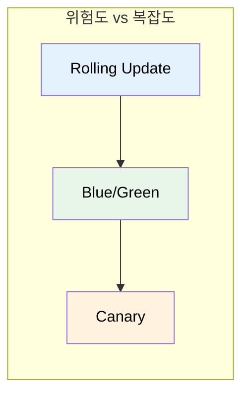
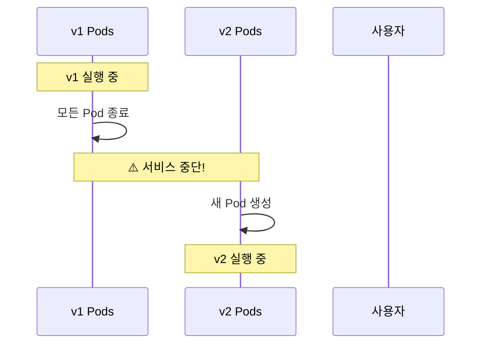
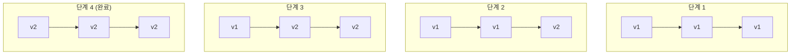
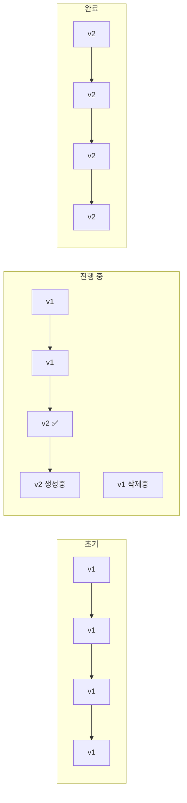
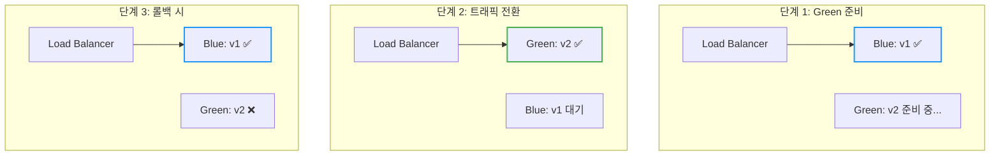
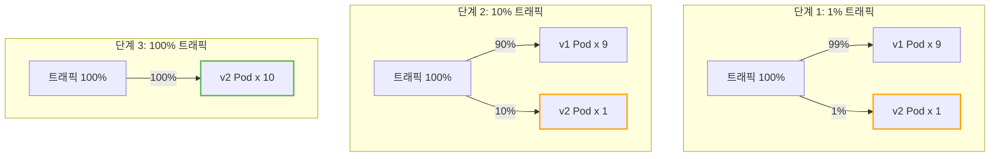
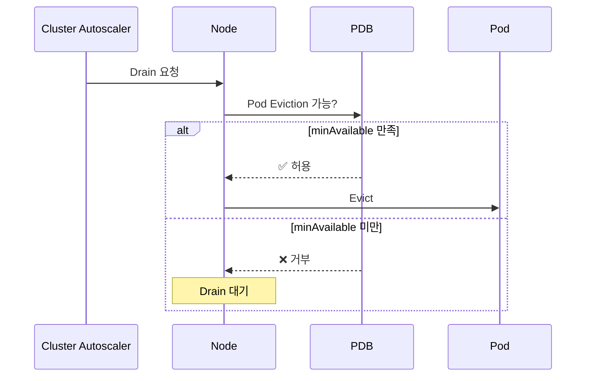
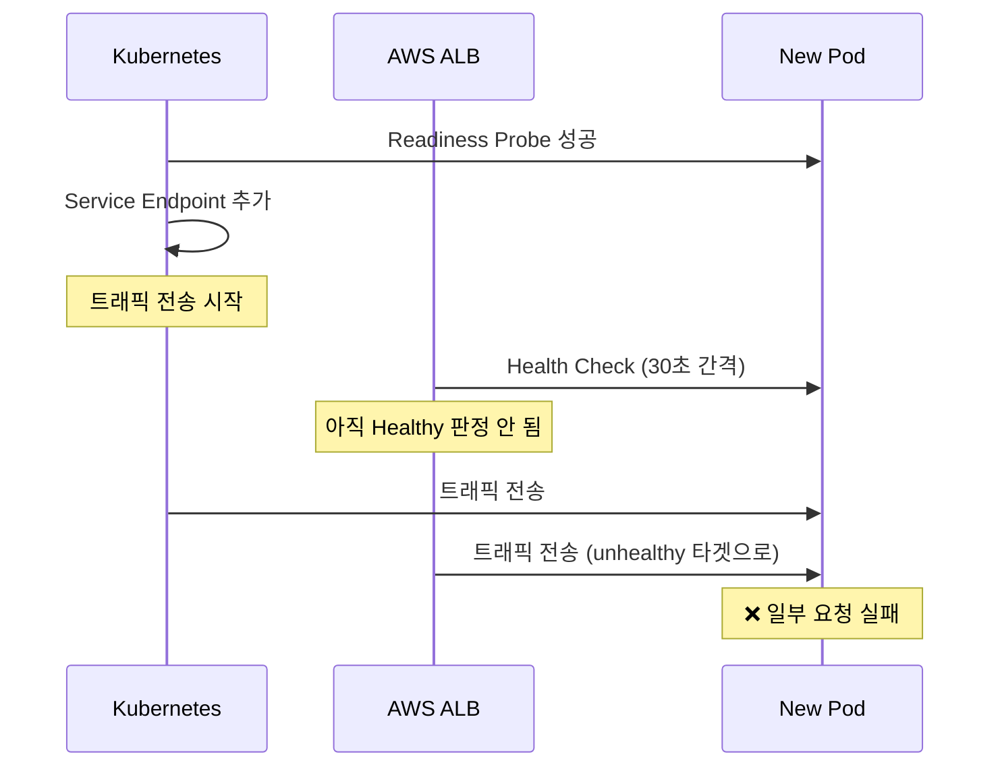
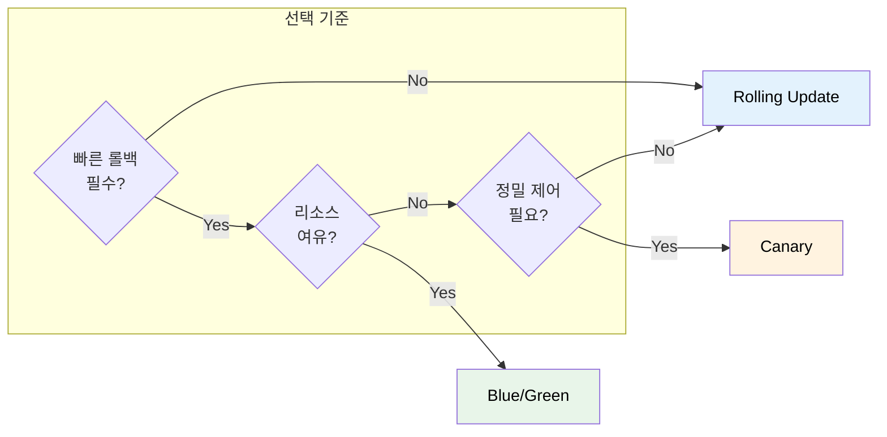
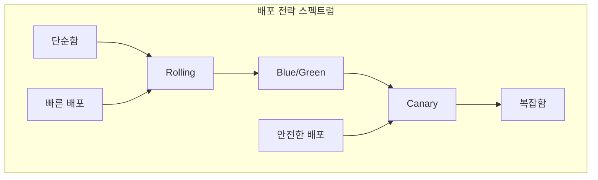

# Kubernetes Deployment Strategy

새 버전을 배포할 때 서비스 중단 없이, 그리고 안전하게 배포하려면 어떻게 해야 할까?

## 결론부터 말하면

배포 전략은 **위험을 얼마나 감수할 것인가**에 따라 선택한다.



| 전략 | 핵심 아이디어 | 롤백 속도 | 리소스 비용 | 복잡도 |
|------|--------------|----------|------------|--------|
| **Rolling Update** | 점진적 교체 | 느림 | 낮음 | ⭐ |
| **Blue/Green** | 전체 교체 후 전환 | **즉시** | **2배** | ⭐⭐ |
| **Canary** | 일부만 먼저 배포 | 빠름 | 중간 | ⭐⭐⭐ |

---

## 1. 왜 배포 전략이 필요한가?

### 1.1 가장 단순한 배포: Recreate

모든 Pod를 죽이고 새 버전을 띄운다.



**문제:** 서비스 중단이 발생한다. 프로덕션에서는 사용할 수 없다.

### 1.2 무중단 배포의 조건

무중단 배포를 위해선 두 가지 조건이 필요하다:

1. **최소 N개의 Pod가 항상 실행 중**이어야 한다
2. **새 버전에 문제가 생기면 빠르게 롤백**할 수 있어야 한다

각 배포 전략은 이 두 조건을 다른 방식으로 만족시킨다.

---

## 2. Rolling Update: 점진적 교체

### 2.1 동작 원리

**하나씩 교체한다.** 새 Pod를 하나 띄우고, 정상이면 기존 Pod를 하나 내린다.



### 2.2 Kubernetes에서 기본 제공

Deployment의 기본 전략이 Rolling Update다. 별도 설정 없이 바로 사용 가능하다.

```yaml
apiVersion: apps/v1
kind: Deployment
metadata:
  name: my-app
spec:
  replicas: 3
  strategy:
    type: RollingUpdate
    rollingUpdate:
      maxSurge: 1        # 추가로 생성 가능한 Pod 수
      maxUnavailable: 0  # 줄어들 수 있는 Pod 수
```

### 2.3 장단점

| 장점 | 단점 |
|------|------|
| ✅ 설정 간단 (K8s 기본) | ❌ 롤백이 느림 (다시 롤링) |
| ✅ 리소스 효율적 | ❌ v1과 v2가 동시에 실행됨 |
| ✅ 점진적이라 안전 | ❌ 문제 발견까지 시간 소요 |

### 2.4 언제 사용하나?

- **대부분의 일반적인 배포**
- v1과 v2가 동시에 실행되어도 문제없는 경우
- 빠른 롤백이 필수가 아닌 경우

### 2.5 실무 설정: maxSurge와 maxUnavailable

이 두 파라미터가 배포 속도와 안정성을 결정한다. **상황에 따라 다르게 설정해야 한다.**

```yaml
strategy:
  type: RollingUpdate
  rollingUpdate:
    maxSurge: 25%          # 정원 대비 추가 생성 가능 (기본값)
    maxUnavailable: 25%    # 정원 대비 감소 허용 (기본값)
```

**시나리오별 권장 설정:**

| 시나리오 | maxSurge | maxUnavailable | 이유 |
|----------|----------|----------------|------|
| **안전 우선 (무중단)** | `1` 또는 `25%` | `0` | 항상 정원 유지, 새 Pod Ready 후 교체 |
| **속도 우선** | `50%` | `50%` | 빠른 배포, 리소스 여유 필요 |
| **리소스 제한** | `0` | `1` | 추가 Pod 없이 교체, 일시적 용량 감소 |
| **replicas: 1** | `1` | `0` | 무중단 필수 (새 Pod Ready 후 기존 삭제) |

> **주의 (replicas: 1):** `maxSurge: 0, maxUnavailable: 1`로 설정하면 기존 Pod가 먼저 삭제되어 **다운타임이 발생**한다.

**동작 예시 (replicas: 4, maxSurge: 1, maxUnavailable: 1):**



- 최소 Pod 수: 4 - 1 = **3개** (maxUnavailable)
- 최대 Pod 수: 4 + 1 = **5개** (maxSurge)

### 2.6 minReadySeconds: 배포 속도 제어

**새 Pod가 Ready 후 얼마나 기다렸다가 다음 Pod를 교체할지** 결정한다.

```yaml
spec:
  minReadySeconds: 30    # Ready 후 30초 대기
  strategy:
    type: RollingUpdate
```

**왜 필요한가?**

Pod가 Ready가 되어도 실제로 안정적인지는 시간이 지나봐야 안다:
- JIT 컴파일, 캐시 워밍업 중 성능 저하
- 메모리 누수가 시간이 지나야 드러남
- 외부 연결 안정화에 시간 필요

**권장 값:**

| 앱 특성 | minReadySeconds | 이유 |
|---------|-----------------|------|
| 가벼운 앱 (Node.js) | `5-10` | 빠른 안정화 |
| 무거운 앱 (Spring Boot) | `30-60` | JIT, 커넥션 풀 안정화 |
| 중요 서비스 | `60-120` | 충분한 관찰 시간 |

### 2.7 progressDeadlineSeconds: 배포 실패 감지

**배포가 지정된 시간 내에 진행되지 않으면 실패로 간주한다.**

```yaml
spec:
  progressDeadlineSeconds: 600   # 10분 (기본값)
```

**실패로 판정되는 조건:**
- 새 Pod가 Ready가 되지 않음
- 이미지 풀 실패
- 리소스 부족
- Readiness Probe 실패

**확인 방법:**

```bash
kubectl rollout status deployment/my-app

# 실패 시 출력
error: deployment "my-app" exceeded its progress deadline
```

```bash
# 상태 확인
kubectl get deployment my-app -o jsonpath='{.status.conditions[?(@.type=="Progressing")].reason}'
# ProgressDeadlineExceeded
```

> **중요:** `progressDeadlineSeconds` 초과해도 **자동 롤백되지 않는다.** 수동 조치가 필요하다. ArgoCD, Flux 같은 GitOps 도구를 사용하면 자동 롤백이 가능하다.

---

## 3. Blue/Green 배포: 전체 교체 후 전환

### 3.1 동작 원리

**두 개의 환경을 준비한다.** 현재 버전(Blue)과 새 버전(Green)을 동시에 띄워놓고, 트래픽을 한 번에 전환한다.



### 3.2 핵심 포인트

1. **Green 환경을 완전히 준비**한 후 트래픽 전환
2. **전환은 즉시** (Service의 selector만 변경)
3. **롤백도 즉시** (selector를 다시 Blue로)

### 3.3 Kubernetes에서 구현

Kubernetes 기본 기능만으로도 구현 가능하다.

```yaml
# Blue Deployment (현재 버전)
apiVersion: apps/v1
kind: Deployment
metadata:
  name: my-app-blue
spec:
  replicas: 3
  selector:
    matchLabels:
      app: my-app
      version: blue
  template:
    metadata:
      labels:
        app: my-app
        version: blue
    spec:
      containers:
      - name: app
        image: my-app:1.0
---
# Green Deployment (새 버전)
apiVersion: apps/v1
kind: Deployment
metadata:
  name: my-app-green
spec:
  replicas: 3
  selector:
    matchLabels:
      app: my-app
      version: green
  template:
    metadata:
      labels:
        app: my-app
        version: green
    spec:
      containers:
      - name: app
        image: my-app:2.0
---
# Service (트래픽 전환)
apiVersion: v1
kind: Service
metadata:
  name: my-app
spec:
  selector:
    app: my-app
    version: blue    # ← 여기를 green으로 바꾸면 전환!
  ports:
  - port: 80
```

**트래픽 전환:**
```bash
# Blue → Green 전환
kubectl patch service my-app -p '{"spec":{"selector":{"version":"green"}}}'

# 롤백 (Green → Blue)
kubectl patch service my-app -p '{"spec":{"selector":{"version":"blue"}}}'
```

### 3.4 장단점

| 장점 | 단점 |
|------|------|
| ✅ **즉시 롤백** 가능 | ❌ **리소스 2배** 필요 |
| ✅ 전환 전 충분한 테스트 가능 | ❌ 수동 관리 필요 |
| ✅ v1/v2 동시 실행 없음 | ❌ DB 스키마 변경 시 주의 |

> **DB 스키마 주의:** 롤백 시 v1(Blue)이 v2(Green)에서 변경한 DB 스키마와 호환되지 않을 수 있다. 안전한 롤백을 위해 DB 스키마는 **하위 호환성**을 유지해야 한다. (예: 컬럼 삭제 대신 nullable로 변경, 새 컬럼은 기본값 설정)

### 3.5 언제 사용하나?

- **즉시 롤백이 중요**한 경우
- **v1과 v2가 동시에 실행되면 안 되는** 경우 (호환성 문제)
- 충분한 리소스가 있는 경우

### 3.6 배포 후 정리 (Cleanup)

**배포 성공 후 구버전(Blue)을 정리하지 않으면 리소스 비용이 영구적으로 2배가 된다.**

```bash
# 방법 1: 스케일 다운 (롤백 대비 유지)
kubectl scale deployment my-app-blue --replicas=0

# 방법 2: 완전 삭제 (확신이 있을 때)
kubectl delete deployment my-app-blue
```

> **실무 팁:** 트래픽 전환 후 최소 1-2시간은 Blue를 유지하고 모니터링하라. 문제가 없으면 스케일 다운 → 1-2일 후 삭제하는 것이 안전하다. 오토스케일링을 사용해도 `minReplicas`만큼은 항상 실행되므로 비용이 발생한다.

---

## 4. Canary 배포: 일부만 먼저 배포

### 4.1 동작 원리

**새 버전을 소수에게만 먼저 배포한다.** 문제가 없으면 점진적으로 비율을 늘린다.



### 4.2 왜 "Canary"인가?

이름의 유래는 **탄광의 카나리아**다. 과거 광부들은 유독 가스를 감지하기 위해 카나리아 새를 데리고 갔다. 새가 먼저 위험을 감지하면 대피할 수 있었다.

마찬가지로 Canary 배포는 **소수의 사용자가 먼저 새 버전을 경험**하게 해서, 문제가 있으면 전체 사용자에게 영향이 가기 전에 발견한다.

### 4.3 핵심 포인트

1. **트래픽 비율 제어**가 핵심 (1% → 10% → 50% → 100%)
2. **모니터링 필수** (에러율, 응답 시간 등)
3. 문제 발견 시 **Canary Pod만 제거**하면 됨

### 4.4 Kubernetes 기본 기능으로 구현 (제한적)

Pod 수 비율로 간접적으로 구현할 수 있다.

```yaml
# v1 Deployment: 9개
apiVersion: apps/v1
kind: Deployment
metadata:
  name: my-app-v1
spec:
  replicas: 9
  selector:
    matchLabels:
      app: my-app
      version: v1
  template:
    metadata:
      labels:
        app: my-app
        version: v1      # selector와 일치해야 함
    spec:
      containers:
      - name: app
        image: my-app:1.0
---
# v2 Deployment (Canary): 1개
apiVersion: apps/v1
kind: Deployment
metadata:
  name: my-app-v2
spec:
  replicas: 1
  selector:
    matchLabels:
      app: my-app
      version: v2
  template:
    metadata:
      labels:
        app: my-app
        version: v2      # selector와 일치해야 함
    spec:
      containers:
      - name: app
        image: my-app:2.0
---
# Service: 둘 다 선택
apiVersion: v1
kind: Service
metadata:
  name: my-app
spec:
  selector:
    app: my-app    # version 없음 → v1, v2 모두 선택
  ports:
  - port: 80
```

**한계:** Pod 수 비율 = 트래픽 비율이라 정밀한 제어가 어렵다. 1%를 하려면 100개 Pod 중 1개를 v2로 해야 한다.

### 4.5 NGINX Ingress로 Canary 구현 (서비스 메시 없이)

서비스 메시 없이도 **NGINX Ingress Controller의 어노테이션**으로 정밀한 트래픽 분배가 가능하다.

```yaml
# 기존 Ingress (Stable)
apiVersion: networking.k8s.io/v1
kind: Ingress
metadata:
  name: my-app
spec:
  ingressClassName: nginx
  rules:
  - host: my-app.example.com
    http:
      paths:
      - path: /
        pathType: Prefix
        backend:
          service:
            name: my-app-stable    # v1 Service
            port:
              number: 80
---
# Canary Ingress
apiVersion: networking.k8s.io/v1
kind: Ingress
metadata:
  name: my-app-canary
  annotations:
    nginx.ingress.kubernetes.io/canary: "true"
    nginx.ingress.kubernetes.io/canary-weight: "10"   # 10% 트래픽
spec:
  ingressClassName: nginx
  rules:
  - host: my-app.example.com
    http:
      paths:
      - path: /
        pathType: Prefix
        backend:
          service:
            name: my-app-canary    # v2 Service
            port:
              number: 80
```

**NGINX Ingress Canary 어노테이션:**

| 어노테이션 | 설명 |
|-----------|------|
| `canary: "true"` | Canary Ingress로 지정 |
| `canary-weight: "10"` | 전체 트래픽의 10%를 Canary로 |
| `canary-by-header: "X-Canary"` | 특정 헤더가 있으면 Canary로 |
| `canary-by-cookie: "canary"` | 특정 쿠키가 있으면 Canary로 |

> **장점:** Istio나 Argo Rollouts 없이도 정밀한 가중치 기반 Canary가 가능하다. 이미 NGINX Ingress를 사용 중이라면 추가 설치 없이 바로 활용할 수 있다.

### 4.6 실제로는 전용 도구 사용

정밀한 Canary 배포를 위해서는 트래픽 라우팅 도구가 필요하다:

| 도구 | 특징 |
|------|------|
| **Argo Rollouts** | K8s 네이티브, 설정 간단, 무료 |
| **Istio** | 서비스 메시, 강력한 트래픽 제어, 러닝커브 높음 |
| **Linkerd** | 경량 서비스 메시 |
| **Flagger** | Istio/Linkerd와 함께 자동 Canary |

**Argo Rollouts 예시:**

```yaml
apiVersion: argoproj.io/v1alpha1
kind: Rollout
metadata:
  name: my-app
spec:
  replicas: 10
  strategy:
    canary:
      steps:
      - setWeight: 5      # 5% 트래픽
      - pause: {duration: 1h}
      - setWeight: 20     # 20% 트래픽
      - pause: {duration: 1h}
      - setWeight: 50     # 50% 트래픽
      - pause: {duration: 1h}
      # 문제 없으면 100%로 자동 진행
```

### 4.6 장단점

| 장점 | 단점 |
|------|------|
| ✅ **위험 최소화** (소수만 영향) | ❌ 구현 **복잡도 높음** |
| ✅ 실제 트래픽으로 검증 | ❌ 추가 도구 필요 (Argo, Istio) |
| ✅ 문제 시 빠른 롤백 | ❌ 모니터링 체계 필수 |

### 4.8 언제 사용하나?

- **대규모 서비스** (수백만 사용자)
- **새 기능의 영향을 측정**하고 싶을 때
- A/B 테스트가 필요할 때
- 충분한 모니터링 인프라가 있을 때

---

## 5. 롤백 전략과 명령어

### 5.1 Deployment 롤백

Kubernetes는 Deployment의 **Revision History**를 자동으로 관리한다.

```bash
# 롤아웃 히스토리 확인
kubectl rollout history deployment/my-app

# 특정 리비전 상세 확인
kubectl rollout history deployment/my-app --revision=2

# 이전 버전으로 롤백
kubectl rollout undo deployment/my-app

# 특정 리비전으로 롤백
kubectl rollout undo deployment/my-app --to-revision=2
```

### 5.2 revisionHistoryLimit: 히스토리 관리

```yaml
spec:
  revisionHistoryLimit: 10   # 기본값: 10개 ReplicaSet 유지
```

**주의:** `revisionHistoryLimit: 0`으로 설정하면 **롤백이 불가능**하다. 최소 `3-5`는 유지하는 게 좋다.

### 5.3 CHANGE-CAUSE 기록하기

롤백할 때 어떤 변경인지 알 수 있도록 기록을 남겨라.

```bash
# 방법 1: --record 플래그 (deprecated)
kubectl set image deployment/my-app app=my-app:2.0 --record

# 방법 2: annotation 직접 설정 (권장)
kubectl annotate deployment/my-app kubernetes.io/change-cause="Update to v2.0"
```

```bash
# 히스토리에서 CHANGE-CAUSE 확인
kubectl rollout history deployment/my-app
# REVISION  CHANGE-CAUSE
# 1         Initial deployment
# 2         Update to v2.0
# 3         Rollback to v1.0
```

### 5.4 롤백 vs 재배포

| 방법 | 속도 | 상황 |
|------|------|------|
| `kubectl rollout undo` | 빠름 | 이전 버전이 정상일 때 |
| 이미지 태그 변경 후 apply | 느림 | 새 버전을 배포해야 할 때 |

> **GitOps 환경:** ArgoCD/Flux 사용 시 `kubectl rollout undo`보다 **Git에서 revert 후 sync**하는 게 히스토리 관리에 좋다.

---

## 6. 배포와 PodDisruptionBudget (PDB)

### 6.1 PDB가 배포에 미치는 영향

**PDB는 Rolling Update 속도를 제한할 수 있다.**

```yaml
apiVersion: policy/v1
kind: PodDisruptionBudget
metadata:
  name: my-app-pdb
spec:
  minAvailable: 2          # 최소 2개는 항상 실행
  selector:
    matchLabels:
      app: my-app
```

**문제 상황:**

```yaml
# Deployment: replicas: 3, maxUnavailable: 1
# PDB: minAvailable: 2
```

- Deployment는 1개까지 줄일 수 있다고 설정
- 하지만 PDB가 최소 2개 유지를 요구
- → **배포가 블록**될 수 있음

### 6.2 PDB와 배포 설정 조율

| replicas | PDB minAvailable | maxUnavailable | 결과 |
|----------|------------------|----------------|------|
| 3 | 2 | 1 | ✅ 정상 |
| 3 | 2 | 2 | ⚠️ 배포 느림 (1개씩만 교체) |
| 3 | 3 | 1 | ❌ **배포 블록** |

**권장:**
```
maxUnavailable ≤ replicas - minAvailable
```

### 6.3 Node Drain과 배포

Cluster Autoscaler나 노드 업그레이드로 **Node Drain**이 발생하면, PDB가 Pod Eviction을 제어한다.



> **실무 팁:** PDB `minAvailable`을 너무 높게 설정하면 노드 업그레이드가 막힐 수 있다. `replicas - 1` 정도가 적절하다.

---

## 7. Cloud Provider 헬스체크 동기화

### 7.1 문제: K8s Ready ≠ LB Healthy

Rolling Update 중 **Kubernetes Readiness**와 **Cloud Load Balancer 헬스체크**가 동기화되지 않으면 트래픽 손실이 발생한다.



### 7.2 AWS EKS: Target Group 헬스체크 튜닝

```yaml
apiVersion: v1
kind: Service
metadata:
  name: my-app
  annotations:
    # ALB 헬스체크 설정
    alb.ingress.kubernetes.io/healthcheck-path: /ready
    alb.ingress.kubernetes.io/healthcheck-interval-seconds: "10"
    alb.ingress.kubernetes.io/healthcheck-timeout-seconds: "5"
    alb.ingress.kubernetes.io/healthy-threshold-count: "2"
    alb.ingress.kubernetes.io/unhealthy-threshold-count: "2"
```

### 7.3 Pod Readiness Gate (권장)

**Pod Readiness Gate**를 사용하면 ALB가 healthy로 판정할 때까지 Pod가 Ready가 되지 않는다.

```yaml
# Namespace에 설정
apiVersion: v1
kind: Namespace
metadata:
  name: my-namespace
  labels:
    elbv2.k8s.aws/pod-readiness-gate-inject: enabled
```

**동작 원리:** 이 레이블은 AWS Load Balancer Controller의 **Mutating Webhook**에 의해 감지된다. Webhook은 해당 네임스페이스에 생성되는 Pod의 spec에 `readinessGates` 필드를 자동으로 주입하여, ALB Target Group의 헬스체크 상태가 Pod의 Readiness 조건에 포함되도록 만든다.

이렇게 하면:
1. Kubernetes Readiness Probe 성공 **AND**
2. ALB Target Group에서 healthy

**둘 다 만족해야** Pod가 Ready가 되어 트래픽을 받는다.

### 7.4 minReadySeconds로 안전 마진 확보

ALB 헬스체크가 완료될 시간을 확보한다.

```yaml
spec:
  minReadySeconds: 30    # ALB 헬스체크 완료 대기
  strategy:
    type: RollingUpdate
    rollingUpdate:
      maxSurge: 1
      maxUnavailable: 0
```

---

## 8. 배포 모니터링과 자동 롤백

### 8.1 배포 상태 확인 명령어

```bash
# 롤아웃 상태 (완료될 때까지 대기)
kubectl rollout status deployment/my-app

# 현재 상태 상세
kubectl get deployment my-app -o wide

# ReplicaSet 상태 (롤링 업데이트 진행 확인)
kubectl get rs -l app=my-app

# Pod 상태 (새 Pod 생성 확인)
kubectl get pods -l app=my-app -w
```

### 8.2 CI/CD에서 배포 검증

```bash
#!/bin/bash
# 배포 후 상태 확인 스크립트

kubectl apply -f deployment.yaml

# 롤아웃 완료 대기 (타임아웃 5분)
if ! kubectl rollout status deployment/my-app --timeout=300s; then
    echo "Deployment failed! Rolling back..."
    kubectl rollout undo deployment/my-app
    exit 1
fi

echo "Deployment successful!"
```

### 8.3 Argo Rollouts: 자동 분석 및 롤백

Argo Rollouts는 Prometheus 지표를 기반으로 **자동 롤백**이 가능하다.

```yaml
apiVersion: argoproj.io/v1alpha1
kind: Rollout
metadata:
  name: my-app
spec:
  strategy:
    canary:
      steps:
      - setWeight: 10
      - pause: {duration: 5m}
      - analysis:
          templates:
          - templateName: success-rate
      - setWeight: 50
      - pause: {duration: 5m}
      - analysis:
          templates:
          - templateName: success-rate
---
apiVersion: argoproj.io/v1alpha1
kind: AnalysisTemplate
metadata:
  name: success-rate
spec:
  metrics:
  - name: success-rate
    interval: 1m
    successCondition: result[0] >= 0.95   # 95% 이상 성공률
    failureLimit: 3
    provider:
      prometheus:
        address: http://prometheus:9090
        query: |
          sum(rate(http_requests_total{app="my-app",status=~"2.."}[5m])) /
          sum(rate(http_requests_total{app="my-app"}[5m]))
```

**동작:**
1. 10% 트래픽으로 Canary 시작
2. 5분 대기 후 성공률 분석
3. 95% 미만이면 **자동 롤백**
4. 95% 이상이면 50%로 확대
5. 다시 분석 후 100%로 진행

### 8.4 배포 실패 알림

```yaml
# Prometheus Alert Rule 예시
groups:
- name: deployment
  rules:
  - alert: DeploymentFailed
    expr: |
      kube_deployment_status_condition{condition="Progressing",status="false"} == 1
    for: 5m
    labels:
      severity: critical
    annotations:
      summary: "Deployment {{ $labels.deployment }} failed"
```

---

## 9. 전략 비교 총정리



| 비교 항목 | Rolling Update | Blue/Green | Canary |
|----------|---------------|------------|--------|
| **롤백 속도** | 느림 (재배포) | **즉시** | 빠름 |
| **리소스 비용** | 낮음 | **2배** | 중간 |
| **v1/v2 공존** | ⚠️ 있음 | ❌ 없음 | ⚠️ 있음 |
| **위험 분산** | 중간 | 낮음 | **최소** |
| **복잡도** | ⭐ | ⭐⭐ | ⭐⭐⭐ |
| **K8s 기본 지원** | ✅ | 수동 | ❌ (도구 필요) |

### 선택 가이드

| 상황 | 추천 전략 |
|------|----------|
| 일반적인 배포, 특별한 요구사항 없음 | **Rolling Update** |
| 즉시 롤백이 중요, 리소스 여유 있음 | **Blue/Green** |
| v1/v2 호환성 문제, 동시 실행 불가 | **Blue/Green** |
| 대규모 서비스, 위험 최소화 필요 | **Canary** |
| A/B 테스트, 점진적 기능 출시 | **Canary** |

---

## 10. 정리



**핵심 기억:**

1. **Rolling Update**: K8s 기본, 대부분의 경우 충분
2. **Blue/Green**: 즉시 롤백이 필요하면 선택, 리소스 2배
3. **Canary**: 위험 최소화, 하지만 도구와 모니터링 필요

배포 전략은 **정답이 없다.** 서비스의 규모, 리소스, 팀의 역량에 따라 적절한 전략을 선택하면 된다.

> 📖 Kubernetes Deployment의 Rolling Update 설정은 [Kubernetes ReplicaSet & Deployment](./Kubernetes-ReplicaSet-Deployment.md) 문서를 참고하라.

---

## 출처

- [Kubernetes Documentation - Deployments](https://kubernetes.io/docs/concepts/workloads/controllers/deployment/) - 공식 문서
- [Argo Rollouts - Progressive Delivery](https://argoproj.github.io/rollouts/) - Argo 공식 문서
- [Istio - Traffic Management](https://istio.io/latest/docs/concepts/traffic-management/) - Istio 공식 문서
- [Martin Fowler - BlueGreenDeployment](https://martinfowler.com/bliki/BlueGreenDeployment.html)
- [Martin Fowler - CanaryRelease](https://martinfowler.com/bliki/CanaryRelease.html)
