# Kubernetes Ingress

Service마다 LoadBalancer를 만들면 비용이 얼마나 나올까?

## 결론부터 말하면

**Ingress**는 클러스터 외부에서 들어오는 HTTP/HTTPS 트래픽을 **하나의 진입점**으로 받아서, URL 경로나 호스트 이름에 따라 적절한 Service로 라우팅한다.

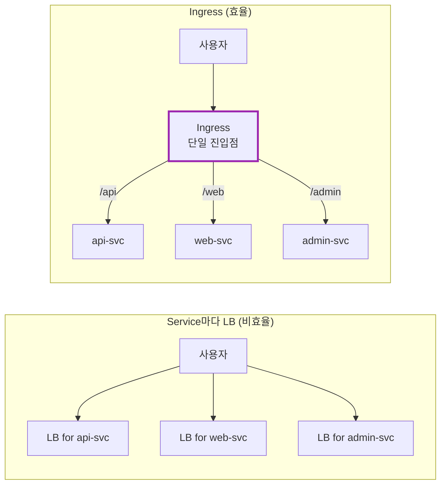

| 기능 | Service (LoadBalancer) | Ingress |
|------|----------------------|---------|
| L4/L7 | L4 (TCP/UDP) | **L7 (HTTP/HTTPS)** |
| URL 라우팅 | ❌ | ✅ `/api`, `/web` |
| 호스트 라우팅 | ❌ | ✅ `api.example.com` |
| TLS 종료 | ❌ | ✅ 인증서 관리 |
| 비용 | LB당 비용 | **하나의 LB** |

---

## 1. 왜 Ingress가 필요한가?

### 1.1 LoadBalancer Service의 한계

Service 문서에서 `LoadBalancer` 타입을 배웠다. 외부에서 접근할 수 있어서 좋은데, 문제가 있다.

**문제 1: 서비스마다 LoadBalancer가 생긴다**

```yaml
# 3개의 서비스 = 3개의 LoadBalancer = 3배 비용
api-svc:     LoadBalancer → 52.10.1.1
web-svc:     LoadBalancer → 52.10.1.2
admin-svc:   LoadBalancer → 52.10.1.3
```

AWS ALB 기준 월 $20~30 × 서비스 개수 = 비용 폭발!

**문제 2: URL 경로 기반 라우팅이 안 된다**

LoadBalancer는 L4(TCP) 레벨에서 동작한다. "HTTP 요청의 경로"를 보고 분기하는 건 불가능하다.

```
# 이런 라우팅을 하고 싶다면?
/api/*   → api-svc
/web/*   → web-svc
/admin/* → admin-svc

# LoadBalancer로는 불가능!
```

**문제 3: TLS 인증서 관리가 분산된다**

각 LoadBalancer마다 인증서를 따로 설정해야 한다. 갱신도 따로, 관리도 따로.

### 1.2 Ingress의 해결책

Ingress는 **하나의 진입점**에서 모든 걸 처리한다:

| 문제 | Ingress의 해결책 |
|------|-----------------|
| LB 비용 폭발 | **하나의 LB**로 여러 서비스 |
| URL 라우팅 | **경로 기반** 라우팅 |
| 호스트 라우팅 | **도메인 기반** 라우팅 |
| TLS 관리 | **한 곳에서** 인증서 관리 |

---

## 2. Ingress의 구조

### 2.1 Ingress vs Ingress Controller

여기서 중요한 개념이 있다. **Ingress는 규칙일 뿐이다.**

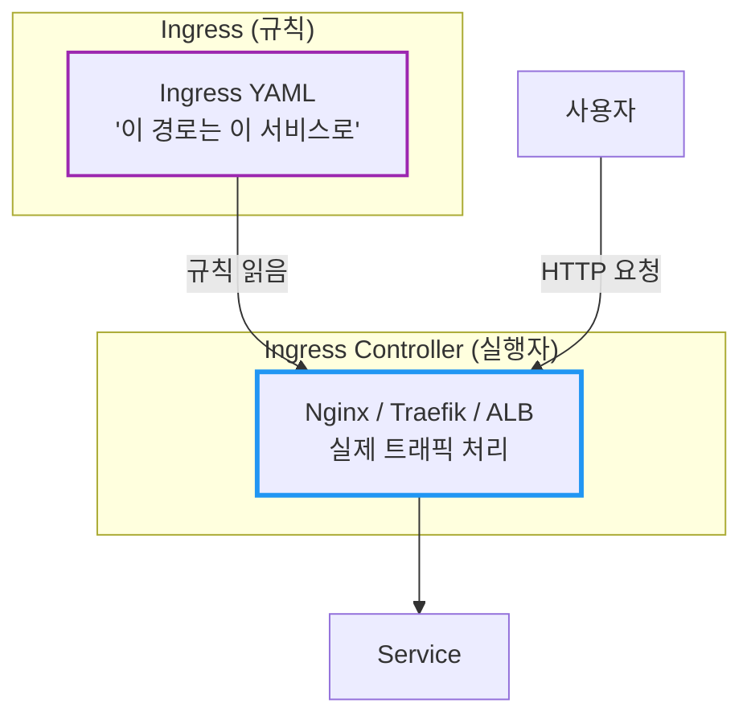

| 구분 | Ingress | Ingress Controller |
|------|---------|-------------------|
| 역할 | 라우팅 **규칙** 정의 | 규칙을 **실행** |
| 타입 | Kubernetes 리소스 | 별도 설치 필요 |
| 예시 | YAML 파일 | Nginx, Traefik, AWS ALB |

**중요:** Ingress Controller가 없으면 Ingress 리소스를 만들어도 **아무 일도 일어나지 않는다!**

### 2.2 IngressClass: 어떤 Controller가 처리할지 지정

클러스터에 여러 Ingress Controller가 있을 수 있다. `IngressClass`는 **어떤 Controller가 이 Ingress를 처리할지** 지정한다.

```yaml
# IngressClass 리소스
apiVersion: networking.k8s.io/v1
kind: IngressClass
metadata:
  name: nginx
  annotations:
    ingressclass.kubernetes.io/is-default-class: "true"  # 기본 IngressClass
spec:
  controller: k8s.io/ingress-nginx
```

```yaml
# Ingress에서 IngressClass 참조
apiVersion: networking.k8s.io/v1
kind: Ingress
metadata:
  name: my-ingress
spec:
  ingressClassName: nginx    # 이 IngressClass를 사용
  rules:
  # ...
```

**Default IngressClass:**
- `ingressclass.kubernetes.io/is-default-class: "true"` 어노테이션으로 지정
- `ingressClassName`을 생략하면 기본 IngressClass가 사용됨
- 클라우드 환경에서는 보통 자동 설정됨

### 2.3 Ingress Controller 종류

| Controller | 특징 | 환경 |
|------------|------|------|
| **Nginx Ingress** | 가장 대중적, 기능 풍부 | 모든 환경 |
| **Traefik** | 가벼움, 자동 설정 | 모든 환경 |
| **AWS ALB** | AWS 네이티브, ALB 자동 생성 | AWS |
| **GKE Ingress** | GCP 네이티브 | GCP |
| **Istio Gateway** | 서비스 메시 연동 | Istio 사용 시 |

---

## 3. Ingress 기본 설정

### 3.1 경로 기반 라우팅

```yaml
apiVersion: networking.k8s.io/v1
kind: Ingress
metadata:
  name: my-ingress
spec:
  ingressClassName: nginx    # 사용할 Ingress Controller
  rules:
  - http:
      paths:
      - path: /api
        pathType: Prefix     # /api, /api/users, /api/v1/... 모두 매칭
        backend:
          service:
            name: api-svc
            port:
              number: 80
      - path: /web
        pathType: Prefix
        backend:
          service:
            name: web-svc
            port:
              number: 80
```

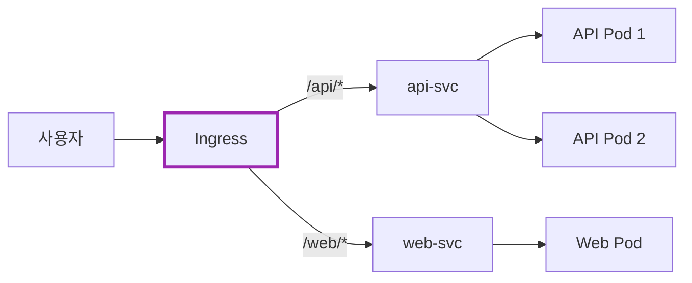

### 3.2 pathType 이해하기

| pathType | 설명 | 예시 |
|----------|------|------|
| **Prefix** | 경로 접두사 매칭 | `/api` → `/api`, `/api/users`, `/api/v1` |
| **Exact** | 정확히 일치해야 함 | `/api` → `/api`만 (❌ `/api/users`) |
| **ImplementationSpecific** | Controller마다 다름 | - |

> **참고:** `path: /`와 `pathType: Prefix`를 함께 사용하면 해당 호스트의 **모든 경로** 를 매칭하는 "catch-all" 규칙이 된다.

### 3.3 호스트 기반 라우팅

```yaml
apiVersion: networking.k8s.io/v1
kind: Ingress
metadata:
  name: multi-host-ingress
spec:
  ingressClassName: nginx
  rules:
  - host: api.example.com     # 호스트별 분기
    http:
      paths:
      - path: /
        pathType: Prefix
        backend:
          service:
            name: api-svc
            port:
              number: 80
  - host: web.example.com
    http:
      paths:
      - path: /
        pathType: Prefix
        backend:
          service:
            name: web-svc
            port:
              number: 80
```

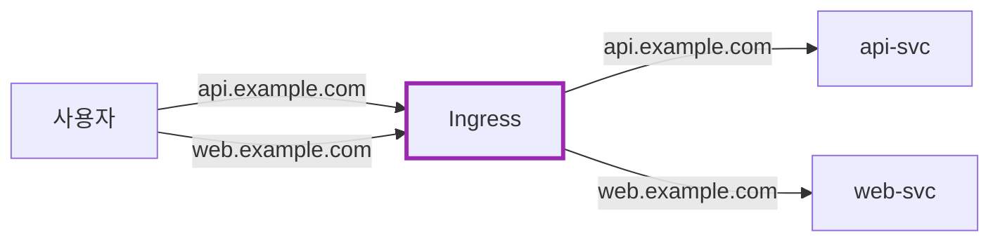

---

## 4. TLS/HTTPS 설정

### 4.1 왜 Ingress에서 TLS를 처리하나?

TLS 종료(termination)를 Ingress에서 하면:
- 인증서를 **한 곳에서** 관리
- 백엔드 Pod는 **HTTP**로 통신 (단순화)
- 인증서 갱신이 **쉬움**

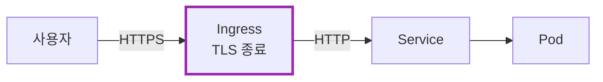

### 4.2 TLS Secret 생성

```bash
# 인증서와 키로 Secret 생성
kubectl create secret tls my-tls-secret \
  --cert=path/to/cert.crt \
  --key=path/to/cert.key
```

### 4.3 Ingress에 TLS 적용

```yaml
apiVersion: networking.k8s.io/v1
kind: Ingress
metadata:
  name: tls-ingress
spec:
  ingressClassName: nginx
  tls:
  - hosts:
    - api.example.com
    - web.example.com
    secretName: my-tls-secret    # TLS Secret 참조
  rules:
  - host: api.example.com
    http:
      paths:
      - path: /
        pathType: Prefix
        backend:
          service:
            name: api-svc
            port:
              number: 80
```

### 4.4 cert-manager로 자동 인증서 관리

수동으로 인증서를 관리하기 어렵다면 **cert-manager**를 사용하라.

```yaml
apiVersion: networking.k8s.io/v1
kind: Ingress
metadata:
  name: auto-tls-ingress
  annotations:
    cert-manager.io/cluster-issuer: letsencrypt-prod  # 자동 발급
spec:
  ingressClassName: nginx
  tls:
  - hosts:
    - api.example.com
    secretName: api-tls    # cert-manager가 자동 생성
  rules:
  - host: api.example.com
    http:
      paths:
      - path: /
        pathType: Prefix
        backend:
          service:
            name: api-svc
            port:
              number: 80
```

cert-manager가 Let's Encrypt에서 인증서를 자동 발급하고, 만료 전에 자동 갱신한다.

---

## 5. Default Backend

### 5.1 매칭되지 않는 요청 처리

어떤 규칙에도 매칭되지 않는 요청은 어떻게 될까?

```yaml
apiVersion: networking.k8s.io/v1
kind: Ingress
metadata:
  name: ingress-with-default
spec:
  ingressClassName: nginx
  defaultBackend:           # 기본 백엔드
    service:
      name: default-svc
      port:
        number: 80
  rules:
  - host: api.example.com
    http:
      paths:
      - path: /api
        pathType: Prefix
        backend:
          service:
            name: api-svc
            port:
              number: 80
```

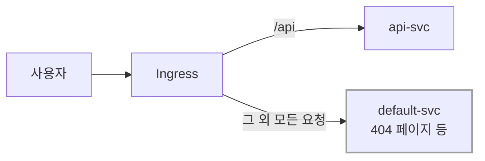

---

## 6. Annotations: Controller별 고급 설정

### 6.1 Nginx Ingress 예시

Ingress Controller마다 **annotations**로 세부 설정을 한다.

```yaml
apiVersion: networking.k8s.io/v1
kind: Ingress
metadata:
  name: nginx-ingress
  annotations:
    # HTTPS 리다이렉트
    nginx.ingress.kubernetes.io/ssl-redirect: "true"

    # 타임아웃
    nginx.ingress.kubernetes.io/proxy-read-timeout: "300"

    # CORS
    nginx.ingress.kubernetes.io/enable-cors: "true"

    # Rate Limiting
    nginx.ingress.kubernetes.io/limit-rps: "10"
spec:
  ingressClassName: nginx
  rules:
  - host: api.example.com
    http:
      paths:
      - path: /api
        pathType: Prefix
        backend:
          service:
            name: api-svc
            port:
              number: 80
```

### 6.2 경로 재작성 (Rewrite)

`/api/users` 요청을 백엔드에 `/users`로 전달하고 싶을 때 `rewrite-target` annotation을 사용한다.

**v0.22.0 이후:** 반드시 **캡처 그룹**을 명시적으로 정의해야 한다.

```yaml
apiVersion: networking.k8s.io/v1
kind: Ingress
metadata:
  name: rewrite-ingress
  annotations:
    nginx.ingress.kubernetes.io/rewrite-target: /$2    # 두 번째 캡처 그룹으로 재작성
    nginx.ingress.kubernetes.io/use-regex: "true"
spec:
  ingressClassName: nginx
  rules:
  - host: example.com
    http:
      paths:
      - path: /api(/|$)(.*)      # 캡처 그룹: $1=(/|$), $2=(.*)
        pathType: ImplementationSpecific
        backend:
          service:
            name: api-svc
            port:
              number: 80
```

| 요청 경로 | 백엔드 전달 경로 | 설명 |
|----------|-----------------|------|
| `/api` | `/` | `$2`가 빈 문자열 |
| `/api/` | `/` | `$2`가 빈 문자열 |
| `/api/users` | `/users` | `$2`가 `users` |
| `/api/v1/products` | `/v1/products` | `$2`가 `v1/products` |

**캡처 그룹 설명:**
- `(/|$)` → `$1`: `/` 또는 문자열 끝 매칭
- `(.*)` → `$2`: 나머지 경로 캡처 (이것을 `rewrite-target`에서 사용)

> 📖 자세한 내용은 [Nginx Ingress Rewrite 문서](https://kubernetes.github.io/ingress-nginx/examples/rewrite/)를 참고하라.

### 6.3 자주 쓰는 Nginx Annotations

| Annotation | 설명 |
|------------|------|
| `ssl-redirect` | HTTP → HTTPS 리다이렉트 |
| `rewrite-target` | 경로 재작성 |
| `proxy-body-size` | 요청 본문 크기 제한 |
| `proxy-read-timeout` | 백엔드 응답 타임아웃 |
| `whitelist-source-range` | IP 허용 목록 |

---

## 7. Ingress vs Service 언제 뭘 쓰나?

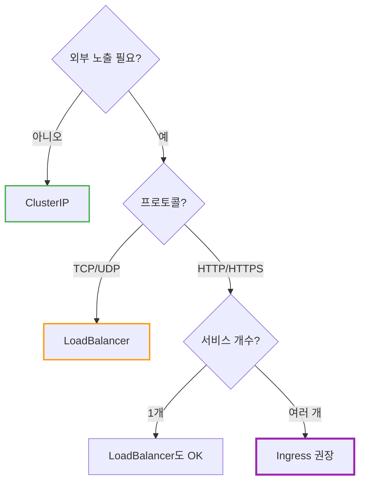

| 상황 | 추천 |
|------|------|
| 내부 서비스 간 통신 | **ClusterIP** |
| TCP/UDP 외부 노출 (DB 등) | **LoadBalancer** |
| HTTP/HTTPS 1개 서비스 | LoadBalancer 또는 Ingress |
| HTTP/HTTPS 여러 서비스 | **Ingress** |
| URL/호스트 기반 라우팅 필요 | **Ingress** |
| TLS 중앙 관리 필요 | **Ingress** |

---

## 8. 실전 예시: 전체 구성

```yaml
---
# 1. API Service (ClusterIP)
apiVersion: v1
kind: Service
metadata:
  name: api-svc
spec:
  type: ClusterIP
  selector:
    app: api
  ports:
  - port: 80
    targetPort: 8080

---
# 2. Web Service (ClusterIP)
apiVersion: v1
kind: Service
metadata:
  name: web-svc
spec:
  type: ClusterIP
  selector:
    app: web
  ports:
  - port: 80
    targetPort: 3000

---
# 3. Ingress (외부 진입점)
apiVersion: networking.k8s.io/v1
kind: Ingress
metadata:
  name: main-ingress
  annotations:
    nginx.ingress.kubernetes.io/ssl-redirect: "true"
    cert-manager.io/cluster-issuer: letsencrypt-prod
spec:
  ingressClassName: nginx
  tls:
  - hosts:
    - example.com
    - api.example.com
    secretName: example-tls
  rules:
  - host: example.com
    http:
      paths:
      - path: /
        pathType: Prefix
        backend:
          service:
            name: web-svc
            port:
              number: 80
  - host: api.example.com
    http:
      paths:
      - path: /
        pathType: Prefix
        backend:
          service:
            name: api-svc
            port:
              number: 80
```

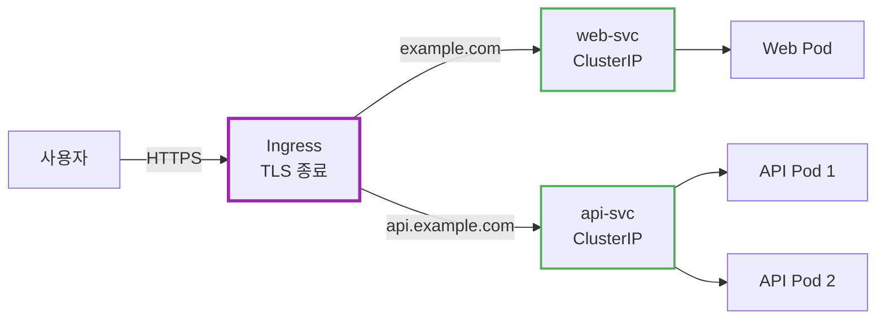

**핵심:** 백엔드 Service는 `ClusterIP`로 충분하다. 외부 노출은 Ingress가 담당!

---

## 9. 클라우드별 Ingress Controller

클라우드 환경에서는 각 클라우드의 **네이티브 로드밸런서** 와 통합된 Ingress Controller를 사용한다.

### 9.1 AWS: ALB Ingress Controller (AWS Load Balancer Controller)

AWS에서는 **AWS Load Balancer Controller** 가 Ingress 리소스를 **Application Load Balancer(ALB)** 로 프로비저닝한다.

```yaml
apiVersion: networking.k8s.io/v1
kind: Ingress
metadata:
  name: my-ingress
  annotations:
    # ALB 기본 설정
    alb.ingress.kubernetes.io/scheme: internet-facing          # 또는 internal
    alb.ingress.kubernetes.io/target-type: ip                  # ip 또는 instance

    # Health Check 설정
    alb.ingress.kubernetes.io/healthcheck-path: /health
    alb.ingress.kubernetes.io/healthcheck-interval-seconds: "15"
    alb.ingress.kubernetes.io/healthcheck-timeout-seconds: "5"
    alb.ingress.kubernetes.io/success-codes: "200"
    alb.ingress.kubernetes.io/healthy-threshold-count: "2"
    alb.ingress.kubernetes.io/unhealthy-threshold-count: "2"

    # SSL/TLS (ACM 인증서 사용)
    alb.ingress.kubernetes.io/listen-ports: '[{"HTTP": 80}, {"HTTPS": 443}]'
    alb.ingress.kubernetes.io/certificate-arn: arn:aws:acm:region:account:certificate/xxx
    alb.ingress.kubernetes.io/ssl-redirect: "443"

    # WAF 연동
    alb.ingress.kubernetes.io/wafv2-acl-arn: arn:aws:wafv2:region:account:regional/webacl/xxx
spec:
  ingressClassName: alb
  rules:
  - host: api.example.com
    http:
      paths:
      - path: /
        pathType: Prefix
        backend:
          service:
            name: api-svc
            port:
              number: 80
```

| 어노테이션 | 설명 |
|-----------|------|
| `scheme: internet-facing` | Public ALB (외부 노출) |
| `scheme: internal` | Internal ALB (VPC 내부만) |
| `target-type: ip` | Pod IP 직접 타겟 (권장, Fargate 필수) |
| `target-type: instance` | NodePort 통해 라우팅 |
| `ssl-redirect: "443"` | HTTP → HTTPS 리다이렉트 |

**IngressGroup: 여러 Ingress를 하나의 ALB로**

```yaml
metadata:
  annotations:
    alb.ingress.kubernetes.io/group.name: my-group    # 같은 그룹 = 같은 ALB
    alb.ingress.kubernetes.io/group.order: "1"        # 규칙 우선순위 (낮을수록 먼저 평가)
```

여러 Ingress 리소스에 같은 `group.name`을 지정하면 **하나의 ALB** 로 통합된다. ALB 비용을 절감할 수 있다.

> **주의:** `group.order`는 규칙 충돌 시 **우선순위** 를 결정한다. 같은 경로에 여러 규칙이 있을 때 낮은 숫자가 먼저 평가되므로, 의도치 않은 라우팅 오류를 방지하려면 반드시 설정해야 한다.

### 9.2 GKE: GCE Ingress Controller (Container-Native Load Balancing)

GKE에서는 **GCE Ingress Controller** 가 기본 제공되며, **Network Endpoint Group(NEG)** 을 통해 Pod에 직접 트래픽을 전달한다.

```yaml
apiVersion: networking.k8s.io/v1
kind: Ingress
metadata:
  name: my-ingress
  annotations:
    # Internal Load Balancer
    kubernetes.io/ingress.class: "gce-internal"    # 또는 "gce" (외부)

    # Static IP 사용
    kubernetes.io/ingress.global-static-ip-name: "my-static-ip"

    # Google Managed Certificate
    networking.gke.io/managed-certificates: "my-cert"
spec:
  rules:
  - host: api.example.com
    http:
      paths:
      - path: /
        pathType: Prefix
        backend:
          service:
            name: api-svc
            port:
              number: 80
```

**NEG (Container-Native Load Balancing) 설정:**

```yaml
# Service에 NEG 어노테이션 추가
apiVersion: v1
kind: Service
metadata:
  name: api-svc
  annotations:
    cloud.google.com/neg: '{"ingress": true}'    # NEG 활성화
spec:
  type: ClusterIP
  selector:
    app: api
  ports:
  - port: 80
    targetPort: 8080
```

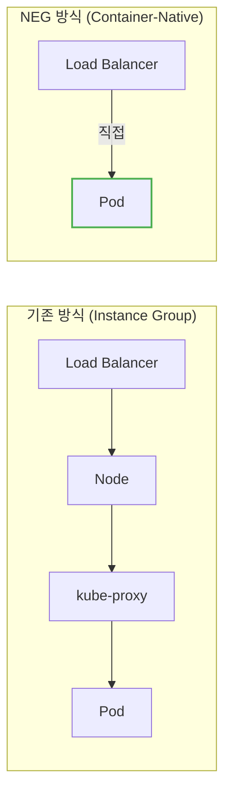

**NEG의 장점:**
- **낮은 지연 시간:** Node/kube-proxy를 거치지 않고 Pod에 직접 연결
- **정확한 Health Check:** Pod 단위로 상태 확인
- **효율적인 로드밸런싱:** 실제 Pod 분포에 따른 균등 분배

**BackendConfig: 고급 Health Check 설정**

```yaml
apiVersion: cloud.google.com/v1
kind: BackendConfig
metadata:
  name: api-backend-config
spec:
  healthCheck:
    checkIntervalSec: 15
    timeoutSec: 5
    healthyThreshold: 2
    unhealthyThreshold: 2
    type: HTTP
    requestPath: /health
    port: 8080
  connectionDraining:
    drainingTimeoutSec: 60
  cdn:
    enabled: true
    cachePolicy:
      includeHost: true
      includeProtocol: true
---
apiVersion: v1
kind: Service
metadata:
  name: api-svc
  annotations:
    cloud.google.com/neg: '{"ingress": true}'
    cloud.google.com/backend-config: '{"default": "api-backend-config"}'
spec:
  # ...
```

### 9.3 Azure: Application Gateway Ingress Controller (AGIC)

Azure에서는 **AGIC** 가 Ingress를 **Azure Application Gateway** 로 변환한다.

```yaml
apiVersion: networking.k8s.io/v1
kind: Ingress
metadata:
  name: my-ingress
  annotations:
    kubernetes.io/ingress.class: azure/application-gateway

    # Backend Protocol
    appgw.ingress.kubernetes.io/backend-protocol: "http"         # 또는 https

    # Health Check
    appgw.ingress.kubernetes.io/health-probe-path: "/health"
    appgw.ingress.kubernetes.io/health-probe-interval: "15"
    appgw.ingress.kubernetes.io/health-probe-timeout: "5"

    # WAF Policy
    appgw.ingress.kubernetes.io/waf-policy-for-path: "/subscriptions/.../wafPolicies/my-waf"

    # Private IP 사용 (Internal)
    appgw.ingress.kubernetes.io/use-private-ip: "true"

    # SSL Redirect
    appgw.ingress.kubernetes.io/ssl-redirect: "true"
spec:
  rules:
  - host: api.example.com
    http:
      paths:
      - path: /
        pathType: Prefix
        backend:
          service:
            name: api-svc
            port:
              number: 80
```

| 어노테이션 | 설명 |
|-----------|------|
| `use-private-ip: "true"` | Internal LB (Private IP 사용) |
| `backend-protocol: "https"` | 백엔드 Pod와 HTTPS 통신 |
| `waf-policy-for-path` | WAF 정책 연동 |
| `ssl-redirect: "true"` | HTTP → HTTPS 리다이렉트 |

> **참고:** Azure는 차세대 솔루션으로 **Application Gateway for Containers** 를 출시했다. Gateway API 표준을 지원하며 더 빠른 설정 반영과 향상된 성능을 제공한다.

### 9.4 클라우드별 Ingress Controller 비교

| 기능 | AWS ALB | GKE GCE | Azure AGIC |
|------|---------|---------|------------|
| **L7 Load Balancer** | ALB | HTTP(S) LB | App Gateway |
| **Pod 직접 연결** | target-type: ip | NEG | ✅ (Endpoint 기반) |
| **WAF 연동** | WAFv2 | Cloud Armor | WAF Policy |
| **관리형 인증서** | ACM | Google Managed Cert | Key Vault |
| **IngressGroup** | ✅ 지원 | ❌ | ❌ |
| **비용** | ALB 시간당 + LCU | LB 시간당 + 트래픽 | App GW 시간당 + CU |

---

## 10. Ingress 디버깅

### 10.1 연결 문제 체크리스트

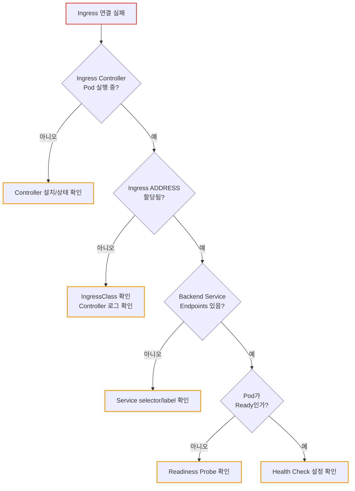

### 10.2 디버깅 명령어

```bash
# 1. Ingress 상태 확인 (ADDRESS가 있는지)
kubectl get ingress my-ingress
# ADDRESS가 비어있으면 → Ingress Controller 문제

# 2. Ingress 상세 정보
kubectl describe ingress my-ingress
# Events 섹션에서 에러 메시지 확인

# 3. Ingress Controller 로그 (Nginx)
kubectl logs -n ingress-nginx -l app.kubernetes.io/name=ingress-nginx --tail=100

# 4. Backend Service Endpoints 확인
kubectl get endpoints api-svc
# ENDPOINTS가 비어있으면 → Service/Pod 문제

# 5. IngressClass 확인
kubectl get ingressclass
kubectl describe ingressclass nginx

# 6. 클라우드별 LB 상태 확인
# AWS: ALB Target Group Health
aws elbv2 describe-target-health --target-group-arn <arn>

# GKE: NEG 상태
kubectl get svc api-svc -o yaml | grep neg-status
```

### 10.3 자주 발생하는 문제

| 증상 | 원인 | 해결 |
|------|------|------|
| ADDRESS가 비어있음 | IngressClass 미지정/불일치 | `ingressClassName` 확인 |
| 404 Not Found | path/pathType 불일치 | pathType: Prefix 확인 |
| 502 Bad Gateway | Backend Pod 응답 안 함 | Pod 상태, targetPort 확인 |
| 503 Service Unavailable | Endpoints 없음 | Service selector 확인 |
| Health Check 실패 | Health Check 경로/포트 불일치 | 어노테이션 설정 확인 |
| TLS 인증서 에러 | Secret 없음/잘못된 형식 | `kubectl get secret` 확인 |

### 10.4 Health Check 실패 해결

클라우드 LB의 Health Check가 실패하는 일반적인 원인:

```yaml
# 1. Health Check 경로가 200을 반환하는지 확인
kubectl exec -it <pod-name> -- curl -v localhost:8080/health

# 2. Health Check 포트가 정확한지 확인
# - Service의 targetPort와 일치해야 함
# - Named port 사용 시 이름이 정확한지 확인

# 3. Readiness Probe와 LB Health Check 경로를 일치시키는 것을 권장
spec:
  containers:
  - name: app
    readinessProbe:
      httpGet:
        path: /health    # LB Health Check 경로와 동일
        port: 8080
```

---

## 11. 자주 쓰는 명령어

```bash
# Ingress 목록
kubectl get ingress

# Ingress 상세 (주소, 규칙 확인)
kubectl describe ingress my-ingress

# Ingress Controller Pod 로그 확인
kubectl logs -n ingress-nginx -l app.kubernetes.io/name=ingress-nginx

# TLS Secret 확인
kubectl get secret my-tls-secret
```

---

## 12. 정리

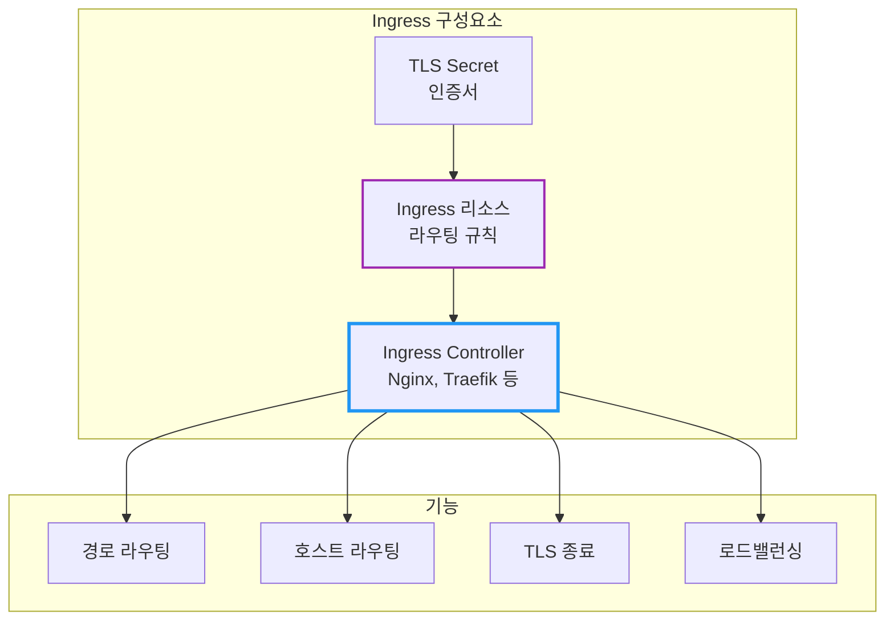

| 질문 | 답변 |
|------|------|
| Ingress만 만들면 동작하나요? | ❌ Ingress Controller 필요 |
| LoadBalancer 대신 Ingress? | HTTP/HTTPS면 Ingress 권장 |
| TLS는 어디서 처리? | Ingress에서 종료 (권장) |

**핵심 기억:**
1. **Ingress** 는 규칙, **Ingress Controller** 가 실행
2. **하나의 진입점** 으로 여러 서비스 라우팅 → 비용 절감
3. **경로** (`/api`)와 **호스트** (`api.example.com`) 기반 라우팅
4. **TLS** 인증서를 한 곳에서 관리
5. 백엔드 Service는 **ClusterIP** 로 충분
6. 클라우드별 **네이티브 LB** 통합: AWS ALB, GKE GCE, Azure App Gateway

> 📖 관련 문서:
> - [Kubernetes Service](./Kubernetes-Service-ClusterIP-NodePort-LoadBalancer.md)
> - [Kubernetes Probe](./Kubernetes-Probe-Liveness-Readiness-Startup.md)

---

## 출처

- [Kubernetes Documentation - Ingress](https://kubernetes.io/docs/concepts/services-networking/ingress/) - 공식 문서
- [Kubernetes Documentation - Ingress Controllers](https://kubernetes.io/docs/concepts/services-networking/ingress-controllers/) - 공식 문서
- [Nginx Ingress Controller Documentation](https://kubernetes.github.io/ingress-nginx/) - Nginx Ingress 공식
- [AWS Load Balancer Controller - Ingress Annotations](https://kubernetes-sigs.github.io/aws-load-balancer-controller/latest/guide/ingress/annotations/) - AWS 공식
- [GKE Container-Native Load Balancing](https://cloud.google.com/kubernetes-engine/docs/how-to/container-native-load-balancing) - GCP 공식
- [Azure Application Gateway Ingress Controller](https://learn.microsoft.com/en-us/azure/application-gateway/ingress-controller-overview) - Azure 공식
- [cert-manager Documentation](https://cert-manager.io/docs/) - cert-manager 공식
