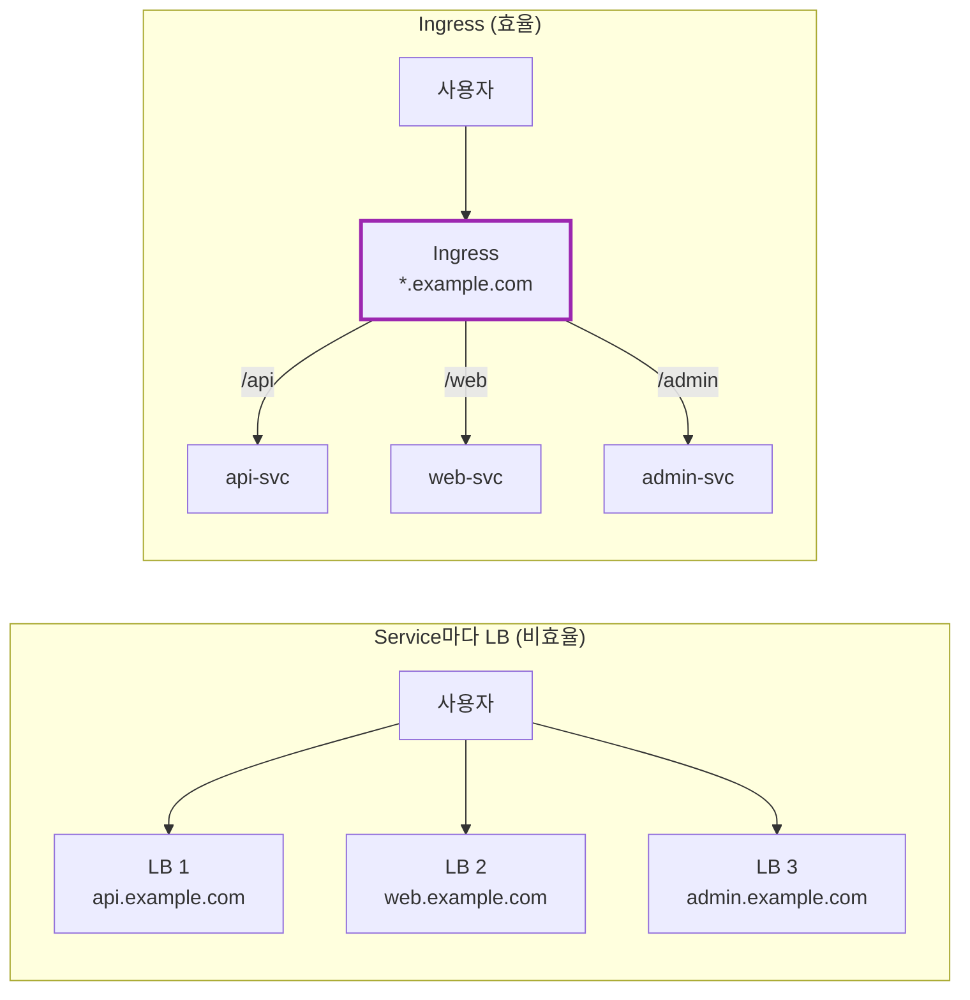
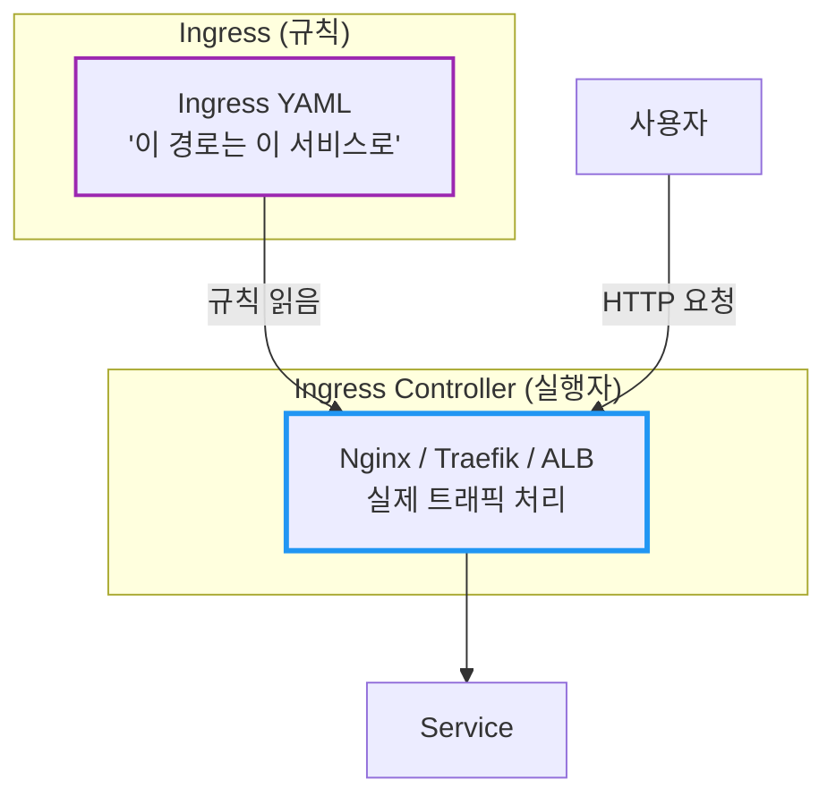
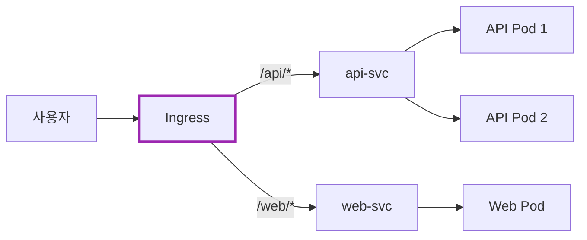
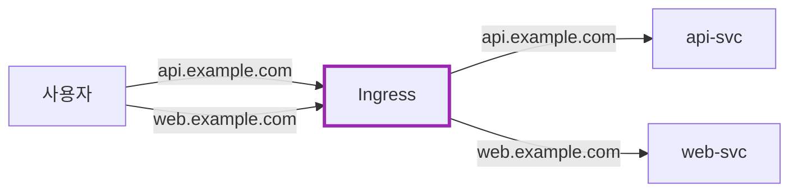
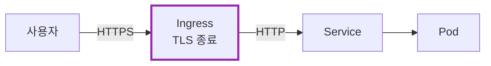
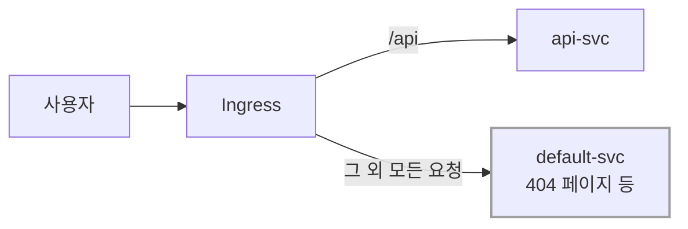
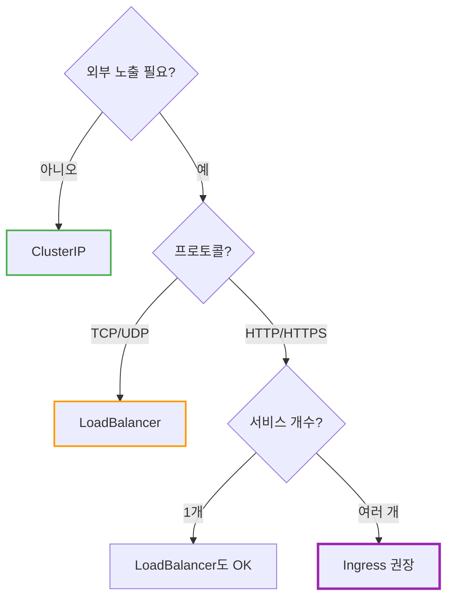
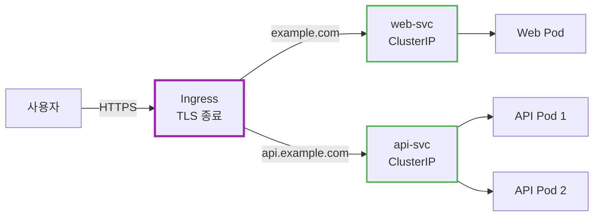
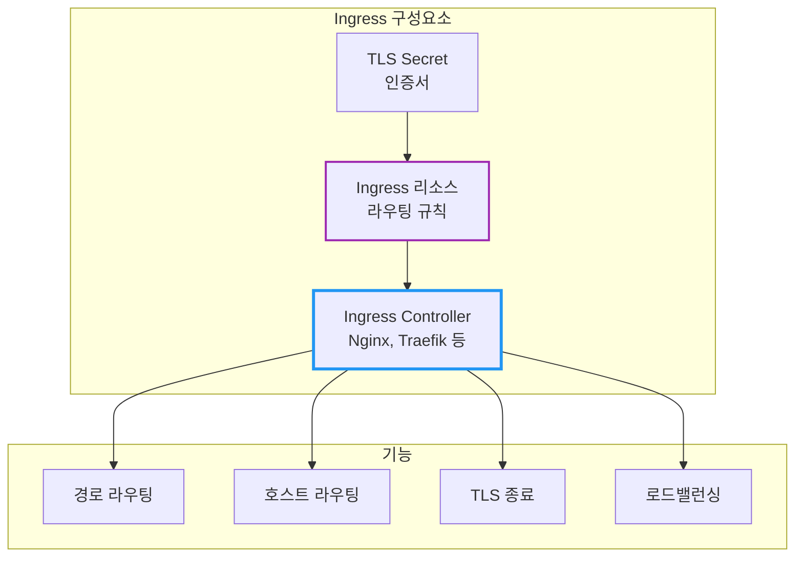

# Kubernetes Ingress

Service마다 LoadBalancer를 만들면 비용이 얼마나 나올까?

## 결론부터 말하면

**Ingress**는 클러스터 외부에서 들어오는 HTTP/HTTPS 트래픽을 **하나의 진입점**으로 받아서, URL 경로나 호스트 이름에 따라 적절한 Service로 라우팅한다.



| 기능 | Service (LoadBalancer) | Ingress |
|------|----------------------|---------|
| L4/L7 | L4 (TCP/UDP) | **L7 (HTTP/HTTPS)** |
| URL 라우팅 | ❌ | ✅ `/api`, `/web` |
| 호스트 라우팅 | ❌ | ✅ `api.example.com` |
| TLS 종료 | ❌ | ✅ 인증서 관리 |
| 비용 | LB당 비용 | **하나의 LB** |

---

## 1. 왜 Ingress가 필요한가?

### 1.1 LoadBalancer Service의 한계

Service 문서에서 `LoadBalancer` 타입을 배웠다. 외부에서 접근할 수 있어서 좋은데, 문제가 있다.

**문제 1: 서비스마다 LoadBalancer가 생긴다**

```yaml
# 3개의 서비스 = 3개의 LoadBalancer = 3배 비용
api-svc:     LoadBalancer → 52.10.1.1
web-svc:     LoadBalancer → 52.10.1.2
admin-svc:   LoadBalancer → 52.10.1.3
```

AWS ALB 기준 월 $20~30 × 서비스 개수 = 비용 폭발!

**문제 2: URL 경로 기반 라우팅이 안 된다**

LoadBalancer는 L4(TCP) 레벨에서 동작한다. "HTTP 요청의 경로"를 보고 분기하는 건 불가능하다.

```
# 이런 라우팅을 하고 싶다면?
/api/*   → api-svc
/web/*   → web-svc
/admin/* → admin-svc

# LoadBalancer로는 불가능!
```

**문제 3: TLS 인증서 관리가 분산된다**

각 LoadBalancer마다 인증서를 따로 설정해야 한다. 갱신도 따로, 관리도 따로.

### 1.2 Ingress의 해결책

Ingress는 **하나의 진입점**에서 모든 걸 처리한다:

| 문제 | Ingress의 해결책 |
|------|-----------------|
| LB 비용 폭발 | **하나의 LB**로 여러 서비스 |
| URL 라우팅 | **경로 기반** 라우팅 |
| 호스트 라우팅 | **도메인 기반** 라우팅 |
| TLS 관리 | **한 곳에서** 인증서 관리 |

---

## 2. Ingress의 구조

### 2.1 Ingress vs Ingress Controller

여기서 중요한 개념이 있다. **Ingress는 규칙일 뿐이다.**



| 구분 | Ingress | Ingress Controller |
|------|---------|-------------------|
| 역할 | 라우팅 **규칙** 정의 | 규칙을 **실행** |
| 타입 | Kubernetes 리소스 | 별도 설치 필요 |
| 예시 | YAML 파일 | Nginx, Traefik, AWS ALB |

**중요:** Ingress Controller가 없으면 Ingress 리소스를 만들어도 **아무 일도 일어나지 않는다!**

### 2.2 Ingress Controller 종류

| Controller | 특징 | 환경 |
|------------|------|------|
| **Nginx Ingress** | 가장 대중적, 기능 풍부 | 모든 환경 |
| **Traefik** | 가벼움, 자동 설정 | 모든 환경 |
| **AWS ALB** | AWS 네이티브, ALB 자동 생성 | AWS |
| **GKE Ingress** | GCP 네이티브 | GCP |
| **Istio Gateway** | 서비스 메시 연동 | Istio 사용 시 |

---

## 3. Ingress 기본 설정

### 3.1 경로 기반 라우팅

```yaml
apiVersion: networking.k8s.io/v1
kind: Ingress
metadata:
  name: my-ingress
spec:
  ingressClassName: nginx    # 사용할 Ingress Controller
  rules:
  - http:
      paths:
      - path: /api
        pathType: Prefix     # /api, /api/users, /api/v1/... 모두 매칭
        backend:
          service:
            name: api-svc
            port:
              number: 80
      - path: /web
        pathType: Prefix
        backend:
          service:
            name: web-svc
            port:
              number: 80
```



### 3.2 pathType 이해하기

| pathType | 설명 | 예시 |
|----------|------|------|
| **Prefix** | 경로 접두사 매칭 | `/api` → `/api`, `/api/users`, `/api/v1` |
| **Exact** | 정확히 일치해야 함 | `/api` → `/api`만 (❌ `/api/users`) |
| **ImplementationSpecific** | Controller마다 다름 | - |

### 3.3 호스트 기반 라우팅

```yaml
apiVersion: networking.k8s.io/v1
kind: Ingress
metadata:
  name: multi-host-ingress
spec:
  ingressClassName: nginx
  rules:
  - host: api.example.com     # 호스트별 분기
    http:
      paths:
      - path: /
        pathType: Prefix
        backend:
          service:
            name: api-svc
            port:
              number: 80
  - host: web.example.com
    http:
      paths:
      - path: /
        pathType: Prefix
        backend:
          service:
            name: web-svc
            port:
              number: 80
```



---

## 4. TLS/HTTPS 설정

### 4.1 왜 Ingress에서 TLS를 처리하나?

TLS 종료(termination)를 Ingress에서 하면:
- 인증서를 **한 곳에서** 관리
- 백엔드 Pod는 **HTTP**로 통신 (단순화)
- 인증서 갱신이 **쉬움**



### 4.2 TLS Secret 생성

```bash
# 인증서와 키로 Secret 생성
kubectl create secret tls my-tls-secret \
  --cert=path/to/cert.crt \
  --key=path/to/cert.key
```

### 4.3 Ingress에 TLS 적용

```yaml
apiVersion: networking.k8s.io/v1
kind: Ingress
metadata:
  name: tls-ingress
spec:
  ingressClassName: nginx
  tls:
  - hosts:
    - api.example.com
    - web.example.com
    secretName: my-tls-secret    # TLS Secret 참조
  rules:
  - host: api.example.com
    http:
      paths:
      - path: /
        pathType: Prefix
        backend:
          service:
            name: api-svc
            port:
              number: 80
```

### 4.4 cert-manager로 자동 인증서 관리

수동으로 인증서를 관리하기 어렵다면 **cert-manager**를 사용하라.

```yaml
apiVersion: networking.k8s.io/v1
kind: Ingress
metadata:
  name: auto-tls-ingress
  annotations:
    cert-manager.io/cluster-issuer: letsencrypt-prod  # 자동 발급
spec:
  ingressClassName: nginx
  tls:
  - hosts:
    - api.example.com
    secretName: api-tls    # cert-manager가 자동 생성
  rules:
  - host: api.example.com
    http:
      paths:
      - path: /
        pathType: Prefix
        backend:
          service:
            name: api-svc
            port:
              number: 80
```

cert-manager가 Let's Encrypt에서 인증서를 자동 발급하고, 만료 전에 자동 갱신한다.

---

## 5. Default Backend

### 5.1 매칭되지 않는 요청 처리

어떤 규칙에도 매칭되지 않는 요청은 어떻게 될까?

```yaml
apiVersion: networking.k8s.io/v1
kind: Ingress
metadata:
  name: ingress-with-default
spec:
  ingressClassName: nginx
  defaultBackend:           # 기본 백엔드
    service:
      name: default-svc
      port:
        number: 80
  rules:
  - host: api.example.com
    http:
      paths:
      - path: /api
        pathType: Prefix
        backend:
          service:
            name: api-svc
            port:
              number: 80
```



---

## 6. Annotations: Controller별 고급 설정

### 6.1 Nginx Ingress 예시

Ingress Controller마다 **annotations**로 세부 설정을 한다.

```yaml
apiVersion: networking.k8s.io/v1
kind: Ingress
metadata:
  name: nginx-ingress
  annotations:
    # HTTPS 리다이렉트
    nginx.ingress.kubernetes.io/ssl-redirect: "true"

    # 타임아웃
    nginx.ingress.kubernetes.io/proxy-read-timeout: "300"

    # CORS
    nginx.ingress.kubernetes.io/enable-cors: "true"

    # Rate Limiting
    nginx.ingress.kubernetes.io/limit-rps: "10"
spec:
  ingressClassName: nginx
  rules:
  - host: api.example.com
    http:
      paths:
      - path: /api
        pathType: Prefix
        backend:
          service:
            name: api-svc
            port:
              number: 80
```

> **경로 재작성(Rewrite)이 필요하다면?** `/api/users` 요청을 백엔드에 `/users`로 전달하고 싶을 때는 `rewrite-target`과 `use-regex` annotation을 함께 사용한다. 자세한 내용은 [Nginx Ingress Rewrite 문서](https://kubernetes.github.io/ingress-nginx/examples/rewrite/)를 참고하라.

### 6.2 자주 쓰는 Nginx Annotations

| Annotation | 설명 |
|------------|------|
| `ssl-redirect` | HTTP → HTTPS 리다이렉트 |
| `rewrite-target` | 경로 재작성 |
| `proxy-body-size` | 요청 본문 크기 제한 |
| `proxy-read-timeout` | 백엔드 응답 타임아웃 |
| `whitelist-source-range` | IP 허용 목록 |

---

## 7. Ingress vs Service 언제 뭘 쓰나?



| 상황 | 추천 |
|------|------|
| 내부 서비스 간 통신 | **ClusterIP** |
| TCP/UDP 외부 노출 (DB 등) | **LoadBalancer** |
| HTTP/HTTPS 1개 서비스 | LoadBalancer 또는 Ingress |
| HTTP/HTTPS 여러 서비스 | **Ingress** |
| URL/호스트 기반 라우팅 필요 | **Ingress** |
| TLS 중앙 관리 필요 | **Ingress** |

---

## 8. 실전 예시: 전체 구성

```yaml
---
# 1. API Service (ClusterIP)
apiVersion: v1
kind: Service
metadata:
  name: api-svc
spec:
  type: ClusterIP
  selector:
    app: api
  ports:
  - port: 80
    targetPort: 8080

---
# 2. Web Service (ClusterIP)
apiVersion: v1
kind: Service
metadata:
  name: web-svc
spec:
  type: ClusterIP
  selector:
    app: web
  ports:
  - port: 80
    targetPort: 3000

---
# 3. Ingress (외부 진입점)
apiVersion: networking.k8s.io/v1
kind: Ingress
metadata:
  name: main-ingress
  annotations:
    nginx.ingress.kubernetes.io/ssl-redirect: "true"
    cert-manager.io/cluster-issuer: letsencrypt-prod
spec:
  ingressClassName: nginx
  tls:
  - hosts:
    - example.com
    - api.example.com
    secretName: example-tls
  rules:
  - host: example.com
    http:
      paths:
      - path: /
        pathType: Prefix
        backend:
          service:
            name: web-svc
            port:
              number: 80
  - host: api.example.com
    http:
      paths:
      - path: /
        pathType: Prefix
        backend:
          service:
            name: api-svc
            port:
              number: 80
```



**핵심:** 백엔드 Service는 `ClusterIP`로 충분하다. 외부 노출은 Ingress가 담당!

---

## 9. 자주 쓰는 명령어

```bash
# Ingress 목록
kubectl get ingress

# Ingress 상세 (주소, 규칙 확인)
kubectl describe ingress my-ingress

# Ingress Controller Pod 로그 확인
kubectl logs -n ingress-nginx -l app.kubernetes.io/name=ingress-nginx

# TLS Secret 확인
kubectl get secret my-tls-secret
```

---

## 10. 정리



| 질문 | 답변 |
|------|------|
| Ingress만 만들면 동작하나요? | ❌ Ingress Controller 필요 |
| LoadBalancer 대신 Ingress? | HTTP/HTTPS면 Ingress 권장 |
| TLS는 어디서 처리? | Ingress에서 종료 (권장) |

**핵심 기억:**
1. **Ingress**는 규칙, **Ingress Controller**가 실행
2. **하나의 진입점**으로 여러 서비스 라우팅 → 비용 절감
3. **경로** (`/api`)와 **호스트** (`api.example.com`) 기반 라우팅
4. **TLS** 인증서를 한 곳에서 관리
5. 백엔드 Service는 **ClusterIP**로 충분

---

## 출처

- [Kubernetes Documentation - Ingress](https://kubernetes.io/docs/concepts/services-networking/ingress/) - 공식 문서
- [Kubernetes Documentation - Ingress Controllers](https://kubernetes.io/docs/concepts/services-networking/ingress-controllers/) - 공식 문서
- [Nginx Ingress Controller Documentation](https://kubernetes.github.io/ingress-nginx/) - Nginx Ingress 공식
- [cert-manager Documentation](https://cert-manager.io/docs/) - cert-manager 공식
