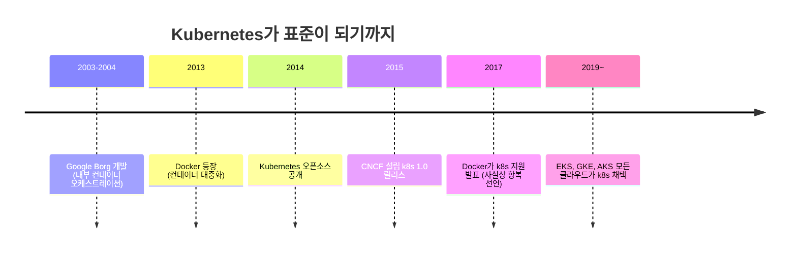
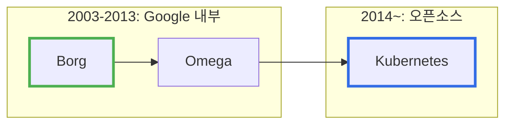
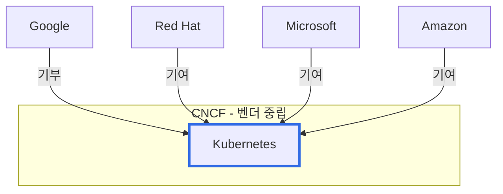
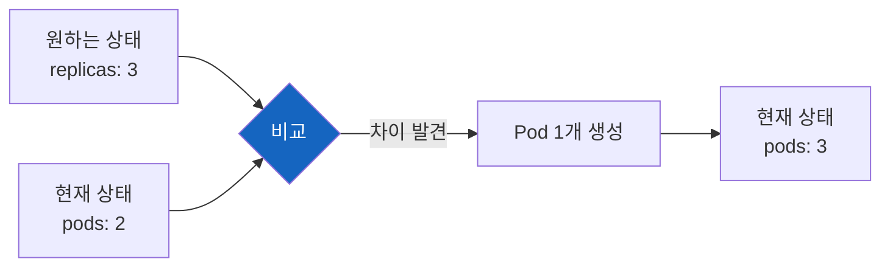
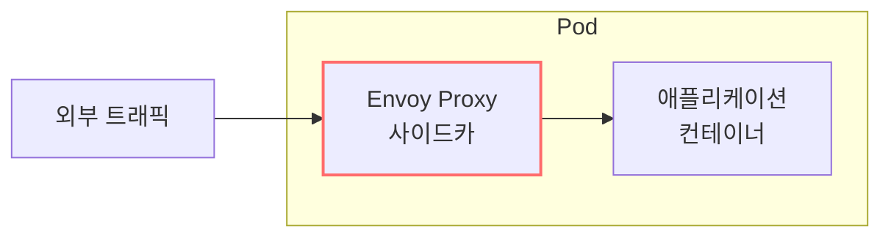
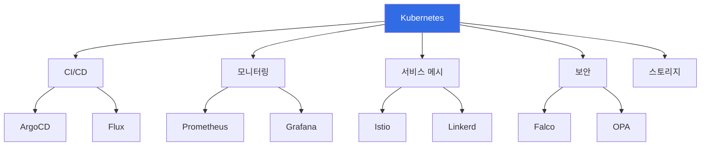

# Kubernetes Introduction

Google이 10년간 수십억 개의 컨테이너를 운영하며 쌓은 노하우, 그것이 Kubernetes다.

## 결론부터 말하면

**Kubernetes는 Google 내부 시스템(Borg)의 오픈소스 버전이다.** 경쟁자들(Docker Swarm, Mesos)이 있었지만, "벤더 중립적 거버넌스 + 선언적 인프라 + 압도적 에코시스템"이라는 삼박자를 갖춘 건 k8s뿐이었다.



| 요인 | 설명 |
|------|------|
| **Google의 경험** | 10년간 Borg/Omega로 검증된 설계 |
| **벤더 중립** | CNCF 거버넌스로 특정 회사 종속 방지 |
| **선언적 설계** | "원하는 상태"만 선언하면 시스템이 알아서 |
| **에코시스템** | 모니터링, CI/CD, 보안 도구가 모두 k8s 우선 지원 |

---

## 1. 컨테이너 오케스트레이션이 왜 필요했는가?

### 1.1 Docker만으로는 부족했다

2013년 Docker가 등장하면서 "컨테이너"가 대중화되었다. 개발자들은 열광했다. "내 로컬에서는 되는데?"라는 악몽이 사라졌기 때문이다.

하지만 프로덕션에 배포하려니 문제가 생겼다. Docker는 "컨테이너를 만들고 실행하는 것"까지만 해결했다. 수백, 수천 개의 컨테이너를 **어떻게 관리할 것인가**는 별개의 문제였다.

| 문제 | 설명 |
|------|------|
| **스케일링** | 트래픽이 늘면 컨테이너를 몇 개나 띄워야 하지? |
| **장애 복구** | 컨테이너가 죽으면 누가 다시 띄우지? |
| **로드 밸런싱** | 요청을 어떤 컨테이너로 보내지? |
| **롤링 업데이트** | 무중단 배포는 어떻게? |
| **서비스 디스커버리** | MSA에서 서비스끼리 어떻게 찾지? |

### 1.2 Google은 이미 10년 전에 이 문제를 풀었다

여기서 흥미로운 사실이 있다. Google은 2003년부터 내부적으로 **Borg**라는 시스템을 운영하고 있었다. Gmail, YouTube, 검색 — Google의 모든 서비스가 Borg 위에서 돌아갔다. 매주 수십억 개의 컨테이너가 실행되었다.



Borg를 운영하면서 Google 엔지니어들은 중요한 깨달음을 얻었다:

> "컨테이너 오케스트레이션은 결국 **선언적**(Declarative)이어야 한다. '이 컨테이너를 이 서버에 띄워라'가 아니라, '이 서비스는 항상 3개의 인스턴스가 떠 있어야 한다'고 선언하면 시스템이 알아서 맞춰야 한다."

이 철학이 Kubernetes의 핵심이 되었다.

---

## 2. 경쟁자들은 왜 졌는가?

2014-2017년, 컨테이너 오케스트레이션 시장은 삼국지였다. Docker Swarm, Apache Mesos, 그리고 Kubernetes가 치열하게 경쟁했다.

| 플랫폼 | 배경 | 장점 | 패배 원인 |
|--------|------|------|----------|
| **Docker Swarm** | Docker Inc. | 단순함, Docker와 통합 | 기능 부족, 벤더 종속 우려 |
| **Apache Mesos** | Twitter, Airbnb | 대규모 확장성 | 복잡함, 컨테이너 특화 아님 |
| **Kubernetes** | Google + 커뮤니티 | 균형 잡힌 설계, CNCF | - |

### 2.1 Docker Swarm: 너무 단순했다

Docker Swarm은 Docker를 만든 회사가 직접 만들었다. `docker swarm init` 한 줄이면 클러스터가 만들어졌다. 단순함이 장점이었지만, 엔터프라이즈가 원하는 기능(RBAC, 세밀한 네트워킹, 커스텀 스케줄링)이 부족했다.

더 큰 문제는 **Docker Inc.라는 단일 회사가 통제**한다는 점이었다. 기업들은 특정 벤더에 종속되는 것을 꺼렸다.

### 2.2 Mesos: 너무 복잡했다

Mesos는 Twitter가 사용하던 강력한 시스템이었다. 수만 대의 노드를 관리할 수 있었다. 하지만 컨테이너만을 위한 시스템이 아니었다. Hadoop, Spark 등 다양한 워크로드를 실행할 수 있는 "범용 분산 시스템"이었다.

이 범용성이 역으로 단점이 되었다. 컨테이너만 돌리려는 팀에게는 과하게 복잡했다.

### 2.3 Kubernetes: 적당히 복잡하고, 누구의 것도 아니었다

Kubernetes는 Mesos보다 단순하고, Swarm보다 강력했다. 그리고 결정적으로 **CNCF**(Cloud Native Computing Foundation)라는 중립적 재단에 기부되었다.



Google, Microsoft, Amazon, Red Hat이 모두 CNCF 멤버로 참여했다. 어느 한 회사가 Kubernetes를 독점할 수 없는 구조가 만들어졌다.

**2017년, Docker Inc.가 Kubernetes 지원을 발표했다.** 자사의 Swarm 대신 경쟁자를 지원하겠다는 것이다. 이것은 사실상 항복 선언이었다.

---

## 3. Kubernetes의 핵심 설계 철학

### 3.1 선언적(Declarative) vs 명령적(Imperative)

전통적인 인프라 관리는 **명령적**이었다. "서버 1에 ssh 접속해서 nginx 띄워라, 서버 2에도 띄워라..." 이런 식이다.

```bash
# 명령적: "무엇을 해라"
ssh server1 "docker run nginx"
ssh server2 "docker run nginx"
ssh server3 "docker run nginx"
```

Kubernetes는 **선언적**이다. "nginx가 3개 떠 있어야 한다"고 선언하면 끝이다.

```yaml
# 선언적: "이렇게 되어야 한다"
apiVersion: apps/v1
kind: Deployment
metadata:
  name: nginx
spec:
  replicas: 3  # "nginx가 3개 떠 있어야 한다"
  selector:
    matchLabels:
      app: nginx
  template:
    metadata:
      labels:
        app: nginx
    spec:
      containers:
      - name: nginx
        image: nginx:1.25
```

왜 선언적이 좋은가? 상황별로 비교해보면 명확하다:

| 상황 | 명령적 | 선언적 |
|------|--------|--------|
| 서버 하나가 죽음 | 수동으로 다시 띄워야 함 | k8s가 자동으로 복구 |
| 3개 → 5개 스케일 아웃 | 스크립트 수정 필요 | `replicas: 5`로 변경 |
| 현재 상태 확인 | 서버마다 ssh로 확인 | `kubectl get pods` |
| 롤백 | 이전 스크립트 찾아서 실행 | `kubectl rollout undo` |

### 3.2 자가 치유(Self-Healing)

Kubernetes는 끊임없이 "현재 상태"와 "원하는 상태"를 비교한다. 이것을 **Reconciliation Loop**라고 부른다.



컨테이너가 죽어도, 노드가 죽어도, k8s는 "3개가 떠 있어야 한다"는 선언을 지키기 위해 자동으로 복구한다. 운영자가 새벽에 일어나서 수동으로 복구할 필요가 없다.

### 3.3 추상화 계층

Kubernetes는 인프라를 추상화한다. 이 추상화 덕분에 **어떤 클라우드에서든 같은 YAML로 배포**할 수 있다.

| 개념 | 역할 |
|------|------|
| **Pod** | 컨테이너의 최소 배포 단위 |
| **Service** | Pod들 앞에 고정된 엔드포인트 제공 |
| **Deployment** | Pod의 배포/업데이트/롤백 관리 |
| **Ingress** | 외부 트래픽을 Service로 라우팅 |
| **ConfigMap/Secret** | 설정과 민감 정보 분리 |

AWS에서 GCP로 옮겨도 애플리케이션 코드와 YAML 파일은 거의 바뀌지 않는다. 이것이 "Write once, run anywhere"의 현대적 버전이다.

---

## 4. MSA에서 k8s가 특히 강력한 이유

### 4.1 서비스 디스커버리 내장

MSA에서 가장 어려운 문제 중 하나가 "서비스 A가 서비스 B를 어떻게 찾지?"이다. 전통적으로는 Eureka, Consul 같은 별도 서비스 디스커버리 도구가 필요했다.

Kubernetes는 **Service**라는 개념으로 이 문제를 기본 제공한다:

```yaml
apiVersion: v1
kind: Service
metadata:
  name: user-service
spec:
  selector:
    app: user
  ports:
  - port: 80
```

이렇게 정의하면, 다른 Pod에서 `http://user-service`로 요청할 수 있다. Pod의 IP가 바뀌어도, Pod 수가 늘어나도, `user-service`라는 DNS 이름은 변하지 않는다.

### 4.2 사이드카 패턴과 서비스 메시

MSA에서 공통 기능(로깅, 모니터링, 인증, 암호화)을 어떻게 처리할까? 각 서비스마다 구현하면 중복이고, 라이브러리로 만들면 언어마다 따로 만들어야 한다.

Kubernetes의 Pod는 여러 컨테이너를 함께 실행할 수 있다. 이것이 **사이드카 패턴**이다:



Istio, Linkerd 같은 서비스 메시가 이 패턴을 활용한다. 애플리케이션 코드 수정 없이 mTLS 암호화, 트래픽 관리, 분산 추적을 추가할 수 있다.

### 4.3 수평 확장의 자동화

MSA의 장점 중 하나가 "서비스별 독립적 스케일링"이다. 주문 서비스는 3개, 결제 서비스는 10개처럼 트래픽에 따라 다르게 조절할 수 있다.

Kubernetes의 **HPA**(Horizontal Pod Autoscaler)는 이것을 자동화한다:

```yaml
apiVersion: autoscaling/v2
kind: HorizontalPodAutoscaler
metadata:
  name: user-service-hpa
spec:
  scaleTargetRef:
    apiVersion: apps/v1
    kind: Deployment
    name: user-service
  minReplicas: 2
  maxReplicas: 10
  metrics:
  - type: Resource
    resource:
      name: cpu
      target:
        type: Utilization
        averageUtilization: 70
```

CPU 사용률이 70%를 넘으면 자동으로 Pod를 늘리고, 내려가면 줄인다. 운영자가 수동으로 스케일링할 필요가 없다.

---

## 5. 에코시스템이 승패를 갈랐다

Kubernetes가 표준이 된 가장 큰 이유 중 하나는 **압도적인 에코시스템**이다.



CNCF 산하 프로젝트만 해도 수십 개다. 모니터링(Prometheus), 로깅(Fluentd), CI/CD(ArgoCD), 보안(Falco) — 무엇을 하든 Kubernetes 위에서 잘 동작하는 도구가 이미 있다.

이것은 네트워크 효과를 만들었다. 더 많은 사람이 k8s를 쓰니까 더 많은 도구가 만들어지고, 더 많은 도구가 있으니까 더 많은 사람이 k8s를 선택했다.

---

## 6. 정리

### 왜 Kubernetes가 이겼는가?

Kubernetes의 승리는 기술적 우월성만으로 설명되지 않는다. 정치적, 생태계적 요인이 결합되었다:

| 요인 | 설명 |
|------|------|
| **검증된 설계** | Google이 10년간 Borg로 수십억 컨테이너를 운영하며 검증 |
| **벤더 중립** | CNCF 거버넌스로 특정 회사 종속 방지 |
| **적당한 복잡도** | Swarm보다 강력하고, Mesos보다 단순 |
| **선언적 모델** | 자가 치유, 버전 관리, GitOps와 자연스럽게 연결 |
| **에코시스템** | Prometheus, Istio, ArgoCD 등 풍부한 도구 |
| **클라우드 지원** | AWS(EKS), GCP(GKE), Azure(AKS) 모두 관리형 k8s 제공 |

### 결국 Kubernetes는

"**컨테이너를 어떻게 운영할 것인가?**"라는 질문에 대한 가장 합리적인 답이었다. Google의 검증된 설계, 중립적 거버넌스, 풍부한 에코시스템 — 이 조합을 이길 수 있는 경쟁자는 없었다.

---

## 관련 문서

이 시리즈의 다른 문서들을 통해 Kubernetes의 각 리소스를 깊이 학습할 수 있다.

| 문서 | 설명 |
|------|------|
| [Kubernetes Pod](./Kubernetes-Pod.md) | 컨테이너의 최소 배포 단위 |
| [Kubernetes ReplicaSet & Deployment](./Kubernetes-ReplicaSet-Deployment.md) | Pod의 복제와 배포 관리 |
| [Kubernetes Probe](./Kubernetes-Probe-Liveness-Readiness-Startup.md) | Liveness, Readiness, Startup Probe |
| [Kubernetes Deployment Strategy](./Kubernetes-Deployment-Strategy.md) | Rolling, Blue/Green, Canary 배포 전략 |
| [Kubernetes Service](./Kubernetes-Service-ClusterIP-NodePort-LoadBalancer.md) | ClusterIP, NodePort, LoadBalancer |
| [Kubernetes Ingress](./Kubernetes-Ingress.md) | HTTP 라우팅과 TLS |
| [Kubernetes ConfigMap & Secret](./Kubernetes-ConfigMap-Secret.md) | 설정과 민감 정보 분리 |
| [Kubernetes Volume & PersistentVolume](./Kubernetes-Volume-PersistentVolume.md) | 스토리지, PV/PVC, StorageClass |
| [Kubernetes StatefulSet](./Kubernetes-StatefulSet.md) | 상태를 가진 애플리케이션 |
| [Kubernetes DaemonSet, Job, CronJob](./Kubernetes-DaemonSet-Job-CronJob.md) | 노드별 Pod, 배치 작업 |

---

## 출처

- [Kubernetes 공식 문서](https://kubernetes.io/docs/) - 공식 문서
- [Large-scale cluster management at Google with Borg](https://research.google/pubs/pub43438/) - Google Borg 논문
- [CNCF 공식 사이트](https://www.cncf.io/)
- [The History of Kubernetes](https://blog.risingstack.com/the-history-of-kubernetes/)
