# Kubernetes Pod

Docker 컨테이너가 있는데, 왜 Kubernetes는 굳이 "Pod"라는 개념을 만들었을까?

## 결론부터 말하면

**Pod는 "함께 배포되고, 함께 스케일링되고, 함께 죽어야 하는 컨테이너들"을 묶는 단위다.** 컨테이너 하나만으로는 표현할 수 없는 패턴(sidecar, init container)을 위해 존재한다.

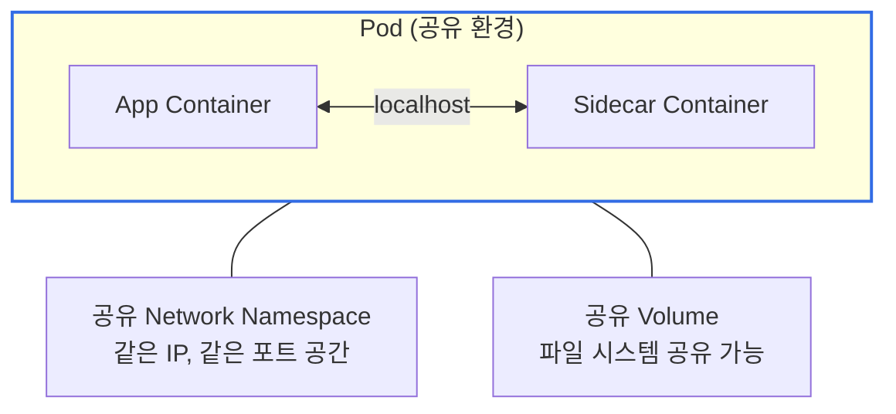

| 특징 | 컨테이너 단독 | Pod |
|------|-------------|-----|
| 네트워크 | 컨테이너마다 별도 IP | Pod 내 컨테이너는 **같은 IP** |
| 컨테이너 간 통신 | 네트워크 통해야 함 | **localhost**로 통신 |
| 볼륨 공유 | 별도 설정 필요 | Pod 내에서 자연스럽게 공유 |
| 스케줄링 | 각각 어디로 갈지 모름 | **항상 같은 노드**에 배치 |

---

## 1. 왜 컨테이너가 아닌 Pod인가?

### 1.1 컨테이너 하나로 부족한 순간

Docker를 쓰다 보면 이런 상황이 생긴다:

> "애플리케이션 컨테이너 옆에 로그 수집기를 붙이고 싶은데, 같은 파일 시스템을 봐야 해."
> "메인 앱이 뜨기 전에 설정 파일을 다운로드해야 하는데, 이걸 같은 컨테이너에 넣으면 이미지가 복잡해져."

컨테이너 하나에 모든 걸 넣으면? 이미지가 비대해지고, 관심사 분리가 안 된다. 컨테이너를 분리하면? 네트워크 설정이 복잡해지고, 같은 노드에 있을 거란 보장이 없다.

### 1.2 Pod가 해결하는 문제

Pod는 "**밀접하게 결합된 컨테이너들을 하나의 단위로 묶는다**"는 아이디어다.

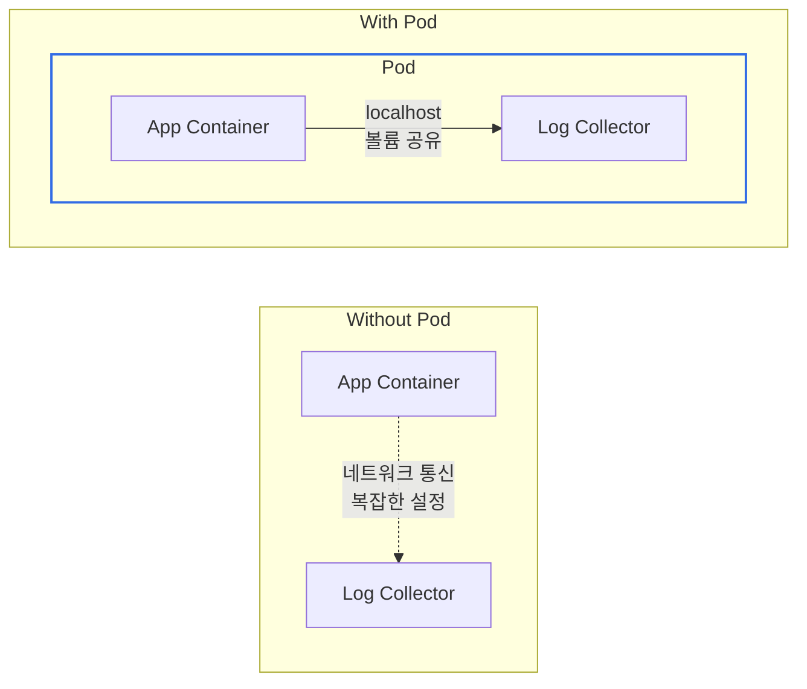

Pod 안의 컨테이너들은:
- **같은 네트워크 네임스페이스**를 공유한다 (같은 IP, localhost로 통신)
- **같은 IPC 네임스페이스**를 공유한다 (프로세스 간 통신 가능)
- **같은 노드**에 스케줄링된다 (항상 함께 배치)
- **볼륨을 공유**할 수 있다 (파일 시스템 접근)

---

## 2. Pod의 구조

### 2.1 YAML로 보는 Pod

```yaml
apiVersion: v1
kind: Pod
metadata:
  name: my-app
  labels:
    app: my-app
spec:
  containers:
  - name: app
    image: nginx:1.25
    ports:
    - containerPort: 80
    volumeMounts:
    - name: log-volume
      mountPath: /var/log/nginx

  - name: log-collector
    image: busybox
    command: ['sh', '-c', 'tail -F /var/log/nginx/access.log']
    volumeMounts:
    - name: log-volume
      mountPath: /var/log/nginx

  volumes:
  - name: log-volume
    emptyDir: {}
```

이 Pod에는 두 개의 컨테이너가 있다:
- `app`: nginx 웹 서버 (로그를 `/var/log/nginx`에 기록)
- `log-collector`: 로그 파일을 읽어서 외부로 전송하는 사이드카

둘 다 `log-volume`을 마운트해서 nginx의 로그를 log-collector가 수집한다. 이것이 전형적인 **Sidecar 패턴**이다.

### 2.2 Pod 내부 네트워킹

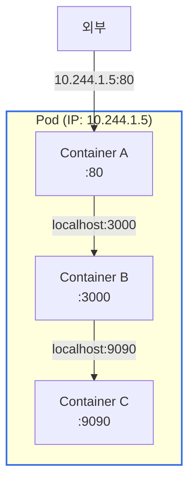

Pod 내 컨테이너들은:
- **같은 IP 주소**를 공유한다
- **포트는 겹치면 안 된다** (같은 네트워크 네임스페이스니까)
- 서로 **localhost**로 통신한다

---

## 3. Pod Lifecycle 심화

Pod는 생성부터 종료까지 여러 상태를 거친다. 실무에서 트러블슈팅을 하려면 이 라이프사이클을 정확히 이해해야 한다.

### 3.1 Pod Phase: 5가지 상태

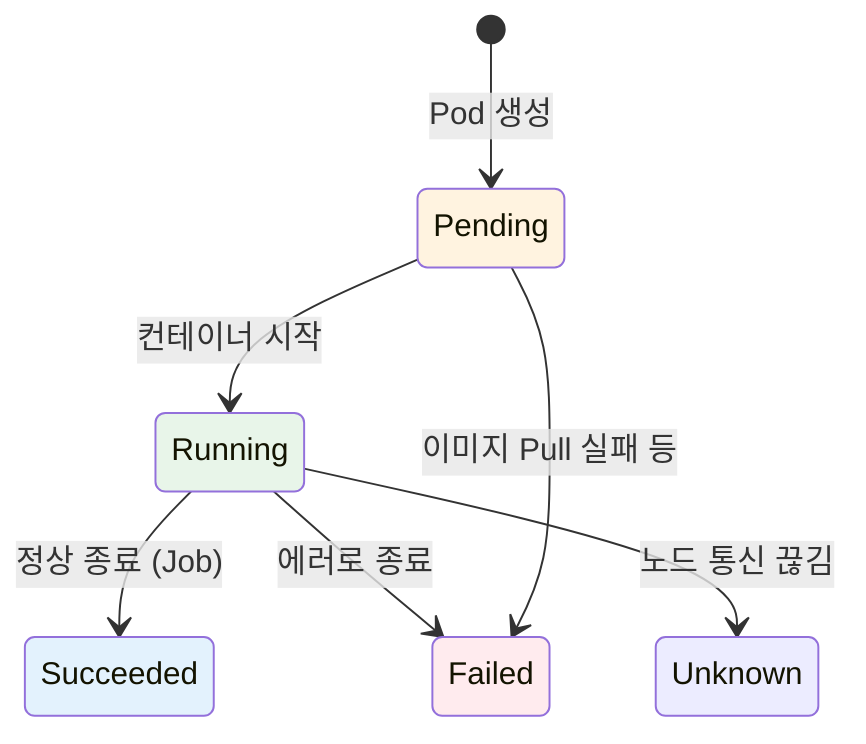

| Phase | 의미 | 실무에서 자주 보는 상황 |
|-------|------|----------------------|
| **Pending** | 스케줄링 대기 또는 이미지 다운로드 중 | 리소스 부족, ImagePullBackOff |
| **Running** | 최소 하나의 컨테이너가 실행 중 | 정상 상태 |
| **Succeeded** | 모든 컨테이너가 성공 종료 | Job/CronJob 완료 |
| **Failed** | 최소 하나의 컨테이너가 실패 종료 | OOMKilled, 앱 에러 |
| **Unknown** | 노드와 통신 불가 | 노드 장애, 네트워크 문제 |

**Pending 상태가 오래 지속되는 이유:**

```bash
kubectl describe pod my-app
```

| 원인 | Events 메시지 | 해결 방법 |
|------|--------------|----------|
| 리소스 부족 | `Insufficient cpu/memory` | 노드 추가 또는 requests 줄이기 |
| 이미지 Pull 실패 | `ImagePullBackOff` | 이미지 이름/태그 확인, registry 인증 |
| PVC 바인딩 대기 | `pod has unbound PersistentVolumeClaims` | PV 생성 또는 StorageClass 확인 |
| Node Selector 불일치 | `didn't match node selector` | 노드 라벨 확인 |

### 3.2 Container States: 컨테이너 레벨 상태

Pod 안의 각 컨테이너도 별도의 상태를 가진다. `kubectl describe pod`로 확인할 수 있다.

| Container State | 의미 | 세부 정보 |
|-----------------|------|----------|
| **Waiting** | 시작 준비 중 | `reason`: ImagePullBackOff, CrashLoopBackOff 등 |
| **Running** | 실행 중 | `startedAt`: 시작 시간 |
| **Terminated** | 종료됨 | `exitCode`, `reason`: Completed, Error, OOMKilled |

**실무에서 자주 보는 Waiting 이유:**

```yaml
# kubectl describe pod에서 확인
State:          Waiting
  Reason:       CrashLoopBackOff
Last State:     Terminated
  Exit Code:    1
  Reason:       Error
```

| Reason | 의미 | 해결 방법 |
|--------|------|----------|
| `ImagePullBackOff` | 이미지 다운로드 실패 | 이미지 경로, 태그, registry 인증 확인 |
| `CrashLoopBackOff` | 컨테이너가 반복적으로 충돌 | 로그 확인: `kubectl logs pod-name --previous` |
| `CreateContainerConfigError` | 설정 오류 | ConfigMap/Secret 존재 여부 확인 |

### 3.3 Container Restart Policy와 CrashLoopBackOff

컨테이너가 죽으면 Kubernetes는 자동으로 재시작한다. 하지만 **무한히 빠르게 재시작하지 않는다.**

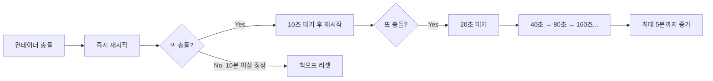

**지수 백오프(Exponential Backoff)** 메커니즘:
- 첫 번째 충돌: 즉시 재시작
- 두 번째 충돌: 10초 대기
- 세 번째 충돌: 20초 대기
- 네 번째 충돌: 40초 대기
- ... 최대 **5분**(300초)까지 증가

컨테이너가 10분 이상 정상 실행되면 백오프 타이머가 리셋된다.

**restartPolicy 옵션:**

```yaml
spec:
  restartPolicy: Always  # 기본값
```

| Policy | 동작 | 사용 시점 |
|--------|------|----------|
| `Always` | 항상 재시작 (성공 종료도 재시작) | Deployment, DaemonSet |
| `OnFailure` | 실패(exit code != 0)시만 재시작 | Job |
| `Never` | 재시작 안 함 | 디버깅, 일회성 작업 |

### 3.4 Graceful Shutdown: 우아한 종료

Pod가 삭제될 때, Kubernetes는 컨테이너에게 "정리할 시간"을 준다. 이것을 이해하지 못하면 **데이터 유실이나 502 에러**가 발생한다.

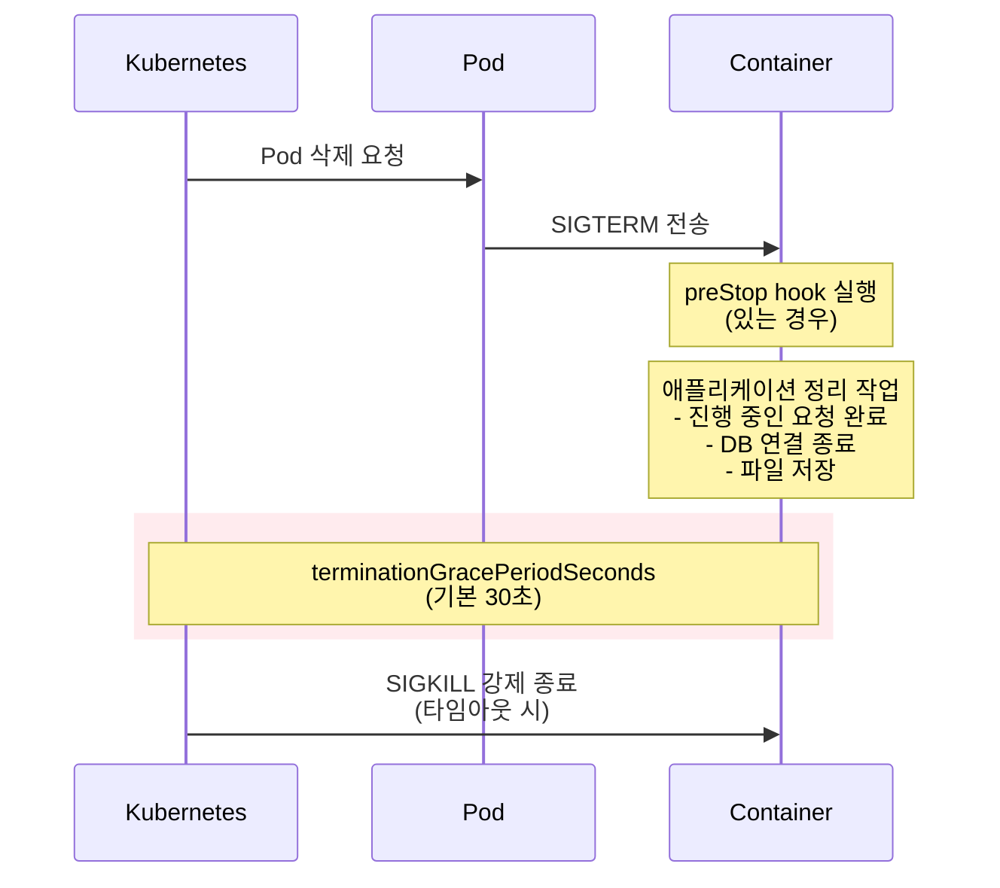

**terminationGracePeriodSeconds:**

```yaml
spec:
  terminationGracePeriodSeconds: 60  # 기본값 30
  containers:
  - name: app
    image: my-app
```

30초가 기본값인데, 이것이 부족한 경우가 많다:
- 장시간 실행되는 요청이 있는 API 서버
- 배치 작업 중인 워커
- 대용량 데이터를 처리하는 서비스

> **주의:** `terminationGracePeriodSeconds`는 **preStop 훅 실행 시간을 포함**한다. 예를 들어 grace period가 30초이고 preStop이 20초 걸리면, 앱이 SIGTERM을 처리할 시간은 **10초**뿐이다. preStop이 30초를 초과하면 훅이 끝나기도 전에 SIGKILL을 받는다.

**preStop Hook:**

SIGTERM을 받기 전에 실행되는 훅이다. 로드밸런서에서 빠지는 시간을 벌거나, 정리 작업을 수행한다.

```yaml
spec:
  containers:
  - name: app
    lifecycle:
      preStop:
        exec:
          command: ["/bin/sh", "-c", "sleep 15"]
```

**왜 sleep 15가 필요한가?**

Pod 삭제 시 두 가지 일이 **동시에** 발생한다:
1. Service의 Endpoints에서 Pod IP 제거 (비동기)
2. Pod에 SIGTERM 전송

문제는 Endpoints 업데이트가 모든 노드에 전파되기 전에 SIGTERM이 먼저 도착할 수 있다는 것이다. 이 경우 트래픽이 아직 오고 있는데 앱이 종료되어 **502 에러**가 발생한다.

`sleep 15`로 15초를 버텨주면 Endpoints 업데이트가 전파될 시간을 확보한다.

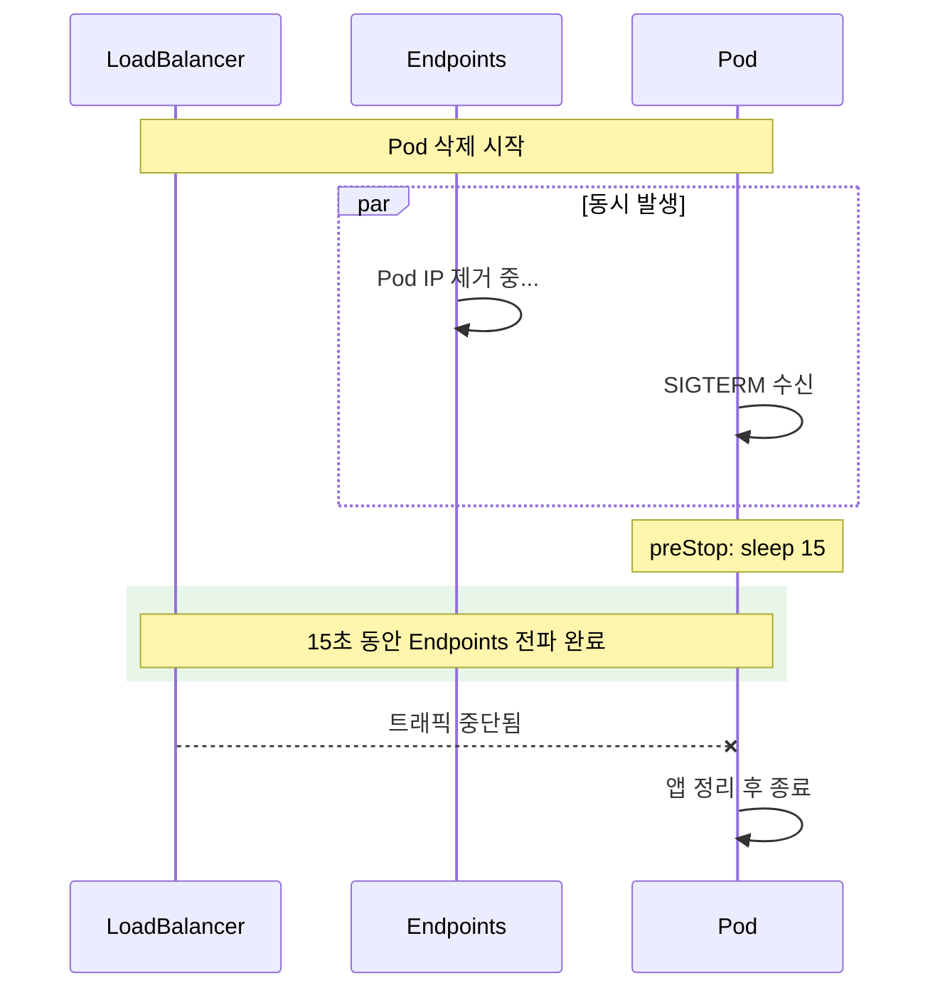

---

## 4. Init Container 심화

### 4.1 Init Container란?

**메인 컨테이너가 시작되기 전에 실행되는 특수 컨테이너**다. 초기화 작업을 분리해서 메인 이미지를 가볍게 유지할 수 있다.

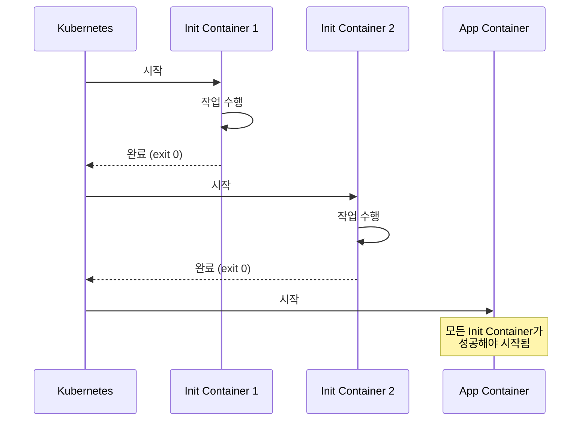

**Init Container의 특징:**
- **순차 실행**: 병렬이 아닌 순서대로 하나씩
- **성공 필수**: 하나라도 실패하면 Pod 시작 안 됨
- **재시작 정책**: 실패 시 Pod의 `restartPolicy`에 따라 재시도
- **완료 후 종료**: 작업이 끝나면 컨테이너 종료

### 4.2 실무 사용 사례

**Case 1: 의존 서비스 대기**

DB나 다른 서비스가 준비될 때까지 대기:

```yaml
apiVersion: v1
kind: Pod
metadata:
  name: myapp
spec:
  initContainers:
  - name: wait-for-db
    image: busybox:1.36
    command: ['sh', '-c',
      'until nslookup mysql-service.default.svc.cluster.local; do
         echo "Waiting for MySQL...";
         sleep 2;
       done']

  - name: wait-for-redis
    image: busybox:1.36
    command: ['sh', '-c',
      'until nc -z redis-service 6379; do
         echo "Waiting for Redis...";
         sleep 2;
       done']

  containers:
  - name: app
    image: my-app:1.0
```

**Case 2: 설정 파일 생성**

ConfigMap이나 외부 소스에서 설정을 가져와 파일로 생성:

```yaml
apiVersion: v1
kind: Pod
metadata:
  name: app-with-config
spec:
  initContainers:
  - name: fetch-config
    image: curlimages/curl:8.4.0
    command: ['sh', '-c',
      'curl -o /config/settings.json https://config-server/api/settings']
    volumeMounts:
    - name: config-volume
      mountPath: /config

  containers:
  - name: app
    image: my-app:1.0
    volumeMounts:
    - name: config-volume
      mountPath: /app/config
      readOnly: true

  volumes:
  - name: config-volume
    emptyDir: {}
```

**Case 3: DB 마이그레이션**

애플리케이션 시작 전 DB 스키마 마이그레이션:

```yaml
initContainers:
- name: db-migrate
  image: my-app:1.0
  command: ['./migrate', '--database', '$(DATABASE_URL)']
  env:
  - name: DATABASE_URL
    valueFrom:
      secretKeyRef:
        name: db-secret
        key: url
```

**Case 4: 권한이 필요한 초기화**

보안상의 이유로 메인 앱에 root 권한을 주지 않지만, 초기화에는 필요한 경우:

```yaml
initContainers:
- name: fix-permissions
  image: busybox
  command: ['sh', '-c', 'chown -R 1000:1000 /data']
  securityContext:
    runAsUser: 0  # root로 실행
  volumeMounts:
  - name: data
    mountPath: /data

containers:
- name: app
  image: my-app:1.0
  securityContext:
    runAsUser: 1000  # non-root로 실행
  volumeMounts:
  - name: data
    mountPath: /data
```

### 4.3 Init Container vs 일반 Container

| 특성 | Init Container | App Container |
|------|----------------|---------------|
| 실행 시점 | 앱 컨테이너 **이전** | Init 이후 |
| 실행 순서 | **순차적** (하나씩) | **병렬** (동시) |
| Probe | ❌ 지원 안 함 | ✅ 지원 |
| lifecycle | ❌ 지원 안 함 | ✅ 지원 |
| Resource 계산 | 가장 큰 것만 적용 | 모두 합산 |
| 완료 조건 | exit 0으로 종료 | 계속 실행 |

---

## 5. Sidecar Container 심화

### 5.1 전통적인 Sidecar 패턴

메인 컨테이너와 **함께 실행되며 보조 기능**을 제공하는 컨테이너다.

```yaml
apiVersion: v1
kind: Pod
metadata:
  name: app-with-sidecar
spec:
  containers:
  - name: app
    image: nginx:1.25
    volumeMounts:
    - name: logs
      mountPath: /var/log/nginx

  - name: log-shipper
    image: fluent/fluent-bit:2.2
    volumeMounts:
    - name: logs
      mountPath: /var/log/nginx
      readOnly: true
    - name: fluent-bit-config
      mountPath: /fluent-bit/etc/

  volumes:
  - name: logs
    emptyDir: {}
  - name: fluent-bit-config
    configMap:
      name: fluent-bit-config
```

**실무에서 흔한 Sidecar 사용 사례:**

| Sidecar | 역할 | 대표 도구 |
|---------|------|----------|
| **Log Agent** | 로그 수집 및 전송 | Fluent Bit, Fluentd, Filebeat |
| **Proxy** | 트래픽 관리, mTLS | Envoy (Istio), Linkerd |
| **Secrets Agent** | 시크릿 주입 | Vault Agent, AWS Secrets Manager |
| **Monitoring** | 메트릭 수집 | Prometheus exporter |

### 5.2 Native Sidecar (K8s 1.29+)

**Kubernetes 1.29부터 Native Sidecar가 정식 지원(Stable)** 된다. 기존 sidecar의 문제점을 해결한다.

**기존 방식의 문제:**

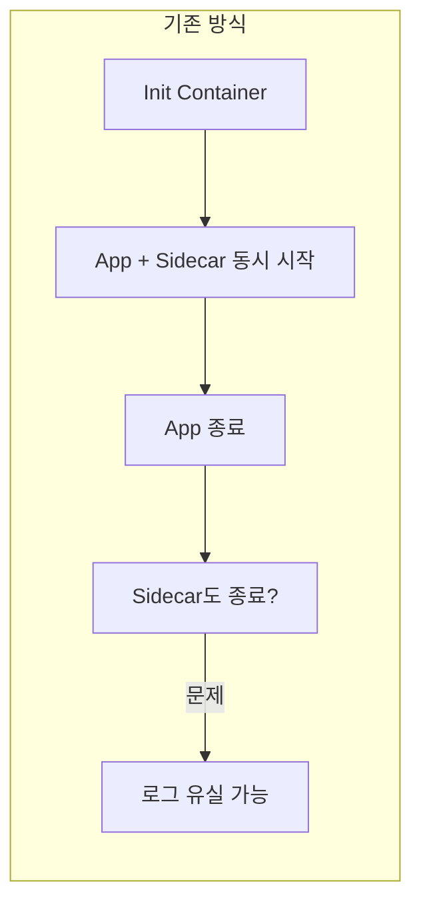

- Sidecar가 메인 앱보다 먼저 죽을 수 있음
- 메인 앱이 죽어도 Sidecar가 계속 살아있을 수 있음 (Job에서 완료 안 됨)
- 시작 순서 보장이 안 됨

**Native Sidecar 방식:**

```yaml
apiVersion: v1
kind: Pod
metadata:
  name: native-sidecar-demo
spec:
  initContainers:
  # 이것이 Native Sidecar!
  - name: log-shipper
    image: fluent/fluent-bit:2.2
    restartPolicy: Always  # 핵심! 이게 Sidecar로 만듦
    volumeMounts:
    - name: logs
      mountPath: /var/log/app

  containers:
  - name: app
    image: my-app:1.0
    volumeMounts:
    - name: logs
      mountPath: /var/log/app

  volumes:
  - name: logs
    emptyDir: {}
```

`initContainers`에 `restartPolicy: Always`를 설정하면 **Native Sidecar**가 된다.

**Native Sidecar의 동작:**

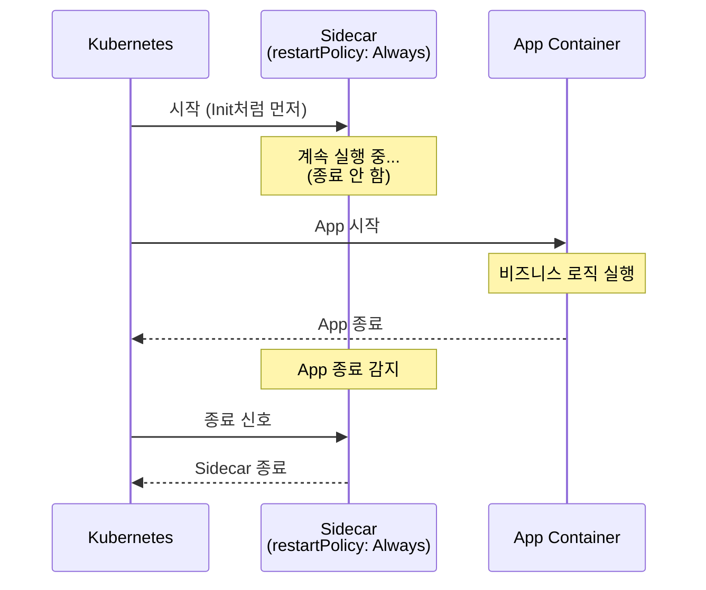

| 특성 | 기존 Sidecar | Native Sidecar |
|------|-------------|----------------|
| 정의 위치 | `containers` | `initContainers` + `restartPolicy: Always` |
| 시작 순서 | 보장 안 됨 | **앱보다 먼저 시작** |
| 종료 순서 | 보장 안 됨 | **앱이 종료된 후 종료** |
| Job에서 | Pod가 완료 안 됨 | 정상 완료 |
| Probe | 지원 | 지원 |

---

## 6. Resource Management

### 6.1 Requests vs Limits

**실무에서 가장 중요한 설정 중 하나**다. 이걸 제대로 설정하지 않으면 노드가 죽거나, 스케줄링이 안 되거나, 성능이 안 나온다.

```yaml
spec:
  containers:
  - name: app
    image: my-app:1.0
    resources:
      requests:
        memory: "256Mi"
        cpu: "250m"
      limits:
        memory: "512Mi"
        cpu: "500m"
```

| 개념 | 역할 | 비유 |
|------|------|------|
| **requests** | 스케줄러가 노드 선택 시 사용 | "최소한 이만큼은 필요해요" |
| **limits** | 컨테이너가 사용할 수 있는 최대치 | "이 이상은 못 써요" |

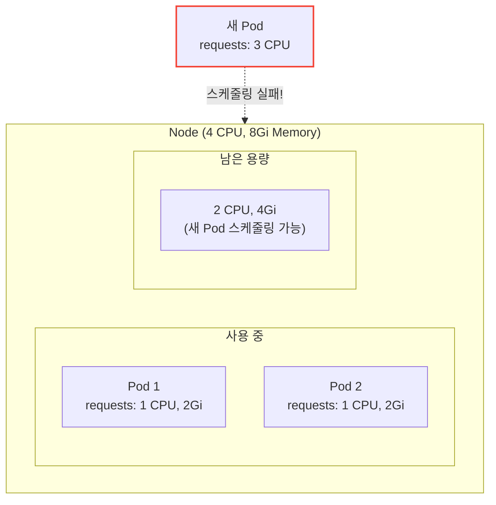

**CPU 단위:**

| 표기 | 의미 |
|------|------|
| `1` | 1 CPU core (1000m) |
| `500m` | 0.5 CPU core |
| `100m` | 0.1 CPU core |

**Memory 단위:**

| 표기 | 의미 |
|------|------|
| `128Mi` | 128 MiB (Mebibyte, 2^20) |
| `1Gi` | 1 GiB |
| `128M` | 128 MB (Megabyte, 10^6) |

> **주의:** `Mi`와 `M`은 다르다! Mi는 2진수(1024), M은 10진수(1000) 기반.

### 6.2 CPU Throttling vs OOMKilled

**CPU와 Memory는 limit 초과 시 동작이 다르다:**

| 리소스 | Limit 초과 시 | 영향 |
|--------|--------------|------|
| **CPU** | Throttling (속도 제한) | 느려지지만 죽지 않음 |
| **Memory** | OOMKilled (강제 종료) | 컨테이너 재시작 |

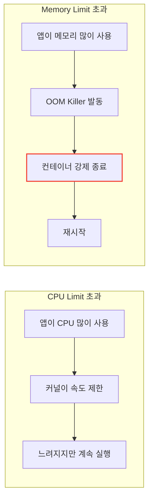

**OOMKilled 확인:**

```bash
kubectl describe pod my-app

# 출력에서 확인
Last State:     Terminated
  Reason:       OOMKilled
  Exit Code:    137
```

Exit Code 137은 `128 + 9(SIGKILL)`로, OOM Killer에 의해 강제 종료되었음을 의미한다.

### 6.3 Requests = Limits로 설정해야 할까?

"requests와 limits를 동일하게 설정해야 한다"는 조언을 들어봤을 것이다. 반면 "CPU limit은 풀어라"는 조언도 있다. **둘 다 맞다.** 다만 강조하는 가치가 다를 뿐이다.

| 관점 | 주장 | 강조하는 가치 |
|------|------|--------------|
| **DevOps/SRE** | Requests = Limits | 안정성, 격리, 예측 가능성 |
| **최근 트렌드** | CPU Limit 여유 있게 | 효율성, 유연성, 비용 최적화 |

**핵심: Memory는 논쟁 없이 동일하게. CPU가 논쟁 지점이다.**

#### 왜 DevOps팀은 Requests = Limits를 권장하나?

**1. Guaranteed QoS로 생존 우선순위 확보**

노드 자원이 부족하면 BestEffort → Burstable → Guaranteed 순으로 Pod가 죽는다. Guaranteed는 가장 마지막까지 살아남는다.

**2. Noisy Neighbor 방지**

CPU Limit을 풀면 내 Pod가 노드의 CPU를 다 끌어다 쓸 수 있다. 만약 버그로 무한 루프가 돌면? **같은 노드의 다른 Pod들까지 느려진다.**

**3. 예측 가능한 성능**

Limit을 걸어두면 성능이 좀 낮아질지언정, **"언제 어디서 실행하든 똑같은 성능"** 이 나온다. 운영 관점에서 관리하기 훨씬 편하다.

#### 왜 최근에는 CPU Limit을 유연하게 하라고 하나?

**억울한 상황이 생기기 때문이다.**

- 내 Pod는 트래픽이 몰려서 CPU가 더 필요하다
- 노드에는 노는 CPU가 엄청 많다
- 하지만 Limit에 막혀서 **눈앞의 노는 CPU를 못 쓰고 느려진다** (Throttling)

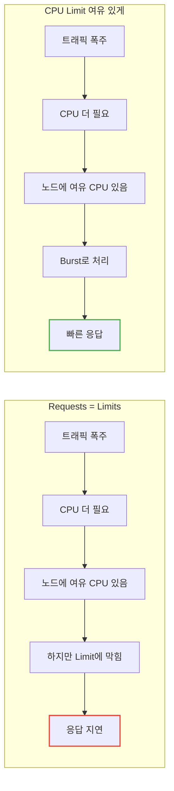

그래서 Google(GKE)이나 많은 SRE들은 웹 서버 같은 일반 애플리케이션에 대해 **"Memory는 엄격하게, CPU는 유연하게"** 패턴을 권장한다.

#### 그래서 뭘 선택해야 하나? (판단 기준)

**Memory는 무조건 Requests = Limits** (이건 논쟁 없음)

Memory는 압축이 불가능하다. Limit을 초과하면 바로 OOMKilled. 처음부터 필요한 만큼 확보하는 게 맞다.

**CPU는 서비스 성격에 따라 다르다:**

| 서비스 유형 | CPU 설정 | 이유 |
|-------------|----------|------|
| **DB, 실시간 금융 거래** | req = limit | 0.1초도 튀면 안 됨, 격리 최우선 |
| **핵심 API 서버** | req = limit | 예측 가능한 성능, 안정성 |
| **일반 웹 서버** | limit 높게 (2~4배) | Burst 트래픽 대응 |
| **Java 앱** | limit 높게 | 기동 시 CPU 많이 필요 |
| **배치/워커** | limit 없음 | 최대 성능, 빨리 끝내기 |

```yaml
# A. 안정성 우선 (DB, 핵심 서비스)
resources:
  requests:
    memory: "256Mi"
    cpu: "500m"
  limits:
    memory: "256Mi"
    cpu: "500m"      # 동일하게 → Guaranteed
```

```yaml
# B. 효율성 우선 (일반 웹 서버)
resources:
  requests:
    memory: "256Mi"
    cpu: "250m"
  limits:
    memory: "256Mi"    # Memory는 동일
    cpu: "1000m"       # CPU는 requests의 2~4배
```

#### 실무 조언

**DevOps 팀의 가이드가 있다면 일단 따르라.** 팀 전체의 운영 정책이 있거나, 노드 스펙을 꽉 채워서 운영 중일 수 있다.

하지만 만약 서비스가 웹 서버이고 **가끔 느려지는 현상(Latency Spike)** 이 발생한다면, DevOps 팀에게 이렇게 제안해볼 수 있다:

> "저희 서비스 특성상 트래픽이 튈 때가 많은데, CPU Throttling 때문에 느려지는 것 같아요. Memory는 고정하되 CPU Limit만 좀 더 여유 있게(Requests의 2~4배) 늘려봐도 될까요?"

> **결론:** DevOps 팀은 **"안정성"** 을 강조한 것이고, 최근 트렌드는 **"효율성"** 을 강조한 것이다. 서비스의 성격에 따라 정답은 바뀐다.

### 6.4 QoS Class: 리소스 부족 시 누가 먼저 죽나?

노드에 리소스가 부족하면 Kubernetes는 **QoS Class**에 따라 Pod를 퇴거(Eviction)한다.


**QoS Class 결정 조건:**

| QoS Class | 조건 | 예시 |
|-----------|------|------|
| **Guaranteed** | 모든 컨테이너에 requests = limits | CPU/Memory 둘 다 동일하게 설정 |
| **Burstable** | 최소 하나의 컨테이너에 requests 또는 limits 설정 | requests만 있거나 limits만 있거나 |
| **BestEffort** | requests, limits 둘 다 없음 | 아무것도 설정 안 함 |

**Guaranteed 설정 예시:**

```yaml
resources:
  requests:
    memory: "256Mi"
    cpu: "500m"
  limits:
    memory: "256Mi"  # requests와 동일
    cpu: "500m"      # requests와 동일
```

**실무 권장사항:**

| 워크로드 유형 | 권장 QoS | 이유 |
|--------------|----------|------|
| 중요 프로덕션 서비스 | **Guaranteed** | 퇴거 우선순위 가장 낮음 |
| 일반 서비스 | **Burstable** | 유연한 리소스 사용 |
| 개발/테스트 | Burstable 또는 BestEffort | 리소스 효율성 |
| Batch Job | **Burstable** | CPU burst 허용 |

---

## 7. Pod Scheduling

### 7.1 nodeSelector: 가장 간단한 방법

특정 라벨이 있는 노드에만 Pod를 배치한다.

```yaml
apiVersion: v1
kind: Pod
metadata:
  name: gpu-pod
spec:
  nodeSelector:
    accelerator: nvidia-tesla-v100  # 이 라벨이 있는 노드에만
  containers:
  - name: cuda-app
    image: nvidia/cuda:12.0-base
```

```bash
# 노드에 라벨 추가
kubectl label nodes node-1 accelerator=nvidia-tesla-v100
```

### 7.2 Node Affinity: 더 유연한 제어

`nodeSelector`보다 표현력이 풍부하다.

```yaml
spec:
  affinity:
    nodeAffinity:
      # 필수 조건 (이 조건 만족하는 노드만)
      requiredDuringSchedulingIgnoredDuringExecution:
        nodeSelectorTerms:
        - matchExpressions:
          - key: topology.kubernetes.io/zone
            operator: In
            values:
            - ap-northeast-2a
            - ap-northeast-2b

      # 선호 조건 (가능하면 이 노드에)
      preferredDuringSchedulingIgnoredDuringExecution:
      - weight: 100
        preference:
          matchExpressions:
          - key: node-type
            operator: In
            values:
            - high-memory
```

| 필드 | 의미 |
|------|------|
| `requiredDuringScheduling...` | **필수** - 만족 안 하면 스케줄링 안 됨 |
| `preferredDuringScheduling...` | **선호** - 가능하면, 안 되면 다른 곳에 |
| `...IgnoredDuringExecution` | 이미 실행 중인 Pod는 영향 없음 |

**Operator 종류:**

| Operator | 의미 |
|----------|------|
| `In` | 값 목록 중 하나 |
| `NotIn` | 값 목록에 없음 |
| `Exists` | 키가 존재 |
| `DoesNotExist` | 키가 없음 |
| `Gt` | 값보다 큼 (숫자) |
| `Lt` | 값보다 작음 (숫자) |

### 7.3 Pod Affinity/Anti-Affinity

**다른 Pod와의 관계**를 기반으로 스케줄링한다.

**Pod Affinity: 같이 배치**

```yaml
# Redis와 같은 노드에 배치하고 싶을 때
spec:
  affinity:
    podAffinity:
      requiredDuringSchedulingIgnoredDuringExecution:
      - labelSelector:
          matchLabels:
            app: redis
        topologyKey: kubernetes.io/hostname  # 같은 노드
```

**topologyKey: 어피니티가 적용될 "경계"**

| topologyKey | 의미 | 사용 시점 |
|-------------|------|----------|
| `kubernetes.io/hostname` | 같은 **노드** | 로컬 통신 최적화 |
| `topology.kubernetes.io/zone` | 같은 **가용 영역** | 존 내 분산/집중 |
| `topology.kubernetes.io/region` | 같은 **리전** | 리전 내 분산 |

예를 들어, Anti-Affinity에 `topology.kubernetes.io/zone`을 사용하면 Pod들이 **다른 가용 영역에 분산**되어 존 장애에 대비할 수 있다.

**Pod Anti-Affinity: 떨어뜨려 배치**

```yaml
# 같은 앱의 Pod들을 다른 노드에 분산
spec:
  affinity:
    podAntiAffinity:
      requiredDuringSchedulingIgnoredDuringExecution:
      - labelSelector:
          matchLabels:
            app: web
        topologyKey: kubernetes.io/hostname
```

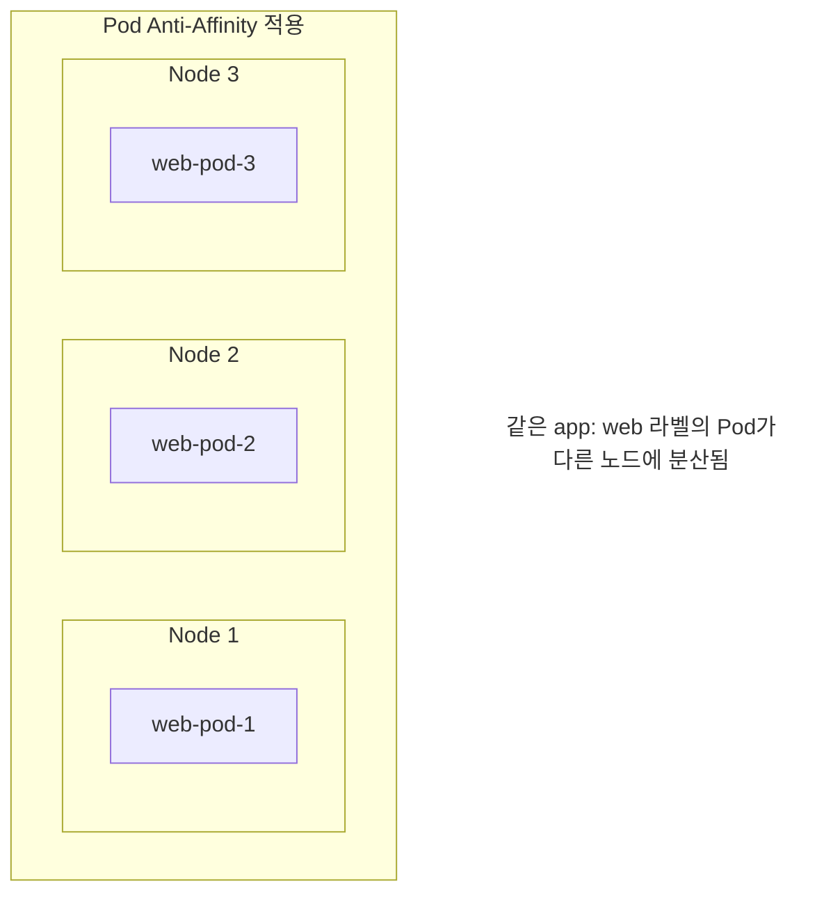

### 7.4 Taints and Tolerations

**노드가 특정 Pod를 거부**하는 메커니즘이다.

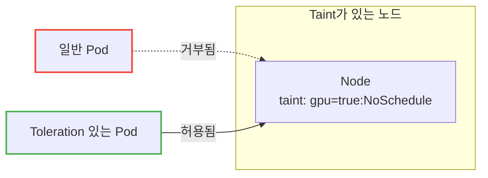

**노드에 Taint 추가:**

```bash
# GPU 노드에 일반 Pod 배치 방지
kubectl taint nodes gpu-node-1 gpu=true:NoSchedule
```

**Pod에 Toleration 추가:**

```yaml
spec:
  tolerations:
  - key: "gpu"
    operator: "Equal"
    value: "true"
    effect: "NoSchedule"
```

**Taint Effect:**

| Effect | 의미 |
|--------|------|
| `NoSchedule` | 새 Pod 스케줄링 안 됨 |
| `PreferNoSchedule` | 가능하면 스케줄링 안 함 (soft) |
| `NoExecute` | 새 Pod도 안 되고, 기존 Pod도 퇴거 |

**실무 활용 사례:**

| 시나리오 | Taint | Toleration 대상 |
|----------|-------|----------------|
| GPU 노드 전용 | `nvidia.com/gpu=true:NoSchedule` | GPU 워크로드만 |
| 스팟 인스턴스 | `cloud.google.com/preemptible=true:NoSchedule` | 비용 최적화 워크로드 |
| 마스터 노드 보호 | `node-role.kubernetes.io/master:NoSchedule` | 시스템 Pod만 |

---

## 8. 실무 트러블슈팅

### 8.1 자주 발생하는 문제와 해결

**문제 1: ImagePullBackOff**

```bash
kubectl describe pod my-app
# Events:
#   Failed to pull image "my-registry/app:v1":
#   rpc error: unauthorized
```

| 원인 | 해결 |
|------|------|
| 이미지 이름/태그 오타 | 정확한 이미지 경로 확인 |
| Private registry 인증 | imagePullSecrets 설정 |
| 네트워크 문제 | 노드에서 registry 접근 가능한지 확인 |

```yaml
spec:
  imagePullSecrets:
  - name: my-registry-secret
```

**문제 2: CrashLoopBackOff**

```bash
# 이전 컨테이너의 로그 확인
kubectl logs my-app --previous

# 컨테이너 직접 접속 (디버깅)
kubectl exec -it my-app -- /bin/sh
```

| 원인 | 해결 |
|------|------|
| 앱 시작 실패 | 로그 확인, 환경변수/설정 검증 |
| OOMKilled | Memory limit 증가 |
| Liveness Probe 실패 | Probe 설정 조정 |

**문제 3: Pending 상태 지속**

```bash
kubectl describe pod my-app
# Events:
#   0/3 nodes are available: 3 Insufficient cpu
```

| 원인 | 해결 |
|------|------|
| 리소스 부족 | 노드 추가, requests 줄이기 |
| nodeSelector 불일치 | 노드 라벨 확인 |
| Taint/Toleration | Toleration 추가 |
| PVC 바인딩 실패 | PV 생성, StorageClass 확인 |

### 8.2 디버깅 명령어 모음

```bash
# Pod 상태 확인
kubectl get pod my-app -o wide

# 상세 정보 (Events 포함)
kubectl describe pod my-app

# 로그 확인
kubectl logs my-app                    # 현재 로그
kubectl logs my-app --previous         # 이전 컨테이너 로그
kubectl logs my-app -c sidecar         # 특정 컨테이너 로그
kubectl logs my-app --tail=100         # 마지막 100줄
kubectl logs my-app -f                 # 실시간 스트리밍

# 컨테이너 접속
kubectl exec -it my-app -- /bin/sh
kubectl exec -it my-app -c sidecar -- /bin/sh

# 리소스 사용량 확인
kubectl top pod my-app                 # metrics-server 필요

# YAML 출력 (현재 상태)
kubectl get pod my-app -o yaml
```

---

## 9. Pod를 직접 만들면 안 되는 이유

여기까지 읽으면 "그럼 Pod YAML 작성해서 배포하면 되겠네?"라고 생각할 수 있다.

**하지만 실무에서 Pod를 직접 만드는 경우는 거의 없다.**

| 상황 | Pod 직접 생성 | Deployment 사용 |
|------|--------------|-----------------|
| Pod가 죽음 | 그냥 사라짐 | 자동으로 새 Pod 생성 |
| 스케일 아웃 | 수동으로 여러 개 생성 | `replicas: 5`로 끝 |
| 롤링 업데이트 | 불가능 | 자동 지원 |
| 롤백 | 불가능 | `kubectl rollout undo` |

Pod는 **일회용**이다. 죽으면 같은 Pod가 다시 살아나는 게 아니라, 새로운 Pod가 생성된다. 그래서 Pod를 관리해주는 상위 오브젝트(Deployment, StatefulSet 등)를 사용한다.

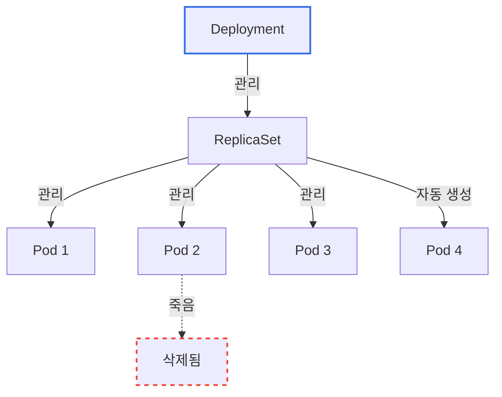

> 📖 ReplicaSet과 Deployment가 Pod를 어떻게 관리하는지는 [Kubernetes ReplicaSet & Deployment](./Kubernetes-ReplicaSet-Deployment.md) 문서를 참고하라.

---

## 10. 정리

### Pod가 존재하는 이유

| 이유 | 설명 |
|------|------|
| **컨테이너 그룹핑** | 밀접하게 결합된 컨테이너를 하나의 단위로 |
| **네트워크 공유** | 같은 IP, localhost 통신 |
| **스토리지 공유** | 볼륨을 통한 파일 공유 |
| **함께 스케줄링** | 항상 같은 노드에 배치 |

### 멀티컨테이너 패턴 요약

| 패턴 | 목적 | 예시 |
|------|------|------|
| **Init Container** | 메인 앱 전에 준비 작업 | DB 대기, 설정 다운로드 |
| **Sidecar** | 보조 기능 제공 | 로그 수집, 프록시 |
| **Native Sidecar** (1.29+) | 시작/종료 순서 보장 | 로그 유실 방지 |

### Resource Management 핵심

| 개념 | 요약 |
|------|------|
| **requests** | 스케줄링 기준, "최소 필요량" |
| **limits** | 최대 사용량, CPU는 throttling, Memory는 OOMKilled |
| **QoS Class** | Guaranteed > Burstable > BestEffort (퇴거 우선순위) |

### Scheduling 핵심

| 방법 | 사용 시점 |
|------|----------|
| **nodeSelector** | 간단한 노드 선택 |
| **Node Affinity** | 복잡한 조건의 노드 선택 |
| **Pod Affinity** | 다른 Pod와 같이/떨어져 배치 |
| **Taints/Tolerations** | 노드가 Pod를 거부 |

### 기억할 것

> **Pod는 직접 만들지 말고, Deployment를 통해 만들어라.**
> Pod는 cattle(가축)이지 pet(애완동물)이 아니다.

---

## 출처

- [Kubernetes 공식 문서 - Pods](https://kubernetes.io/docs/concepts/workloads/pods/)
- [Kubernetes 공식 문서 - Pod Lifecycle](https://kubernetes.io/docs/concepts/workloads/pods/pod-lifecycle/)
- [Kubernetes 공식 문서 - Init Containers](https://kubernetes.io/docs/concepts/workloads/pods/init-containers/)
- [Kubernetes 공식 문서 - Sidecar Containers](https://kubernetes.io/docs/concepts/workloads/pods/sidecar-containers/)
- [Kubernetes 공식 문서 - Resource Management](https://kubernetes.io/docs/concepts/configuration/manage-resources-containers/)
- [Kubernetes 공식 문서 - Pod QoS](https://kubernetes.io/docs/concepts/workloads/pods/pod-qos/)
- [Kubernetes 공식 문서 - Assigning Pods to Nodes](https://kubernetes.io/docs/concepts/scheduling-eviction/assign-pod-node/)
