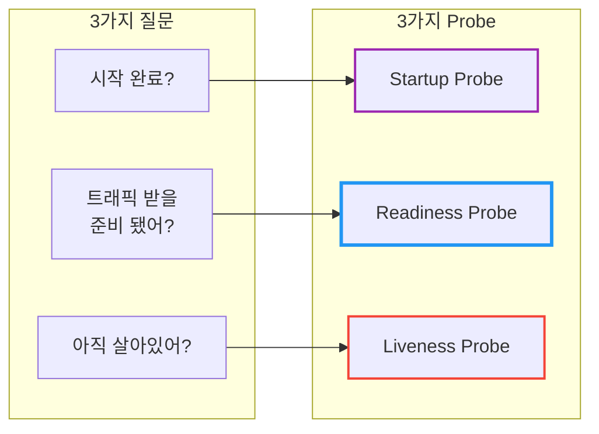
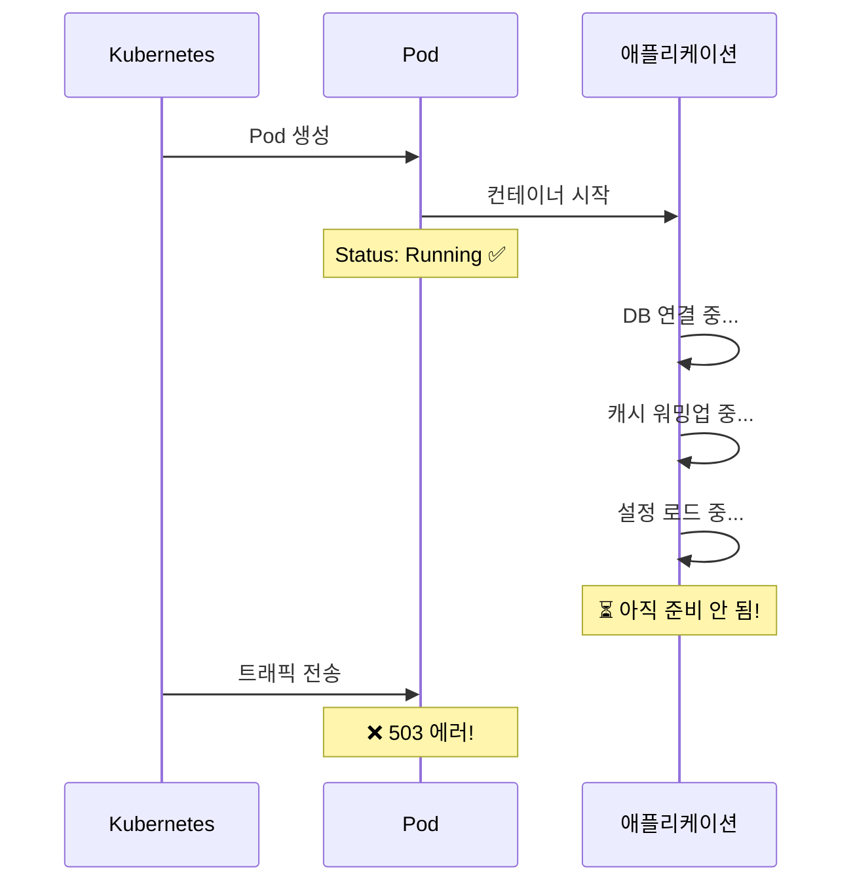
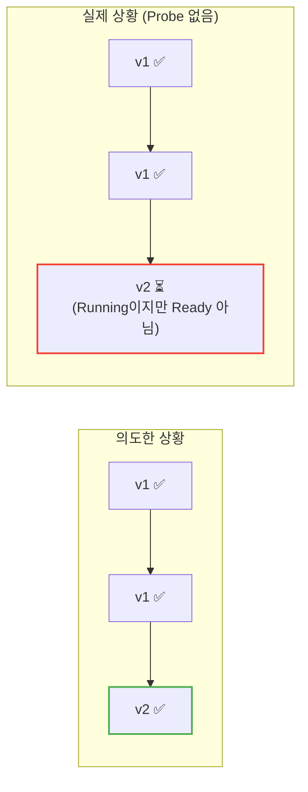
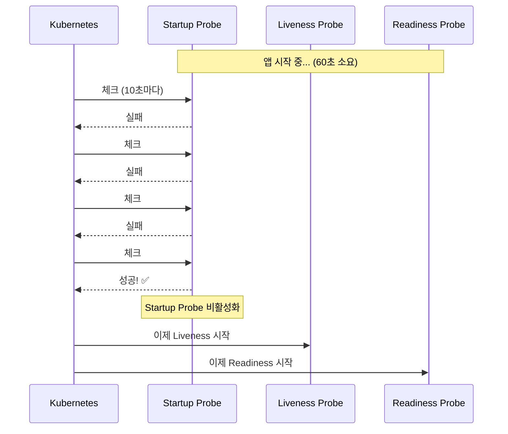
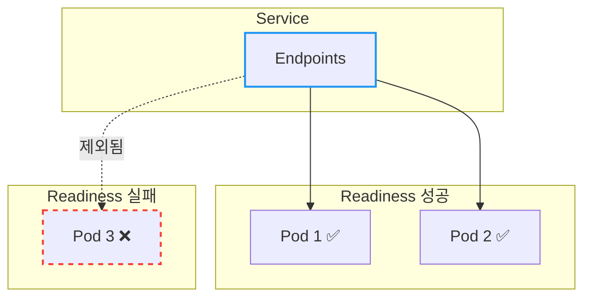
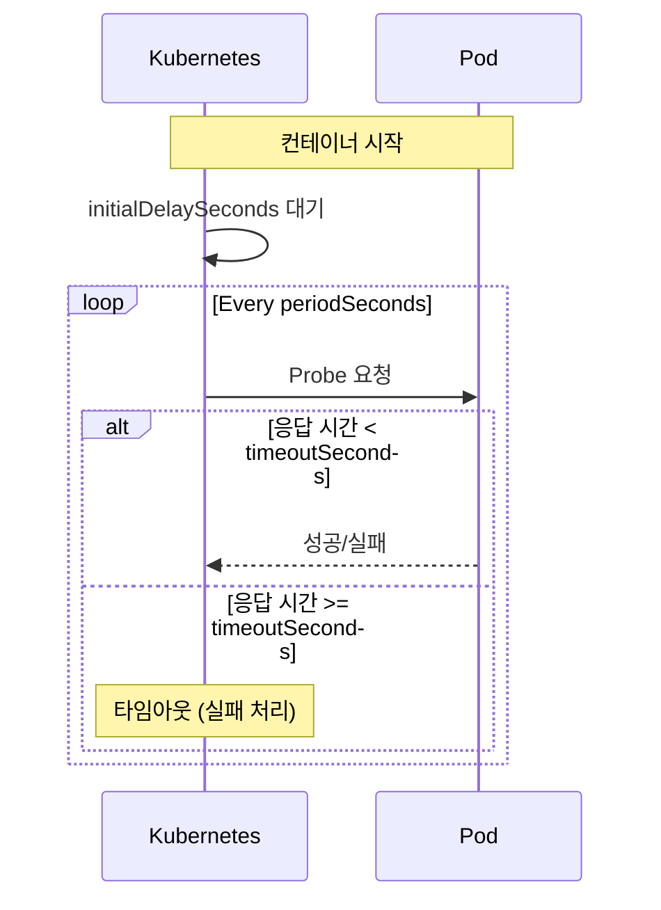
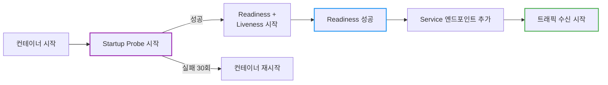
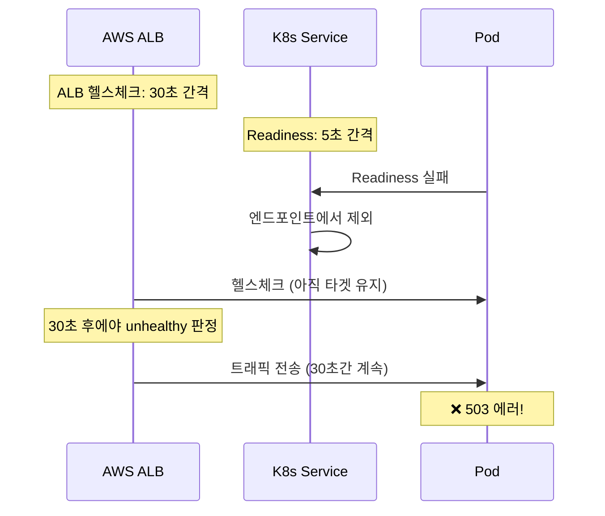
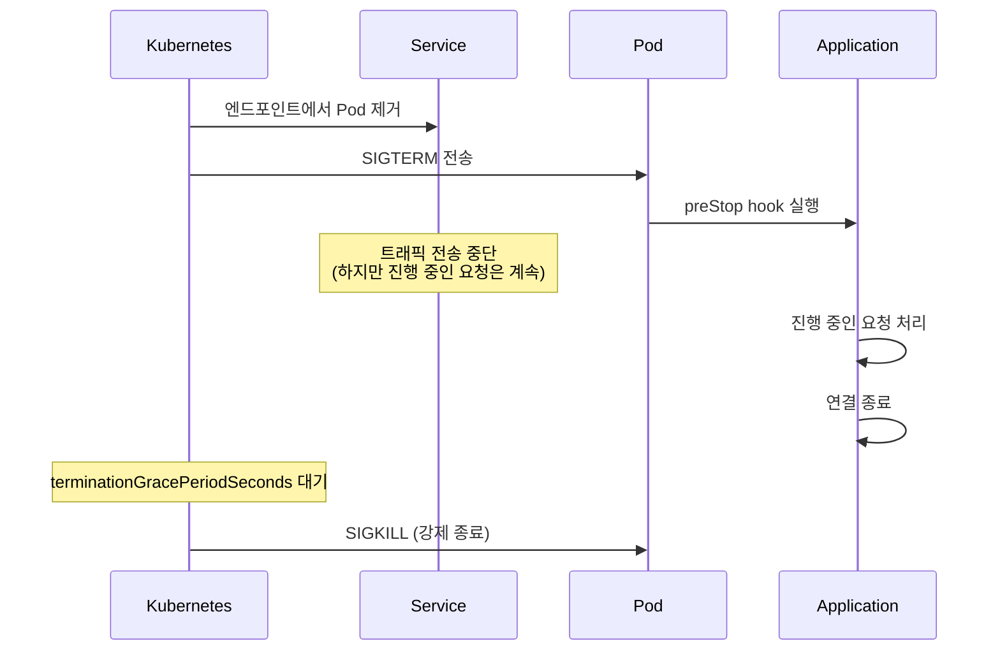
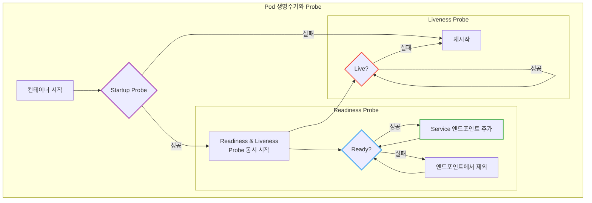

# Kubernetes Probe: Liveness, Readiness, Startup

Pod가 `Running` 상태라고 해서 진짜 "정상"인 걸까?

## 결론부터 말하면

**Kubernetes는 3가지 Probe**로 Pod의 건강 상태를 확인한다. 각 Probe는 서로 다른 질문에 답한다.



| Probe | 질문 | 실패 시 동작 | 필수 여부 |
|-------|------|-------------|----------|
| **Startup** | 앱 시작 완료됐어? | 컨테이너 재시작 | 선택 (느린 앱용) |
| **Readiness** | 트래픽 받을 준비 됐어? | Service에서 제외 | **강력 권장** |
| **Liveness** | 아직 살아있어? | 컨테이너 재시작 | 권장 |

---

## 1. 왜 Probe가 필요한가?

### 1.1 Running ≠ Ready

Pod의 상태가 `Running`이라는 건 "컨테이너가 시작됐다"는 의미일 뿐이다. 애플리케이션이 실제로 요청을 처리할 준비가 됐는지는 별개의 문제다.



**실제 사례:**
- Spring Boot 앱이 시작되는 데 30초 걸림
- 컨테이너는 1초 만에 `Running` 상태
- 29초 동안 들어오는 요청은 모두 실패

### 1.2 Probe 없이 배포하면 생기는 일

Deployment의 롤링 업데이트를 다시 생각해보자. `maxUnavailable: 0`으로 설정했다면 "항상 N개의 Pod가 실행 중"이어야 한다.

```
v1 Pod 3개 → v2 Pod 1개 생성 → v1 Pod 1개 삭제 → ...
```

**문제:** v2 Pod가 `Running` 상태가 되자마자 v1 Pod를 삭제한다. 하지만 v2 앱은 아직 초기화 중이다!



결과: "**무중단 배포**"가 아니라 "**중단 배포**"가 된다.

### 1.3 Probe가 없으면 어떻게 되나?

Kubernetes는 **Probe가 설정되지 않으면 항상 성공으로 간주**한다. 이게 왜 위험한지 보자:

| Probe | 미설정 시 기본 동작 | 결과 |
|-------|-------------------|------|
| **Liveness** | 항상 "살아있음" 취급 | 데드락/무한루프에 빠져도 **재시작 안 함** |
| **Readiness** | 항상 "준비됨" 취급 | 초기화 중에도 **트래픽 받음** → 에러 |
| **Startup** | Liveness/Readiness 바로 시작 | 느린 앱은 **시작 전에 재시작**될 수 있음 |

> **중요:** Probe를 설정하지 않으면 Kubernetes는 컨테이너가 정상이라고 "믿어버린다". 컨테이너가 응답 불가 상태가 되어도 트래픽을 계속 보내고, 재시작도 하지 않는다.

---

## 2. Startup Probe: 시작 완료 확인

### 2.1 왜 필요한가?

일부 애플리케이션은 시작하는 데 오래 걸린다. Java/Spring 앱은 수십 초가 걸리기도 하고, 레거시 앱은 몇 분이 걸리기도 한다.

**문제 상황:**
- Liveness Probe가 10초마다 체크
- 앱 시작에 60초 필요
- → Liveness Probe가 6번 실패 → 컨테이너 재시작 → 무한 루프!

**해결:** Startup Probe가 성공할 때까지 Liveness/Readiness Probe를 비활성화한다.



### 2.2 설정 예시

```yaml
spec:
  containers:
  - name: app
    image: my-app:1.0
    startupProbe:
      httpGet:
        path: /healthz
        port: 8080
      failureThreshold: 30     # 최대 30번 실패 허용
      periodSeconds: 10        # 10초마다 체크
      # → 최대 300초(5분) 동안 시작 대기
```

| 파라미터 | 설명 |
|----------|------|
| `failureThreshold` | 연속 실패 허용 횟수 |
| `periodSeconds` | 체크 간격 |
| **최대 대기 시간** | failureThreshold × periodSeconds |

---

## 3. Readiness Probe: 트래픽 수신 준비 확인

### 3.1 가장 중요한 Probe

**Readiness Probe는 무중단 배포의 핵심이다.** 이 Probe가 성공해야만 Pod가 Service의 엔드포인트에 추가되어 트래픽을 받는다.



### 3.2 Readiness vs Liveness 차이

이 둘은 자주 헷갈린다. 핵심 차이:

| 구분 | Readiness Probe | Liveness Probe |
|------|-----------------|----------------|
| 질문 | "트래픽 받을 수 있어?" | "아직 살아있어?" |
| 실패 시 | Service에서 **제외** | 컨테이너 **재시작** |
| 복구 가능성 | 일시적 문제도 OK | 복구 불가능한 문제 |

**예시 상황:**
- DB 연결이 일시적으로 끊김
  - Readiness 실패 → 트래픽 차단 (재시작 불필요)
  - 연결 복구되면 → Readiness 성공 → 트래픽 재개

- 앱이 데드락에 빠짐
  - Liveness 실패 → 컨테이너 재시작 (복구 불가능)

### 3.3 설정 예시

```yaml
spec:
  containers:
  - name: app
    image: my-app:1.0
    readinessProbe:
      httpGet:
        path: /ready          # 준비 상태 확인 엔드포인트
        port: 8080
      initialDelaySeconds: 5  # 컨테이너 시작 후 5초 뒤 첫 체크
      periodSeconds: 5        # 5초마다 체크
      successThreshold: 1     # 1번 성공하면 Ready
      failureThreshold: 3     # 3번 연속 실패하면 Not Ready
```

### 3.4 Spring Boot Actuator 예시

Spring Boot는 `/actuator/health` 엔드포인트를 기본 제공한다:

```yaml
readinessProbe:
  httpGet:
    path: /actuator/health/readiness
    port: 8080
  initialDelaySeconds: 10
  periodSeconds: 5
```

---

## 4. Liveness Probe: 생존 확인

### 4.1 언제 필요한가?

애플리케이션이 **복구 불가능한 상태**에 빠졌을 때 자동으로 재시작하기 위해 사용한다.

**Liveness Probe가 필요한 상황:**
- 데드락 (요청은 받지만 응답 못 함)
- 무한 루프
- 메모리 누수로 인한 OOM 직전 상태
- 외부 의존성 영구 실패

### 4.2 주의: Liveness를 너무 민감하게 설정하지 마라

Liveness Probe 실패 → 컨테이너 재시작 → 앱 초기화 → 다시 Liveness 체크

**위험한 설정:**
```yaml
# ❌ Bad: 너무 민감함
livenessProbe:
  httpGet:
    path: /healthz
    port: 8080
  periodSeconds: 1        # 1초마다 체크 (너무 잦음)
  failureThreshold: 1     # 1번만 실패해도 재시작 (너무 민감)
  timeoutSeconds: 1       # 1초 안에 응답해야 함 (너무 짧음)
```

이 설정은 네트워크 지연이나 일시적인 부하만으로도 컨테이너가 계속 재시작되는 "**재시작 폭풍**"을 일으킬 수 있다.

### 4.3 권장 설정

```yaml
# ✅ Good: 적절한 여유
livenessProbe:
  httpGet:
    path: /healthz
    port: 8080
  initialDelaySeconds: 30   # 앱 시작 시간 고려
  periodSeconds: 10         # 10초마다 체크
  failureThreshold: 3       # 3번 연속 실패해야 재시작
  timeoutSeconds: 5         # 5초 타임아웃
```

---

## 5. Probe 설정 방법 3가지

Kubernetes는 3가지 방식으로 Probe를 수행할 수 있다.

### 5.1 HTTP GET

가장 일반적인 방식. 지정된 경로로 HTTP GET 요청을 보내고, 2xx/3xx 응답이면 성공.

```yaml
readinessProbe:
  httpGet:
    path: /healthz
    port: 8080
    httpHeaders:            # 선택: 커스텀 헤더
    - name: Custom-Header
      value: MyValue
```

### 5.2 TCP Socket

포트가 열려있는지만 확인. 데이터베이스, Redis 등 HTTP를 지원하지 않는 서비스에 적합.

```yaml
readinessProbe:
  tcpSocket:
    port: 3306              # MySQL 포트
```

### 5.3 Exec (명령어 실행)

컨테이너 내부에서 명령어를 실행하고, exit code 0이면 성공.

```yaml
livenessProbe:
  exec:
    command:
    - cat
    - /tmp/healthy          # 파일이 존재하면 성공
```

| 방식 | 장점 | 단점 | 사용 예 |
|------|------|------|---------|
| HTTP GET | 정교한 상태 확인 가능 | HTTP 엔드포인트 필요 | 웹 애플리케이션 |
| TCP Socket | 간단, 빠름 | 연결 가능 여부만 확인 | DB, Redis, Kafka |
| Exec | 유연함 | 오버헤드 큼 | 레거시 앱, 특수 케이스 |
| gRPC | gRPC 표준, 세밀한 상태 | gRPC 서버 필요 | gRPC 마이크로서비스 |

> **⚠️ Exec Probe 주의:** 매 체크마다 컨테이너 내부에서 **프로세스를 fork** 해야 하므로 HTTP/TCP보다 리소스 소모가 크다. `periodSeconds`를 너무 짧게(1-2초) 설정하면 노드 부하가 높아질 수 있다. 가능하면 HTTP 또는 TCP 방식을 권장한다.

### 5.4 gRPC (Kubernetes 1.27+ Stable)

gRPC 서비스는 HTTP 프록시를 두지 않고 네이티브하게 헬스체크할 수 있다. [gRPC Health Checking Protocol](https://github.com/grpc/grpc/blob/master/doc/health-checking.md)을 구현한 서비스에서 사용한다.

```yaml
readinessProbe:
  grpc:
    port: 50051
    service: my-service    # 선택: 특정 서비스만 체크 (기본: 전체)
```

**gRPC Probe의 동작:**
- gRPC 서버의 `grpc.health.v1.Health/Check` RPC를 호출
- 응답이 `SERVING`이면 성공, 그 외는 실패
- `service` 필드를 지정하면 해당 서비스만 체크, 생략하면 서버 전체 상태 체크

**gRPC 서버 측 구현 예시 (Go):**

```go
import "google.golang.org/grpc/health/grpc_health_v1"

// 헬스 서버 등록
healthServer := health.NewServer()
grpc_health_v1.RegisterHealthServer(grpcServer, healthServer)

// 서비스별 상태 설정
healthServer.SetServingStatus("my-service", grpc_health_v1.HealthCheckResponse_SERVING)
```

> **언제 gRPC Probe를 쓸까?**
> - gRPC 마이크로서비스 아키텍처
> - HTTP 엔드포인트를 별도로 노출하고 싶지 않을 때
> - 서비스별 세밀한 헬스체크가 필요할 때

### 5.5 Named Port 사용

포트 번호 대신 이름으로 참조하면 유지보수가 쉬워진다.

```yaml
spec:
  containers:
  - name: app
    ports:
    - name: http           # 포트에 이름 부여
      containerPort: 8080
    - name: grpc
      containerPort: 50051

    readinessProbe:
      httpGet:
        path: /ready
        port: http         # 숫자 대신 이름 사용

    livenessProbe:
      grpc:
        port: grpc         # gRPC 포트도 이름으로
```

**Named Port의 장점:**
- 포트 번호가 바뀌어도 Probe 설정을 수정할 필요 없음
- 설정의 의도가 명확해짐 (`8080`보다 `http`가 이해하기 쉬움)
- 여러 컨테이너가 같은 역할의 포트를 가질 때 일관된 이름 사용 가능

---

## 6. Probe 파라미터 정리

```yaml
probe:
  initialDelaySeconds: 5    # 컨테이너 시작 후 첫 체크까지 대기 시간
  periodSeconds: 10         # 체크 간격
  timeoutSeconds: 1         # 응답 타임아웃
  successThreshold: 1       # 성공으로 판정할 연속 성공 횟수
  failureThreshold: 3       # 실패로 판정할 연속 실패 횟수
```



| 파라미터 | 기본값 | 설명 |
|----------|--------|------|
| `initialDelaySeconds` | 0 | 첫 체크 전 대기 시간 |
| `periodSeconds` | 10 | 체크 간격 |
| `timeoutSeconds` | 1 | 응답 타임아웃 |
| `successThreshold` | 1 | 성공 판정 기준 (Liveness/Startup은 반드시 1) |
| `failureThreshold` | 3 | 실패 판정 기준 |

> **참고:** `startupProbe`가 정의된 경우, Liveness/Readiness Probe는 `startupProbe` 성공 시점부터 `initialDelaySeconds`를 계산한다.

### 6.1 Probe별 terminationGracePeriodSeconds (Kubernetes 1.28+ Stable)

Liveness나 Startup Probe 실패로 컨테이너가 재시작될 때, Pod 레벨의 `terminationGracePeriodSeconds` 대신 **Probe별로 다른 종료 유예 시간**을 지정할 수 있다.

**왜 필요한가?**

일반적인 종료(스케일 다운, 롤링 업데이트)와 Probe 실패로 인한 종료는 상황이 다르다:
- **일반 종료:** 앱이 정상이므로 graceful shutdown에 충분한 시간(30초 등) 부여
- **Probe 실패 종료:** 앱이 이미 비정상이므로 빠르게 재시작하는 게 나음

```yaml
spec:
  terminationGracePeriodSeconds: 30   # Pod 레벨: 일반 종료 시 30초

  containers:
  - name: app
    livenessProbe:
      httpGet:
        path: /healthz
        port: 8080
      terminationGracePeriodSeconds: 5   # Probe 실패 시 5초만 대기
```

> **실무 팁:** 데드락이나 무한 루프로 Liveness가 실패한 경우, 어차피 graceful shutdown이 제대로 동작하지 않을 가능성이 높다. 이때 긴 유예 시간은 복구를 지연시킬 뿐이다.

### 6.2 HTTP Probe 고급 설정

HTTP Probe는 단순 경로와 포트 외에도 세밀한 설정이 가능하다.

```yaml
readinessProbe:
  httpGet:
    path: /ready
    port: 8080
    scheme: HTTPS                 # HTTP(기본) 또는 HTTPS
    host: 127.0.0.1               # 기본: Pod IP (보통 생략)
    httpHeaders:
    - name: Authorization         # 인증이 필요한 엔드포인트
      value: Bearer my-token
    - name: Accept
      value: application/json
```

| 필드 | 기본값 | 설명 |
|------|--------|------|
| `scheme` | HTTP | HTTP 또는 HTTPS |
| `host` | Pod IP | 요청을 보낼 호스트 |
| `httpHeaders` | - | 커스텀 HTTP 헤더 |

**주의사항:**
- `scheme: HTTPS` 사용 시, kubelet은 **인증서 검증을 하지 않는다** (self-signed OK)
- `Host` 헤더를 httpHeaders로 설정하면 `host` 필드보다 우선

---

## 7. 실전 예시: 3가지 Probe 조합

```yaml
apiVersion: apps/v1
kind: Deployment
metadata:
  name: my-app
spec:
  replicas: 3
  selector:
    matchLabels:
      app: my-app
  template:
    metadata:
      labels:
        app: my-app
    spec:
      containers:
      - name: app
        image: my-app:1.0
        ports:
        - containerPort: 8080

        # 1. Startup Probe: 앱 시작 완료 확인 (최대 5분 대기)
        startupProbe:
          httpGet:
            path: /healthz
            port: 8080
          failureThreshold: 30
          periodSeconds: 10

        # 2. Readiness Probe: 트래픽 수신 준비 확인
        readinessProbe:
          httpGet:
            path: /ready
            port: 8080
          initialDelaySeconds: 0    # Startup 성공 후 바로 시작
          periodSeconds: 5
          failureThreshold: 3

        # 3. Liveness Probe: 생존 확인
        livenessProbe:
          httpGet:
            path: /healthz
            port: 8080
          initialDelaySeconds: 0    # Startup 성공 후 바로 시작
          periodSeconds: 10
          failureThreshold: 3
```

### 왜 initialDelaySeconds: 0인가?

Startup Probe를 사용하면 Readiness/Liveness의 `initialDelaySeconds`를 `0`으로 설정하는 게 일반적이다. **Startup Probe가 성공했다는 것은 앱이 기본적인 시작 절차를 마쳤다는 신호**이기 때문에, 추가적인 대기 없이 즉시 검사를 시작해도 된다.

### 실행 순서



---

## 8. 흔한 실수와 해결책

### 8.1 Liveness와 Readiness에 같은 엔드포인트 사용

```yaml
# ⚠️ 주의: 같은 엔드포인트
livenessProbe:
  httpGet:
    path: /healthz    # DB 연결 체크 포함
readinessProbe:
  httpGet:
    path: /healthz    # 같은 엔드포인트
```

**문제:** DB가 일시적으로 끊기면?
- Liveness 실패 → 컨테이너 재시작
- 하지만 DB 문제는 재시작으로 해결 안 됨!

**해결:** 역할에 맞는 엔드포인트 분리

```yaml
# ✅ Good: 엔드포인트 분리
livenessProbe:
  httpGet:
    path: /healthz    # 앱 자체 상태만 (DB 체크 X)
readinessProbe:
  httpGet:
    path: /ready      # 외부 의존성 포함 체크
```

### 8.2 Startup Probe 없이 긴 initialDelaySeconds

```yaml
# ❌ Bad: 추측에 의존
livenessProbe:
  initialDelaySeconds: 120    # "아마 2분이면 시작하겠지?"
```

**문제:**
- 앱이 1분 만에 시작해도 2분 동안 Liveness 체크 안 함
- 앱이 3분 걸리면 Liveness 실패로 재시작

**해결:** Startup Probe 사용

```yaml
# ✅ Good: Startup Probe로 정확하게
startupProbe:
  httpGet:
    path: /healthz
    port: 8080
  failureThreshold: 30
  periodSeconds: 10         # 최대 5분 대기, 성공하면 즉시 넘어감
```

---

## 9. 실무 시나리오별 권장 설정

### 9.1 Java/Spring Boot 애플리케이션

Spring Boot는 JVM 워밍업, 빈 초기화, DB 커넥션 풀 생성 등으로 시작이 느리다. 특히 대규모 애플리케이션은 1-2분 걸리기도 한다.

```yaml
spec:
  containers:
  - name: spring-app
    image: my-spring-app:1.0
    ports:
    - name: http
      containerPort: 8080

    # Spring Boot Actuator 엔드포인트 활용
    startupProbe:
      httpGet:
        path: /actuator/health/liveness
        port: http
      failureThreshold: 30
      periodSeconds: 10           # 최대 5분 대기

    readinessProbe:
      httpGet:
        path: /actuator/health/readiness
        port: http
      periodSeconds: 10
      failureThreshold: 3

    livenessProbe:
      httpGet:
        path: /actuator/health/liveness
        port: http
      periodSeconds: 15
      failureThreshold: 3
      timeoutSeconds: 5           # GC pause 고려
```

> **⚠️ timeoutSeconds 주의:** 기본값 1초는 Java 앱에서 위험하다. JVM의 **Full GC는 수백ms~수초** 걸릴 수 있어, GC 중에 Probe 응답이 늦어지면 실패로 처리된다. Liveness 실패 → 재시작 → GC 다시 발생 → 재시작 무한 반복이 될 수 있으므로, **2-5초**로 넉넉하게 설정하라.

**Spring Boot 설정 (application.yml):**

```yaml
management:
  endpoint:
    health:
      probes:
        enabled: true             # /actuator/health/liveness, /readiness 활성화
      group:
        readiness:
          include: db, redis      # Readiness에만 외부 의존성 포함
        liveness:
          include: ping           # Liveness는 앱 자체만
```

> **왜 Readiness와 Liveness를 분리하나?** DB가 일시적으로 끊기면 Readiness만 실패하여 트래픽을 차단한다. Liveness까지 실패하면 불필요한 재시작이 발생하고, 재시작해도 DB 문제는 해결되지 않는다.

### 9.2 Node.js 애플리케이션

Node.js는 시작이 빠르지만, 외부 서비스 연결이나 캐시 프리로드가 필요할 수 있다.

```yaml
spec:
  containers:
  - name: node-app
    image: my-node-app:1.0

    startupProbe:
      httpGet:
        path: /health
        port: 3000
      failureThreshold: 10
      periodSeconds: 5            # 최대 50초 (Node.js는 빠름)

    readinessProbe:
      httpGet:
        path: /ready
        port: 3000
      periodSeconds: 5
      failureThreshold: 3

    livenessProbe:
      httpGet:
        path: /health
        port: 3000
      periodSeconds: 10
      failureThreshold: 3
```

**Node.js 헬스체크 구현 예시:**

```javascript
// /health - Liveness용 (앱 자체 상태)
app.get('/health', (req, res) => {
  res.status(200).json({ status: 'ok' });
});

// /ready - Readiness용 (외부 의존성 포함)
app.get('/ready', async (req, res) => {
  try {
    await db.ping();
    await redis.ping();
    res.status(200).json({ status: 'ready' });
  } catch (err) {
    res.status(503).json({ status: 'not ready', error: err.message });
  }
});
```

### 9.3 사이드카가 있는 Pod

Istio, Envoy 같은 사이드카 프록시가 있는 경우, 메인 앱보다 사이드카가 먼저 준비되어야 한다.

```yaml
spec:
  containers:
  - name: app
    readinessProbe:
      httpGet:
        path: /ready
        port: 8080
      initialDelaySeconds: 5      # 사이드카 준비 대기

  - name: istio-proxy
    # Istio는 자체 Probe 설정이 있음
```

> **Istio 환경 팁:** Istio 1.7+에서는 `holdApplicationUntilProxyStarts: true` 설정으로 사이드카가 준비될 때까지 앱 시작을 지연시킬 수 있다.

---

## 10. Cloud Provider 헬스체크와 Probe 연동

EKS, AKS, GKE에서 LoadBalancer나 Ingress를 사용하면, **Cloud Provider의 헬스체크**와 **Kubernetes Probe**가 별개로 동작한다. 이 둘이 동기화되지 않으면 문제가 생긴다.

### 10.1 문제 상황



Kubernetes Readiness는 5초 만에 Pod를 제외했지만, ALB는 30초 후에야 인지한다. 그 사이 트래픽 손실이 발생한다.

### 10.2 AWS EKS + ALB Ingress Controller

AWS ALB Ingress Controller는 `readinessGates`를 사용하여 이 문제를 해결한다.

```yaml
apiVersion: v1
kind: Service
metadata:
  name: my-app
  annotations:
    # ALB 헬스체크 설정
    alb.ingress.kubernetes.io/healthcheck-path: /ready
    alb.ingress.kubernetes.io/healthcheck-interval-seconds: "10"
    alb.ingress.kubernetes.io/healthcheck-timeout-seconds: "5"
    alb.ingress.kubernetes.io/healthy-threshold-count: "2"
    alb.ingress.kubernetes.io/unhealthy-threshold-count: "3"
```

**Pod Readiness Gate 활성화:**

```yaml
apiVersion: v1
kind: Namespace
metadata:
  name: my-namespace
  labels:
    elbv2.k8s.aws/pod-readiness-gate-inject: enabled  # ALB readiness gate 자동 주입
```

이렇게 하면 Pod가 Ready가 되려면:
1. Kubernetes Readiness Probe 성공 **AND**
2. ALB Target Group에서 healthy 판정

둘 다 만족해야 트래픽을 받는다.

### 10.3 GKE + NEG (Network Endpoint Groups)

GKE의 Container-native load balancing은 NEG를 통해 Pod에 직접 트래픽을 보낸다.

```yaml
apiVersion: v1
kind: Service
metadata:
  name: my-app
  annotations:
    cloud.google.com/neg: '{"ingress": true}'   # NEG 활성화
spec:
  type: ClusterIP
```

NEG 환경에서는 GCP 헬스체크가 Pod를 직접 체크하므로, **Kubernetes Probe와 동일한 경로/포트**를 사용하는 게 좋다.

### 10.4 권장 사항

| 항목 | 권장 값 | 이유 |
|------|--------|------|
| **Probe 경로** | Cloud LB와 동일하게 | 상태 판단 일관성 |
| **Probe 간격** | Cloud LB보다 짧게 | K8s가 먼저 감지 |
| **failureThreshold** | Cloud LB와 유사하게 | 동시에 제외되도록 |

---

## 11. Probe 실패 디버깅

### 11.1 증상 확인

```bash
# Pod 상태 확인
kubectl get pods -o wide

# 상세 이벤트 확인
kubectl describe pod <pod-name>
```

**describe 출력에서 확인할 것:**

```
Events:
  Warning  Unhealthy  3s (x3 over 13s)  kubelet  Readiness probe failed: HTTP probe failed with statuscode: 503
  Warning  Unhealthy  2s                kubelet  Liveness probe failed: connection refused
```

### 11.2 직접 Probe 테스트

```bash
# Pod 내부에서 헬스체크 엔드포인트 테스트
kubectl exec -it <pod-name> -- curl -v http://localhost:8080/healthz

# 외부에서 포트포워딩으로 테스트
kubectl port-forward <pod-name> 8080:8080
curl http://localhost:8080/healthz
```

### 11.3 흔한 실패 원인과 해결

| 증상 | 원인 | 해결 |
|------|------|------|
| `connection refused` | 앱이 아직 리스닝 안 함 | `startupProbe` 추가 또는 `initialDelaySeconds` 증가 |
| `HTTP 503` | 앱 내부 문제 (DB 연결 등) | 앱 로그 확인, 헬스체크 로직 검토 |
| `timeout` | 응답이 너무 느림 | `timeoutSeconds` 증가 또는 헬스체크 최적화 |
| `HTTP 404` | 경로가 틀림 | `path` 확인, 앱에서 엔드포인트 노출 확인 |

### 11.4 Probe 이벤트 모니터링

```bash
# 실시간 이벤트 스트림
kubectl get events --watch --field-selector reason=Unhealthy

# 특정 Pod의 이벤트만
kubectl get events --field-selector involvedObject.name=<pod-name>
```

---

## 12. Graceful Shutdown과 Probe 연계

Pod가 종료될 때 진행 중인 요청을 안전하게 처리하려면 Probe와 종료 프로세스를 함께 고려해야 한다.

### 12.1 종료 시퀀스 이해



**문제:** 엔드포인트에서 제거되는 시점과 SIGTERM 전송 시점 사이에 **약간의 지연**이 있다. 이 사이에 새 요청이 들어올 수 있다.

### 12.2 안전한 종료 설정

```yaml
spec:
  terminationGracePeriodSeconds: 60

  containers:
  - name: app
    lifecycle:
      preStop:
        exec:
          command: ["/bin/sh", "-c", "sleep 5"]   # 엔드포인트 제거 대기

    readinessProbe:
      httpGet:
        path: /ready
        port: 8080
```

**왜 preStop에서 sleep?**

1. Pod 종료 시작
2. Service 엔드포인트에서 Pod 제거 (전파에 시간 소요)
3. `preStop` hook 실행 (`sleep 5`)
4. 5초 동안 kube-proxy, Ingress Controller 등이 라우팅 규칙 업데이트
5. 이제 새 요청이 오지 않음
6. SIGTERM → 앱 종료

### 12.3 Spring Boot Graceful Shutdown

```yaml
# application.yml
server:
  shutdown: graceful

spring:
  lifecycle:
    timeout-per-shutdown-phase: 30s
```

```yaml
# Kubernetes 설정
spec:
  terminationGracePeriodSeconds: 45   # Spring 30s + preStop 5s + 여유 10s

  containers:
  - name: spring-app
    lifecycle:
      preStop:
        exec:
          command: ["/bin/sh", "-c", "sleep 5"]
```

### 12.4 종료 시 Readiness 활용

앱이 종료 준비 중임을 Readiness로 알릴 수 있다:

```java
@Component
public class GracefulShutdown implements ApplicationListener<ContextClosedEvent> {
    private final AtomicBoolean shuttingDown = new AtomicBoolean(false);

    @Override
    public void onApplicationEvent(ContextClosedEvent event) {
        shuttingDown.set(true);
    }

    // Readiness 엔드포인트에서 사용
    public boolean isReady() {
        return !shuttingDown.get();
    }
}
```

이렇게 하면 앱이 종료 시작 시 Readiness가 실패하여, Service 엔드포인트에서 더 빨리 제거된다.

---

## 13. 정리



| 질문 | Probe | 실패 시 |
|------|-------|---------|
| 앱이 시작됐어? | **Startup** | 재시작 |
| 트래픽 받아도 돼? | **Readiness** | 트래픽 차단 |
| 아직 살아있어? | **Liveness** | 재시작 |

**핵심 기억:**
1. `Running` ≠ `Ready` → **Readiness Probe 필수**
2. 시작이 오래 걸리는 앱 → **Startup Probe 사용**
3. Liveness는 "복구 불가능한 상태" 감지용 → **너무 민감하게 설정하지 마라**
4. Liveness와 Readiness는 **다른 목적** → 엔드포인트 분리 권장

---

## 출처

- [Kubernetes Documentation - Configure Liveness, Readiness and Startup Probes](https://kubernetes.io/docs/tasks/configure-pod-container/configure-liveness-readiness-startup-probes/) - 공식 문서
- [Kubernetes Documentation - Pod Lifecycle](https://kubernetes.io/docs/concepts/workloads/pods/pod-lifecycle/) - 공식 문서
- [Spring Boot Actuator - Kubernetes Probes](https://docs.spring.io/spring-boot/docs/current/reference/html/actuator.html#actuator.endpoints.kubernetes-probes) - Spring Boot 공식 문서
