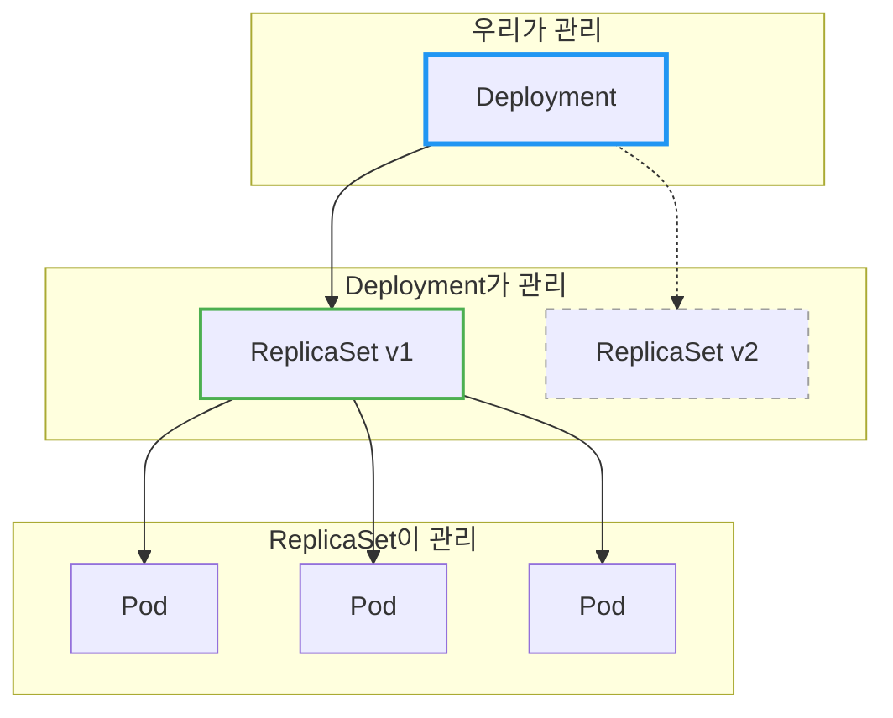
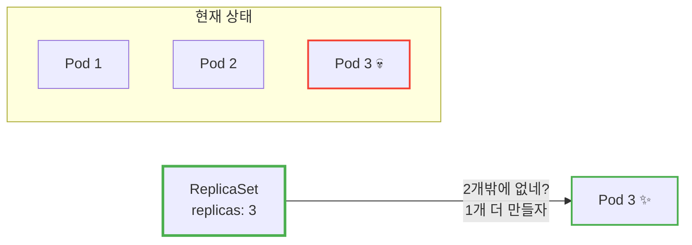
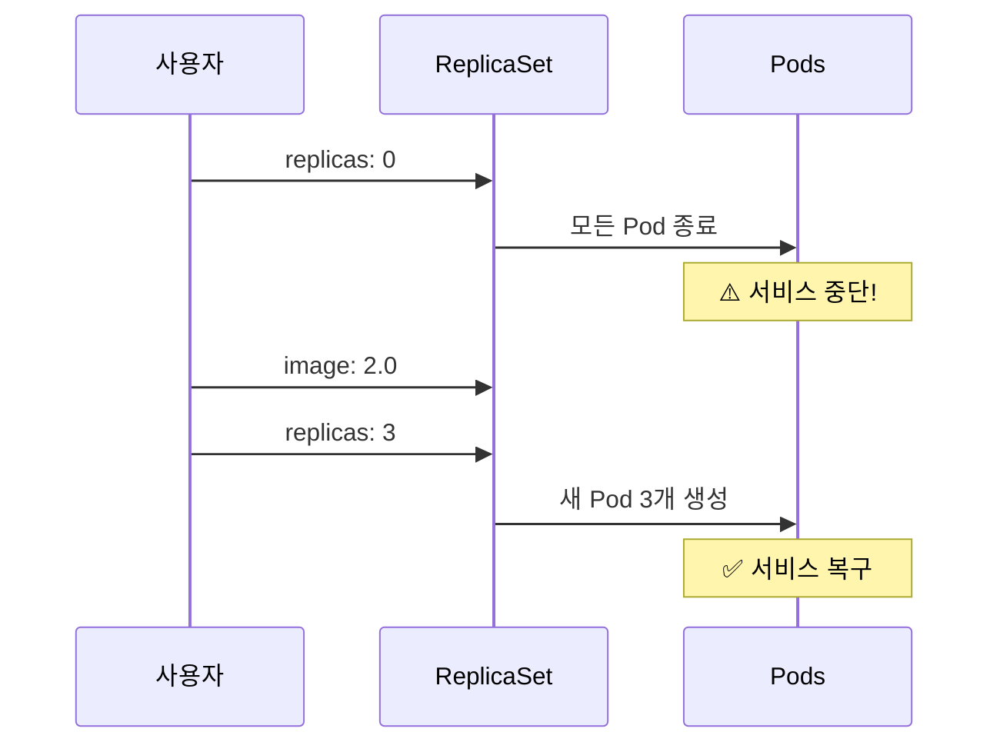
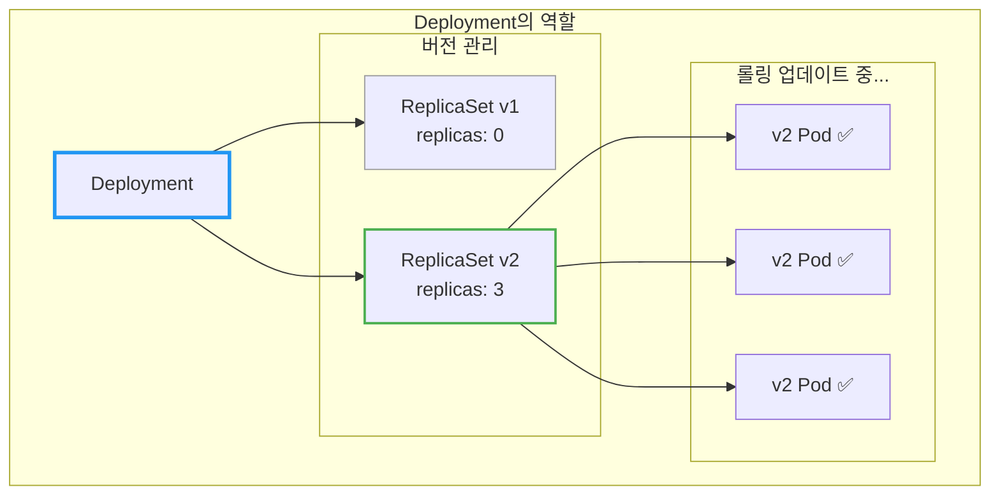
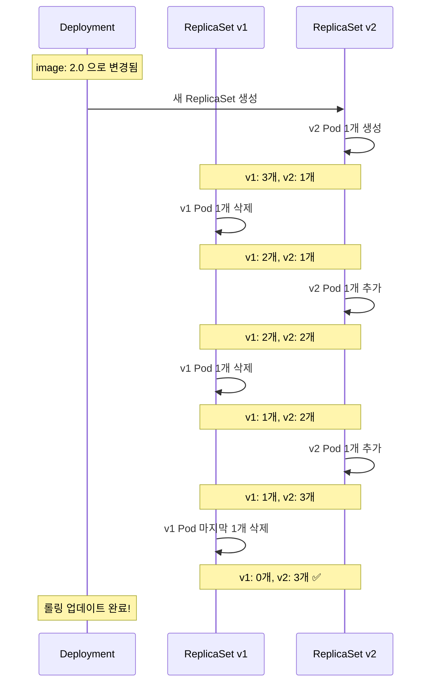
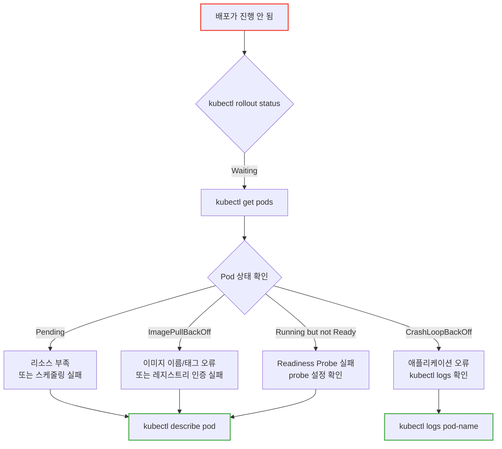
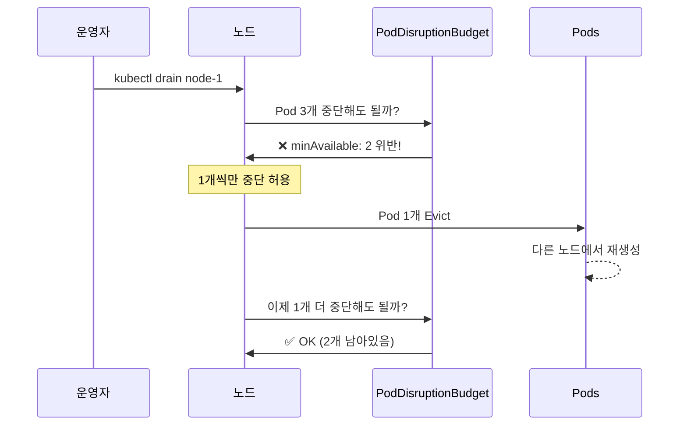
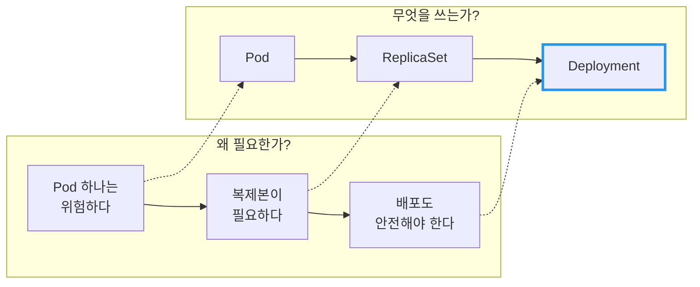

# Kubernetes ReplicaSet & Deployment

Pod 하나가 죽으면 서비스도 죽는다. 어떻게 해야 할까?

## 결론부터 말하면

**ReplicaSet**은 Pod의 복제본 개수를 유지하고, **Deployment**는 ReplicaSet을 관리하며 무중단 배포를 가능하게 한다.



| 오브젝트 | 역할 | 직접 생성? |
|----------|------|-----------|
| Pod | 컨테이너 실행 | ❌ 거의 안 함 |
| ReplicaSet | Pod 복제본 수 유지 | ❌ 거의 안 함 |
| **Deployment** | ReplicaSet 관리 + 배포 전략 | ✅ **이걸 쓴다** |

---

## 1. Pod 하나만 있으면 어떤 문제가 생길까?

### 1.1 단일 Pod의 한계

Pod 문서에서 봤듯이, Pod는 Kubernetes의 최소 배포 단위다. 하지만 Pod 하나만 띄워놓으면 심각한 문제가 있다.

```yaml
# 이렇게 Pod 하나만 만들면?
apiVersion: v1
kind: Pod
metadata:
  name: my-app
spec:
  containers:
  - name: app
    image: my-app:1.0
```

**문제 1: Pod가 죽으면 서비스도 죽는다**

Pod는 자가 복구 능력이 없다. 노드 장애, OOM(Out of Memory), 애플리케이션 크래시 등으로 Pod가 죽으면 아무도 다시 살려주지 않는다.

**문제 2: 스케일 아웃이 안 된다**

트래픽이 늘어나면? Pod를 더 만들어야 한다. 수동으로? 불가능하다.

**문제 3: 무중단 배포가 안 된다**

새 버전을 배포하려면 기존 Pod를 죽이고 새 Pod를 띄워야 한다. 그 사이에 서비스 중단이 발생한다.

### 1.2 그래서 ReplicaSet이 등장했다

Kubernetes는 이 문제를 해결하기 위해 **ReplicaSet**이라는 컨트롤러를 제공한다. ReplicaSet의 역할은 단순하고 명확하다:

> "항상 N개의 Pod가 실행되도록 보장한다."

---

## 2. ReplicaSet: Pod 복제본 관리자

### 2.1 ReplicaSet의 동작 원리

ReplicaSet은 **선언적**으로 동작한다. "3개의 Pod가 있어야 한다"고 선언하면, Kubernetes가 알아서 3개를 유지한다.



| 상황 | ReplicaSet의 행동 |
|------|------------------|
| Pod 수가 replicas보다 적음 | 새 Pod 생성 |
| Pod 수가 replicas보다 많음 | Pod 삭제 |
| Pod 수가 replicas와 같음 | 아무것도 안 함 |

### 2.2 ReplicaSet YAML 예시

```yaml
apiVersion: apps/v1
kind: ReplicaSet
metadata:
  name: my-app-rs
spec:
  replicas: 3                    # 항상 3개 유지
  selector:
    matchLabels:
      app: my-app                # 이 라벨을 가진 Pod를 관리
  template:                      # Pod 템플릿
    metadata:
      labels:
        app: my-app              # selector와 일치해야 함
    spec:
      containers:
      - name: app
        image: my-app:1.0
```

핵심 필드를 보자:

| 필드 | 설명 |
|------|------|
| `replicas` | 유지할 Pod 개수 |
| `selector` | 관리할 Pod를 찾는 조건 (라벨 기반) |
| `template` | 새 Pod를 만들 때 사용할 템플릿 |

### 2.3 그런데... ReplicaSet을 직접 쓰면 안 된다?

여기서 의문이 생긴다. ReplicaSet이 Pod 복제본을 관리해준다면, 이걸 그냥 쓰면 되는 거 아닌가?

**Kubernetes 공식 문서의 답변:**

> "We recommend using Deployments instead of directly using ReplicaSets."
> — [Kubernetes Documentation](https://kubernetes.io/docs/concepts/workloads/controllers/replicaset/)

왜일까? ReplicaSet에는 치명적인 한계가 있다.

---

## 3. ReplicaSet의 한계: 배포가 안 된다

### 3.1 이미지 버전을 바꾸면 어떻게 될까?

ReplicaSet의 `template.spec.containers[0].image`를 `my-app:1.0`에서 `my-app:2.0`으로 바꿨다고 가정해보자.

```yaml
spec:
  template:
    spec:
      containers:
      - name: app
        image: my-app:2.0    # 1.0 → 2.0 으로 변경
```

**결과: 아무 일도 일어나지 않는다.**

왜? ReplicaSet은 **Pod 수**만 관리하기 때문이다. 이미 3개의 Pod가 있으니 "할 일 없음"이다. 기존 Pod들은 여전히 `my-app:1.0`을 실행하고 있다.

### 3.2 새 버전을 배포하려면?

ReplicaSet만으로 새 버전을 배포하려면 이런 수동 작업이 필요하다:

1. 기존 ReplicaSet의 `replicas`를 0으로 줄인다 → 모든 Pod 종료
2. 이미지 버전을 변경한다
3. `replicas`를 다시 3으로 올린다 → 새 Pod 생성

**문제:** 1번과 3번 사이에 서비스 중단이 발생한다.



이건 프로덕션에서 용납될 수 없다. 그래서 **Deployment**가 필요하다.

---

## 4. Deployment: 무중단 배포의 핵심

### 4.1 Deployment가 하는 일

Deployment는 ReplicaSet 위에서 동작하는 상위 컨트롤러다. ReplicaSet이 "Pod 수 유지"를 담당한다면, Deployment는 "안전한 배포"를 담당한다.



Deployment의 핵심 기능:

| 기능 | 설명 |
|------|------|
| **롤링 업데이트** | 새 버전을 점진적으로 배포 (무중단) |
| **롤백** | 문제 발생 시 이전 버전으로 복구 |
| **배포 전략** | RollingUpdate, Recreate 선택 가능 |
| **히스토리 관리** | 이전 ReplicaSet을 보관하여 롤백 가능 |

### 4.2 Deployment YAML 예시

```yaml
apiVersion: apps/v1
kind: Deployment
metadata:
  name: my-app
spec:
  replicas: 3
  selector:
    matchLabels:
      app: my-app
  strategy:
    type: RollingUpdate
    rollingUpdate:
      maxSurge: 1        # 업데이트 중 추가 생성 가능한 Pod 수
      maxUnavailable: 0  # 업데이트 중 중단 가능한 Pod 수 (0 = 항상 3개 유지)
  template:
    metadata:
      labels:
        app: my-app
    spec:
      containers:
      - name: app
        image: my-app:1.0
```

ReplicaSet과 거의 똑같아 보인다. 핵심 차이는 `strategy` 필드다.

| 필드 | 설명 |
|------|------|
| `strategy.type` | `RollingUpdate` (기본값) 또는 `Recreate` |
| `maxSurge` | 업데이트 중 초과 생성 가능한 Pod 수 (기본값: 25%) |
| `maxUnavailable` | 업데이트 중 줄어들 수 있는 Pod 수 (기본값: 25%) |

> **참고:** `maxSurge`와 `maxUnavailable`은 **백분율**(예: `25%`) 또는 **절대값**(예: `1`) 모두 사용 가능하다.

---

## 5. 롤링 업데이트: 무중단 배포의 비밀

### 5.1 롤링 업데이트 과정

이미지를 `my-app:2.0`으로 변경하면 어떻게 될까?

```bash
# 명령형 방식 (빠른 테스트용)
kubectl set image deployment/my-app app=my-app:2.0

# 선언적 방식 (GitOps, 운영 환경 권장)
# YAML 파일의 image를 수정한 후:
kubectl apply -f deployment.yaml
```

Deployment는 다음 과정을 **자동으로** 수행한다:



전체 과정에서 **최소 3개의 Pod가 항상 실행 중**이다. 서비스 중단이 없다!

### 5.2 maxSurge와 maxUnavailable 이해하기

이 두 값이 롤링 업데이트의 "속도"와 "안정성"을 결정한다.

| 설정 | 의미 | 트레이드오프 |
|------|------|-------------|
| `maxSurge: 25%` | 전체 수의 25%만큼 추가 Pod 허용 | 리소스 ↑, 속도 ↑ |
| `maxUnavailable: 25%` | 전체 수의 25%만큼 줄어도 됨 | 리소스 ↓, 속도 ↑ |
| `maxSurge: 1, maxUnavailable: 0` | 항상 N개 이상 유지 | 가장 안전, 가장 느림 |

**예시: replicas=4, maxSurge=1, maxUnavailable=1**

```
초기 상태:    v1, v1, v1, v1           (총 4개)

롤링 업데이트 과정:
1. v2 생성 (surge):    v1, v1, v1, v1, v2    (총 5개 - maxSurge 적용)
2. v1 삭제:            v1, v1, v1, v2        (총 4개 - maxUnavailable 적용)
3. v2 생성 (surge):    v1, v1, v1, v2, v2    (총 5개)
4. v1 삭제:            v1, v1, v2, v2        (총 4개)
5. 반복...
6. 최종 상태:          v2, v2, v2, v2        (완료!)
```

### 5.3 잠깐, 이게 정말 "무중단"일까?

롤링 업데이트가 진행되는 동안 Pod 수는 유지된다. 하지만 **새 Pod가 생성되었다고 해서 바로 트래픽을 받을 수 있는 건 아니다.**

애플리케이션이 시작되는 데 10초가 걸린다면? Pod는 `Running` 상태지만, 실제로는 아직 요청을 처리할 준비가 안 됐을 수 있다. 이 상태에서 트래픽을 보내면 에러가 발생한다.

> **이 문제를 해결하는 것이 바로 Probe다.**

Kubernetes는 3가지 Probe를 제공한다:

| Probe | 역할 | 실패 시 동작 |
|-------|------|-------------|
| **Startup Probe** | 애플리케이션 시작 완료 확인 | 컨테이너 재시작 |
| **Readiness Probe** | 트래픽 받을 준비 확인 | Service에서 제외 |
| **Liveness Probe** | 애플리케이션이 살아있는지 확인 | 컨테이너 재시작 |

특히 **Readiness Probe**가 롤링 업데이트의 핵심이다. 새 Pod가 Readiness Probe를 통과하기 전까지는 Service의 엔드포인트에 추가되지 않아 트래픽을 받지 않는다. 덕분에 "진짜 무중단"이 가능해진다.

> 📖 Probe에 대한 자세한 내용은 [Kubernetes Probe: Liveness, Readiness, Startup](./Kubernetes-Probe-Liveness-Readiness-Startup.md) 문서를 참고하라.

### 5.4 maxSurge와 maxUnavailable 실무 설정 가이드

이론은 알겠는데, 실제로 어떻게 설정해야 할까? **서비스 특성에 따라 달라진다.**

| 시나리오 | maxSurge | maxUnavailable | 이유 |
|----------|----------|----------------|------|
| **무중단 최우선** | `1` 또는 `25%` | `0` | 항상 replicas 수 이상 유지 |
| **빠른 배포 우선** | `50%` | `50%` | 리소스 여유 있고, 속도 중요 |
| **리소스 제약** | `0` | `1` | 추가 Pod 생성 불가 |
| **대규모 클러스터** | `25%` | `25%` | 균형 잡힌 기본값 |
| **replicas: 1** | `1` | `0` | 새 Pod Ready 후 기존 삭제 (무중단) |

> **주의 (replicas: 1 케이스):** `replicas: 1`에서 `maxSurge: 0, maxUnavailable: 1`로 설정하면 기존 Pod가 먼저 삭제되어 **다운타임이 발생**한다. 무중단을 원하면 반드시 `maxSurge: 1, maxUnavailable: 0`으로 설정하라.

**실무 권장 설정:**

```yaml
spec:
  strategy:
    type: RollingUpdate
    rollingUpdate:
      maxSurge: 25%        # 기본값, 대부분 적절
      maxUnavailable: 0    # 무중단 보장
```

> **주의:** `maxSurge: 0`과 `maxUnavailable: 0`을 동시에 설정하면 **배포가 진행되지 않는다.** 새 Pod를 만들 수도 없고, 기존 Pod를 삭제할 수도 없기 때문이다.

### 5.5 minReadySeconds: 배포 속도 제어

새 Pod가 Ready 상태가 된 후, 얼마나 기다렸다가 다음 단계로 넘어갈지 설정한다.

```yaml
spec:
  minReadySeconds: 10    # Ready 후 10초 대기
```

**왜 필요한가?**

애플리케이션이 Ready 상태가 되었지만, 실제로 안정화되기까지 시간이 걸릴 수 있다. 예를 들어:
- 커넥션 풀 warming
- 캐시 로딩
- JIT 컴파일 (Java)

`minReadySeconds`를 설정하면 이 기간 동안 문제가 발생해도 롤링 업데이트가 계속 진행되는 것을 막을 수 있다.

### 5.6 비례적 스케일링 (Proportional Scaling)

롤링 업데이트 도중에 replicas 수를 변경하면 어떻게 될까? Deployment는 **비례적으로** Pod를 분배한다.

**시나리오:** `replicas: 10`에서 `replicas: 15`로 스케일 아웃, 롤링 업데이트 진행 중

```
현재 상태:
- ReplicaSet v1: 7개 Pod
- ReplicaSet v2: 3개 Pod

스케일 아웃 후 (10 → 15):
- ReplicaSet v1: 10개 Pod (70% 비율 유지)
- ReplicaSet v2: 5개 Pod  (30% 비율 유지)
```

Deployment는 기존 비율을 유지하면서 Pod를 분배한다. 이렇게 하지 않으면 새 버전 Pod만 급격히 늘어나서 문제가 생길 수 있다.

---

## 6. 롤백: 문제 발생 시 되돌리기

### 6.1 Deployment는 히스토리를 보관한다

Deployment가 ReplicaSet을 관리하는 이유 중 하나가 바로 **롤백**이다. 이전 버전의 ReplicaSet을 삭제하지 않고 보관해두기 때문에, 문제가 생기면 빠르게 되돌릴 수 있다.

```bash
# 배포 히스토리 확인
kubectl rollout history deployment/my-app

# 출력 예시:
# REVISION  CHANGE-CAUSE
# 1         Initial deployment
# 2         Update to v2.0
# 3         Update to v2.1 (현재)
```

> **참고:** `CHANGE-CAUSE`는 자동으로 기록되지 않는다. 배포 시 annotation을 추가해야 한다:
> ```bash
> kubectl annotate deployment/my-app kubernetes.io/change-cause="Update to v2.0"
> ```

**선언적 방식 (GitOps 권장):**

YAML 매니페스트에 직접 annotation을 포함하면 `kubectl apply`할 때마다 자동으로 기록된다:

```yaml
apiVersion: apps/v1
kind: Deployment
metadata:
  name: my-app
  annotations:
    kubernetes.io/change-cause: "Update to v2.0 and increase memory"
spec:
  # ...
```

### 6.2 롤백 명령어

```bash
# 바로 이전 버전으로 롤백
kubectl rollout undo deployment/my-app

# 특정 버전으로 롤백
kubectl rollout undo deployment/my-app --to-revision=1
```

내부적으로 Deployment는 이전 ReplicaSet의 `replicas`를 다시 올리고, 현재 ReplicaSet의 `replicas`를 0으로 내린다. 롤링 업데이트와 동일한 방식으로 안전하게 진행된다.

### 6.3 revisionHistoryLimit: 히스토리 관리

Deployment는 이전 ReplicaSet을 보관하는데, 무한정 쌓이면 문제가 된다.

```yaml
spec:
  revisionHistoryLimit: 10    # 기본값: 10개
```

| 설정값 | 동작 |
|--------|------|
| `10` (기본값) | 최근 10개 ReplicaSet 보관 |
| `0` | 히스토리 없음, **롤백 불가** |
| 높은 값 | 많은 롤백 가능, etcd 부하 증가 |

**실무 권장:** 기본값 `10`이면 충분하다. 다만 `0`으로 설정하면 롤백이 불가능하니 주의.

### 6.4 Rollout 제어: pause와 resume

롤링 업데이트를 **중간에 멈추고 싶을 때** 사용한다. 이건 수동 Canary 배포에 활용할 수 있다.

```bash
# 1. 배포 시작 직후 일시 중지
kubectl set image deployment/my-app app=my-app:2.0
kubectl rollout pause deployment/my-app

# 2. 현재 상태 확인 (일부만 새 버전)
kubectl get pods -l app=my-app

# 3. 새 버전 Pod에 테스트 트래픽 보내서 검증
# ... 문제 없으면

# 4. 배포 재개
kubectl rollout resume deployment/my-app
```

**pause 중 변경 사항 누적:**

pause 상태에서 여러 번 변경해도 resume할 때 **한 번에 적용**된다.

```bash
kubectl rollout pause deployment/my-app
kubectl set image deployment/my-app app=my-app:2.0
kubectl set resources deployment/my-app -c=app --limits=cpu=500m
kubectl set env deployment/my-app ENV=production
kubectl rollout resume deployment/my-app    # 모든 변경이 한 번에 적용
```

이렇게 하면 불필요한 롤아웃이 여러 번 발생하는 것을 막을 수 있다.

---

## 7. Deployment 상태와 배포 실패 진단

### 7.1 Deployment의 상태 필드

`kubectl get deployment`만으로는 부족하다. **상태 조건(Conditions)** 을 확인해야 한다.

```bash
kubectl describe deployment my-app
```

출력에서 `Conditions:` 섹션을 확인하라:

```
Conditions:
  Type           Status  Reason
  ----           ------  ------
  Available      True    MinimumReplicasAvailable
  Progressing    True    NewReplicaSetAvailable
```

| Condition | 의미 |
|-----------|------|
| **Available** | 최소 요구 Pod 수가 가동 중 |
| **Progressing** | 배포가 진행 중이거나 성공적으로 완료됨 |
| **ReplicaFailure** | Pod 생성/삭제 실패 |

### 7.2 progressDeadlineSeconds: 배포 타임아웃

롤링 업데이트가 무한정 멈춰있으면 안 된다. `progressDeadlineSeconds`를 설정하면 지정 시간 내에 진행이 없을 때 **실패로 간주**한다.

```yaml
spec:
  progressDeadlineSeconds: 600    # 기본값: 600초 (10분)
```

**진행(Progress)의 정의:**
- 새 ReplicaSet의 replica 수가 증가
- 이전 ReplicaSet의 replica 수가 감소
- 새 Pod가 Ready 상태가 됨

**타임아웃 발생 시:**

```bash
kubectl rollout status deployment/my-app
# error: deployment "my-app" exceeded its progress deadline
```

Conditions에 `Progressing: False, Reason: ProgressDeadlineExceeded`가 표시된다.

> **주의:** 타임아웃이 발생해도 Deployment가 **자동으로 롤백하지 않는다.** 수동으로 `kubectl rollout undo`를 실행해야 한다. 실제 운영 환경에서는 **ArgoCD**, **Flux** 같은 GitOps 도구를 사용하여 배포 실패 시 자동 롤백을 구성할 수 있다.

### 7.3 배포 실패 원인 진단 플로우



**실무 디버깅 순서:**

```bash
# 1. 롤아웃 상태 확인
kubectl rollout status deployment/my-app

# 2. Pod 상태 확인
kubectl get pods -l app=my-app

# 3. 문제 Pod 상세 정보
kubectl describe pod <pod-name>

# 4. 로그 확인 (CrashLoopBackOff인 경우)
kubectl logs <pod-name> --previous    # 이전 컨테이너 로그
```

---

## 8. 배포 전략 비교: RollingUpdate vs Recreate

| 전략 | 동작 | 서비스 중단 | 사용 시점 |
|------|------|------------|----------|
| **RollingUpdate** | 점진적 교체 | ❌ 없음 | 대부분의 경우 (기본값) |
| **Recreate** | 모두 삭제 후 생성 | ⚠️ 있음 | DB 마이그레이션, 호환성 문제 시 |

```yaml
# Recreate 전략
spec:
  strategy:
    type: Recreate
```

**Recreate를 쓰는 경우:**
- 구버전과 신버전이 동시에 실행되면 안 되는 경우
- 데이터베이스 스키마 변경이 필요한 경우
- 리소스 제약으로 동시 실행이 불가능한 경우

> 📖 Kubernetes Deployment가 제공하는 RollingUpdate/Recreate 외에도 **Blue/Green**, **Canary** 같은 고급 배포 전략이 있다. 자세한 내용은 [Kubernetes Deployment Strategy](./Kubernetes-Deployment-Strategy.md) 문서를 참고하라.

---

## 9. ReplicaSet 심화: 소유권과 Pod 인수

### 9.1 ownerReferences: 누가 이 Pod의 주인인가?

Kubernetes에서 Pod는 자신을 누가 만들었는지 기록한다. 이게 `ownerReferences`다.

```bash
kubectl get pod my-app-7d4b8c6f5-abc12 -o yaml | grep -A 5 ownerReferences
```

```yaml
ownerReferences:
- apiVersion: apps/v1
  blockOwnerDeletion: true
  controller: true
  kind: ReplicaSet
  name: my-app-7d4b8c6f5
  uid: 12345678-abcd-...
```

**이 정보가 왜 중요한가?**

1. **가비지 컬렉션:** ReplicaSet을 삭제하면 소유한 Pod도 함께 삭제됨
2. **컨트롤러 충돌 방지:** 다른 ReplicaSet이 이 Pod를 인수하지 못함
3. **디버깅:** 이 Pod가 어떤 ReplicaSet/Deployment에서 왔는지 추적 가능

### 9.2 고아 Pod 인수 문제

ReplicaSet은 **selector와 일치하는 모든 Pod**를 관리하려고 한다. 이미 다른 소유자가 있으면 무시하지만, **소유자가 없는 고아 Pod**는 자동으로 인수한다.

**문제 시나리오:**

```bash
# 실수로 Pod를 직접 생성 (라벨이 Deployment와 동일)
kubectl run my-app --image=nginx --labels="app=my-app"

# 이 Pod가 Deployment의 ReplicaSet에 의해 인수됨!
# → replicas: 3인데 4개가 되어버림
# → ReplicaSet이 하나를 삭제함 (어떤 게 삭제될지 모름)
```

> **교훈:** 라벨을 함부로 붙이지 마라. 특히 Deployment가 사용하는 라벨과 동일한 라벨을 가진 Pod를 수동으로 만들면 예상치 못한 동작이 발생한다.

### 9.3 pod-template-hash: Deployment의 비밀 무기

Deployment가 만든 ReplicaSet을 보면 이상한 라벨이 붙어있다:

```bash
kubectl get rs -l app=my-app --show-labels
```

```
NAME              DESIRED   CURRENT   LABELS
my-app-7d4b8c6f5  3         3         app=my-app,pod-template-hash=7d4b8c6f5
my-app-5c8d9e7f2  0         0         app=my-app,pod-template-hash=5c8d9e7f2
```

`pod-template-hash`는 Pod 템플릿의 해시값이다. **같은 템플릿이면 같은 해시**, **템플릿이 바뀌면 해시도 바뀐다.**

**왜 이게 필요한가?**

- 각 ReplicaSet이 **자신의 Pod만** 관리하도록 보장
- 롤링 업데이트 시 구버전/신버전 Pod가 섞이지 않음
- 롤백 시 정확한 ReplicaSet을 찾을 수 있음

> **주의:** `pod-template-hash`를 절대 수동으로 변경하지 마라. Deployment가 자동으로 관리한다.

### 9.4 selector는 변경할 수 없다 (Immutable)

Deployment의 `spec.selector`는 **생성 후 변경할 수 없다.** 변경하려고 하면 API 서버가 요청을 거부한다.

```bash
# selector 변경 시도 → 실패
The Deployment "my-app" is invalid: spec.selector: Invalid value: ... field is immutable
```

**왜 immutable인가?**

selector가 변경되면 기존의 모든 ReplicaSet과 Pod가 **고아(orphan)** 가 된다. 컨트롤러가 관리 대상을 잃어버리면서 Pod가 무한 생성되거나 삭제되지 않는 심각한 문제가 발생할 수 있다.

**selector를 바꿔야 한다면?**

1. 새로운 Deployment를 만든다 (새 selector로)
2. 트래픽을 새 Deployment로 전환 (Service의 selector 변경)
3. 기존 Deployment를 삭제

---

## 10. HPA와 PDB: 자동 스케일링과 안전한 운영

### 10.1 HPA (Horizontal Pod Autoscaler) 와의 연동

Deployment와 HPA를 함께 사용할 때 주의할 점이 있다.

```yaml
apiVersion: autoscaling/v2
kind: HorizontalPodAutoscaler
metadata:
  name: my-app-hpa
spec:
  scaleTargetRef:
    apiVersion: apps/v1
    kind: Deployment
    name: my-app
  minReplicas: 3
  maxReplicas: 10
  metrics:
  - type: Resource
    resource:
      name: cpu
      target:
        type: Utilization
        averageUtilization: 70
```

**HPA 사용 시 주의사항:**

| 상황 | 주의점 |
|------|--------|
| **replicas 수동 변경** | HPA가 덮어씀. 수동 스케일링 의미 없음 |
| **롤링 업데이트 중** | 지표 왜곡으로 예상치 못한 스케일링 발생 가능 |
| **minReplicas 설정** | 너무 낮으면 트래픽 급증 시 대응 지연 |

> **롤링 업데이트 중 HPA 주의:** 새 Pod는 시작 시 CPU 사용량이 높고(JIT 컴파일, 캐시 워밍 등), 구버전 Pod는 종료되므로 전체 평균 지표가 일시적으로 왜곡된다. 이로 인해 HPA가 불필요하게 스케일 아웃/인을 할 수 있다.

**롤링 업데이트 중 HPA 동작:**

HPA는 Deployment의 `replicas`를 조정한다. 롤링 업데이트 중이라도 HPA는 멈추지 않는다. Deployment는 HPA가 조정한 `replicas`를 **비례적 스케일링**으로 구버전/신버전에 분배한다.

```
HPA: replicas를 3 → 6으로 증가
Deployment: v1(2) + v2(1) → v1(4) + v2(2) 로 비례 분배
```

### 10.2 PDB (PodDisruptionBudget): 노드 작업 시 안전 보장

노드 드레인, 업그레이드 시 **Pod가 한꺼번에 죽지 않도록** 보호한다.

```yaml
apiVersion: policy/v1
kind: PodDisruptionBudget
metadata:
  name: my-app-pdb
spec:
  minAvailable: 2              # 또는 maxUnavailable: 1
  selector:
    matchLabels:
      app: my-app
```

| 필드 | 의미 |
|------|------|
| `minAvailable` | 항상 최소 N개는 가동 중이어야 함 |
| `maxUnavailable` | 동시에 최대 N개까지만 중단 가능 |

**PDB가 필요한 이유:**



**EKS/AKS/GKE 공통:** 관리형 Kubernetes에서 노드 업그레이드 시 PDB가 없으면 서비스 중단이 발생할 수 있다. **프로덕션에서는 반드시 PDB를 설정하라.**

**Cluster Autoscaler와 PDB:**

Cluster Autoscaler가 노드를 축소(scale-in)할 때도 PDB를 확인한다. PDB가 없으면 오토스케일러가 가용성을 고려하지 않고 노드를 제거할 수 있다. 특히 **비용 최적화를 위해 Spot/Preemptible 인스턴스**를 사용할 때 PDB는 필수다.

---

## 11. 실무 트러블슈팅

### 11.1 롤링 업데이트가 멈춤

**증상:** `kubectl rollout status`가 계속 Waiting 상태

```bash
kubectl rollout status deployment/my-app
# Waiting for deployment "my-app" rollout to finish: 1 out of 3 new replicas have been updated...
```

**원인 진단:**

```bash
# 1. Pod 상태 확인
kubectl get pods -l app=my-app

# 2. 새 버전 Pod 이벤트 확인
kubectl describe pod <new-pod-name>

# 3. 흔한 원인들
```

| 증상 | 원인 | 해결 |
|------|------|------|
| **Pending** | 리소스 부족 | 노드 추가 또는 requests 줄이기 |
| **ImagePullBackOff** | 이미지 못 찾음 | 이미지 이름/태그 확인 |
| **CrashLoopBackOff** | 앱 시작 실패 | `kubectl logs --previous` 확인 |
| **Running (not Ready)** | Probe 실패 | Probe 설정 및 앱 상태 확인 |

### 11.2 롤백 후 다시 같은 버전으로 배포

**시나리오:** v2로 배포 → 문제 발생 → v1로 롤백 → v2 수정 후 다시 배포

```bash
# 롤백 후 상태
kubectl rollout history deployment/my-app
# REVISION  CHANGE-CAUSE
# 1         v1.0
# 2         v2.0 (문제 있음)
# 3         v1.0 (롤백)

# v2.0 수정 후 다시 배포하면?
# → Deployment는 새로운 ReplicaSet을 만듦 (REVISION 4)
```

**주의:** 롤백은 "이전 ReplicaSet의 replicas를 다시 올리는 것"이다. 수정된 v2.0을 배포하면 새로운 ReplicaSet이 생성된다.

### 11.3 ReplicaSet이 계속 쌓인다

**증상:** `kubectl get rs`에 ReplicaSet이 너무 많음

```bash
kubectl get rs
# NAME              DESIRED   CURRENT   READY
# my-app-7d4b8c6f5  3         3         3
# my-app-5c8d9e7f2  0         0         0
# my-app-3a1b2c4d6  0         0         0
# ... (수십 개)
```

**원인:** `revisionHistoryLimit`이 높거나 설정되지 않음

**해결:**

```yaml
spec:
  revisionHistoryLimit: 5    # 최근 5개만 유지
```

기존에 쌓인 ReplicaSet을 정리하려면:

```bash
# replicas: 0인 ReplicaSet 삭제 (주의: 롤백 불가능해짐)
kubectl delete rs -l app=my-app --field-selector=spec.replicas=0
```

### 11.4 배포 중 트래픽이 실패한다

**증상:** 롤링 업데이트 중 일부 요청이 5xx 에러

**원인 1: Readiness Probe 미설정**

새 Pod가 Ready 되기 전에 Service에 등록됨.

```yaml
spec:
  containers:
  - name: app
    readinessProbe:
      httpGet:
        path: /health
        port: 8080
      initialDelaySeconds: 5
      periodSeconds: 5
```

**원인 2: Graceful Shutdown 미구현**

기존 Pod가 종료될 때 처리 중인 요청을 버림.

```yaml
spec:
  terminationGracePeriodSeconds: 30
  containers:
  - name: app
    lifecycle:
      preStop:
        exec:
          command: ["sh", "-c", "sleep 15"]
```

> **주의:** `terminationGracePeriodSeconds`는 `preStop` 훅 실행 시간과 애플리케이션의 SIGTERM 처리 시간을 **모두 포함**한다. 예를 들어 `preStop`이 15초, 앱 종료에 10초가 걸린다면 `terminationGracePeriodSeconds`는 최소 **25초 이상**으로 설정해야 안전하다.

> 📖 Graceful Shutdown에 대한 자세한 내용은 [Kubernetes Pod](./Kubernetes-Pod.md) 문서의 "Graceful Shutdown" 섹션을 참고하라.

---

## 12. 실전 명령어 정리

### 기본 조회

```bash
# Deployment 목록
kubectl get deployments

# ReplicaSet 목록 (Deployment가 만든 것도 보임)
kubectl get replicasets

# 상세 정보
kubectl describe deployment my-app
```

### 배포 및 이력

```bash
# 변경사항 적용 (배포 실행)
kubectl apply -f my-deployment.yaml

# 배포 이력 확인
kubectl rollout history deployment my-app

# 특정 리비전 상세 정보
kubectl rollout history deployment my-app --revision=2
```

### 스케일링

```bash
# 수동 스케일링
kubectl scale deployment my-app --replicas=5
```

### 배포 상태 확인 및 제어

```bash
# 롤아웃 상태 확인
kubectl rollout status deployment/my-app

# 일시 중지 (문제 발견 시)
kubectl rollout pause deployment/my-app

# 재개
kubectl rollout resume deployment/my-app

# 롤백
kubectl rollout undo deployment/my-app
kubectl rollout undo deployment/my-app --to-revision=1

# Pod 재시작 (ConfigMap/Secret 변경 적용 시 유용)
kubectl rollout restart deployment/my-app
```

> **팁:** `kubectl rollout restart`는 이미지 변경 없이 모든 Pod를 점진적으로 재시작한다. **Deployment는 ConfigMap/Secret 변경을 감지해서 자동으로 롤아웃하지 않기 때문에**, 수동으로 재시작해야 변경 사항이 반영된다.

> **자동화 팁:** Helm이나 Kustomize를 사용하면 ConfigMap/Secret 데이터의 checksum을 Pod annotation에 추가하여, 설정이 변경될 때 자동으로 롤아웃을 트리거할 수 있다. 또는 [Reloader](https://github.com/stakater/Reloader) 같은 컨트롤러를 클러스터에 설치하면, CI/CD 파이프라인 수정 없이 ConfigMap/Secret 변경 시 관련 Deployment를 자동으로 재시작해준다.

---

## 13. 정리



| 질문 | 답변 |
|------|------|
| Pod를 직접 만들어도 되나요? | ❌ 복구 불가, 스케일링 불가 |
| ReplicaSet을 직접 만들어도 되나요? | ❌ 무중단 배포 불가 |
| 그럼 뭘 써야 하나요? | ✅ **Deployment**를 쓰세요 |

**핵심 기억:**
1. **Deployment**를 생성하면 → **ReplicaSet**이 자동 생성됨 → **Pod**가 자동 생성됨
2. 이미지 변경 시 Deployment가 **새 ReplicaSet**을 만들고 **롤링 업데이트** 수행
3. 문제 발생 시 `kubectl rollout undo`로 **롤백** 가능

**Deployment가 적합하지 않은 경우:**

| 요구사항 | 적합한 컨트롤러 | 예시 |
|----------|----------------|------|
| 안정적인 네트워크 ID, 순서 보장 | **StatefulSet** | DB, 메시지 큐 |
| 모든 노드에 하나씩 실행 | **DaemonSet** | 로그 수집기, 모니터링 에이전트 |
| 일회성 작업 | **Job** | 배치 처리, 마이그레이션 |

> 📖 관련 문서:
> - [Kubernetes StatefulSet](./Kubernetes-StatefulSet.md)
> - [Kubernetes DaemonSet, Job, CronJob](./Kubernetes-DaemonSet-Job-CronJob.md)

---

## 출처

- [Kubernetes Documentation - ReplicaSet](https://kubernetes.io/docs/concepts/workloads/controllers/replicaset/) - 공식 문서
- [Kubernetes Documentation - Deployments](https://kubernetes.io/docs/concepts/workloads/controllers/deployment/) - 공식 문서
- [Kubernetes Documentation - Deployment Strategy](https://kubernetes.io/docs/concepts/workloads/controllers/deployment/#strategy) - 배포 전략 상세
