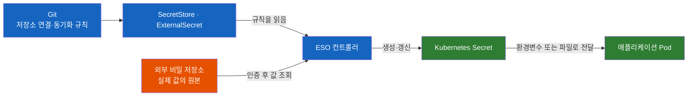

# Kubernetes Secret은 누가 갱신할까? ESO External Secrets Operator

DB 비밀번호를 외부 비밀 저장소에서 바꾸면, Kubernetes Secret과 실행 중인 애플리케이션까지 함께 바뀔까?

## 결론부터 말하면

**External Secrets Operator(ESO)는 외부 비밀 저장소의 값을 읽어 Kubernetes Secret을 생성·갱신하는 컨트롤러다.** Git에는 값을 가져올 위치와 동기화 규칙을 기록하고, 실제 비밀번호는 AWS Secrets Manager나 HashiCorp Vault 같은 외부 저장소에서 관리할 수 있다. 다만 **Secret 동기화와 애플리케이션의 새 값 적용은 별도 단계** 이므로, 비밀번호 교체를 끝내려면 애플리케이션이 값을 다시 읽는 방법까지 설계해야 한다. [ESO Overview](https://external-secrets.io/latest/introduction/overview/)



> 확인 기준: 2026-09-27 공식 문서. 예제는 `external-secrets.io/v1`을 제공하는 ESO·CRD 설치를 전제로 한다. `/latest/` 문서는 변하므로 실제 적용 시 설치 버전의 스키마와 함께 확인한다.

## 1. 왜 Secret이 있는데 외부 동기화 도구가 필요할까?

### 1.1 Secret은 값을 전달하지만, 원본을 갱신해 주지는 않는다

Kubernetes Secret은 비밀번호·API 키 같은 민감한 값을 담아 Pod에 전달하는 API 리소스다. 애플리케이션은 환경변수나 마운트된 파일로 값을 받을 수 있다. 기본 사용법은 [Kubernetes ConfigMap & Secret](Kubernetes-ConfigMap-Secret.md)에서 다룬다.

그런데 운영 DB 비밀번호가 바뀌었다고 생각해 보자. 개발·스테이징·운영 클러스터마다 Secret을 직접 고쳐야 한다면, 누군가는 새 값을 전달받고 각 환경에 반영해야 한다. 외부 저장소에 새 비밀번호를 넣었다는 사실만으로 Kubernetes가 그 변경을 알 수는 없다.

Git에서 배포 상태를 관리하는 GitOps를 쓰면 또 다른 질문이 생긴다. Secret YAML도 Git에 넣으면 될까? `data`의 Base64 문자열은 원래 값으로 쉽게 복원할 수 있는 인코딩이다. `stringData`는 평문 입력을 받는 필드다. **둘 다 비밀번호를 안전하게 Git에 보관하는 암호화 방식이 아니다.** Kubernetes Secret의 저장 시 암호화와 접근 권한도 별도로 구성해야 한다. [Kubernetes Secrets](https://kubernetes.io/docs/concepts/configuration/secret/)

### 1.2 값과 배포 규칙의 관리 위치를 나눈다

ESO를 사용하면 역할을 다음처럼 나눌 수 있다. 여기서 외부 비밀 저장소는 비밀값을 저장하고, 누가 어떤 값에 접근할 수 있는지 관리하는 서비스다.

| 관리 대상 | 직접 Secret을 관리하는 경우 | ESO를 사용하는 경우 |
|---|---|---|
| 실제 비밀번호 | Secret 반영 경로를 직접 마련 | 외부 비밀 저장소에 원본 보관 |
| 배포 설정 | Secret 생성·변경 절차까지 관리 | 외부 경로와 대상 Secret의 대응 관계를 선언 |
| 원본 변경 반영 | 사람이나 별도 파이프라인이 수행 | 설정한 정책에 따라 ESO가 동기화 |
| 애플리케이션 입력 | Kubernetes Secret | 동일하게 Kubernetes Secret |

이 구조의 장점은 기존 애플리케이션이 Secrets Manager나 Vault의 API를 직접 호출하도록 바꿀 필요가 없다는 것이다. 배포 설정에서 Secret 이름과 key를 유지하면, 값을 공급하는 경로를 ESO로 옮길 수 있다. [ESO Overview](https://external-secrets.io/latest/introduction/overview/)

## 2. 핵심 개념: 연결 설정, 동기화 규칙, 결과물

### 2.1 이름이 비슷한 네 리소스의 역할

ESO는 Kubernetes API에 사용자 정의 리소스를 등록하는 CRD(CustomResourceDefinition)와, 그 리소스를 읽어 동작하는 컨트롤러를 사용한다. [CRD·컨트롤러·Operator](쿠버네티스는-어떻게-자기-자신을-확장할까-CRD와-컨트롤러-그리고-Operator.md)의 구체적인 적용 사례다.

| 리소스 | 답하는 질문 | 범위 |
|---|---|---|
| `SecretStore` | 어느 외부 서비스에 어떤 인증으로 접근할까? | 같은 Namespace에서 참조 |
| `ClusterSecretStore` | 여러 Namespace가 어떤 연결 설정을 공유할까? | 클러스터 범위, 사용 Namespace 제한 가능 |
| `ExternalSecret` | 어떤 원본 값을 어떤 Secret key로 가져올까? | Namespace 범위 |
| `Secret` | Pod에 전달할 실제 값은 무엇인가? | `ExternalSecret`과 같은 Namespace의 결과물 |

`SecretStore`는 이름과 달리 비밀번호 원본을 보관하는 창고가 아니다. 외부 서비스 종류, 리전·주소, 인증 방법 등을 담은 연결 설정이다. `ExternalSecret`이 이 연결 설정을 참조하고, ESO가 실제 조회를 수행한다. [SecretStore](https://external-secrets.io/latest/api/secretstore/)

`ClusterSecretStore`도 모든 Namespace에 Secret을 자동 복제하는 리소스는 아니다. 여러 Namespace의 `ExternalSecret`이 같은 Store를 참조할 수 있게 한다. `spec.conditions`로 사용 가능한 Namespace를 제한할 수 있지만, 외부 저장소에서 읽을 수 있는 값의 범위는 해당 인증 주체의 권한으로 별도 제한해야 한다. [ClusterSecretStore](https://external-secrets.io/latest/api/clustersecretstore/)

### 2.2 선언을 실제 Secret으로 바꾸는 reconcile

컨트롤러가 선언된 상태와 실제 상태를 맞추는 과정을 **reconcile** 이라고 한다. ESO에서는 다음 순서로 이해하면 된다.

1. `ExternalSecret`에서 Store 참조와 원본 key를 읽는다.
2. Store에 설정된 인증으로 외부 비밀 저장소에 접근한다.
3. 가져온 값을 지정한 key에 배치해 Kubernetes Secret을 생성·갱신한다.
4. 동기화 결과를 `ExternalSecret.status`에 기록한다.

따라서 CRD만 설치하거나 YAML만 Git에 올려서는 값이 채워지지 않는다. ESO 컨트롤러가 실행 중이고 외부 서비스에 접근할 수 있어야 한다. 이 글에서 다루는 흐름은 외부 값을 Kubernetes로 가져오는 방향이다. [ESO Getting started](https://external-secrets.io/latest/introduction/getting-started/)

### 2.3 원본이 바뀌면 언제 다시 가져올까?

`refreshPolicy`는 다시 읽는 계기를, `refreshInterval`은 주기적 조회 간격을 정한다.

| `refreshPolicy` | 원본 값 변경을 반영하는 계기 | 용도 |
|---|---|---|
| `Periodic` | `refreshInterval`에 따른 주기적 조회, `ExternalSecret` 설정 변경 | 교체되는 자격 증명 동기화, 기본 정책 |
| `OnChange` | `ExternalSecret`의 metadata 또는 spec 변경 | 명시적 변경으로 갱신 시점 제어 |
| `CreatedOnce` | 초기 동기화 후 원본 변경에 따른 주기적 갱신 없음 | 초기 값 공급 |

`OnChange`의 변경 대상은 **외부 저장소가 아니라 `ExternalSecret` 리소스** 다. 원본 비밀번호만 바꾸면 이를 자동으로 알아차리는 정책이 아니다. `Periodic`에서도 `refreshInterval: 0`은 지속적인 주기 갱신을 의미하지 않는다. [ExternalSecret refresh policies](https://external-secrets.io/latest/api/externalsecret/#update-behavior-with-3-different-refresh-policies)

`CreatedOnce` 역시 영구적인 변경 금지와는 다르다. 초기 동기화 기록은 `ExternalSecret.status`에 남으며, `ExternalSecret` 자체를 삭제 후 다시 만들면 새 초기 동기화가 발생할 수 있다. 대상 Secret의 삭제 처리에도 생성 정책이 관여한다. 예를 들어 공식 Lifecycle 표에서 `Owner`는 삭제된 Secret을 재생성하지만, `Orphan`과 `CreatedOnce` 조합은 그대로 두는 것으로 설명한다. 기존 데이터를 고정해야 한다면 `ExternalSecret`의 `spec.target.immutable: true`와 재생성 정책까지 함께 검토한다. [Lifecycle](https://external-secrets.io/latest/guides/ownership-deletion-policy/)

## 3. 실제 사례: Secrets Manager의 DB 비밀번호를 Pod에 전달하기

### 3.1 예제의 전제

AWS의 관리형 Kubernetes인 EKS에서, Secrets Manager의 `prod/orders/db`를 `orders` Namespace의 `orders-db` Secret으로 가져온다고 가정한다. 전체 클러스터 구축 절차 대신 ESO 리소스 사이의 연결을 보여주는 예제다.

- ESO 컨트롤러와 `v1` CRD가 설치되어 있고 `orders` Namespace가 존재한다. 설치 방법은 [Getting started](https://external-secrets.io/latest/introduction/getting-started/)를 따른다.
- Secrets Manager에 아래 구조의 JSON 값이 있다. 값은 설명용이며 실제 자격 증명은 외부 저장소에서 설정한다.
- EKS ServiceAccount에 IAM Role을 연결하는 **IRSA(IAM Roles for Service Accounts)** 를 준비한다. EKS의 OIDC provider와 IAM Role의 신뢰 정책에서 `system:serviceaccount:orders:orders-secrets-reader` 및 `sts.amazonaws.com` audience를 허용해야 한다. [AWS IRSA 설정](https://docs.aws.amazon.com/eks/latest/userguide/associate-service-account-role.html)
- IAM 정책은 대상 Secret의 읽기 범위로 제한한다. `secretsmanager:GetSecretValue`, 필요한 조회 권한을 부여하고, 고객 관리형 KMS 키로 암호화한 경우 `kms:Decrypt` 권한도 확인한다. [Secrets Manager IAM 정책](https://docs.aws.amazon.com/secretsmanager/latest/userguide/auth-and-access_iam-policies.html)
- ESO에 참조 ServiceAccount의 토큰을 요청할 Kubernetes RBAC 권한과 AWS STS·Secrets Manager로의 네트워크 접근이 있어야 한다. [ESO 보안 설정](https://external-secrets.io/latest/guides/security-best-practices/)

```json
{
  "username": "orders_app",
  "password": "example-only-not-a-real-password"
}
```

### 3.2 SecretStore: 어떤 권한으로 가져올까?

다음을 `orders-secret-store.yaml`로 저장한다. 계정 ID와 Role 이름은 실제 환경의 값으로 바꾼다. ServiceAccount annotation만 추가한다고 IAM Role이나 신뢰 정책이 생성되는 것은 아니다.

```yaml
apiVersion: v1
kind: ServiceAccount
metadata:
  name: orders-secrets-reader
  namespace: orders
  annotations:
    eks.amazonaws.com/role-arn: arn:aws:iam::123456789012:role/orders-secrets-reader
---
apiVersion: external-secrets.io/v1
kind: SecretStore
metadata:
  name: orders-aws
  namespace: orders
spec:
  provider:
    aws:
      service: SecretsManager
      region: ap-northeast-2
      auth:
        jwt:
          serviceAccountRef:
            name: orders-secrets-reader
```

ESO는 참조한 ServiceAccount의 토큰으로 AWS 인증을 수행한다. 이 ServiceAccount는 Store의 인증용이며, 애플리케이션 Pod가 반드시 이 계정을 사용해야 하는 것은 아니다. 애플리케이션은 뒤에서 생성된 Kubernetes Secret만 전달받는다. [ESO AWS Access](https://external-secrets.io/latest/provider/aws-access/)

> 이 예제는 IRSA 방식이다. EKS Pod Identity는 별도의 인증 방식이며, 공식 문서의 해당 경로에서는 ESO 컨트롤러 Pod에 Role을 연결하고 Store의 `auth`를 생략한다. Pod Identity를 `auth.jwt.serviceAccountRef` 방식과 섞지 않는다. [EKS Pod Identity Setup](https://external-secrets.io/latest/provider/aws-access/#eks-pod-identity-setup)

### 3.3 ExternalSecret: 어떤 값을 어떤 이름으로 가져올까?

다음을 `orders-external-secret.yaml`로 저장한다. 원본 JSON의 필드 이름과 애플리케이션에 제공할 key 이름을 다르게 지정해, 두 역할을 구분했다.

```yaml
apiVersion: external-secrets.io/v1
kind: ExternalSecret
metadata:
  name: orders-db
  namespace: orders
spec:
  refreshPolicy: Periodic
  refreshInterval: 1m
  secretStoreRef:
    name: orders-aws
    kind: SecretStore
  target:
    name: orders-db
    creationPolicy: Owner
    deletionPolicy: Retain
  data:
    - secretKey: DB_USERNAME
      remoteRef:
        key: prod/orders/db
        property: username
    - secretKey: DB_PASSWORD
      remoteRef:
        key: prod/orders/db
        property: password
```

`remoteRef.key`는 **외부 저장소의 항목 이름** 이고 `property`는 그 JSON 내부의 필드다. 반면 `secretKey`는 결과 Kubernetes Secret 내부의 key다. 따라서 `prod/orders/db`의 `password`가 `orders-db` Secret의 `DB_PASSWORD`로 들어간다. [AWS Secrets Manager JSON 값 매핑](https://external-secrets.io/latest/provider/aws-secrets-manager/#json-secret-values)

`data`는 필요한 필드만 골라 이름을 지정한다. JSON 필드 전체를 가져오려면 `dataFrom.extract`를 사용할 수 있지만, 이 예제는 애플리케이션에 필요한 두 key를 명시했다. [ExternalSecret](https://external-secrets.io/latest/api/externalsecret/)

```bash
kubectl apply -f orders-secret-store.yaml
kubectl wait --for=condition=Ready secretstore/orders-aws -n orders --timeout=60s

kubectl apply -f orders-external-secret.yaml
kubectl wait --for=condition=Ready externalsecret/orders-db -n orders --timeout=60s

# Secret의 존재와 key 개수 확인. 값은 출력하지 않는다.
kubectl get secret orders-db -n orders
```

위 명령은 전제를 갖춘 환경에서 실행하는 적용·확인 예시다. 이 문서 작성 과정에서 실제 AWS 계정이나 클러스터에 배포한 결과는 아니다.

### 3.4 애플리케이션은 기존 Secret 사용 방식을 유지한다

다음은 기존 Deployment의 컨테이너 설정에 넣는 `env` 부분이다. 완전한 Deployment manifest는 아니다.

```yaml
env:
  - name: DB_USERNAME
    valueFrom:
      secretKeyRef:
        name: orders-db
        key: DB_USERNAME
  - name: DB_PASSWORD
    valueFrom:
      secretKeyRef:
        name: orders-db
        key: DB_PASSWORD
```

Pod도 `orders` Namespace에 있어야 한다. 애플리케이션 입장에서는 평범한 환경변수이며, 외부 저장소의 경로나 ESO API를 알 필요가 없다. 다만 최초 배포 시 필수 Secret이 아직 없으면 컨테이너 시작이 막힐 수 있으므로, 배포 순서와 동기화 성공을 확인한다. [Kubernetes Secrets](https://kubernetes.io/docs/concepts/configuration/secret/)

### 3.5 비밀번호 교체는 세 단계로 확인한다

원본 비밀번호를 교체하는 rotation을 운영에 적용하려면 세 단계를 구분해야 한다. 첫째는 실제 DB 자격 증명과 외부 저장소의 원본 갱신, 둘째는 ESO의 Secret 동기화, 셋째는 애플리케이션의 새 값 사용이다. 위 예제에서 ESO가 담당하는 것은 두 번째 단계다.

`refreshInterval: 1m`은 주기적 조회 간격이다. 네트워크 오류나 재시도, 애플리케이션 적용까지 포함해 “1분 내 교체 완료”를 보장하는 값으로 해석하면 안 된다.

| Secret 소비 방식 | Secret 갱신 후 동작 | 애플리케이션 측 조치 |
|---|---|---|
| `env`, `envFrom` | 실행 중 컨테이너의 환경변수는 그대로 | 새 컨테이너가 값을 읽도록 Pod 교체 등 수행 |
| 일반 Secret volume | Kubernetes가 파일 내용을 최종적으로 갱신 | 변경된 파일을 다시 읽거나 설정을 reload |
| `subPath`로 마운트한 파일 | Secret 자동 갱신을 받지 않음 | 마운트 방식을 바꾸거나 Pod 교체 |

일반 volume도 즉시 반영되는 것은 아니다. ESO 동기화 이후 kubelet의 동기화 주기와 Secret 변경 감지·캐시 전파에 따른 지연이 추가될 수 있다. 환경변수 갱신 제약은 [Secret 환경변수 사용 안내](https://kubernetes.io/docs/tasks/inject-data-application/distribute-credentials-secure/#define-container-environment-variables-using-secret-data), volume 전파와 `subPath` 예외는 [Kubernetes Secrets](https://kubernetes.io/docs/concepts/configuration/secret/#using-secrets-as-files-from-a-pod)에 설명되어 있다.

예를 들어 환경변수로 DB 비밀번호를 받는 Spring Boot 서비스라면, ESO가 Secret을 바꿨다는 이유만으로 실행 중인 프로세스의 환경변수나 connection pool 설정이 바뀌지는 않는다. Secret 동기화를 확인한 다음 배포 절차에 따라 Pod를 순차 교체하거나, 애플리케이션에 별도의 자격 증명 재로딩 경로를 마련해야 한다. 이는 위 전달 방식의 제약에서 도출되는 운영상의 판단이다.

### 3.6 무엇을 삭제했는지에 따라 정책이 다르다

예제의 `creationPolicy: Owner`와 `deletionPolicy: Retain`을 함께 보면 “Secret을 소유하지만 삭제하지는 않는다”라고 읽기 쉽다. 하지만 두 설정은 서로 다른 사건을 다룬다.

| 설정 | 다루는 사건 | 예제에서의 의미 |
|---|---|---|
| `creationPolicy: Owner` | 대상 Secret 생성과 소유 관계 | `ownerReferences`를 연결하므로 `ExternalSecret` 삭제 시 Secret도 기본적으로 garbage collection 대상 |
| `deletionPolicy: Retain` | 동기화 중 외부 원본이 사라진 것을 발견 | 기존 Secret을 유지하고 동기화 오류 보고 |

**`Retain`은 `ExternalSecret` 삭제로부터 Secret을 보호하는 옵션이 아니다.** `ExternalSecret`을 없앤 뒤에도 Secret을 남겨야 한다면 `creationPolicy: Orphan` 등을 검토한다. `Orphan`도 주기 갱신을 끄는 옵션은 아니므로, 계속 동기화되는 동안 대상 값을 직접 수정하면 다시 덮어써질 수 있다. 삭제 정책 지원 여부는 provider마다 확인한다. [ESO 소유·삭제 정책](https://external-secrets.io/latest/guides/ownership-deletion-policy/)

### 3.7 장애는 값 대신 동기화 경로를 확인한다

```bash
kubectl get secretstore,externalsecret -n orders
kubectl describe secretstore orders-aws -n orders
kubectl describe externalsecret orders-db -n orders
kubectl get externalsecret orders-db -n orders \
  -o jsonpath='{.status.refreshTime}{"\n"}'
```

Store가 `Ready=False`라면 먼저 인증·연결 설정을 확인한다. Store가 준비되어도 개별 Secret 조회 권한이나 원본 key·property가 틀릴 수 있으므로, `ExternalSecret`의 condition과 event도 본다. `Ready=True`와 `SecretSynced`는 동기화 상태를 판단하는 근거이며, DB 로그인 성공을 보증하는 애플리케이션 검사는 아니다. [SecretStore](https://external-secrets.io/latest/api/secretstore/), [ExternalSecret status](https://external-secrets.io/latest/api/externalsecret/)

이미 존재하는 Secret의 값이 남아 있다는 사실만으로 정상이라고 판단하지 않는다. 외부 저장소 접근이 끊기면 기존 값으로 당장 동작하더라도 다음 rotation을 놓칠 수 있다. Secret 존재 여부, 최근 동기화 시각, 오류 상태, 애플리케이션의 실제 인증 결과를 함께 확인하는 이유다.

### 3.8 ESO를 도입해도 권한 경계는 남는다

ESO가 생성한 값은 Kubernetes Secret으로 클러스터 안에 저장된다. 따라서 Secret의 저장 시 암호화와 읽기 권한은 여전히 중요하다. 또한 `ExternalSecret` 작성 권한이 있는 사용자가 강한 권한의 Store를 참조할 수 있다면, 원래 직접 읽지 못하던 외부 값을 자신의 Namespace로 가져오는 경로가 생길 수 있다.

운영에서는 외부 IAM 권한, Store 참조 범위, `ExternalSecret`·Store 변경 권한을 함께 제한한다. `ClusterSecretStore`의 Namespace 제한은 이 중 하나의 경계일 뿐이며, Namespace별로 필요한 외부 값의 범위까지 자동 분리해 주지는 않는다. [ESO Security Best Practices](https://external-secrets.io/latest/guides/security-best-practices/)

## 4. 정리

1. **ESO는 외부 원본과 Kubernetes Secret 사이의 동기화를 맡는다.** 애플리케이션은 기존 Secret 소비 방식을 유지할 수 있다.
2. **Store는 연결·인증, ExternalSecret은 매핑·갱신 규칙이다.** 실제 값을 담는 결과물은 Kubernetes Secret이다.
3. **Secret 갱신과 애플리케이션 적용을 따로 확인한다.** 환경변수는 자동 갱신되지 않고, 파일 전달도 애플리케이션의 재로딩이 필요하다.
4. **소유·삭제·갱신 정책은 구분해서 읽는다.** 특히 `Retain`과 `ExternalSecret` 삭제 시 수명은 별개다.
5. **외부 권한과 Kubernetes 권한을 함께 설계한다.** 값이 Git에서 빠져도 클러스터 내부의 보호 책임은 남는다.

## 출처

- [ESO Overview](https://external-secrets.io/latest/introduction/overview/) — 역할과 동기화 구조
- [ESO Getting started](https://external-secrets.io/latest/introduction/getting-started/) — 설치와 기본 사용
- [ESO SecretStore](https://external-secrets.io/latest/api/secretstore/) — 연결 설정과 Namespace 범위
- [ESO ClusterSecretStore](https://external-secrets.io/latest/api/clustersecretstore/) — 공유 Store와 사용 Namespace 제한
- [ESO ExternalSecret](https://external-secrets.io/latest/api/externalsecret/) — 값 매핑, 갱신 정책, 상태
- [ESO Lifecycle](https://external-secrets.io/latest/guides/ownership-deletion-policy/) — 소유·삭제 정책
- [ESO AWS Secrets Manager](https://external-secrets.io/latest/provider/aws-secrets-manager/) — JSON 필드 매핑
- [ESO AWS Access](https://external-secrets.io/latest/provider/aws-access/) — IRSA와 EKS Pod Identity
- [ESO Security Best Practices](https://external-secrets.io/latest/guides/security-best-practices/) — 권한과 격리
- [AWS Assign IAM roles to Kubernetes service accounts](https://docs.aws.amazon.com/eks/latest/userguide/associate-service-account-role.html) — IRSA 사전 설정
- [AWS Secrets Manager identity-based policies](https://docs.aws.amazon.com/secretsmanager/latest/userguide/auth-and-access_iam-policies.html) — Secret 조회와 KMS 권한
- [Kubernetes Secrets](https://kubernetes.io/docs/concepts/configuration/secret/) — 저장·사용·volume 갱신
- [Kubernetes Distribute Credentials Securely Using Secrets](https://kubernetes.io/docs/tasks/inject-data-application/distribute-credentials-secure/) — 환경변수 갱신 제약
