# Kubernetes Service: ClusterIP, NodePort, LoadBalancer

Pod의 IP로 직접 접근하면 안 되는 이유가 뭘까?

## 결론부터 말하면

**Service**는 Pod 집합에 대한 **안정적인 네트워크 엔드포인트**를 제공한다. Pod는 죽었다 살아나면 IP가 바뀌지만, Service의 IP는 변하지 않는다.

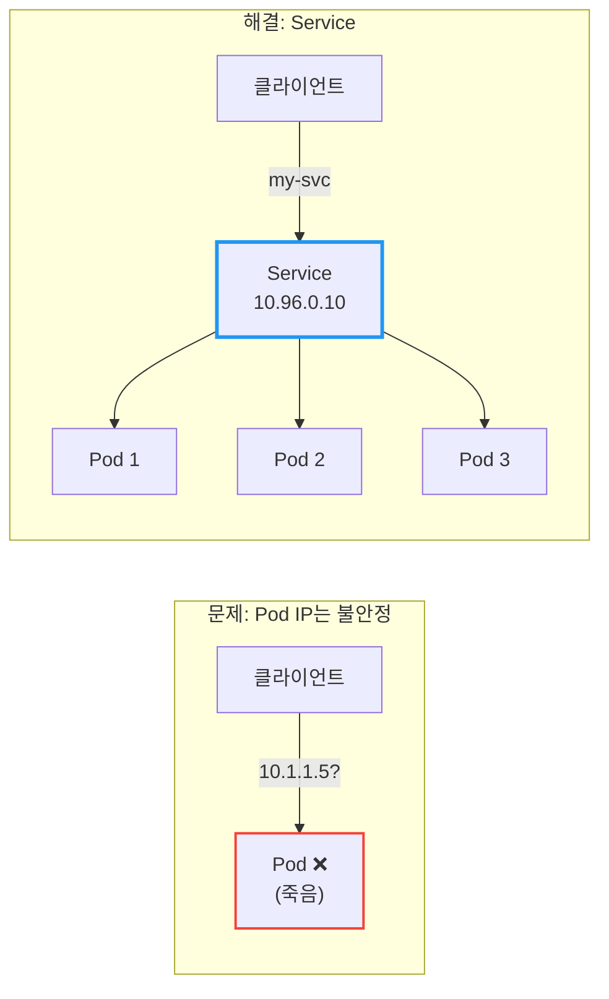

| Service 타입 | 접근 범위 | 사용 시점 |
|-------------|----------|----------|
| **ClusterIP** | 클러스터 내부만 | 내부 서비스 간 통신 (기본값) |
| **NodePort** | 클러스터 외부 (노드 IP:포트) | 개발/테스트 환경 |
| **LoadBalancer** | 클러스터 외부 (LB IP) | 프로덕션 환경 (클라우드) |
| **ExternalName** | 외부 DNS로 매핑 | 외부 서비스 연동 |

---

## 1. 왜 Service가 필요한가?

### 1.1 Pod IP의 문제점

Pod를 직접 IP로 호출하면 어떤 문제가 생길까?

**문제 1: Pod IP는 휘발성이다**

Pod가 재시작되면 IP가 바뀐다. Deployment가 롤링 업데이트를 하면? 새 Pod는 새 IP를 받는다.

```
# 처음 배포
my-app-pod-abc12: 10.1.1.5

# 롤링 업데이트 후
my-app-pod-xyz99: 10.1.1.87  ← IP가 바뀜!
```

**문제 2: 여러 Pod에 로드밸런싱이 안 된다**

`replicas: 3`으로 Pod를 3개 띄웠다. 클라이언트가 어떤 Pod로 요청을 보내야 할까? 직접 IP를 알아내서 번갈아 호출해야 하나?

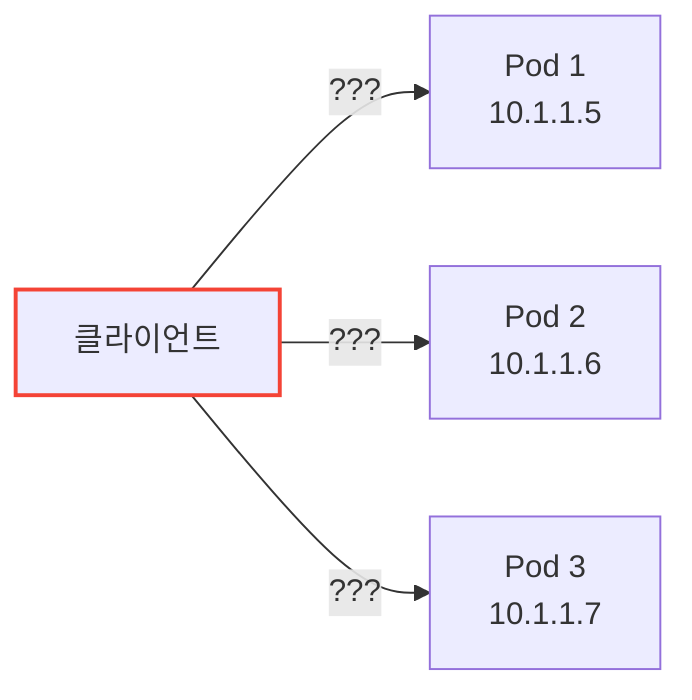

**문제 3: 서비스 디스커버리가 없다**

새 Pod가 추가되거나 기존 Pod가 죽으면, 클라이언트는 어떻게 알 수 있을까? 모든 클라이언트가 Pod 목록을 실시간으로 추적해야 한다.

### 1.2 Service의 해결책

Service는 이 모든 문제를 해결한다:

| 문제 | Service의 해결책 |
|------|-----------------|
| Pod IP 변경 | Service IP는 **고정** (ClusterIP) |
| 로드밸런싱 | 자동으로 **분산** |
| 서비스 디스커버리 | DNS로 **이름 조회** 가능 |

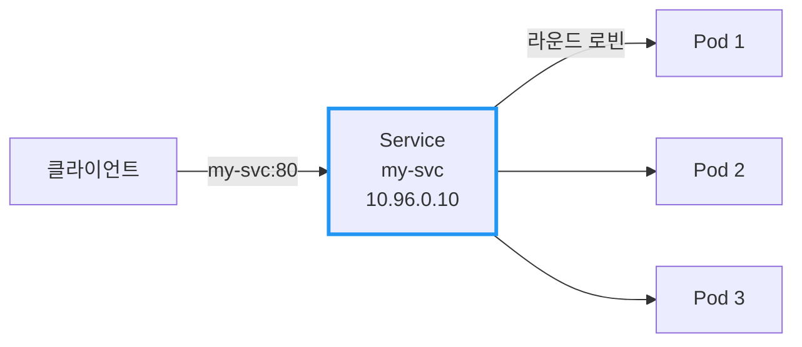

클라이언트는 `my-svc`라는 이름만 알면 된다. Pod가 몇 개인지, IP가 뭔지 몰라도 된다.

---

## 2. Service의 동작 원리

### 2.1 Label Selector로 Pod 선택

Service는 **Label**로 어떤 Pod에 트래픽을 보낼지 결정한다.

```yaml
apiVersion: v1
kind: Service
metadata:
  name: my-svc
spec:
  selector:
    app: my-app       # 이 라벨을 가진 Pod들에게 트래픽 전달
  ports:
  - port: 80          # Service 포트
    targetPort: 8080  # Pod의 컨테이너 포트
```

```yaml
apiVersion: apps/v1
kind: Deployment
metadata:
  name: my-app
spec:
  replicas: 3
  selector:
    matchLabels:
      app: my-app
  template:
    metadata:
      labels:
        app: my-app   # Service의 selector와 일치!
    spec:
      containers:
      - name: app
        image: my-app:1.0
        ports:
        - containerPort: 8080
```

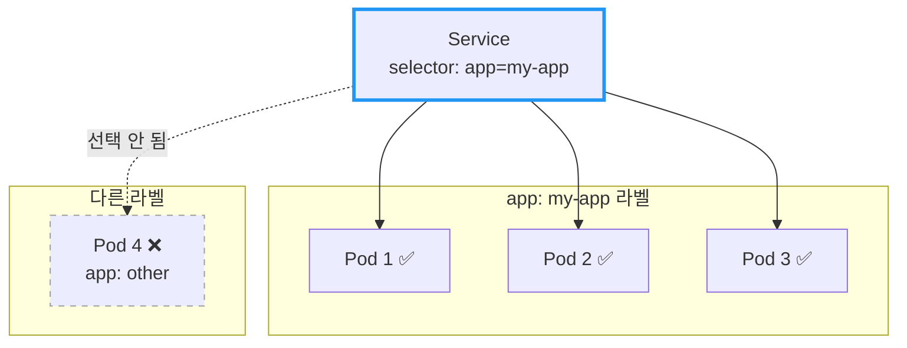

### 2.2 Endpoints: 실제 목적지 목록

Service를 만들면 Kubernetes가 **Endpoints** 오브젝트를 자동 생성한다. Endpoints는 "현재 트래픽을 받을 수 있는 Pod IP 목록"이다.

```bash
# Service 확인
$ kubectl get svc my-svc
NAME     TYPE        CLUSTER-IP    EXTERNAL-IP   PORT(S)   AGE
my-svc   ClusterIP   10.96.0.10    <none>        80/TCP    5m

# Endpoints 확인
$ kubectl get endpoints my-svc
NAME     ENDPOINTS                                   AGE
my-svc   10.1.1.5:8080,10.1.1.6:8080,10.1.1.7:8080   5m
```

**중요:** Readiness Probe가 실패한 Pod는 Endpoints에서 **제외**된다!

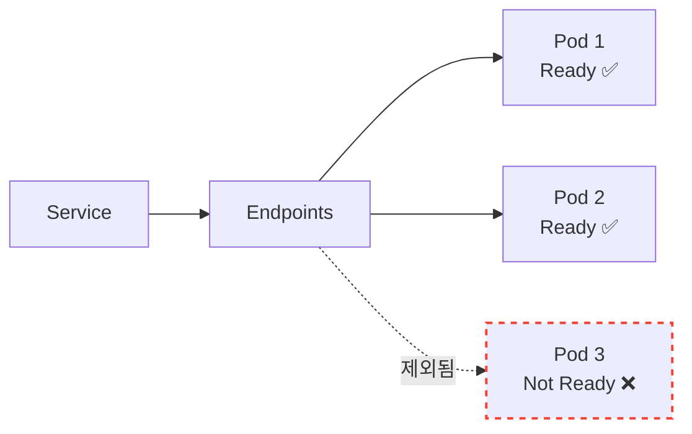

> 📖 Readiness Probe에 대한 자세한 내용은 [Kubernetes Probe: Liveness, Readiness, Startup](./Kubernetes-Probe-Liveness-Readiness-Startup.md) 문서를 참고하라.

---

## 3. Service 타입: ClusterIP

### 3.1 기본 타입

`ClusterIP`는 Service의 기본 타입이다. **클러스터 내부에서만** 접근 가능한 가상 IP를 할당받는다.

```yaml
apiVersion: v1
kind: Service
metadata:
  name: my-svc
spec:
  type: ClusterIP     # 기본값, 생략 가능
  selector:
    app: my-app
  ports:
  - port: 80
    targetPort: 8080
```

### 3.2 언제 사용하나?

클러스터 **내부** 서비스 간 통신에 사용한다:
- 백엔드 API → 데이터베이스
- 프론트엔드 → 백엔드 API
- 마이크로서비스 간 통신

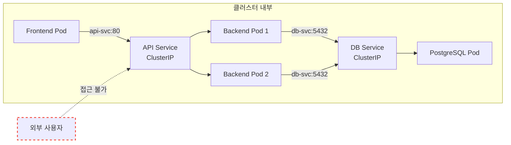

### 3.3 DNS로 접근하기

클러스터 내부에서는 Service 이름으로 DNS 조회가 가능하다:

```bash
# 같은 Namespace 내
curl http://my-svc:80

# 다른 Namespace의 Service
curl http://my-svc.other-namespace.svc.cluster.local:80
```

DNS 형식: `<service-name>.<namespace>.svc.cluster.local`

---

## 4. Service 타입: NodePort

### 4.1 외부에서 접근하기

`NodePort`는 **모든 노드**의 특정 포트를 열어서 외부 접근을 허용한다.

```yaml
apiVersion: v1
kind: Service
metadata:
  name: my-svc
spec:
  type: NodePort
  selector:
    app: my-app
  ports:
  - port: 80          # Service 포트 (내부)
    targetPort: 8080  # Pod 포트
    nodePort: 30080   # 노드 포트 (30000-32767)
```

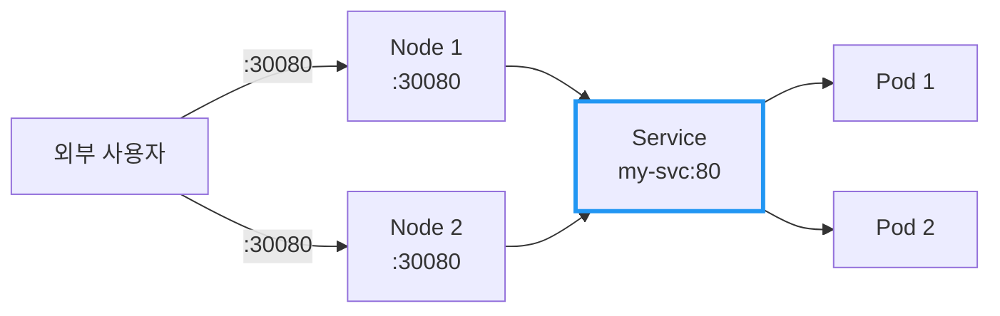

### 4.2 포트 범위

NodePort는 **30000-32767** 범위에서 할당된다:
- `nodePort` 지정 안 하면: 자동 할당
- 직접 지정 가능 (범위 내에서)

### 4.3 언제 사용하나?

| 상황 | 적합도 |
|------|--------|
| 개발/테스트 환경 | ✅ 적합 |
| 온프레미스 환경 (LB 없을 때) | ⚠️ 가능 |
| 프로덕션 (클라우드) | ❌ 비권장 |

**NodePort의 단점:**
- 노드 IP가 변경되면 접근 불가
- 노드가 죽으면 해당 경로 사용 불가
- 포트 범위 제한 (30000-32767)
- 노드 앞에 별도 로드밸런서 필요

---

## 5. Service 타입: LoadBalancer

### 5.1 클라우드 환경의 표준

`LoadBalancer`는 **클라우드 제공자의 로드밸런서**를 자동으로 프로비저닝한다.

```yaml
apiVersion: v1
kind: Service
metadata:
  name: my-svc
spec:
  type: LoadBalancer
  selector:
    app: my-app
  ports:
  - port: 80
    targetPort: 8080
```

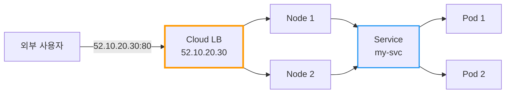

### 5.2 동작 방식

1. `LoadBalancer` 타입 Service 생성
2. 클라우드 제공자(AWS, GCP, Azure 등)가 LB 프로비저닝
3. 외부 IP 할당 (`EXTERNAL-IP`)
4. 트래픽: 외부 → LB → NodePort → Service → Pod

```bash
$ kubectl get svc my-svc
NAME     TYPE           CLUSTER-IP    EXTERNAL-IP    PORT(S)        AGE
my-svc   LoadBalancer   10.96.0.10    52.10.20.30    80:31234/TCP   5m
```

### 5.3 언제 사용하나?

| 상황 | 적합도 |
|------|--------|
| 프로덕션 (클라우드) | ✅ 적합 |
| 온프레미스 (MetalLB 등) | ✅ 가능 |
| 개발/테스트 | ⚠️ 비용 발생 |

**주의:** Service마다 LoadBalancer가 생성되므로, 여러 서비스를 노출할 때는 **Ingress** 사용을 권장한다.

---

## 6. Service 타입: ExternalName

### 6.1 외부 서비스를 내부 이름으로 매핑

`ExternalName`은 클러스터 **외부** 서비스에 내부 DNS 이름을 부여한다.

```yaml
apiVersion: v1
kind: Service
metadata:
  name: external-db
spec:
  type: ExternalName
  externalName: db.example.com    # 실제 외부 도메인
```


### 6.2 언제 사용하나?

- 외부 SaaS DB (AWS RDS, Cloud SQL 등) 연동
- 점진적 마이그레이션 (외부 → 내부로 이전 시)
- 환경별 분리 (개발은 외부, 프로덕션은 내부)

**장점:** 애플리케이션 코드 변경 없이 `external-db`로 호출하면 됨. 나중에 내부 DB로 전환해도 Service 설정만 바꾸면 된다.

---

## 7. Service 타입 비교

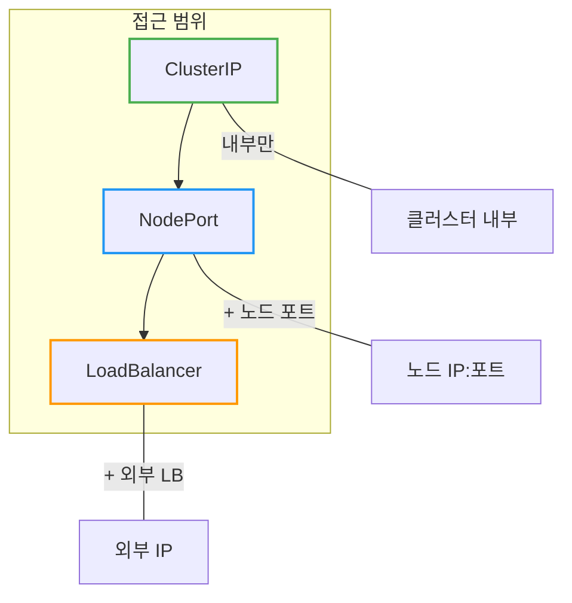

| 타입 | ClusterIP | NodePort | LoadBalancer |
|------|-----------|----------|--------------|
| **접근 범위** | 내부만 | 내부 + 노드 포트 | 내부 + 외부 IP |
| **외부 IP** | 없음 | 없음 (노드 IP 사용) | 있음 |
| **포트** | 제한 없음 | 30000-32767 | 제한 없음 |
| **비용** | 없음 | 없음 | 클라우드 LB 비용 |
| **사용 시점** | 내부 통신 | 개발/테스트 | 프로덕션 |

---

## 8. 실전 예시: 전체 구성

```yaml
---
# 1. 내부 서비스 (ClusterIP)
apiVersion: v1
kind: Service
metadata:
  name: backend-svc
spec:
  type: ClusterIP
  selector:
    app: backend
  ports:
  - port: 8080
    targetPort: 8080

---
# 2. 외부 노출 (LoadBalancer)
apiVersion: v1
kind: Service
metadata:
  name: frontend-svc
spec:
  type: LoadBalancer
  selector:
    app: frontend
  ports:
  - port: 80
    targetPort: 3000

---
# 3. 외부 DB 연동 (ExternalName)
apiVersion: v1
kind: Service
metadata:
  name: database
spec:
  type: ExternalName
  externalName: mydb.abc123.us-east-1.rds.amazonaws.com
```

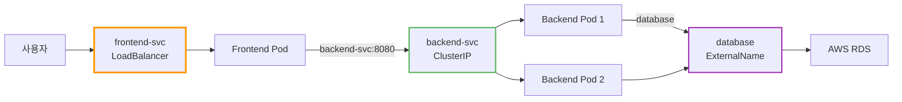

---

## 9. 자주 쓰는 명령어

```bash
# Service 목록 조회
kubectl get svc

# Service 상세 정보
kubectl describe svc my-svc

# Endpoints 확인 (실제 Pod IP 목록)
kubectl get endpoints my-svc

# Service 생성 (명령형)
kubectl expose deployment my-app --port=80 --target-port=8080

# Service 삭제
kubectl delete svc my-svc
```

---

## 10. 정리

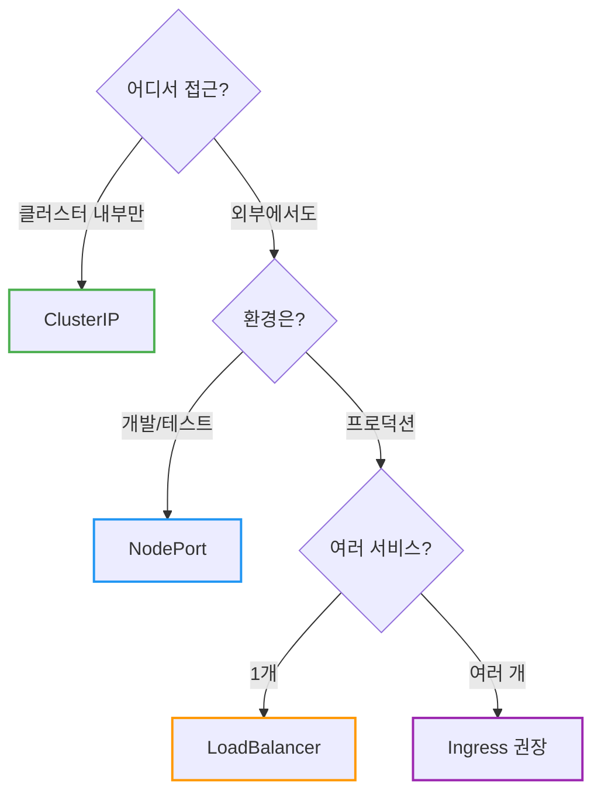

| 질문 | 답변 |
|------|------|
| Pod IP로 직접 호출해도 되나요? | ❌ Pod IP는 변경됨, Service 사용 |
| ClusterIP vs NodePort 차이? | ClusterIP는 내부만, NodePort는 외부도 가능 |
| 프로덕션에서 뭘 써야 하나요? | LoadBalancer 또는 Ingress |

**핵심 기억:**
1. **Service**는 Pod에 대한 안정적인 엔드포인트 (IP, DNS)
2. **ClusterIP**는 내부 통신, **LoadBalancer**는 외부 노출
3. **Selector**로 Pod를 선택, **Endpoints**로 실제 목적지 관리
4. Readiness Probe 실패 → Endpoints에서 제외 → 트래픽 차단

---

## 출처

- [Kubernetes Documentation - Service](https://kubernetes.io/docs/concepts/services-networking/service/) - 공식 문서
- [Kubernetes Documentation - DNS for Services and Pods](https://kubernetes.io/docs/concepts/services-networking/dns-pod-service/) - 공식 문서
- [Kubernetes Documentation - Connecting Applications with Services](https://kubernetes.io/docs/tutorials/services/connect-applications-service/) - 공식 문서
