# Kubernetes Service: ClusterIP, NodePort, LoadBalancer

Pod의 IP로 직접 접근하면 안 되는 이유가 뭘까?

## 결론부터 말하면

**Service**는 Pod 집합에 대한 **안정적인 네트워크 엔드포인트**를 제공한다. Pod는 죽었다 살아나면 IP가 바뀌지만, Service의 IP는 변하지 않는다.

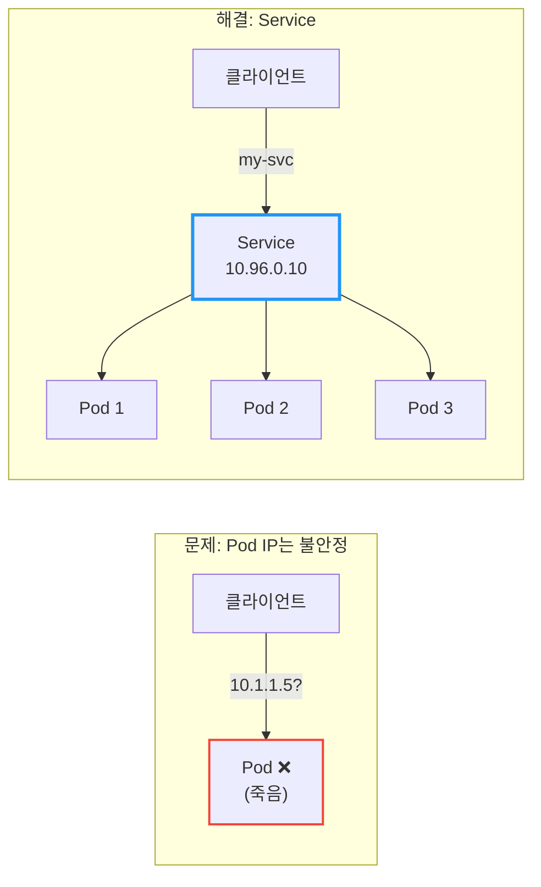

| Service 타입 | 접근 범위 | 사용 시점 |
|-------------|----------|----------|
| **ClusterIP** | 클러스터 내부만 | 내부 서비스 간 통신 (기본값) |
| **NodePort** | 클러스터 외부 (노드 IP:포트) | 개발/테스트 환경 |
| **LoadBalancer** | 클러스터 외부 (LB IP) | 프로덕션 환경 (클라우드) |
| **ExternalName** | 외부 DNS로 매핑 | 외부 서비스 연동 |

---

## 1. 왜 Service가 필요한가?

### 1.1 Pod IP의 문제점

Pod를 직접 IP로 호출하면 어떤 문제가 생길까?

**문제 1: Pod IP는 휘발성이다**

Pod가 재시작되면 IP가 바뀐다. Deployment가 롤링 업데이트를 하면? 새 Pod는 새 IP를 받는다.

```
# 처음 배포
my-app-pod-abc12: 10.1.1.5

# 롤링 업데이트 후
my-app-pod-xyz99: 10.1.1.87  ← IP가 바뀜!
```

**문제 2: 여러 Pod에 로드밸런싱이 안 된다**

`replicas: 3`으로 Pod를 3개 띄웠다. 클라이언트가 어떤 Pod로 요청을 보내야 할까? 직접 IP를 알아내서 번갈아 호출해야 하나?

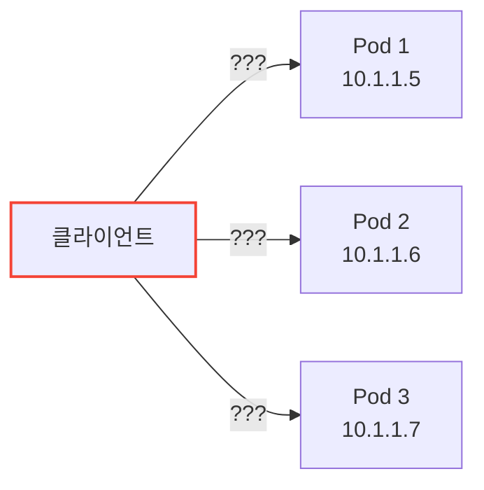

**문제 3: 서비스 디스커버리가 없다**

새 Pod가 추가되거나 기존 Pod가 죽으면, 클라이언트는 어떻게 알 수 있을까? 모든 클라이언트가 Pod 목록을 실시간으로 추적해야 한다.

### 1.2 Service의 해결책

Service는 이 모든 문제를 해결한다:

| 문제 | Service의 해결책 |
|------|-----------------|
| Pod IP 변경 | Service IP는 **고정** (ClusterIP) |
| 로드밸런싱 | 자동으로 **분산** |
| 서비스 디스커버리 | DNS로 **이름 조회** 가능 |

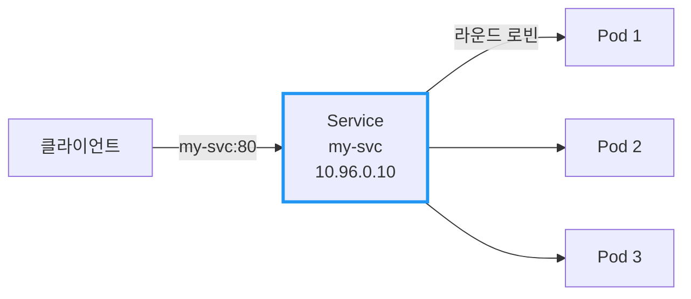

클라이언트는 `my-svc`라는 이름만 알면 된다. Pod가 몇 개인지, IP가 뭔지 몰라도 된다.

---

## 2. Service의 동작 원리

### 2.1 Label Selector로 Pod 선택

Service는 **Label**로 어떤 Pod에 트래픽을 보낼지 결정한다.

```yaml
apiVersion: v1
kind: Service
metadata:
  name: my-svc
spec:
  selector:
    app: my-app       # 이 라벨을 가진 Pod들에게 트래픽 전달
  ports:
  - port: 80          # Service 포트
    targetPort: 8080  # Pod의 컨테이너 포트 (숫자 또는 이름)
```

**targetPort는 포트 이름으로도 지정 가능하다:**

```yaml
# Service - 포트 이름으로 참조
spec:
  ports:
  - port: 80
    targetPort: http   # Pod에 정의된 포트 이름

---
# Pod - 포트에 이름 부여
spec:
  containers:
  - name: app
    ports:
    - name: http       # targetPort에서 참조할 이름
      containerPort: 8080
```

이 방식의 장점: Pod의 포트 번호가 `8080 → 9090`으로 바뀌어도 Service 수정이 필요 없다.

```yaml
apiVersion: apps/v1
kind: Deployment
metadata:
  name: my-app
spec:
  replicas: 3
  selector:
    matchLabels:
      app: my-app
  template:
    metadata:
      labels:
        app: my-app   # Service의 selector와 일치!
    spec:
      containers:
      - name: app
        image: my-app:1.0
        ports:
        - containerPort: 8080
```

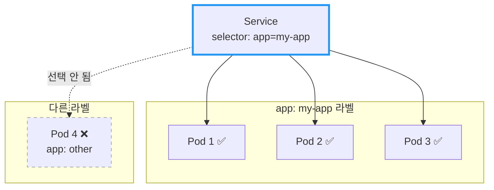

### 2.2 Endpoints와 EndpointSlice

Service를 만들면 Kubernetes가 자동으로 백엔드 Pod 목록을 관리한다.

**Endpoints (레거시)**

Endpoints는 "현재 트래픽을 받을 수 있는 Pod IP 목록"이다.

```bash
# Service 확인
$ kubectl get svc my-svc
NAME     TYPE        CLUSTER-IP    EXTERNAL-IP   PORT(S)   AGE
my-svc   ClusterIP   10.96.0.10    <none>        80/TCP    5m

# Endpoints 확인
$ kubectl get endpoints my-svc
NAME     ENDPOINTS                                   AGE
my-svc   10.1.1.5:8080,10.1.1.6:8080,10.1.1.7:8080   5m
```

**EndpointSlice (Kubernetes 1.21+ 기본값)**

EndpointSlice는 Endpoints의 확장성 문제를 해결한 새로운 방식이다.

```bash
# EndpointSlice 확인
$ kubectl get endpointslices -l kubernetes.io/service-name=my-svc
NAME             ADDRESSTYPE   PORTS   ENDPOINTS                    AGE
my-svc-abc12     IPv4          8080    10.1.1.5,10.1.1.6,10.1.1.7   5m
```

| 비교 | Endpoints | EndpointSlice |
|------|-----------|---------------|
| **확장성** | 최대 1,000개 Pod | 슬라이스당 100개, 무제한 확장 |
| **업데이트 범위** | 전체 목록 전송 | 변경된 슬라이스만 전송 |
| **토폴로지 정보** | 없음 | Zone, Node 정보 포함 |
| **Dual-stack** | 별도 관리 | IPv4/IPv6 자동 분리 |

**EndpointSlice의 Endpoint 상태**

EndpointSlice는 각 Endpoint의 상태를 세 가지로 추적한다:

| 상태 | 의미 | 트래픽 수신 |
|------|------|------------|
| **Ready** | 정상 동작 중 | ✅ |
| **Serving** | 응답 가능 (Terminating 포함) | ✅ |
| **Terminating** | 종료 중 | ⚠️ 조건부 |

Rolling Update 중 Terminating 상태의 Pod도 남은 요청을 처리할 수 있어 graceful shutdown에 유용하다.

**중요:** Readiness Probe가 실패한 Pod는 Endpoints/EndpointSlice에서 **제외**된다!

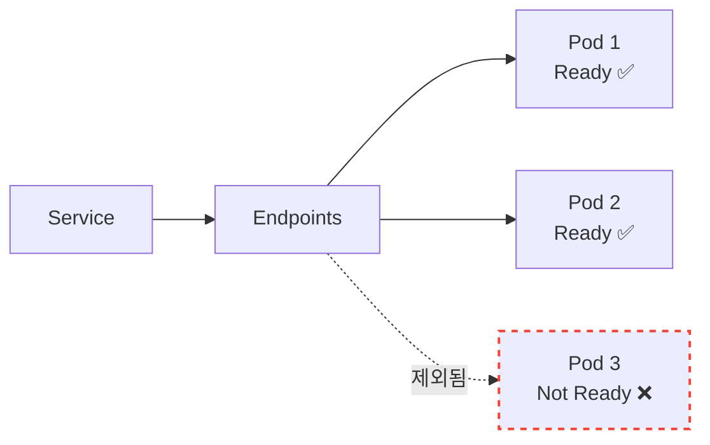

> 📖 Readiness Probe에 대한 자세한 내용은 [Kubernetes Probe: Liveness, Readiness, Startup](./Kubernetes-Probe-Liveness-Readiness-Startup.md) 문서를 참고하라.

---

## 3. Service 타입: ClusterIP

### 3.1 기본 타입

`ClusterIP`는 Service의 기본 타입이다. **클러스터 내부에서만** 접근 가능한 가상 IP를 할당받는다.

```yaml
apiVersion: v1
kind: Service
metadata:
  name: my-svc
spec:
  type: ClusterIP     # 기본값, 생략 가능
  selector:
    app: my-app
  ports:
  - port: 80
    targetPort: 8080
```

### 3.2 언제 사용하나?

클러스터 **내부** 서비스 간 통신에 사용한다:
- 백엔드 API → 데이터베이스
- 프론트엔드 → 백엔드 API
- 마이크로서비스 간 통신

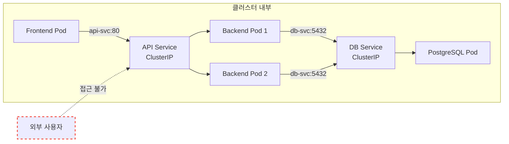

### 3.3 DNS로 접근하기

클러스터 내부에서는 Service 이름으로 DNS 조회가 가능하다:

```bash
# 같은 Namespace 내
curl http://my-svc:80

# 다른 Namespace의 Service
curl http://my-svc.other-namespace.svc.cluster.local:80
```

DNS 형식: `<service-name>.<namespace>.svc.cluster.local`

### 3.4 ClusterIP의 내부 동작

ClusterIP는 실제 네트워크 인터페이스에 할당된 IP가 아니다. **kube-proxy** 가 각 노드의 `iptables`나 `IPVS`를 이용해 관리하는 **가상 IP(Virtual IP)** 다.

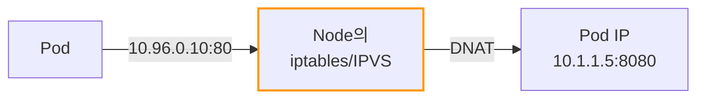

**동작 방식:**
1. Pod가 ClusterIP(10.96.0.10)로 요청 전송
2. Node의 iptables/IPVS 규칙이 패킷 가로챔
3. 목적지 주소를 실제 Pod IP로 변환(DNAT)
4. 백엔드 Pod로 트래픽 전달

이 때문에 ClusterIP는 `ifconfig`나 `ip addr` 명령으로 보이지 않지만, 클러스터 내 모든 노드에서 접근 가능하다.

---

## 4. Service 타입: Headless Service

### 4.1 ClusterIP 없는 Service

Headless Service는 `clusterIP: None`으로 설정하여 가상 IP를 할당받지 않는 특수한 Service다.

```yaml
apiVersion: v1
kind: Service
metadata:
  name: my-headless-svc
spec:
  clusterIP: None      # Headless Service
  selector:
    app: my-app
  ports:
  - port: 80
    targetPort: 8080
```

### 4.2 일반 Service vs Headless Service

| 구분 | 일반 Service | Headless Service |
|------|-------------|------------------|
| **ClusterIP** | 할당됨 (예: 10.96.0.10) | None |
| **DNS 응답** | ClusterIP 1개 | **Pod IP 목록** |
| **로드밸런싱** | kube-proxy가 수행 | 클라이언트가 직접 |
| **사용 사례** | 일반적인 서비스 | StatefulSet, 직접 Pod 접근 |

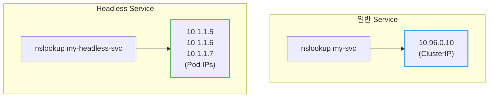

### 4.3 언제 사용하나?

**StatefulSet과 함께:**

StatefulSet의 각 Pod는 고유한 identity가 있다. Headless Service를 사용하면 각 Pod에 개별적으로 접근할 수 있다.

```yaml
apiVersion: v1
kind: Service
metadata:
  name: mysql
spec:
  clusterIP: None
  selector:
    app: mysql
  ports:
  - port: 3306
---
apiVersion: apps/v1
kind: StatefulSet
metadata:
  name: mysql
spec:
  serviceName: mysql    # Headless Service 이름
  replicas: 3
  # ...
```

```bash
# 각 Pod에 개별 접근
mysql-0.mysql.default.svc.cluster.local
mysql-1.mysql.default.svc.cluster.local
mysql-2.mysql.default.svc.cluster.local
```

> 📖 StatefulSet에 대한 자세한 내용은 [Kubernetes StatefulSet](./Kubernetes-StatefulSet.md) 문서를 참고하라.

**클라이언트 측 로드밸런싱:**

gRPC처럼 클라이언트가 직접 로드밸런싱해야 하는 경우에도 Headless Service가 유용하다.

---

## 5. Service 타입: NodePort

### 5.1 외부에서 접근하기

`NodePort`는 **모든 노드**의 특정 포트를 열어서 외부 접근을 허용한다.

```yaml
apiVersion: v1
kind: Service
metadata:
  name: my-svc
spec:
  type: NodePort
  selector:
    app: my-app
  ports:
  - port: 80          # Service 포트 (내부)
    targetPort: 8080  # Pod 포트
    nodePort: 30080   # 노드 포트 (30000-32767)
```

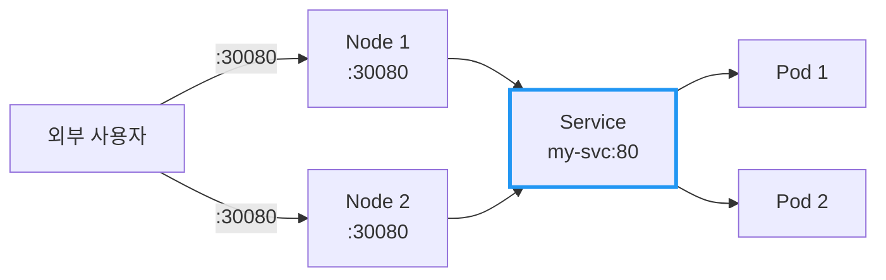

### 5.2 포트 범위

NodePort는 **30000-32767** 범위에서 할당된다:
- `nodePort` 지정 안 하면: 자동 할당
- 직접 지정 가능 (범위 내에서)

### 5.3 언제 사용하나?

| 상황 | 적합도 |
|------|--------|
| 개발/테스트 환경 | ✅ 적합 |
| 온프레미스 환경 (LB 없을 때) | ⚠️ 가능 |
| 프로덕션 (클라우드) | ❌ 비권장 |

**NodePort의 단점:**
- 노드 IP가 변경되면 접근 불가
- 노드가 죽으면 해당 경로 사용 불가
- 포트 범위 제한 (30000-32767)
- 노드 앞에 별도 로드밸런서 필요

---

## 6. Service 타입: LoadBalancer

### 6.1 클라우드 환경의 표준

`LoadBalancer`는 **클라우드 제공자의 로드밸런서**를 자동으로 프로비저닝한다.

```yaml
apiVersion: v1
kind: Service
metadata:
  name: my-svc
spec:
  type: LoadBalancer
  selector:
    app: my-app
  ports:
  - port: 80
    targetPort: 8080
```

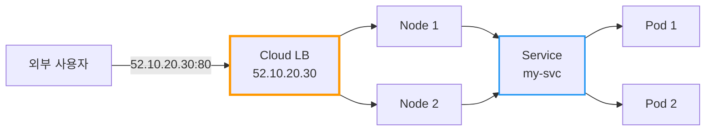

### 6.2 동작 방식

1. `LoadBalancer` 타입 Service 생성
2. 클라우드 제공자(AWS, GCP, Azure 등)가 LB 프로비저닝
3. 외부 IP 할당 (`EXTERNAL-IP`)
4. 트래픽: 외부 → LB → NodePort → Service → Pod

```bash
$ kubectl get svc my-svc
NAME     TYPE           CLUSTER-IP    EXTERNAL-IP    PORT(S)        AGE
my-svc   LoadBalancer   10.96.0.10    52.10.20.30    80:31234/TCP   5m
```

### 6.3 언제 사용하나?

| 상황 | 적합도 |
|------|--------|
| 프로덕션 (클라우드) | ✅ 적합 |
| 온프레미스 (MetalLB 등) | ✅ 가능 |
| 개발/테스트 | ⚠️ 비용 발생 |

**주의:** Service마다 LoadBalancer가 생성되므로, 여러 서비스를 노출할 때는 **Ingress** 사용을 권장한다.

---

## 7. Service 타입: ExternalName

### 7.1 외부 서비스를 내부 이름으로 매핑

`ExternalName`은 클러스터 **외부** 서비스에 내부 DNS 이름을 부여한다.

```yaml
apiVersion: v1
kind: Service
metadata:
  name: external-db
spec:
  type: ExternalName
  externalName: db.example.com    # 실제 외부 도메인
```

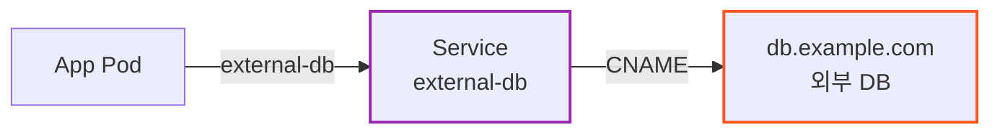

### 7.2 언제 사용하나?

- 외부 SaaS DB (AWS RDS, Cloud SQL 등) 연동
- 점진적 마이그레이션 (외부 → 내부로 이전 시)
- 환경별 분리 (개발은 외부, 프로덕션은 내부)

**장점:** 애플리케이션 코드 변경 없이 `external-db`로 호출하면 됨. 나중에 내부 DB로 전환해도 Service 설정만 바꾸면 된다.

---

## 8. Service 타입 비교

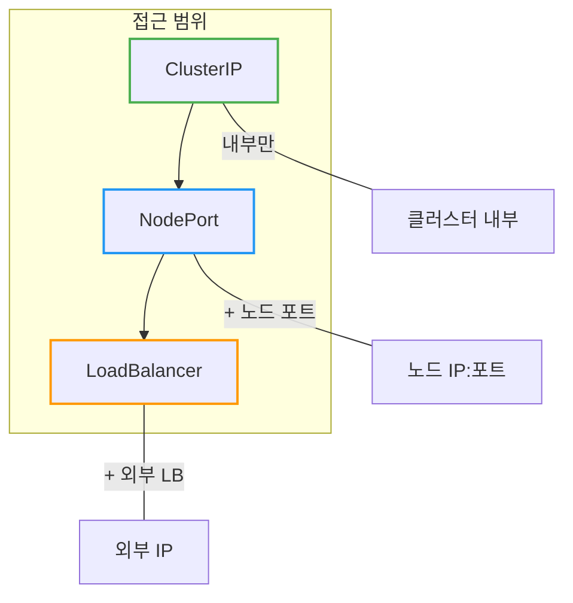

| 타입 | ClusterIP | NodePort | LoadBalancer |
|------|-----------|----------|--------------|
| **접근 범위** | 내부만 | 내부 + 노드 포트 | 내부 + 외부 IP |
| **외부 IP** | 없음 | 없음 (노드 IP 사용) | 있음 |
| **포트** | 제한 없음 | 30000-32767 | 제한 없음 |
| **비용** | 없음 | 없음 | 클라우드 LB 비용 |
| **사용 시점** | 내부 통신 | 개발/테스트 | 프로덕션 |

---

## 9. 실전 예시: 전체 구성

```yaml
---
# 1. 내부 서비스 (ClusterIP)
apiVersion: v1
kind: Service
metadata:
  name: backend-svc
spec:
  type: ClusterIP
  selector:
    app: backend
  ports:
  - port: 8080
    targetPort: 8080

---
# 2. 외부 노출 (LoadBalancer)
apiVersion: v1
kind: Service
metadata:
  name: frontend-svc
spec:
  type: LoadBalancer
  selector:
    app: frontend
  ports:
  - port: 80
    targetPort: 3000

---
# 3. 외부 DB 연동 (ExternalName)
apiVersion: v1
kind: Service
metadata:
  name: database
spec:
  type: ExternalName
  externalName: mydb.abc123.us-east-1.rds.amazonaws.com
```

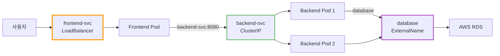

---

## 10. Service Traffic Policy

### 10.1 externalTrafficPolicy: Source IP 보존

LoadBalancer나 NodePort에서 클라이언트의 **실제 IP 주소(Source IP)** 가 필요할 때 사용한다.

```yaml
apiVersion: v1
kind: Service
metadata:
  name: my-svc
spec:
  type: LoadBalancer
  externalTrafficPolicy: Local    # 기본값: Cluster
  selector:
    app: my-app
  ports:
  - port: 80
    targetPort: 8080
```

| 설정 | Source IP | 트래픽 분산 | 사용 시점 |
|------|-----------|------------|----------|
| **Cluster** (기본) | SNAT으로 가려짐 | 모든 노드의 Pod로 분산 | 일반적인 경우 |
| **Local** | **보존됨** | 해당 노드의 Pod로만 | IP 기반 접근 제어, 로깅 |

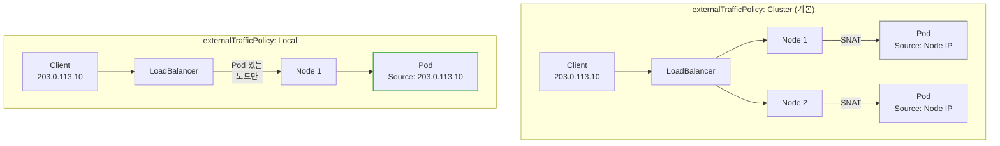

**Local의 주의점:**
- Pod가 없는 노드로 트래픽이 가면 **드롭됨**
- 클라우드 LB의 Health Check가 Pod 존재 여부를 확인해야 함
- Pod 분포에 따라 트래픽 불균형 발생 가능

### 10.2 internalTrafficPolicy: 내부 트래픽 최적화

클러스터 **내부** 트래픽을 같은 노드의 Pod로만 라우팅하여 네트워크 홉을 줄인다.

```yaml
apiVersion: v1
kind: Service
metadata:
  name: my-svc
spec:
  type: ClusterIP
  internalTrafficPolicy: Local    # 기본값: Cluster
  selector:
    app: my-app
  ports:
  - port: 80
    targetPort: 8080
```

| 설정 | 동작 | 사용 시점 |
|------|------|----------|
| **Cluster** (기본) | 모든 노드의 Pod로 분산 | 일반적인 경우 |
| **Local** | 같은 노드의 Pod로만 | 지연 시간 최소화 |

**Local의 주의점:** 해당 노드에 Pod가 없으면 트래픽이 **실패**한다.

---

## 11. Session Affinity (Sticky Session)

### 11.1 특정 클라이언트를 같은 Pod로

기본적으로 Service는 라운드 로빈으로 요청을 분산한다. **Session Affinity** 를 설정하면 같은 클라이언트의 요청을 동일한 Pod로 보낸다.

```yaml
apiVersion: v1
kind: Service
metadata:
  name: my-svc
spec:
  type: ClusterIP
  sessionAffinity: ClientIP           # 기본값: None
  sessionAffinityConfig:
    clientIP:
      timeoutSeconds: 10800           # 3시간 (기본값)
  selector:
    app: my-app
  ports:
  - port: 80
    targetPort: 8080
```

| 설정 | 동작 |
|------|------|
| **None** (기본) | 라운드 로빈 |
| **ClientIP** | 같은 IP의 요청은 같은 Pod로 |

### 11.2 언제 사용하나?

| 상황 | Session Affinity |
|------|-----------------|
| Stateless 애플리케이션 | None (기본) |
| 세션을 Pod 메모리에 저장 | **ClientIP** |
| WebSocket 연결 유지 | **ClientIP** |

**주의:**
- Pod가 죽으면 세션 정보가 유실된다. 프로덕션에서는 Redis 같은 외부 세션 스토어 사용을 권장한다.
- `ClientIP` 방식은 **L4 레벨(IP 기반)** 이다. NAT(회사 네트워크, 통신사 게이트웨이) 뒤의 사용자들은 동일한 Client IP로 보이기 때문에 트래픽이 한 Pod로 쏠릴 수 있다. 정교한 세션 유지가 필요하다면 **Ingress(L7) 레벨의 쿠키 기반 Sticky Session** 을 사용하라.

---

## 12. 클라우드 LoadBalancer 어노테이션

클라우드 환경에서 LoadBalancer Service를 세밀하게 제어하려면 **어노테이션** 을 사용한다.

### 12.1 AWS EKS (Network Load Balancer)

**외부 NLB (인터넷 노출):**

```yaml
apiVersion: v1
kind: Service
metadata:
  name: my-svc
  annotations:
    # AWS Load Balancer Controller가 관리하는 LB 생성
    service.beta.kubernetes.io/aws-load-balancer-type: "external"
    # Pod IP를 직접 타겟으로 지정 (VPC CNI 필요, Fargate 필수)
    service.beta.kubernetes.io/aws-load-balancer-nlb-target-type: "ip"
    # 인터넷 노출 (기본값)
    service.beta.kubernetes.io/aws-load-balancer-scheme: "internet-facing"
spec:
  type: LoadBalancer
  # ...
```

**내부 NLB (VPC 내부 전용):**

```yaml
apiVersion: v1
kind: Service
metadata:
  name: my-internal-svc
  annotations:
    service.beta.kubernetes.io/aws-load-balancer-type: "external"
    service.beta.kubernetes.io/aws-load-balancer-nlb-target-type: "ip"
    # VPC 내부에서만 접근 가능
    service.beta.kubernetes.io/aws-load-balancer-scheme: "internal"
    # 서브넷 지정 (선택)
    service.beta.kubernetes.io/aws-load-balancer-subnets: "subnet-xxx,subnet-yyy"
    # Health Check 경로 (선택)
    service.beta.kubernetes.io/aws-load-balancer-healthcheck-path: "/health"
spec:
  type: LoadBalancer
  # ...
```

| 어노테이션 | 설명 |
|-----------|------|
| `aws-load-balancer-type: external` | AWS Load Balancer Controller가 관리하는 LB 생성 |
| `aws-load-balancer-nlb-target-type: ip` | Pod IP 직접 타겟 (Fargate 필수) |
| `aws-load-balancer-scheme: internet-facing` | 외부 노출 (기본값) |
| `aws-load-balancer-scheme: internal` | VPC 내부 전용 |

> **참고:** AWS Load Balancer Controller가 없으면 기본적으로 **Classic Load Balancer(CLB)** 가 생성된다. NLB를 사용하려면 AWS Load Balancer Controller 설치가 필요하며, v2.5+부터는 자동으로 NLB를 생성한다.

### 12.2 GKE (Google Cloud)

```yaml
apiVersion: v1
kind: Service
metadata:
  name: my-svc
  annotations:
    # Internal LB
    networking.gke.io/load-balancer-type: "Internal"

    # NEG (Network Endpoint Group) 활성화 - 독립형 Service용
    cloud.google.com/neg: '{"exposed": true}'

    # Backend Service 기반 외부 LB (1.32.2+)
    cloud.google.com/l4-rbs: "enabled"
spec:
  type: LoadBalancer
  # ...
```

| 어노테이션 | 설명 |
|-----------|------|
| `networking.gke.io/load-balancer-type: Internal` | Internal LB |
| `cloud.google.com/neg` | Container-native 로드밸런싱 |
| `cloud.google.com/l4-rbs: enabled` | NEG 기반 외부 LB |

### 12.3 Azure AKS

```yaml
apiVersion: v1
kind: Service
metadata:
  name: my-svc
  annotations:
    # Internal LB
    service.beta.kubernetes.io/azure-load-balancer-internal: "true"

    # 특정 서브넷에 배치
    service.beta.kubernetes.io/azure-load-balancer-internal-subnet: "apps-subnet"

    # 고정 IP 지정
    service.beta.kubernetes.io/azure-load-balancer-ipv4: "10.0.0.100"

    # Private Link Service 생성
    service.beta.kubernetes.io/azure-pls-create: "true"
spec:
  type: LoadBalancer
  # ...
```

| 어노테이션 | 설명 |
|-----------|------|
| `azure-load-balancer-internal: true` | Internal LB |
| `azure-load-balancer-internal-subnet` | 서브넷 지정 |
| `azure-pls-create: true` | Private Link Service |

---

## 13. Service 디버깅

### 13.1 연결 문제 체크리스트

Service에 연결이 안 될 때 확인할 순서:

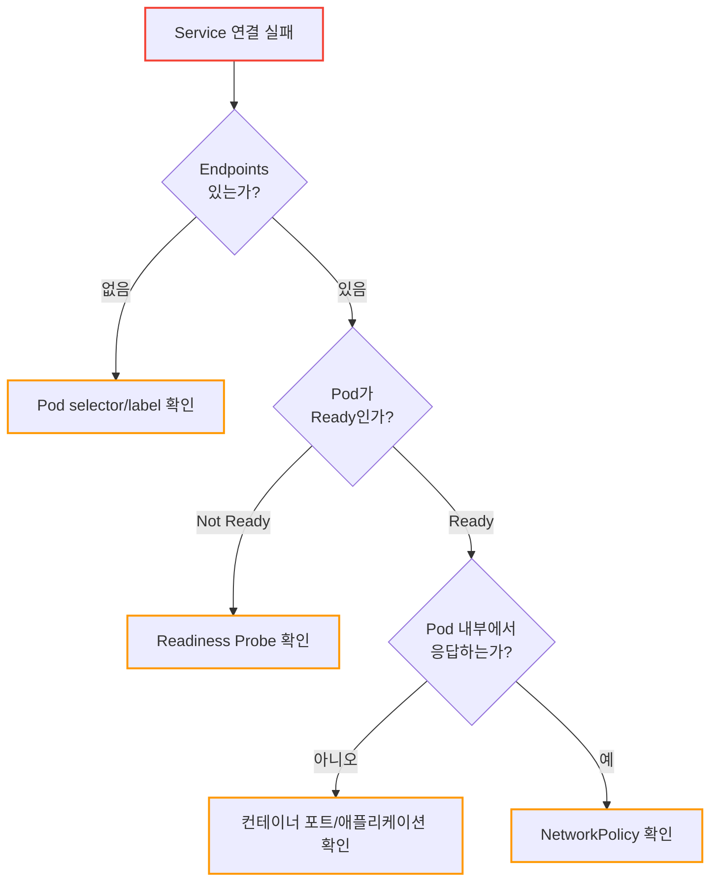

### 13.2 디버깅 명령어

```bash
# 1. Service 상태 확인
kubectl get svc my-svc -o wide
kubectl describe svc my-svc

# 2. Endpoints 확인 (가장 중요!)
kubectl get endpoints my-svc
# ENDPOINTS가 비어있으면 → selector/label 불일치 또는 Pod가 Ready가 아님

# 3. EndpointSlice 확인 (상세 정보)
kubectl get endpointslices -l kubernetes.io/service-name=my-svc -o yaml

# 4. Pod 상태 확인
kubectl get pods -l app=my-app
kubectl describe pod <pod-name>

# 5. Service DNS 확인 (클러스터 내부에서)
kubectl run debug --rm -it --image=busybox -- nslookup my-svc

# 6. Service 직접 호출 테스트
kubectl run debug --rm -it --image=curlimages/curl -- curl -v my-svc:80

# 7. Pod 직접 호출 테스트 (Service 우회)
kubectl exec -it <pod-name> -- curl localhost:8080
```

### 13.3 자주 발생하는 문제

| 증상 | 원인 | 해결 |
|------|------|------|
| Endpoints가 비어있음 | selector와 Pod label 불일치 | label 확인 및 수정 |
| Endpoints는 있지만 연결 안 됨 | Readiness Probe 실패 | Probe 설정 및 애플리케이션 확인 |
| ClusterIP로 접근 안 됨 | NetworkPolicy 차단 | NetworkPolicy 규칙 확인 |
| LoadBalancer EXTERNAL-IP가 `<pending>` | 클라우드 컨트롤러 문제 | 클라우드 권한, 할당량 확인 |
| 외부에서 LoadBalancer 접근 안 됨 | Security Group/방화벽 | 클라우드 보안 규칙 확인 |

---

## 14. 자주 쓰는 명령어

```bash
# Service 목록 조회
kubectl get svc

# Service 상세 정보
kubectl describe svc my-svc

# Endpoints 확인 (실제 Pod IP 목록)
kubectl get endpoints my-svc

# Service 생성 (명령형)
kubectl expose deployment my-app --port=80 --target-port=8080

# Service 삭제
kubectl delete svc my-svc
```

---

## 15. 정리

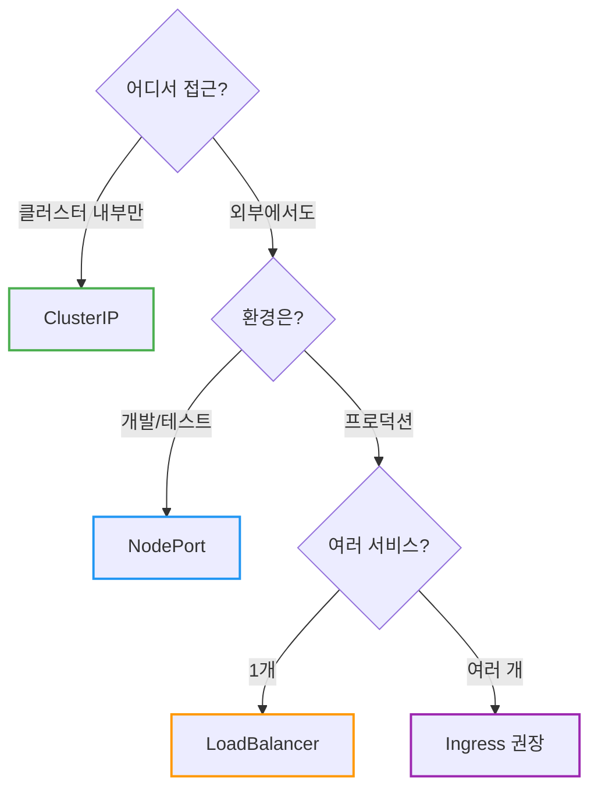

| 질문 | 답변 |
|------|------|
| Pod IP로 직접 호출해도 되나요? | ❌ Pod IP는 변경됨, Service 사용 |
| ClusterIP vs NodePort 차이? | ClusterIP는 내부만, NodePort는 외부도 가능 |
| 프로덕션에서 뭘 써야 하나요? | LoadBalancer 또는 Ingress |
| Source IP가 필요하면? | `externalTrafficPolicy: Local` 설정 |

**핵심 기억:**
1. **Service** 는 Pod에 대한 안정적인 엔드포인트 (IP, DNS)
2. **ClusterIP** 는 내부 통신, **LoadBalancer** 는 외부 노출
3. **LoadBalancer** 타입은 NodePort와 ClusterIP의 확장형 (자동 생성)
4. **Selector** 로 Pod를 선택, **EndpointSlice** 로 실제 목적지 관리
5. Readiness Probe 실패 → Endpoints에서 제외 → 트래픽 차단
6. **externalTrafficPolicy: Local** 로 Source IP 보존

> 📖 관련 문서:
> - [Kubernetes Ingress](./Kubernetes-Ingress.md)
> - [Kubernetes Probe: Liveness, Readiness, Startup](./Kubernetes-Probe-Liveness-Readiness-Startup.md)

---

## 출처

- [Kubernetes Documentation - Service](https://kubernetes.io/docs/concepts/services-networking/service/) - 공식 문서
- [Kubernetes Documentation - EndpointSlices](https://kubernetes.io/docs/concepts/services-networking/endpoint-slices/) - 공식 문서
- [Kubernetes Documentation - Service Traffic Policy](https://kubernetes.io/docs/concepts/services-networking/service-traffic-policy/) - 공식 문서
- [Kubernetes Documentation - DNS for Services and Pods](https://kubernetes.io/docs/concepts/services-networking/dns-pod-service/) - 공식 문서
- [AWS Load Balancer Controller - Annotations](https://kubernetes-sigs.github.io/aws-load-balancer-controller/latest/guide/service/annotations/) - AWS 공식 문서
- [GKE LoadBalancer Service Parameters](https://cloud.google.com/kubernetes-engine/docs/concepts/service-load-balancer-parameters) - GCP 공식 문서
- [Azure AKS Internal Load Balancer](https://learn.microsoft.com/en-us/azure/aks/internal-lb) - Azure 공식 문서
