# Kubernetes Service: ClusterIP, NodePort, LoadBalancer

Pod의 IP로 직접 접근하면 안 되는 이유가 뭘까?

> 📚 **Service 시리즈 읽는 순서**
> 1. [Kubernetes Service Object](./Kubernetes-Service-Object.md) - Service는 어떤 오브젝트인가
> 2. [Kubernetes Service: ClusterIP, NodePort, LoadBalancer](./Kubernetes-Service-ClusterIP-NodePort-LoadBalancer.md) - 타입별로 어떻게 쓰는가 ← 지금 읽는 글
> 3. [Kubernetes Service Internals](./Kubernetes-Service-Internals.md) - 내부에서 어떻게 동작하는가
> 4. [Kubernetes Service LoadBalancer (Cloud)](./Kubernetes-Service-LoadBalancer-Cloud.md) - 클라우드 LB와는 어떻게 연결되는가
>
> 다음 단계: [Kubernetes Ingress](./Kubernetes-Ingress.md) - 여러 Service를 하나의 HTTP 진입점으로 묶기

## 결론부터 말하면

**Service**는 Pod 집합에 대한 **안정적인 네트워크 엔드포인트**를 제공한다. Pod는 죽었다 살아나면 IP가 바뀌지만, Service의 IP는 변하지 않는다.

단, Service 자체는 트래픽을 중계하는 서버가 아니다. 내부에서 실제로 어떻게 동작하는지는 [Kubernetes Service Internals](./Kubernetes-Service-Internals.md)에서 다룬다.

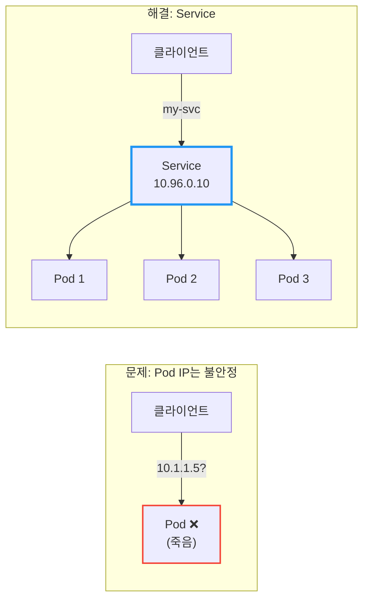
```mermaid
flowchart LR
    subgraph "문제: Pod IP는 불안정"
        Client1[클라이언트] -->|"10.1.1.5?"| P1["Pod ❌<br>(죽음)"]
    end

    subgraph "해결: Service"
        Client2[클라이언트] -->|"my-svc"| SVC[Service<br>10.96.0.10]
        SVC --> P2[Pod 1]
        SVC --> P3[Pod 2]
        SVC --> P4[Pod 3]
    end

    style P1 stroke:#f44336,stroke-width:2px
    style SVC stroke:#2196F3,stroke-width:3px
```

| Service 타입 | 접근 범위 | 사용 시점 |
|-------------|----------|----------|
| **ClusterIP** | 클러스터 내부만 | 내부 서비스 간 통신 (기본값) |
| **NodePort** | 클러스터 외부 (노드 IP:포트) | 개발/테스트 환경 |
| **LoadBalancer** | 클러스터 외부 (LB IP) | 프로덕션 환경 (클라우드) |
| **ExternalName** | 외부 DNS로 매핑 | 외부 서비스 연동 |

---

## 1. 왜 Service가 필요한가?

### 1.1 Pod IP의 문제점

Pod를 직접 IP로 호출하면 어떤 문제가 생길까?

**문제 1: Pod IP는 휘발성이다**

Pod가 삭제되고 새 Pod로 교체되면 IP가 바뀐다(같은 Pod 안에서 컨테이너만 재시작되는 경우는 IP가 유지된다). Deployment가 롤링 업데이트를 하면? 새 Pod는 새 IP를 받는다.

```
# 처음 배포
my-app-pod-abc12: 10.1.1.5

# 롤링 업데이트 후
my-app-pod-xyz99: 10.1.1.87  ← IP가 바뀜!
```

**문제 2: 여러 Pod에 로드밸런싱이 안 된다**

`replicas: 3`으로 Pod를 3개 띄웠다. 클라이언트가 어떤 Pod로 요청을 보내야 할까? 직접 IP를 알아내서 번갈아 호출해야 하나?

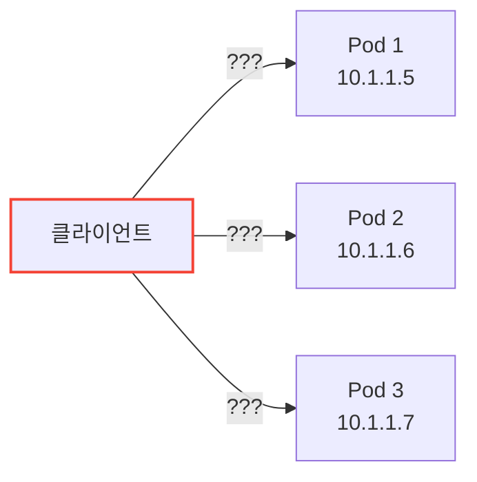
```mermaid
flowchart LR
    Client[클라이언트] -->|"???"| P1[Pod 1<br>10.1.1.5]
    Client -->|"???"| P2[Pod 2<br>10.1.1.6]
    Client -->|"???"| P3[Pod 3<br>10.1.1.7]

    style Client stroke:#f44336,stroke-width:2px
```

**문제 3: 서비스 디스커버리가 없다**

새 Pod가 추가되거나 기존 Pod가 죽으면, 클라이언트는 어떻게 알 수 있을까? 모든 클라이언트가 Pod 목록을 실시간으로 추적해야 한다.

### 1.2 Service의 해결책

Service는 이 모든 문제를 해결한다:

| 문제 | Service의 해결책 |
|------|-----------------|
| Pod IP 변경 | Service IP는 **고정** (ClusterIP) |
| 로드밸런싱 | 자동으로 **분산** |
| 서비스 디스커버리 | DNS로 **이름 조회** 가능 |

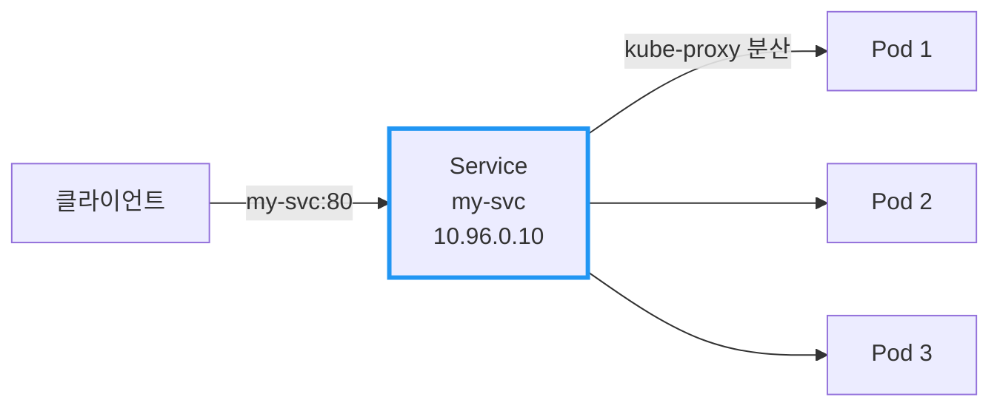
```mermaid
flowchart LR
    Client[클라이언트] -->|"my-svc:80"| SVC[Service<br>my-svc<br>10.96.0.10]
    SVC -->|"kube-proxy 분산"| P1[Pod 1]
    SVC --> P2[Pod 2]
    SVC --> P3[Pod 3]

    style SVC stroke:#2196F3,stroke-width:3px
```

> **분산 알고리즘 주의:** Service의 트래픽 분산 방식은 kube-proxy 모드에 따라 다르다. **iptables 모드(기본)** 와 nftables 모드는 백엔드를 **무작위(random)** 로 선택하고, **IPVS 모드** (v1.35부터 deprecated)는 스케줄러 설정에 따라 `rr`(round-robin), `lc`(least connection) 등 다양한 알고리즘을 지원한다. "라운드 로빈"은 일반화된 표현일 뿐 기본 동작이 아니다.

클라이언트는 `my-svc`라는 이름만 알면 된다. Pod가 몇 개인지, IP가 뭔지 몰라도 된다.

---

## 2. Service의 동작 원리

### 2.1 Label Selector로 Pod 선택

Service는 **Label**로 어떤 Pod에 트래픽을 보낼지 결정한다.

```yaml
apiVersion: v1
kind: Service
metadata:
  name: my-svc
spec:
  selector:
    app: my-app       # 이 라벨을 가진 Pod들에게 트래픽 전달
  ports:
  - port: 80          # Service 포트
    targetPort: 8080  # Pod의 컨테이너 포트 (숫자 또는 이름)
```

**targetPort는 포트 이름으로도 지정 가능하다:**

```yaml
# Service - 포트 이름으로 참조
spec:
  ports:
  - port: 80
    targetPort: http   # Pod에 정의된 포트 이름

---
# Pod - 포트에 이름 부여
spec:
  containers:
  - name: app
    ports:
    - name: http       # targetPort에서 참조할 이름
      containerPort: 8080
```

이 방식의 장점: Pod의 포트 번호가 `8080 → 9090`으로 바뀌어도 Service 수정이 필요 없다.

```yaml
apiVersion: apps/v1
kind: Deployment
metadata:
  name: my-app
spec:
  replicas: 3
  selector:
    matchLabels:
      app: my-app
  template:
    metadata:
      labels:
        app: my-app   # Service의 selector와 일치!
    spec:
      containers:
      - name: app
        image: my-app:1.0
        ports:
        - containerPort: 8080
```

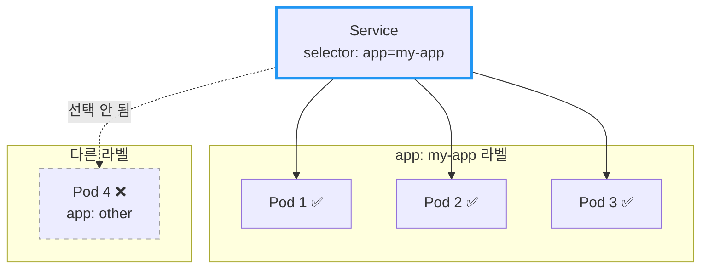
```mermaid
flowchart TB
    SVC["Service<br>selector: app=my-app"]

    subgraph "app: my-app 라벨"
        P1[Pod 1 ✅]
        P2[Pod 2 ✅]
        P3[Pod 3 ✅]
    end

    subgraph "다른 라벨"
        P4["Pod 4 ❌<br>app: other"]
    end

    SVC --> P1
    SVC --> P2
    SVC --> P3
    SVC -.->|"선택 안 됨"| P4

    style SVC stroke:#2196F3,stroke-width:3px
    style P4 stroke:#9E9E9E,stroke-width:1px,stroke-dasharray: 5 5
```

### 2.2 Endpoints와 EndpointSlice

Service를 만들면 Kubernetes가 자동으로 백엔드 Pod 목록을 관리한다.

**Endpoints (레거시)**

Endpoints는 "현재 트래픽을 받을 수 있는 Pod IP 목록"이다. Endpoints API는 Kubernetes v1.33에서 공식 deprecated 되었다. `kubectl get endpoints`는 여전히 동작하지만 deprecation 경고가 출력되며, 새 코드·도구는 EndpointSlice를 쓴다. ([Kubernetes 블로그, 2025-04-24](https://kubernetes.io/blog/2025/04/24/endpoints-deprecation/))

```bash
# Service 확인
$ kubectl get svc my-svc
NAME     TYPE        CLUSTER-IP    EXTERNAL-IP   PORT(S)   AGE
my-svc   ClusterIP   10.96.0.10    <none>        80/TCP    5m

# Endpoints 확인
$ kubectl get endpoints my-svc
NAME     ENDPOINTS                                   AGE
my-svc   10.1.1.5:8080,10.1.1.6:8080,10.1.1.7:8080   5m
```

**EndpointSlice (Kubernetes 1.21+ 기본값)**

EndpointSlice는 Endpoints의 확장성 문제를 해결한 새로운 방식이다.

```bash
# EndpointSlice 확인
$ kubectl get endpointslices -l kubernetes.io/service-name=my-svc
NAME             ADDRESSTYPE   PORTS   ENDPOINTS                    AGE
my-svc-abc12     IPv4          8080    10.1.1.5,10.1.1.6,10.1.1.7   5m
```

| 비교 | Endpoints | EndpointSlice |
|------|-----------|---------------|
| **확장성** | 단일 객체에 모두 포함 (1,000개 초과 시 목록이 잘리고 `endpoints.kubernetes.io/over-capacity: truncated` 어노테이션이 붙음) | 슬라이스당 기본 100개(최대 1,000개 설정 가능), 여러 슬라이스로 자동 분할되어 1,000개 제한이 없음 |
| **업데이트 범위** | 전체 목록 전송 | 변경된 슬라이스만 전송 |
| **토폴로지 정보** | Node 정보(`nodeName`)만 있고 Zone 필드는 없음 | Zone, Node 정보 포함 |
| **Dual-stack** | 미지원 (클러스터의 기본 IP family 주소만 표시) | IPv4/IPv6를 별도 슬라이스로 자동 분리 |

**EndpointSlice의 Endpoint 상태**

EndpointSlice는 각 Endpoint의 상태를 세 가지로 추적한다:

| 상태 | 의미 | 트래픽 수신 |
|------|------|------------|
| **Ready** | 정상 동작 중 (serving이면서 terminating이 아님) | ✅ |
| **Serving** | 응답 가능 (Pod의 Ready 조건과 대응, Terminating 중에도 true일 수 있음) | ⚠️ 조건부 (terminating이 아닐 때) |
| **Terminating** | 종료 중 | ⚠️ 기본적으로 제외. 단, 사용 가능한 endpoint가 모두 종료 중이면 serving인 것으로 보낼 수 있음 |

이 마지막 규칙 덕분에 Rolling Update 중 모든 Pod가 종료 단계에 들어가도 트래픽이 끊기지 않아 graceful shutdown에 유용하다.

**중요:** Readiness Probe가 실패한 Pod는 트래픽 대상에서 **제외** 된다. 단, 객체에서 지워지는 것은 아니다. EndpointSlice에는 `conditions.ready: false`로, 레거시 Endpoints에는 `notReadyAddresses`로 남고, kube-proxy가 이 상태를 보고 해당 Pod를 규칙에서 뺀다. 예외로 `spec.publishNotReadyAddresses: true`인 Service는 Ready 여부와 관계없이 모든 Pod를 ready로 취급한다.

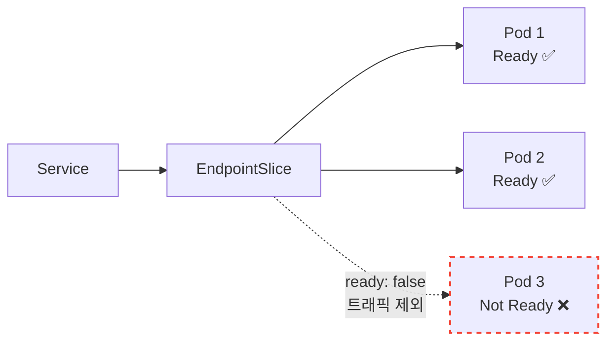
```mermaid
flowchart LR
    SVC[Service] --> EP[EndpointSlice]

    EP --> P1["Pod 1<br>Ready ✅"]
    EP --> P2["Pod 2<br>Ready ✅"]
    EP -.->|"ready: false<br>트래픽 제외"| P3["Pod 3<br>Not Ready ❌"]

    style P3 stroke:#f44336,stroke-width:2px,stroke-dasharray: 5 5
```

> 📖 Readiness Probe에 대한 자세한 내용은 [Kubernetes Probe: Liveness, Readiness, Startup](./Kubernetes-Probe-Liveness-Readiness-Startup.md) 문서를 참고하라.

---

## 3. Service 타입: ClusterIP

### 3.1 기본 타입

`ClusterIP`는 Service의 기본 타입이다. **클러스터 내부에서만** 접근 가능한 가상 IP를 할당받는다.

```yaml
apiVersion: v1
kind: Service
metadata:
  name: my-svc
spec:
  type: ClusterIP     # 기본값, 생략 가능
  selector:
    app: my-app
  ports:
  - port: 80
    targetPort: 8080
```

### 3.2 언제 사용하나?

클러스터 **내부** 서비스 간 통신에 사용한다:
- 백엔드 API → 데이터베이스
- 프론트엔드 → 백엔드 API
- 마이크로서비스 간 통신

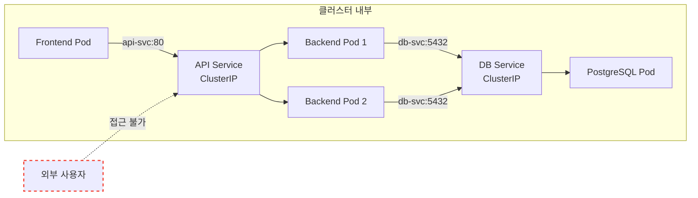
```mermaid
flowchart LR
    subgraph "클러스터 내부"
        FE[Frontend Pod] -->|"api-svc:80"| API[API Service<br>ClusterIP]
        API --> BE1[Backend Pod 1]
        API --> BE2[Backend Pod 2]

        BE1 -->|"db-svc:5432"| DB[DB Service<br>ClusterIP]
        BE2 -->|"db-svc:5432"| DB
        DB --> PG[PostgreSQL Pod]
    end

    External[외부 사용자] -.->|"접근 불가"| API

    style External stroke:#f44336,stroke-width:2px,stroke-dasharray: 5 5
```

### 3.3 DNS로 접근하기

클러스터 내부에서는 Service 이름으로 DNS 조회가 가능하다:

```bash
# 같은 Namespace 내
curl http://my-svc:80

# 다른 Namespace의 Service
curl http://my-svc.other-namespace.svc.cluster.local:80
```

DNS 형식: `<service-name>.<namespace>.svc.cluster.local`

### 3.4 ClusterIP의 내부 동작

ClusterIP를 가진 서버나 프로세스는 어디에도 없다. Service는 etcd에 저장된 선언이고, 각 노드에서 도는 **kube-proxy** 가 이 선언을 보고 커널에 주소 변환 규칙을 써 넣는다. Pod가 ClusterIP로 보낸 패킷은 보내는 쪽 노드의 커널에서 목적지가 실제 Pod IP로 바뀐다(DNAT, Destination NAT). 그래서 ClusterIP는 `ip addr`로 보이지 않는데도 클러스터의 모든 노드에서 접근할 수 있다. 이는 기본값인 iptables 모드와 nftables 모드 기준이며, deprecated된 IPVS 모드만 예외적으로 ClusterIP를 `kube-ipvs0` 인터페이스에 붙인다.

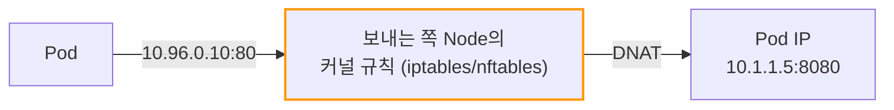
```mermaid
flowchart LR
    Pod[Pod] -->|"10.96.0.10:80"| Node["보내는 쪽 Node의<br>커널 규칙 (iptables/nftables)"]
    Node -->|"DNAT"| Backend["Pod IP<br>10.1.1.5:8080"]

    style Node stroke:#FF9800,stroke-width:2px
```

> 📖 패킷이 실제로 어떤 경로로 바뀌는지, ClusterIP에 ping이 안 되는 이유, gRPC 부하가 한 Pod에 몰리는 이유, Traffic Policy와 Session Affinity의 동작 원리는 [Kubernetes Service Internals](./Kubernetes-Service-Internals.md)에서 다룬다.

---

## 4. Service 타입: Headless Service

### 4.1 ClusterIP 없는 Service

Headless Service는 `clusterIP: None`으로 설정하여 가상 IP를 할당받지 않는 특수한 Service다.

```yaml
apiVersion: v1
kind: Service
metadata:
  name: my-headless-svc
spec:
  clusterIP: None      # Headless Service
  selector:
    app: my-app
  ports:
  - port: 80
    targetPort: 8080
```

### 4.2 일반 Service vs Headless Service

| 구분 | 일반 Service | Headless Service |
|------|-------------|------------------|
| **ClusterIP** | 할당됨 (예: 10.96.0.10) | None |
| **DNS 응답** | ClusterIP 1개 | **Pod IP 목록** |
| **로드밸런싱** | kube-proxy가 수행 | 클라이언트가 직접 |
| **사용 사례** | 일반적인 서비스 | StatefulSet, 직접 Pod 접근 |

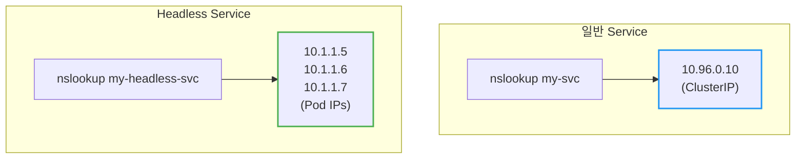
```mermaid
flowchart TB
    subgraph "일반 Service"
        DNS1["nslookup my-svc"] --> IP1["10.96.0.10<br>(ClusterIP)"]
    end

    subgraph "Headless Service"
        DNS2["nslookup my-headless-svc"] --> IP2["10.1.1.5<br>10.1.1.6<br>10.1.1.7<br>(Pod IPs)"]
    end

    style IP1 stroke:#2196F3,stroke-width:2px
    style IP2 stroke:#4CAF50,stroke-width:2px
```

### 4.3 언제 사용하나?

**StatefulSet과 함께:**

StatefulSet의 각 Pod는 고유한 identity가 있다. Headless Service를 사용하면 각 Pod에 개별적으로 접근할 수 있다.

```yaml
apiVersion: v1
kind: Service
metadata:
  name: mysql
spec:
  clusterIP: None
  selector:
    app: mysql
  ports:
  - port: 3306
---
apiVersion: apps/v1
kind: StatefulSet
metadata:
  name: mysql
spec:
  serviceName: mysql    # Headless Service 이름
  replicas: 3
  # ...
```

```bash
# 각 Pod에 개별 접근
mysql-0.mysql.default.svc.cluster.local
mysql-1.mysql.default.svc.cluster.local
mysql-2.mysql.default.svc.cluster.local
```

> 📖 StatefulSet에 대한 자세한 내용은 [Kubernetes StatefulSet](./Kubernetes-StatefulSet.md) 문서를 참고하라.

**클라이언트 측 로드밸런싱:**

gRPC처럼 클라이언트가 직접 로드밸런싱해야 하는 경우에도 Headless Service가 유용하다.

---

## 5. Service 타입: NodePort

### 5.1 외부에서 접근하기

`NodePort`는 **모든 노드**의 특정 포트를 열어서 외부 접근을 허용한다.

```yaml
apiVersion: v1
kind: Service
metadata:
  name: my-svc
spec:
  type: NodePort
  selector:
    app: my-app
  ports:
  - port: 80          # Service 포트 (내부)
    targetPort: 8080  # Pod 포트
    nodePort: 30080   # 노드 포트 (30000-32767)
```

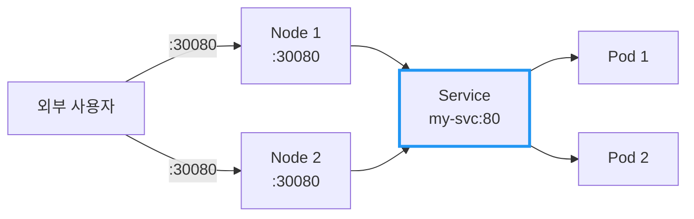
```mermaid
flowchart LR
    External[외부 사용자] -->|"<NodeIP>:30080"| Node1[Node 1<br>:30080]
    External -->|"<NodeIP>:30080"| Node2[Node 2<br>:30080]

    Node1 --> SVC[Service<br>my-svc:80]
    Node2 --> SVC

    SVC --> P1[Pod 1]
    SVC --> P2[Pod 2]

    style SVC stroke:#2196F3,stroke-width:3px
```

### 5.2 포트 범위

NodePort는 **30000-32767** 범위에서 할당된다:
- `nodePort` 지정 안 하면: 자동 할당
- 직접 지정 가능 (범위 내에서)

### 5.3 언제 사용하나?

| 상황 | 적합도 |
|------|--------|
| 개발/테스트 환경 | ✅ 적합 |
| 온프레미스 환경 (LB 없을 때) | ⚠️ 가능 |
| 프로덕션 (클라우드) | ❌ 비권장 |

**NodePort의 단점:**
- 노드 IP가 변경되면 접근 불가
- 노드가 죽으면 해당 경로 사용 불가
- 포트 범위 제한 (30000-32767)
- 노드 앞에 별도 로드밸런서 필요

---

## 6. Service 타입: LoadBalancer

### 6.1 클라우드 환경의 표준

`LoadBalancer`는 **클라우드 제공자의 로드밸런서**를 자동으로 프로비저닝한다.

```yaml
apiVersion: v1
kind: Service
metadata:
  name: my-svc
spec:
  type: LoadBalancer
  selector:
    app: my-app
  ports:
  - port: 80
    targetPort: 8080
```

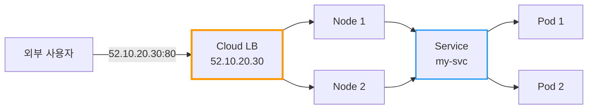
```mermaid
flowchart LR
    External[외부 사용자] -->|"52.10.20.30:80"| LB[Cloud LB<br>52.10.20.30]

    LB --> Node1[Node 1]
    LB --> Node2[Node 2]

    Node1 --> SVC[Service<br>my-svc]
    Node2 --> SVC

    SVC --> P1[Pod 1]
    SVC --> P2[Pod 2]

    style LB stroke:#FF9800,stroke-width:3px
    style SVC stroke:#2196F3,stroke-width:2px
```

### 6.2 동작 방식

1. `LoadBalancer` 타입 Service 생성
2. 그 Service를 맡은 컨트롤러(클라우드의 service controller 등)가 클라우드 API로 LB 프로비저닝
3. 컨트롤러가 LB 주소를 `status.loadBalancer`에 기록 → `EXTERNAL-IP`로 표시
4. 트래픽: 외부 → LB → NodePort → Service → Pod (노드를 타겟으로 하는 일반적인 구성 기준. AWS NLB의 `ip` 타겟처럼 LB가 Pod IP로 직접 보내는 구성은 NodePort를 거치지 않는다)

```bash
$ kubectl get svc my-svc
NAME     TYPE           CLUSTER-IP    EXTERNAL-IP    PORT(S)        AGE
my-svc   LoadBalancer   10.96.0.10    52.10.20.30    80:31234/TCP   5m
```

> 📖 LB를 실제로 만드는 컨트롤러, 온프레미스에서 `EXTERNAL-IP`가 `<pending>`으로 남는 이유, AWS·GKE·AKS별 어노테이션은 [Kubernetes Service LoadBalancer (Cloud)](./Kubernetes-Service-LoadBalancer-Cloud.md)에서 다룬다.

### 6.3 언제 사용하나?

| 상황 | 적합도 |
|------|--------|
| 프로덕션 (클라우드) | ✅ 적합 |
| 온프레미스 (MetalLB 등) | ✅ 가능 |
| 개발/테스트 | ⚠️ 비용 발생 |

**주의:** Service마다 LoadBalancer가 생성되므로, 여러 서비스를 노출할 때는 **Ingress** 사용을 권장한다.

---

## 7. Service 타입: ExternalName

### 7.1 외부 서비스를 내부 이름으로 매핑

`ExternalName`은 클러스터 **외부** 서비스에 내부 DNS 이름을 부여한다.

```yaml
apiVersion: v1
kind: Service
metadata:
  name: external-db
spec:
  type: ExternalName
  externalName: db.example.com    # 실제 외부 도메인
```


```mermaid
flowchart LR
    App[App Pod] -->|"external-db"| SVC[Service<br>external-db]
    SVC -->|"CNAME"| ExtDB[db.example.com<br>외부 DB]

    style SVC stroke:#9C27B0,stroke-width:2px
    style ExtDB stroke:#FF5722,stroke-width:2px
```

### 7.2 언제 사용하나?

- 외부 SaaS DB (AWS RDS, Cloud SQL 등) 연동
- 점진적 마이그레이션 (외부 → 내부로 이전 시)
- 환경별 분리 (개발은 외부, 프로덕션은 내부)

**장점:** 애플리케이션 코드 변경 없이 `external-db`로 호출하면 됨. 나중에 내부 DB로 전환해도 Service 설정만 바꾸면 된다.

---

## 8. Service 타입 비교

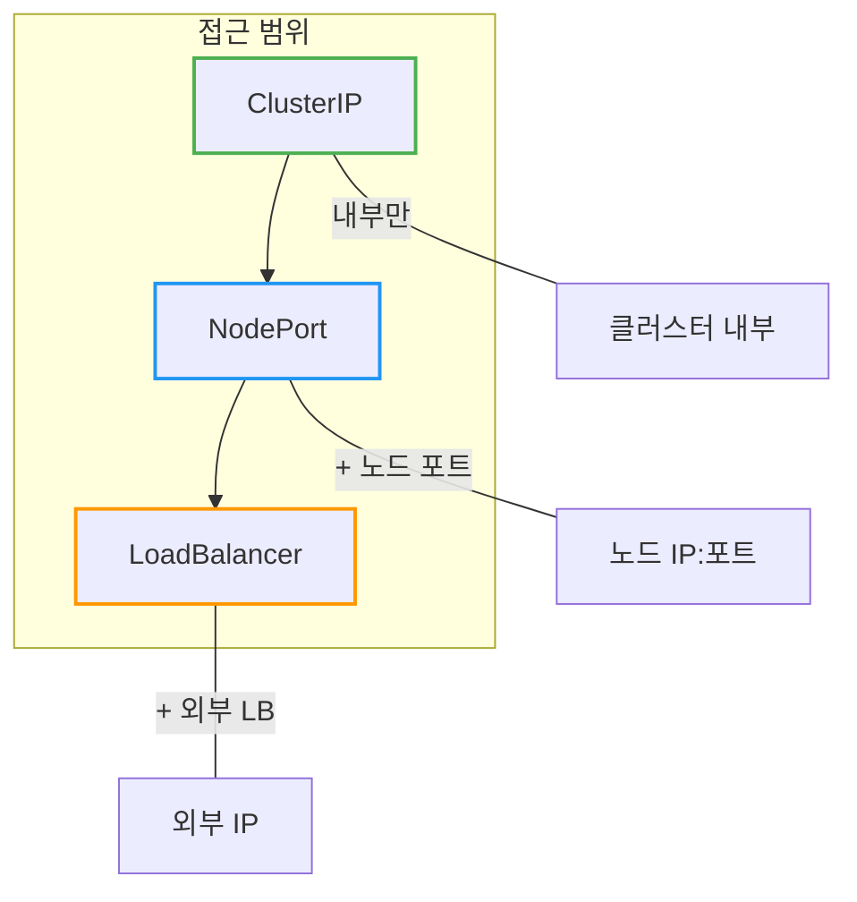
```mermaid
flowchart TB
    subgraph "접근 범위"
        direction LR
        CI[ClusterIP] --> NP[NodePort] --> LB[LoadBalancer]
    end

    CI ---|"내부만"| Internal[클러스터 내부]
    NP ---|"+ 노드 포트"| NodeAccess[노드 IP:포트]
    LB ---|"+ 외부 LB"| ExternalAccess[외부 IP]

    style CI stroke:#4CAF50,stroke-width:2px
    style NP stroke:#2196F3,stroke-width:2px
    style LB stroke:#FF9800,stroke-width:2px
```

| 타입 | ClusterIP | NodePort | LoadBalancer |
|------|-----------|----------|--------------|
| **접근 범위** | 내부만 | 내부 + 노드 포트 | 내부 + 외부 IP |
| **외부 IP** | 없음 | 없음 (노드 IP 사용) | 있음 |
| **포트** | 제한 없음 | 30000-32767 | 제한 없음 |
| **비용** | 없음 | 없음 | 클라우드 LB 비용 |
| **사용 시점** | 내부 통신 | 개발/테스트 | 프로덕션 |

---

## 9. 실전 예시: 전체 구성

```yaml
---
# 1. 내부 서비스 (ClusterIP)
apiVersion: v1
kind: Service
metadata:
  name: backend-svc
spec:
  type: ClusterIP
  selector:
    app: backend
  ports:
  - port: 8080
    targetPort: 8080

---
# 2. 외부 노출 (LoadBalancer)
apiVersion: v1
kind: Service
metadata:
  name: frontend-svc
spec:
  type: LoadBalancer
  selector:
    app: frontend
  ports:
  - port: 80
    targetPort: 3000

---
# 3. 외부 DB 연동 (ExternalName)
apiVersion: v1
kind: Service
metadata:
  name: database
spec:
  type: ExternalName
  externalName: mydb.abc123.us-east-1.rds.amazonaws.com
```

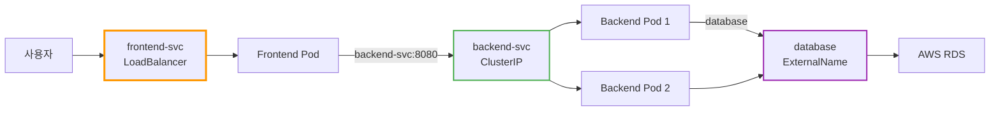
```mermaid
flowchart LR
    User[사용자] --> FE_LB[frontend-svc<br>LoadBalancer]
    FE_LB --> FE[Frontend Pod]

    FE -->|"backend-svc:8080"| BE_SVC[backend-svc<br>ClusterIP]
    BE_SVC --> BE1[Backend Pod 1]
    BE_SVC --> BE2[Backend Pod 2]

    BE1 -->|"database"| DB_SVC[database<br>ExternalName]
    BE2 --> DB_SVC
    DB_SVC --> RDS[AWS RDS]

    style FE_LB stroke:#FF9800,stroke-width:3px
    style BE_SVC stroke:#4CAF50,stroke-width:2px
    style DB_SVC stroke:#9C27B0,stroke-width:2px
```

---

## 10. Service 디버깅

### 10.1 연결 문제 체크리스트

Service에 연결이 안 될 때 확인할 순서:

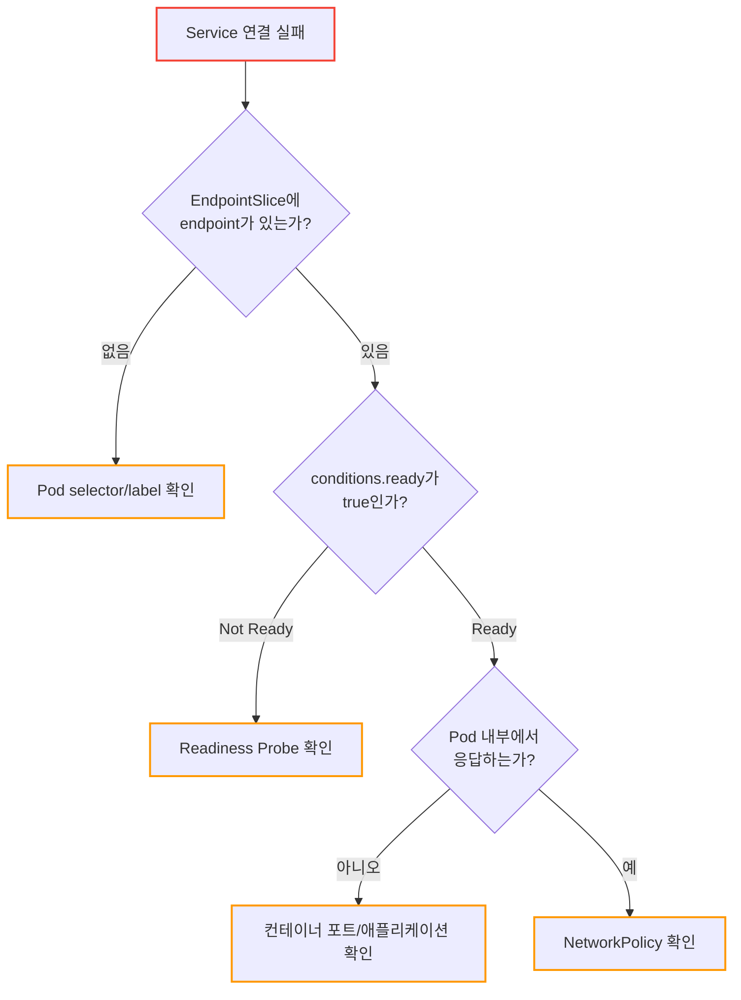
```mermaid
flowchart TB
    A["Service 연결 실패"] --> B{"EndpointSlice에<br>endpoint가 있는가?"}
    B -->|"없음"| C["Pod selector/label 확인"]
    B -->|"있음"| D{"conditions.ready가<br>true인가?"}
    D -->|"Not Ready"| E["Readiness Probe 확인"]
    D -->|"Ready"| F{"Pod 내부에서<br>응답하는가?"}
    F -->|"아니오"| G["컨테이너 포트/애플리케이션 확인"]
    F -->|"예"| H["NetworkPolicy 확인"]

    style A stroke:#f44336,stroke-width:2px
    style C stroke:#FF9800,stroke-width:2px
    style E stroke:#FF9800,stroke-width:2px
    style G stroke:#FF9800,stroke-width:2px
    style H stroke:#FF9800,stroke-width:2px
```

### 10.2 디버깅 명령어

```bash
# 1. Service 상태 확인
kubectl get svc my-svc -o wide
kubectl describe svc my-svc

# 2. EndpointSlice 확인 (가장 중요!)
kubectl get endpointslices -l kubernetes.io/service-name=my-svc -o yaml
# endpoints가 비어 있으면 → selector/label 불일치
# endpoints[].conditions.ready가 false면 → terminating인지 먼저 보고, 아니라면 Pod가 Ready가 아님 (Readiness Probe 확인)

# (레거시) Endpoints 확인 - v1.33+에서는 deprecation 경고가 출력된다
kubectl get endpoints my-svc

# 3. Pod 상태 확인
kubectl get pods -l app=my-app
kubectl describe pod <pod-name>

# 4. Service DNS 확인 (클러스터 내부에서)
kubectl run debug --rm -it --image=busybox -- nslookup my-svc

# 5. Service 직접 호출 테스트
kubectl run debug --rm -it --image=curlimages/curl -- curl -v my-svc:80

# 6. Pod 직접 호출 테스트 (Service 우회)
kubectl exec -it <pod-name> -- curl localhost:8080
```

### 10.3 자주 발생하는 문제

| 증상 | 원인 | 해결 |
|------|------|------|
| EndpointSlice에 endpoint가 없음 | selector와 Pod label 불일치 | label 확인 및 수정 |
| endpoint는 있지만 `ready: false` | Readiness Probe 실패 | Probe 설정 및 애플리케이션 확인 |
| ClusterIP로 접근 안 됨 | NetworkPolicy 차단 | NetworkPolicy 규칙 확인 |
| ClusterIP에 `ping` 응답 없음 | 정상 동작 (규칙은 Service에 정의된 port에만 적용) | `curl`이나 `nc`로 포트 확인 ([이유](./Kubernetes-Service-Internals.md)) |
| LoadBalancer EXTERNAL-IP가 `<pending>` | 클라우드 컨트롤러 문제 | 클라우드 권한, 할당량 확인 |
| 외부에서 LoadBalancer 접근 안 됨 | Security Group/방화벽 | 클라우드 보안 규칙 확인 |

---

## 11. 자주 쓰는 명령어

```bash
# Service 목록 조회
kubectl get svc

# Service 상세 정보
kubectl describe svc my-svc

# EndpointSlice 확인 (실제 Pod IP 목록과 Ready 상태)
kubectl get endpointslices -l kubernetes.io/service-name=my-svc

# Service 생성 (명령형)
kubectl expose deployment my-app --port=80 --target-port=8080

# Service 삭제
kubectl delete svc my-svc
```

---

## 12. 정리

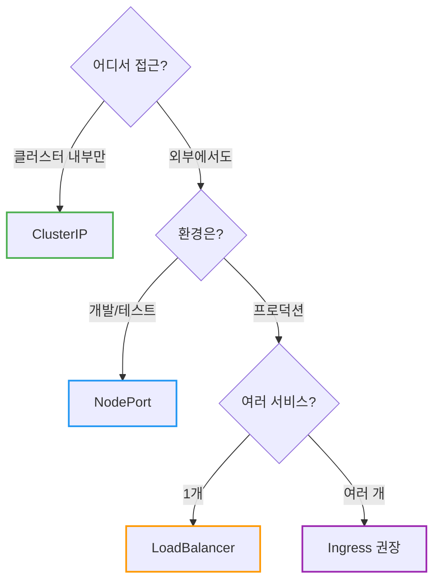
```mermaid
flowchart TB
    Q{어디서 접근?}

    Q -->|"클러스터 내부만"| CI[ClusterIP]
    Q -->|"외부에서도"| External{환경은?}

    External -->|"개발/테스트"| NP[NodePort]
    External -->|"프로덕션"| Prod{여러 서비스?}

    Prod -->|"1개"| LB[LoadBalancer]
    Prod -->|"여러 개"| ING[Ingress 권장]

    style CI stroke:#4CAF50,stroke-width:2px
    style NP stroke:#2196F3,stroke-width:2px
    style LB stroke:#FF9800,stroke-width:2px
    style ING stroke:#9C27B0,stroke-width:2px
```

| 질문 | 답변 |
|------|------|
| Pod IP로 직접 호출해도 되나요? | ❌ Pod IP는 변경됨, Service 사용 |
| ClusterIP vs NodePort 차이? | ClusterIP는 내부만, NodePort는 외부도 가능 |
| 프로덕션에서 뭘 써야 하나요? | LoadBalancer 또는 Ingress |
| Source IP가 필요하면? | `externalTrafficPolicy: Local` 설정 ([원리](./Kubernetes-Service-Internals.md)) |

**핵심 기억:**
1. **Service** 는 Pod에 대한 안정적인 엔드포인트 (IP, DNS). 서버가 아니라 선언이며, 실체는 각 노드 커널의 주소 변환 규칙이다
2. **ClusterIP** 는 내부 통신, **LoadBalancer** 는 외부 노출
3. **LoadBalancer** 타입은 NodePort와 ClusterIP의 확장형 (자동 생성)
4. **Selector** 로 Pod를 선택, **EndpointSlice** 로 실제 목적지 관리
5. Readiness Probe 실패 → EndpointSlice에 `ready: false`로 표시 → 새 연결의 트래픽 대상에서 제외 (`publishNotReadyAddresses: true`는 예외)
6. **externalTrafficPolicy: Local** 로 Source IP 보존 (원리는 [Kubernetes Service Internals](./Kubernetes-Service-Internals.md))

> 📖 관련 문서:
> - [Kubernetes Service Internals](./Kubernetes-Service-Internals.md)
> - [Kubernetes Service LoadBalancer (Cloud)](./Kubernetes-Service-LoadBalancer-Cloud.md)
> - [Kubernetes Ingress](./Kubernetes-Ingress.md)
> - [Kubernetes Probe: Liveness, Readiness, Startup](./Kubernetes-Probe-Liveness-Readiness-Startup.md)

---

## 출처

- [Kubernetes Documentation - Service](https://kubernetes.io/docs/concepts/services-networking/service/) - 공식 문서
- [Kubernetes Documentation - EndpointSlices](https://kubernetes.io/docs/concepts/services-networking/endpoint-slices/) - 공식 문서
- [Kubernetes Documentation - DNS for Services and Pods](https://kubernetes.io/docs/concepts/services-networking/dns-pod-service/) - 공식 문서
- [Kubernetes Documentation - Virtual IPs and Service Proxies](https://kubernetes.io/docs/reference/networking/virtual-ips/) - 공식 문서 (proxy mode, IPVS deprecation 일정)
- [Kubernetes Blog - Continuing the transition from Endpoints to EndpointSlices](https://kubernetes.io/blog/2025/04/24/endpoints-deprecation/) - Endpoints API deprecation
