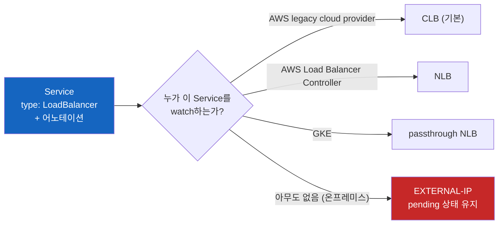

# Kubernetes Service LoadBalancer (Cloud)

**같은 LoadBalancer Service가 클라우드마다 다른 LB가 되는 이유**

똑같은 `type: LoadBalancer` YAML이 AWS에서는 CLB나 NLB가 되고, GKE에서는 passthrough NLB가 되고, 온프레미스에서는 아무것도 되지 않는다. 쿠버네티스는 같은데 결과는 왜 이렇게 다를까?

> 📚 **Service 시리즈 읽는 순서**
> 1. [Kubernetes Service Object](./Kubernetes-Service-Object.md) - Service는 어떤 오브젝트인가
> 2. [Kubernetes Service: ClusterIP, NodePort, LoadBalancer](./Kubernetes-Service-ClusterIP-NodePort-LoadBalancer.md) - 타입별로 어떻게 쓰는가
> 3. [Kubernetes Service Internals](./Kubernetes-Service-Internals.md) - 내부에서 어떻게 동작하는가
> 4. [Kubernetes Service LoadBalancer (Cloud)](./Kubernetes-Service-LoadBalancer-Cloud.md) - 클라우드 LB와는 어떻게 연결되는가 ← 지금 읽는 글
>
> 다음 단계: [Kubernetes Ingress](./Kubernetes-Ingress.md) - 여러 Service를 하나의 HTTP 진입점으로 묶기

## 결론부터 말하면

**`type: LoadBalancer`도 선언일 뿐이고, 실제 LB는 그 선언을 watch하는 컨트롤러가 클라우드 API를 호출해서 만들기 때문이다.** 쿠버네티스 코어에는 LB를 만드는 코드가 없다. 어느 컨트롤러가 그 Service를 맡는지, 그 컨트롤러가 어노테이션을 어떻게 해석하는지에 따라 결과가 갈린다. 맡을 컨트롤러가 없으면 EXTERNAL-IP는 끝없이 `<pending>`으로 남는다.



| 환경 | Service를 맡는 컨트롤러 | 결과 |
|------|------------------------|------|
| AWS (컨트롤러 미설치) | legacy cloud provider | CLB. `aws-load-balancer-type: nlb`를 주면 NLB |
| AWS (LBC v2.5+ 설치) | AWS Load Balancer Controller | NLB |
| GKE | GKE의 service controller | passthrough NLB (내부/외부는 어노테이션으로 선택) |
| 온프레미스 | 없음 | `<pending>` (MetalLB 같은 구현을 설치해야 함) |

---

## 1. 왜 같은 YAML의 결과가 달라질까?

### 1.1 이상한 점

클라우드에서 `type: LoadBalancer` Service를 만들면 잠시 뒤 `EXTERNAL-IP`에 주소가 찍힌다. 그래서 LoadBalancer 타입은 "쿠버네티스가 LB를 만들어 주는 기능"처럼 느껴진다.

그런데 같은 YAML을 사내 온프레미스 클러스터에 올리면 이야기가 달라진다. 에러도 없고 이벤트도 조용한데, `EXTERNAL-IP`는 몇 시간이 지나도 `<pending>`이다. 쿠버네티스가 LB를 만들어 주는 기능이라면, 왜 여기서는 아무 일도 일어나지 않을까?

### 1.2 Service는 선언이라는 사실에서 출발하자

[Kubernetes Service Internals](./Kubernetes-Service-Internals.md)에서 봤듯이 Service는 etcd에 저장된 선언이고, ClusterIP는 kube-proxy가 각 노드 커널에 규칙을 써서 실체화한다. LoadBalancer 타입은 여기서 한 단계 더 나간다. 실체화해야 할 대상이 **클러스터 밖에 있는 클라우드 LB** 다. 노드 커널에 규칙을 쓰는 kube-proxy로는 AWS나 GCP에 LB를 만들 수 없다. 클라우드 API를 호출할 권한과 코드를 가진 별도의 컨트롤러가 필요하다.

온프레미스에서 `<pending>`이 풀리지 않는 이유도 여기 있다. 그 선언을 읽고 LB를 만들어 줄 컨트롤러가 아무도 없기 때문이다.

---

## 2. LB를 만드는 주체: 컨트롤러

### 2.1 cloud-controller-manager의 service controller

클라우드에서 이 역할을 맡는 기본 주체는 **cloud-controller-manager** (클라우드 제공자별 연동 코드를 쿠버네티스 코어에서 분리해 둔 컴포넌트) 안의 **service controller** 다. service controller는 Service의 생성·수정·삭제 이벤트를 watch하다가 LoadBalancer 타입이 보이면 클라우드 API로 LB를 만든다. 생성은 비동기로 진행되며, 다 만들어지면 LB 주소를 Service의 `status.loadBalancer` 필드에 써 넣는다. `kubectl get svc`의 `EXTERNAL-IP`는 바로 이 필드를 보여주는 것이다.

```bash
$ kubectl get svc my-svc
NAME     TYPE           CLUSTER-IP    EXTERNAL-IP    PORT(S)        AGE
my-svc   LoadBalancer   10.96.0.10    <pending>      80:31234/TCP   10s   # 컨트롤러가 아직 안 썼거나, 쓸 컨트롤러가 없다
my-svc   LoadBalancer   10.96.0.10    52.10.20.30    80:31234/TCP   2m    # 컨트롤러가 status.loadBalancer를 채웠다
```

### 2.2 loadBalancerClass: 컨트롤러를 고르는 필드

한 클러스터에 LB 구현이 여럿 있을 수도 있다. 이때 쓰는 필드가 `spec.loadBalancerClass` (v1.24 stable)다. 이 필드가 비어 있으면 클라우드 제공자의 기본 구현이 Service를 맡는다. 값이 지정되면 기본 구현은 그 Service를 무시하고, 해당 클래스를 담당하는 구현이 맡는다. 한 번 지정하면 바꿀 수 없다.

AWS Load Balancer Controller(LBC) v2.5 이상이 "기본 컨트롤러가 된다"는 말도 이 필드로 설명된다. LBC는 mutating webhook으로 새 LoadBalancer Service의 `spec.loadBalancerClass`를 자동으로 채워서, legacy provider 대신 자기가 Service를 맡는다.

### 2.3 어노테이션은 컨트롤러별 방언이다

`service.beta.kubernetes.io/aws-load-balancer-*`, `cloud.google.com/*` 같은 어노테이션은 쿠버네티스 API가 정의한 필드가 아니다. 각 컨트롤러가 "내가 읽을 추가 지시"로 정해 둔 키-값일 뿐이다. 그래서 다른 컨트롤러의 어노테이션은 조용히 무시된다. 에러도 나지 않는다.

같은 클라우드 안에서도 마찬가지다. AWS LBC 공식 문서는 자기 어노테이션 목록이 legacy provider가 처리하는 Service에 대해서는 정확한 레퍼런스가 아니라고 명시한다. 어노테이션을 복사해 올 때는 "이 Service를 지금 어느 컨트롤러가 맡고 있는가"부터 확인해야 한다.

### 2.4 온프레미스: 컨트롤러가 없으면 pending

MetalLB 공식 문서는 이 상황을 이렇게 설명한다. 쿠버네티스에 들어 있는 네트워크 LB 구현은 모두 IaaS(GCP, AWS, Azure 등)를 호출하는 glue code이고, 지원되는 IaaS 위가 아니라면 LoadBalancer Service는 생성 후 무기한 pending 상태로 남는다. 온프레미스에서 LoadBalancer 타입을 쓰려면 MetalLB처럼 표준 네트워크 장비와 연동해 IP를 광고하는 구현을 따로 설치해야 한다. 그렇지 않다면 NodePort나 Ingress로 노출해야 한다.

---

## 3. 클라우드별 예시

아래 예시는 모두 "어느 컨트롤러가 맡는가"를 먼저 확인한 뒤 읽어야 한다.

### 3.1 AWS EKS

AWS에서는 Service를 맡을 수 있는 경로가 세 가지다.

| 경로 | 조건 | 기본 결과 |
|------|------|----------|
| **legacy cloud provider** | LBC가 없을 때 | CLB. `aws-load-balancer-type: nlb`를 지정하면 NLB |
| **AWS Load Balancer Controller** | LBC를 직접 설치. v2.5+는 webhook으로 기본 컨트롤러가 됨 | NLB |
| **EKS Auto Mode** | Auto Mode 클러스터. 별도 설치 없음 | NLB (LBC와 동작 차이가 있으니 [EKS Auto Mode 문서](https://docs.aws.amazon.com/eks/latest/userguide/auto-configure-nlb.html) 확인) |

아래는 LBC를 설치한 구성 기준이다.

**외부 NLB (인터넷 노출):**

```yaml
apiVersion: v1
kind: Service
metadata:
  name: my-svc
  annotations:
    # LBC가 맡도록 지정 - Service 생성 시에만 설정할 것
    service.beta.kubernetes.io/aws-load-balancer-type: "external"
    # Pod IP를 직접 타겟으로 지정 (VPC CNI 필요)
    service.beta.kubernetes.io/aws-load-balancer-nlb-target-type: "ip"
    # 인터넷 노출 - 반드시 명시 (생략하면 기본값 internal)
    service.beta.kubernetes.io/aws-load-balancer-scheme: "internet-facing"
spec:
  type: LoadBalancer
  # ...
```

**내부 NLB (VPC 내부 전용):**

```yaml
apiVersion: v1
kind: Service
metadata:
  name: my-internal-svc
  annotations:
    service.beta.kubernetes.io/aws-load-balancer-type: "external"
    service.beta.kubernetes.io/aws-load-balancer-nlb-target-type: "ip"
    # VPC 내부에서만 접근 가능 (생략해도 기본값이 internal)
    service.beta.kubernetes.io/aws-load-balancer-scheme: "internal"
    # 서브넷 지정 (선택)
    service.beta.kubernetes.io/aws-load-balancer-subnets: "subnet-xxx,subnet-yyy"
    # HTTP Health Check (선택) - path는 protocol이 http/https일 때만 적용된다
    service.beta.kubernetes.io/aws-load-balancer-healthcheck-protocol: "http"
    service.beta.kubernetes.io/aws-load-balancer-healthcheck-path: "/health"
spec:
  type: LoadBalancer
  # ...
```

| 어노테이션 | 설명 |
|-----------|------|
| `aws-load-balancer-type: external` | LBC가 이 Service를 맡도록 지정 |
| `aws-load-balancer-nlb-target-type: ip` | NLB가 Pod IP로 직접 전달 (노드의 NodePort를 거치지 않음, Fargate Pod도 지원) |
| `aws-load-balancer-nlb-target-type: instance` | NLB가 각 노드의 NodePort로 전달하고, 노드의 kube-proxy 규칙이 Pod로 넘김 |
| `aws-load-balancer-scheme: internet-facing` | 외부 노출 (명시해야 함) |
| `aws-load-balancer-scheme: internal` | VPC 내부 전용 (생략 시 기본값) |
| `aws-load-balancer-healthcheck-protocol` | 기본값은 `externalTrafficPolicy: Cluster`면 tcp, `Local`이면 http |

AWS에서 특히 조심할 함정이 두 가지 있다.

- **`aws-load-balancer-type`은 생성 시에만 설정한다.** 기존 Service에 이 어노테이션을 추가하거나 바꾸면 AWS 리소스가 유출되거나 NLB가 인터넷에 노출되는 등 설정이 꼬일 수 있다고 공식 문서가 경고한다.
- **`externalTrafficPolicy: Local`에서는 Health Check에 tcp를 쓰지 말라고 공식 문서가 경고한다.** 이유가 가장 분명한 경우는 노드의 NodePort를 거치는 `instance` 타겟이다. `Local`은 Pod가 없는 노드에 도착한 트래픽을 드롭하므로, LB는 HTTP Health Check로 Pod가 있는 노드만 골라내야 한다. 이 동작의 원리는 [Kubernetes Service Internals](./Kubernetes-Service-Internals.md)의 Traffic Policy 절에서 다룬다.

### 3.2 GKE (Google Cloud)

GKE의 어노테이션은 서로 다른 구성을 고르는 스위치라서, 한 Service에 섞지 말고 용도별로 따로 써야 한다.

**내부 passthrough NLB:**

```yaml
apiVersion: v1
kind: Service
metadata:
  name: my-internal-svc
  annotations:
    # 내부 LB 생성
    # GKE 1.33.1-gke.1779000+ 등 추가 조건을 만족하면
    # spec.loadBalancerClass: networking.gke.io/l4-regional-internal 로도 지정 가능
    networking.gke.io/load-balancer-type: "Internal"
spec:
  type: LoadBalancer
  # ...
```

**외부 passthrough NLB (Backend Service 기반):**

```yaml
apiVersion: v1
kind: Service
metadata:
  name: my-external-svc
  annotations:
    # Backend Service 기반 외부 LB 생성 (GKE 1.37+는 기본 동작)
    # 1.32.2-gke.1652000+는 GCE_VM_IP NEG 백엔드, 이전 버전은 instance group 백엔드
    cloud.google.com/l4-rbs: "enabled"
spec:
  type: LoadBalancer
  # ...
```

**독립형 NEG (LB를 직접 구성할 때):**

```yaml
apiVersion: v1
kind: Service          # type 생략 = ClusterIP
metadata:
  name: neg-demo-app
  annotations:
    # 지정한 Service 포트마다 zone별 NEG 생성 - LB는 사용자가 별도로 구성
    cloud.google.com/neg: '{"exposed_ports": {"80":{}}}'
spec:
  ports:
  - port: 80
    targetPort: 9376
  # ...
```

| 어노테이션 | 설명 |
|-----------|------|
| `networking.gke.io/load-balancer-type: Internal` | 내부 passthrough NLB |
| `cloud.google.com/l4-rbs: enabled` | Backend Service 기반 외부 passthrough NLB (백엔드는 GKE 버전에 따라 `GCE_VM_IP` NEG 또는 instance group) |
| `cloud.google.com/neg` | 독립형 NEG 생성 (`exposed_ports`에 Service 포트 지정). LB는 만들지 않으며, Container-native 로드밸런싱을 직접 구성할 때 쓴다 |

### 3.3 Azure AKS

```yaml
apiVersion: v1
kind: Service
metadata:
  name: my-svc
  annotations:
    # 내부 LB
    service.beta.kubernetes.io/azure-load-balancer-internal: "true"
    # 특정 서브넷에 배치
    service.beta.kubernetes.io/azure-load-balancer-internal-subnet: "apps-subnet"
    # 고정 IP 지정 (서브넷 대역 안의 주소)
    service.beta.kubernetes.io/azure-load-balancer-ipv4: "10.0.0.100"
    # Private Link Service 생성
    service.beta.kubernetes.io/azure-pls-create: "true"
spec:
  type: LoadBalancer
  # ...
```

| 어노테이션 | 설명 |
|-----------|------|
| `azure-load-balancer-internal: true` | 내부 LB |
| `azure-load-balancer-internal-subnet` | 서브넷 지정 |
| `azure-load-balancer-ipv4` | 고정 IP 지정 |
| `azure-pls-create: true` | Private Link Service 생성 |

---

## 4. 정리

### 핵심 포인트

1. **`type: LoadBalancer`도 선언이다**
   - 쿠버네티스 코어는 LB를 만들지 않는다. 그 선언을 watch하는 컨트롤러가 클라우드 API로 LB를 만들고 `status.loadBalancer`에 주소를 써 넣는다
   - 맡을 컨트롤러가 없으면 `<pending>`이 풀리지 않는다 (온프레미스는 MetalLB 같은 구현 필요)

2. **어노테이션은 컨트롤러별 방언이다**
   - 다른 컨트롤러의 어노테이션은 에러 없이 무시된다
   - 같은 AWS라도 legacy provider, LBC, EKS Auto Mode가 다르게 동작하니 "누가 맡는가"부터 확인한다

3. **생성 후에 바꾸면 안 되는 설정이 있다**
   - `spec.loadBalancerClass`는 한 번 지정하면 바꿀 수 없다
   - AWS의 `aws-load-balancer-type`은 기존 Service에 추가하거나 바꾸면 리소스가 꼬일 수 있다

> 📖 관련 문서:
> - [Kubernetes Service: ClusterIP, NodePort, LoadBalancer](./Kubernetes-Service-ClusterIP-NodePort-LoadBalancer.md)
> - [Kubernetes Service Internals](./Kubernetes-Service-Internals.md)
> - [Kubernetes Ingress](./Kubernetes-Ingress.md)

---

## 출처

- [Kubernetes Documentation - Service (type LoadBalancer, loadBalancerClass)](https://kubernetes.io/docs/concepts/services-networking/service/#loadbalancer) - 공식 문서
- [Kubernetes Documentation - Cloud Controller Manager](https://kubernetes.io/docs/concepts/architecture/cloud-controller/) - 공식 문서 (service controller)
- [AWS Load Balancer Controller - Service Annotations](https://kubernetes-sigs.github.io/aws-load-balancer-controller/latest/guide/service/annotations/) - AWS 공식 문서
- [Amazon EKS - Auto Mode NLB 구성](https://docs.aws.amazon.com/eks/latest/userguide/auto-configure-nlb.html) - AWS 공식 문서
- [GKE - LoadBalancer Service parameters](https://cloud.google.com/kubernetes-engine/docs/concepts/service-load-balancer-parameters) - GCP 공식 문서
- [GKE - Backend service-based external load balancer](https://cloud.google.com/kubernetes-engine/docs/how-to/backend-service-based-external-load-balancer) - GCP 공식 문서
- [GKE - Standalone zonal NEGs](https://cloud.google.com/kubernetes-engine/docs/how-to/standalone-neg) - GCP 공식 문서
- [Azure AKS - Internal Load Balancer](https://learn.microsoft.com/en-us/azure/aks/internal-lb) - Azure 공식 문서
- [MetalLB](https://metallb.io/) - bare-metal LoadBalancer 구현
