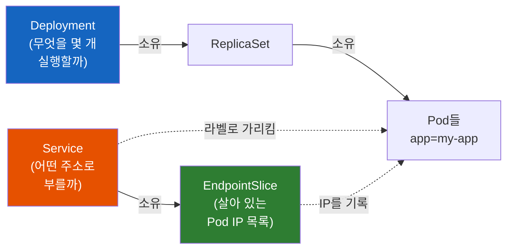
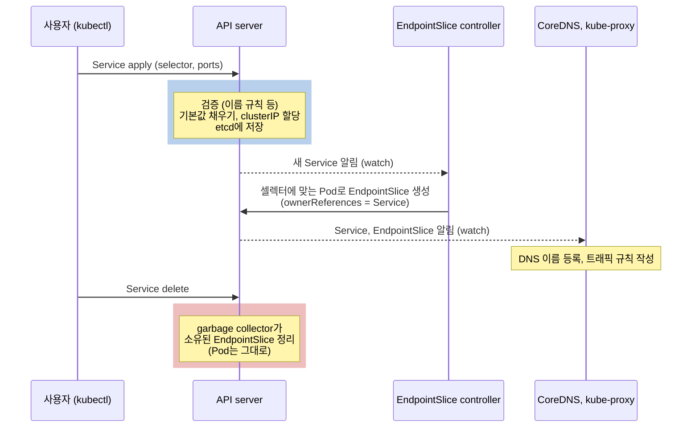

# Kubernetes Service Object

**Service를 지워도 Pod는 왜 그대로일까 - 쿠버네티스 오브젝트 지도 속 Service**

쿠버네티스에는 Deployment, Service, ConfigMap 같은 오브젝트가 있다. 그중 Service라는 오브젝트에는 정확히 무엇이 들어 있고, Deployment나 Pod와는 어떻게 엮여 있을까?

> 📚 **Service 시리즈 읽는 순서**
> 1. [Kubernetes Service Object](./Kubernetes-Service-Object.md) - Service는 어떤 오브젝트인가 ← 지금 읽는 글
> 2. [Kubernetes Service: ClusterIP, NodePort, LoadBalancer](./Kubernetes-Service-ClusterIP-NodePort-LoadBalancer.md) - 타입별로 어떻게 쓰는가
> 3. [Kubernetes Service Internals](./Kubernetes-Service-Internals.md) - 내부에서 어떻게 동작하는가
> 4. [Kubernetes Service LoadBalancer (Cloud)](./Kubernetes-Service-LoadBalancer-Cloud.md) - 클라우드 LB와는 어떻게 연결되는가
>
> 다음 단계: [Kubernetes Ingress](./Kubernetes-Ingress.md) - 여러 Service를 하나의 HTTP 진입점으로 묶기

## 결론부터 말하면

**Service를 지워도 Pod가 그대로인 이유는 Service가 Pod를 소유하지 않고, 라벨로 가리키기만 하기 때문이다.** Service 오브젝트에 적는 내용은 "누구에게(selector)"와 "어떻게(ports, type)" 두 가지뿐이다. Pod를 만들고 개수를 지키는 일은 Deployment가 맡는다. Service가 소유하는 것은 자기 결과물인 EndpointSlice(지금 살아 있는 Pod IP 목록)뿐이다.



실선은 소유 관계, 점선은 소유하지 않고 가리키기만 하는 관계다. 이 차이가 "지우면 무엇이 함께 사라지는가"를 결정한다.

| 지우는 오브젝트 | 함께 사라지는 것 | 그대로 남는 것 |
|---------------|----------------|--------------|
| Deployment | ReplicaSet, Pod | Service, EndpointSlice (Pod가 없으니 목록만 빈다) |
| Service | 컨트롤러가 만든 EndpointSlice | Deployment, ReplicaSet, **Pod** |

---

## 1. 쿠버네티스 오브젝트 지도에서 Service는 어디에 있을까?

### 1.1 오브젝트는 "이렇게 되어 있어야 한다"는 기록이다

쿠버네티스를 처음 배우면 Deployment, Service, ConfigMap 같은 이름이 한꺼번에 쏟아진다. 이것들을 통틀어 **오브젝트(object)** 라고 부른다. 공식 문서는 오브젝트를 "의도의 기록(record of intent)"이라고 설명한다. 오브젝트를 만든다는 건 "클러스터가 이런 상태여야 한다"는 바람을 API server에 적어 두는 일이고, 쿠버네티스는 그 상태를 계속 맞추려고 일한다.

그래서 대부분의 오브젝트는 두 칸으로 나뉜다. 사용자가 원하는 상태를 적는 **`spec`** 과, 시스템이 현재 상태를 채워 넣는 **`status`** 다. 실제로 일을 하는 건 **컨트롤러(controller)** 다. 컨트롤러는 오브젝트를 지켜보다가 현재 상태가 `spec`과 다르면 맞추는 프로그램이다. Spring에 비유하면 오브젝트는 설정 파일, 컨트롤러는 그 설정을 읽고 실제 Bean을 만들어 관리하는 컨테이너에 가깝다.

### 1.2 앱 하나를 띄울 때 쓰는 오브젝트들

오브젝트 종류는 `kubectl api-resources`로 보면 기본 내장만 수십 가지다. 하지만 앱 하나를 띄울 때 실제로 쓰는 건 많지 않아서, 입문서들도 보통 아래 정도를 한 장의 지도로 묶어 소개한다. 예전 공식 문서도 Pod, Service, Volume, Namespace를 "기본 오브젝트"로, 그 위에 ReplicaSet, Deployment 같은 컨트롤러를 얹는 식으로 소개했다. (그 목록의 Volume은 지금 기준으로는 독립 오브젝트가 아니라 Pod `spec` 안에 적는 필드이고, 독립 오브젝트로는 PersistentVolume과 PersistentVolumeClaim이 있다.)

| 오브젝트 | 답하는 질문 | 주로 누가 만드나 |
|---------|-----------|----------------|
| **Deployment** | 어떤 이미지로 Pod를 몇 개 유지할까 | 사용자 |
| └ ReplicaSet | (Deployment가 버전별로 만드는 중간 관리자) | 컨트롤러 |
| └ Pod | 컨테이너가 실제로 도는 단위 | 컨트롤러 |
| **Service** | 그 Pod들을 어떤 이름과 주소로 부를까 | 사용자 |
| └ EndpointSlice | (지금 살아 있는 Pod IP 목록) | 컨트롤러 |
| **ConfigMap / Secret** | 설정값과 비밀값을 어떻게 넣을까 | 사용자 |
| **Ingress** | 외부 HTTP 요청을 어느 Service로 보낼까 | 사용자 |
| **PersistentVolumeClaim** | 데이터를 저장할 디스크가 필요하다 | 사용자 |
| **Namespace** | 이 오브젝트들을 어느 칸막이에 둘까 | 사용자(관리자) |

엄밀히 말하면 모든 오브젝트는 API로 직접 만들 수 있다. Pod도 직접 만들 수 있다. 그래도 표처럼 **사용자가 의도를 적는 오브젝트** 와 **컨트롤러가 그 결과로 만드는 오브젝트** 로 나눠 보면 지도가 훨씬 단순해진다.

### 1.3 Deployment와 Service는 한 쌍이다

네트워크로 호출받는 앱을 띄우는 대표적인 조합은 Deployment와 Service 한 쌍이다(배치 작업처럼 아무도 호출하지 않는 앱이라면 Service가 필요 없다). Deployment가 "무엇을 몇 개 실행할까"를 맡으면, Service는 "실행된 것들을 어떻게 찾아서 부를까"를 맡는다.

Service가 필요한 이유는 Pod의 성질에 있다. Pod는 죽거나 교체될 때마다 새 IP를 받는다. 다른 앱이 Pod IP를 직접 적어 두면 배포 한 번에 연결이 끊긴다. 그래서 다른 앱은 Pod 대신 Service의 이름으로 호출하고, Service가 그때그때 살아 있는 Pod로 연결해 준다. 이 동기와 타입별 사용법은 시리즈 2편 [Kubernetes Service: ClusterIP, NodePort, LoadBalancer](./Kubernetes-Service-ClusterIP-NodePort-LoadBalancer.md)에서 자세히 다룬다.

그렇다면 Service라는 오브젝트 안에는 실제로 무엇이 들어 있을까?

---

## 2. Service 오브젝트 해부: 내가 쓴 10줄, 저장된 30줄

### 2.1 내가 쓴 것과 저장된 것

로컬 클러스터(docker-desktop, Kubernetes v1.36.1)에서 `app=my-app` 라벨을 단 Pod 두 개를 Deployment로 띄우고, 가장 짧은 Service를 apply했다. 이 글의 출력은 모두 그 실습에서 나온 실제 결과다.

```yaml
# 내가 쓴 것 (10줄)
apiVersion: v1
kind: Service
metadata:
  name: my-svc
spec:
  selector:           # 누구에게: app=my-app 라벨을 가진 Pod들
    app: my-app
  ports:              # 어떻게: 80으로 받아서 Pod의 80으로
  - port: 80
    targetPort: 80
```

그리고 `kubectl get svc my-svc -o yaml`로 다시 읽어 보면 이렇게 돌아온다(`last-applied-configuration` 어노테이션의 긴 JSON 한 줄은 줄였다).

```yaml
# 클러스터에 저장된 것 (약 30줄)
apiVersion: v1
kind: Service
metadata:
  annotations:
    kubectl.kubernetes.io/last-applied-configuration: |   # kubectl apply가 남긴 기록
      {"apiVersion":"v1","kind":"Service",...}
  creationTimestamp: "2026-10-05T04:01:25Z"   # API server가 채움
  name: my-svc
  namespace: til-svc-demo                     # 지정한 namespace가 들어감
  resourceVersion: "157817"                   # API server가 채움 (변경될 때마다 증가)
  uid: 771191c7-e912-4ed4-93fe-7fb97ee01b19   # API server가 채움 (오브젝트 고유 ID)
spec:
  clusterIP: 10.104.220.35                    # API server가 할당
  clusterIPs:
  - 10.104.220.35
  internalTrafficPolicy: Cluster              # 기본값
  ipFamilies:                                 # 클러스터 설정에 따라 채움
  - IPv4
  ipFamilyPolicy: SingleStack                 # 기본값
  ports:
  - port: 80
    protocol: TCP                             # 기본값
    targetPort: 80
  selector:
    app: my-app
  sessionAffinity: None                       # 기본값
  type: ClusterIP                             # 기본값
status:
  loadBalancer: {}                            # LoadBalancer 타입이면 컨트롤러가 채움
```

10줄을 넣었는데 30줄이 돌아왔다. 이것이 오브젝트의 성질을 잘 보여준다. 내가 적은 건 의도뿐이고, 나머지는 API server가 기본값과 할당값으로 채워 넣었다. **`spec`은 원하는 상태를 적는 칸이지만, 비워 둔 칸은 시스템이 기본값으로 채운다.**

### 2.2 칸마다 누가 채우는가

| 필드 | 누가 채우나 | 의미 |
|------|-----------|------|
| `metadata.name` | 나 | Service 이름. 그대로 DNS 이름이 된다 (4장) |
| `spec.selector` | 나 | 대상 Pod를 고르는 라벨 조건 |
| `spec.ports[].port`, `targetPort` | 나 | Service가 받는 포트와 Pod로 보낼 포트 |
| `spec.ports[].protocol` | 기본값 `TCP` | |
| `spec.type` | 기본값 `ClusterIP` | 어디까지 노출할지 (타입은 시리즈 2편) |
| `spec.clusterIP`, `clusterIPs` | API server | Service 대역에서 IP를 할당. 할당된 주소는 이후 바꿀 수 없다 (single-stack과 dual-stack을 전환할 때 두 번째 주소만 추가·제거된다, 5장) |
| `spec.ipFamilies`, `ipFamilyPolicy` | API server | IPv4/IPv6 중 무엇을 쓸지 |
| `spec.sessionAffinity`, `internalTrafficPolicy` | 기본값 | 트래픽을 어떻게 나눌지 (동작 원리는 시리즈 3편) |
| `metadata.uid`, `resourceVersion`, `creationTimestamp` | API server | 오브젝트의 고유 ID, 버전, 생성 시각 |
| `status.loadBalancer` | 컨트롤러 | LoadBalancer 타입일 때 외부 LB 주소 (시리즈 4편) |

정리하면 Service 오브젝트가 담는 핵심은 두 덩어리다. **누구에게** (`selector`)와 **어떻게** (`ports`, `type`)다. 그런데 표를 다시 보면 이상한 점이 있다. "어떤 Pod로 보낼지"를 정하는 Service인데, Pod를 직접 가리키는 칸이 하나도 없다. Pod 이름도, Deployment 이름도 없다. 그럼 Service와 Pod는 무엇으로 이어져 있을까?

---

## 3. Service는 Pod를 소유하지 않는다

### 3.1 쿠버네티스 오브젝트가 서로 엮이는 두 가지 방법

오브젝트끼리 엮이는 방법은 두 가지다.

첫째는 **소유 관계** 다. 자식 오브젝트의 `metadata.ownerReferences`에 부모가 적혀 있는 관계다. 부모를 지우면 쿠버네티스의 garbage collector가 자식도 함께 정리한다. 실습 클러스터에서 확인하면 Deployment 쪽은 이렇게 이어져 있다.

```bash
$ kubectl get pod my-app-676669d997-5cg6d -o jsonpath='{.metadata.ownerReferences[0].kind}/{.metadata.ownerReferences[0].name}'
ReplicaSet/my-app-676669d997

$ kubectl get rs my-app-676669d997 -o jsonpath='{.metadata.ownerReferences[0].kind}/{.metadata.ownerReferences[0].name}'
Deployment/my-app
```

Pod는 ReplicaSet의 것이고, ReplicaSet은 Deployment의 것이다. 그래서 Deployment를 지우면 줄줄이 함께 지워진다.

둘째는 **라벨과 셀렉터** 다. 라벨은 오브젝트에 붙이는 `app=my-app` 같은 꼬리표이고, 셀렉터는 "이 라벨을 가진 것들"이라는 조건이다. 이건 소유가 아니라 검색이다. Service와 Pod는 바로 이 방식으로만 이어진다. 실제로 Pod의 정보를 다 뒤져도 `my-svc`라는 이름은 한 번도 나오지 않는다. Service 쪽에도 `ownerReferences`가 없다. Service와 Pod는 서로를 모른 채, Service가 "이 라벨을 가진 Pod들"을 그때그때 찾을 뿐이다.

공식 문서도 garbage collection을 설명하며 "소유 관계는 라벨·셀렉터 메커니즘과 다르다"고 짚는다. 그리고 그 예시로 바로 Service를 든다.

### 3.2 그래서 Service를 지워도 Pod는 남는다

Service를 지워 보면 이 차이가 그대로 드러난다.

```bash
$ kubectl delete svc my-svc
service "my-svc" deleted

$ kubectl get endpointslice -l kubernetes.io/service-name=my-svc --no-headers | wc -l
0                                    # Service가 소유한 EndpointSlice는 함께 사라졌다

$ kubectl get pods
NAME                      READY   STATUS
my-app-546cc564b5-bmjwj   1/1     Running     # Pod는 그대로 살아 있다
my-app-546cc564b5-d42b8   1/1     Running
```

Service는 Pod의 주인이 아니므로, Service를 지운다고 Pod가 지워지지 않는다. Service가 사라지면 그 Pod들을 Service 이름으로 부를 방법이 사라질 뿐이다. 반대로 Service를 다시 만들면 같은 라벨의 Pod를 즉시 다시 찾아낸다. 그래서 Service는 Deployment와 따로 지우고 다시 만들어도 되는, 서로 독립적인 오브젝트다. 이 독립성은 배포 전략에도 쓰인다. 구버전과 신버전 Pod를 모두 띄워 둔 채 Service의 `selector`만 `version: v1`에서 `version: v2`로 바꾸면 트래픽이 한 번에 넘어가는데, 이것이 Blue/Green 배포의 기본 원리다([Kubernetes Deployment Strategy](./Kubernetes-Deployment-Strategy.md) 참고).

### 3.3 대가: 라벨만 맞으면 누구든 섞여 들어온다

느슨한 연결에는 대가가 있다. Service는 "누가 만든 Pod인가"를 따지지 않고 라벨만 본다. 실습에서 Deployment와 상관없는 Pod 하나를 같은 라벨로 띄워 봤다.

```bash
$ kubectl run stray --image=nginx:alpine --labels=app=my-app

$ kubectl get endpointslice -l kubernetes.io/service-name=my-svc \
    -o jsonpath='{range .items[*].endpoints[*]}{.targetRef.name}{"\n"}{end}'
my-app-546cc564b5-bmjwj
my-app-546cc564b5-d42b8
stray                                 # 엉뚱한 Pod가 Service 대상에 섞여 들어왔다
```

`stray`는 Deployment와 아무 관계가 없지만 라벨이 같다는 이유만으로 트래픽을 받게 됐다. 셀렉터는 Service와 같은 namespace의 Pod만 고르므로, 같은 namespace에 테스트용으로 띄운 Pod나 다른 팀의 앱이 우연히 같은 라벨을 쓰면 운영 트래픽 일부가 그쪽으로 새어 나간다. 그래서 실무에서는 셀렉터를 `app: my-app` 하나로 두지 않고, `app: my-app`에 `component: web`처럼 라벨을 하나 더 조합해 범위를 좁히는 것이 관례다. 쿠버네티스가 권장하는 공통 라벨(`app.kubernetes.io/name`, `app.kubernetes.io/instance`, `app.kubernetes.io/component` 등)을 팀 규칙으로 정해 두면 이런 충돌을 줄이기 쉽다. 이상한 응답이 섞여 나오면 위 명령으로 EndpointSlice에 어떤 Pod가 들어 있는지부터 확인하자.

### 3.4 Service가 소유하는 유일한 것: EndpointSlice

Service가 Pod는 소유하지 않지만, 소유하는 오브젝트가 하나 있다. 셀렉터 검색 결과를 담는 **EndpointSlice** 다. EndpointSlice controller라는 컨트롤러가 Service의 셀렉터에 맞는 Pod를 계속 찾아서, 그 IP와 준비 상태를 EndpointSlice에 기록한다. 실습에서 꺼낸 EndpointSlice의 핵심 부분은 이렇다.

```yaml
kind: EndpointSlice
metadata:
  name: my-svc-n6v2q                  # Service 이름 + 무작위 접미사
  labels:
    kubernetes.io/service-name: my-svc                              # 어느 Service 것인지 (검색용)
    endpointslice.kubernetes.io/managed-by: endpointslice-controller.k8s.io
  ownerReferences:                    # 주인은 Service
  - kind: Service
    name: my-svc
    controller: true
endpoints:
- addresses: ["10.1.0.45"]
  conditions: {ready: true, serving: true, terminating: false}
  targetRef: {kind: Pod, name: my-app-676669d997-zfl62}
- addresses: ["10.1.0.46"]
  conditions: {ready: true, serving: true, terminating: false}
  targetRef: {kind: Pod, name: my-app-676669d997-5cg6d}
```

`ownerReferences`가 Service를 가리키므로, 3.2절에서 Service를 지웠을 때 EndpointSlice가 함께 사라진 것이다. 각 노드의 kube-proxy는 바로 이 EndpointSlice를 읽어서 Service로 온 트래픽을 실제 Pod로 보내는 규칙을 만든다. 그 과정은 시리즈 3편에서 다룬다. (CoreDNS는 트래픽을 전달하지 않고 이름에 대한 DNS 응답만 맡는다. 일반 Service의 이름에는 `clusterIP`를, `clusterIP: None`인 Headless Service의 이름에는 이 목록의 Pod IP들을 돌려준다.)

### 3.5 셀렉터를 비우면?

그럼 `spec.selector`를 아예 비우면 어떻게 될까? 실습에서 셀렉터 없이 `ext-db`라는 Service를 만들어 보니, EndpointSlice가 하나도 생기지 않았다. 찾을 조건이 없으니 컨트롤러가 채울 목록도 없는 것이다.

이 동작은 버그가 아니라 쓸모가 있다. 사용자가 EndpointSlice를 직접 만들어 원하는 IP를 넣고 `kubernetes.io/service-name: ext-db` 라벨로 Service와 연결하면, 클러스터 밖의 DB나 다른 클러스터의 서비스를 Service 이름으로 부를 수 있다. 다만 이렇게 직접 만든 EndpointSlice에는 컨트롤러가 만든 것과 달리 `ownerReferences`가 자동으로 붙지 않는다. 그래서 Service를 지워도 함께 정리되지 않을 수 있으니 따로 지워야 한다. 공식 문서는 운영에서는 외부 DB를 쓰고 테스트에서는 클러스터 안의 DB를 쓰는 경우, 워크로드를 쿠버네티스로 옮기는 도중인 경우를 예로 든다. 여기서도 Service의 정체가 드러난다. Service는 "Pod 묶음"이 아니라 **"이름과 주소, 그리고 그 뒤에 있을 대상 목록"** 이고, 그 목록은 셀렉터가 채울 수도 사람이 채울 수도 있다.

---

## 4. 이름으로 찾기: Service 이름이 하는 일

### 4.1 Service 이름은 곧 DNS 이름이다

Service를 만들면 클러스터의 DNS(CoreDNS)에 `my-svc.til-svc-demo.svc.cluster.local` 같은 이름이 생긴다. 같은 namespace 안에서는 그냥 `my-svc`로 부르면 된다. 이름의 형식과 다른 namespace에서 부르는 방법은 시리즈 2편의 DNS 절에서 다룬다.

이름이 DNS 이름이 되므로 아무 이름이나 쓸 수 없다. 실습에서 대문자와 밑줄이 들어간 이름을 넣어 보면 이렇게 거절된다.

```bash
$ kubectl create service clusterip My_Svc --tcp=80:80
error: failed to create ClusterIP service: Service "My_Svc" is invalid: metadata.name:
Invalid value: "My_Svc": a lowercase RFC 1123 label must consist of lower case
alphanumeric characters or '-', and must start and end with an alphanumeric character
```

소문자, 숫자, 하이픈만 쓸 수 있고 최대 63자다. 예전에는 Service 이름이 반드시 영문자로 시작해야 했다(RFC 1035 label 규칙). 하지만 `RelaxedServiceNameValidation` 기능이 v1.34에서 alpha로 들어와 v1.36부터 기본으로 켜졌고 v1.37에서 stable이 되면서, 이제는 숫자로 시작하는 이름(`123-api` 같은)도 허용된다. 위 에러 메시지가 "RFC 1123 label"이라고 말하는 이유다. 다만 이전 버전 클러스터와 함께 쓴다면 영문자로 시작하는 이름이 안전하다.

### 4.2 환경 변수로도 알려준다, 단 먼저 만들어야 한다

DNS 말고도 Service를 알리는 방법이 하나 더 있다. kubelet은 Pod를 시작할 때, 그 시점에 존재하는 Service마다 `{SVCNAME}_SERVICE_HOST`, `{SVCNAME}_SERVICE_PORT` 환경 변수를 넣어 준다(이름은 대문자로, 하이픈은 밑줄로 바뀐다). 여기서 "시작할 때"가 함정이다. 실습에서 Service보다 먼저 떠 있던 Pod와, Service를 만든 뒤 재시작한 Pod를 비교했다.

```bash
# Service보다 먼저 뜬 Pod
$ kubectl exec my-app-676669d997-5cg6d -- env | grep '^MY_SVC_'
(출력 없음)

# Service를 만든 뒤 새로 뜬 Pod
$ kubectl exec my-app-546cc564b5-d42b8 -- env | grep '^MY_SVC_SERVICE_'
MY_SVC_SERVICE_HOST=10.104.220.35
MY_SVC_SERVICE_PORT=80
```

환경 변수는 Pod가 시작되는 순간에 한 번 찍히고 끝이다. 그래서 환경 변수 방식에 의존하려면 Service를 반드시 Pod보다 먼저 만들어야 한다. 공식 문서도 이 순서 문제를 경고하면서, DNS만 쓰면 순서를 신경 쓸 필요가 없다고 덧붙인다. 클러스터에는 거의 항상 DNS를 두라는 것이 문서의 권고이므로, 앱에서는 Service 이름(DNS)으로 호출하는 것이 정석이다.

---

## 5. Service의 일생: 만들 때, 고칠 때, 지울 때

지금까지 본 내용을 시간 순서로 정리하면 Service 오브젝트의 일생이 된다.



| 단계 | 무슨 일이 일어나나 | 주의할 점 |
|------|-----------------|----------|
| **만들 때** | API server가 이름을 검증하고, 기본값을 채우고, `clusterIP`를 할당해 저장한다. 컨트롤러가 EndpointSlice를 만들고, CoreDNS와 kube-proxy가 이름과 규칙을 준비한다 | 환경 변수 방식을 쓴다면 Pod보다 먼저 만든다 |
| **고칠 때** | `selector`나 `ports`를 바꾸면 컨트롤러가 EndpointSlice를 다시 계산한다 | `clusterIP`는 한 번 정해지면 바꿀 수 없다. LoadBalancer의 `loadBalancerClass`도 마찬가지다 |
| **지울 때** | 소유한 EndpointSlice가 함께 정리된다 | Pod와 Deployment는 영향을 받지 않는다 |

`clusterIP`를 바꾸려고 하면 실제로 이렇게 거절된다.

```bash
$ kubectl patch svc my-svc -p '{"spec":{"clusterIP":"10.104.220.99"}}'
The Service "my-svc" is invalid: spec.clusterIPs[0]: Invalid value: ["10.104.220.99"]: may not change once set
```

다른 앱들이 이 IP를 기억하고 있을 수 있으니, 주소가 고정이라는 Service의 약속을 지키기 위한 제약이다. 정말 IP를 바꿔야 한다면 Service를 지우고 다시 만들어야 하는데, 3.2절에서 봤듯이 그래도 Pod는 영향을 받지 않는다. (예외는 두 가지다. `type`을 ExternalName으로 바꾸거나 ExternalName에서 되돌릴 때는 IP 칸이 바뀔 수 있다. 또 `ipFamilyPolicy`로 single-stack과 dual-stack을 전환하면 `clusterIPs`에 두 번째 주소가 추가되거나 제거되는데, 이때도 첫 번째 주소는 그대로 유지된다.)

---

## 6. 정리

### 핵심 포인트

1. **Service는 Pod를 소유하지 않고 라벨로 가리킬 뿐이다**
   - Deployment → ReplicaSet → Pod는 `ownerReferences`로 이어진 소유 관계라서 함께 지워진다
   - Service → Pod는 셀렉터 검색이라서, Service를 지워도 Pod는 남고 라벨만 맞으면 엉뚱한 Pod도 섞여 들어온다

2. **Service 오브젝트에 적는 것은 "누구에게"와 "어떻게"뿐이다**
   - `selector`(누구에게)와 `ports`, `type`(어떻게)을 적으면, `clusterIP`와 기본값은 API server가 채운다
   - 10줄을 apply해도 30줄로 저장되는 이유다

3. **Service가 소유하는 것은 EndpointSlice 하나다**
   - EndpointSlice controller가 셀렉터에 맞는 Pod IP 목록을 만들고 Service를 주인으로 기록한다
   - 셀렉터를 비우면 목록을 직접 채워 클러스터 밖의 대상도 Service 이름으로 부를 수 있다

4. **이름과 주소는 Service의 약속이다**
   - 이름은 DNS 이름이 되므로 소문자, 숫자, 하이픈만 쓴다 (v1.36부터 숫자로 시작해도 됨)
   - `clusterIP`는 한 번 정해지면 바꿀 수 없다. 앱에서는 환경 변수보다 DNS 이름으로 부르는 것이 정석이다

> 📖 관련 문서:
> - [Kubernetes ReplicaSet & Deployment](./Kubernetes-ReplicaSet-Deployment.md) (Service의 짝인 Deployment)
> - [Kubernetes Pod](./Kubernetes-Pod.md)
> - [Kubernetes Introduction](./Kubernetes-Introduction.md) (선언적 설계 철학)

---

## 출처

- [Kubernetes Documentation - Objects In Kubernetes](https://kubernetes.io/docs/concepts/overview/working-with-objects/) - 공식 문서 (record of intent, spec과 status)
- [Kubernetes Documentation - Service](https://kubernetes.io/docs/concepts/services-networking/service/) - 공식 문서 (Service의 정의, selector 없는 Service, 환경 변수와 DNS)
- [Kubernetes Documentation - EndpointSlices](https://kubernetes.io/docs/concepts/services-networking/endpoint-slices/) - 공식 문서 (Service의 EndpointSlice 소유)
- [Kubernetes Documentation - Garbage Collection](https://kubernetes.io/docs/concepts/architecture/garbage-collection/) - 공식 문서 (소유 관계와 라벨·셀렉터의 차이)
- [Kubernetes Documentation - Owners and Dependents](https://kubernetes.io/docs/concepts/overview/working-with-objects/owners-dependents/) - 공식 문서
- [Kubernetes Documentation - Recommended Labels](https://kubernetes.io/docs/concepts/overview/working-with-objects/common-labels/) - 공식 문서 (`app.kubernetes.io/*` 권장 라벨)
- [Kubernetes Documentation - Object Names and IDs](https://kubernetes.io/docs/concepts/overview/working-with-objects/names/) - 공식 문서 (RFC 1123 label 규칙)
- [Kubernetes Documentation - Feature Gates](https://kubernetes.io/docs/reference/command-line-tools-reference/feature-gates/) - 공식 문서 (`RelaxedServiceNameValidation`)
- [Kubernetes API Reference - Service v1](https://kubernetes.io/docs/reference/kubernetes-api/service-resources/service-v1/) - 공식 문서 (`clusterIP` 변경 제약)
- [Kubernetes Documentation (v1.12) - Concepts](https://github.com/kubernetes/website/blob/release-1.12/content/en/docs/concepts/_index.md) - 예전 공식 문서의 기본 오브젝트 소개
