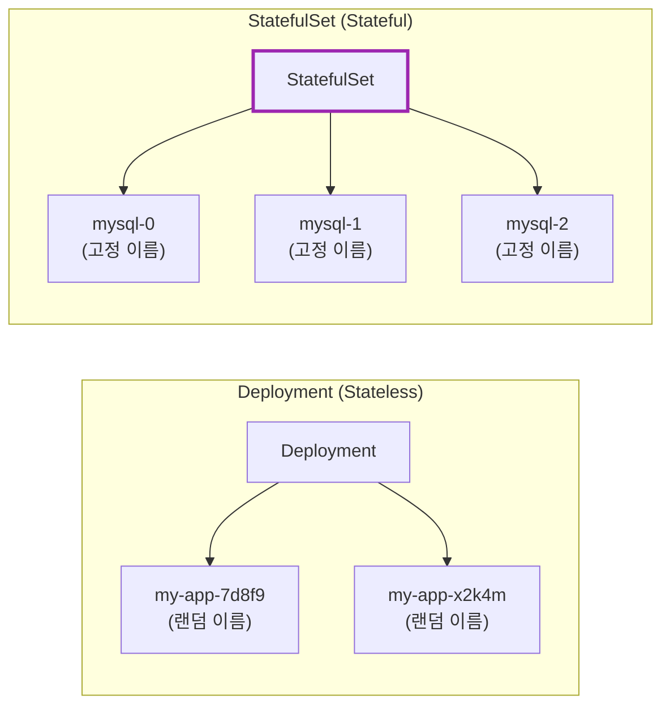
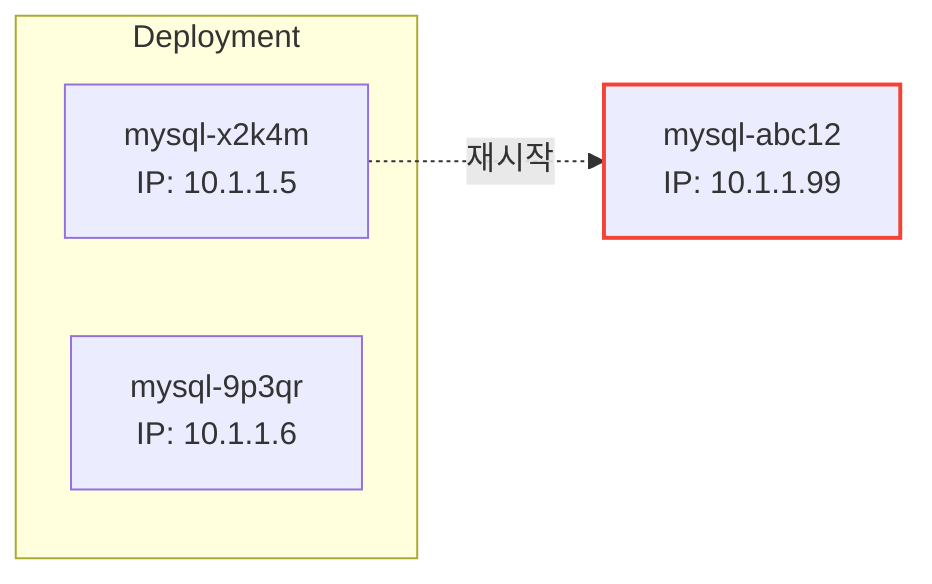
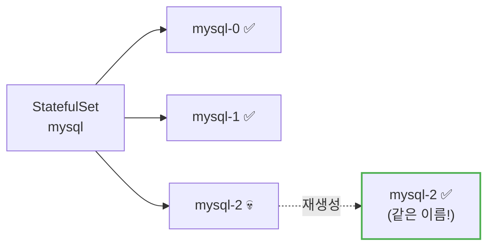
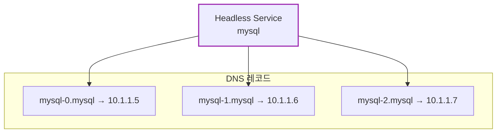
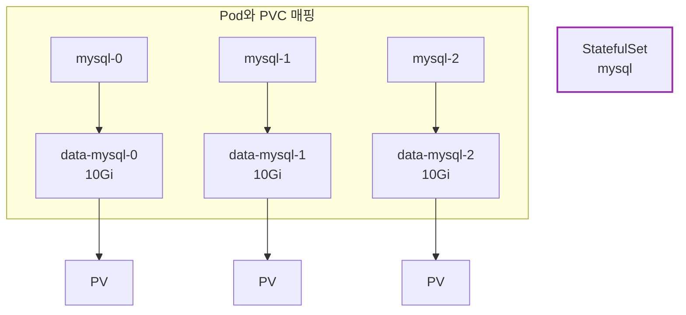
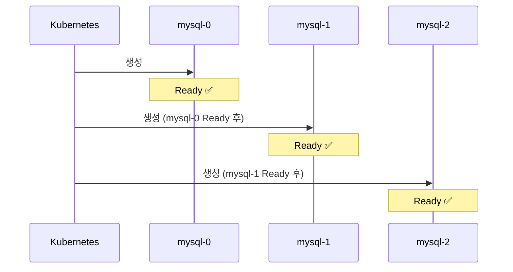
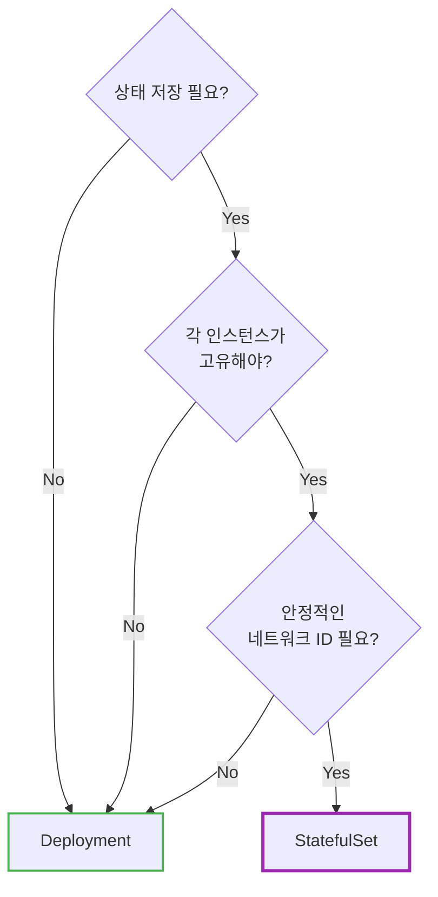
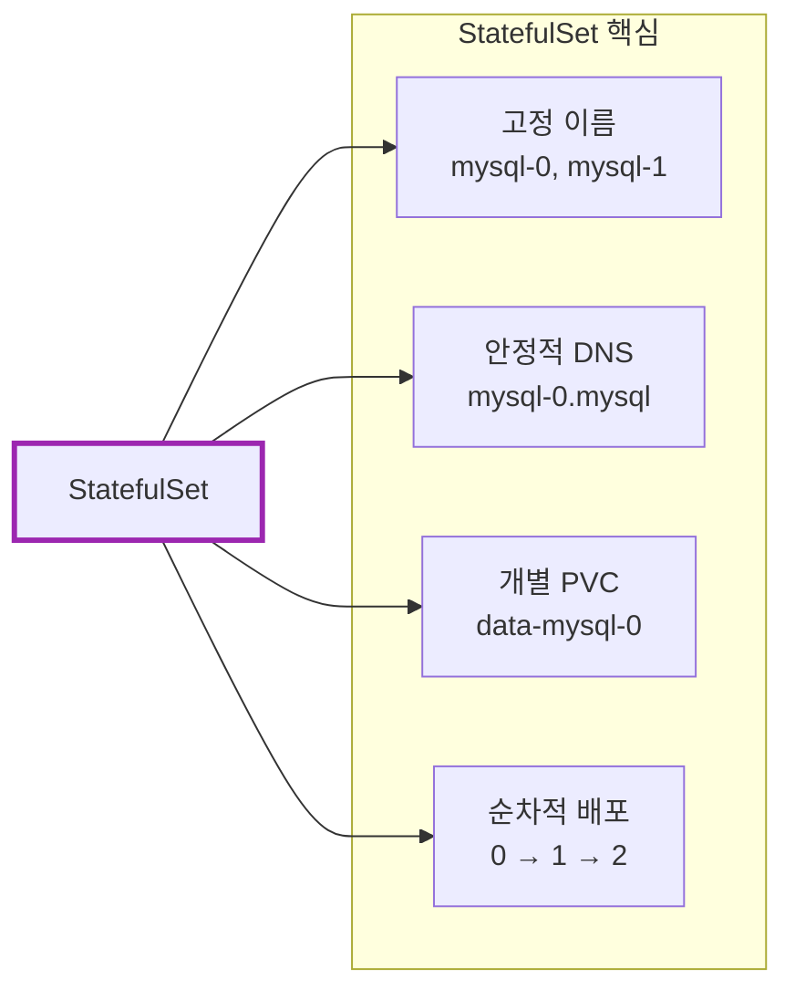

# Kubernetes StatefulSet

Deployment로 MySQL을 배포하면 어떤 문제가 생길까?

## 결론부터 말하면

**StatefulSet**은 **상태를 가진 애플리케이션**(데이터베이스, 메시지 큐 등)을 위한 워크로드다. Deployment와 달리 **고정된 이름**, **안정적인 네트워크 ID**, **영구 스토리지**를 보장한다.



| 특징 | Deployment | StatefulSet |
|------|------------|-------------|
| Pod 이름 | 랜덤 (`app-7d8f9`) | **순차적** (`app-0`, `app-1`) |
| 네트워크 ID | 불안정 | **안정적** (Headless Service) |
| 스토리지 | 공유 또는 없음 | **개별 PVC** 유지 |
| 배포/삭제 순서 | 동시 | **순차적** (0→1→2) |
| 사용 대상 | 웹 서버, API | DB, Kafka, Redis Cluster |

---

## 1. 왜 Deployment로는 부족한가?

### 1.1 데이터베이스의 요구사항

MySQL, PostgreSQL, MongoDB 같은 데이터베이스를 Kubernetes에 배포한다고 생각해보자. 데이터베이스는 다음을 요구한다:

| 요구사항 | 이유 |
|----------|------|
| **영구 스토리지** | 데이터가 Pod 재시작 후에도 유지되어야 함 |
| **고정 네트워크 ID** | 클러스터 노드들이 서로를 찾아야 함 |
| **순차적 배포** | Primary가 먼저 시작되어야 Replica가 연결 가능 |
| **고정 이름** | 클러스터 설정에 노드 이름이 필요 |

### 1.2 Deployment로 DB를 배포하면?

**문제 1: Pod 이름이 랜덤**

```bash
# Deployment의 Pod 이름
mysql-deployment-7d8f9b6c4d-x2k4m
mysql-deployment-7d8f9b6c4d-9p3qr

# Pod가 재시작되면?
mysql-deployment-7d8f9b6c4d-abc12  ← 이름 바뀜!
```

MySQL 클러스터 설정에 `node1`, `node2`라고 적어뒀는데, Pod 이름이 바뀌면 찾을 수 없다.

**문제 2: 네트워크 ID가 불안정**



Pod가 재시작되면 IP도 바뀐다. 다른 노드가 기존 IP로 연결하면 실패한다.

**문제 3: 스토리지가 뒤섞임**

Deployment는 모든 Pod가 동일하다고 가정한다. 각 DB 인스턴스가 **자기만의** 데이터를 가져야 하는데, Deployment는 이를 보장하지 않는다.

### 1.3 StatefulSet의 해결책

| 문제 | StatefulSet의 해결책 |
|------|---------------------|
| Pod 이름 랜덤 | **순차적 이름** (`mysql-0`, `mysql-1`) |
| 네트워크 ID 불안정 | **Headless Service**로 고정 DNS |
| 스토리지 뒤섞임 | **개별 PVC** (VolumeClaimTemplate) |
| 순서 없는 배포 | **순차적 배포/삭제** |

---

## 2. StatefulSet의 핵심 특징

### 2.1 안정적인 Pod 이름

StatefulSet의 Pod는 **순차적인 인덱스**를 가진다:

```
mysql-0  (첫 번째)
mysql-1  (두 번째)
mysql-2  (세 번째)
```

Pod가 죽고 다시 생성되어도 **같은 이름**을 유지한다.



### 2.2 Headless Service와 안정적인 네트워크 ID

StatefulSet은 **Headless Service**와 함께 사용한다. Headless Service는 `clusterIP: None`인 Service다.

```yaml
apiVersion: v1
kind: Service
metadata:
  name: mysql
spec:
  clusterIP: None        # Headless Service!
  selector:
    app: mysql
  ports:
  - port: 3306
```

**일반 Service vs Headless Service:**

| 구분 | 일반 Service | Headless Service |
|------|-------------|------------------|
| ClusterIP | 있음 (가상 IP) | **없음** |
| DNS 응답 | Service IP 1개 | **Pod IP 목록 전체** |
| 용도 | 로드밸런싱 | 개별 Pod 접근 |

**Headless Service가 제공하는 DNS:**

```bash
# 각 Pod에 고유한 DNS 이름
mysql-0.mysql.default.svc.cluster.local
mysql-1.mysql.default.svc.cluster.local
mysql-2.mysql.default.svc.cluster.local

# 형식: <pod-name>.<service-name>.<namespace>.svc.cluster.local
```



**왜 중요한가?**

MySQL Replication 설정에서:
```
# Primary
mysql-0.mysql

# Replicas
mysql-1.mysql → Primary: mysql-0.mysql
mysql-2.mysql → Primary: mysql-0.mysql
```

Pod가 재시작되어도 DNS 이름은 그대로다!

### 2.3 개별 영구 스토리지 (VolumeClaimTemplate)

StatefulSet은 `volumeClaimTemplates`로 **각 Pod마다** PVC를 자동 생성한다.

```yaml
apiVersion: apps/v1
kind: StatefulSet
metadata:
  name: mysql
spec:
  serviceName: mysql
  replicas: 3
  selector:
    matchLabels:
      app: mysql
  template:
    metadata:
      labels:
        app: mysql
    spec:
      containers:
      - name: mysql
        image: mysql:8.0
        volumeMounts:
        - name: data
          mountPath: /var/lib/mysql
  volumeClaimTemplates:         # 핵심!
  - metadata:
      name: data
    spec:
      accessModes: ["ReadWriteOnce"]
      resources:
        requests:
          storage: 10Gi
```

**자동 생성되는 PVC:**

```
data-mysql-0   (mysql-0 전용)
data-mysql-1   (mysql-1 전용)
data-mysql-2   (mysql-2 전용)
```



**중요:** Pod가 삭제되어도 **PVC는 유지**된다. 새 Pod가 같은 이름으로 생성되면 기존 PVC에 다시 연결된다.

### 2.4 순차적 배포와 삭제

**배포 순서:** 0 → 1 → 2 (이전 Pod가 Ready 되어야 다음 Pod 생성)



**삭제 순서:** 2 → 1 → 0 (역순)

이 순서가 왜 중요한가?
- **Primary가 먼저** 시작되어야 Replica가 연결 가능
- **Replica가 먼저** 종료되어야 안전한 shutdown

---

## 3. StatefulSet YAML 예시

### 3.1 전체 구성

```yaml
---
# 1. Headless Service
apiVersion: v1
kind: Service
metadata:
  name: mysql
  labels:
    app: mysql
spec:
  clusterIP: None
  selector:
    app: mysql
  ports:
  - port: 3306
    name: mysql

---
# 2. StatefulSet
apiVersion: apps/v1
kind: StatefulSet
metadata:
  name: mysql
spec:
  serviceName: mysql         # Headless Service 이름
  replicas: 3
  selector:
    matchLabels:
      app: mysql
  template:
    metadata:
      labels:
        app: mysql
    spec:
      containers:
      - name: mysql
        image: mysql:8.0
        env:
        - name: MYSQL_ROOT_PASSWORD
          valueFrom:
            secretKeyRef:
              name: mysql-secret
              key: password
        ports:
        - containerPort: 3306
        volumeMounts:
        - name: data
          mountPath: /var/lib/mysql
        readinessProbe:
          exec:
            command: ["mysqladmin", "ping"]
          initialDelaySeconds: 10
          periodSeconds: 5
  volumeClaimTemplates:
  - metadata:
      name: data
    spec:
      accessModes: ["ReadWriteOnce"]
      storageClassName: standard
      resources:
        requests:
          storage: 10Gi
```

### 3.2 핵심 필드 설명

| 필드 | 설명 |
|------|------|
| `serviceName` | Headless Service 이름 (필수) |
| `replicas` | Pod 개수 |
| `volumeClaimTemplates` | Pod별 PVC 템플릿 |
| `podManagementPolicy` | `OrderedReady` (기본) 또는 `Parallel` |

---

## 4. Pod Management Policy

### 4.1 OrderedReady (기본값)

순차적으로 배포/삭제한다. DB 클러스터처럼 **순서가 중요한** 경우에 적합.

```yaml
spec:
  podManagementPolicy: OrderedReady  # 기본값
```

### 4.2 Parallel

모든 Pod를 **동시에** 배포/삭제한다. 순서가 중요하지 않은 경우 더 빠르다.

```yaml
spec:
  podManagementPolicy: Parallel
```

---

## 5. StatefulSet 업데이트 전략

### 5.1 RollingUpdate (기본값)

```yaml
spec:
  updateStrategy:
    type: RollingUpdate
    rollingUpdate:
      partition: 0       # 이 인덱스 이상만 업데이트
```

**역순으로** 업데이트: 2 → 1 → 0

**partition 활용:** 카나리 배포

```yaml
# partition: 2 → mysql-2만 새 버전
# partition: 1 → mysql-2, mysql-1만 새 버전
# partition: 0 → 전체 업데이트
```

### 5.2 OnDelete

Pod를 수동으로 삭제해야만 업데이트된다.

```yaml
spec:
  updateStrategy:
    type: OnDelete
```

---

## 6. StatefulSet vs Deployment 선택 기준



| 사용 대상 | 권장 워크로드 |
|----------|--------------|
| **Deployment** | 웹 서버, API 서버, 마이크로서비스 |
| **StatefulSet** | MySQL, PostgreSQL, MongoDB, Kafka, Zookeeper, Redis Cluster, Elasticsearch |

---

## 7. 주의사항

### 7.1 PVC 삭제는 수동

StatefulSet을 삭제해도 **PVC는 자동 삭제되지 않는다**. 데이터 보호를 위해 의도적으로 설계된 것.

```bash
# StatefulSet 삭제
kubectl delete statefulset mysql

# PVC는 여전히 존재
kubectl get pvc
# data-mysql-0   Bound   ...
# data-mysql-1   Bound   ...

# PVC 수동 삭제 (데이터 삭제됨!)
kubectl delete pvc data-mysql-0 data-mysql-1 data-mysql-2
```

### 7.2 Headless Service 필수

StatefulSet은 `serviceName`에 지정된 Headless Service가 **반드시 존재해야** 한다.

### 7.3 스토리지 클래스 확인

`volumeClaimTemplates`에서 사용하는 StorageClass가 **동적 프로비저닝**을 지원하는지 확인하라.

```bash
kubectl get storageclass
```

---

## 8. 자주 쓰는 명령어

```bash
# StatefulSet 조회
kubectl get statefulset
kubectl describe statefulset mysql

# Pod 조회 (순서대로 표시)
kubectl get pods -l app=mysql

# 특정 Pod 접속
kubectl exec -it mysql-0 -- mysql -u root -p

# 스케일링 (순차적으로 증가/감소)
kubectl scale statefulset mysql --replicas=5

# 롤링 업데이트 상태
kubectl rollout status statefulset mysql

# PVC 조회
kubectl get pvc -l app=mysql
```

---

## 9. 정리



| 질문 | 답변 |
|------|------|
| DB를 Deployment로 배포해도 되나요? | ⚠️ 단일 인스턴스는 가능, 클러스터는 StatefulSet |
| PVC가 자동 삭제되나요? | ❌ 데이터 보호를 위해 수동 삭제 필요 |
| 일반 Service를 써도 되나요? | ❌ Headless Service 필수 |

**핵심 기억:**
1. StatefulSet = **상태가 있는** 애플리케이션용 (DB, 메시지 큐)
2. **고정 이름** (`mysql-0`) + **고정 DNS** (`mysql-0.mysql`)
3. **VolumeClaimTemplate**으로 Pod별 개별 스토리지
4. **Headless Service** 필수 (`clusterIP: None`)
5. **순차적** 배포(0→1→2), **역순** 삭제(2→1→0)

---

## 출처

- [Kubernetes Documentation - StatefulSets](https://kubernetes.io/docs/concepts/workloads/controllers/statefulset/) - 공식 문서
- [Kubernetes Documentation - Headless Services](https://kubernetes.io/docs/concepts/services-networking/service/#headless-services) - 공식 문서
- [Kubernetes Documentation - Run a Replicated Stateful Application](https://kubernetes.io/docs/tasks/run-application/run-replicated-stateful-application/) - 공식 튜토리얼
