# Kubernetes StatefulSet

Deployment로 MySQL을 배포하면 어떤 문제가 생길까?

## 결론부터 말하면

**StatefulSet**은 **상태를 가진 애플리케이션**(데이터베이스, 메시지 큐 등)을 위한 워크로드다. Deployment와 달리 **고정된 이름**, **안정적인 네트워크 ID**, **영구 스토리지**를 보장한다.

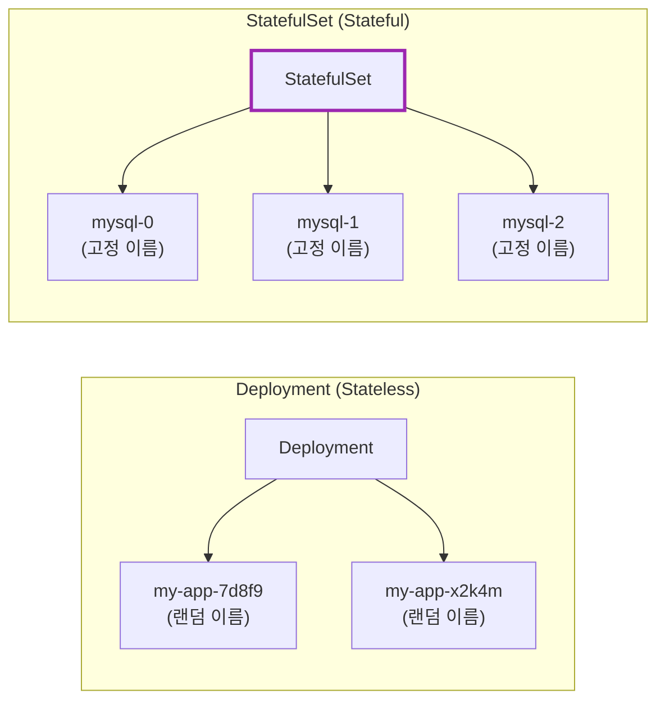

| 특징 | Deployment | StatefulSet |
|------|------------|-------------|
| Pod 이름 | 랜덤 (`app-7d8f9`) | **순차적** (`app-0`, `app-1`) |
| 네트워크 ID | 불안정 | **안정적** (Headless Service) |
| 스토리지 | 공유 또는 없음 | **개별 PVC** 유지 |
| 배포/삭제 순서 | 동시 | **순차적** (0→1→2) |
| 사용 대상 | 웹 서버, API | DB, Kafka, Redis Cluster |

---

## 1. 왜 StatefulSet vs Deployment 비교가 많은가?

### 1.1 "Cattle vs Pets" - 근본적인 철학 차이

Kubernetes 세계에서 유명한 비유가 있다: **"Cattle, not Pets"** (소떼처럼, 애완동물처럼 다루지 마라).

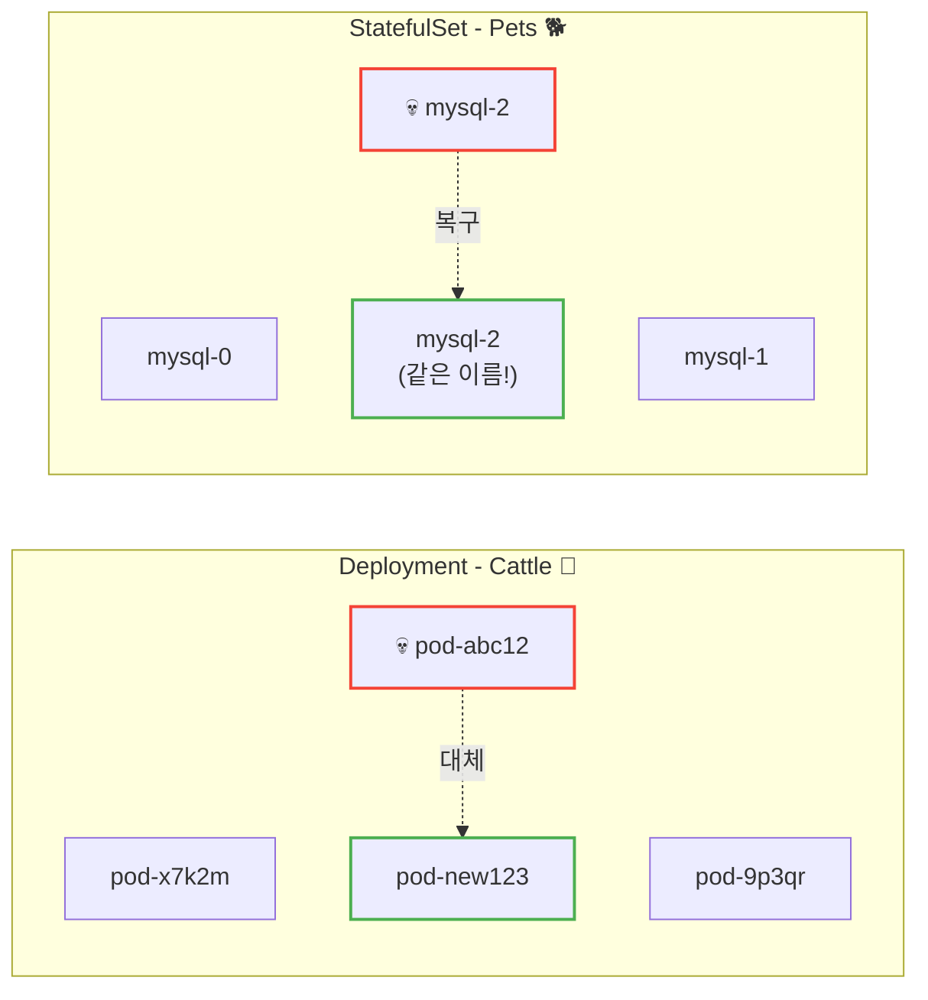

| 관점 | Deployment (Cattle) | StatefulSet (Pets) |
|------|--------------------|--------------------|
| **Pod 정체성** | 교체 가능, 일회용 | 고유한 정체성 유지 |
| **죽으면?** | 새 Pod로 대체 (이름 바뀜) | **같은 이름** 으로 복구 |
| **데이터** | 상태 없음 (Stateless) | 개별 데이터 보존 |
| **비유** | 소떼의 한 마리가 아프면 대체 | 애완견이 아프면 치료 |

**왜 비교가 많은가?**

1. **Deployment가 기본이다**: 대부분의 애플리케이션은 Stateless이므로 Deployment를 먼저 배운다
2. **StatefulSet은 특수 케이스다**: DB나 메시지 큐처럼 상태가 필요할 때만 사용
3. **잘못 선택하면 문제가 생긴다**: Stateless 앱에 StatefulSet을 쓰면 불필요한 복잡성, Stateful 앱에 Deployment를 쓰면 데이터 손실

---

## 2. 왜 Deployment로는 부족한가?

### 2.1 데이터베이스의 요구사항

MySQL, PostgreSQL, MongoDB 같은 데이터베이스를 Kubernetes에 배포한다고 생각해보자. 데이터베이스는 다음을 요구한다:

| 요구사항 | 이유 |
|----------|------|
| **영구 스토리지** | 데이터가 Pod 재시작 후에도 유지되어야 함 |
| **고정 네트워크 ID** | 클러스터 노드들이 서로를 찾아야 함 |
| **순차적 배포** | Primary가 먼저 시작되어야 Replica가 연결 가능 |
| **고정 이름** | 클러스터 설정에 노드 이름이 필요 |

### 2.2 Deployment로 DB를 배포하면?

**문제 1: Pod 이름이 랜덤**

```bash
# Deployment의 Pod 이름
mysql-deployment-7d8f9b6c4d-x2k4m
mysql-deployment-7d8f9b6c4d-9p3qr

# Pod가 재시작되면?
mysql-deployment-7d8f9b6c4d-abc12  ← 이름 바뀜!
```

MySQL 클러스터 설정에 `node1`, `node2`라고 적어뒀는데, Pod 이름이 바뀌면 찾을 수 없다.

**문제 2: 네트워크 ID가 불안정**

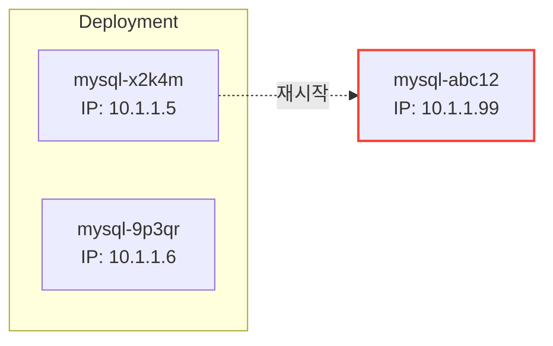

Pod가 재시작되면 IP도 바뀐다. 다른 노드가 기존 IP로 연결하면 실패한다.

**문제 3: 스토리지가 뒤섞임**

Deployment는 모든 Pod가 동일하다고 가정한다. 각 DB 인스턴스가 **자기만의** 데이터를 가져야 하는데, Deployment는 이를 보장하지 않는다.

### 2.3 StatefulSet의 해결책

| 문제 | StatefulSet의 해결책 |
|------|---------------------|
| Pod 이름 랜덤 | **순차적 이름** (`mysql-0`, `mysql-1`) |
| 네트워크 ID 불안정 | **Headless Service**로 고정 DNS |
| 스토리지 뒤섞임 | **개별 PVC** (VolumeClaimTemplate) |
| 순서 없는 배포 | **순차적 배포/삭제** |

---

## 3. StatefulSet의 핵심 특징

### 3.1 안정적인 Pod 이름

StatefulSet의 Pod는 **순차적인 인덱스**를 가진다:

```
mysql-0  (첫 번째)
mysql-1  (두 번째)
mysql-2  (세 번째)
```

Pod가 죽고 다시 생성되어도 **같은 이름**을 유지한다.

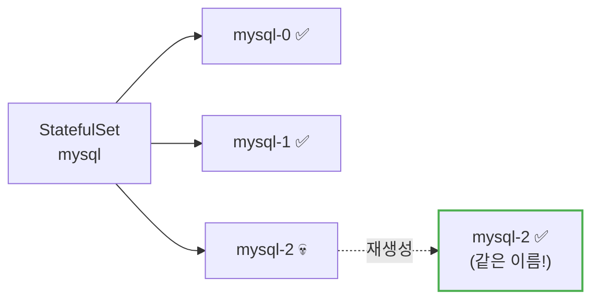

### 3.2 Headless Service와 안정적인 네트워크 ID

StatefulSet은 **Headless Service**와 함께 사용한다. Headless Service는 `clusterIP: None`인 Service다.

```yaml
apiVersion: v1
kind: Service
metadata:
  name: mysql
spec:
  clusterIP: None        # Headless Service!
  selector:
    app: mysql
  ports:
  - port: 3306
```

**일반 Service vs Headless Service:**

| 구분 | 일반 Service | Headless Service |
|------|-------------|------------------|
| ClusterIP | 있음 (가상 IP) | **없음** |
| DNS 응답 | Service IP 1개 | **Pod IP 목록 전체** |
| 용도 | 로드밸런싱 | 개별 Pod 접근 |

**Headless Service가 제공하는 DNS:**

```bash
# 각 Pod에 고유한 DNS 이름
mysql-0.mysql.default.svc.cluster.local
mysql-1.mysql.default.svc.cluster.local
mysql-2.mysql.default.svc.cluster.local

# 형식: <pod-name>.<service-name>.<namespace>.svc.cluster.local
```

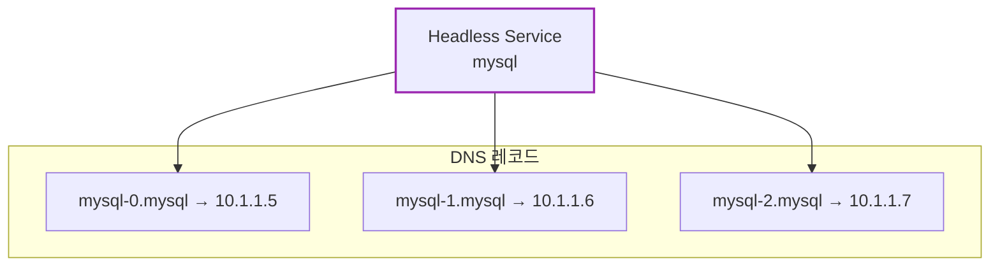

**왜 중요한가?**

MySQL Replication 설정에서:
```
# Primary
mysql-0.mysql

# Replicas
mysql-1.mysql → Primary: mysql-0.mysql
mysql-2.mysql → Primary: mysql-0.mysql
```

Pod가 재시작되어도 DNS 이름은 그대로다!

### 3.3 개별 영구 스토리지 (VolumeClaimTemplate)

StatefulSet은 `volumeClaimTemplates`로 **각 Pod마다** PVC를 자동 생성한다.

```yaml
apiVersion: apps/v1
kind: StatefulSet
metadata:
  name: mysql
spec:
  serviceName: mysql
  replicas: 3
  selector:
    matchLabels:
      app: mysql
  template:
    metadata:
      labels:
        app: mysql
    spec:
      containers:
      - name: mysql
        image: mysql:8.0
        volumeMounts:
        - name: data
          mountPath: /var/lib/mysql
  volumeClaimTemplates:         # 핵심!
  - metadata:
      name: data
    spec:
      accessModes: ["ReadWriteOnce"]
      resources:
        requests:
          storage: 10Gi
```

**자동 생성되는 PVC:**

```
data-mysql-0   (mysql-0 전용)
data-mysql-1   (mysql-1 전용)
data-mysql-2   (mysql-2 전용)
```

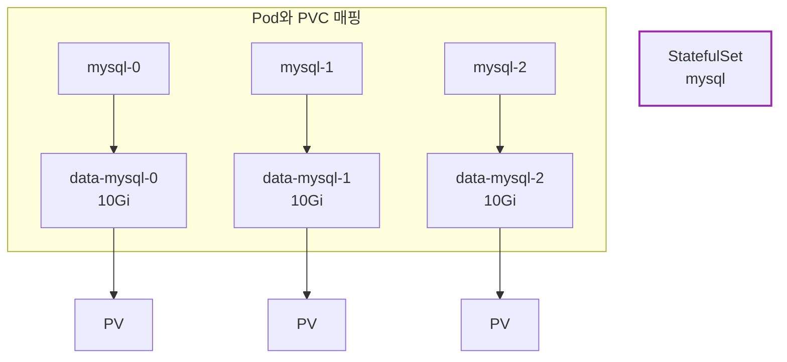

**중요:** Pod가 삭제되어도 **PVC는 유지**된다. 새 Pod가 같은 이름으로 생성되면 기존 PVC에 다시 연결된다.

### 3.4 순차적 배포와 삭제

**배포 순서:** 0 → 1 → 2 (이전 Pod가 Ready 되어야 다음 Pod 생성)

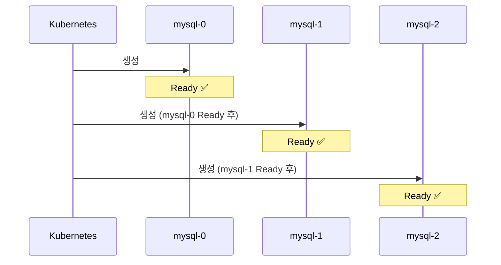

**삭제 순서:** 2 → 1 → 0 (역순)

이 순서가 왜 중요한가?
- **Primary가 먼저** 시작되어야 Replica가 연결 가능
- **Replica가 먼저** 종료되어야 안전한 shutdown

---

## 4. StatefulSet YAML 예시

### 4.1 전체 구성

```yaml
---
# 1. Headless Service
apiVersion: v1
kind: Service
metadata:
  name: mysql
  labels:
    app: mysql
spec:
  clusterIP: None
  selector:
    app: mysql
  ports:
  - port: 3306
    name: mysql

---
# 2. StatefulSet
apiVersion: apps/v1
kind: StatefulSet
metadata:
  name: mysql
spec:
  serviceName: mysql         # Headless Service 이름
  replicas: 3
  selector:
    matchLabels:
      app: mysql
  template:
    metadata:
      labels:
        app: mysql
    spec:
      containers:
      - name: mysql
        image: mysql:8.0
        env:
        - name: MYSQL_ROOT_PASSWORD
          valueFrom:
            secretKeyRef:
              name: mysql-secret
              key: password
        ports:
        - containerPort: 3306
        volumeMounts:
        - name: data
          mountPath: /var/lib/mysql
        readinessProbe:
          exec:
            command: ["mysqladmin", "ping"]
          initialDelaySeconds: 10
          periodSeconds: 5
  volumeClaimTemplates:
  - metadata:
      name: data
    spec:
      accessModes: ["ReadWriteOnce"]
      storageClassName: standard
      resources:
        requests:
          storage: 10Gi
```

### 4.2 핵심 필드 설명

| 필드 | 설명 |
|------|------|
| `serviceName` | Headless Service 이름 (필수) |
| `replicas` | Pod 개수 |
| `volumeClaimTemplates` | Pod별 PVC 템플릿 |
| `podManagementPolicy` | `OrderedReady` (기본) 또는 `Parallel` |

---

## 5. Pod Management Policy

### 5.1 OrderedReady (기본값)

순차적으로 배포/삭제한다. DB 클러스터처럼 **순서가 중요한** 경우에 적합.

```yaml
spec:
  podManagementPolicy: OrderedReady  # 기본값
```

### 5.2 Parallel

모든 Pod를 **동시에** 배포/삭제한다. 순서가 중요하지 않은 경우 더 빠르다.

```yaml
spec:
  podManagementPolicy: Parallel
```

> **⚠️ 주의:** Primary/Replica 구조처럼 Pod 간 의존성이 있는 애플리케이션에서 `Parallel` 정책을 사용하면 **레이스 컨디션**이나 **시작 실패**가 발생할 수 있다. 이런 경우 `OrderedReady`를 사용하라.

---

## 6. StatefulSet 업데이트 전략

### 6.1 RollingUpdate (기본값)

```yaml
spec:
  updateStrategy:
    type: RollingUpdate
    rollingUpdate:
      partition: 0       # 이 인덱스 이상만 업데이트
```

**역순으로** 업데이트: 2 → 1 → 0

**partition 활용:** 카나리 배포

```yaml
# partition: 2 → mysql-2만 새 버전
# partition: 1 → mysql-2, mysql-1만 새 버전
# partition: 0 → 전체 업데이트
```

### 6.2 OnDelete

Pod를 수동으로 삭제해야만 업데이트된다.

```yaml
spec:
  updateStrategy:
    type: OnDelete
```

---

## 7. StatefulSet vs Deployment 선택 기준

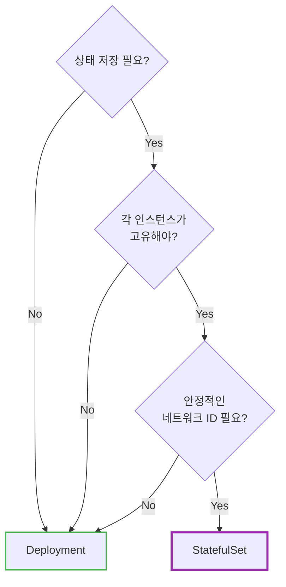

| 사용 대상 | 권장 워크로드 |
|----------|--------------|
| **Deployment** | 웹 서버, API 서버, 마이크로서비스 |
| **StatefulSet** | MySQL, PostgreSQL, MongoDB, Kafka, Zookeeper, Redis Cluster, Elasticsearch |

---

## 8. StatefulSet을 사용하지 말아야 할 경우

### 8.1 Anti-Patterns

StatefulSet은 강력하지만, **잘못 사용하면 오히려 복잡성만 증가** 한다.

| Anti-Pattern | 문제점 | 권장 |
|--------------|--------|------|
| **Stateless 앱에 StatefulSet 사용** | 불필요한 PVC 생성, 느린 배포 | Deployment 사용 |
| **안정적 네트워크 ID 불필요** | Headless Service 관리 부담 | Deployment 사용 |
| **순서가 중요하지 않은 앱** | OrderedReady로 인한 느린 스케일링 | Deployment 사용 |

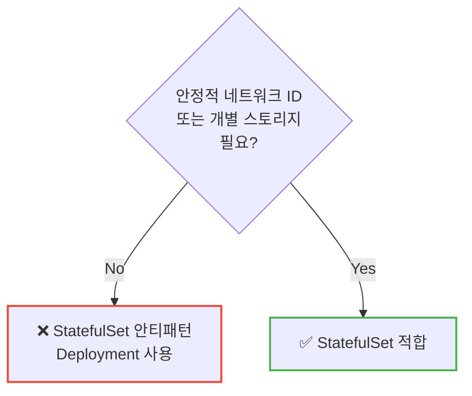

### 8.2 StatefulSet의 한계

| 한계 | 설명 |
|------|------|
| **느린 복구** | 노드 장애 시 Pod 재스케줄링이 Deployment보다 느림 (PV 마운트 대기) |
| **Rolling Update 실패 시 수동 복구** | `OrderedReady` 정책에서 롤링 업데이트 실패 시 수동 개입 필요 |
| **VolumeClaimTemplates 변경 불가** | 기존 StatefulSet의 PVC 템플릿 수정 불가, 새로 생성해야 함 |
| **애플리케이션 레벨 클러스터링 미지원** | Primary/Replica 설정은 별도로 해야 함 |

> **⚠️ 노드 장애 시 다운타임:** StatefulSet Pod는 `ReadWriteOnce` PV를 사용하므로, 노드가 죽으면 Kubernetes가 해당 노드를 **NotReady로 판정할 때까지** (기본 5분) 새 노드에서 Pod가 시작되지 않는다. 이 시간 동안 해당 Pod는 다운 상태다.

---

## 9. k8s에서 DB 운영 vs 관리형 DB (RDS)

### 9.1 현실적인 고민

**"StatefulSet으로 MySQL을 운영할까, RDS를 쓸까?"** - 이건 실무에서 자주 나오는 질문이다.

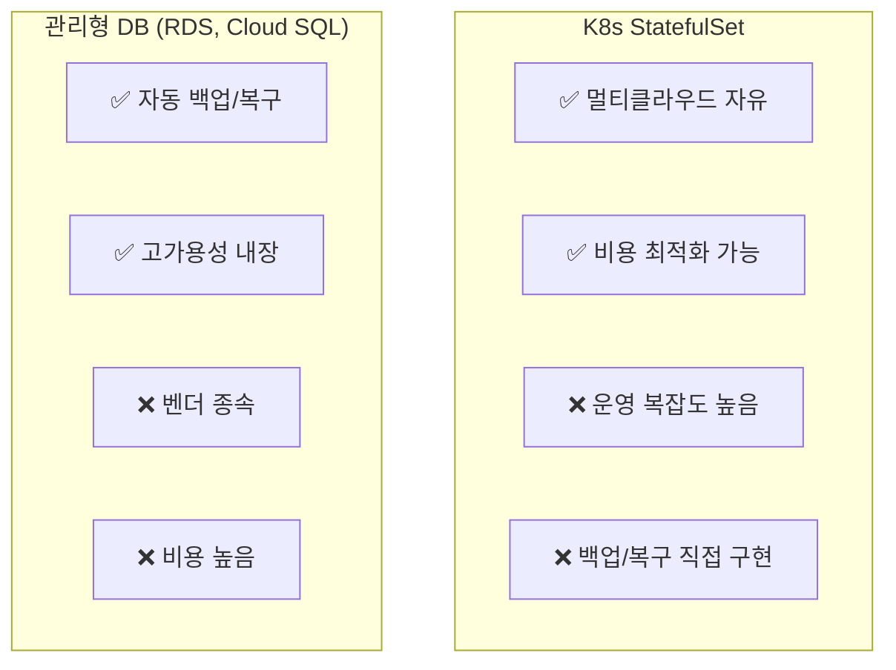

### 9.2 언제 무엇을 선택할까?

| 상황 | 권장 선택 | 이유 |
|------|----------|------|
| **프로덕션 핵심 DB** | 관리형 DB (RDS) | 자동 백업, 페일오버, 운영 부담 감소 |
| **개발/테스트 환경** | StatefulSet | 비용 절감, 유연성 |
| **캐시 레이어** (Redis, Memcached) | StatefulSet | 데이터 손실 허용, 재구축 용이 |
| **멀티클라우드 필수** | StatefulSet + Operator | 벤더 종속 회피 |
| **분산 DB** (Cassandra, CockroachDB) | StatefulSet + Operator | 애초에 분산 설계된 DB |

### 9.3 사용자 경험에서 배우는 교훈

> "StatefulSet으로 MySQL을 운영하려고 했는데, 백업, 복제, 장애 복구를 직접 구현하다 보니 DB 운영이 본업이 되어버렸다. 결국 RDS로 전환했고, 그 비용은 충분히 가치가 있었다."

**핵심:** StatefulSet은 **인프라** 를 제공할 뿐, **DB 운영** (백업, 복제, 장애 조치, 업그레이드)은 별도로 해결해야 한다.

### 9.4 비용 비교 예시 (참고용)

| 항목 | K8s StatefulSet | AWS RDS |
|------|-----------------|---------|
| **월 인프라 비용** (db.m5.large급) | ~$70-100 | ~$150-200 |
| **운영 인력 비용** | 높음 (DBA 필요) | 낮음 |
| **백업 구현** | 직접 (Velero 등) | 자동 |
| **페일오버** | 직접 구현 | 자동 (Multi-AZ) |

> **결론:** 인프라 비용만 보면 K8s가 저렴하지만, **총 소유 비용(TCO)** 을 고려하면 관리형 DB가 유리한 경우가 많다. 특히 팀에 전담 DBA가 없다면 관리형 DB를 권장한다.

---

## 10. 클라우드별 실무 운영

### 10.1 StorageClass 설정

**StatefulSet의 성능과 안정성은 StorageClass 선택에 크게 좌우된다.**

| 클라우드 | 권장 StorageClass | 특징 |
|----------|------------------|------|
| **AWS EKS** | `gp3` (EBS CSI) | IOPS/처리량 독립 설정 가능, gp2보다 20% 저렴 |
| **Azure AKS** | `managed-premium` | Premium SSD, 프로덕션 권장 |
| **GCP GKE** | `premium-rwo` | SSD 영구 디스크, 리전 복제 지원 |

```yaml
# AWS EKS - gp3 StorageClass 예시
apiVersion: storage.k8s.io/v1
kind: StorageClass
metadata:
  name: ebs-gp3
provisioner: ebs.csi.aws.com
parameters:
  type: gp3
  iops: "3000"
  throughput: "125"
  encrypted: "true"
volumeBindingMode: WaitForFirstConsumer
allowVolumeExpansion: true
```

```yaml
# Azure AKS - Premium StorageClass 예시
apiVersion: storage.k8s.io/v1
kind: StorageClass
metadata:
  name: azure-premium
provisioner: disk.csi.azure.com
parameters:
  skuName: Premium_LRS
volumeBindingMode: WaitForFirstConsumer
allowVolumeExpansion: true
```

```yaml
# GCP GKE - Premium StorageClass 예시
apiVersion: storage.k8s.io/v1
kind: StorageClass
metadata:
  name: premium-rwo
provisioner: pd.csi.storage.gke.io
parameters:
  type: pd-ssd
volumeBindingMode: WaitForFirstConsumer
allowVolumeExpansion: true
```

> **⚠️ storageClassName 주의:** YAML 예시의 `storageClassName: standard`는 **예시일 뿐** 이다. 모든 클러스터에 `standard`가 있는 것은 아니다. 반드시 `kubectl get sc`로 사용 가능한 StorageClass를 확인하라. 잘못 지정하면 PVC가 **Pending** 상태에 머문다.

### 10.2 클라우드별 주의사항

| 클라우드 | 주의사항 |
|----------|----------|
| **AWS EKS** | EBS CSI Driver 설치 필수, IRSA 설정 필요 |
| **Azure AKS** | Azure Disk는 단일 노드에만 마운트 가능 (ReadWriteOnce) |
| **GCP GKE** | Regional PD 사용 시 존 장애에도 데이터 보존 |

### 10.3 멀티 AZ/Region 고려사항

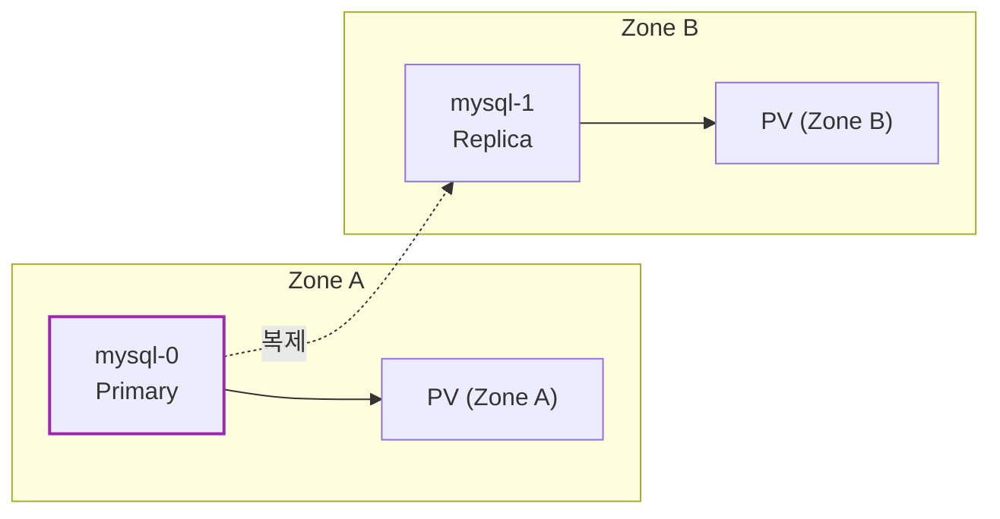

**Pod Topology Spread** 또는 **Pod Anti-Affinity**를 사용해 Pod를 여러 Zone에 분산하라:

```yaml
spec:
  template:
    spec:
      topologySpreadConstraints:
      - maxSkew: 1
        topologyKey: topology.kubernetes.io/zone
        whenUnsatisfiable: DoNotSchedule
        labelSelector:
          matchLabels:
            app: mysql
```

---

## 11. PVC Retention Policy (Kubernetes 1.27+)

### 11.1 자동 PVC 삭제

**Kubernetes 1.27부터 Beta**, **1.32부터 Stable**로 PVC 자동 삭제를 지원한다.

```yaml
apiVersion: apps/v1
kind: StatefulSet
metadata:
  name: mysql
spec:
  persistentVolumeClaimRetentionPolicy:
    whenDeleted: Retain    # StatefulSet 삭제 시
    whenScaled: Delete     # Scale Down 시
```

| 정책 | whenDeleted | whenScaled | 동작 |
|------|-------------|------------|------|
| **기본값** | Retain | Retain | PVC 수동 삭제 필요 |
| **완전 삭제** | Delete | Delete | 자동 정리 (데이터 손실!) |
| **Scale Down만 정리** | Retain | Delete | 스케일 다운 시만 PVC 삭제 |

> **⚠️ 주의:** `whenDeleted: Delete`를 설정하면 StatefulSet 삭제 시 **데이터도 함께 삭제** 된다. 프로덕션에서는 신중하게 사용하라.

---

## 12. Database Operators

### 12.1 왜 Operator인가?

StatefulSet만으로는 **DB 운영의 본질적인 문제** 를 해결하지 못한다:

| StatefulSet이 해주는 것 | StatefulSet이 안 해주는 것 |
|------------------------|---------------------------|
| Pod 순서 보장 | Primary/Replica 역할 설정 |
| 개별 PVC | 자동 백업/복구 |
| 안정적 네트워크 ID | 자동 페일오버 |
| 롤링 업데이트 | DB 버전 업그레이드 자동화 |
| - | DB 메트릭 수집 및 모니터링 |

**Operator**는 이런 "안 해주는 것"을 자동화한다. Kubernetes API를 확장해서 DB 운영 지식을 코드로 구현한 것이다.

### 12.2 주요 Database Operators

| DB | Operator | 특징 |
|----|----------|------|
| **PostgreSQL** | [CloudNativePG](https://cloudnative-pg.io/) | CNCF 프로젝트, 완전 선언적, 외부 의존성 없음 |
| **PostgreSQL** | Zalando Postgres Operator | Patroni 기반, 검증된 안정성 |
| **MySQL** | [MySQL Operator (Oracle)](https://github.com/mysql/mysql-operator) | InnoDB Cluster 관리, 공식 지원 |
| **MySQL** | Percona Operator for MySQL | Group Replication, ProxySQL 통합 |
| **MongoDB** | [Percona Operator for MongoDB](https://www.percona.com/mongodb/software/percona-operator-for-mongodb) | 샤딩, 백업, PITR 지원 |

### 12.3 Operator 사용 예시 (CloudNativePG)

```yaml
apiVersion: postgresql.cnpg.io/v1
kind: Cluster
metadata:
  name: my-postgres
spec:
  instances: 3                    # 자동으로 Primary 1 + Replica 2
  storage:
    size: 10Gi
  backup:
    barmanObjectStore:            # 자동 백업 설정
      destinationPath: s3://my-bucket/backups
      s3Credentials:
        accessKeyId:
          name: aws-creds
          key: ACCESS_KEY_ID
        secretAccessKey:
          name: aws-creds
          key: SECRET_ACCESS_KEY
```

**Operator가 자동으로 해주는 것:**
- StatefulSet, Service, ConfigMap 생성
- Primary 선출 및 Replica 동기화
- 자동 페일오버 (Primary 장애 시)
- 정기 백업 및 WAL 아카이빙
- 무중단 마이너 버전 업그레이드

### 12.4 StatefulSet 직접 관리 vs Operator

| 항목 | StatefulSet 직접 관리 | Operator 사용 |
|------|----------------------|---------------|
| **학습 곡선** | 낮음 | 중간 |
| **운영 복잡도** | 높음 | 낮음 |
| **자동화 수준** | 수동 | 자동 |
| **프로덕션 권장** | ⚠️ 주의 | ✅ 권장 |

> **권장:** 프로덕션 환경에서 DB를 K8s에 배포해야 한다면, StatefulSet을 직접 관리하기보다 **검증된 Operator**를 사용하라. Operator는 수년간의 운영 경험이 코드로 녹아있다.

---

## 13. 주의사항

### 13.1 PVC 삭제는 수동 (기본값)

StatefulSet을 삭제해도 **PVC는 자동 삭제되지 않는다**. 데이터 보호를 위해 의도적으로 설계된 것이다. (11절의 Retention Policy로 변경 가능)

```bash
# StatefulSet 삭제
kubectl delete statefulset mysql

# PVC는 여전히 존재
kubectl get pvc
# data-mysql-0   Bound   ...
# data-mysql-1   Bound   ...

# PVC 수동 삭제 (데이터 삭제됨!)
kubectl delete pvc data-mysql-0 data-mysql-1 data-mysql-2
```

### 13.2 Headless Service 필수

StatefulSet은 `serviceName`에 지정된 Headless Service가 **반드시 존재해야** 한다.

### 13.3 스토리지 클래스 확인

`volumeClaimTemplates`에서 사용하는 StorageClass가 **동적 프로비저닝**을 지원하는지 확인하라.

```bash
# 사용 가능한 StorageClass 확인
kubectl get storageclass

# 기본 StorageClass 확인
kubectl get sc -o jsonpath='{.items[?(@.metadata.annotations.storageclass\.kubernetes\.io/is-default-class=="true")].metadata.name}'
```

### 13.4 graceful shutdown

StatefulSet 삭제 전에 **replicas를 0으로** 스케일 다운하면 순차적으로 안전하게 종료된다.

```bash
# 안전한 종료
kubectl scale statefulset mysql --replicas=0

# Pod가 모두 종료된 후 삭제
kubectl delete statefulset mysql
```

> **⚠️ terminationGracePeriodSeconds:** 절대로 0으로 설정하지 마라. 데이터 손상 위험이 있다.

---

## 14. 자주 쓰는 명령어

```bash
# StatefulSet 조회
kubectl get statefulset
kubectl describe statefulset mysql

# Pod 조회 (순서대로 표시)
kubectl get pods -l app=mysql

# 특정 Pod 접속
kubectl exec -it mysql-0 -- mysql -u root -p

# 스케일링 (순차적으로 증가/감소)
kubectl scale statefulset mysql --replicas=5

# 롤링 업데이트 상태
kubectl rollout status statefulset mysql

# PVC 조회
kubectl get pvc -l app=mysql
```

---

## 15. 정리

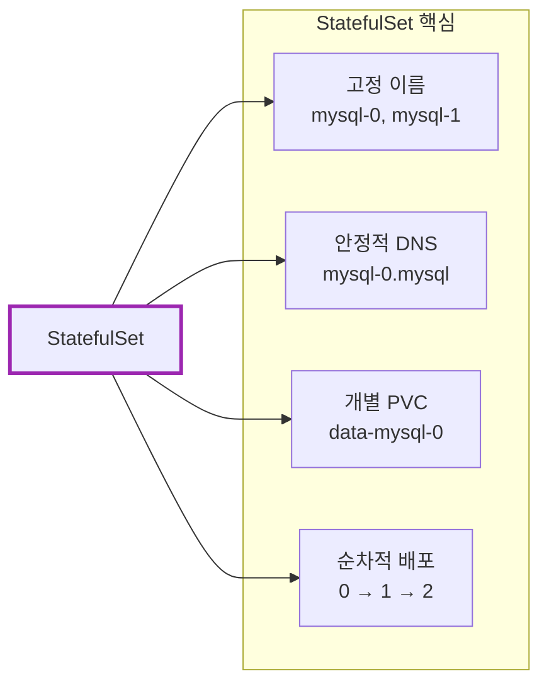

| 질문 | 답변 |
|------|------|
| DB를 Deployment로 배포해도 되나요? | ⚠️ 단일 인스턴스는 가능, 클러스터는 StatefulSet 또는 Operator |
| PVC가 자동 삭제되나요? | ❌ 기본값은 수동 삭제, 1.27+에서 Retention Policy 설정 가능 |
| 일반 Service를 써도 되나요? | ❌ Headless Service 필수 |
| 프로덕션 DB를 K8s에 배포해도 되나요? | ⚠️ 가능하지만, 관리형 DB(RDS) 또는 Operator 권장 |

**핵심 기억:**
1. StatefulSet = **상태가 있는** 애플리케이션용 (DB, 메시지 큐)
2. **고정 이름** (`mysql-0`) + **고정 DNS** (`mysql-0.mysql`)
3. **VolumeClaimTemplate**으로 Pod별 개별 스토리지
4. **Headless Service** 필수 (`clusterIP: None`)
5. **순차적** 배포(0→1→2), **역순** 삭제(2→1→0)
6. **프로덕션 DB**는 관리형 DB(RDS) 또는 **Operator** 권장

**선택 가이드:**

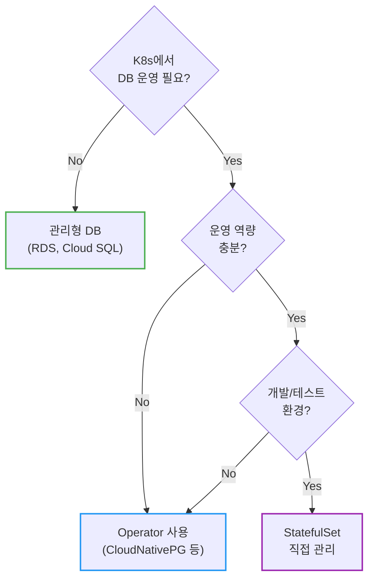

---

## 출처

- [Kubernetes Documentation - StatefulSets](https://kubernetes.io/docs/concepts/workloads/controllers/statefulset/) - 공식 문서
- [Kubernetes Documentation - Headless Services](https://kubernetes.io/docs/concepts/services-networking/service/#headless-services) - 공식 문서
- [Kubernetes Documentation - Run a Replicated Stateful Application](https://kubernetes.io/docs/tasks/run-application/run-replicated-stateful-application/) - 공식 튜토리얼
- [Kubernetes Blog - StatefulSet PVC Auto-Deletion (1.27)](https://kubernetes.io/blog/2023/05/04/kubernetes-1-27-statefulset-pvc-auto-deletion-beta/) - PVC Retention Policy
- [Google Cloud Blog - To run or not to run a database on Kubernetes](https://cloud.google.com/blog/products/databases/to-run-or-not-to-run-a-database-on-kubernetes-what-to-consider) - DB on K8s 고려사항
- [CloudNativePG](https://cloudnative-pg.io/) - PostgreSQL Operator
- [MySQL Operator for Kubernetes](https://github.com/mysql/mysql-operator) - MySQL 공식 Operator
- [Spacelift - StatefulSet vs Deployment](https://spacelift.io/blog/statefulset-vs-deployment) - 비교 가이드
