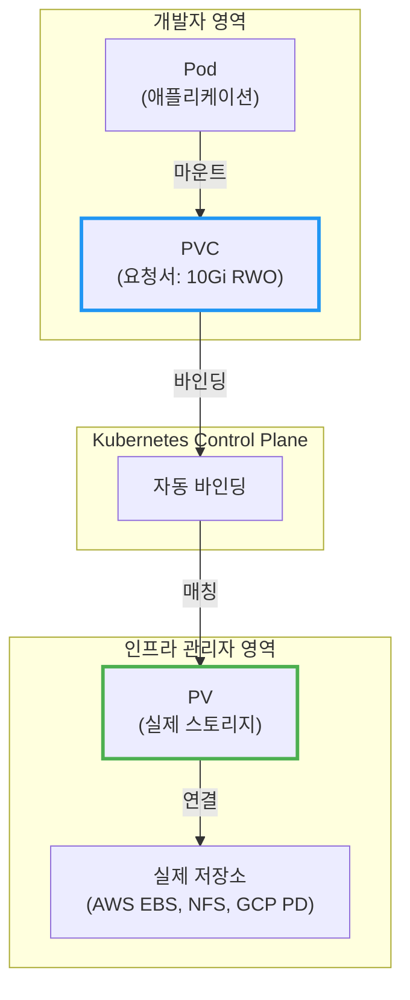
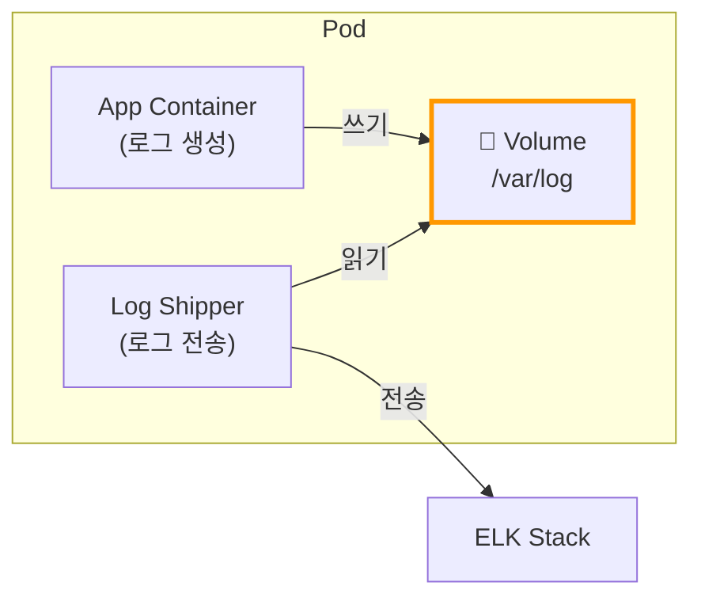
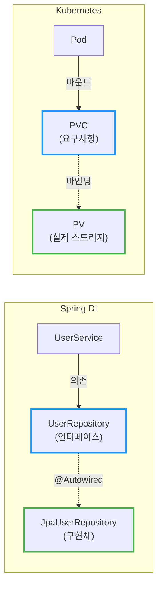
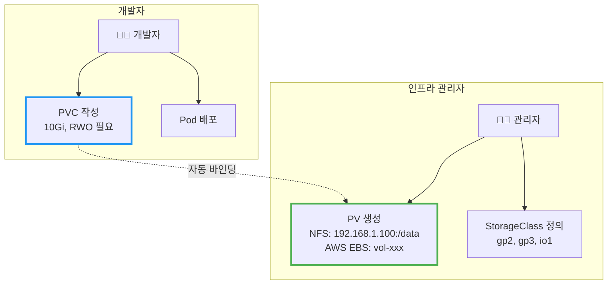
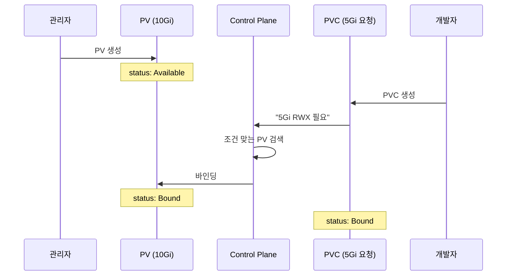
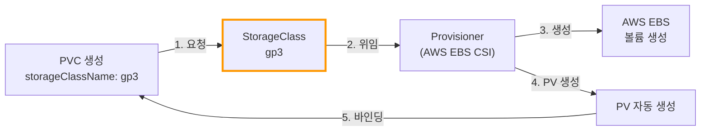
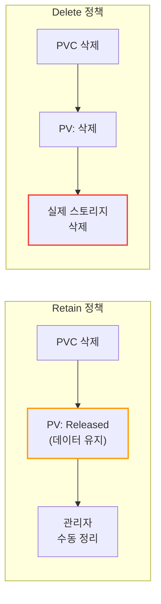
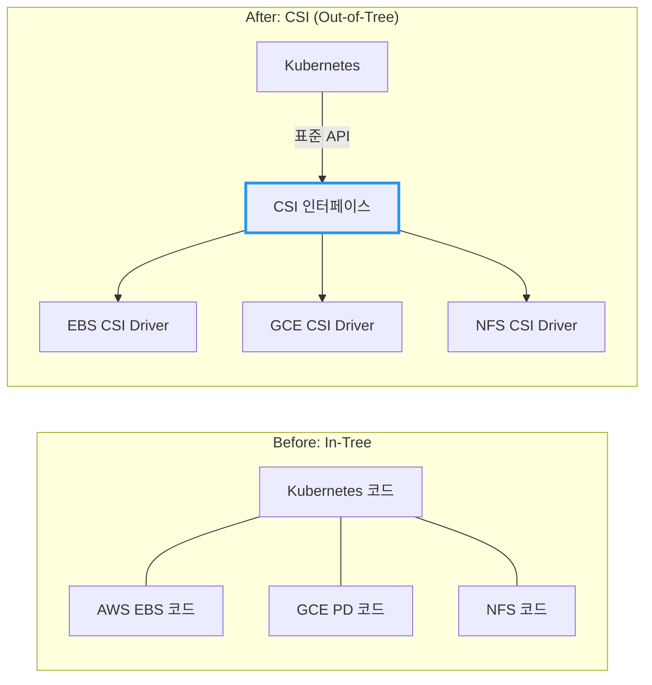
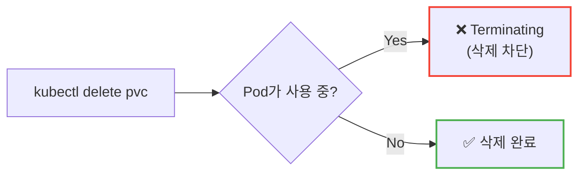

# Kubernetes Volume과 Persistent Storage

Docker에서 `-v` 옵션 없이 MySQL 컨테이너를 실행하면 어떻게 될까? 컨테이너가 재시작되는 순간, 모든 데이터가 사라진다.

## 결론부터 말하면

**Volume** 은 Pod 수준의 스토리지이고, **PersistentVolume(PV)** 은 클러스터 수준의 스토리지다. **PVC** 는 개발자가 "나 10Gi 스토리지 필요해"라고 요청하는 **요청서** 다.



**왜 PV와 PVC가 분리되어 있을까?** Spring DI에서 인터페이스와 구현체를 분리하는 이유와 같다. **느슨한 결합(Loose Coupling)** 을 위해서다.

| 개념 | Spring DI | Kubernetes |
|------|-----------|------------|
| 인터페이스 (요구사항) | `UserRepository` | **PVC** |
| 구현체 (실제 리소스) | `JpaUserRepository` | **PV** |
| 바인딩 | `@Autowired` | Control Plane |
| 환경별 설정 | `@Profile("prod")` | **StorageClass** |

| 구분 | Volume | PersistentVolume |
|------|--------|------------------|
| 생명주기 | Pod와 함께 | Pod와 **독립** |
| 정의 위치 | Pod spec 내부 | 별도 리소스 |
| 재사용 | 불가능 | **가능** |
| 대표 유형 | emptyDir, hostPath | NFS, AWS EBS, GCP PD |

### 실무 관점: 솔직히 얼마나 쓰나?

**PV를 직접 만드는 경우는 거의 없다.** 동적 프로비저닝이 기본이라 PVC만 정의하면 PV는 자동 생성된다.

**PVC도 생각보다 직접 쓸 일이 많지 않다.** 클라우드 환경에서는 관리형 서비스로 대체하는 경우가 많다:

| 워크로드 | PVC 필요? | 실무에서의 선택 |
|----------|-----------|-----------------|
| 웹 서버, API 서버 | ❌ | Stateless - 스토리지 불필요 |
| 데이터베이스 | △ | RDS, CloudSQL 같은 **관리형 DB** |
| 파일 업로드 | △ | S3, GCS 같은 **오브젝트 스토리지** |
| 캐시 (Redis) | △ | ElastiCache, Memorystore |

**그럼 PVC는 언제 쓰나?**

| 케이스 | 이유 |
|--------|------|
| Kafka, Elasticsearch 클러스터 | 관리형 서비스 비용이 비싸거나 커스터마이징 필요 |
| CI/CD 빌드 캐시 | 빌드 속도 향상 |
| ML 학습 데이터 | 대용량 데이터셋 마운트 |
| 온프레미스 환경 | 관리형 서비스 없음 |
| 비용 최적화 | 관리형 서비스보다 직접 운영이 저렴한 경우 |

> **결론:** 이 문서의 내용은 **"왜 이렇게 동작하는지"** 이해하기 위한 것이다. 실무에서 PV YAML을 직접 작성할 일은 드물고, PVC도 StatefulSet의 `volumeClaimTemplates`가 자동 생성하는 경우가 더 많다.

---

## 1. 왜 Volume이 필요한가?

### 1.1 컨테이너의 휘발성 문제

컨테이너는 **불변(Immutable)** 하게 설계되었다. 컨테이너가 재시작되면 이미지 상태로 초기화된다. 이것은 재현 가능한 배포를 위해 의도된 설계지만, 데이터베이스처럼 상태를 유지해야 하는 애플리케이션에는 치명적이다.

```bash
# MySQL 컨테이너 실행 (볼륨 없음)
docker run -d --name mysql mysql:8.0

# 데이터 추가
docker exec mysql mysql -e "CREATE DATABASE myapp;"

# 컨테이너 재시작
docker restart mysql

# 데이터 확인 - 사라졌다!
docker exec mysql mysql -e "SHOW DATABASES;"
```

Kubernetes에서도 마찬가지다. Pod가 재시작되면 컨테이너의 파일시스템은 초기화된다.

### 1.2 Pod 내 컨테이너 간 데이터 공유

또 다른 문제가 있다. 하나의 Pod에 여러 컨테이너가 있을 때, 어떻게 데이터를 공유할까?



Sidecar 패턴에서 로그를 수집하거나, Init Container가 설정 파일을 준비하는 경우 **Volume을 통한 공유** 가 필수다.

---

## 2. Volume의 종류

Kubernetes는 다양한 Volume 유형을 제공한다.

| 종류 | 용도 | 생명주기 | 사용 사례 |
|------|------|----------|-----------|
| **emptyDir** | 임시 스크래치 공간 | Pod 삭제 시 삭제 | 캐시, 컨테이너 간 공유 |
| **hostPath** | 노드 파일시스템 접근 | 노드에 종속 | 로그 수집, 모니터링 에이전트 |
| **configMap** | 설정 파일 주입 | ConfigMap에 종속 | 설정 파일 |
| **secret** | 민감한 정보 주입 | Secret에 종속 | 인증서, 비밀번호 |
| **persistentVolumeClaim** | 영구 스토리지 | PVC에 종속 | 데이터베이스, 파일 저장소 |

### 2.1 emptyDir - 임시 스토리지

`emptyDir`은 Pod가 생성될 때 빈 디렉토리로 시작하고, Pod가 삭제되면 함께 사라진다.

```yaml
apiVersion: v1
kind: Pod
metadata:
  name: cache-pod
spec:
  containers:
  - name: app
    image: nginx
    volumeMounts:
    - name: cache-volume
      mountPath: /cache
  - name: sidecar
    image: busybox
    command: ['sh', '-c', 'while true; do ls /cache; sleep 10; done']
    volumeMounts:
    - name: cache-volume
      mountPath: /cache
  volumes:
  - name: cache-volume
    emptyDir: {}          # Pod 삭제 시 사라짐
```

**언제 사용하나?**
- 컨테이너 간 임시 데이터 공유
- 캐시 데이터 저장
- 체크포인트 저장 (재계산 가능한 데이터)

### 2.2 hostPath의 위험성

`hostPath`는 노드의 파일시스템을 직접 마운트한다. **프로덕션에서는 피해야 한다.**

```yaml
# ⚠️ 위험한 예시 - 프로덕션에서 사용 금지
volumes:
- name: host-volume
  hostPath:
    path: /data
    type: DirectoryOrCreate
```

**왜 위험한가?**

| 문제 | 설명 |
|------|------|
| **노드 종속성** | Pod가 다른 노드로 스케줄링되면 데이터 접근 불가 |
| **보안 위험** | 노드 파일시스템에 직접 접근 → 탈출 공격 가능 |
| **데이터 불일치** | 여러 Pod가 같은 경로 사용 시 충돌 |

**합법적인 사용 사례:**
- DaemonSet으로 로그 수집 (Fluentd, Filebeat)
- 노드 모니터링 에이전트
- 개발 환경에서의 테스트

---

## 3. 왜 PV와 PVC가 분리되어 있는가?

이것이 가장 중요한 "Why" 질문이다.

### 3.1 만약 분리되어 있지 않다면?

PVC 없이 Pod에서 직접 스토리지를 정의한다고 상상해보자.

```yaml
# ❌ 가상의 직접 연결 방식 (실제로는 이렇게 하지 않음)
apiVersion: v1
kind: Pod
metadata:
  name: mysql
spec:
  containers:
  - name: mysql
    image: mysql:8.0
    volumeMounts:
    - name: data
      mountPath: /var/lib/mysql
  volumes:
  - name: data
    awsElasticBlockStore:       # AWS 직접 참조
      volumeID: vol-0123456789
      fsType: ext4
```

**문제점:**

| 문제 | 설명 |
|------|------|
| **클라우드 종속** | AWS에서 GCP로 이전하려면 모든 Pod spec 수정 필요 |
| **환경 불일치** | 개발(minikube)과 프로덕션(AWS)의 spec이 달라짐 |
| **역할 혼란** | 개발자가 `vol-0123456789` 같은 인프라 세부사항을 알아야 함 |
| **재사용 불가** | 같은 스토리지를 다른 Pod에서 사용하려면 복붙 필요 |

### 3.2 Spring DI와의 비유

Java 개발자라면 이 패턴이 익숙할 것이다.

```java
// ❌ 직접 의존 (Tight Coupling)
public class UserService {
    private MySQLUserRepository repository = new MySQLUserRepository();
}

// ✅ 인터페이스 의존 (Loose Coupling)
public class UserService {
    private UserRepository repository;  // 인터페이스에 의존

    @Autowired
    public UserService(UserRepository repository) {
        this.repository = repository;   // 구현체는 주입받음
    }
}
```

Kubernetes의 PV/PVC도 동일한 패턴이다:



### 3.3 역할 분리

PV/PVC 분리의 핵심은 **관심사의 분리(Separation of Concerns)** 다.



| 역할 | 책임 | 알아야 할 것 |
|------|------|-------------|
| **인프라 관리자** | PV 생성, StorageClass 정의 | NFS 서버 주소, AWS EBS 설정 |
| **개발자** | PVC 정의, Pod에 마운트 | 필요한 용량과 접근 모드만 |

개발자는 "10Gi 스토리지가 필요해"라고만 말하면 된다. 그것이 NFS인지 AWS EBS인지 알 필요 없다.

---

## 4. PV/PVC 실전 예제

### 4.1 정적 프로비저닝 (Static Provisioning)

관리자가 미리 PV를 생성해두고, 개발자가 PVC로 요청하는 방식이다.

**Step 1: 관리자가 PV 생성**

```yaml
apiVersion: v1
kind: PersistentVolume
metadata:
  name: pv-nfs-data
spec:
  capacity:
    storage: 10Gi
  accessModes:
    - ReadWriteMany           # 여러 노드에서 읽기/쓰기
  persistentVolumeReclaimPolicy: Retain
  nfs:
    server: 192.168.1.100
    path: /exported/data
```

**Step 2: 개발자가 PVC 생성**

```yaml
apiVersion: v1
kind: PersistentVolumeClaim
metadata:
  name: my-pvc
spec:
  accessModes:
    - ReadWriteMany
  resources:
    requests:
      storage: 5Gi            # 5Gi 요청 → 10Gi PV에 바인딩됨
```

**Step 3: Pod에서 PVC 사용**

```yaml
apiVersion: v1
kind: Pod
metadata:
  name: app-pod
spec:
  containers:
  - name: app
    image: nginx
    volumeMounts:
    - name: data
      mountPath: /data
  volumes:
  - name: data
    persistentVolumeClaim:
      claimName: my-pvc       # PVC 이름만 참조
```

**바인딩 과정:**



### 4.2 동적 프로비저닝 (Dynamic Provisioning)

정적 프로비저닝의 문제: 관리자가 미리 PV를 만들어야 한다. 만약 개발자가 50개의 PVC를 요청하면?

**동적 프로비저닝** 은 PVC가 생성되면 자동으로 PV를 생성한다.



**StorageClass 정의 (관리자):**

```yaml
apiVersion: storage.k8s.io/v1
kind: StorageClass
metadata:
  name: fast-ssd
provisioner: ebs.csi.aws.com    # AWS EBS CSI 드라이버
parameters:
  type: gp3
  iops: "3000"
  throughput: "125"
reclaimPolicy: Delete
volumeBindingMode: WaitForFirstConsumer
```

**PVC에서 StorageClass 사용 (개발자):**

```yaml
apiVersion: v1
kind: PersistentVolumeClaim
metadata:
  name: fast-storage
spec:
  accessModes:
    - ReadWriteOnce
  storageClassName: fast-ssd    # StorageClass 지정
  resources:
    requests:
      storage: 20Gi
```

PV를 직접 만들 필요 없다. PVC만 생성하면 Kubernetes가 알아서 PV와 실제 스토리지를 생성한다.

---

## 5. StorageClass - 동적 프로비저닝의 핵심

### 5.1 왜 StorageClass가 필요한가?

같은 클러스터에서도 다양한 성능의 스토리지가 필요하다:

| 워크로드 | 요구사항 | StorageClass |
|----------|----------|--------------|
| 로그 저장 | 저렴한 HDD | `standard` |
| 웹 서버 캐시 | 일반 SSD | `gp3` |
| 데이터베이스 | 고성능 SSD | `io2` |
| 빅데이터 분석 | 대용량 처리량 | `st1` |

StorageClass는 **스토리지의 "등급"** 을 정의한다. 개발자는 성능 요구사항에 맞는 클래스를 선택하기만 하면 된다.

### 5.2 클라우드별 기본 Provisioner

| 클라우드 | Provisioner | 기본 StorageClass |
|----------|-------------|-------------------|
| AWS EKS | `ebs.csi.aws.com` | `gp2`, `gp3` |
| GCP GKE | `pd.csi.storage.gke.io` | `standard`, `premium-rwo` |
| Azure AKS | `disk.csi.azure.com` | `default`, `managed-premium` |
| 온프레미스 | `nfs.csi.k8s.io`, `local.csi.k8s.io` | 직접 정의 |

**기본 StorageClass 확인:**

```bash
kubectl get storageclass

# 출력 예시
NAME            PROVISIONER             RECLAIMPOLICY   VOLUMEBINDINGMODE
gp2 (default)   kubernetes.io/aws-ebs   Delete          WaitForFirstConsumer
gp3             ebs.csi.aws.com         Delete          WaitForFirstConsumer
```

`(default)` 표시가 있는 클래스는 PVC에서 `storageClassName`을 생략하면 자동으로 사용된다.

### 5.3 volumeBindingMode - 언제 바인딩할 것인가?

`volumeBindingMode`는 PV 바인딩과 동적 프로비저닝이 **언제** 발생하는지를 결정한다.

| 모드 | 바인딩 시점 | 사용 사례 |
|------|-------------|-----------|
| **Immediate** | PVC 생성 즉시 | 단일 AZ 클러스터, 온프레미스 |
| **WaitForFirstConsumer** | Pod가 스케줄링될 때 | **멀티 AZ 클라우드 환경** (권장) |

**왜 `WaitForFirstConsumer`가 중요한가?**

AWS나 GCP 같은 클라우드에서 스토리지는 특정 **가용 영역(AZ)** 에 생성된다. `Immediate` 모드에서는 PVC 생성 시점에 바로 PV를 생성하므로, AZ-a에 스토리지가 생성될 수 있다. 하지만 Pod가 AZ-b에 스케줄링되면 **스토리지에 접근할 수 없다**.


**결론:** 클라우드 환경에서는 `WaitForFirstConsumer`를 사용하라. Pod가 스케줄링되는 노드의 위치를 확인한 후 같은 AZ에 스토리지를 생성한다.

---

## 6. Access Modes와 Reclaim Policy

### 6.1 Access Modes

PV가 어떻게 마운트될 수 있는지를 정의한다.

| 모드 | 약어 | 의미 | 사용 사례 |
|------|------|------|-----------|
| **ReadWriteOnce** | RWO | 하나의 노드에서 읽기/쓰기 | 단일 Pod 데이터베이스 |
| **ReadOnlyMany** | ROX | 여러 노드에서 읽기 전용 | 공유 설정 파일 |
| **ReadWriteMany** | RWX | 여러 노드에서 읽기/쓰기 | 공유 파일 스토리지 |
| **ReadWriteOncePod** | RWOP | 하나의 Pod에서만 읽기/쓰기 | 엄격한 단일 접근 필요 시 |

> **참고:** `ReadWriteOncePod`는 Kubernetes 1.29에서 **정식(GA)** 기능이 되었다. 1.22~1.28 버전에서는 `ReadWriteOncePod` Feature Gate를 활성화해야 사용할 수 있다.

> **주의 (RWO 오해):** `ReadWriteOnce`는 "하나의 **노드** "에서만 마운트 가능하다는 의미다. 같은 노드에 있는 **여러 Pod가 동시에 접근할 수 있다**. 진정한 단일 Pod 접근 보장이 필요하면 `ReadWriteOncePod`(RWOP)를 사용해야 한다.

**주의:** 모든 스토리지가 모든 모드를 지원하지는 않는다.

| 스토리지 유형 | RWO | ROX | RWX |
|---------------|-----|-----|-----|
| AWS EBS | ✅ | ❌ | ❌ |
| AWS EFS | ✅ | ✅ | ✅ |
| GCP PD | ✅ | ✅ | ❌ |
| NFS | ✅ | ✅ | ✅ |

### 6.2 Reclaim Policy

PVC가 삭제되면 PV는 어떻게 되는가?

| 정책 | 동작 | 사용 사례 |
|------|------|-----------|
| **Retain** | PV와 데이터 유지 (수동 정리 필요) | 중요 데이터, 수동 백업 후 삭제 |
| **Delete** | PV와 실제 스토리지 자동 삭제 | 일시적 데이터, 동적 프로비저닝 |
| **Recycle** | 데이터 삭제 후 재사용 (deprecated) | 사용 금지 |



**Retain 정책의 PV 재사용:**

```bash
# Released 상태의 PV 확인
kubectl get pv
# NAME        STATUS     CLAIM
# pv-data     Released   default/old-pvc

# claimRef 제거하여 Available로 변경
kubectl patch pv pv-data -p '{"spec":{"claimRef": null}}'
```

---

## 7. 실전 시나리오

### 7.1 StatefulSet + volumeClaimTemplates

StatefulSet은 각 Pod마다 **개별 PVC** 를 자동 생성한다.

> **참고:** StatefulSet은 **Headless Service** 가 필수다. Headless Service를 통해 각 Pod에 안정적인 DNS 이름(`mysql-0.mysql`, `mysql-1.mysql`)이 부여되어, 클러스터 노드 간 통신이 가능해진다.

```yaml
apiVersion: apps/v1
kind: StatefulSet
metadata:
  name: mysql
spec:
  serviceName: mysql            # Headless Service 이름 (필수, 먼저 생성해야 함)
  replicas: 3
  selector:
    matchLabels:
      app: mysql
  template:
    metadata:
      labels:
        app: mysql
    spec:
      containers:
      - name: mysql
        image: mysql:8.0
        volumeMounts:
        - name: data
          mountPath: /var/lib/mysql
  volumeClaimTemplates:         # 각 Pod마다 PVC 자동 생성
  - metadata:
      name: data
    spec:
      accessModes: ["ReadWriteOnce"]
      storageClassName: fast-ssd
      resources:
        requests:
          storage: 10Gi
```

**결과:**

```bash
kubectl get pvc
# NAME           STATUS   VOLUME                                     CAPACITY
# data-mysql-0   Bound    pvc-abc123                                10Gi
# data-mysql-1   Bound    pvc-def456                                10Gi
# data-mysql-2   Bound    pvc-ghi789                                10Gi
```

각 Pod(`mysql-0`, `mysql-1`, `mysql-2`)가 자신만의 PVC와 PV를 갖는다.

**PVC 명명 규칙:** `<volumeClaimTemplate.name>-<statefulset.name>-<ordinal>`
- `data-mysql-0` = `data`(템플릿 이름) + `mysql`(StatefulSet 이름) + `0`(순서)

이 명명 규칙 덕분에 Pod가 재시작되어도 **같은 이름의 PVC** 에 다시 연결된다.

### 7.2 PVC 용량 확장

Kubernetes 1.11부터 PVC 용량을 늘릴 수 있다 (줄이기는 불가).

**전제 조건:**
- StorageClass에 `allowVolumeExpansion: true` 설정
- 스토리지 프로바이더가 확장 지원

```yaml
# StorageClass 설정
apiVersion: storage.k8s.io/v1
kind: StorageClass
metadata:
  name: expandable-ssd
provisioner: ebs.csi.aws.com
allowVolumeExpansion: true      # 확장 허용
```

```bash
# PVC 용량 확장
kubectl patch pvc my-pvc -p '{"spec":{"resources":{"requests":{"storage":"20Gi"}}}}'

# 또는 YAML 편집
kubectl edit pvc my-pvc
# spec.resources.requests.storage를 20Gi로 변경
```

**왜 Pod 재시작이 필요할 수 있는가?**

PVC 용량 확장은 **두 단계** 로 이루어진다:

| 단계 | 설명 |
|------|------|
| 1. 스토리지 백엔드 확장 | AWS EBS 볼륨 크기 증가 (자동) |
| 2. 파일시스템 확장 | 컨테이너 내부 ext4/xfs 확장 |

최신 CSI 드라이버는 **온라인 파일시스템 확장** 을 지원하지만, 이것이 실패하거나 지원되지 않으면 Pod 재시작이 필요하다. Pod를 재시작하면 볼륨을 다시 마운트하는 과정에서 Kubelet이 파일시스템을 확장해준다.

```bash
# 확장 진행 상태 확인
kubectl describe pvc my-pvc
# Conditions:
#   Type: FileSystemResizePending  ← 파일시스템 확장 대기 중

# Pod 재시작으로 파일시스템 확장 완료
kubectl delete pod <pod-name>
```

### 7.3 PV 데이터 마이그레이션

기존 PV의 데이터를 새 PV로 옮기는 방법:

```bash
# 1. 임시 Pod로 두 PVC를 동시에 마운트
apiVersion: v1
kind: Pod
metadata:
  name: data-migration
spec:
  containers:
  - name: migration
    image: busybox
    command: ['sh', '-c', 'cp -av /old-data/. /new-data/ && sleep infinity']  # 숨김 파일 포함
    volumeMounts:
    - name: old-volume
      mountPath: /old-data
    - name: new-volume
      mountPath: /new-data
  volumes:
  - name: old-volume
    persistentVolumeClaim:
      claimName: old-pvc
  - name: new-volume
    persistentVolumeClaim:
      claimName: new-pvc
```

---

## 8. CSI 드라이버 - 스토리지 확장의 표준

### 8.1 왜 CSI가 등장했는가?

초기 Kubernetes는 스토리지 드라이버를 **Kubernetes 코드 내부(in-tree)** 에 직접 포함했다. AWS EBS, GCE PD, NFS 등의 코드가 Kubernetes 소스 코드에 포함되어 있었다.

**문제점:**

| 문제 | 설명 |
|------|------|
| **릴리스 종속** | 새 스토리지 기능 추가 시 Kubernetes 릴리스를 기다려야 함 |
| **유지보수 부담** | 모든 스토리지 벤더 코드를 Kubernetes 팀이 관리 |
| **버그 영향** | 특정 스토리지 드라이버 버그가 Kubernetes 전체에 영향 |
| **테스트 복잡도** | 모든 스토리지 조합을 Kubernetes가 테스트해야 함 |

### 8.2 CSI (Container Storage Interface)

CSI는 컨테이너 오케스트레이터(Kubernetes, Mesos 등)와 스토리지 시스템 사이의 **표준 인터페이스** 다.



**CSI의 장점:**

| 장점 | 설명 |
|------|------|
| **독립 릴리스** | 스토리지 벤더가 자체 일정에 맞춰 드라이버 업데이트 |
| **책임 분리** | 각 벤더가 자신의 드라이버 유지보수 |
| **빠른 기능 추가** | Kubernetes 업그레이드 없이 새 스토리지 기능 사용 가능 |
| **표준화** | 하나의 드라이버가 여러 오케스트레이터에서 동작 |

### 8.3 관리형 Kubernetes에서의 CSI

EKS, GKE, AKS 같은 **관리형 Kubernetes** 에서는 CSI 드라이버가 어떻게 관리되는가?

| 클라우드 | CSI 드라이버 | 관리 방식 |
|----------|--------------|-----------|
| **AWS EKS** | EBS CSI Driver | **애드온으로 설치** (기본 미설치) |
| **GCP GKE** | GCE PD CSI Driver | **기본 설치됨** |
| **Azure AKS** | Azure Disk CSI Driver | **기본 설치됨** |

> **주의 (AWS EKS):** EKS 1.23+에서 EBS CSI Driver를 직접 설치해야 한다. 기존 in-tree 드라이버(`kubernetes.io/aws-ebs`)는 deprecated되었다.

```bash
# EKS에서 EBS CSI Driver 애드온 확인
aws eks describe-addon --cluster-name my-cluster --addon-name aws-ebs-csi-driver

# 또는 kubectl로 확인
kubectl get pods -n kube-system -l app.kubernetes.io/name=aws-ebs-csi-driver
```

---

## 9. VolumeSnapshot - 데이터 백업과 복원

### 9.1 왜 VolumeSnapshot이 필요한가?

PV로 데이터 영속성을 확보했다면, 다음 질문은 **"이 데이터를 어떻게 백업하고 복원할까?"** 다.

기존 방법들의 한계:

| 방법 | 문제점 |
|------|--------|
| `cp`, `rsync` | 대용량 데이터에서 느림, 일관성 보장 어려움 |
| 데이터베이스 덤프 | 애플리케이션별로 다름, 자동화 어려움 |
| 클라우드 콘솔 스냅샷 | Kubernetes와 분리되어 관리, 자동화 복잡 |

**VolumeSnapshot** 은 Kubernetes 네이티브 방식으로 PV의 **특정 시점 복사본** 을 생성한다.

### 9.2 VolumeSnapshot 동작 방식


**VolumeSnapshotClass 정의:**

```yaml
apiVersion: snapshot.storage.k8s.io/v1
kind: VolumeSnapshotClass
metadata:
  name: ebs-snapshot-class
driver: ebs.csi.aws.com           # CSI 드라이버
deletionPolicy: Delete            # 스냅샷 삭제 시 실제 스냅샷도 삭제
```

**VolumeSnapshot 생성:**

```yaml
apiVersion: snapshot.storage.k8s.io/v1
kind: VolumeSnapshot
metadata:
  name: mysql-snapshot-20241201
spec:
  volumeSnapshotClassName: ebs-snapshot-class
  source:
    persistentVolumeClaimName: mysql-data    # 원본 PVC
```

**스냅샷에서 PVC 복원:**

```yaml
apiVersion: v1
kind: PersistentVolumeClaim
metadata:
  name: mysql-data-restored
spec:
  accessModes:
    - ReadWriteOnce
  storageClassName: gp3
  resources:
    requests:
      storage: 10Gi
  dataSource:
    name: mysql-snapshot-20241201       # 스냅샷에서 복원
    kind: VolumeSnapshot
    apiGroup: snapshot.storage.k8s.io
```

### 9.3 실무 사용 사례

| 사례 | 설명 |
|------|------|
| **데이터베이스 백업** | 정기적 스냅샷으로 특정 시점 복원 가능 |
| **애플리케이션 롤백** | 배포 전 스냅샷 → 문제 시 복원 |
| **개발/테스트 환경 복제** | 프로덕션 스냅샷으로 스테이징 환경 생성 |
| **재해 복구(DR)** | 다른 리전으로 스냅샷 복사 후 복원 |

> **주의:** 스냅샷 생성 시 **데이터 일관성** 을 위해 애플리케이션을 일시 정지(Quiesce)하거나, 데이터베이스의 경우 flush 후 스냅샷을 생성하는 것이 안전하다.

---

## 10. 클라우드별 실무 가이드 (EKS/GKE/AKS)

실무에서 Kubernetes를 직접 설치하는 경우는 드물다. 대부분 **관리형 Kubernetes(EKS, GKE, AKS)** 를 사용한다. 각 클라우드에서 스토리지를 다룰 때 알아야 할 핵심 사항을 정리한다.

### 10.1 AWS EKS

**기본 설정:**

| 항목 | 값 |
|------|-----|
| 기본 StorageClass | `gp2` (in-tree, deprecated) |
| 권장 StorageClass | `gp3` (CSI) |
| CSI 드라이버 | **수동 설치 필요** (EKS 애드온) |
| 파일 스토리지 | EFS (RWX 필요 시) |

**필수 작업:**

```bash
# 0. IAM 역할에 AmazonEBSCSIDriverPolicy 권한 연결 (사전 필수!)
# aws iam attach-role-policy --role-name EBS_CSI_DriverRole \
#   --policy-arn arn:aws:iam::aws:policy/service-role/AmazonEBSCSIDriverPolicy

# 1. EBS CSI Driver 애드온 설치 (필수!)
eksctl create addon --name aws-ebs-csi-driver --cluster my-cluster \
  --service-account-role-arn arn:aws:iam::111122223333:role/EBS_CSI_DriverRole

# 2. gp3 StorageClass 생성 (권장)
cat <<EOF | kubectl apply -f -
apiVersion: storage.k8s.io/v1
kind: StorageClass
metadata:
  name: gp3
  annotations:
    storageclass.kubernetes.io/is-default-class: "true"
provisioner: ebs.csi.aws.com
parameters:
  type: gp3
  encrypted: "true"
volumeBindingMode: WaitForFirstConsumer
allowVolumeExpansion: true
EOF

# 3. 기존 gp2 기본 해제 (업그레이드된 클러스터에서만 필요)
kubectl patch storageclass gp2 -p '{"metadata": {"annotations":{"storageclass.kubernetes.io/is-default-class":"false"}}}'
```

> **참고:** EKS 1.23+ 버전으로 **신규 생성된 클러스터** 에서는 `gp2` StorageClass가 기본으로 존재하지 않을 수 있다. 이 경우 3번 단계(gp2 기본 해제)는 건너뛰고 gp3만 생성하면 된다.

**gp2 vs gp3:**

| 항목 | gp2 | gp3 |
|------|-----|-----|
| 기본 IOPS | 용량에 비례 (3 IOPS/GB) | **3,000 IOPS** (고정) |
| 기본 처리량 | 128 MiB/s | **125 MiB/s** |
| 비용 | $0.10/GB | **$0.08/GB** (20% 저렴) |
| IOPS 조정 | 불가 | 최대 16,000까지 설정 가능 |

> **결론:** 신규 클러스터에서는 **gp3를 기본으로 사용** 하라. 더 저렴하고 성능도 좋다.

### 10.2 GCP GKE

**기본 설정:**

| 항목 | 값 |
|------|-----|
| 기본 StorageClass | `standard-rwo` (SSD) |
| CSI 드라이버 | **기본 설치됨** |
| 파일 스토리지 | Filestore (RWX 필요 시) |

**StorageClass 옵션:**

| StorageClass | 스토리지 유형 | 사용 사례 |
|--------------|---------------|-----------|
| `standard-rwo` | pd-balanced (기본) | 일반 워크로드 |
| `premium-rwo` | pd-ssd | 고성능 데이터베이스 |
| `standard` | pd-standard (HDD) | 로그, 백업 (저비용) |

GKE는 설정이 간단하다. 대부분 기본 설정으로 충분하다.

### 10.3 Azure AKS

**기본 설정:**

| 항목 | 값 |
|------|-----|
| 기본 StorageClass | `managed-csi` (Premium SSD) |
| CSI 드라이버 | **기본 설치됨** |
| 파일 스토리지 | Azure Files (RWX 필요 시) |

**StorageClass 옵션:**

| StorageClass | 스토리지 유형 | 사용 사례 |
|--------------|---------------|-----------|
| `managed-csi` | Premium SSD | 고성능 워크로드 |
| `managed-csi-premium` | Premium SSD v2 | 최고 성능 |
| `azurefile-csi` | Azure Files | RWX 필요 시 |

### 10.4 클라우드 공통 권장사항

| 항목 | 권장 사항 |
|------|-----------|
| **volumeBindingMode** | `WaitForFirstConsumer` (멀티 AZ 필수) |
| **allowVolumeExpansion** | `true` (용량 부족 대응) |
| **encrypted** | `true` (보안 컴플라이언스) |
| **Reclaim Policy** | 프로덕션은 `Retain`, 개발은 `Delete` |
| **VolumeSnapshot** | 정기 백업 정책 수립 |

**실무 체크리스트:**

```bash
# 1. StorageClass 확인
kubectl get storageclass

# 2. CSI 드라이버 정상 동작 확인
kubectl get pods -n kube-system | grep csi

# 3. PVC Pending 문제 디버깅
kubectl describe pvc <pvc-name>
kubectl get events --field-selector reason=ProvisioningFailed
```

---

## 11. 트러블슈팅 - 퇴근을 앞당기는 팁

### 11.1 PVC가 Terminating에서 멈추는 현상

**증상:** PVC를 삭제했는데 `Terminating` 상태에서 영원히 사라지지 않는다.

```bash
kubectl get pvc
# NAME       STATUS        VOLUME     CAPACITY   ACCESS MODES
# my-pvc     Terminating   pvc-xxx    10Gi       RWO
```

**원인:** Kubernetes의 **Finalizer** 메커니즘 때문이다. PVC에는 기본적으로 `kubernetes.io/pvc-protection` Finalizer가 걸려 있어서, 해당 PVC를 사용하는 Pod가 있으면 삭제되지 않는다.



**해결 순서:**

```bash
# 1. 해당 PVC를 사용하는 Pod 확인
kubectl get pods --all-namespaces -o json | jq -r \
  '.items[] | select(.spec.volumes[]?.persistentVolumeClaim.claimName == "my-pvc") | .metadata.name'

# 2. Pod가 있다면 먼저 삭제
kubectl delete pod <pod-name>

# 3. 그래도 안 지워지면 Finalizer 강제 제거 (주의!)
kubectl patch pvc my-pvc -p '{"metadata":{"finalizers":null}}'
```

> **주의:** Finalizer를 강제 제거하면 데이터 정리 없이 PVC가 삭제된다. 반드시 Pod가 없는 상태에서만 사용하라.

### 11.2 PV가 Released 상태에서 재사용 안 되는 현상

**증상:** PVC를 삭제했는데 PV가 `Released` 상태로 남아서 새 PVC에 바인딩되지 않는다.

```bash
kubectl get pv
# NAME      CAPACITY   STATUS     CLAIM
# pv-data   10Gi       Released   default/old-pvc
```

**원인:** PV에 이전 PVC의 `claimRef`가 남아 있어서 새 PVC와 바인딩되지 않는다.

**해결:**

```bash
# claimRef 제거
kubectl patch pv pv-data -p '{"spec":{"claimRef": null}}'

# 상태 확인 - Available로 변경됨
kubectl get pv pv-data
# NAME      CAPACITY   STATUS      CLAIM
# pv-data   10Gi       Available   <none>
```

### 11.3 PVC가 Pending 상태에서 멈추는 현상

**증상:** PVC를 생성했는데 `Pending` 상태에서 바인딩되지 않는다.

**원인과 해결:**

| 원인 | 확인 방법 | 해결 |
|------|-----------|------|
| StorageClass 없음 | `kubectl get sc` | StorageClass 생성 또는 이름 확인 |
| CSI Driver 미설치 | `kubectl get pods -n kube-system \| grep csi` | EKS: EBS CSI Driver 애드온 설치 |
| 용량/모드 불일치 | `kubectl describe pvc` | 요청 조건 수정 |
| AZ 불일치 | `kubectl get events` | `WaitForFirstConsumer` 사용 |

```bash
# 원인 파악
kubectl describe pvc my-pvc

# Events 확인 (핵심!)
kubectl get events --field-selector involvedObject.name=my-pvc
```

### 11.4 Pod가 PVC 마운트 실패로 시작 안 되는 현상

**증상:** Pod가 `ContainerCreating` 상태에서 멈추고 시작되지 않는다.

```bash
kubectl describe pod my-pod
# Warning  FailedAttachVolume  Unable to attach or mount volumes
```

**주요 원인:**

| 원인 | 해결 |
|------|------|
| 다른 노드에서 RWO 볼륨 사용 중 | 기존 Pod 삭제 또는 노드 확인 |
| 노드가 다른 AZ에 있음 | `WaitForFirstConsumer` 사용 |
| CSI Driver 문제 | CSI Pod 로그 확인 |

```bash
# 볼륨이 어느 노드에 붙어있는지 확인
kubectl get volumeattachments

# CSI 드라이버 로그 확인
kubectl logs -n kube-system -l app.kubernetes.io/name=aws-ebs-csi-driver -c ebs-plugin
```

---

## 정리

| 개념 | 역할 | 실무 포인트 |
|------|------|-------------|
| **Volume** | Pod 내 스토리지 | emptyDir(캐시), hostPath(피하라) |
| **PV** | 클러스터 스토리지 리소스 | 정적 프로비저닝은 레거시 |
| **PVC** | 스토리지 요청서 | 개발자가 관리 |
| **StorageClass** | 동적 프로비저닝 템플릿 | **gp3, WaitForFirstConsumer** |
| **CSI Driver** | 스토리지 확장 표준 | EKS는 수동 설치 필요! |
| **VolumeSnapshot** | 백업/복원 | 정기 백업 정책 필수 |

**실무에서 꼭 알아야 할 것:**

1. **동적 프로비저닝** 이 기본이다. 정적 프로비저닝은 특수 케이스
2. **volumeBindingMode: WaitForFirstConsumer** - 멀티 AZ에서 필수
3. **EKS는 EBS CSI Driver 수동 설치** 가 필요하다 (가장 흔한 실수)
4. **gp3 > gp2** - 더 저렴하고 성능도 좋다
5. **VolumeSnapshot** 으로 백업 자동화 - kubectl만으로 백업/복원 가능
6. **allowVolumeExpansion: true** - 운영 중 용량 부족 대응 필수

---

## 출처

- [Kubernetes Volumes](https://kubernetes.io/docs/concepts/storage/volumes/) - 공식 문서
- [Kubernetes Persistent Volumes](https://kubernetes.io/docs/concepts/storage/persistent-volumes/) - 공식 문서
- [Storage Classes](https://kubernetes.io/docs/concepts/storage/storage-classes/) - 공식 문서
- [Container Storage Interface (CSI)](https://kubernetes.io/docs/concepts/storage/volumes/#csi) - 공식 문서
- [Volume Snapshots](https://kubernetes.io/docs/concepts/storage/volume-snapshots/) - 공식 문서
- [AWS EBS CSI Driver](https://docs.aws.amazon.com/eks/latest/userguide/ebs-csi.html) - AWS 공식 문서
