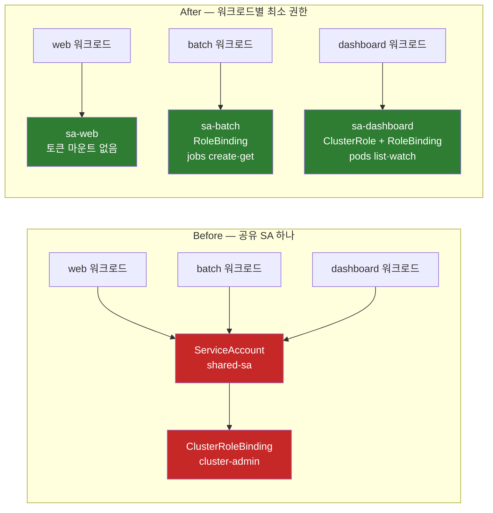

# Pod는 어떻게 쿠버네티스 API에 자기를 증명할까 — ServiceAccount와 RBAC

사람이 `kubectl`을 쓸 때는 kubeconfig 안의 인증서나 토큰으로 자기를 증명한다. 그런데 클러스터 **안에서** 도는 프로그램 — Pod 목록을 읽어 대시보드를 그리는 앱, 커스텀 리소스를 감시하는 컨트롤러 — 은 무엇으로 자기를 증명할까? 그리고 증명만 되면 무엇이든 할 수 있는 걸까?

---

## 결론부터 말하면

**Pod는 ServiceAccount로 자기를 증명한다.** 그 증명 수단은 컨테이너 안에 마운트된 **파일 하나** 다 — kubelet이 API 서버에서 발급받아 넣어주는 짧은 수명의 JWT 토큰. Pod가 아무 설정을 안 해도 네임스페이스의 `default` ServiceAccount가 자동으로 붙기 때문에, 사실 **모든 Pod는 이미 신원을 갖고 있다.**

하지만 두 번째 질문의 답은 **아니다** 다. 신원을 증명하는 것(**인증**, authentication)과 그 신원이 어떤 동작을 해도 되는지 판정하는 것(**인가**, authorization)은 **완전히 다른 단계** 다. 토큰이 유효해도 RBAC 규칙이 명시적으로 허용하지 않으면 요청은 `403 Forbidden`으로 끝난다. 실제로 `default` ServiceAccount는 **모든 인증된 주체에게 주어지는 API 디스커버리 권한 외에는 아무 권한도 없다.**

```mermaid
flowchart TD
    req["Pod가 API 서버에 요청<br>토큰을 Authorization 헤더에 담아"]
    req --> authn{"인증<br>이 토큰은 누구인가?"}
    authn -->|"토큰 없음·만료·위조"| e401["401 Unauthorized<br>신원 확정 실패"]
    authn -->|"신원 확정"| id["system&#58;serviceaccount&#58;my-app&#58;my-sa<br>그룹&#58; system&#58;serviceaccounts 등"]
    id --> authz{"인가<br>이 신원이 그 동작을 해도 되나?"}
    authz -->|"허용 규칙 없음<br>RBAC은 기본 거부"| e403["403 Forbidden<br>신원은 맞지만 권한 없음"]
    authz -->|"Role·ClusterRole 규칙 매칭"| ok["요청 처리 계속<br>이후 관문은 별도 노트"]

    style req fill:#1565C0,color:#fff
    style id fill:#455A64,color:#fff
    style e401 fill:#C62828,color:#fff
    style e403 fill:#E65100,color:#fff
    style ok fill:#2E7D32,color:#fff
```



| 구분 | 사람(User) | 워크로드(ServiceAccount) |
|------|-----------|--------------------------|
| 쿠버네티스 리소스인가 | **아니다** (`kind: User`가 없다) | **그렇다** (`kind: ServiceAccount`, 1급 리소스) |
| 누가 관리하나 | 외부 — 인증서 CA, OIDC, 인증 프록시 | **클러스터 자신** (API로 만들고 지운다) |
| 자격증명 배포 | 사람이 kubeconfig를 들고 다닌다 | kubelet이 Pod 안에 파일로 마운트 |
| 인가 방식 | **RBAC (동일)** | **RBAC (동일)** |

마지막 줄이 중요하다. **인증 방식은 다르지만 인가 방식은 같다.** RBAC은 "누가"를 신원 문자열로만 볼 뿐, 그게 사람인지 프로그램인지 신경 쓰지 않는다. 이 비대칭에서 이야기를 시작하자.

---

## 1. 쿠버네티스에는 `kind: User`가 없다

처음 RBAC을 배울 때 가장 이상한 지점이 여기다. `kubectl get serviceaccounts`는 되는데 `kubectl get users`는 없다. Role을 만들 때 `subjects`에 `kind: User`라고 쓰기는 하는데, 그 User라는 오브젝트를 클러스터 어디서도 찾을 수 없다.

빠뜨린 게 아니다. **쿠버네티스는 사람 계정을 의도적으로 관리하지 않는다.** 사람 계정은 이미 조직에 존재한다 — 사내 IdP, Google Workspace, LDAP, GitHub 조직. 쿠버네티스가 여기에 자체 사용자 테이블을 하나 더 만들면, 퇴사자 계정 정리를 두 곳에서 해야 하고 비밀번호 정책이 갈라진다. 그래서 쿠버네티스는 "이 요청을 보낸 게 누구인가"를 판정하는 일을 **외부에 위임** 한다. 클라이언트 인증서의 CN, OIDC 토큰의 클레임, 인증 웹훅의 응답 — 어느 경로로 오든 API 서버는 그 결과로 **사용자 이름과 그룹 목록이라는 문자열만** 얻는다. RBAC은 그 문자열을 받아 규칙과 대조할 뿐이다.

반면 워크로드는 사정이 다르다. `my-app` 네임스페이스에 배포된 컨트롤러는 조직의 구성원이 아니라 **클러스터의 구성물** 이다. 클러스터와 함께 태어나고 함께 사라진다. Helm 차트로 배포되고, 네임스페이스를 지우면 같이 지워지고, GitOps 저장소에 선언으로 남아야 한다. 이런 신원을 외부 IdP에 등록하라고 하면 배포가 두 시스템에 걸친 절차가 된다.

> **사람은 조직의 것이고, 워크로드는 클러스터의 것이다.** 그래서 사람 계정은 외부에 위임하고, 워크로드 계정은 클러스터 안의 1급 리소스로 만들었다.

이 한 줄이 `kind: User`는 없지만 `kind: ServiceAccount`는 있는 이유다.

---

## 2. ServiceAccount는 "신원"일 뿐이다

ServiceAccount 자체는 놀랄 만큼 단순하다. 만드는 데 필요한 건 이름 하나다.

```yaml
apiVersion: v1
kind: ServiceAccount
metadata:
  name: my-sa
  namespace: my-app
```

`spec`이 없다. 권한 필드도 없다. **ServiceAccount는 권한을 담는 그릇이 아니라 이름표** 이기 때문이다. 이 오브젝트가 하는 일은 딱 하나 — API 서버가 인식할 수 있는 신원 문자열을 하나 만들어 두는 것이다. 그 문자열의 정규 형태는 이렇다.

```
system:serviceaccount:<namespace>/<name>  ← 이렇게 쓰지 않는다
system:serviceaccount:<namespace>:<name>  ← 콜론으로 구분한다
```

`my-app` 네임스페이스의 `my-sa`라면 `system:serviceaccount:my-app:my-sa`가 된다. 그리고 이 신원은 자동으로 몇 개의 **그룹** 에도 속한다.

| 그룹 | 의미 |
|------|------|
| `system:serviceaccounts` | 클러스터의 모든 ServiceAccount |
| `system:serviceaccounts:my-app` | `my-app` 네임스페이스의 모든 ServiceAccount |
| `system:authenticated` | 인증에 성공한 모든 주체 (사람 포함) |

그룹도 RBAC의 `subjects`에 쓸 수 있으니, "이 네임스페이스의 모든 워크로드에게 이 권한을"이라는 규칙을 그룹 하나로 표현할 수 있다. 다만 그건 광범위한 부여라서 나중에 8장에서 다룰 함정과 같은 방향임을 기억해 두자.

여기서 초보자를 가장 자주 놀라게 하는 사실이 하나 있다. **아무 ServiceAccount도 지정하지 않은 Pod에도 신원이 붙는다.** 클러스터를 만들면 쿠버네티스는 모든 네임스페이스에 `default`라는 이름의 ServiceAccount를 자동으로 만든다. Pod에 `spec.serviceAccountName`을 적지 않으면 그 네임스페이스의 `default`가 배정된다. 심지어 `default` ServiceAccount를 지우면 컨트롤 플레인이 새로 만들어 넣는다.

즉 **"우리 앱은 쿠버네티스 API를 안 쓰는데요"라고 말하는 Pod 안에도 API 토큰이 들어 있다.** 이 사실이 뒤에서 보안 이야기의 출발점이 된다.

---

## 3. 토큰은 어떻게 Pod 안으로 들어오는가

신원 문자열이 있다고 Pod가 그걸 주장할 수는 없다. 자기가 `system:serviceaccount:my-app:my-sa`라는 **증거** 가 필요하다. 그 증거가 토큰이고, 토큰이 Pod에 들어오는 방식은 역사적으로 한 번 크게 바뀌었다.

### 3-1. 옛 방식 — 만료 없는 Secret

v1.24 이전에는 이랬다. ServiceAccount를 만들면 컨트롤러가 **자동으로 Secret을 하나 만들어** 그 안에 토큰을 넣어 뒀고, Pod가 뜰 때 그 Secret이 마운트됐다.

편했지만 위험했다. 이 토큰은 **만료가 없었다.** 그래서 세 가지 성질을 동시에 가졌다.

- **영구적이다.** 한 번 발급되면 무한히 유효하다.
- **어디서든 쓸 수 있다.** 특정 Pod에 묶여 있지 않다. 노트북에 복사해 붙여도 그대로 동작한다.
- **회수 수단이 사실상 Secret 삭제뿐이다.** 유출을 알아차렸을 때 "이 토큰만 무효화"하는 방법이 없다. Secret이나 ServiceAccount를 지워야 하고, 그러면 그 신원을 쓰는 워크로드가 함께 죽는다.

로그에 토큰이 한 줄 찍혔거나, 디버깅용으로 복사한 값이 이슈 트래커에 남았다고 상상해 보자. 그것만으로 영구 자격증명이 클러스터 밖으로 나간 것이다.

### 3-2. 현재 방식 — TokenRequest API + projected volume

v1.22부터 쿠버네티스는 다른 길을 택했다. Pod에 `spec.serviceAccountName`을 지정하면, 쿠버네티스는 **TokenRequest API로 짧은 수명의 토큰을 발급받아 projected volume으로 마운트** 한다. 이 토큰은 만료되기 전에 kubelet이 **알아서 갱신** 한다.

```mermaid
flowchart LR
    pod["Pod<br>spec.serviceAccountName&#58; my-sa"]
    kubelet["kubelet<br>노드 에이전트"]
    api["API Server<br>TokenRequest API"]
    file["컨테이너 안 파일<br>/var/run/secrets/kubernetes.io/serviceaccount/token"]

    pod -->|"1&#46; 이 SA로 띄워달라"| kubelet
    kubelet -->|"2&#46; 토큰 요청<br>audience·Pod에 바인딩"| api
    api -->|"3&#46; 수명 있는 JWT 발급"| kubelet
    kubelet -->|"4&#46; projected volume으로 주입"| file
    kubelet -->|"5&#46; 만료 전 갱신하여 같은 경로에 덮어쓰기"| file

    style pod fill:#1565C0,color:#fff
    style api fill:#6A1B9A,color:#fff
    style file fill:#2E7D32,color:#fff
    style kubelet fill:#455A64,color:#fff
```



이 토큰이 옛 토큰과 다른 점을 하나씩 보면 설계 의도가 보인다.

- **수명이 있다.** `expirationSeconds`의 기본값은 **1시간** 이고 최소 10분이다. 더 짧게 요청할 수도 있다.
- **자동 갱신된다.** kubelet은 토큰이 **수명의 80%를 넘거나 24시간을 넘으면** (둘 중 먼저 오는 쪽) 갱신을 시도한다. 갱신은 **같은 파일 경로에 덮어쓰는 방식** 이므로 Pod를 다시 띄우지 않는다.
- **audience에 바인딩된다.** JWT의 `aud` 클레임에 대상이 박힌다. 쿠버네티스 API용 토큰을 다른 서비스에 그대로 제출할 수 없다.
- **특정 Pod에 바인딩된다.** JWT 안에 그 Pod의 이름과 UID가 들어간다. 참조된 오브젝트가 사라지거나 UID가 다르면 그 토큰으로는 인증되지 않는다.

마운트된 토큰을 디코드하면 이런 클레임이 보인다.

```json
{
  "aud": ["https://kubernetes.default.svc"],
  "exp": 1729605240,                      // 만료 시각 — 옛 토큰에는 없던 필드
  "iat": 1729601640,
  "kubernetes.io": {
    "namespace": "my-app",
    "pod":  { "name": "my-app-7c9d", "uid": "5e0bd49b-..." },   // Pod에 바인딩
    "serviceaccount": { "name": "my-sa", "uid": "14ee3fa4-..." }
  },
  "sub": "system:serviceaccount:my-app:my-sa"   // 이 문자열이 RBAC이 보는 "누구"
}
```

한 가지 함정. 애플리케이션이 **시작할 때 토큰 파일을 한 번 읽고 메모리에 캐시하면**, 1시간 뒤 그 토큰은 만료되고 `401`이 떨어진다. kubelet은 파일을 갱신했지만 앱이 다시 읽지 않았기 때문이다. 공식 클라이언트 라이브러리는 대개 파일을 주기적으로 재읽기하지만, 직접 파일을 읽어 헤더를 조립하는 코드라면 **매 요청마다 파일을 다시 읽어야** 한다.

### 3-3. 자동 Secret 생성은 언제 사라졌나

옛 방식의 잔재는 단계적으로 정리됐다. 시점 의존 정보라 버전을 명확히 짚어 둔다.

| 버전 | 변화 |
|------|------|
| **v1.22** | Pod에 TokenRequest 기반 projected token을 기본 주입 (`BoundServiceAccountTokenVolume`) |
| **v1.24 ~ v1.26** | `LegacyServiceAccountTokenNoAutoGeneration` 게이트가 **기본 활성** — ServiceAccount를 만들어도 토큰 Secret이 더 이상 자동 생성되지 않는다 |
| **v1.27** | 이 게이트가 GA로 승격되면서 **제거** — 되돌릴 수 없는 기본 동작이 됐다 |
| **v1.28** | 레거시 토큰 추적 컨트롤러 stable — 자동 생성된 토큰 Secret에 `kubernetes.io/legacy-token-last-used` 라벨로 마지막 사용 시각을 기록 |
| **v1.30** | 레거시 토큰 청소기(cleaner) stable — v1.29부터, 일정 기간(기본 1년) 미사용인 **자동 생성** 토큰을 무효 표시하고 이후 삭제 |

여기서 정확히 구분해야 할 점이 있다. 청소기는 **"자동 생성된" Secret이면서 어떤 Pod도 마운트하지 않은 것** 만 대상으로 한다. 아래처럼 **손으로 만든** 장수명 토큰 Secret은 청소 대상이 아니고 만료도 없다.

```yaml
# 여전히 만들 수 있다 — 그리고 여전히 만료가 없다
apiVersion: v1
kind: Secret
metadata:
  name: my-sa-token
  namespace: my-app
  annotations:
    kubernetes.io/service-account.name: my-sa   # 이 SA의 토큰을 채워달라
type: kubernetes.io/service-account-token
```

클러스터 외부 CI가 API에 접근해야 할 때 이 방식을 쓰는 사례가 아직 많다. 쓸 수는 있지만, **이 토큰의 회수 수단은 Secret(또는 ServiceAccount) 삭제 하나뿐** 임을 알고 써야 한다. 외부에서 접근할 자격증명이 필요하다면 `kubectl create token my-sa --duration=1h`처럼 TokenRequest로 수명 있는 토큰을 그때그때 발급하는 쪽이 훨씬 안전하다. (Secret 자체의 보안 — base64는 암호화가 아니라는 점, etcd 암호화, 외부 Secret 관리 도구 — 는 [Kubernetes ConfigMap Secret](Kubernetes-ConfigMap-Secret.md)에서 다룬다.)

### 3-4. 토큰을 아예 넣지 않기

2장에서 본 사실을 다시 떠올리자. 쿠버네티스 API를 전혀 쓰지 않는 워크로드에도 토큰이 들어간다. 웹 서버, 배치 스크립트, 정적 파일 서버 — 이런 Pod 안의 토큰은 **쓰이지 않으면서 공격 표면만 넓히는 자격증명** 이다. 컨테이너에 침투한 공격자가 가장 먼저 찾는 파일이기도 하다.

그러니 필요 없으면 빼라.

```yaml
# ServiceAccount 수준 — 이 SA를 쓰는 Pod 전부에 기본 적용
apiVersion: v1
kind: ServiceAccount
metadata:
  name: my-sa
  namespace: my-app
automountServiceAccountToken: false
---
# Pod 수준 — SA 설정을 덮어쓴다 (Pod 쪽이 이긴다)
apiVersion: v1
kind: Pod
metadata:
  name: my-app
spec:
  serviceAccountName: my-sa
  automountServiceAccountToken: false   # 토큰 파일이 마운트되지 않는다
  containers:
  - name: my-app
    image: my-app:1.0
```

Pod 쪽 설정이 ServiceAccount 쪽을 덮어쓰므로, **SA 기본값을 `false`로 두고 API가 필요한 워크로드만 Pod에서 `true`로 켜는** 구성이 가장 안전하다. 공식 RBAC 권장 사항도 이 방향을 명시한다.

---

## 4. 여기가 전환점 — 증명됐으면 뭐든 할 수 있을까

이제 Pod는 자기를 증명할 수 있다. 그럼 API를 마음대로 호출할 수 있을까? 갓 만든 Pod에서 확인해 보면 답이 바로 나온다.

```bash
# Pod 안에서, 마운트된 토큰으로 Pod 목록을 요청
$ TOKEN=$(cat /var/run/secrets/kubernetes.io/serviceaccount/token)
$ curl -s --cacert /var/run/secrets/kubernetes.io/serviceaccount/ca.crt \
       -H "Authorization: Bearer $TOKEN" \
       https://kubernetes.default.svc/api/v1/namespaces/my-app/pods

# 응답
# 401이 아니다 — 토큰은 유효하다 (인증 통과)
{
  "kind": "Status", "code": 403,
  "message": "pods is forbidden: User \"system:serviceaccount:my-app:default\"
              cannot list resource \"pods\" in API group \"\" in the namespace \"my-app\""
}
```

`401`이 아니라 `403`이라는 점이 핵심이다. **API 서버는 이 요청자가 누구인지 정확히 알고 있다.** 에러 메시지에 신원 문자열까지 그대로 찍혀 있다. 그런데 거절했다. 신원 확인과 권한 판정이 별개 단계라는 증거다.

이건 예외적 상황이 아니라 기본값이다. 공식 문서의 표현대로, **`default` ServiceAccount는 RBAC이 켜진 클러스터에서 "모든 인증된 주체에게 주어지는 기본 API 디스커버리 권한" 외에는 아무 권한도 갖지 않는다.** 즉 API 서버가 어떤 API 그룹을 제공하는지 목록을 조회하는 정도가 전부다.

> 쿠버네티스의 기본 자세는 **"너를 알아보긴 하지만, 그래서 뭘 해도 된다는 뜻은 아니다"** 다.

참고로 API 요청이 통과해야 하는 관문은 인증과 인가에서 끝나지 않는다. 인가 뒤에는 mutating admission, 스키마 검증, validating admission이 이어지고 그다음에야 etcd에 저장된다. **그 전체 수명주기는** [내가 만들지 않은 컨테이너가 왜 Pod에 들어와 있을까 — Admission Webhook](내가-만들지-않은-컨테이너가-왜-Pod에-들어와-있을까-Admission-Webhook.md) **가 다룬다.** 이 노트는 앞의 두 관문만 본다.

---

## 5. RBAC의 네 오브젝트를 2×2로 이해하라

인가를 담당하는 것이 **RBAC(Role-Based Access Control)** 이고, 등장하는 오브젝트는 네 개다. 이름이 비슷해서 처음엔 뒤엉키지만, **두 개의 축** 으로 보면 정리된다.

- **무엇을 할 수 있나** → `Role` / `ClusterRole` (권한 규칙의 정의)
- **누구에게 주나** → `RoleBinding` / `ClusterRoleBinding` (정의를 신원에 연결)

권한은 **정의와 부여가 분리** 되어 있다. Role을 만들어도 아무 일도 일어나지 않는다. Binding으로 신원에 연결해야 효력이 생긴다. 그리고 여기서 네 가지 조합이 나오는데, **적용 범위를 결정하는 것은 Role이 아니라 Binding** 이라는 게 가장 중요한 규칙이다.

| Role 쪽 | Binding 쪽 | 실제 적용 범위 | 언제 쓰나 |
|---------|-----------|----------------|-----------|
| `Role` | `RoleBinding` | 그 네임스페이스 안 | 한 네임스페이스에서만 쓰는 일회성 권한 |
| **`ClusterRole`** | **`RoleBinding`** | **Binding이 있는 그 네임스페이스 안** | **권한 정의를 클러스터에 한 번 만들고 네임스페이스별로 재사용** |
| `ClusterRole` | `ClusterRoleBinding` | 클러스터 전체 (모든 네임스페이스 + 클러스터 범위 리소스) | 노드·PV 같은 클러스터 리소스, 전 네임스페이스 감시 |
| `Role` | `ClusterRoleBinding` | **불가능** | — (Role은 네임스페이스 리소스라 클러스터 범위로 승격되지 않는다) |

두 번째 줄이 처음 배울 때 가장 안 보이는 조합이다. **ClusterRole은 "클러스터 전체에 권한을 준다"는 뜻이 아니다.** 그냥 "네임스페이스에 속하지 않는 권한 **정의**"일 뿐이다. 이 정의를 `RoleBinding`으로 연결하면, 권한은 **그 RoleBinding의 네임스페이스에만** 적용된다.

```yaml
# 권한 정의는 클러스터에 딱 한 번 (네임스페이스 없음)
apiVersion: rbac.authorization.k8s.io/v1
kind: ClusterRole
metadata:
  name: secret-reader
rules:
- apiGroups: [""]
  resources: ["secrets"]
  verbs: ["get", "watch", "list"]
---
# 부여는 네임스페이스별로 반복 — 정의를 복제하지 않는다
apiVersion: rbac.authorization.k8s.io/v1
kind: RoleBinding
metadata:
  name: read-secrets
  namespace: development       # ← 이 줄이 적용 범위를 결정한다
subjects:
- kind: ServiceAccount
  name: my-sa
  namespace: development
roleRef:
  kind: ClusterRole            # ClusterRole을 참조하지만
  name: secret-reader          # 권한은 development 네임스페이스에만 유효하다
  apiGroup: rbac.authorization.k8s.io
```

왜 유용한가. 팀 네임스페이스가 30개인 클러스터에서 "각 팀은 자기 네임스페이스의 Secret을 읽을 수 있다"를 구현해야 한다면, `Role`을 쓰면 **똑같은 규칙을 30번 복제** 해야 한다. 규칙을 하나 고칠 때 30곳을 고쳐야 하고, 한 곳을 빠뜨리면 조용히 어긋난다. `ClusterRole` 하나 + `RoleBinding` 30개면 **정의는 한 곳** 이다. 쿠버네티스 기본 제공 역할(`admin`, `edit`, `view`)이 정확히 이 방식으로 쓰이도록 설계되어 있다.

반대로 `ClusterRoleBinding`은 **네임스페이스를 무시한다.** 이걸로 부여하면 그 신원은 모든 네임스페이스에서 그 권한을 갖는다. 네임스페이스별로 다르게 주려는 의도였다면 조용히 반대 결과를 얻는다. 뒤의 8장과 10장이 모두 이 지점에서 출발한다.

한 가지 실무 함정. **한번 만든 Binding의 `roleRef`는 바꿀 수 없다.** 다른 Role을 가리키게 하려면 Binding을 지우고 새로 만들어야 한다. 수정을 시도하면 validation 에러가 난다.

---

## 6. rule 문법 읽기 — `apiGroups: [""]`는 오타가 아니다

`rules`의 한 항목은 세 축의 곱집합이다.

```yaml
apiVersion: rbac.authorization.k8s.io/v1
kind: Role
metadata:
  namespace: my-app
  name: pod-reader
rules:
- apiGroups: [""]                  # "" = 코어 API 그룹 (오타가 아니다)
  resources: ["pods", "pods/log"]  # 서브리소스는 슬래시로
  verbs: ["get", "list", "watch"]
- apiGroups: ["apps"]              # Deployment 등은 apps 그룹
  resources: ["deployments"]
  verbs: ["get", "list"]
```

**`apiGroups: [""]`** 를 처음 보면 값을 빼먹은 것처럼 보인다. 그렇지 않다. 쿠버네티스 초기 리소스(Pod, Service, ConfigMap, Secret, Node, Namespace...)는 API 그룹이 도입되기 전에 만들어져 **그룹 이름이 없는 "코어 그룹"** 에 있다. URL도 `/api/v1/...`이고 `/apis/<group>/v1/...`이 아니다. 그 "이름 없음"을 빈 문자열로 표현한 것이다. Deployment는 `apps`, Ingress·NetworkPolicy는 `networking.k8s.io`, Role 자신은 `rbac.authorization.k8s.io`에 있다.

`resources`에 적는 이름은 **API URL에 나타나는 그 이름** 이다(`Pod`가 아니라 `pods`). 그리고 URL 경로가 한 단계 더 들어가는 **서브리소스** 는 슬래시로 구분한다. Pod 로그 요청은 `GET /api/v1/namespaces/{ns}/pods/{name}/log`이므로 RBAC에서는 `pods/log`다.

이 서브리소스 규칙이 보안에서 중요한 이유가 있다. **`pods`에 대한 권한과 `pods/exec`에 대한 권한은 완전히 별개다.**

```yaml
rules:
- apiGroups: [""]
  resources: ["pods", "pods/log"]
  verbs: ["get", "list"]
- apiGroups: [""]
  resources: ["pods/exec"]         # 이건 사실상 "컨테이너 셸 접근 권한"이다
  verbs: ["create"]                # exec은 get이 아니라 create 동사다
```

`pods/exec`를 허용하면 그 주체는 임의 컨테이너 안에서 명령을 실행할 수 있다. 그 컨테이너의 파일시스템, 환경변수, 그리고 **마운트된 ServiceAccount 토큰까지** 전부 접근 가능하다. 즉 `pods/exec` 하나가 그 네임스페이스 워크로드들의 신원을 전부 빌려 쓸 수 있는 권한으로 번진다. `pods/attach`, `pods/portforward`도 같은 급이다. 읽기 권한처럼 뭉뚱그려 주면 안 된다.

`resourceNames`로 특정 오브젝트만 지정할 수도 있다.

```yaml
rules:
- apiGroups: [""]
  resources: ["configmaps"]
  resourceNames: ["my-configmap"]   # 이 이름의 ConfigMap만
  verbs: ["get", "update"]
```

다만 한계가 있다. **`create`는 이름으로 제한할 수 없다** — 인가 시점에 새 오브젝트의 이름을 모르기 때문이다. `deletecollection`도 마찬가지다. 그리고 `list`/`watch`를 `resourceNames`로 제한하면 클라이언트가 `metadata.name` field selector를 함께 보내야 인가된다(`kubectl get configmaps --field-selector=metadata.name=my-configmap`). 그냥 `kubectl get configmaps`를 하면 거절된다. "이름으로 좁혔는데 왜 목록 조회가 안 되지?"의 답이 여기 있다.

마지막으로 `subjects`에 ServiceAccount를 쓰는 형태를 확인해 두자. 사람과 달리 `apiGroup`을 적지 않고 `namespace`를 적는다.

```yaml
subjects:
- kind: ServiceAccount
  name: my-sa
  namespace: my-app        # SA는 네임스페이스에 속하므로 필수
# 참고 — 사람이나 그룹은 형태가 다르다
- kind: User
  name: jane               # 대소문자를 구분한다
  apiGroup: rbac.authorization.k8s.io
```

---

## 7. RBAC은 순수 가산적이다 — deny 규칙이 없다

방화벽이나 클라우드 IAM을 다뤄본 사람은 여기서 한 번 걸린다. 공식 문서의 표현은 짧고 단호하다.

> Permissions are purely additive (there are no "deny" rules).

**RBAC에는 거부 규칙이 없다.** 규칙은 오직 "허용"을 더할 뿐이고, 여러 Binding이 겹치면 결과는 그 **합집합** 이다. "`pods`는 다 되지만 `secrets`만 빼고"를 표현하는 문법이 존재하지 않는다.

이 설계 자체는 이해하기 쉽다는 장점이 크다. 평가 순서나 우선순위 규칙을 따질 필요 없이 "허용하는 규칙이 하나라도 있으면 허용"이면 끝이다. IAM의 deny 정책이 얼마나 헷갈리는지 겪어봤다면 이 단순함의 가치를 안다.

하지만 결과가 하나 따라온다. **넓게 준 권한을 "이것만 빼기"로 좁힐 수 없다.** 좁히려면 그 넓은 Binding을 **지우고 좁은 것을 새로 만들어야** 한다. 문법상 "차집합"이 불가능하기 때문이다.

그리고 이게 실무에서 진짜 어려운 이유는 문법 때문이 아니다. **넓은 Binding을 지우는 순간 무엇이 깨지는지 아무도 모른다는 것** 이 문제다. `cluster-admin`이 붙은 ServiceAccount를 여러 워크로드가 공유하고 있다면, 그중 어느 워크로드가 실제로 어떤 API를 호출하는지 그 Binding 안에는 아무 정보가 없다. `cluster-admin`은 전부 허용이므로 **애초에 아무것도 기록되지 않는다.** 그래서 이 상태는 "고치기 어려운" 게 아니라 **"관측 없이는 고칠 수 없는"** 상태다.

즉 좁히기의 첫 단계는 YAML 편집이 아니라 **"실제로 쓰이는 권한이 무엇인지 알아내기"** 다. 이게 다음 장의 마이그레이션 순서를 결정한다.

---

## 8. 안티패턴 — 공유 `cluster-admin` ServiceAccount

가장 자주 보는 잘못된 구성은 이렇다. **여러 워크로드가 `cluster-admin`에 바인딩된 ServiceAccount 하나를 공유한다.**

```yaml
# 이 조합을 클러스터에서 발견하면 경보로 받아들이라
apiVersion: rbac.authorization.k8s.io/v1
kind: ClusterRoleBinding
metadata:
  name: shared-sa-admin
subjects:
- kind: ServiceAccount
  name: shared-sa
  namespace: my-app
roleRef:
  kind: ClusterRole
  name: cluster-admin        # 모든 리소스에 모든 동작
  apiGroup: rbac.authorization.k8s.io
```

### 8-1. 왜 이렇게 되는가

악의가 아니라 **경로의 최소 저항** 때문이다. 새 컨트롤러를 붙이는데 `403`이 뜬다. 어떤 verb와 resource가 필요한지 문서에 정확히 안 적혀 있다. 데모가 오후에 있다. 이때 `cluster-admin`을 붙이면 `403`이 즉시 사라진다. 다음 워크로드가 또 `403`을 만나면, 이미 잘 되는 SA가 있으니 그걸 재사용한다. 세 번째, 네 번째도 같은 길을 간다.

각 결정은 국지적으로 합리적이었다. 문제는 이 결정들이 **누적되면서 되돌릴 수 없어진다** 는 데 있다(7장의 이유 그대로).

### 8-2. 무엇이 위험한가

핵심은 3장에서 확인한 사실이다. **ServiceAccount 토큰은 컨테이너 안의 파일이다.**

컨테이너 하나에 RCE(원격 코드 실행) 취약점이 있다고 하자. 보통 그 피해는 그 컨테이너 안에서 시작된다. 그런데 그 컨테이너 안에 `cluster-admin` 토큰 파일이 있으면 이야기가 달라진다. 공격자는 파일 하나를 읽어 **클러스터 전체의 관리자** 가 된다. 모든 네임스페이스의 Secret을 읽고, 아무 노드에나 특권 Pod를 띄우고, 감사 로그를 남기며 무엇이든 한다. **한 컨테이너의 취약점이 곧 클러스터 전체 장악** 이다.

공유가 이걸 증폭시킨다. `cluster-admin` 토큰이 워크로드 3개에 마운트되어 있으면, 그중 **가장 약한 하나** 가 클러스터의 보안 수준이 된다. 게다가 감사 로그에 남는 신원은 모두 `system:serviceaccount:my-app:shared-sa` — 어느 워크로드가 그 요청을 했는지 사후에도 알 수 없다.

여기서 **혼동하기 쉬운 두 가지를 구분** 해 두자.

| | `cluster-admin` ClusterRole | `system:masters` 그룹 |
|---|---|---|
| 정체 | 모든 동작을 허용하는 기본 ClusterRole | RBAC **검사 자체를 우회** 하는 특수 그룹 |
| 기본 연결 | `system:masters` 그룹에 ClusterRoleBinding으로 연결됨 | 보통 관리자 클라이언트 인증서의 그룹 |
| 회수 방법 | **Binding을 지우면 회수된다** | **RoleBinding·ClusterRoleBinding을 지워도 회수되지 않는다** |

공식 권장 사항의 경고가 여기 있다. `system:masters` 멤버는 모든 RBAC 검사를 우회하며, 인가 웹훅조차 타지 않는다. 그래서 **사용자를 `system:masters`에 넣지 말라** 고 명시한다. 반대로 `cluster-admin` 바인딩은 과하긴 해도 **지울 수 있다** — 그래서 아래 마이그레이션이 가능하다.

### 8-3. 어떻게 빠져나오는가



한 번에 갈 수 없다. 넓은 Binding을 먼저 지우면 무엇이 깨질지 모르기 때문이다(7장). 그래서 **순서를 뒤집는다 — 좁은 권한을 먼저 쌓고, 넓은 것을 마지막에 뺀다.**

**1단계. 실제로 필요한 권한을 관측한다.** 추측하지 않는다. 감사 로그(audit log)를 켜서 그 ServiceAccount가 어떤 resource에 어떤 verb를 실제로 호출하는지 수집한다. 컨트롤러라면 프로젝트 문서에 필요한 RBAC 규칙이 예제로 제공되는 경우가 많으니 그것부터 확인한다. 이 단계 없이 진행하면 반드시 되돌아온다.

**2단계. 워크로드별로 ServiceAccount를 분리한다.** 권한은 아직 건드리지 않는다. 각 Deployment에 자기 전용 `spec.serviceAccountName`을 준다. 이 단계만으로도 **감사 로그에 어느 워크로드의 요청인지 신원이 갈리기 시작** 한다 — 1단계의 관측 품질이 이때부터 올라간다. 아직은 새 SA들도 필요한 권한을 각각 부여받아야 하므로, 1단계에서 모은 규칙을 여기서 적용한다.

**3단계. 좁은 Role을 붙이고 실제로 도는지 확인한다.** 각 SA에 최소 권한 Role/RoleBinding을 만든다. 이때 여전히 공유 SA의 `cluster-admin`이 살아 있으므로, 권한을 잘못 좁혔어도 서비스는 죽지 않는다 — **안전망을 유지한 채로 실험하는 구간** 이다. `kubectl auth can-i`(9장)로 의도한 권한이 정확히 들어갔는지 검증한다.

**4단계. 공유 SA와 `cluster-admin` 바인딩을 제거한다.** 새 SA로 다 옮겨졌고 좁은 권한으로 정상 동작하는 것을 확인한 뒤에야 마지막으로 지운다. 이때 비로소 "이 컨테이너가 털리면 클러스터가 털린다"는 조건이 사라진다.

**5단계(권장). API를 안 쓰는 워크로드는 토큰을 아예 뺀다.** 3-4의 `automountServiceAccountToken: false`. 최소 권한의 최종 형태는 "권한 없음"이 아니라 **"자격증명 없음"** 이다.

이 순서의 핵심은 **넓은 권한을 마지막에 지운다** 는 것이다. 반대로 하면 장애를 겪고 되돌리게 되고, 되돌린 상태가 영구화된다.

---

## 9. 권한을 추측하지 말고 물어보라

RBAC 디버깅에서 가장 흔한 시간 낭비는 YAML을 눈으로 읽으며 "이 정도면 되겠지"라고 추정하는 것이다. Binding이 여러 개 겹치고 그룹까지 얽히면 사람 머리로 합집합을 계산하기 어렵다. **API 서버에 직접 물어보는 명령이 있다.**

```bash
# 이 ServiceAccount가 실제로 할 수 있는 모든 것을 나열
$ kubectl auth can-i --list \
    --as=system:serviceaccount:my-app:my-sa \
    -n my-app
Resources          Non-Resource URLs   Resource Names   Verbs
pods               []                  []               [get list watch]
pods/log           []                  []               [get]
...

# 특정 동작 하나만 확인 (yes / no)
$ kubectl auth can-i create pods/exec \
    --as=system:serviceaccount:my-app:my-sa -n my-app
no
```

`--as`는 **impersonation(가장)** 이므로, 이 명령을 실행하는 계정에 `impersonate` 권한이 있어야 한다. 권한이 없으면 SA 권한 문제가 아니라 자기 권한 문제로 `403`이 난다 — 명령이 틀린 게 아니다. 참고로 `impersonate` verb 자체가 다른 신원의 권한을 빌리는 강력한 권한이니 아무에게나 주면 안 된다.

반대로 **"지금 이 요청은 누구로 인식되는가"** 를 확인하려면 이 명령을 쓴다. 인증 프록시나 OIDC를 거치면 최종 신원이 무엇인지 사람이 알기 어려운데, 이걸로 API 서버가 인식한 신원과 그룹을 그대로 볼 수 있다.

```bash
$ kubectl auth whoami
ATTRIBUTE   VALUE
Username    system:serviceaccount:my-app:my-sa
Groups      [system:serviceaccounts system:serviceaccounts:my-app system:authenticated]
```

`kubectl auth whoami`와 그 뒤의 `SelfSubjectReview` API는 **v1.28에서 GA** 가 되어 `authentication.k8s.io/v1`에 자리 잡았다(그 이전 버전에서는 alpha/beta 경로였다). 안심하고 써도 되는 도구다.

그리고 권한을 처음 설계할 때는 **기본 제공 ClusterRole 네 개** 를 먼저 알아 두는 게 좋다. 직접 Role을 쓰기 전에 이걸로 충분한지 검토하라는 뜻이다.

| ClusterRole | 기본 바인딩 | 무엇을 허용하나 |
|-------------|-------------|-----------------|
| `cluster-admin` | `system:masters` 그룹 | 모든 리소스에 모든 동작. `RoleBinding`으로 주면 그 네임스페이스 안의 모든 것(네임스페이스 자체 포함) |
| `admin` | 없음 | `RoleBinding`으로 네임스페이스에 부여하는 용도. 그 네임스페이스 대부분 리소스 읽기·쓰기 + **Role·RoleBinding 생성 가능**. ResourceQuota와 네임스페이스 자체에는 쓰기 불가 |
| `edit` | 없음 | 대부분 리소스 읽기·쓰기. Role·RoleBinding은 보거나 수정 못 함. **단 Secret 접근과 "그 네임스페이스의 아무 SA로 Pod 실행"이 가능** → 사실상 그 네임스페이스 모든 SA의 권한을 얻을 수 있다 |
| `view` | 없음 | 대부분 리소스 읽기 전용. Role·RoleBinding은 못 봄. **Secret도 못 봄** — Secret을 읽으면 SA 자격증명을 얻어 권한 상승이 되기 때문 |

`view`가 Secret을 제외하는 이유와 `edit`이 사실상 SA 권한까지 얻는다는 설명이 같은 곳을 가리킨다. **Secret을 읽는 것 = ServiceAccount 토큰을 읽는 것 = 그 신원이 되는 것.** 이 노트 전체가 이 등식 위에 서 있다. 그래서 "읽기 권한 정도야"라고 `secrets`의 `get`을 넘기면 안 된다. `list`와 `watch`도 응답 본문에 Secret 내용이 전부 들어오므로 `get`과 같은 급이다.

네 역할은 **ClusterRole aggregation** 을 쓰도록 만들어져 있어서, CRD 같은 커스텀 리소스를 `rbac.authorization.k8s.io/aggregate-to-edit: "true"` 라벨을 붙인 ClusterRole로 이 역할들에 얹을 수 있다. 커스텀 리소스를 도입할 때 `edit`/`view` 사용자가 그것도 다룰 수 있게 하는 표준 방법이다. (컨트롤러가 **왜** 넓은 권한을 요구하게 되는지는 [쿠버네티스는 어떻게 자기 자신을 확장할까 — CRD와 컨트롤러 그리고 Operator](쿠버네티스는-어떻게-자기-자신을-확장할까-CRD와-컨트롤러-그리고-Operator.md)에서 다룬다.)

---

## 10. 네임스페이스는 보안 경계가 아니다

마지막으로 RBAC을 배우면 흔히 생기는 오해를 정리하자. "팀별로 네임스페이스를 나눴으니 격리됐다"는 생각이다.

5장의 규칙을 다시 보면 왜 아닌지 바로 보인다. **`ClusterRoleBinding` 하나면 네임스페이스 구분이 무의미해진다.** 그 신원은 모든 네임스페이스에서 그 권한을 갖는다. 네임스페이스를 30개로 나눠도 `cluster-admin` ClusterRoleBinding이 붙은 SA 하나가 전부를 관통한다.

네임스페이스 **안쪽** 도 생각만큼 단단하지 않다. 공식 문서의 표현대로, 그 네임스페이스에 워크로드를 만들 수 있는 권한은 **거기서 마운트 가능한 Secret·ConfigMap·PV에 대한 접근을 암시적으로 부여** 한다. 게다가 Pod는 그 네임스페이스의 **아무 ServiceAccount로도 실행될 수 있으므로**, 워크로드 생성 권한은 그 네임스페이스 모든 SA의 API 권한을 암시적으로 부여하는 것과 같다. 그래서 문서는 이렇게 못 박는다 — **"네임스페이스 안쪽의 경계는 약한 것으로 간주해야 한다."**

그럼 네임스페이스는 무엇인가. **이름 충돌을 막고 리소스를 논리적으로 구획하는 단위** 다. 그 자체로 보안 경계가 아니다. 격리는 여러 통제를 **겹쳐야** 시작된다.

| 통제 축 | 도구 | 없으면 뚫리는 것 |
|---------|------|------------------|
| API 접근 | **RBAC** (+ 워크로드별 SA, 토큰 미마운트) | 다른 네임스페이스의 리소스를 API로 읽고 쓴다 |
| 네트워크 | **NetworkPolicy** (기본 거부부터) | Pod 네트워크는 기본이 전부 연결이라 네임스페이스를 그냥 넘나든다 |
| 자원 | **ResourceQuota / LimitRange** | 한 네임스페이스가 노드 자원을 고갈시켜 다른 팀을 죽인다 |
| 워크로드 특권 | **Pod Security Admission** (Baseline·Restricted) | 특권 Pod로 노드를 장악해 위의 모든 통제를 우회한다 |

네트워크 축이 왜 `NetworkPolicy` 하나로 끝나지 않는지는 [쿠버네티스 Egress 통제는 왜 NetworkPolicy 하나로 끝나지 않을까](쿠버네티스-Egress-통제는-왜-NetworkPolicy-하나로-끝나지-않을까.md)에 정리돼 있다. 요점은 같다 — **격리는 단일 리소스가 아니라 겹쳐 쌓는 통제의 결과** 다.

---

## 정리

### 핵심 포인트

1. **인증과 인가는 다른 단계다 — 신원이 있어도 기본 권한은 없다**
   - ServiceAccount는 신원(`system:serviceaccount:<ns>:<name>`)만 만든다. `default` SA는 모든 인증된 주체에게 주는 API 디스커버리 권한 외에는 아무것도 갖지 않는다. 그래서 갓 만든 Pod의 API 호출은 `401`이 아니라 **`403`** 으로 거절된다.

2. **토큰은 컨테이너 안의 파일이고, 지금은 수명이 있다**
   - v1.22부터 TokenRequest API + projected volume 방식이 기본이다. 기본 수명 1시간, kubelet이 수명의 80% 또는 24시간 중 먼저 오는 시점부터 갱신하며, audience와 특정 Pod에 바인딩된다. 만료 없는 Secret 자동 생성은 v1.24부터 중단되고 v1.27에 게이트가 제거됐다. **손으로 만든 장수명 토큰은 여전히 만료가 없고 회수 수단이 삭제뿐이다.**

3. **RBAC은 2×2 — 범위를 정하는 건 Role이 아니라 Binding이다**
   - `ClusterRole` + `RoleBinding` 조합이 실무의 핵심이다. 권한 정의를 클러스터에 한 번 만들고 네임스페이스별로 재사용한다. `ClusterRoleBinding`은 반대로 네임스페이스를 무시한다.

4. **deny가 없다는 것은 "좁히려면 지워야 한다"는 뜻이다**
   - RBAC은 순수 가산적이라 넓게 준 권한에서 일부만 뺄 수 없다. 그리고 넓은 권한은 아무것도 기록하지 않으므로, 좁히기의 첫 단계는 YAML 편집이 아니라 **감사 로그와 `kubectl auth can-i --list`로 실제 사용 권한을 관측하는 것** 이다.

5. **공유 `cluster-admin` SA는 컨테이너 하나의 취약점을 클러스터 장악으로 바꾼다**
   - 토큰은 파일이므로 RCE 하나면 끝난다. 빠져나오는 순서는 관측 → 워크로드별 SA 분리 → 최소 권한 부여·검증 → **마지막에** 공유 SA와 `cluster-admin` 바인딩 제거. 넓은 권한을 먼저 지우면 장애를 겪고 되돌아온다.

6. **네임스페이스는 보안 경계가 아니다**
   - `ClusterRoleBinding` 하나면 구분이 무의미해지고, 네임스페이스 안쪽 경계도 약하다(워크로드 생성 권한이 그 네임스페이스 모든 SA의 권한을 암시한다). 격리는 RBAC + NetworkPolicy + ResourceQuota + Pod Security를 겹쳐야 시작된다.

---

## 출처

- [Service Accounts | Kubernetes](https://kubernetes.io/docs/concepts/security/service-accounts/) — 공식 문서. `default` SA 자동 생성과 권한 없음, v1.22 projected token, `automountServiceAccountToken`, v1.24~v1.26 게이트와 v1.27 제거
- [Managing Service Accounts | Kubernetes](https://kubernetes.io/docs/reference/access-authn-authz/service-accounts-admin/) — 공식 문서. 신원·그룹 문자열, 바운드 토큰 JWT 클레임, 레거시 토큰 추적(v1.28 stable)·청소기(v1.30 stable)
- [Using RBAC Authorization | Kubernetes](https://kubernetes.io/docs/reference/access-authn-authz/rbac/) — 공식 문서. Role/ClusterRole/Binding, 순수 가산성, `apiGroups: [""]`, 서브리소스와 `resourceNames`, 기본 ClusterRole 표와 aggregation
- [RBAC Good Practices | Kubernetes](https://kubernetes.io/docs/concepts/security/rbac-good-practices/) — 공식 문서. 최소 권한, `system:masters` 우회, 워크로드 생성 권한의 암시적 권한, `automountServiceAccountToken: false`
- [Authenticating | Kubernetes](https://kubernetes.io/docs/reference/access-authn-authz/authentication/) — 공식 문서. `SelfSubjectReview` v1.28 stable, `system:basic-user`
- [KEP-1205: Bound Service Account Tokens](https://github.com/kubernetes/enhancements/blob/master/keps/sig-auth/1205-bound-service-account-tokens/README.md) — `expirationSeconds` 기본 1시간·최소 10분, kubelet의 80%/24시간 갱신 규칙
- [KEP-2799: Reduction of Secret-based Service Account Tokens](https://github.com/kubernetes/enhancements/blob/master/keps/sig-auth/2799-reduction-of-secret-based-service-account-token/README.md) — 레거시 토큰 추적·청소 기능의 알파/베타/GA 버전
- [Kubernetes v1.28 릴리스 노트 (SelfSubjectReview 승격)](https://groups.google.com/a/kubernetes.io/g/dev/c/BO8Ivx9z3lw) — `kubectl auth whoami` GA
