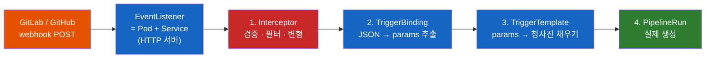
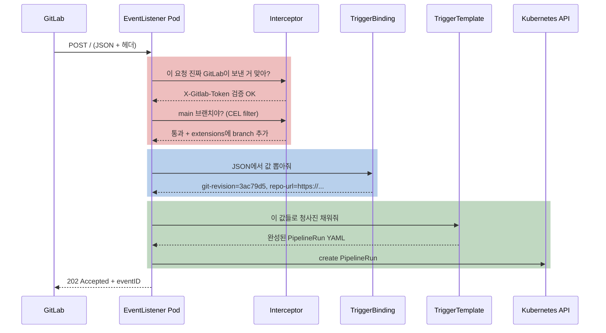
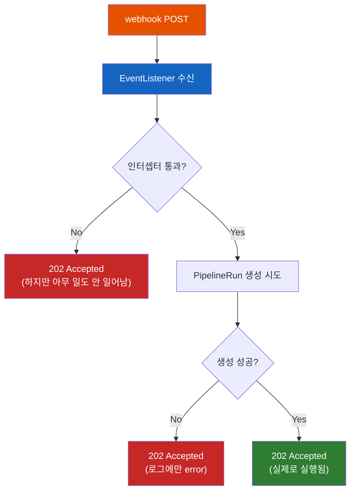

# Tekton Triggers는 어떻게 git push를 PipelineRun으로 바꿀까?

Pipeline을 만들어놨다. PipelineRun도 만들 줄 안다. 그런데 개발자가 커밋할 때마다 내가 손으로 `kubectl create -f pipelinerun.yaml`을 칠 수는 없다. GitLab이 push webhook을 쏴주면 그게 알아서 PipelineRun이 되어야 한다. 그 사이의 빈칸은 누가 채울까?

## 결론부터 말하면

**Tekton Triggers는 클러스터 안에 HTTP 서버 Pod를 하나 띄우고, 거기로 들어온 JSON을 PipelineRun YAML로 번역해주는 조립 라인이다.** 그 서버가 `EventListener`이고, 번역 공정은 네 단계로 쪼개져 있다.

핵심은 **왜 하나가 아니라 네 개로 쪼갰나** 다. 각 단계가 다른 이유로 바뀌기 때문이다. 검증 규칙은 Git 호스팅 종류가 바뀔 때, 추출 규칙은 payload 형태가 바뀔 때, 청사진은 파이프라인이 바뀔 때 각각 손대게 된다. 한 덩어리였다면 GitHub에서 GitLab으로 옮길 때 전부 다시 써야 한다.



| 리소스 | 한 줄 역할 | 바뀌는 이유 | 비유 |
|--------|-----------|------------|------|
| `EventListener` | HTTP 요청을 받는 서버 | 노출 방식이 바뀔 때 | 우편함 |
| `Interceptor` | 이 요청 진짜 맞아? 처리할 값어치 있어? | Git 호스팅이 바뀔 때 | 경비실 |
| `TriggerBinding` | JSON에서 필요한 값만 뽑기 | payload 구조가 바뀔 때 | 서식 작성 |
| `TriggerTemplate` | 뽑은 값으로 PipelineRun 완성 | 파이프라인이 바뀔 때 | 도장 찍기 |
| `Trigger` | 위 셋을 하나로 묶은 단위 | — | 결재 라인 |

`Pipeline`·`PipelineRun`의 관계를 먼저 이해하는 게 순서다. 아직이라면 [Tekton의 Pipeline과 PipelineRun은 왜 따로 존재할까](Tekton의-Pipeline과-PipelineRun은-왜-따로-존재할까.md)를 먼저 읽는 것을 권한다. 이 글은 그 문서가 끝난 지점 — "PipelineRun을 만들면 실행된다"에서 시작한다.

## 1. 왜 필요할까? PipelineRun을 손으로 만드는 고통

Triggers 없이 CI를 굴린다고 상상해보자. 개발자가 `feature/login` 브랜치에 커밋을 푸시했다. 이제 그 커밋을 빌드해야 한다. 내가 해야 할 일은 이렇다.

```bash
# 1. 커밋 해시를 알아낸다
git rev-parse HEAD    # 3ac79d5c3a1d415351a12edbf68c1a8cbca2bcbf

# 2. PipelineRun YAML을 손으로 쓴다
cat <<EOF | kubectl create -f -
apiVersion: tekton.dev/v1
kind: PipelineRun
metadata:
  generateName: ci-run-
spec:
  pipelineRef:
    name: ci-pipeline
  params:
    - name: git-revision
      value: 3ac79d5c3a1d415351a12edbf68c1a8cbca2bcbf   # 매번 손으로 갈아끼움
    - name: repo-url
      value: https://gitlab.com/team/app.git
EOF
```

하루에 커밋이 50번이면 이걸 50번 한다. 명백히 자동화 대상이다.

그런데 **무엇을 자동화해야 하는지** 를 정확히 보자. 위 과정에서 실제로 변하는 건 `git-revision` 값 하나뿐이다. 나머지 YAML 구조는 매번 똑같다. 그리고 그 변하는 값은 이미 GitLab이 webhook payload 안에 담아서 보내주고 있다.

```json
{
  "object_kind": "push",
  "ref": "refs/heads/feature/login",
  "checkout_sha": "3ac79d5c3a1d415351a12edbf68c1a8cbca2bcbf",
  "user_name": "seongseob",
  "repository": {
    "name": "app",
    "git_http_url": "https://gitlab.com/team/app.git"
  }
}
```

그러니까 필요한 건 딱 두 가지다. **(a) 이 JSON을 받아줄 HTTP 엔드포인트** 와 **(b) JSON의 특정 필드를 PipelineRun의 특정 자리에 꽂아 넣는 규칙** . Tekton Triggers는 정확히 이 두 가지를 Kubernetes 리소스로 제공한다.

### 그런데 왜 굳이 CRD로?

"그냥 웹 서버 하나 짜서 `kubectl create` 호출하면 되는 거 아닌가?" 맞다. 실제로 그렇게 하는 팀도 있다. 하지만 그 서버를 직접 만들면 따라오는 숙제가 있다.

Git 호스팅의 서명 검증을 직접 구현해야 하고(GitHub는 HMAC-SHA256, GitLab은 평문 토큰 — 뒤에서 다룬다), 브랜치·이벤트 타입 필터링 로직을 코드로 짜야 하고, 그 서버에 PipelineRun을 만들 RBAC 권한을 붙여야 하고, 그 서버 자체를 배포·모니터링·업그레이드해야 한다. Triggers는 이 전부를 선언적 YAML로 대체한다. Tekton이 CRD 기반이라 [Pipeline이 그랬듯](쿠버네티스는-어떻게-자기-자신을-확장할까-CRD와-컨트롤러-그리고-Operator.md) Triggers의 구성요소도 전부 `kubectl get`으로 조회되는 평범한 Kubernetes 오브젝트다.

설치는 Pipelines가 이미 깔려 있다는 전제 위에서 두 줄이다.

```bash
kubectl apply -f https://storage.googleapis.com/tekton-releases/triggers/latest/release.yaml
kubectl apply -f https://storage.googleapis.com/tekton-releases/triggers/latest/interceptors.yaml

kubectl get pods -n tekton-pipelines --watch   # 전부 1/1 이 되면 완료
```

두 번째 줄을 빠뜨리는 실수가 잦다. `interceptors.yaml`이 `github`·`gitlab`·`cel` 같은 **기본 인터셉터를 설치** 하는 파일이라, 이걸 안 깔면 나중에 인터셉터를 참조할 때 조용히 실패한다.

## 2. EventListener: 클러스터 안에 떠 있는 HTTP 서버

가장 먼저 이해할 것은 `EventListener`의 정체다. 이름 때문에 "이벤트를 듣는 추상적인 설정"처럼 느껴지지만, **실체는 그냥 Pod와 Service** 다.

```yaml
apiVersion: triggers.tekton.dev/v1beta1
kind: EventListener
metadata:
  name: gitlab-listener
  namespace: ci
spec:
  serviceAccountName: tekton-triggers-sa   # 이게 없으면 PipelineRun을 못 만든다
  triggers:
    - triggerRef: build-on-push
```

이걸 `apply`하면 Tekton Triggers 컨트롤러가 실제 워크로드를 만든다.

```bash
kubectl get all -n ci -l eventlistener=gitlab-listener

# NAME                                    READY   STATUS
# pod/el-gitlab-listener-6bf78d7884-mkzgj  1/1     Running
#
# NAME                          TYPE        CLUSTER-IP     PORT(S)
# service/el-gitlab-listener    ClusterIP   10.96.31.204   8080/TCP
```

**이름 규칙이 핵심이다. `EventListener`가 `foo`면 Service와 Deployment는 `el-foo`가 된다.** 기본 타입은 `ClusterIP`, 포트는 `8080`이다. 이 두 가지를 기억하면 Ingress를 붙일 때 헤매지 않는다.

이 서버는 클러스터 안에만 있으므로, GitLab이 접근하려면 외부로 노출해야 한다.

```yaml
apiVersion: networking.k8s.io/v1
kind: Ingress
metadata:
  name: tekton-webhook
  namespace: ci
  annotations:
    cert-manager.io/cluster-issuer: letsencrypt-prod
spec:
  ingressClassName: nginx
  tls:
    - hosts: ["webhook.example.com"]
      secretName: webhook-tls
  rules:
    - host: webhook.example.com
      http:
        paths:
          - path: /
            pathType: Prefix
            backend:
              service:
                name: el-gitlab-listener    # el- 접두사 주의
                port:
                  number: 8080
```

TLS는 선택이 아니다. 뒤에서 보겠지만 **GitLab은 webhook 시크릿을 평문으로 헤더에 실어 보내기 때문에** , HTTPS가 아니면 토큰이 그대로 노출된다.

### 먼저 짚고 갈 것: ServiceAccount와 RBAC

`serviceAccountName`을 빠뜨리거나 권한이 모자라면, webhook은 잘 도착하는데 PipelineRun이 안 만들어지는 상태가 된다. 게다가 **호출한 쪽에는 성공 응답이 간다** (5.1절에서 다룬다). 그래서 초기 셋업에서 가장 많이 시간을 잡아먹는 지점이다.

Triggers를 설치하면 두 개의 ClusterRole이 함께 생긴다. 하나는 네임스페이스 안에서 쓰는 것, 하나는 클러스터 범위용이다. 둘 다 묶어줘야 한다.

```yaml
apiVersion: v1
kind: ServiceAccount
metadata:
  name: tekton-triggers-sa
  namespace: ci
---
# 네임스페이스 안: EventListener가 PipelineRun/TaskRun을 만들 권한
apiVersion: rbac.authorization.k8s.io/v1
kind: RoleBinding
metadata:
  name: tekton-triggers-binding
  namespace: ci
subjects:
  - kind: ServiceAccount
    name: tekton-triggers-sa
roleRef:
  kind: ClusterRole
  name: tekton-triggers-eventlistener-roles     # 설치 시 함께 생성됨
  apiGroup: rbac.authorization.k8s.io
---
# 클러스터 범위: ClusterInterceptor(github/gitlab/cel)를 읽을 권한
apiVersion: rbac.authorization.k8s.io/v1
kind: ClusterRoleBinding
metadata:
  name: tekton-triggers-clusterbinding
subjects:
  - kind: ServiceAccount
    name: tekton-triggers-sa
    namespace: ci                               # 네임스페이스 명시 필수
roleRef:
  kind: ClusterRole
  name: tekton-triggers-eventlistener-clusterroles
  apiGroup: rbac.authorization.k8s.io
```

`ClusterRoleBinding`의 `subjects`에 `namespace`를 안 적는 실수가 흔하다. ServiceAccount는 네임스페이스 리소스라서, 클러스터 범위 바인딩에서는 어느 네임스페이스의 것인지 반드시 명시해야 한다.

## 3. 조립 라인 네 단계

EventListener가 요청을 받았다. 이제 JSON 한 덩어리를 PipelineRun으로 바꿔야 한다. 그 공정을 순서대로 따라가보자.



### 3.1 Interceptor: 경비실

첫 관문은 `Interceptor`다. 하는 일은 세 가지 — **검증(이 요청 진짜야?), 필터(처리할 값어치 있어?), 변형(쓰기 좋게 가공)** .

인터셉터는 `ClusterInterceptor`라는 클러스터 범위 리소스로 미리 설치돼 있고, 우리는 이름으로 참조만 한다. 기본 제공은 `github`, `gitlab`, `bitbucket`, `cel` 네 가지다.

**검증부터 보자.** GitLab 인터셉터는 이렇게 쓴다.

```yaml
interceptors:
  - name: "GitLab이 보낸 게 맞는지 확인"
    ref:
      name: "gitlab"
      kind: ClusterInterceptor
    params:
      - name: "secretRef"
        value:
          secretName: gitlab-webhook-secret    # 이 Secret에 담긴 값과
          secretKey: token                     #  요청 헤더를 비교
      - name: "eventTypes"
        value: ["Push Hook"]                   # X-Gitlab-Event 헤더로 필터
```

여기서 **GitHub과 GitLab의 검증 방식이 근본적으로 다르다는 점** 이 중요하다. 이 차이를 모르면 나중에 디버깅할 때 헤맨다.

| 항목 | GitHub | GitLab |
|------|--------|--------|
| 검증 헤더 | `X-Hub-Signature-256` | `X-Gitlab-Token` |
| 담긴 값 | 시크릿으로 body를 **HMAC-SHA256 서명한 다이제스트** | **시크릿 원문 그대로** |
| 검증 방법 | 서버가 같은 방식으로 재계산해 비교 | 문자열 직접 비교 |
| body 변조 감지 | **가능** (서명이 body를 덮음) | **불가능** (토큰은 body와 무관) |
| 이벤트 타입 헤더 | `X-GitHub-Event` | `X-Gitlab-Event` |

GitLab 방식은 보안적으로 약하다. 토큰이 매 요청마다 평문으로 날아가고, body가 변조돼도 알 수 없으며, 요청을 통째로 가로채 재전송하는 replay 공격에도 무방비다. GitLab 스스로도 이 문제를 인정해서, 최근에는 **signing token** (`X-Gitlab-Signature` 헤더에 HMAC-SHA256 서명)을 추가하고 공식 문서에서 "신규 webhook에는 secret token 대신 signing token을 쓰라"고 권고한다.

**그런데 여기 함정이 있다.** Tekton의 `gitlab` 인터셉터 소스를 보면, 읽는 헤더는 `X-Gitlab-Token` 하나뿐이고 검증은 이렇게 한다.

```go
// pkg/interceptors/gitlab/gitlab.go (요지)
header := req.Header.Get("X-Gitlab-Token")
// ... 시크릿 조회 ...
if subtle.ConstantTimeCompare([]byte(header), secretToken) == 0 {
    return interceptors.Fail(codes.InvalidArgument, "Invalid X-GitLab-Token")
}
```

`subtle.ConstantTimeCompare` — 타이밍 공격은 막지만, **어디까지나 평문 문자열 비교** 다. `X-Gitlab-Signature`는 코드 어디에도 등장하지 않는다. 즉 GitLab의 최신 권고를 따라 signing token만 설정하면, Tekton은 `X-Gitlab-Token` 헤더가 없다며 요청을 거절한다. **지금으로선 GitLab + Tekton 조합에서는 secret token을 써야 하고, 그렇다면 HTTPS는 타협 대상이 아니다.**

**다음은 필터다.** 인터셉터는 순서대로 체이닝되며, 앞 단계를 통과한 요청만 다음으로 넘어간다. 세밀한 조건에는 `cel` 인터셉터를 쓴다. CEL(Common Expression Language)은 Google이 만든 작은 표현식 언어로, payload를 대상으로 불리언 판정을 한다.

```yaml
interceptors:
  - ref:
      name: "gitlab"
      kind: ClusterInterceptor
    params: [ ... 위와 동일 ... ]

  - ref:
      name: "cel"
      kind: ClusterInterceptor
    params:
      - name: "filter"
        value: >
          body.ref == 'refs/heads/main' &&
          body.after != '0000000000000000000000000000000000000000' &&
          body.user_name != 'renovate-bot'
```

세 조건이 각각 실무에서 나온 것이다. 첫째는 main 브랜치만 빌드하겠다는 뜻. 둘째가 재미있는데, **브랜치를 삭제할 때도 GitLab은 push 이벤트를 보낸다** . 이때 `after` 필드가 0으로 가득 찬 값이 되므로, 이걸 걸러내지 않으면 존재하지 않는 커밋을 빌드하려다 실패한다. 셋째는 봇이 만든 의존성 업데이트 커밋을 제외하는 예다.

**마지막은 변형이다.** CEL 인터셉터의 `overlays`는 계산한 값을 payload에 덧붙인다. 자주 쓰는 예가 브랜치 이름 추출이다. GitLab이 주는 `body.ref`는 `refs/heads/main`처럼 전체 참조 경로라서, 브랜치 이름만 필요할 때 불편하다.

```yaml
  - ref:
      name: "cel"
      kind: ClusterInterceptor
    params:
      - name: "overlays"
        value:
          - key: branch_name
            expression: "body.ref.replace('refs/heads/', '')"  # refs/heads/main → main
          - key: short_sha
            expression: "body.checkout_sha.truncate(7)"        # 3ac79d5c3a1d... → 3ac79d5
```

**여기서 `split('/')[2]`를 쓰는 예제를 인터넷에서 자주 보게 되는데, 이건 반쪽짜리다.** `refs/heads/main`은 슬래시로 잘라 세 번째 조각을 꺼내면 `main`이 맞다. 그런데 실무의 브랜치 이름에는 슬래시가 흔하다.

| `body.ref` | `split('/')[2]` | `replace('refs/heads/', '')` |
|-----------|-----------------|------------------------------|
| `refs/heads/main` | `main` | `main` |
| `refs/heads/feature/login` | **`feature`** (잘림) | `feature/login` |
| `refs/heads/release/2026/q1` | **`release`** (잘림) | `release/2026/q1` |

`feature/login`을 빌드했는데 이미지 태그가 `feature`로 찍히는 식의 버그가 여기서 나온다. 접두사만 떼는 `replace`가 안전하다. Tekton의 CEL 인터셉터는 cel-go의 Strings 확장을 포함하므로 `replace`, `startsWith`, `endsWith`, `lowerAscii` 등을 그대로 쓸 수 있다.

**그리고 중요한 규칙 하나 더.** overlay가 만든 값은 body를 덮어쓰지 않고 **`extensions`라는 별도의 최상위 필드에 담긴다** . 그래서 다음 단계에서는 `$(body.branch_name)`이 아니라 `$(extensions.branch_name)`으로 꺼내야 한다. 이걸 헷갈려서 값이 안 넘어오는 경우가 자주 생긴다.

### 3.2 TriggerBinding: 서식 작성

경비실을 통과했다. 이제 JSON 덩어리에서 필요한 값만 뽑아 이름표를 붙인다. 그게 `TriggerBinding`이다.

```yaml
apiVersion: triggers.tekton.dev/v1beta1
kind: TriggerBinding
metadata:
  name: gitlab-push-binding
  namespace: ci
spec:
  params:
    - name: git-revision
      value: $(body.checkout_sha)                  # JSON body에서
    - name: repo-url
      value: $(body.repository.git_http_url)       # 중첩 필드는 점으로
    - name: branch
      value: $(extensions.branch_name)             # CEL overlay가 만든 값
    - name: short-sha
      value: $(extensions.short_sha)
    - name: triggered-by
      value: $(body.user_name)
    - name: event-type
      value: $(header.X-Gitlab-Event)              # HTTP 헤더에서
    - name: event-id
      value: $(context.eventID)                    # Tekton 내부 컨텍스트
```

접근 가능한 네임스페이스가 네 개다. 이 구분이 TriggerBinding의 전부라고 해도 된다.

| 표현식 | 출처 | 예시 |
|--------|------|------|
| `$(body.x)` | HTTP 요청 body(JSON) | `$(body.checkout_sha)` |
| `$(header.X)` | HTTP 헤더 (**대소문자 구분**) | `$(header.X-Gitlab-Event)` |
| `$(extensions.x)` | 인터셉터가 덧붙인 값 | `$(extensions.branch_name)` |
| `$(context.x)` | EventListener 내부 데이터 | `$(context.eventID)` |

JSON 키에 `.`이나 `/`가 들어 있으면 백슬래시로 이스케이프해야 한다. 그리고 재사용 범위에 따라 두 종류가 있다 — `TriggerBinding`은 네임스페이스 범위, `ClusterTriggerBinding`은 클러스터 범위다. 후자를 참조할 때는 `kind: ClusterTriggerBinding`을 명시해야 한다(기본값이 `TriggerBinding`이므로).

재사용할 일이 없다면 별도 리소스를 만들지 않고 Trigger 안에 인라인으로 적어도 된다.

```yaml
bindings:
  - name: git-revision
    value: $(body.checkout_sha)      # ref: 없이 name/value 직접 기술
```

### 3.3 TriggerTemplate: 도장 찍기

값이 준비됐다. 이제 그 값을 꽂아 넣을 청사진이 필요하다. `TriggerTemplate`은 **params를 선언하고, 그 params를 사용하는 리소스 템플릿을 담는다.**

```yaml
apiVersion: triggers.tekton.dev/v1beta1
kind: TriggerTemplate
metadata:
  name: build-template
  namespace: ci
spec:
  params:
    - name: git-revision
      description: 빌드할 커밋 해시
    - name: repo-url
      description: 클론할 저장소 URL
    - name: branch
      description: 브랜치 이름
      default: main                          # binding에서 못 찾으면 이 값
    - name: short-sha
      description: 이미지 태그용 짧은 해시

  resourcetemplates:
    - apiVersion: tekton.dev/v1
      kind: PipelineRun
      metadata:
        generateName: build-                 # name이 아니라 generateName
        labels:
          app: my-app
          git-branch: $(tt.params.branch)
      spec:
        pipelineRef:
          name: ci-pipeline
        params:
          - name: repo-url
            value: $(tt.params.repo-url)     # tt. 접두사 주의
          - name: revision
            value: $(tt.params.git-revision)
          - name: image-tag
            value: $(tt.params.short-sha)
        workspaces:
          - name: shared
            volumeClaimTemplate:
              spec:
                accessModes: ["ReadWriteOnce"]
                resources:
                  requests:
                    storage: 1Gi
```

여기서 **가장 많이 틀리는 지점이 `$(tt.params.x)`** 다. 왜 `$(params.x)`가 아니고 `tt.`가 붙을까?

`resourcetemplates` 안에 들어 있는 것은 **PipelineRun YAML** 이다. 그리고 PipelineRun은 그 자체로 `params`라는 필드를 가진다. 위 예시를 보면 `spec.params`에 `repo-url`이 있고, 이 값은 나중에 Pipeline 안에서 `$(params.repo-url)`로 참조된다. 즉 **같은 문서 안에 두 종류의 params가 공존한다** — TriggerTemplate이 webhook에서 받은 params와, PipelineRun이 Pipeline에게 넘길 params다.

둘 다 `$(params.x)`라면 누가 누구를 가리키는지 구분할 방법이 없다. 그래서 Triggers는 자기 것에 `tt.`(TriggerTemplate) 접두사를 붙여 네임스페이스를 분리했다.

```yaml
# 같은 파일 안에서 두 params가 공존한다
params:
  - name: revision
    value: $(tt.params.git-revision)   # ← Triggers가 지금 치환 (webhook 값)
# 그리고 이 값을 받은 Pipeline 안에서는
#   script: git checkout $(params.revision)   ← Tekton Pipelines가 나중에 치환
```

`generateName`을 쓰는 이유도 짚고 가자. 이 템플릿은 커밋마다 반복 실행된다. `name`으로 고정하면 두 번째 커밋에서 "이미 존재하는 이름"이라며 생성이 실패한다. `generateName`은 뒤에 랜덤 접미사를 붙여 매번 유일한 이름을 만든다.

### 3.4 Trigger: 셋을 묶기

인터셉터, 바인딩, 템플릿이 각각 준비됐다. `Trigger`는 이 셋을 하나의 처리 단위로 묶는다.

```yaml
apiVersion: triggers.tekton.dev/v1beta1
kind: Trigger
metadata:
  name: build-on-push
  namespace: ci
spec:
  serviceAccountName: tekton-triggers-sa
  interceptors:
    - name: "GitLab 검증"
      ref: { name: "gitlab", kind: ClusterInterceptor }
      params:
        - name: "secretRef"
          value: { secretName: gitlab-webhook-secret, secretKey: token }
        - name: "eventTypes"
          value: ["Push Hook"]
    - name: "main 브랜치만 + 브랜치명 추출"
      ref: { name: "cel", kind: ClusterInterceptor }
      params:
        - name: "filter"
          value: "body.ref == 'refs/heads/main'"
        - name: "overlays"
          value:
            - key: branch_name
              expression: "body.ref.replace('refs/heads/', '')"
            - key: short_sha
              expression: "body.checkout_sha.truncate(7)"
  bindings:
    - ref: gitlab-push-binding
  template:
    ref: build-template
```

**EventListener가 여러 Trigger를 가질 수 있다는 점이 실무에서 중요하다.** 하나의 webhook URL로 push는 빌드 파이프라인을, merge request는 테스트 파이프라인을 돌리고 싶을 때, Trigger를 두 개 두고 각각 다른 인터셉터 조건을 걸면 된다. 들어온 요청은 **모든 Trigger를 거치며, 인터셉터를 통과한 Trigger만 실행** 된다.

```yaml
apiVersion: triggers.tekton.dev/v1beta1
kind: EventListener
metadata:
  name: gitlab-listener
  namespace: ci
spec:
  serviceAccountName: tekton-triggers-sa
  triggers:
    - triggerRef: build-on-push      # Push Hook + main → 빌드
    - triggerRef: test-on-mr         # Merge Request Hook → 테스트
```

## 4. 전체를 한 번에: 동작하는 예제

지금까지 조각을 따로 봤으니, 한 파일로 이어 붙여 보자. GitLab의 main 브랜치 push를 받아 빌드 파이프라인을 도는 최소 구성이다.

```yaml
# 0. webhook 시크릿 — openssl rand -hex 20 으로 생성
apiVersion: v1
kind: Secret
metadata:
  name: gitlab-webhook-secret
  namespace: ci
type: Opaque
stringData:
  token: "8f2c1a9e4b7d3f6a0c5e8b1d4f7a2c9e6b3d0f5a"
---
# 1. 값 추출
apiVersion: triggers.tekton.dev/v1beta1
kind: TriggerBinding
metadata:
  name: gitlab-push-binding
  namespace: ci
spec:
  params:
    - name: git-revision
      value: $(body.checkout_sha)
    - name: repo-url
      value: $(body.repository.git_http_url)
    - name: short-sha
      value: $(extensions.short_sha)
---
# 2. 청사진
apiVersion: triggers.tekton.dev/v1beta1
kind: TriggerTemplate
metadata:
  name: build-template
  namespace: ci
spec:
  params:
    - name: git-revision
    - name: repo-url
    - name: short-sha
  resourcetemplates:
    - apiVersion: tekton.dev/v1
      kind: PipelineRun
      metadata:
        generateName: build-
      spec:
        pipelineRef:
          name: ci-pipeline
        params:
          - name: repo-url
            value: $(tt.params.repo-url)
          - name: revision
            value: $(tt.params.git-revision)
          - name: image-tag
            value: $(tt.params.short-sha)
        workspaces:
          - name: shared
            volumeClaimTemplate:
              spec:
                accessModes: ["ReadWriteOnce"]
                resources: { requests: { storage: 1Gi } }
---
# 3. 묶기
apiVersion: triggers.tekton.dev/v1beta1
kind: Trigger
metadata:
  name: build-on-push
  namespace: ci
spec:
  serviceAccountName: tekton-triggers-sa
  interceptors:
    - ref: { name: "gitlab", kind: ClusterInterceptor }
      params:
        - name: "secretRef"
          value: { secretName: gitlab-webhook-secret, secretKey: token }
        - name: "eventTypes"
          value: ["Push Hook"]
    - ref: { name: "cel", kind: ClusterInterceptor }
      params:
        - name: "filter"
          value: "body.ref == 'refs/heads/main'"
        - name: "overlays"
          value:
            - key: short_sha
              expression: "body.checkout_sha.truncate(7)"
  bindings:
    - ref: gitlab-push-binding
  template:
    ref: build-template
---
# 4. 서버
apiVersion: triggers.tekton.dev/v1beta1
kind: EventListener
metadata:
  name: gitlab-listener
  namespace: ci
spec:
  serviceAccountName: tekton-triggers-sa
  triggers:
    - triggerRef: build-on-push
```

### GitLab 쪽 설정과 로컬 테스트

GitLab에서는 **Settings → Webhooks** 에서 URL(`https://webhook.example.com`), Secret token(위 Secret과 **같은 값**), Trigger(Push events)를 설정한다.

배포 전에 로컬에서 확인하고 싶다면 포트 포워딩으로 직접 쏴볼 수 있다. GitLab 없이 전체 경로를 검증하는 가장 빠른 방법이다.

```bash
kubectl port-forward -n ci svc/el-gitlab-listener 8080:8080

curl -v http://localhost:8080 \
  -H 'Content-Type: application/json' \
  -H 'X-Gitlab-Event: Push Hook' \
  -H 'X-Gitlab-Token: 8f2c1a9e4b7d3f6a0c5e8b1d4f7a2c9e6b3d0f5a' \
  -d '{
    "ref": "refs/heads/main",
    "checkout_sha": "3ac79d5c3a1d415351a12edbf68c1a8cbca2bcbf",
    "repository": { "git_http_url": "https://gitlab.com/team/app.git" }
  }'
```

응답은 이렇게 온다.

```
< HTTP/1.1 202 Accepted
{"eventListener":"gitlab-listener","namespace":"ci",
 "eventListenerUID":"c2905e72-...","eventID":"8747199c-b96e-488c-9c44-d43b368b877b"}
```

그리고 확인.

```bash
kubectl get pipelineruns -n ci
# NAME          SUCCEEDED   REASON      STARTTIME
# build-r4qg4   Unknown     Running     5s
```

## 5. 실전에서 물리는 것들

### 5.1 202 Accepted는 "파이프라인이 시작됐다"는 뜻이 아니다

가장 위험한 오해다. 위 curl 응답의 `202 Accepted`를 보면 당연히 성공이라고 읽게 된다. 그런데 공식 문서의 정의는 미묘하게 다르다.

> EventListener는 **요청을 처리할 수 있었고, 설정에 따라 적절한 Trigger들을 선별했을 때** `202 ACCEPTED`로 응답한다.

"선별했을 때"까지다. 그 이후에 벌어지는 일은 응답 코드에 반영되지 않는다. 실제로 Tekton Triggers 이슈 #1183에 보고된 대로, **TriggerTemplate에 오류가 있어 PipelineRun 생성이 실패해도 202가 나간다.** EventListener 로그에는 error가 찍히지만, 호출한 쪽은 성공으로 안다.

CEL filter가 요청을 걸러낸 경우도 마찬가지다. "이 이벤트는 처리 대상이 아님"은 정상적인 판정이므로 2xx가 나간다. 즉 **202는 "우편함에 잘 도착했다"는 뜻이지, "파이프라인이 돈다"는 뜻이 아니다.**



**그럼 진짜 확인은 어떻게 하나?** 응답에 담긴 `eventID`를 쓴다. EventListener는 자신이 만든 모든 리소스에 아래 세 개의 label을 자동으로 붙인다.

| Label | 값 |
|-------|-----|
| `triggers.tekton.dev/eventlistener` | EventListener 이름 |
| `triggers.tekton.dev/trigger` | 실행된 Trigger 이름 |
| `triggers.tekton.dev/triggers-eventid` | **이 요청의 eventID** |

**세 번째 label 이름을 특히 조심해야 한다.** 앞의 둘은 `/eventlistener`·`/trigger`로 규칙적인데, eventID만 유독 `/triggers-eventid`로 `triggers-`가 한 번 더 붙는다. 게다가 **Tekton 공식 문서의 label 표에는 `triggers.tekton.dev/eventid`라고 적혀 있다** — 소스와 다르다.

```go
// pkg/apis/triggers/register.go
GroupName             = "triggers.tekton.dev"
EventListenerLabelKey = "/eventlistener"
EventIDLabelKey       = "/triggers-eventid"   // ← 문서와 불일치
TriggerLabelKey       = "/trigger"
```

문서를 그대로 믿고 `-l triggers.tekton.dev/eventid=...`로 조회하면 **PipelineRun이 정상 생성됐는데도 결과가 항상 비어서** "생성 실패"로 오판하게 된다. 확신이 안 서면 실제 오브젝트에서 직접 확인하는 게 가장 빠르다.

```bash
kubectl get pipelinerun -n ci -o jsonpath='{.items[0].metadata.labels}' | jq
```

따라서 POST 응답에서 `eventID`를 뽑아 그 label로 조회하면, 이 요청이 실제로 PipelineRun을 만들었는지 확정할 수 있다.

```bash
EVENT_ID=$(curl -s http://localhost:8080 -H '...' -d '...' | jq -r .eventID)

kubectl get pipelineruns -n ci \
  -l triggers.tekton.dev/triggers-eventid=$EVENT_ID

# 결과가 비어 있다면 → 인터셉터에서 걸렸거나 생성에 실패한 것
```

호출하는 쪽에서 "정말 돌았는지" 확인해야 한다면 이 패턴이 정답이다. 다음 문서에서 Jenkins로 이걸 구현한다.

### 5.2 EventListener 로그가 1차 디버깅 창구다

202만 보고는 아무것도 알 수 없으니, 문제가 생기면 곧바로 Pod 로그를 본다.

```bash
kubectl logs -n ci -l eventlistener=gitlab-listener -f
```

자주 만나는 메시지와 원인이다.

| 로그 메시지 | 원인 |
|------------|------|
| `no X-Gitlab-Token header set` | GitLab에 Secret token 미설정, 또는 signing token만 설정 |
| `Invalid X-GitLab-Token` | Secret 리소스의 값과 GitLab 설정값 불일치 |
| `event type ... is not allowed` | `eventTypes`에 없는 이벤트 (정상 필터링) |
| `expression ... failed to evaluate` | CEL 표현식이 참조한 필드가 payload에 없음 |
| `is forbidden: User "system:serviceaccount:..."` | RBAC 부족 — RoleBinding 확인 |
| `couldn't find ClusterInterceptor` | `interceptors.yaml`을 설치하지 않음 |

### 5.3 apiVersion이 두 군데 나온다 — 서로 다른 것이다

문서와 블로그를 돌아다니다 보면 `v1alpha1`과 `v1beta1`이 섞여 나와 혼란스럽다. 정리하면 이렇다.

**EventListener, Trigger, TriggerBinding, TriggerTemplate은 `triggers.tekton.dev/v1beta1`을 쓰면 된다.** 공식 문서 일부에 아직 `v1alpha1` 예제가 남아 있지만, `enable-api-fields` 같은 기능 플래그가 v1beta1에만 적용된다는 점에서 v1beta1이 현재의 기준선이다.

그리고 **인터셉터 `ref:` 블록 안에 나오는 `apiVersion`은 완전히 다른 필드다.**

```yaml
apiVersion: triggers.tekton.dev/v1beta1   # ← 이 리소스(Trigger) 자신의 버전
kind: Trigger
spec:
  interceptors:
    - ref:
        name: "gitlab"
        kind: ClusterInterceptor
        apiVersion: triggers.tekton.dev   # ← 참조 대상의 API 그룹 (버전 없음)
```

바깥쪽은 "이 YAML을 어떤 스키마로 해석할지", 안쪽은 "어느 API 그룹의 ClusterInterceptor를 찾을지"를 가리킨다. 같은 이름이지만 하는 일이 다르다. `ref` 안의 `apiVersion`과 `kind`는 생략해도 기본값(`ClusterInterceptor`)이 적용되므로, 대부분 `name`만 써도 동작한다.

참고로 `interceptors` 아래에 `ref:` 없이 `webhook:`을 직접 쓰는 형태를 오래된 예제에서 볼 수 있는데, 이건 **`v1alpha1`에서만 지원되는 레거시 방식** 이다. 외부 Service로 payload를 넘겨 커스텀 검증을 하는 용도이며, 새로 짠다면 `ClusterInterceptor` 방식을 쓰는 게 맞다.

### 5.4 overlay 값은 body가 아니라 extensions에 있다

3.1절에서 언급했지만 반복할 만하다. CEL overlay로 만든 값을 `$(body.branch_name)`으로 꺼내려다 실패하는 경우가 정말 많다.

```yaml
# overlay 정의
- key: branch_name
  expression: "body.ref.replace('refs/heads/', '')"

# 잘못된 참조
value: $(body.branch_name)        # 값이 안 들어옴

# 올바른 참조
value: $(extensions.branch_name)
```

overlay는 원본 payload를 건드리지 않고 `extensions`라는 별도 최상위 필드에 결과를 쌓는다. 원본 보존이 원칙이기 때문이다.

### 5.5 브랜치 삭제 이벤트를 걸러내지 않으면 빌드가 깨진다

이미 예제에 넣었지만 왜 필요한지 다시 짚는다. **브랜치를 삭제해도 Push Hook이 발사된다.** "푸시"라는 이름과 달리, Git 입장에서 브랜치 삭제는 "빈 값을 푸시하는 것"이기 때문이다.

이때 payload의 두 필드가 각각 다른 방식으로 그 사실을 알린다. 역할을 나눠서 기억하는 게 좋다.

| 필드 | 평소 push | 브랜치 삭제 시 | 용도 |
|------|-----------|---------------|------|
| `body.after` | 새 커밋 해시 | `0000000000000000000000000000000000000000` | **삭제 감지용 필터** |
| `body.checkout_sha` | 새 커밋 해시 | `null` | 빌드할 커밋 (바인딩에서 추출) |

즉 **삭제 판정은 `after`로 하고, `checkout_sha`는 그 판정을 통과한 뒤에 꺼내 쓴다.** 순서가 중요하다. 필터 없이 바로 바인딩으로 넘어가면 `checkout_sha`가 `null`인 채로 파이프라인에 들어가고, 존재하지 않는 커밋을 체크아웃하려다 실패한다. 그리고 그 실패 알림이 팀 채널에 나간다.

```yaml
interceptors:
  # 1단계: 걸러내기만 한다
  - name: "빌드 대상인지 판정"
    ref: { name: "cel", kind: ClusterInterceptor }
    params:
      - name: "filter"
        value: >
          body.ref == 'refs/heads/main' &&
          body.after != '0000000000000000000000000000000000000000'

  # 2단계: 여기 도달했다면 checkout_sha는 null이 아님이 보장된다
  - name: "값 가공"
    ref: { name: "cel", kind: ClusterInterceptor }
    params:
      - name: "overlays"
        value:
          - key: short_sha
            expression: "body.checkout_sha.truncate(7)"
```

CEL 인터셉터 하나에 `filter`와 `overlays`를 함께 넣어도 동작한다 — 인터셉터 내부적으로 `filter`를 먼저 평가하고 통과한 경우에만 `overlays`를 적용하기 때문이다. 다만 **위처럼 둘로 나누면 순서가 YAML에 눈으로 보인다.** 인터셉터는 배열에 적힌 순서대로 체이닝되고 앞 단계를 통과한 요청만 다음으로 넘어가므로, "검증·필터를 앞에, 변형을 뒤에"라는 원칙이 구조 자체로 드러난다.

순서가 왜 중요한지는 반대로 해보면 안다. 삭제 이벤트에서 `checkout_sha`는 `null`이고, `null`에 `truncate()`를 호출하면 CEL 평가 오류가 난다. **필터가 먼저 걸러주지 않으면 변형 단계가 터진다.**

"우리 CI가 가끔 이유 없이 빨간불"의 흔한 원인 중 하나다.

## 6. 정리

### 핵심 포인트

1. **EventListener는 추상적 설정이 아니라 실제로 뜨는 Pod와 Service다**
   - 이름이 `foo`면 `el-foo`라는 Deployment와 ClusterIP Service가 생기고, `8080` 포트로 HTTP를 받는다. 외부에서 webhook을 받으려면 Ingress나 LoadBalancer로 노출해야 하고, 그 앞에는 반드시 TLS가 있어야 한다.

2. **번역 공정을 네 개로 쪼갠 이유는 변경 이유가 각각 다르기 때문이다**
   - `Interceptor`(검증·필터·변형)는 Git 호스팅이 바뀔 때, `TriggerBinding`(값 추출)은 payload 구조가 바뀔 때, `TriggerTemplate`(청사진)은 파이프라인이 바뀔 때 손댄다. `Trigger`가 이 셋을 묶고, 하나의 EventListener가 여러 Trigger를 가질 수 있어 push와 merge request를 한 URL로 분기 처리한다.

3. **202 Accepted는 성공이 아니라 "접수됨"이다**
   - 인터셉터가 걸러냈어도, PipelineRun 생성에 실패했어도 202가 나간다. 실제 실행 여부는 응답의 `eventID`를 `triggers.tekton.dev/triggers-eventid` label로 조회해 확인해야 한다. 문제가 생기면 EventListener Pod 로그가 1차 창구다.

4. **GitLab 연동에는 Tekton 문서에 없는 함정이 있다**
   - GitHub은 `X-Hub-Signature-256`으로 body를 HMAC 서명하지만, GitLab은 `X-Gitlab-Token`에 시크릿을 **평문으로** 실어 보내고 Tekton은 이를 문자열 비교한다. GitLab이 새로 권고하는 signing token(`X-Gitlab-Signature`)은 **Tekton 인터셉터가 읽지 않는다** . 그래서 GitLab + Tekton 조합에서는 secret token을 써야 하며, HTTPS가 사실상 필수다.

5. **변수 네임스페이스를 구분하라**
   - TriggerBinding에서는 출처에 따라 `$(body.x)` / `$(header.X)` / `$(extensions.x)` / `$(context.x)`. TriggerTemplate의 `resourcetemplates` 안에서는 `$(tt.params.x)` — 그 안에 든 PipelineRun 자신의 `$(params.x)`와 충돌하지 않게 하려는 설계다. CEL overlay 결과는 `body`가 아니라 `extensions`에 담긴다.

---

## 출처

- [Tekton Triggers 공식 문서](https://tekton.dev/docs/triggers/) - 구성요소 개요와 전체 흐름
- [Tekton EventListeners](https://tekton.dev/docs/triggers/eventlisteners/) - `el-` 네이밍, 8080 포트, 202 응답 정의, 자동 부착 label, RBAC
- [Tekton Interceptors](https://tekton.dev/docs/triggers/interceptors/) - github/gitlab/bitbucket/cel 파라미터, overlays와 extensions
- [Tekton TriggerTemplates](https://tekton.dev/docs/triggers/triggertemplates/) - `$(tt.params.x)` 문법과 그 이유
- [Tekton TriggerBindings](https://tekton.dev/docs/triggers/triggerbindings/) - body/header/extensions/context 접근
- [Tekton Triggers 설치 가이드](https://tekton.dev/docs/triggers/install/) - release.yaml + interceptors.yaml
- [tektoncd/triggers - gitlab.go 소스](https://github.com/tektoncd/triggers/blob/main/pkg/interceptors/gitlab/gitlab.go) - `X-Gitlab-Token` 평문 비교 구현 확인
- [tektoncd/triggers Issue #1183](https://github.com/tektoncd/triggers/issues/1183) - PipelineRun 생성 실패 시에도 202 반환
- [GitLab Webhooks 문서](https://docs.gitlab.com/user/project/integrations/webhooks/) - `X-Gitlab-Token` 평문 전달, signing token 권고
- [GitHub webhook 검증 문서](https://docs.github.com/en/webhooks/using-webhooks/validating-webhook-deliveries) - `X-Hub-Signature-256` HMAC-SHA256
- [Filtering Tekton trigger operations (Red Hat)](https://www.redhat.com/en/blog/filtering-tekton-trigger-operations) - CEL 필터와 overlay 실전 예제
