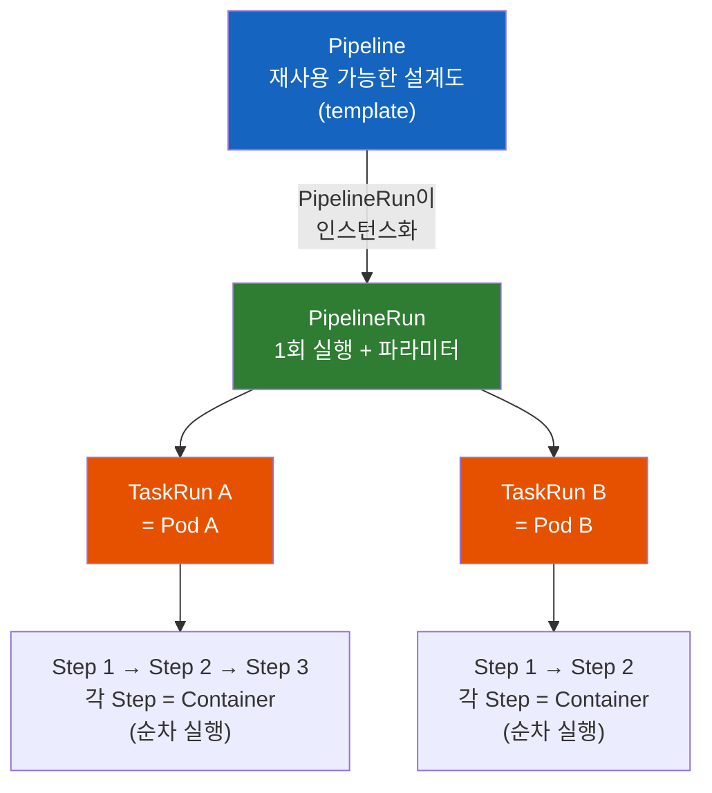
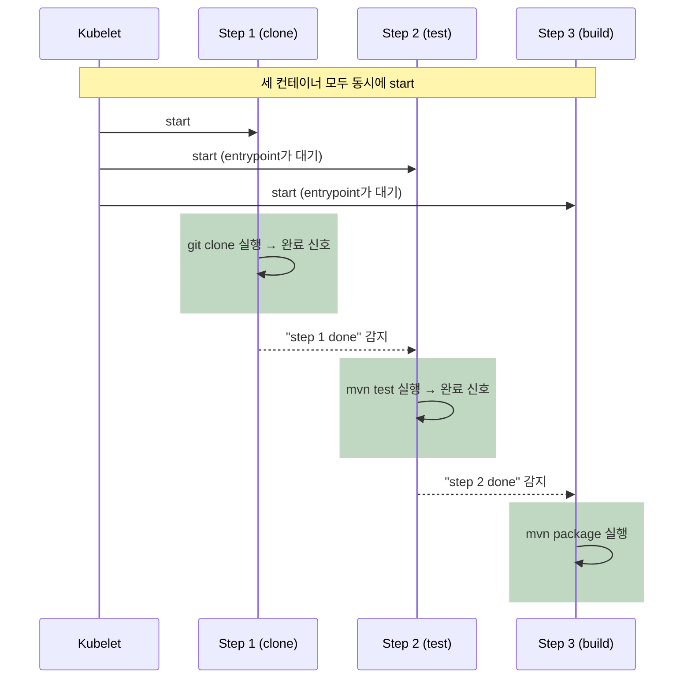
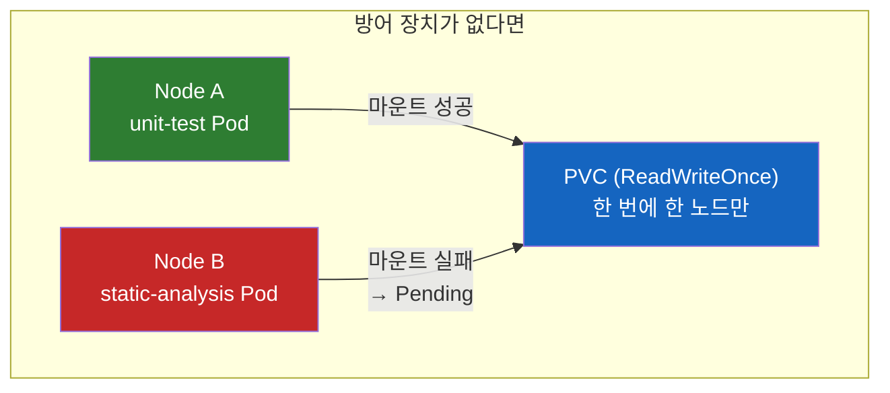

# Tekton의 Pipeline과 PipelineRun은 왜 따로 존재할까?

Kubernetes 위에서 CI/CD를 굴리는 Tekton. 그런데 Pipeline을 만들어놔도 아무 일도 일어나지 않는다. 왜 실행하려면 PipelineRun이라는 걸 또 만들어야 할까? 그리고 그 안의 Step은 "순차 실행"이라는데 왜 컨테이너는 전부 동시에 뜰까?

## 결론부터 말하면

**Tekton에서 `Pipeline`·`Task`는 실행되지 않는다. 실행되는 것은 `PipelineRun`·`TaskRun`이다.** Pipeline은 Java의 **클래스(설계도)** 이고, PipelineRun은 그 클래스를 `new`한 **인스턴스(실행)** 다. 클래스 정의만으로는 아무 일도 안 일어나는 것과 똑같다.

계층은 이렇게 맞물린다. 파라미터를 넣어 `PipelineRun`을 만들면 → Tekton이 각 `Task`마다 `TaskRun`을 만들고 → `TaskRun` 하나가 Kubernetes **Pod 하나** 가 되며 → 그 안의 `Step` 하나하나가 Pod 안의 **컨테이너 하나** 가 된다.



| Tekton 리소스 | 역할 | Kubernetes 대응 | Java 비유 |
|---------------|------|-----------------|-----------|
| `Task` | Step들의 묶음 (설계도) | — | 클래스(메서드) |
| `Pipeline` | Task들의 순서·의존 관계 (설계도) | — | 클래스 |
| `TaskRun` | Task 1회 실행 | **Pod** | 인스턴스 |
| `PipelineRun` | Pipeline 1회 실행 | Pod 여러 개 | 인스턴스 |
| `Step` | Task 안의 명령 1개 | **Container** | 메서드 안의 한 줄 |

## 1. 왜 "설계도"와 "실행"을 굳이 나눴을까?

Jenkins를 써본 사람이라면 `Jenkinsfile` 하나에 파이프라인 정의와 실행이 뭉쳐 있는 감각에 익숙하다. 그런데 Tekton은 이걸 두 개의 리소스로 쪼갠다. 처음 보면 번거롭다. "그냥 Pipeline 만들면 실행되면 안 돼?"라는 생각이 든다.

이유는 Tekton이 **Kubernetes-native** 하기 때문이다. Tekton은 별도의 서버 프로세스가 아니라, Kubernetes에 `Task`·`Pipeline`·`TaskRun`·`PipelineRun`이라는 **CRD(Custom Resource Definition)** 를 등록하고, 컨트롤러가 이 리소스들을 감시하는 구조다. 즉 Tekton의 모든 것은 `kubectl get pipelinerun`으로 조회되는 평범한 Kubernetes 오브젝트다.

Kubernetes의 세계에서 오브젝트는 **선언적(declarative)** 이다. `Deployment`(원하는 상태)와 `Pod`(실제 실행)가 분리돼 있듯, Tekton도 **"무엇을 할지"(Pipeline)** 와 **"지금 이 파라미터로 한 번 실행"(PipelineRun)** 을 분리한다. 이 분리가 주는 이점은 분명하다.

- **재사용**: 하나의 `Pipeline`을 브랜치마다, 환경마다 다른 파라미터로 몇 번이고 실행한다.
- **감사·이력**: `PipelineRun`은 실행 기록 그 자체다. 언제 어떤 커밋으로 돌았고 성공/실패했는지가 오브젝트로 남는다.
- **불변성**: `PipelineRun`은 한 번 생성되면 사실상 **immutable** 이다. 실행 도중 설계도를 바꿔치기할 수 없어 재현성이 보장된다.

그래서 Pipeline만 `apply`하면 아무 일도 안 일어난다. 클래스를 컴파일해놓고 `main()`에서 `new` 하지 않은 것과 같다. 실행하려면 반드시 Run 오브젝트를 만들어야 한다.

## 2. Task와 Step: Pod와 Container로 내려가기

이제 한 단계 더 내려가자. `Task`는 Tekton의 최소 실행 단위이고, 그 안은 `Step`들로 채워진다.

**핵심 규칙 하나만 기억하면 된다. `TaskRun` 하나 = `Pod` 하나, `Step` 하나 = `Container` 하나.** 이 매핑이 Tekton의 거의 모든 동작과 제약을 설명한다.

```yaml
apiVersion: tekton.dev/v1
kind: Task
metadata:
  name: build-task
spec:
  workspaces:
    - name: source          # Step들이 공유할 볼륨 (Pod 레벨)
  steps:
    - name: clone           # Step 1 → Container 1
      image: alpine/git
      script: |
        git clone https://github.com/example/app /workspace/source
    - name: test            # Step 2 → Container 2
      image: maven:3.9
      script: |
        cd /workspace/source && mvn test
    - name: build           # Step 3 → Container 3
      image: maven:3.9
      script: |
        cd /workspace/source && mvn package
```

`Step`은 위에서 아래로 **정의된 순서대로** 실행된다. 그리고 세 Step이 **같은 Pod 안** 에 있기 때문에, `clone`이 받아온 소스를 `test`·`build`가 그대로 이어서 쓸 수 있다. 같은 Pod의 컨테이너는 **네트워크 네임스페이스** 를 공유하고, **마운트된 볼륨** 을 함께 볼 수 있다. 그래서 `clone`이 볼륨에 써둔 소스 파일이 다음 Step에도 그대로 보이는 것이다.

주의할 점은 **환경변수는 공유되지 않는다** 는 것이다. 환경변수는 컨테이너별 설정이라, 한 Step에서 `export`한 값이 다음 Step 컨테이너로 자동 전파되지 않는다. 따라서 **Step 사이의 데이터 전달은 공유 Workspace(볼륨)에 파일로 쓰거나 Result로 넘기는 방식** 이 원칙이다. 파일 기반 공유가 Task 안에서 데이터를 넘기는 가장 자연스러운 방법이다.

### Task는 입력을 어떻게 받을까: params 선언

위 예제는 저장소 URL이 하드코딩돼 있어 재사용이 불가능하다. 설계도가 설계도이려면 **바깥에서 값을 받아야** 한다. 그게 `params`다.

받는 쪽(Task)이 먼저 선언하고, 주는 쪽(PipelineRun)이 값을 채운다. 자바 메서드의 시그니처와 호출을 떠올리면 정확히 맞는다.

```yaml
apiVersion: tekton.dev/v1
kind: Task
metadata:
  name: build-task
spec:
  params:
    - name: repo-url
      type: string                    # 기본값이라 생략 가능
      description: 클론할 저장소 URL
    - name: revision
      type: string
      default: main                   # 안 주면 이 값이 쓰인다
    - name: build-flags
      type: array                     # 배열 타입
      default: ["-DskipTests=false"]
    - name: registry
      type: object                    # 객체 타입 — properties 필수
      properties:
        host: { type: string }
        namespace: { type: string }
  steps:
    - name: clone
      image: alpine/git
      script: |
        git clone --branch $(params.revision) $(params.repo-url) /workspace/source
    - name: build
      image: maven:3.9
      args: ["package", "$(params.build-flags[*])"]   # 배열은 [*]로 펼친다
      script: |
        echo "푸시 대상: $(params.registry.host)/$(params.registry.namespace)"
```

타입별로 참조 문법이 다르다는 게 포인트다.

| 타입 | 선언 | 참조 |
|------|------|------|
| `string` | 기본값 | `$(params.repo-url)` |
| `array` | `type: array` | `$(params.build-flags[*])` — 인자 목록으로 펼쳐짐 |
| `object` | `type: object` + `properties` | `$(params.registry.host)` |

이름에 점(`.`)이 들어간 파라미터는 대괄호 표기법으로 접근한다 — `$(params['foo.bar'])`. 점이 객체 멤버 접근으로 해석되기 때문이다.

`default`가 있으면 그 파라미터는 선택 사항이 되고, 없으면 필수가 되어 값을 안 주면 검증에서 거부된다.

### Step 공통 설정을 한 번에: stepTemplate

Step마다 같은 환경변수나 보안 설정을 반복해서 쓰게 되는 경우가 많다. `stepTemplate`은 모든 Step에 적용될 기본값을 한 곳에 모은다.

```yaml
spec:
  stepTemplate:
    env:
      - name: MAVEN_OPTS
        value: "-Xmx2g"
    securityContext:
      runAsNonRoot: true
  steps:
    - name: test
      image: maven:3.9
      script: mvn test              # MAVEN_OPTS 자동 적용
    - name: build
      image: maven:3.9
      env:
        - name: MAVEN_OPTS
          value: "-Xmx4g"           # 개별 Step이 덮어쓴다
      script: mvn package
```

겹치는 항목은 **개별 Step의 설정이 이긴다.**

### Step과 나란히 도는 컨테이너: sidecars

Step은 순차 실행이지만, **Step이 도는 내내 옆에서 계속 떠 있어야 하는 컨테이너** 가 필요할 때가 있다. 테스트용 데이터베이스, Docker-in-Docker 데몬 같은 것들이다. 이건 `sidecars`로 선언한다.

```yaml
spec:
  steps:
    - name: integration-test
      image: maven:3.9
      script: |
        # localhost로 접근 가능 — 같은 Pod라 네트워크를 공유한다
        mvn verify -Dtest.db.url=jdbc:postgresql://localhost:5432/testdb
  sidecars:
    - name: postgres
      image: postgres:16
      env:
        - name: POSTGRES_PASSWORD
          value: test
      readinessProbe:                    # 준비될 때까지 Step이 기다리게
        exec:
          command: ["pg_isready", "-U", "postgres"]
```

**sidecar는 마지막 Step이 끝나면 Tekton이 자동으로 종료** 시킨다. 그래서 Pod가 영원히 Running으로 남지 않는다. 3.1절에서 "Step은 병렬 실행이 안 된다"고 했는데, sidecar는 그 규칙의 예외가 아니라 **다른 범주** 다 — 작업을 나눠 하는 게 아니라 작업에 필요한 환경을 제공하는 쪽이다.

### 그런데 여기서 이상한 점이 있다

"Step은 순차 실행"이라고 했다. 그렇다면 `test` Step의 컨테이너는 `clone`이 끝난 **다음에** 생성돼야 자연스럽다. 그런데 Pod를 뜯어보면 — **세 Step 컨테이너가 처음부터 전부 동시에 start 된다.**

어떻게 순차 실행인데 컨테이너가 동시에 뜰까? Kubernetes에는 "컨테이너를 순서대로 시작"하는 기능이 없기 때문이다(init container를 빼면). Pod 안의 일반 컨테이너는 전부 동시에 뜬다. Tekton은 이 제약을 **entrypoint 주입(injection)** 이라는 트릭으로 우회한다.

Tekton은 각 Step 컨테이너의 진짜 명령 앞에 자신의 `entrypoint` 바이너리를 끼워 넣는다. 컨테이너는 동시에 뜨지만, 이 entrypoint가 **"내 앞 Step이 끝났다"는 신호를 감지할 때까지 대기** 한다. Step 1이 명령을 마치고 완료 표시를 남기면, 대기하던 Step 2의 entrypoint가 그걸 감지하고 그제서야 진짜 명령을 실행한다.



이 트릭은 눈에 보이지 않는 곳에서 두 가지 중요한 제약을 만든다. 하나는 **리소스 예약**, 다른 하나는 **결과(Result) 크기 제한** 이다. 다음 절에서 다룬다.

## 3. 제약: 문서에는 잘 안 보이지만 반드시 물리는 것들

### 3.1 Step은 Task 안에서 병렬 실행이 안 된다

`Step`은 **오직 순차** 다. 한 Task 안에서 두 Step을 동시에 돌리는 문법은 없다. 병렬이 필요하면 **Task를 나눠서** Pipeline 레벨에서 병렬화해야 한다(뒤의 3.5). "무거운 정적 분석과 유닛 테스트를 같이 돌리고 싶다" → 같은 Task의 두 Step이 아니라, 두 개의 Task로 쪼갠다.

### 3.2 모든 Step 컨테이너가 동시에 뜬다 → 리소스 예약 함정

컨테이너가 전부 동시에 start 되기 때문에, 순진하게 계산하면 Pod는 **모든 Step의 resource requests 합계** 를 예약해야 한다. Step이 실제로는 한 번에 하나만 도는데도 말이다. `ResourceQuota`가 걸린 네임스페이스에서 이걸 모르면 "쿼터 초과로 Pod가 안 뜨는" 상황을 만난다.

Tekton은 Step이 순차 실행된다는 점을 이용해 이 예약을 최적화할 수 있다. `LimitRange`가 있으면 Tekton은 그 값을 바탕으로 각 컨테이너의 request를 조정해, **"한 번에 한 Step만 도니 합계가 아니라 한 Step 분량만 예약"** 하는 방향으로 맞춘다. 다만 실제 예약·검증 방식은 **`ResourceQuota`·`LimitRange` 설정 조합에 따라 달라질 수 있으므로** 클러스터 설정에서 확인하는 게 안전하다. 특히 **init container** 는 이 최적화 밖이라, `ResourceQuota`를 쓰는 네임스페이스라면 `LimitRange`를 함께 정의해 init container에도 한도가 잡히도록 해야 한다 — Red Hat이 별도 가이드를 낼 만큼 흔히 밟는 함정이다.

### 3.3 Result는 4096 byte, Step이 많을수록 더 작아진다

Task는 다음 Task로 작은 값(커밋 해시, 이미지 태그 등)을 넘길 때 **Result** 를 쓴다. 그런데 Tekton은 이 값을 **Kubernetes 컨테이너의 termination message** 로 실어 나른다. 그리고 termination message의 최대 크기는 **4096 byte** 다.

**그전에 Result를 실제로 어떻게 쓰는지부터 보자.** 여기가 처음 보면 가장 낯선 부분이다. Result는 `return` 문 같은 게 아니라 **약속된 경로에 파일을 쓰는 방식** 이다.

```yaml
apiVersion: tekton.dev/v1
kind: Task
metadata:
  name: git-clone
spec:
  params:
    - name: repo-url
  results:
    - name: commit                       # 먼저 선언하고
      description: 체크아웃한 커밋 해시
    - name: image-tag
  steps:
    - name: clone
      image: alpine/git
      script: |
        #!/bin/sh
        git clone $(params.repo-url) /workspace/source
        cd /workspace/source

        # $(results.commit.path)가 파일 경로로 치환된다
        # 실제로는 /tekton/results/commit 같은 경로
        git rev-parse HEAD | tr -d '\n' > $(results.commit.path)

        git rev-parse --short HEAD | tr -d '\n' > $(results.image-tag.path)
```

**`tr -d '\n'`을 눈여겨보라.** Tekton은 파일 내용을 **가공 없이 그대로** 읽는다. `echo`가 붙이는 개행 문자까지 값의 일부가 되므로, 이걸 지우지 않으면 다음 Task에서 `abc123\n`을 이미지 태그로 쓰려다 실패한다. **Result 값에서 개행을 제거하는 것은 선택이 아니라 관례다.** `echo -n`을 쓰거나 위처럼 `tr -d '\n'`으로 자르면 된다.

값을 꺼내 쓰는 쪽은 이렇다.

```yaml
tasks:
  - name: clone
    taskRef: { name: git-clone }
  - name: build
    taskRef: { name: kaniko }
    params:
      - name: tag
        value: $(tasks.clone.results.image-tag)   # 앞 Task의 Result 참조
```

이 참조 하나가 **자동으로 실행 순서를 만든다.** `runAfter`를 안 써도 `build`는 `clone` 뒤에 돈다 — 데이터 의존성이 곧 순서 의존성이기 때문이다.

여기서 Step 수가 발목을 잡는다. **한도가 Step(컨테이너)마다 걸리는데, Tekton은 Task의 Result를 이 Step들의 termination message를 통해 모아 오기 때문이다.** 그래서 Step이 많아질수록 Result에 안전하게 쓸 수 있는 여유가 줄어든다. 정확히 몇 분의 1이라고 단정할 수는 없다 — Tekton이 내부 메타데이터로 일부를 쓰고, 버전에 따라 수집 방식도 달라진다. **실용적인 기준은 "Result는 수백 byte 규모의 짧은 값으로 제한한다"** 정도다. 한도를 넘으면 TaskRun이 이 메시지와 함께 실패한다:

```
Termination message is above max allowed size 4096, caused by large task result
```

**그래서 대용량 데이터는 Result가 아니라 Workspace(볼륨)로 넘긴다.** Result는 "포인터·식별자" 용도, Workspace는 "덩어리 데이터" 용도로 나눠 쓰는 게 원칙이다. (한도 자체를 늘리고 싶다면, termination message 대신 Result를 별도 저장소에 담는 `results-from` / `max-result-size` 설정을 켜는 방법도 있지만, 기본 원칙은 여전히 "큰 건 Workspace"다.)

| 구분 | Result | Workspace |
|------|--------|-----------|
| 실체 | termination message | Volume (PVC, emptyDir 등) |
| 크기 | **4096 byte 이하** (Step 수로 분할) | 볼륨 용량만큼 |
| 용도 | 커밋 해시, 태그, 짧은 문자열 | 소스 코드, 빌드 산출물, 캐시 |
| 전달 범위 | Task → Task | Task ↔ Task (Pipeline 내 공유) |

### 3.4 재시도는 Task 단위, Timeout은 여러 층에 걸린다

두 개를 섞어서 기억하면 안 된다. **재시도(retry)의 단위는 Task** 다. 실패했을 때 특정 Step만 골라 다시 돌릴 수는 없고, Pipeline에서 `retries: 2`를 주면 그 Task(=Pod) 전체가 처음부터 다시 돈다. 그래서 Task를 어떻게 쪼갰는지가 곧 "실패 시 어디까지 되돌아가는지"를 결정한다.

반면 **timeout은 Step 수준까지 지정할 수 있다.** `steps[].timeout`으로 개별 Step에 상한을 걸 수 있고, 그 위로 Task·TaskRun·PipelineRun 수준의 timeout이 계층적으로 얹힌다. PipelineRun의 `timeouts`가 최상위 제약이고, 하위 값이 이를 넘어서면 검증에서 거부된다.

```yaml
apiVersion: tekton.dev/v1
kind: PipelineRun
spec:
  timeouts:
    pipeline: "1h"        # 전체 상한
    tasks: "45m"          # Task 실행 합계 상한
    finally: "15m"        # finally Task 상한
```

우선순위(높→낮): `taskRunSpecs[].timeout` > Pipeline의 `tasks[].timeout` > `timeouts.tasks` > `timeouts.pipeline`. 단, 하위 값이 상위 제약을 넘으면 **검증 실패** 다.

### 3.5 Pipeline에서 순서·병렬·조건은 이렇게 제어한다

Pipeline 레벨에서 Task 간 관계를 정하는 열쇠는 세 가지다.

```yaml
apiVersion: tekton.dev/v1
kind: Pipeline
metadata:
  name: ci-pipeline
spec:
  workspaces:
    - name: shared          # Task들이 공유할 워크스페이스
  tasks:
    - name: clone
      taskRef: { name: git-clone }
      workspaces:
        - name: output
          workspace: shared
    - name: unit-test
      taskRef: { name: maven-test }
      runAfter: ["clone"]   # clone 다음에 실행 (순차)
      workspaces:
        - name: source
          workspace: shared
    - name: static-analysis
      taskRef: { name: sonar-scan }
      runAfter: ["clone"]   # clone 다음, unit-test와 병렬
      workspaces:
        - name: source
          workspace: shared
    - name: build
      taskRef: { name: kaniko }
      runAfter: ["unit-test", "static-analysis"]  # 둘 다 끝나야
      when:                 # 조건부 실행
        - input: "$(tasks.unit-test.results.passed)"
          operator: in
          values: ["true"]
```

- **`runAfter`**: 명시적 순서. 지정 안 하면 Tekton은 의존이 없다고 보고 **병렬** 로 돌린다. `unit-test`와 `static-analysis`는 둘 다 `clone`만 기다리므로 서로 동시에 실행된다.
- **`results` 참조**: `$(tasks.clone.results.commit)`처럼 앞 Task의 Result를 뒷 Task 입력으로 쓰면, 데이터 의존성 때문에 **자동으로 순서가 생긴다**(`runAfter` 없이도).
- **`when`**: 조건이 false면 그 Task는 **Skip**. 실패가 아니라 건너뛴 것으로 기록된다.
- **`finally`**: `tasks`와 별개로, 성공/실패와 무관하게 **항상 마지막에** 실행할 Task(정리·알림 등)를 둔다.

### 3.6 Workspace에 무엇을 꽂느냐가 병렬 실행을 좌우한다

방금 `unit-test`와 `static-analysis`를 병렬로 돌렸다. 그런데 둘 다 `shared`라는 같은 workspace를 쓴다. **여기서 조용히 위험한 일이 벌어질 수 있다.**

먼저 workspace에 꽂을 수 있는 볼륨 종류부터 정리하자. 설계도는 "workspace가 필요하다"고 선언만 하고, 실제 볼륨은 Run 시점에 바인딩한다.

| VolumeSource | 수명 | 용도 |
|--------------|------|------|
| `emptyDir` | TaskRun 하나 (Pod와 함께 소멸) | 단일 Task 안에서만 쓰는 임시 공간 |
| `volumeClaimTemplate` | PipelineRun 하나 (Run 삭제 시 PVC도 삭제) | **Task 간 파일 공유의 기본 선택** |
| `persistentVolumeClaim` | 영구 (Tekton이 만들지도 지우지도 않음) | 빌드 캐시처럼 Run을 넘어 남겨야 할 것 |
| `configMap` | — (읽기 전용) | 설정 파일 주입 |
| `secret` | — (읽기 전용) | 인증서·키 주입 |
| `projected` / `csi` | — (읽기 전용) | 여러 소스 결합, 외부 시크릿 저장소 연동 |

`volumeClaimTemplate`과 `persistentVolumeClaim`의 차이가 실무에서 가장 자주 헷갈린다. **전자는 Run마다 새 PVC를 만들고 Run이 지워질 때 함께 지운다. 후자는 이미 존재하는 PVC를 가리키기만 한다.** 매 빌드마다 깨끗한 작업 공간이 필요하면 전자, Maven 로컬 저장소처럼 누적돼야 이득인 것은 후자다.

```yaml
# 매 실행마다 새 볼륨 — 소스 코드 작업 공간
workspaces:
  - name: shared
    volumeClaimTemplate:
      spec:
        accessModes: ["ReadWriteOnce"]
        resources: { requests: { storage: 1Gi } }
  # 실행을 넘어 유지되는 볼륨 — 의존성 캐시
  - name: maven-cache
    persistentVolumeClaim:
      claimName: maven-repo-cache
  # 읽기 전용 주입
  - name: registry-creds
    secret:
      secretName: docker-config
```

**이제 위험한 지점이다.** 위 `accessModes: ["ReadWriteOnce"]`(RWO)는 **볼륨을 한 번에 한 노드에만 마운트할 수 있다** 는 뜻이다. 그런데 `unit-test`와 `static-analysis`는 각각 별도의 Pod이고, Kubernetes 스케줄러는 이 둘을 얼마든지 다른 노드에 배치할 수 있다. 그러면 두 번째 Pod는 볼륨을 마운트하지 못하고 `Pending`에 걸린 채 멈춘다.



**그런데 왜 앞의 3.5절 예제는 실제로 잘 도는가?** Tekton에 **Affinity Assistant** 라는 장치가 있기 때문이다. PVC 기반 workspace를 쓰는 PipelineRun에는 이게 자동으로 생성되고, **같은 PVC를 쓰는 모든 Task를 같은 노드로 몰아서 스케줄링** 한다. RWO 제약과, 클라우드에서 볼륨이 특정 가용 영역(AZ)에 묶이는 문제를 한 번에 해결한다.

즉 문서에 잘 드러나지 않지만 뒤에서 조용히 일하고 있는 안전장치다. 그래서 알아야 할 것은 **이걸 끄거나 바꿨을 때 무슨 일이 생기는가** 다.

| 상황 | 결과 |
|------|------|
| 기본값 (Affinity Assistant 켜짐) | 같은 PVC를 쓰는 Task들이 한 노드에 모인다 — RWO로도 병렬 안전 |
| `coschedule: pipelineruns` | 한 TaskRun에 PVC 여러 개를 붙여야 할 때 필요 |
| 비활성화 + RWO | **위 그림의 실패가 실제로 발생한다** |
| 비활성화 + ReadWriteMany(RWX) | 안전. 여러 노드 동시 마운트가 가능한 스토리지라면 오히려 끄는 게 분산에 유리 |

정리하면 선택지는 세 갈래다. **(1)** 기본값을 그대로 두고 RWO를 쓰거나, **(2)** NFS·EFS·CephFS 같은 RWX 스토리지를 쓰고 Affinity Assistant를 꺼서 노드 분산의 이점을 얻거나, **(3)** 애초에 큰 산출물은 PVC 대신 오브젝트 스토리지나 이미지 레지스트리를 거치게 설계하는 것이다. 노드 하나에 모든 Task가 몰리는 것이 병목이 되기 시작하면 (2)나 (3)을 검토할 때다.

## 4. Task를 매번 새로 쓰지 않는 법: Resolver

여기까지 `taskRef: { name: git-clone }`처럼 **같은 클러스터에 미리 `apply`해둔 Task** 를 이름으로 참조했다. 그런데 `git clone`이나 `kaniko build` 같은 Task는 전 세계 모든 팀이 똑같이 필요로 한다. 이걸 팀마다 새로 쓰는 건 낭비다.

그래서 Tekton은 **Remote Resolution** 을 제공한다. 클러스터 밖에 있는 Task 정의를 실행 시점에 가져오는 기능이다.

```yaml
tasks:
  # (1) git resolver — 저장소에서 직접 가져온다
  - name: clone
    taskRef:
      resolver: git
      params:
        - name: url
          value: https://github.com/tektoncd/catalog.git
        - name: revision
          value: main
        - name: pathInRepo
          value: /task/git-clone/0.9/git-clone.yaml

  # (2) hub resolver — Artifact Hub의 공개 카탈로그에서
  - name: build
    taskRef:
      resolver: hub
      params:
        - name: kind
          value: task
        - name: name
          value: kaniko
        - name: version
          value: "0.6"

  # (3) bundles resolver — OCI 이미지에 담아 배포한 Task
  - name: deploy
    taskRef:
      resolver: bundles
      params:
        - name: bundle
          value: registry.example.com/tekton-tasks@sha256:abc123...
        - name: name
          value: kubectl-deploy
        - name: kind
          value: Task
```

세 방식의 성격이 다르다.

| Resolver | 가져오는 곳 | 장점 | 주의 |
|----------|------------|------|------|
| `git` | Git 저장소의 특정 경로 | 사내 저장소로 Task를 버전 관리 | `revision`을 브랜치로 두면 재현성이 깨진다 — 태그나 커밋 해시 권장 |
| `hub` | Artifact Hub 공개 카탈로그 | 검증된 공용 Task를 즉시 사용 | 외부 의존. 폐쇄망에서는 불가 |
| `bundles` | OCI 레지스트리 | digest 고정으로 **불변성 보장** | 별도 빌드·푸시 파이프라인 필요 |
| `cluster` | 다른 네임스페이스 | 사내 표준 Task를 한 곳에서 관리 | 클러스터 밖으로는 못 나감 |

**재현성 관점에서 보면 우선순위가 분명하다.** `bundles`의 digest 지정(`@sha256:...`)이 가장 강하고, `git`에 커밋 해시를 박는 게 그다음이며, 브랜치 이름(`main`)을 쓰는 건 가장 약하다. 어제 성공한 파이프라인이 오늘 실패하는데 우리 코드는 안 바뀐 상황 — 원인이 여기일 수 있다.

한 가지 짚고 갈 것은 **이 기능들이 기본으로 켜져 있지 않다** 는 점이다. Remote Resolution은 beta 기능이고, `hub` resolver는 `resolvers-feature-flags` ConfigMap의 `enable-hub-resolver`를 켜야 한다. 클러스터 운영자가 어떤 resolver를 설치·활성화했는지에 따라 쓸 수 있는 것이 달라지므로, 문서만 보고 되는 줄 알았다가 막히는 경우가 있다.

## 5. 실제로 돌려보기: PipelineRun 하나로 시작된다

설계도(`Task`, `Pipeline`)를 `apply`해도 아무 일이 없다는 걸 다시 확인하자. 실행은 오직 Run 오브젝트가 트리거한다.

```yaml
apiVersion: tekton.dev/v1
kind: PipelineRun
metadata:
  generateName: ci-run-       # 실행마다 유니크한 이름 자동 생성
spec:
  pipelineRef:
    name: ci-pipeline         # 어떤 설계도를 실행할지
  params:
    - name: repo-url
      value: https://github.com/example/app
  workspaces:
    - name: shared            # 설계도의 workspace에 실제 볼륨을 바인딩
      volumeClaimTemplate:
        spec:
          accessModes: ["ReadWriteOnce"]
          resources:
            requests:
              storage: 1Gi
```

```bash
# 실행 (kubectl 또는 tkn CLI)
kubectl create -f pipelinerun.yaml
tkn pipeline start ci-pipeline    # tkn CLI가 PipelineRun을 대신 만들어줌

# 관찰 — PipelineRun이 TaskRun을, TaskRun이 Pod를 만든다
kubectl get pipelinerun
kubectl get taskrun
kubectl get pods              # taskrun 하나당 pod 하나
tkn pipelinerun logs -f       # 실행 로그 스트리밍
```

`PipelineRun`을 만드는 순간 컨트롤러가 `Pipeline` 설계도를 읽어, 각 Task마다 `TaskRun`을 만들고, 그 `TaskRun`이 다시 Pod를 띄운다. `params`로 이번 실행의 값을 주입하고, `workspaces`로 설계도가 선언만 해둔 볼륨에 실제 스토리지를 **바인딩** 한다. 설계도는 "workspace가 필요하다"고 선언만 하고, 실제 볼륨은 실행 시점에 붙이는 것 — 이것도 설계도/실행 분리의 연장선이다.

## 6. 정리

### 핵심 포인트

1. **Pipeline·Task는 설계도, PipelineRun·TaskRun이 실행이다**
   - Java의 클래스(정의)와 인스턴스(`new`)의 관계와 같다. 설계도만 `apply`하면 아무 일도 안 일어난다. 실행은 오직 Run 오브젝트가 트리거하며, 이 분리 덕에 재사용·이력·재현성이 확보된다.

2. **TaskRun = Pod, Step = Container라는 매핑이 모든 제약의 근원이다**
   - 같은 Task의 Step들은 한 Pod 안이라 **네트워크 네임스페이스와 마운트된 볼륨** 을 공유한다(환경변수는 공유되지 않는다). 그 대가로 (a) Step은 순차 실행만 가능하고 (b) 컨테이너가 전부 동시에 떠서 리소스 예약과 (c) 4096 byte Result 한도에 물린다.

3. **Tekton 리소스는 CRD로 정의된 Custom Resource다**
   - Tekton을 설치하는 일의 실체는 `tasks.tekton.dev`·`pipelines.tekton.dev`·`pipelineruns.tekton.dev` 같은 **CRD를 등록하고 컨트롤러를 띄우는 것** 이다. 우리가 쓰는 `Task`·`Pipeline`·`PipelineRun`은 그 CRD가 정의한 **Custom Resource** 다. 그래서 `kubectl apply`로 다뤄지고 RBAC이 걸리며, `PipelineRun`을 만들면 컨트롤러가 그것을 감시해 `TaskRun`과 Pod로 펼친다. 이 확장 메커니즘 자체는 [쿠버네티스는 어떻게 자기 자신을 확장할까 — CRD와 컨트롤러 그리고 Operator](쿠버네티스는-어떻게-자기-자신을-확장할까-CRD와-컨트롤러-그리고-Operator.md)에서 다룬다.

4. **데이터 전달과 제어는 도구를 나눠 쓴다**
   - 작은 값은 **Result**(짧은 문자열), 큰 덩어리는 **Workspace**(볼륨). Result는 `$(results.x.path)` 경로에 **파일로 써서** 넘기며, `echo`가 붙이는 개행을 반드시 제거해야 한다. Task 순서는 `runAfter`와 `results` 참조로, 병렬은 의존을 안 걸어서, 조건부는 `when`으로, 정리 작업은 `finally`로 제어한다. **`$(tasks.X.results.Y)` 참조는 데이터 의존성과 순서 의존성을 동시에 만든다** — `runAfter`만 보고 DAG를 판단하면 안 된다.

5. **Workspace에 무엇을 바인딩하느냐가 병렬 실행을 좌우한다**
   - Run마다 새 볼륨은 `volumeClaimTemplate`, 영속 캐시는 `persistentVolumeClaim`, 설정 주입은 `configMap`·`secret`. `ReadWriteOnce` PVC는 한 노드에만 마운트되므로 병렬 Task가 다른 노드에 뜨면 멈춰야 하지만, **Affinity Assistant** 가 같은 PVC를 쓰는 Task들을 한 노드로 몰아주기 때문에 기본 설정에서는 문제가 없다. 이걸 끄거나 노드 분산이 필요해지면 RWX 스토리지나 오브젝트 스토리지 경유를 검토한다.

6. **Task는 Resolver로 가져다 쓴다**
   - `git`(저장소 경로), `hub`(공개 카탈로그), `bundles`(OCI 이미지), `cluster`(다른 네임스페이스). 재현성은 `bundles`의 digest 고정이 가장 강하고 브랜치 이름 참조가 가장 약하다. 다만 **기본으로 켜져 있지 않은 beta 기능** 이라 클러스터 설정을 확인해야 한다.

### 다음 단계

여기까지는 전부 **사람이 `PipelineRun`을 만드는** 이야기였다. 실제 CI/CD에서는 git push가 그 일을 대신해야 한다. 그 빈칸을 채우는 것이 Tekton Triggers다 — [Tekton Triggers는 어떻게 git push를 PipelineRun으로 바꿀까](Tekton-Triggers는-어떻게-git-push를-PipelineRun으로-바꿀까.md)에서 이어진다. Jenkins처럼 Git 호스팅이 아닌 시스템에서 파이프라인을 트리거하는 방법은 [Jenkins Job에서 Tekton EventListener로 webhook을 쏠 수 있을까](Jenkins-Job에서-Tekton-EventListener로-webhook을-쏠-수-있을까.md)에서 다룬다.

---

## 출처

- [Tekton Tasks 공식 문서](https://tekton.dev/docs/pipelines/tasks/) - params 타입 선언, Result 파일 쓰기, stepTemplate, sidecars
- [Tekton PipelineRuns 공식 문서](https://tekton.dev/docs/pipelines/pipelineruns/) - LimitRange, timeouts 우선순위, TaskRun 자동 생성
- [Tekton Workspaces 공식 문서](https://tekton.dev/docs/pipelines/workspaces/) - VolumeSource 종류, RWO 병렬 제약, Affinity Assistant와 `coschedule`
- [Tekton TaskRuns 공식 문서](https://tekton.dev/docs/pipelines/taskruns/) - git·bundles resolver 문법
- [Tekton Hub Resolver](https://tekton.dev/docs/pipelines/hub-resolver/) - hub resolver 파라미터와 feature flag
- [Tekton Pipelines v1.9.0 LTS 릴리스 노트 (2026-02)](https://tekton.dev/blog/2026/02/02/tekton-pipelines-v1.9.0-lts-continued-innovation-and-stability/) - v1.0.0~v1.9.0 기능·변경 이력
- [Tekton Concept Model: Steps, Tasks, Pipelines and How They Actually Run](https://dev.to/jamesli/tekton-concept-model-steps-tasks-pipelines-and-how-they-actually-run-5gje) - entrypoint 주입 메커니즘
- [A Guide to Tekton and Resource Quotas (Red Hat)](https://www.redhat.com/en/blog/a-guide-to-tekton-and-resource-quotas) - Step 컨테이너 동시 시작과 ResourceQuota/LimitRange 함정
- [How to Create Tekton Tasks and Pipelines (OneUptime)](https://oneuptime.com/blog/post/2026-01-27-tekton-tasks-pipelines/view) - Task/Step 실행 모델 예제
