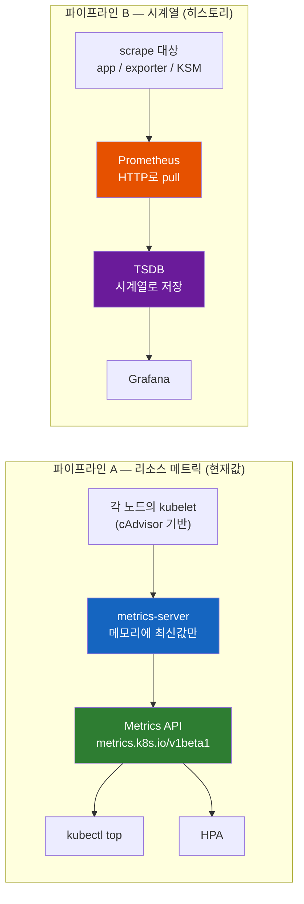
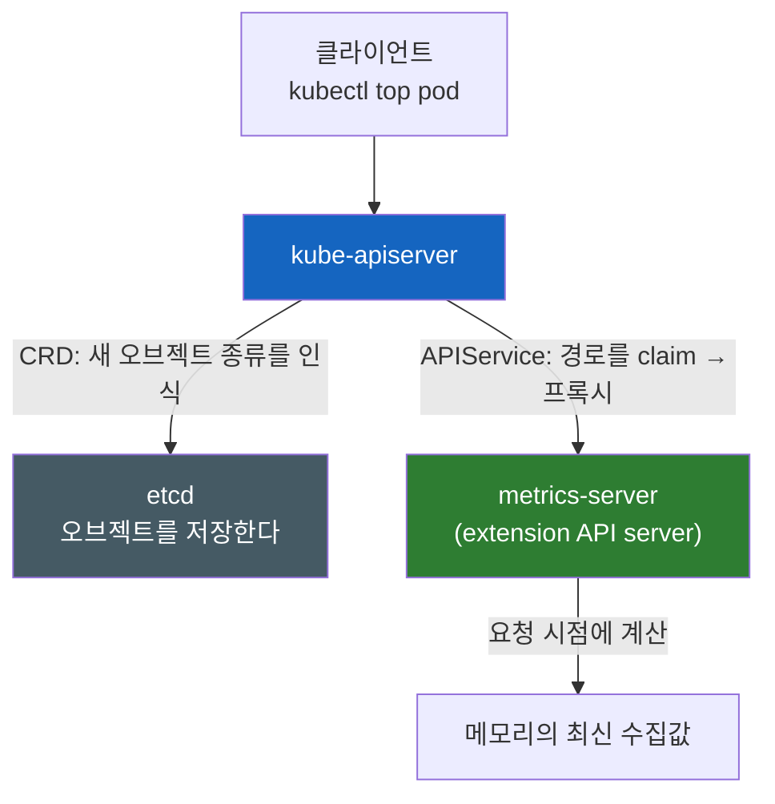
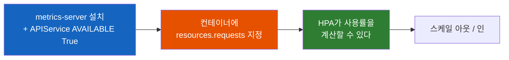
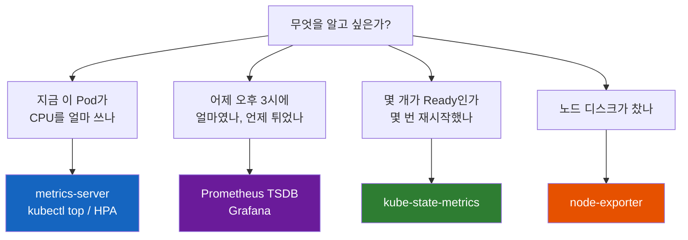

# kubectl top의 숫자는 어디서 오는가 — metrics-server와 Prometheus의 역할 분담

`kubectl top pod`은 `Metrics API not available`을 뱉는데, 같은 클러스터의 Grafana 대시보드에는 그 Pod의 CPU 그래프가 멀쩡히 그려진다. 대시보드가 데이터를 갖고 있는데 `kubectl top`은 왜 못 가져올까? 둘은 같은 데이터를 보고 있는 게 아닐까?

## 결론부터 말하면

**`kubectl top`의 숫자는 각 노드의 kubelet이 재고, metrics-server가 그걸 긁어 모아 `metrics.k8s.io` API로 내놓은 값이다.** 그리고 **Grafana의 그래프는 그 파이프라인을 전혀 거치지 않는다.** Prometheus가 대상들의 HTTP 엔드포인트를 따로 긁어 자기 시계열 데이터베이스에 쌓은, **완전히 별개의 두 번째 파이프라인** 이다.

그래서 둘은 같은 데이터가 아니다. 하나가 죽어도 다른 하나는 멀쩡히 산다. 도입부의 모순은 버그가 아니라 **정상적인 아키텍처의 결과** 다.



| 구분 | 파이프라인 A (Metrics API) | 파이프라인 B (Prometheus) |
|------|---------------------------|---------------------------|
| 수집 주체 | **metrics-server** | **Prometheus** |
| 데이터 출처 | kubelet의 자원 사용량 엔드포인트 | 대상들의 `/metrics` HTTP 엔드포인트 |
| 저장 | **메모리, 최신값만** | **디스크의 시계열 DB(TSDB)** |
| 히스토리 | **없다** | 있다 (보존 기간 설정 가능) |
| 노출 경로 | 쿠버네티스 API(`metrics.k8s.io`) | Prometheus 자체 HTTP API(PromQL) |
| 주 소비자 | `kubectl top`, **HPA**, VPA | Grafana, Alertmanager |
| 목적 | **오토스케일링과 즉석 확인** | 관측(observability), 경보, 사후 분석 |

## 1. 파이프라인 A — 누가 CPU를 세고 있는가

Pod 안의 프로세스가 CPU를 몇 밀리코어 쓰는지, 메모리를 몇 바이트 쓰는지는 결국 **리눅스 커널의 cgroup** 이 알고 있다. 컨테이너는 cgroup으로 자원이 격리되어 있으니, cgroup의 통계 파일을 읽으면 그 컨테이너가 얼마를 쓰는지 나온다.

이 cgroup 통계를 읽어 컨테이너 단위로 정리해 주는 컴포넌트가 **cAdvisor(Container Advisor)** 다. cAdvisor는 원래 별도 프로젝트였지만 kubelet에 통합되어 있어서, 별도로 설치할 것이 없다. 그래서 **모든 노드의 kubelet은 이미 자원 사용량을 알고 있고, HTTP 엔드포인트로 노출하고 있다.** metrics-server를 설치하지 않은 클러스터에서도 그렇다.

여기서 첫 번째 직관이 생긴다. "kubelet이 이미 알고 있다면, `kubectl top`은 그냥 kubelet에게 물어보면 되는 거 아닌가?" 문제는 kubelet이 **노드마다 하나씩** 있다는 점이다. 노드가 200개면 엔드포인트도 200개다. `kubectl top pod` 한 번에 200번 요청을 보내고 결과를 합칠 수는 없다. 누군가 **미리 모아 두는 역할** 을 해야 한다.

그 역할이 **metrics-server** 다. metrics-server는 클러스터에 Deployment로 하나 떠서, 모든 노드의 kubelet API를 주기적으로 호출해 자원 사용량을 긁어 온다. 공식 문서는 metrics-server가 부르는 엔드포인트까지 명시한다 — v0.6.0 이상은 kubelet의 `/metrics/resource`, 그 이전 버전은 Summary API인 `/stats/summary`다.

수집 주기는 `--metric-resolution` 플래그로 정하는데, 여기서 **공식 자료끼리 표현이 갈리므로 정확히 짚어 둘 필요가 있다.** metrics-server FAQ는 "Default 60 seconds, can be changed using `metric-resolution` flag"라고 못 박고, "15s 미만은 권장하지 않는다 — 그것이 kubelet이 계산하는 메트릭의 해상도이기 때문"이라고 이유까지 붙인다. 반면 같은 저장소의 README는 "Fast autoscaling, collecting metrics every 15 seconds"라고 적어 두었다. 실무에서 이 차이가 문제되는 이유는 명확하다 — **플래그의 기본값은 60초지만, 많은 배포 차트와 매니지드 쿠버네티스가 `--metric-resolution=15s`를 명시적으로 넣어 배포한다.** 그러니 "우리 클러스터의 `kubectl top`은 몇 초마다 갱신되나"는 기억으로 답할 문제가 아니라, metrics-server Deployment의 인자를 직접 확인할 문제다.

### 1-1. 히스토리가 없다 — 이건 결함이 아니라 설계다

metrics-server의 가장 중요한 성질은 여기다. **모아 온 값을 메모리에만 두고, 최신값만 유지한다.** kube-state-metrics 공식 문서가 metrics-server를 설명하며 쓴 문장이 이 성질을 가장 정확하게 표현한다.

> The metrics-server stores the latest values only and is not responsible for forwarding metrics to third-party destinations.

그래서 `kubectl top pod`으로는 "지금 얼마 쓰는가"만 알 수 있다. "어제 오후 3시에 얼마였나"는 물어볼 수 있는 API 자체가 없다. Metrics API 응답에 딸려오는 `window` 필드(공식 문서 예시는 `"30s"`)가 그 값이 커버하는 구간의 전부다. metrics-server Pod를 재시작하면 그동안의 값은 전부 사라지고, 다음 수집 주기까지 `kubectl top`은 아무것도 내놓지 못한다.

왜 이렇게 설계했을까? metrics-server 공식 문서가 스스로 답한다.

> Metrics Server is meant only for autoscaling purposes. For example, don't use it to forward metrics to monitoring solutions, or as a source of monitoring solution metrics.

그리고 "쓰지 말아야 할 경우" 목록에 **"An accurate source of resource usage metrics"** 를 직접 올려 둔다. 정확한 자원 사용량의 원천으로 쓰지 말라는 뜻이다. 오토스케일링과 `kubectl top`에 필요한 것은 "지금 목표치보다 위인가 아래인가"라는 판단 하나뿐이고, 그 판단에 히스토리는 필요 없다. 시계열을 저장하고 질의하는 일은 완전히 다른 문제이고, **그건 다른 도구의 일** 이라고 선을 그은 것이다. 코어에 최소한만 담고 나머지는 위임하는 이 태도는 [쿠버네티스가 GPU를 자원으로 통역하는 방식](쿠버네티스는-GPU를-모른다-nvidia-device-plugin은-어떻게-GPU를-자원으로-통역하는가.md)에서 본 것과 같은 철학이다.

## 2. metrics-server는 CRD가 아니다 — Aggregated API Server

이제 확장 개념의 핵심으로 들어간다. `kubectl top`을 실행하면 어떤 일이 일어날까? 겉보기에는 그냥 쿠버네티스 API를 부르는 것처럼 보인다. 실제로 `kubectl get --raw "/apis/metrics.k8s.io/v1beta1/nodes"`가 동작한다. `/apis/apps/v1/deployments`를 부르는 것과 형태가 완전히 같다.

그런데 metrics-server가 갖고 있는 값은 etcd 어디에도 없다. 그러면 API 서버는 이 요청을 어떻게 처리하는 걸까?

답은 **Aggregation Layer(집계 계층)** 다. 쿠버네티스에는 "이 URL 경로는 내가 아니라 저 서비스가 담당한다"고 등록하는 장치가 있고, 그 등록에 쓰는 오브젝트가 **`APIService`** 다. 공식 문서의 설명이 정확하다.

> To register an API, you add an APIService object, which "claims" the URL path in the Kubernetes API. At that point, the aggregation layer will proxy anything sent to that API path to the registered APIService.

즉 metrics-server는 자기 몫의 `APIService`를 만들어 `/apis/metrics.k8s.io/...` 경로를 **선점(claim)** 한다. 이후 kube-apiserver는 그 경로로 들어온 요청을 **직접 처리하지 않고 metrics-server로 프록시** 한다. 그래서 `kubectl top`은 코어 API를 부르는 것처럼 보이지만, 실제 응답은 kube-apiserver 뒤에 숨은 별도의 서버가 만들어 낸다. 이런 서버를 **extension API server** 라 부르고, metrics-server가 그 대표 사례다. 실제로 Metrics API 문서는 이 조건을 요구사항으로 명시한다 — "You must enable the API aggregation layer and register an APIService for the `metrics.k8s.io` API."

### 2-1. CRD와 무엇이 다른가

쿠버네티스를 확장하는 방법으로 훨씬 널리 알려진 것은 **CRD(CustomResourceDefinition)** 다. 그래서 metrics-server도 CRD로 되어 있으리라 짐작하기 쉽다. 하지만 둘은 근본적으로 다른 장치이고, 공식 문서도 이 둘을 명시적으로 구분한다 — "The aggregation layer is different from Custom Resource Definitions, which are a way to make the kube-apiserver **recognise new kinds of object**."



차이를 한 줄로 줄이면 **저장이냐 프록시냐** 다. CRD는 새로운 오브젝트 종류의 스키마를 등록하고, 그 오브젝트는 다른 코어 오브젝트처럼 kube-apiserver를 통해 **etcd에 저장** 된다. 반면 Aggregated API는 스키마를 등록하는 게 아니라 **요청을 다른 서버로 넘긴다.** 응답 본문은 그 서버가 만든다.

그리고 이 선택은 필연적이다. 메트릭은 **저장 대상이 아니라 계산 대상** 이기 때문이다. 노드 200개에서 초 단위로 갱신되는 사용량을 etcd에 쓴다고 생각해 보자. etcd는 클러스터의 모든 상태가 지나가는 합의 기반 저장소인데, 거기에 초당 수천 건의 쓰기를 쏟아붓는 셈이다. 게다가 그렇게 저장한 값은 다음 수집 주기에 곧바로 쓸모없어진다. 저장할 이유가 전혀 없는 데이터를 저장 계층에 밀어넣는 구조이므로, CRD는 애초에 부적합하다. CRD가 잘 맞는 쪽 — 사용자가 선언하고 컨트롤러가 그 선언을 향해 수렴시키는 오브젝트 — 은 [CRD와 컨트롤러, 그리고 Operator](쿠버네티스는-어떻게-자기-자신을-확장할까-CRD와-컨트롤러-그리고-Operator.md) 노트가 다룬다.

### 2-2. 그래서 `Metrics API not available`의 정확한 의미

여기까지 오면 도입부의 에러 메시지가 완전히 다르게 읽힌다.

```
$ kubectl top pod
error: Metrics API not available
```

이건 **"메트릭 값이 없다"는 말이 아니다.** kubelet은 여전히 사용량을 알고 있고, Prometheus는 그걸 잘 긁고 있다. 이 에러가 말하는 것은 **`/apis/metrics.k8s.io/...` 경로를 담당할 서버가 등록되지 않았거나, 등록은 됐지만 kube-apiserver가 그 서버에 도달할 수 없다** 는 뜻이다. 프록시 대상이 없거나 죽었다는 얘기다.

그래서 진단은 값이 아니라 **경로의 주인** 부터 확인해야 한다.

```bash
# 이 경로를 담당하는 APIService가 등록되어 있는가, 그리고 살아 있는가
$ kubectl get apiservice v1beta1.metrics.k8s.io
NAME                     SERVICE                      AVAILABLE   AGE
v1beta1.metrics.k8s.io   kube-system/metrics-server   True        42d
```

읽는 법은 이렇다. **아예 `NotFound`** 면 metrics-server가 설치되지 않았거나 `APIService`가 없다 — 경로에 주인이 없다. **`AVAILABLE`이 `False`** 면 등록은 됐는데 프록시가 실패하는 것이고, 같은 줄의 이유(`FailedDiscoveryCheck` 등)가 다음 단서다. 이때 실제 원인은 metrics-server Pod가 죽어 있거나, kube-apiserver에서 metrics-server 서비스로 가는 경로가 NetworkPolicy·보안 그룹에 막혔거나, TLS 검증에 실패한 경우다. 즉 **"메트릭 수집"의 문제가 아니라 "API 경로 프록시"의 문제** 다. 이 구분을 알면 엉뚱한 곳을 파는 시간을 아낀다.

## 3. 파이프라인 B — Prometheus는 왜 히스토리를 갖는가

이제 대시보드 쪽을 보자. Prometheus의 동작 방식은 metrics-server와 방향부터 다르다. 공식 문서의 표현대로 **"time series collection happens via a pull model over HTTP"** — 대상이 데이터를 보내오는 게 아니라, Prometheus가 주기적으로 대상의 HTTP 엔드포인트(관례적으로 `/metrics`)를 **긁어 온다(scrape).** 그리고 **"It stores all scraped samples locally"** — 긁어 온 표본을 전부 로컬에 저장한다. 이 저장소가 **TSDB(time series database)**, 즉 "언제, 무엇이, 얼마였다"를 시각과 함께 쌓는 데이터베이스다.

차이는 여기서 결정된다. metrics-server는 최신값으로 이전 값을 덮어쓰고, Prometheus는 값마다 시각을 붙여 누적한다. **그래서 "어제 오후 3시에 얼마였나"에 답할 수 있는 쪽은 Prometheus뿐이다.** Grafana가 그리는 그래프는 결국 이 TSDB에 대한 질의 결과다.

그런데 pull 모델에는 전제가 하나 있다. **대상이 Prometheus 형식의 `/metrics` 엔드포인트를 갖고 있어야 한다.** 세상의 모든 것이 그렇지는 않다. 리눅스 커널은 `/metrics`를 노출하지 않고, 오래된 미들웨어도, 노드의 디스크 사용량도 그렇다. 이 간극을 메우는 것이 **exporter** 다. exporter는 **스스로 지표를 노출하지 않는 대상을 대신 읽어서 Prometheus 형식으로 번역해 주는 어댑터** 다. 대표적인 `node-exporter`는 리눅스 커널이 노출하는 하드웨어·OS 지표를 읽어 `/metrics`로 내놓는다.

### 3-1. ServiceMonitor — 설정 파일을 건드리지 않고 대상을 등록하는 법

pull 모델의 두 번째 전제는 **Prometheus가 무엇을 긁어야 할지 알아야 한다** 는 것이다. 전통적인 방법은 Prometheus의 설정 파일(`prometheus.yml`)에 scrape 대상을 적고 재시작하는 것이다. 여기서 조직적인 문제가 생긴다. 새 서비스를 배포한 앱 팀이 자기 서비스를 모니터링에 넣으려면, **모니터링 팀이 소유한 설정 파일을 고쳐야 한다.** 팀이 열 개면 그 파일은 열 개 팀의 병목이 되고, 릴리스마다 티켓이 오간다.

**Prometheus Operator** 는 이 문제를 쿠버네티스답게 풀었다. `ServiceMonitor`와 `PodMonitor`라는 커스텀 리소스가 있고, 공식 문서 표현대로 이들은 "describe the targets to be monitored by Prometheus" — 즉 **긁을 대상을 선언** 한다. 그 선언의 방식이 핵심이다. 대상을 주소로 적는 게 아니라 **라벨 셀렉터로 적는다.** Operator 문서는 이 점을 "Automatically generate monitoring target configurations based on familiar Kubernetes label queries"라고 요약하며, Prometheus 재라벨링 규칙을 직접 배워 쓰는 대신 "you can simply use Kubernetes Label Selectors"라고 말한다.

```yaml
apiVersion: monitoring.coreos.com/v1
kind: ServiceMonitor
metadata:
  name: my-app
  namespace: my-app
  labels:
    release: kube-prometheus-stack   # Prometheus의 serviceMonitorSelector에 걸리는 라벨
spec:
  selector:
    matchLabels:
      app: my-app                    # "이 라벨을 가진 Service를 긁어라"
  endpoints:
  - port: metrics                    # Service에 정의된 포트 이름
    interval: 30s
```

Prometheus 오브젝트 쪽에는 `spec.serviceMonitorSelector`가 있어서, 어떤 `ServiceMonitor`를 자기 것으로 받아들일지 정한다. 오퍼레이터는 그 조건에 맞는 `ServiceMonitor`를 감시하다가 Prometheus 설정을 생성해 반영한다. 앱 팀은 자기 네임스페이스에 `ServiceMonitor` 하나를 배포하면 끝이고, **모니터링 팀의 설정 파일은 아무도 건드리지 않는다.** 설정 변경이 티켓이 아니라 배포가 되는 것 — 이게 이 패턴의 조직적 가치이고, Operator 패턴의 가장 흔한 실사용례다. 오퍼레이터가 선언을 감시해 실제 상태를 맞춰 가는 메커니즘 자체는 [CRD와 컨트롤러, 그리고 Operator](쿠버네티스는-어떻게-자기-자신을-확장할까-CRD와-컨트롤러-그리고-Operator.md) 노트가 다룬다.

## 4. 가장 흔한 혼동 — kube-state-metrics는 metrics-server가 아니다

이름이 비슷해서 생기는 오해 중 가장 값비싼 것이 이것이다. `kube-state-metrics`(줄여서 KSM)를 깔았으니 `kubectl top`이 될 것이라 기대하거나, 반대로 metrics-server가 있으니 "Deployment가 몇 개 Ready인지"를 Prometheus에서 볼 수 있으리라 기대하는 것이다. **둘 다 틀렸다.** 이름은 닮았지만 **읽는 대상과 만드는 지표가 완전히 다르다.**

kube-state-metrics 공식 문서가 스스로를 이렇게 정의한다.

> kube-state-metrics is focused on generating completely new metrics from Kubernetes' object state (e.g. metrics based on deployments, replica sets, etc.). It holds an entire snapshot of Kubernetes state in memory and continuously generates new metrics based off of it.

핵심은 **object state** 다. KSM은 kubelet을 보지 않는다. **API 서버를 보고, 오브젝트의 상태를 읽어 지표로 바꾼다.** 그리고 같은 문서가 자기 관심사의 경계까지 그어 둔다 — "It is not focused on the health of the individual Kubernetes components, but rather on the health of the various objects inside, such as deployments, nodes and pods." 즉 **자원 사용량은 전혀 다루지 않는다.** KSM은 어떤 Pod가 CPU를 몇 밀리코어 쓰는지 모르고, 알려고도 하지 않는다.

| 컴포넌트 | 무엇을 읽는가 | 무엇을 내놓는가 | 소비 경로 |
|----------|--------------|----------------|-----------|
| **metrics-server** | 각 노드의 **kubelet** | 컨테이너·Pod·노드의 **자원 사용량**<br>(CPU 밀리코어, 메모리 바이트) | 쿠버네티스 API<br>(`metrics.k8s.io`) |
| **kube-state-metrics** | **kube-apiserver** | 오브젝트의 **상태**<br>(desired/ready replicas, Pod phase,<br>컨테이너 재시작 횟수, Deployment condition) | 자체 `/metrics`<br>→ Prometheus가 scrape |
| **node-exporter** | 노드의 **커널·OS**<br>(`/proc`, `/sys`) | 노드 **OS 수준 지표**<br>(디스크, 네트워크, 파일디스크립터, load) | 자체 `/metrics`<br>→ Prometheus가 scrape |

여기서 한 가지 더 짚을 것이 있다. **KSM과 node-exporter는 자기가 만든 지표를 아무 데도 보내지 않는다.** KSM 공식 문서의 표현대로 "it too is not responsible for exporting its metrics anywhere" — 그냥 `/metrics`에 걸어 두고, 누군가 긁어 가기를 기다린다. 그래서 이 둘은 **파이프라인 A가 아니라 파이프라인 B의 부품** 이다. Prometheus 없이 KSM만 깔면, 지표를 보관하고 질의할 곳이 없다.

## 5. HPA는 Metrics API의 소비자다

이제 실무에서 가장 값진 인과관계로 간다. **`kubectl top`과 HPA는 같은 우물에서 물을 먹는다.** 둘 다 Metrics API를 읽는다. 그래서 앞 장의 진단이 곧바로 이어진다 — **`kubectl top`이 안 되는 클러스터에서는 CPU 기반 HPA도 동작하지 않는다.** Grafana 대시보드가 멀쩡한 것은 아무 위안이 되지 않는다. HPA는 그쪽을 보지 않기 때문이다.

그리고 HPA가 그 값을 쓰는 방식에 결정적인 함정이 있다. **HPA는 절대 사용량으로 판단하지 않는다.** 공식 문서를 그대로 인용한다.

> the controller calculates the utilization value as a percentage of the equivalent **resource request** on the containers in each Pod

즉 목표가 `averageUtilization: 70`이라면, 그 70%는 **노드 용량의 70%도, 컨테이너 limits의 70%도 아니라 `resources.requests`의 70%** 다. 계산식으로 쓰면 이렇다.

$$
\text{utilization} = \frac{\text{현재 사용량}}{\text{resources.requests}} \times 100
$$

분모가 `requests`다. 그래서 **`requests`를 적지 않으면 분모가 없다.** 공식 문서는 그 결과까지 못 박는다.

> if some of the Pod's containers do not have the relevant resource request set, CPU utilization for the Pod will not be defined and **the autoscaler will not take any action for that metric**

이 문장이 실무에서 가장 자주 부딪히는 함정의 정체다. HPA 오브젝트는 잘 만들어져 있고, `kubectl get hpa`도 에러 없이 나오는데 `TARGETS` 칸이 `<unknown>`이고 아무리 부하를 걸어도 스케일이 되지 않는다. Pod가 CPU를 안 쓰고 있어서가 아니라, **사용률을 계산할 근거가 없어서 HPA가 아예 판단을 포기한 것** 이다. 이건 HPA 설정을 아무리 들여다봐도 안 보이고, Deployment의 컨테이너 스펙을 봐야 보인다. `requests`와 `limits`의 의미는 [Kubernetes Pod](Kubernetes-Pod.md) 노트가 다룬다.

그래서 CPU 기반 오토스케일링에는 **거스를 수 없는 순서** 가 있다.



1단계가 없으면 지표 자체가 없고, 2단계가 없으면 지표는 있어도 사용률이 정의되지 않는다. **HPA는 이 두 단계가 끝난 뒤에야 의미를 갖는다.** HPA 오브젝트의 YAML 작성, `behavior` 튜닝, 롤링 업데이트 중 지표 왜곡 같은 운영 주의사항은 [Kubernetes ReplicaSet과 Deployment](Kubernetes-ReplicaSet-Deployment.md) 노트의 10.1절이 다루므로 여기서는 다시 쓰지 않는다.

참고로 HPA 컨트롤러는 연속 프로세스가 아니라 주기적으로 도는 제어 루프다. 공식 문서 기준 이 간격은 `kube-controller-manager`의 `--horizontal-pod-autoscaler-sync-period`로 정하고 **기본값은 15초** 다. 그래서 부하를 걸자마자 즉시 Pod가 늘지 않는 것은 정상이다.

### 5-1. CPU가 아닌 지표로 스케일하려면

큐 길이나 초당 요청 수처럼 CPU·메모리가 아닌 지표로 스케일하고 싶을 때가 있다. 이때 필요한 것이 **custom metrics API(`custom.metrics.k8s.io`)** 와 **external metrics API(`external.metrics.k8s.io`)** 다. 전자는 Pod·노드 같은 쿠버네티스 오브젝트에 딸린 지표, 후자는 오브젝트와 무관한 외부 지표(원격 큐의 메시지 수 등)를 위한 것이다. 공식 문서는 HPA의 지표 출처를 이렇게 정리한다.

> The common use for HorizontalPodAutoscaler is to configure it to fetch metrics from aggregated APIs (`metrics.k8s.io`, `custom.metrics.k8s.io`, or `external.metrics.k8s.io`).

여기서 2장의 이야기가 되돌아온다. 세 개 모두 **aggregated API** 다. 즉 이 API들도 마법으로 생기는 게 아니라, **누군가 그 경로를 담당할 extension API server를 등록해야 한다.** Prometheus를 지표 원천으로 쓸 때 그 역할을 하는 것이 **prometheus-adapter** 이고, 그 공식 walkthrough가 요구하는 절차가 정확히 이것이다 — "We also need to register the custom metrics API with the API aggregator... for that we need to create an APIService resource."

그래서 두 파이프라인은 여기서 처음으로 만난다. **어댑터를 하나 더 등록해, Prometheus의 시계열을 Metrics API 형태로 번역해 HPA에게 먹이는 것** 이다. 파이프라인이 합쳐진 게 아니라, 번역기를 끼운 것이다. 진단 방법도 똑같다 — `kubectl get apiservice v1beta1.custom.metrics.k8s.io`의 `AVAILABLE`을 본다.

## 6. 왜 `kubectl top`과 대시보드의 숫자가 다를까

두 파이프라인을 다 갖춘 클러스터에서 흔히 겪는 일이다. `kubectl top pod`은 CPU `250m`이라 하고, Grafana는 같은 시각에 `180m`이라 한다. 어느 쪽이 틀렸을까?

**둘 다 맞다. 질문이 다르다.** 세 가지 층에서 차이가 생긴다.

**첫째, 수집 주기가 다르다.** metrics-server의 `--metric-resolution`과 Prometheus의 `scrape_interval`은 서로 무관하게 설정된다. 같은 순간을 본 값이 아니므로, 순간적으로 튀는 워크로드에서는 당연히 갈린다.

**둘째, 평균 구간이 다르다.** 여기서 흔한 오해를 하나 깨야 한다. "`kubectl top`은 순간값이고 Prometheus는 평균값"이 아니다. **양쪽 모두 rate(비율)** 다. CPU 사용량이라는 것 자체가 커널이 제공하는 **누적 카운터** 에서 나오므로, 어떤 도구든 두 시점의 차이를 시간으로 나눠야 "초당 몇 코어"가 된다. metrics-server FAQ의 표현대로 그 값은 "derived by taking a rate over a cumulative CPU counter provided by the kernel"이다. 차이는 rate를 계산하는 **구간의 길이** 다. Metrics API 응답의 `window` 필드가 그 구간을 알려 주고(공식 문서 예시는 `30s`), Grafana 대시보드는 보통 `rate(...[5m])`처럼 훨씬 긴 구간을 쓴다. **구간이 길수록 뾰족한 스파이크가 평활화되어 낮게 보인다.** 그래서 짧은 폭주에서는 `kubectl top`이 더 높게, 안정 상태에서는 두 값이 비슷하게 나온다.

**셋째, 메모리는 "무엇을 메모리 사용량이라 부를 것인가"부터 다르다.** 이게 가장 헷갈리는 지점이다. cgroup은 여러 숫자를 갖고 있고, 지표 이름마다 그중 무엇을 쓰는지가 다르다.

| 값 | 대략적인 정의 | 성격 |
|-----|--------------|------|
| `container_memory_rss` | 파일과 매핑되지 않은 익명 메모리 | 앱이 직접 할당한 메모리에 가장 가깝다 |
| `container_memory_usage_bytes` | RSS + 페이지 캐시 + 커널 메모리 | **파일 캐시까지 포함해 항상 가장 크다** |
| `container_memory_working_set_bytes` | usage에서 **회수 가능한 비활성 파일 캐시를 뺀 값** | `kubectl top`이 보여주는 값 |

`kubectl top`이 보여주는 것은 **working set** 이다. 공식 문서가 이 정의를 직접 밝힌다 — "Memory is reported as the working set, measured in bytes, at the instant the metric was collected." 그리고 그 의도까지 설명한다 — "In an ideal world, the 'working set' is the amount of memory in-use that **cannot be freed under memory pressure**."

여기서 **OOM 판정과의 관계** 를 정확히 말해야 한다. 흔히 "OOM killer가 working set을 본다"고 단정하지만, 그 표현은 엄밀하지 않다. 실제 순서는 이렇다. 메모리 한도는 **커널이 cgroup 자체의 회계를 기준으로 집행** 하고, 공식 문서 표현대로 "`memory` limits are enforced by the kernel with out of memory (OOM) kills"이며 "terminations only happen when the kernel detects memory pressure. Thus... memory limits are enforced **reactively**." 압박이 오면 커널은 먼저 **회수 가능한 것을 회수** 하려 하고, 그걸로 부족할 때 컨테이너를 죽인다.

그래서 실무적 결론은 이렇게 정리된다. **회수 가능한 캐시를 이미 제외한 working set이 OOM 위험에 가장 가까운 숫자이므로, 한도와 비교해서 봐야 할 값은 working set이다.** `usage_bytes`는 언제든 버려질 파일 캐시를 포함하므로 위험을 과장한다. 다만 공식 문서 스스로 경고하듯 working set 계산은 **"generally makes heavy use of heuristics to produce an estimate"** 이고 **"typically also includes some cached (file-backed) memory"** 다. 그러니 "working set이 한도에 닿으면 곧 죽는다"는 등식으로 외우지 말고, **한도 대비 working set을 위험 신호로 보고, 실제 종료 여부는 `kubectl describe pod`의 `OOMKilled`와 종료 코드 137로 확인** 하는 게 옳다.

## 7. 정리

### 무엇을 알고 싶은가에서 시작하라



| 알고 싶은 것 | 봐야 할 곳 | 왜 |
|--------------|-----------|-----|
| **"지금 얼마 쓰는가"** | **metrics-server** (`kubectl top`) | kubelet에서 긁은 최신 사용량을 Metrics API로 노출 |
| **"언제 튀었는가"** | **Prometheus** (Grafana) | 시각과 함께 TSDB에 누적하므로 과거 질의 가능 |
| **"몇 개가 Ready인가"** | **kube-state-metrics** | API 서버의 오브젝트 상태를 지표로 변환 |
| **"노드 디스크가 찼는가"** | **node-exporter** | 노드 커널·OS 수준 지표를 노출 |

### 핵심 포인트

1. **`kubectl top`과 Grafana는 같은 데이터를 보지 않는다**
   - `kubectl top`은 `kubelet → metrics-server → metrics.k8s.io`, Grafana는 `대상 → Prometheus → TSDB`. 두 파이프라인은 독립적이라 한쪽이 죽어도 다른 쪽은 산다. 도입부의 모순은 정상 동작이다.

2. **metrics-server는 CRD가 아니라 Aggregated API Server다**
   - `APIService`로 `/apis/metrics.k8s.io/...` 경로를 선점하면, kube-apiserver가 그 경로의 요청을 metrics-server로 **프록시** 한다. CRD는 오브젝트를 etcd에 **저장** 하지만, 메트릭은 저장 대상이 아니라 요청 시점의 계산 대상이다.

3. **`Metrics API not available`은 값이 없다는 뜻이 아니다**
   - 그 경로를 담당할 서버가 없거나 도달 불가라는 뜻이다. 진단은 `kubectl get apiservice v1beta1.metrics.k8s.io`의 `AVAILABLE`부터 — `NotFound`면 미설치, `False`면 프록시 실패다.

4. **kube-state-metrics는 사용량을 전혀 다루지 않는다**
   - metrics-server는 kubelet에서 **자원 사용량** 을, KSM은 API 서버에서 **오브젝트 상태** 를, node-exporter는 커널에서 **OS 지표** 를 가져온다. 이름이 닮았을 뿐 읽는 대상이 다르다.

5. **HPA는 절대 사용량이 아니라 `requests` 대비 사용률로 판단한다**
   - 그래서 `resources.requests`가 없는 컨테이너는 사용률이 정의되지 않아 HPA가 **아예 아무 조치도 하지 않는다.** 순서는 metrics-server 설치 → `requests` 지정 → HPA. CPU 밖의 지표로 스케일하려면 어댑터를 **또 하나의 aggregated API로 등록** 해야 한다.

6. **두 숫자가 다른 건 하나가 틀린 게 아니라 질문이 다른 것이다**
   - 수집 주기, rate 계산 구간(`window: 30s` vs `rate(...[5m])`), 메모리 지표의 정의(working set vs RSS vs usage)가 모두 다르다. 한도와 비교할 값은 회수 가능한 캐시를 제외한 **working set** 이다.

---

## 출처

- [Resource metrics pipeline | Kubernetes](https://kubernetes.io/docs/tasks/debug/debug-cluster/resource-metrics-pipeline/) - 공식 문서. `metrics.k8s.io/v1beta1`, APIService 등록 요구사항, kubelet `/metrics/resource`, working set 정의, `window` 필드
- [Horizontal Pod Autoscaling | Kubernetes](https://kubernetes.io/docs/tasks/run-application/horizontal-pod-autoscale/) - 공식 문서. `requests` 대비 사용률 계산, requests 없을 때 동작 안 함, sync period 기본 15초, aggregated API 목록
- [Kubernetes API Aggregation Layer | Kubernetes](https://kubernetes.io/docs/concepts/extend-kubernetes/api-extension/apiserver-aggregation/) - 공식 문서. `APIService`가 URL 경로를 claim하고 프록시하는 구조, CRD와의 차이
- [Resource Management for Pods and Containers | Kubernetes](https://kubernetes.io/docs/concepts/configuration/manage-resources-containers/) - 공식 문서. 메모리 한도가 커널 OOM kill로 reactive하게 집행된다는 설명
- [kubernetes-sigs/metrics-server](https://github.com/kubernetes-sigs/metrics-server) - 공식 저장소. "meant only for autoscaling purposes", 쓰지 말아야 할 경우 목록
- [metrics-server FAQ](https://github.com/kubernetes-sigs/metrics-server/blob/master/FAQ.md) - 공식 FAQ. `metric-resolution` 기본 60초와 15초 권장 하한, CPU가 누적 카운터의 rate라는 설명
- [kubernetes/kube-state-metrics](https://github.com/kubernetes/kube-state-metrics) - 공식 저장소. "kube-state-metrics vs. metrics-server" 비교, "stores the latest values only"
- [Prometheus Overview](https://prometheus.io/docs/introduction/overview/) - 공식 문서. pull over HTTP, 로컬 저장
- [prometheus/node_exporter](https://github.com/prometheus/node_exporter) - 공식 저장소. 하드웨어·OS 지표 exporter
- [Prometheus Operator — Introduction](https://prometheus-operator.dev/docs/getting-started/introduction/) - 공식 문서. 라벨 쿼리 기반 대상 설정 자동 생성, `ServiceMonitor`/`PodMonitor`
- [Prometheus Operator — Getting Started (Developer)](https://prometheus-operator.dev/docs/developer/getting-started/) - 공식 문서. `ServiceMonitor`/`PodMonitor`의 정의와 `serviceMonitorSelector`
- [prometheus-adapter walkthrough](https://github.com/kubernetes-sigs/prometheus-adapter/blob/master/docs/walkthrough.md) - 공식 저장소. custom metrics API를 API aggregator에 `APIService`로 등록하는 절차
- [Memory Working Set vs RSS](https://www.groundcover.com/learn/performance/memory-working-set-vs-rss) - working set = usage − inactive_file 유도 과정
