# rollout restart를 했는데 왜 예전 코드가 그대로 돌까 — 이미지 태그와 다이제스트

CI가 빌드를 끝내고 같은 태그(`my-app:1.0`)로 레지스트리에 새 이미지를 푸시했다. 나는 `kubectl rollout restart deployment/my-app`을 실행했다. Pod는 실제로 전부 새로 떴다 — `kubectl get pods`의 AGE가 `10s`다. 그런데 접속해 보면 동작은 예전 코드 그대로다.

더 이상한 건 그다음이다. replica 세 개 중 **하나만** 새 코드로 도는 경우도 있다. 그래서 요청을 열 번 보내면 세 번쯤은 새 동작, 일곱 번은 옛 동작이 섞여 나온다. Pod는 분명히 전부 새로 만들어졌는데, 왜 코드가 안 바뀌는가? 그리고 왜 하필 일부만 바뀌는가?

이 글은 그 두 질문에 답한다. 답의 핵심에는 **태그가 무엇인지에 대한 오해** 하나가 있다.

---

## 결론부터 말하면

**Pod를 새로 만드는 것과 이미지를 새로 받는 것은 완전히 별개의 사건이다.** `rollout restart`는 앞의 것만 한다. 그리고 이미지를 새로 받을지 말지는 `imagePullPolicy`가 결정하는데, `my-app:1.0`처럼 `:latest`가 아닌 태그를 쓰면 그 기본값이 **`IfNotPresent`** 다 — "노드에 그 태그의 이미지가 이미 있으면 레지스트리에 묻지 말고 그걸 써라"는 뜻이다.

여기에 두 번째 사실이 겹친다. **이미지 캐시는 Deployment가 아니라 노드에 있다.** 그러니 같은 태그를 덮어써 푸시했을 때, 그 태그를 이미 캐시한 노드의 Pod는 옛 이미지를, 처음 보는 노드의 Pod는 새 이미지를 쓴다. **한 Deployment 안에서 버전이 섞이는** 것이다.

```mermaid
flowchart TB
    reg["Registry<br>my-app:1&#46;0 태그를<br>새 이미지로 덮어씀"]
    reg -.->|"태그 포인터만 이동"| note["예전 이미지도<br>여전히 존재한다"]

    restart["kubectl rollout restart<br>→ Pod 전부 새로 생성"]

    restart --> nA["Node A<br>my-app:1&#46;0 캐시 있음"]
    restart --> nB["Node B<br>my-app:1&#46;0 캐시 없음"]

    nA -->|"IfNotPresent<br>→ 레지스트리에 묻지 않음"| oldp["Pod: 예전 코드"]
    nB -->|"이미지 없음<br>→ 레지스트리에서 pull"| newp["Pod: 새 코드"]

    oldp --> mix["같은 Deployment,<br>섞인 버전"]
    newp --> mix

    style reg fill:#1565C0,color:#fff
    style restart fill:#455A64,color:#fff
    style oldp fill:#C62828,color:#fff
    style newp fill:#2E7D32,color:#fff
    style mix fill:#E65100,color:#fff
```



| 내가 기대한 것 | 실제로 일어난 것 |
|----------------|------------------|
| `rollout restart` = "새 이미지로 갈아라" | Pod 템플릿에 재시작 시각 annotation을 찍어 **Pod만** 새로 만든다 |
| 태그 `1.0` = 그 이미지의 고유 이름 | 태그는 **언제든 다른 이미지로 옮길 수 있는 가변 포인터** 다 |
| 캐시는 Deployment 단위 | 캐시는 **노드 단위** — 그래서 replica마다 결과가 다르다 |
| 이미지를 안 받으면 에러라도 나겠지 | `IfNotPresent`는 정상 동작이다. **경고도, 이벤트도 없다** |

그래서 이 문제의 진짜 무서운 점은 실패하지 않는다는 것이다. 모든 컴포넌트가 각자 자기 일을 정확히 했고, 아무도 에러를 내지 않았다. 하나씩 뜯어보자.

---

## 1. 첫 번째 오해 — 태그는 이름이 아니라 포인터다

우리는 보통 `my-app:1.0`을 "1.0 버전 이미지의 이름"으로 읽는다. 파일명처럼, 혹은 Git 태그처럼 특정한 무언가를 영구히 가리키는 고유 식별자로 느껴진다. 이 감각이 모든 혼란의 출발점이다.

레지스트리에서 태그는 그런 것이 아니다. 태그는 **레지스트리 안의 어떤 이미지를 가리키는 가변 참조** 다. `docker push my-app:1.0`을 다시 실행하면, 레지스트리는 "이미 있는데요"라고 거절하지 않는다. 그냥 태그가 가리키는 대상을 새 이미지로 **옮긴다.** 예전 이미지는 사라지지 않고 그 자리에 남아 있다 — 다만 이름을 잃었을 뿐이다.

그렇다면 이미지 자체를 가리키는 진짜 고유 이름은 무엇인가. **digest** 다. 쿠버네티스 공식 문서는 이 대비를 한 문장으로 정리한다.

> Digests are hashes of the image's content, and are immutable. Tags can be moved to point to different images, but digests are fixed.
> (digest는 이미지 콘텐츠의 해시이며 불변이다. 태그는 다른 이미지를 가리키도록 옮길 수 있지만, digest는 고정되어 있다.)

digest는 `sha256:1ff6c18f...` 형태이고, 이미지 내용의 해시이므로 내용이 1바이트라도 바뀌면 값이 바뀐다. 즉 **같은 digest = 정확히 같은 바이트** 라는 보장이 성립한다. 태그에는 그런 보장이 없다.

```mermaid
flowchart LR
    subgraph tagside["태그: 가변 포인터"]
        t["my-app:1&#46;0"]
        i1["Image X<br>sha256:aaa&#8230;<br>(어제 빌드)"]
        i2["Image Y<br>sha256:bbb&#8230;<br>(오늘 빌드)"]
        t -.->|"어제는 여기"| i1
        t -->|"지금은 여기"| i2
    end

    subgraph digestside["digest: 불변 지문"]
        d["my-app@sha256:aaa&#8230;"]
        d ==>|"영원히 여기"| i1b["Image X<br>내용이 바뀌면<br>digest도 바뀐다"]
    end

    style t fill:#E65100,color:#fff
    style d fill:#2E7D32,color:#fff
    style i1 fill:#455A64,color:#fff
    style i2 fill:#1565C0,color:#fff
    style i1b fill:#455A64,color:#fff
```



이 구분이 이 글 전체의 토대다. 앞으로 나올 모든 현상은 결국 **우리가 매니페스트에 적은 것(가변 태그)과 실제로 실행된 것(불변 이미지) 사이의 간극** 에서 나온다.

---

## 2. 두 번째 오해 — `rollout restart`는 "이미지를 새로 받아라"가 아니다

태그의 정체를 알았으니 다음 의문으로 간다. 그래도 `rollout restart`를 했으면 이미지를 다시 받아야 하지 않나? "restart"라는 단어가 주는 인상은 "처음부터 다시"이니 말이다.

이 명령이 실제로 하는 일은 훨씬 소박하다. **Pod 템플릿의 annotation 하나를 갱신하는 것** 이다. 쿠버네티스 공식 문서(Well-Known Labels, Annotations and Taints)가 그 키를 명시한다.

> `kubectl.kubernetes.io/restartedAt` — This annotation contains the latest restart time of a resource... The command `kubectl rollout restart <RESOURCE>` triggers a restart by patching the template metadata of all the pods of resource with this annotation.

즉 이런 패치가 나간다.

```yaml
# kubectl rollout restart deployment/my-app 이 실제로 보내는 것
spec:
  template:
    metadata:
      annotations:
        kubectl.kubernetes.io/restartedAt: "2026-07-28T09:12:41Z"   # ← 이 한 줄이 전부
```

여기서부터는 평범한 Deployment 동작이다. Pod 템플릿(`.spec.template`)이 바뀌었으므로 Deployment 컨트롤러는 새 리비전으로 취급하고, 새 ReplicaSet을 만들어 롤링 교체를 진행한다. (Pod 템플릿 변경이 리비전을 올린다는 것은 `deployment.kubernetes.io/revision` annotation의 공식 설명에도 명시되어 있다. 롤링 교체·롤백·`rollout` 명령군 자체는 [Kubernetes ReplicaSet & Deployment](Kubernetes-ReplicaSet-Deployment.md)에서 다룬다.)

이 메커니즘이 얼마나 순수하게 "템플릿 diff"인지 보여주는 문장이 같은 공식 문서에 있다.

> If you manually set this annotation on a Pod, nothing happens. The restarting side effect comes from how workload management and Pod templating works.
> (이 annotation을 Pod에 직접 달아도 아무 일도 일어나지 않는다. 재시작이라는 부수효과는 워크로드 관리와 Pod 템플릿 동작 방식에서 나온다.)

annotation 자체에 힘이 있는 게 아니다. **템플릿이 달라졌다는 사실** 에 힘이 있다. 그러니 정리하면 이렇다 — `rollout restart`는 **"Pod를 새로 만들어라"** 는 지시이고, **"이미지를 다시 내려받아라"** 는 지시는 이 명령 어디에도 없다. 새로 만들어진 Pod가 이미지를 어디서 가져올지는 전혀 다른 필드가 결정한다.

---

## 3. 진짜 원인 — `imagePullPolicy`의 기본값 규칙

그 필드가 `imagePullPolicy`다. 값은 세 가지이고, 의미는 공식 문서 기준으로 이렇다.

| 값 | 동작 |
|----|------|
| `Always` | 컨테이너를 띄울 때마다 kubelet이 런타임에 pull을 요청한다. 런타임이 레지스트리에 접속해 태그를 digest로 해석하고, **캐시에 없는 레이어만** 내려받는다 |
| `IfNotPresent` | 이미지가 **로컬에 없을 때만** pull한다 |
| `Never` | pull을 시도하지 않는다. 로컬에 있으면 쓰고, 없으면 기동 실패(`ErrImageNeverPull`) |

문제는 대부분의 매니페스트가 이 필드를 **아예 적지 않는다** 는 것이다. 그러면 쿠버네티스가 알아서 채워 넣는데, 그 규칙이 정확히 이 글의 범인이다. 공식 문서의 네 가지 규칙을 그대로 옮긴다.

- `imagePullPolicy`를 생략하고 **digest를 지정** 하면 → `IfNotPresent`
- `imagePullPolicy`를 생략하고 태그가 **`:latest`** 이면 → `Always`
- `imagePullPolicy`를 생략하고 **태그를 아예 안 쓰면** → `Always`
- `imagePullPolicy`를 생략하고 **`:latest`가 아닌 태그** 를 쓰면 → **`IfNotPresent`**

```mermaid
flowchart TD
    q0{"imagePullPolicy를<br>명시했는가?"}
    q0 -->|"예"| explicit["적은 값 그대로"]
    q0 -->|"아니오"| q1{"image에 무엇을<br>적었는가?"}

    q1 -->|"digest<br>(my-app@sha256:&#8230;)"| ifnp1["IfNotPresent<br>(digest는 불변이라 안전)"]
    q1 -->|"태그 없음<br>(my-app)"| alw1["Always"]
    q1 -->|":latest"| alw2["Always"]
    q1 -->|"그 외 태그<br>(my-app:1&#46;0)"| ifnp2["IfNotPresent<br>← 우리가 걸린 곳"]

    style q0 fill:#455A64,color:#fff
    style q1 fill:#E65100,color:#fff
    style ifnp2 fill:#C62828,color:#fff
    style ifnp1 fill:#2E7D32,color:#fff
    style alw1 fill:#1565C0,color:#fff
    style alw2 fill:#1565C0,color:#fff
```



네 번째 규칙이 우리 상황이다. `my-app:1.0`은 `:latest`가 아닌 명시적 태그이므로 정책은 `IfNotPresent`가 된다. 그리고 `IfNotPresent`의 판단 기준은 **"노드에 그 태그의 이미지가 있는가"** 뿐이다. 레지스트리에 더 새로운 이미지가 있는지는 **묻지 않는다.** 물을 이유가 없다 — kubelet은 태그가 불변이라고 믿을 만한 근거를 갖고 있지 않지만, `IfNotPresent`라는 정책은 정확히 "이미 있으면 됐다"고 지시하기 때문이다.

그래서 같은 태그를 덮어써 푸시하는 순간, 그 태그를 이미 캐시한 노드는 **새 이미지가 존재한다는 사실을 알 방법이 없다.** 실패도 경고도 없다. 정책대로 동작한 것이다.

### 3.1 "그럼 `:latest`를 쓰면 되잖아"가 나쁜 해법인 이유

규칙을 보면 자연스러운 반응이 나온다. `:latest`는 기본값이 `Always`니까, 태그를 `:latest`로 바꾸면 되지 않나?

증상은 사라진다. 그러나 더 비싼 문제를 산다. `:latest`는 **어느 시점에 무엇이 떴는지를 사후에 알 수 없게 만드는 태그** 다. 어제 오후에 장애가 났을 때 돌던 코드가 무엇이었는지 물으면 답이 없다. `:latest`는 그때도 `:latest`였고 지금도 `:latest`이기 때문이다. 그래서 롤백할 대상도 지목할 수 없고("`:latest`로 되돌려라"는 무의미하다), 장애를 재현할 수도 없다. 공식 문서가 프로덕션에서 `:latest`를 피하라고 못 박는 이유가 정확히 이것이다.

> You should avoid using the `:latest` tag when deploying containers in production as it is harder to track which version of the image is running and more difficult to roll back properly.

여기에 한 가지 함정이 더 붙는다. 정책 기본값은 **오브젝트를 처음 만들 때 한 번만** 결정된다. 공식 문서의 경고를 보자.

> The value of `imagePullPolicy` of the container is always set when the object is first created, and is not updated if the image's tag or digest later changes. For example, if you create a Deployment with an image whose tag is not `:latest`, and later update that Deployment's image to a `:latest` tag, the `imagePullPolicy` field will not change to `Always`.

즉 `my-app:1.0`으로 만들어 둔 Deployment의 이미지만 `my-app:latest`로 고쳐도, `imagePullPolicy`는 여전히 `IfNotPresent`에 머문다. `:latest`로 바꿨는데도 증상이 그대로인 이유가 이것이다. 정책을 바꾸고 싶으면 **필드를 직접 명시** 해야 한다.

---

## 4. replica마다 결과가 다른 이유 — 캐시는 노드 단위다

이제 두 번째 질문, "왜 하필 하나만 바뀌었나"로 간다.

핵심은 이미지 캐시가 어디에 있는지다. 캐시는 Deployment에도, 네임스페이스에도, 클러스터에도 없다. **각 노드의 컨테이너 런타임 안에** 있다. `IfNotPresent`의 "Present"는 **"이 Pod가 스케줄된 그 노드에 있는가"** 라는 뜻이다.

그러면 방금의 상황이 정확히 설명된다. `rollout restart`로 새 Pod 세 개가 만들어지고 스케줄러가 이들을 노드에 흩뿌린다. 그중 두 개는 예전 배포 때 `my-app:1.0`을 이미 받아둔 노드로 갔고, 하나는 그 태그를 처음 보는 노드로 갔다. 앞의 두 개는 캐시를 쓰고, 뒤의 하나는 레지스트리에서 새 이미지를 받는다. **세 replica가 서로 다른 코드를 실행한다.**

쿠버네티스 공식 문서는 이 결과를 직접 서술한다.

> When using image tags, if the image registry were to change the code that the tag on that image represents, you might end up with a mix of Pods running the old and new code.
> (태그를 쓸 때, 레지스트리에서 그 태그가 가리키는 코드가 바뀌면 예전 코드와 새 코드를 실행하는 Pod가 섞이는 상황에 이를 수 있다.)

이것이 가장 진단하기 어려운 형태다. 증상이 **요청마다 달라지기** 때문이다. Service가 요청을 세 Pod에 분산하므로, 같은 API를 다섯 번 호출하면 두세 번은 새 동작, 나머지는 옛 동작이 나온다. 이 상태에서 흔히 벌어지는 일들을 보자.

한 Pod의 로그만 보고 "새 코드 맞네, 정상"이라고 결론 낸다. 다른 Pod의 로그를 봤으면 반대 결론이 났을 것이다. 재현하려고 요청을 다시 보내면 이번엔 잘 된다. 그래서 "간헐적 이슈"로 분류되고, 네트워크나 캐시나 DB 커넥션 같은 엉뚱한 방향으로 조사가 흘러간다. 실제로 다른 것은 **코드 그 자체** 인데, 어느 계층에서도 그 가정을 의심하지 않는다.

여기에 노드 상태 변화가 겹치면 상황은 더 나빠진다. 오토스케일링으로 노드가 새로 붙거나 갈려 나갈 때마다 "캐시 있는 노드"의 집합이 바뀌므로, **아무 배포도 하지 않았는데 며칠 뒤 갑자기 동작 비율이 달라진다.** 배포 로그에는 아무 흔적도 남지 않는다.

---

## 5. 세 가지 해법 — 그리고 각각의 대가

원인이 "가변 태그 + 노드 단위 캐시"라면, 해법은 셋 중 하나다. 태그를 불변으로 만들거나, digest로 고정하거나, 매번 확인하게 하거나.

### 5.1 해법 1 — 배포가 참조하는 태그를 불변으로 운영한다 (가장 권장)

가장 좋은 해법은 `imagePullPolicy`를 건드리는 게 아니라 **애초에 태그를 덮어쓰지 않는 것** 이다. 빌드마다 새 태그를 만든다. 커밋 SHA, 빌드 번호, 타임스탬프 — 무엇이든 재사용되지 않으면 된다.

```yaml
# Bad: 태그를 덮어써 푸시 → 노드 캐시가 옛 이미지를 붙잡는다
image: my-app:1.0

# Good: 빌드마다 유일한 태그 → 캐시가 있을 수 없다
image: my-app:1.0-a1b2c3d       # 1.0 + 커밋 SHA
```

이 방식의 우아한 점은 `IfNotPresent`가 **문제가 아니라 최적의 정책이 된다** 는 것이다. 태그가 새로우니 어느 노드에도 캐시가 있을 수 없어 반드시 새로 받는다. 그리고 한 번 받은 뒤에는 그 태그의 내용이 절대 바뀌지 않으니, 캐시를 쓰는 것이 언제나 정답이다. 불필요한 레지스트리 왕복도 없다.

여기에 레지스트리 차원의 **immutable tag** 설정을 함께 켜면 규율이 아니라 구조가 된다. Harbor 같은 사내 레지스트리는 프로젝트별로 태그 덮어쓰기를 금지할 수 있고, 이러면 실수로 같은 태그를 푸시하는 CI 잡이 아예 실패한다. (사내 레지스트리를 두는 이유 전반은 [Harbor — 왜 회사들은 사내 컨테이너 레지스트리를 두는가](Harbor-왜-회사들은-사내-컨테이너-레지스트리를-두는가.md)에서 다룬다.)

한 가지 오해를 미리 막자. **`1.0`, `stable`, `prod` 같은 사람용 태그를 쓰지 말라는 게 아니다.** 사람이 "지금 프로덕션 버전"을 가리키려면 그런 이름이 필요하다. 규칙은 이렇게 좁혀야 한다 — **배포 매니페스트가 참조하는 태그는 불변이어야 한다.** 사람용 별칭 태그는 문서와 대화에서 쓰고, 클러스터에 적용되는 YAML에는 유일한 태그(또는 digest)만 들어간다.

### 5.2 해법 2 — digest로 고정한다

재현성을 최대로 끌어올리는 방법은 digest를 직접 적는 것이다.

```yaml
# 태그 대신 digest — 어느 클러스터에서든 정확히 같은 바이트가 뜬다
image: my-app@sha256:45b23dee08af5e43a7fea6c4cf9c25ccf269ee113168c19722f87876677c5cb2
```

공식 문서가 이 효과를 정확히 설명한다. digest를 지정하면 **레지스트리 쪽의 변경이 버전 혼재를 유발할 수 없다.** 태그가 어디로 옮겨 다니든 상관이 없기 때문이다.

> An image digest uniquely identifies a specific version of the image, so Kubernetes runs the same code every time it starts a container with that image name and digest specified. Specifying an image by digest pins the code that you run so that a change at the registry cannot lead to that mix of versions.

실무에서 이 값은 손으로 적는 게 아니다. **CI가 푸시 직후 digest를 회수해 매니페스트에 기록** 한다. `docker push`나 `docker buildx build --push`의 출력에는 푸시된 digest가 찍히고, `docker buildx imagetools inspect my-app:1.0` 같은 명령으로도 조회할 수 있다. 그 값을 Helm values나 Kustomize 이미지 필드에 넣어 커밋하는 것이 표준 흐름이다.

단점도 정직하게 짚자. 첫째, **사람이 읽을 수 없다.** `sha256:45b23d...`만 보고 그게 어떤 릴리스인지 알 수 있는 사람은 없다. 그래서 태그와 digest를 함께 적는 형태(`image: my-app:1.0@sha256:...`)를 쓰기도 하는데, 이때 **pull에 쓰이는 것은 digest뿐** 이고 태그는 사람을 위한 주석 역할만 한다. 둘째, **갱신 자동화가 없으면 관리가 고통스럽다.** 릴리스마다 64자 해시를 바꿔 넣어야 하니, CI나 이미지 업데이트 자동화(Argo CD Image Updater, Renovate 등) 없이는 오래 못 간다. 이 손 작업을 아예 없애는 방향으로, Pod 생성 시점에 태그를 digest로 치환해 주는 서드파티 admission controller를 쓰는 선택지도 있다 — 공식 문서도 그런 컨트롤러의 존재를 언급한다. (요청을 가로채 오브젝트를 고쳐 쓰는 그 메커니즘 자체는 [내가 만들지 않은 컨테이너가 왜 Pod에 들어와 있을까 — Admission Webhook](내가-만들지-않은-컨테이너가-왜-Pod에-들어와-있을까-Admission-Webhook.md)이 다룬다.)

> digest를 기반으로 **이미지에 서명하고 공급망을 검증** 하는 이야기 — Cosign, Notation, 그리고 Kyverno로 검증되지 않은 이미지를 막는 정책 — 는 [Helm과 Harbor를 왜 같이 써야 하는가](Helm과-Harbor를-왜-같이-써야-하는가.md)가 다룬다. 이 글은 "무엇이 떴는지 확정할 수 있는가"까지만 책임진다.

### 5.3 해법 3 — `imagePullPolicy: Always`, 그리고 왜 만능이 아닌가

세 번째는 정책을 직접 바꾸는 것이다.

```yaml
containers:
- name: my-app
  image: my-app:1.0
  imagePullPolicy: Always   # 컨테이너를 띄울 때마다 레지스트리에 확인
```

효과는 확실하다. 컨테이너를 띄울 때마다 런타임이 레지스트리에 접속해 태그를 digest로 해석하므로, 태그가 옮겨졌다면 반드시 알아챈다. 새 이미지를 놓치지 않는다.

먼저 흔한 오해를 하나 정리하자. **`Always`가 매번 이미지를 전부 다시 내려받는다는 뜻은 아니다.** 공식 문서의 서술대로, 런타임은 태그를 digest로 해석한 뒤 **캐시에 없는 레이어만** 받는다. digest가 이전과 같다면 다운로드는 사실상 없다. 매번 일어나는 것은 **확인** 이지 전송이 아니다.

> The caching semantics of the container runtime make even `imagePullPolicy: Always` efficient, as long as the registry is reliably accessible.

그런데 저 마지막 조건절이 `Always`의 대가를 그대로 드러낸다 — **"레지스트리에 안정적으로 접근할 수 있는 한"** 이다. `Always`는 확인에 실패하면 컨테이너를 띄우지 못한다. 노드에 이미지가 멀쩡히 캐시돼 있어도, 레지스트리가 죽었거나 네트워크가 끊겼거나 인증이 만료됐으면 Pod는 기동하지 못하고 `ImagePullBackOff`에 갇힌다. 즉 **`Always`는 서비스 가용성을 레지스트리 가용성에 종속시키는 선택** 이다. 노드 장애로 Pod가 재스케줄되는 그 순간이 하필 레지스트리 점검 시간과 겹치면, 복구되어야 할 워크로드가 복구되지 않는다.

공용 레지스트리를 쓴다면 대가가 하나 더 붙는다. **rate limit** 이다. 확인 요청이 Pod 재시작 횟수만큼 늘어나므로, 규모가 커지면 pull 제한에 먼저 부딪힌다. (이 문제의 정공법인 프록시 캐시와 사내 레지스트리는 [Harbor — 왜 회사들은 사내 컨테이너 레지스트리를 두는가](Harbor-왜-회사들은-사내-컨테이너-레지스트리를-두는가.md)에서 다룬다.)

pull이 실패했을 때 보이는 상태 두 개는 같은 사건의 다른 단계다.

| 상태 | 의미 |
|------|------|
| `ErrImagePull` | pull 시도가 **방금 실패했다** 는 신호. 이벤트 메시지에 registry가 돌려준 실제 원인(not found, unauthorized, rate limit 등)이 들어 있다 |
| `ImagePullBackOff` | 실패 후 **재시도를 백오프하며 기다리는 대기 상태.** 재시도 간격이 점점 늘어나 최대 300초(5분)까지 벌어진다 |

`ErrImagePull` 쪽이 원인을 담고 있으니 디버깅은 항상 그 이벤트 메시지부터 읽는다. 그리고 가장 흔한 원인이 **`imagePullSecrets` 누락** 이다. 사설 레지스트리를 쓰면서 Pod(정확히는 ServiceAccount 또는 Pod spec)에 pull 자격 증명을 붙이지 않으면, 증상은 "이미지 이름을 틀린 것"과 구분되지 않는다. 둘 다 인증 없는 클라이언트에게는 "그런 이미지 없음"으로 보이기 때문이다. 공식 문서도 `ImagePullBackOff`의 원인으로 잘못된 이미지 이름과 `imagePullSecret` 없는 사설 레지스트리 접근을 나란히 든다.

한편 클러스터 전체에 이 정책을 강제하는 장치도 있다. 쿠버네티스에 내장된 **`AlwaysPullImages` admission controller** 는 모든 Pod의 `imagePullPolicy`를 `Always`로 덮어쓴다. 멀티테넌트 클러스터에서 자주 켜는데, 위에서 본 가용성 대가를 클러스터 전체가 지게 되므로 켜기 전에 사내 레지스트리와 그 가용성부터 갖추는 게 순서다.

> **최근 변화 하나 — 다만 이 문제의 해법은 아니다.** `KubeletEnsureSecretPulledImages` 기능(feature gate)은 노드에 **이미 캐시된 사설 이미지** 를 쓸 때도 Pod의 자격 증명을 검증하게 만든다. 예전에는 같은 노드의 다른 Pod가 먼저 받아둔 사설 이미지를 자격 증명 없이도 쓸 수 있었고, 이를 막는 우회책으로 `imagePullPolicy: Always`가 쓰였다. 이 기능은 v1.33에서 알파로 등장해 **v1.35에서 베타(기본 활성)** 가 되었고, kubelet 설정의 `imagePullCredentialsVerificationPolicy` 필드(`NeverVerify`, `NeverVerifyPreloadedImages`, `NeverVerifyAllowListedImages`, `AlwaysVerify`)로 시점을 조절한다. 다만 방향을 정확히 읽어야 한다 — 이것은 **"이 Pod가 이 캐시 이미지를 쓸 권한이 있는가"(인가)** 를 검증하는 기능이고, **"이 캐시 이미지가 최신인가"(신선도)** 를 검증하는 기능이 아니다. 그러니 이 글의 문제는 이 기능으로 해결되지 않는다.

---

## 6. 반대 방향의 같은 함정 — ConfigMap을 바꿨는데 Pod가 안 바뀐다

여기까지 이해했다면 완전히 다른 증상 하나가 갑자기 같은 이야기로 읽힌다. ConfigMap의 값을 고치고 `kubectl apply`를 했는데, Pod는 아무 반응도 없다.

원리가 똑같다. **Pod 템플릿이 변하지 않으면 Deployment는 아무것도 교체할 이유가 없다.** ConfigMap은 Deployment와 별개의 오브젝트다. 그것만 고쳐도 Deployment의 `.spec.template`은 한 글자도 달라지지 않았고, 컨트롤러가 보는 desired state는 그대로다. 2장에서 본 것의 거울상이다 — 그쪽은 "템플릿이 바뀌었으니 Pod를 새로 만든다"였고, 이쪽은 "템플릿이 안 바뀌었으니 Pod를 그대로 둔다"다. 같은 규칙이다.

그래서 관용적으로 쓰는 패턴이 있다. **설정 내용의 해시를 Pod 템플릿의 annotation에 넣어, 설정이 바뀌면 템플릿도 의도적으로 바뀌게 만드는 것** 이다. 컨트롤러가 감시하는 유일한 신호가 템플릿 diff이므로, 그 신호를 인공적으로 만들어 주는 셈이다. 2장의 `restartedAt`이 시각으로 diff를 만들었다면, 이쪽은 설정 해시로 diff를 만든다.

ConfigMap/Secret의 갱신 반영 동작, 이 해시 annotation의 구체적 작성법, Reloader로 자동화하는 방법, `immutable` 필드와 `subPath` 마운트의 자동 갱신 불가 문제는 모두 [Kubernetes ConfigMap & Secret](Kubernetes-ConfigMap-Secret.md)이 다룬다. 이 글에서 가져갈 것은 하나다 — **Deployment가 반응하는 유일한 신호는 Pod 템플릿의 변화** 이며, 이미지 문제와 설정 문제는 그 한 문장의 두 얼굴이다.

---

## 7. 지금 실제로 무엇이 돌고 있는지 확인하는 법

이제 실용 파트다. "새 코드가 떴는가"를 추측이 아니라 증거로 확인해야 한다.

진단의 핵심은 **Pod spec과 Pod status를 구분하는 것** 이다.

| 필드 | 무엇인가 |
|------|----------|
| `spec.containers[].image` | **내가 적은 문자열.** 태그일 뿐이고, 어떤 이미지가 떴는지는 알려주지 않는다 |
| `status.containerStatuses[].imageID` | **런타임이 보고한, 실제로 실행 중인 이미지의 식별자.** 내용에서 파생된 해시값이다 |

공식 API 레퍼런스는 `imageID`를 이렇게 설명한다 — "ImageID is the image ID of the container's image. The image ID may not match the image ID of the image used in the PodSpec, as it may have been resolved by the runtime." 요점은 **spec의 값과 다를 수 있다** 는 것이고, 바로 그 차이가 우리가 찾는 정보다.

그래서 replica들의 `imageID`를 나란히 세워 보는 것이 이 문제의 결정적 진단이다.

```bash
# replica별로 "적은 것"과 "실제 뜬 것"을 나란히 출력
kubectl get pods -l app=my-app \
  -o custom-columns='POD:.metadata.name,NODE:.spec.nodeName,IMAGE:.spec.containers[*].image,IMAGE_ID:.status.containerStatuses[*].imageID'

# 출력 예시 — image는 셋 다 같은데 imageID가 갈린다
# POD           NODE     IMAGE         IMAGE_ID
# my-app-x1     node-a   my-app:1.0    ...@sha256:aaa...   ← 예전 이미지
# my-app-x2     node-a   my-app:1.0    ...@sha256:aaa...   ← 예전 이미지
# my-app-x3     node-b   my-app:1.0    ...@sha256:bbb...   ← 새 이미지
```

`IMAGE` 열이 전부 같은데 `IMAGE_ID` 열이 갈린다면 진단은 끝났다. **버전이 섞였다.** 그리고 `NODE` 열이 왜 갈렸는지까지 알려준다.

> **주의 — `imageID`를 그대로 매니페스트에 복사하지 마라.** `imageID`가 내용에서 파생된 값이라는 점은 확실하지만, **어떤** 해시인지는 컨테이너 런타임 구현에 따라 다르다. 어떤 환경에서는 `repo@sha256:...` 형태의 레지스트리 manifest digest가, 어떤 환경에서는 이미지 config의 ID(`sha256:...`)가 들어온다(쿠버네티스 이슈 #115199에 이 불일치가 보고돼 있다). 그래서 **replica 간 비교** 에는 항상 쓸 수 있지만, 여기서 얻은 값을 `image: my-app@sha256:...`에 붙여 넣으면 맞지 않을 수 있다. 5.2의 digest는 레지스트리에서(푸시 출력이나 `imagetools inspect`) 얻어야 한다.

두 번째 증거는 이벤트다. `kubectl describe pod`의 Events 섹션은 kubelet이 pull을 실제로 했는지 캐시를 썼는지를 구분해 남긴다. 실무에서 보이는 형태는 이렇다.

```
# 캐시를 쓴 경우 — Pulling 이벤트 없이 Pulled 하나만, 메시지가 다르다
Normal  Pulled   30s   kubelet   Container image "my-app:1.0" already present on machine

# 실제로 받은 경우 — Pulling → Pulled 두 단계
Normal  Pulling  30s   kubelet   Pulling image "my-app:1.0"
Normal  Pulled   27s   kubelet   Successfully pulled image "my-app:1.0" in 2.9s
```

`Pulled`라는 reason만 보고 "받았구나"로 읽으면 안 된다. **메시지를 읽어야** 실제 pull과 캐시 사용이 갈린다. `already present on machine`이 보이면 그 Pod는 레지스트리를 한 번도 쳐다보지 않았다.

세 번째는 노드의 캐시 목록이다. 노드 상태에는 그 노드에 있는 이미지 목록이 담긴다 — Node API의 `status.images` 필드이고, 공식 설명은 "List of container images on this node"다.

```bash
# 특정 노드가 캐시하고 있는 이미지 목록에서 my-app만 추리기
kubectl get node node-a -o json | jq -r '.status.images[].names[]' | grep my-app
```

단, 이 목록에는 **상한** 이 있다. kubelet 설정의 `nodeStatusMaxImages`가 기본값 **50** 이어서, 노드에 이미지가 많으면 보고되는 목록이 잘린다. 그러니 **목록에 없다는 것이 캐시가 없다는 증거는 아니다.** 있으면 강한 증거, 없으면 무증거로 읽어야 한다. 확실한 증거는 언제나 Pod의 `imageID`와 이벤트 쪽에 있다.

---

## 8. 정리

### 핵심 포인트

1. **태그는 포인터, digest는 지문**
   - 레지스트리에서 태그는 언제든 다른 이미지로 옮길 수 있는 **가변 참조** 다. digest는 이미지 콘텐츠의 해시이므로 내용이 바뀌면 값이 바뀌는 **불변 식별자** 다. `my-app:1.0`은 "그 이미지"가 아니라 "지금 그 이름이 가리키는 것"이다.

2. **Pod를 새로 만드는 것 ≠ 이미지를 새로 받는 것**
   - `rollout restart`는 Pod 템플릿에 `kubectl.kubernetes.io/restartedAt` annotation을 찍어 템플릿 diff를 만드는 명령이다. Pod는 새로 뜨지만 이미지를 다시 받으라는 지시는 어디에도 없다. 그 결정은 `imagePullPolicy`가 한다.

3. **`:latest`가 아닌 태그의 기본값은 `IfNotPresent`이고, 캐시는 노드 단위다**
   - `imagePullPolicy`를 생략하면 `:latest`·태그 없음은 `Always`, digest와 그 외 태그는 `IfNotPresent`가 된다. `IfNotPresent`는 **그 Pod가 뜬 노드에** 이미지가 있으면 레지스트리에 묻지 않는다. 그래서 같은 태그를 덮어쓰면 노드별로 결과가 갈리고, **한 Deployment 안에서 버전이 섞인다.** 에러도 경고도 없다.

4. **해법의 순서: 불변 태그 → digest 고정 → `Always`**
   - 빌드마다 새 태그(커밋 SHA 등)를 쓰면 `IfNotPresent`가 오히려 최적이 된다. 재현성이 최우선이면 digest로 못 박는다. `Always`는 확실하지만 **가용성을 레지스트리에 종속시키는** 대가를 치른다.

5. **진단은 spec이 아니라 status를 본다**
   - `spec.containers[].image`는 내가 적은 태그이고, `status.containerStatuses[].imageID`가 실제로 도는 이미지다. replica별 `imageID`를 나열해 갈렸는지 보고, 이벤트에서 `already present on machine`과 `Successfully pulled`를 구분해 읽는다.

마지막으로 한 문장. 배포의 재현성이란 **"무엇을 배포했는지 사후에 증명할 수 있는가"** 이고, 가변 태그는 그 증명을 원천적으로 불가능하게 만든다. `my-app:1.0`이 떴다는 기록은 어떤 코드가 떴는지에 대해 아무것도 말해 주지 않는다. 태그를 불변으로 만들거나 digest를 남기는 일은 편의가 아니라, **장애 대응에서 첫 질문에 답할 수 있게 하는 최소 조건** 이다.

> 관련 문서: [Kubernetes ReplicaSet & Deployment](Kubernetes-ReplicaSet-Deployment.md) — 롤링 업데이트·롤백·`rollout` 명령군 · [Kubernetes ConfigMap & Secret](Kubernetes-ConfigMap-Secret.md) — 설정 갱신 반영과 Reloader · [Helm과 Harbor를 왜 같이 써야 하는가](Helm과-Harbor를-왜-같이-써야-하는가.md) — digest 기반 서명과 공급망 보안 · [Harbor — 왜 회사들은 사내 컨테이너 레지스트리를 두는가](Harbor-왜-회사들은-사내-컨테이너-레지스트리를-두는가.md) — 사내 레지스트리와 rate limit

---

## 출처

- [Images | Kubernetes](https://kubernetes.io/docs/concepts/containers/images/) — 공식 문서. 태그 vs digest 불변성, `imagePullPolicy` 기본값 4규칙, 정책은 오브젝트 생성 시 확정, `Always`의 레이어 캐시 동작, `:latest` 회피 권고, digest 고정 효과, `ImagePullBackOff`(최대 300초), `AlwaysPullImages`, `KubeletEnsureSecretPulledImages`(v1.35 beta)와 `imagePullCredentialsVerificationPolicy`
- [Well-Known Labels, Annotations and Taints | Kubernetes](https://kubernetes.io/docs/reference/labels-annotations-taints/) — `kubectl.kubernetes.io/restartedAt`의 동작, `deployment.kubernetes.io/revision`과 Pod 템플릿 변경
- [Pod API Reference (ContainerStatus) | Kubernetes](https://kubernetes.io/docs/reference/kubernetes-api/workload-resources/pod-v1/) — `imageID` 필드 정의
- [Node API Reference (NodeStatus.images) | Kubernetes](https://kubernetes.io/docs/reference/kubernetes-api/cluster-resources/node-v1/) — 노드의 이미지 목록
- [Kubelet Configuration (v1beta1) | Kubernetes](https://kubernetes.io/docs/reference/config-api/kubelet-config.v1beta1/) — `nodeStatusMaxImages` 기본값 50, `imagePullCredentialsVerificationPolicy`
- [Feature Gates | Kubernetes](https://kubernetes.io/docs/reference/command-line-tools-reference/feature-gates/) — `KubeletEnsureSecretPulledImages` 단계(Alpha v1.33 → Beta v1.35)
- [Kubernetes v1.33: Image Pull Policy the way you always thought it worked](https://kubernetes.io/blog/2025/05/12/kubernetes-v1-33-ensure-secret-pulled-images-alpha/) — 캐시된 사설 이미지의 자격 증명 검증 문제와 배경
- [kubernetes/kubernetes#115199 — ContainerStatus imageID is inconsistent / badly documented](https://github.com/kubernetes/kubernetes/issues/115199) — `imageID` 형식이 CRI 구현에 따라 다르다는 보고
