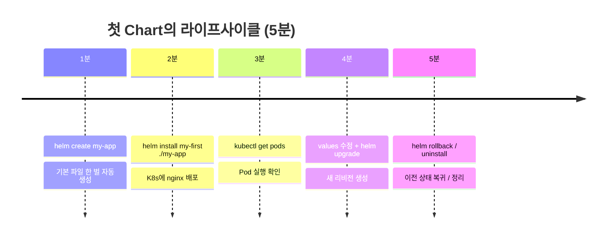
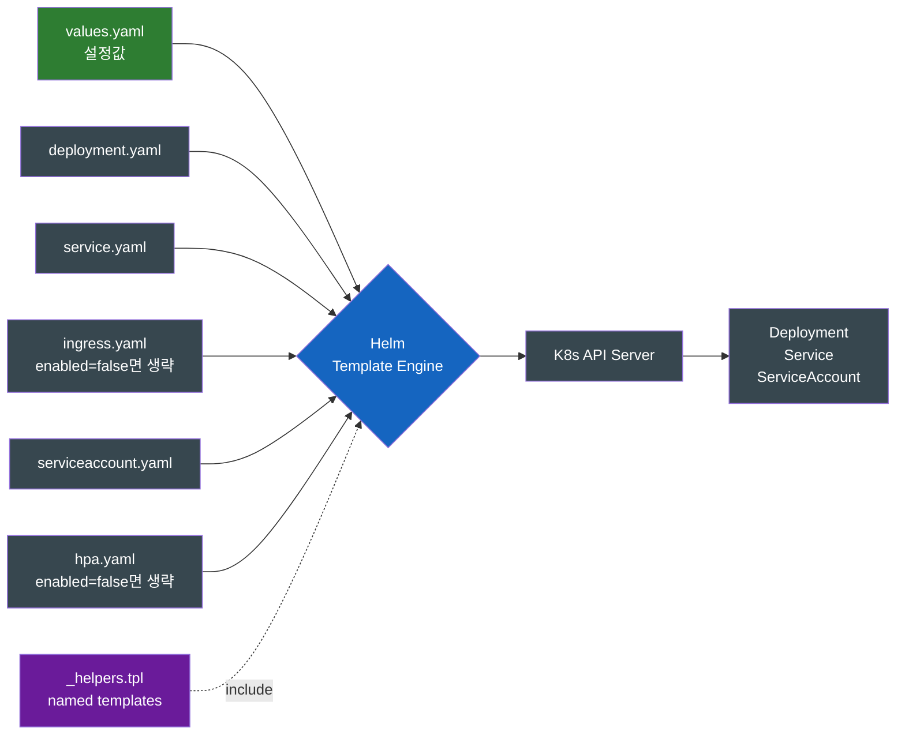

# 내 첫 Helm Chart — `helm create`부터 `helm install`까지

Maven으로 자바 프로젝트를 시작할 때 빈 폴더에서 `pom.xml`을 손으로 적지 않는다. `mvn archetype:generate` 한 줄로 뼈대를 받는다. Helm도 정확히 같은 흐름이 있다.

## 결론부터 말하면

**`helm create` 한 번이면 K8s에 배포 가능한 nginx Chart 한 벌이 그대로 나온다.** 자바 개발자가 `mvn archetype:generate`로 첫 프로젝트를 시작하듯, Helm도 빈 폴더부터 시작할 필요 없다. 5분이면 첫 Chart를 만들고, `helm install`로 실제 K8s에 배포하고, `helm rollback`으로 되돌리는 한 사이클을 끝낼 수 있다. 이 글은 그 5분의 경험을 손에 익히는 핸즈온이다.



| 단계 | 명령 | 하는 일 |
|------|------|--------|
| ① 스캐폴드 | `helm create my-app` | Chart 기본 뼈대 생성 |
| ② 설치 | `helm install my-first ./my-app` | 클러스터에 Release 만들기 |
| ③ 변경 | `helm upgrade my-first ./my-app --set replicaCount=3` | 새 리비전으로 갱신 |
| ④ 이력 | `helm history my-first` | 리비전 목록 확인 |
| ⑤ 롤백 | `helm rollback my-first 1` | 1번 리비전 상태로 복귀 |
| ⑥ 정리 | `helm uninstall my-first` | Release가 만든 리소스 일괄 삭제 |

> **시리즈 4편**: 이전 3편(Helm/Harbor/통합)은 "왜"를 다뤘다. 이번 글부터는 "어떻게"로 시점이 바뀐다. 시리즈 1편의 컨테이너 패키지 매니저 개념을 그대로 손에 익히는 단계.
>
> ⚠️ **버전 기준 안내**: 본문의 `helm create` 산출물과 디렉토리 구조는 일반적인 핸즈온 학습 흐름을 보여주기 위한 예시이며, Helm 버전(3.x 후기 / 4.x)에 따라 `templates/httproute.yaml`을 비롯한 일부 기본 매니페스트와 `_helpers.tpl` 헬퍼가 추가/변경될 수 있다. 실제로 손에서 본 파일 목록이 본문과 다르더라도 학습 흐름 자체는 동일하니, 본인의 환경에서 생성된 트리를 그대로 따라가면 된다.

---

## 1. 빈 디렉토리부터 시작하지 마라

처음 Helm Chart를 만든다고 빈 폴더에서 시작하면 곤란하다. 알아야 할 것이 너무 많다.

- `Chart.yaml`의 정확한 형식과 필수 필드는?
- `templates/` 안에 어떤 매니페스트가 있어야 하는가?
- `_helpers.tpl`은 왜 존재하고 어떤 함수가 관습적으로 들어가는가?
- 레이블링 규칙은? (`app.kubernetes.io/name`, `helm.sh/chart` ...)
- 테스트는 어디 두는가?

자바 개발자라면 이 풍경에서 익숙한 데자뷰가 느껴질 것이다. **`pom.xml`을 처음 손으로 짜본 사람의 좌절감**이 정확히 같다. `<modelVersion>`은 뭘 적고, `<groupId>`/`<artifactId>` 규칙은 뭐고, `<build>` 섹션은 어떻게 짜야 하는지 — 모든 게 첫날 동시에 와닿는다.

Maven이 이 진입장벽을 해결한 방식이 `mvn archetype:generate`였다. **"표준 뼈대"** 를 자동으로 만들어 주고, 사용자는 거기서 필요한 부분만 수정하면 된다. Helm도 같은 카드를 들고 있다 — 그것이 `helm create`다.

| 자바/Maven | Helm |
|-----------|------|
| `mvn archetype:generate` | `helm create my-app` |
| `pom.xml` 자동 생성 | `Chart.yaml` 자동 생성 |
| `src/main/java`, `src/test/java` 구조 | `templates/`, `templates/tests/` 구조 |
| `App.java`, `AppTest.java` 샘플 코드 | `deployment.yaml`, `service.yaml` 샘플 매니페스트 |
| 빌드 가능한 상태로 즉시 시작 | 즉시 `helm install` 가능한 상태로 시작 |

---

## 2. `helm create my-app` — 생성되는 기본 파일들의 정체

명령 한 줄이면 끝난다.

```bash
$ helm create my-app
Creating my-app
```

생성된 디렉토리 구조는 다음과 같다.

```
my-app/
├── .helmignore             # 패키징 시 무시할 파일 패턴 (.gitignore와 유사)
├── Chart.yaml              # 패키지 메타 (이름, 버전, 의존성)
├── values.yaml             # 기본 설정값
├── charts/                 # 의존하는 sub-charts 자리 (처음엔 비어있음)
└── templates/              # K8s 매니페스트 템플릿들
    ├── NOTES.txt           # install 후 사용자에게 보여줄 안내문 (템플릿 가능)
    ├── _helpers.tpl        # 재사용 가능한 named template (Helper 함수)
    ├── deployment.yaml     # 컨테이너 배포 정의
    ├── hpa.yaml            # Horizontal Pod Autoscaler (기본 비활성)
    ├── ingress.yaml        # 외부 노출 (기본 비활성)
    ├── service.yaml        # Pod에 가상 IP 부여
    ├── serviceaccount.yaml # Pod의 ID
    └── tests/
        └── test-connection.yaml  # helm test로 실행되는 검증 작업
```

각 파일이 하는 일을 한눈에 보면 다음과 같다.



핵심은 **`templates/` 아래의 파일이 그 자체로 K8s에 적용되는 것이 아니라, `values.yaml`과 합쳐져 렌더링된 결과가 적용된다는 점**이다. 시리즈 1편에서 다룬 "Helm은 클라이언트 사이드 템플릿 엔진"이라는 표현이 여기서 실체화된다.

---

## 3. 기본 Chart를 들여다보자 — 실제로 무엇이 만들어지는가

생성된 Chart가 빈 골격이 아니라 **즉시 배포 가능한 nginx 한 벌**이라는 점이 중요하다. 핵심 파일 3개만 살펴보자.

### 3.1 `Chart.yaml` — 패키지 신원증명

```yaml
apiVersion: v2
name: my-app
description: A Helm chart for Kubernetes
type: application
version: 0.1.0           # Chart 자체의 버전 (SemVer)
appVersion: "1.16.0"     # 배포되는 앱의 버전 (참고용)
```

| 필드 | 역할 | Maven 비교 |
|------|------|-----------|
| `apiVersion: v2` | Helm 3 이상의 Chart 포맷 (v1은 Helm 2 시절) | `<modelVersion>4.0.0</modelVersion>` |
| `name` | 패키지 식별자 | `<artifactId>` |
| `version` | Chart 자체의 버전 | `<version>` (pom.xml) |
| `appVersion` | Chart가 배포하는 **앱의** 버전 (Chart 버전과 별개) | jar 내부의 `Implementation-Version` |
| `type` | `application` 또는 `library` | 패키징 타입 (jar/war) |

특히 **`version`과 `appVersion`이 다르다는 점이 헷갈리는 부분**이다. Chart 패키지는 `name + version`으로 식별되므로, `Chart.yaml`을 변경해 패키지를 다시 빌드/배포할 때는 **`version`을 반드시 올려야 한다**. 이때 안에 담긴 앱(컨테이너 이미지)의 새 버전을 기록하기 위해 `appVersion`도 함께 갱신하는 식이다. 반대로 설치 시점에 `--set image.tag=2.0`처럼 값만 오버라이드하는 것은 Chart 자체가 바뀐 게 아니므로 두 필드 다 손댈 필요 없다. `appVersion`은 패키지 식별자가 아니라 **정보성 필드**라는 점을 기억해 두면 좋다.

### 3.2 `values.yaml` — 기본 설정값

`helm create`가 만든 `values.yaml`은 약 100줄 정도이지만, 핵심은 다음과 같다.

```yaml
replicaCount: 1

image:
  repository: nginx
  pullPolicy: IfNotPresent
  tag: ""              # 비어있으면 .Chart.AppVersion 사용 (대소문자 주의)

serviceAccount:
  create: true
  name: ""

service:
  type: ClusterIP
  port: 80

ingress:
  enabled: false       # 기본은 외부 노출 안 함
  className: ""
  hosts:
    - host: chart-example.local

autoscaling:
  enabled: false       # 기본은 HPA 안 만듦
  minReplicas: 1
  maxReplicas: 100

resources: {}          # 기본은 빈 객체 (limits/requests 미설정)
```

여기서 흥미로운 패턴이 `ingress.enabled`, `autoscaling.enabled` 같은 **on/off 스위치**다. 템플릿 안에 `{{- if .Values.ingress.enabled }}` 같은 가드가 있어, 스위치가 꺼지면 해당 매니페스트는 아예 렌더링되지 않는다 — **존재 자체를 옵션화**한 것이다.

### 3.3 `templates/deployment.yaml` — 변수가 실제로 어떻게 치환되는지

가장 중요한 파일이다. 일부만 보면 다음과 같다.

```yaml
apiVersion: apps/v1
kind: Deployment
metadata:
  name: {{ include "my-app.fullname" . }}
  labels:
    {{- include "my-app.labels" . | nindent 4 }}
spec:
  {{- if not .Values.autoscaling.enabled }}
  replicas: {{ .Values.replicaCount }}
  {{- end }}
  template:
    spec:
      containers:
        - name: {{ .Chart.Name }}
          image: "{{ .Values.image.repository }}:{{ .Values.image.tag | default .Chart.AppVersion }}"
          imagePullPolicy: {{ .Values.image.pullPolicy }}
```

여기에 등장하는 문법이 Helm을 처음 만진 사람을 어지럽게 만든다. 핵심만 짚으면 다음과 같다.

| 표현 | 의미 |
|------|------|
| `{{ ... }}` | Go template 액션 (변수 치환, 함수 호출) |
| `{{- ...` | 좌측 공백 제거 (whitespace 제어) |
| `... -}}` | 우측 공백 제거 |
| `.Values.xxx` | `values.yaml`의 값. 키는 `values.yaml`에 적은 대로 (대소문자 그대로) |
| `.Chart.xxx` | `Chart.yaml`의 값. **필드명은 첫 글자 대문자**: `.Chart.Name`, `.Chart.Version`, `.Chart.AppVersion` |
| `.Release.xxx` | 설치 시점 정보. **필드명도 대문자**: `.Release.Name`, `.Release.Namespace`, `.Release.Revision` |
| `include "name" .` | `_helpers.tpl`에 정의된 named template 호출 |
| `\| default X` | 앞이 비어있으면 X 사용 (파이프 함수) |
| `\| nindent 4` | 새 줄로 시작하고 4칸 들여쓰기 |

**핵심 통찰**: `{{- if not .Values.autoscaling.enabled }} replicas: ... {{- end }}` 이 구조가 의미하는 것은 — HPA를 쓰면 `replicas`를 Deployment에 못 박지 않는다. HPA가 알아서 조정해야 하니까. 이 정도의 조건 분기가 기본 Chart에 이미 들어있다는 점이 `helm create`가 그냥 골격이 아니라 **베스트 프랙티스 모음**이라는 증거다.

### 3.4 `_helpers.tpl` — 왜 분리되어 있나

`_`로 시작하는 파일은 Helm이 **K8s 매니페스트로 취급하지 않는다**. 대신 다른 템플릿에서 `include`로 불러쓰는 **헬퍼 함수 모음**이다. `helm create`가 생성하는 주요 헬퍼는 다음과 같다 (Helm 버전에 따라 추가 헬퍼가 더 있을 수 있다).

| 헬퍼 | 역할 |
|------|------|
| `my-app.name` | Chart 이름 (override 가능) |
| `my-app.fullname` | Release 이름 + Chart 이름 조합 (`my-first-my-app` 같은) |
| `my-app.chart` | `name-version` 형태 (`my-app-0.1.0`) |
| `my-app.labels` | 표준 K8s 레이블 세트 |
| `my-app.selectorLabels` | Pod selector용 부분 레이블 |
| `my-app.serviceAccountName` | ServiceAccount 이름 결정 (최신 버전에서 포함) |

이 헬퍼들이 분리된 이유는 **DRY(Don't Repeat Yourself)** 다. 같은 레이블 블록을 Deployment, Service, Ingress가 모두 써야 하는데, 매번 복붙하는 대신 `{{ include "my-app.labels" . }}` 한 줄로 끝낸다. Spring `@Component`처럼 런타임 객체를 만드는 개념이 아니라, **Thymeleaf의 fragment나 정적 유틸리티 메서드처럼 "텍스트 조각을 재사용"** 하는 발상에 가깝다. 런타임에는 이미 치환이 끝난 평범한 YAML만 클러스터로 간다.

### 3.5 `NOTES.txt` — 설치 후 안내문

설치가 끝나면 `helm install`이 화면에 출력하는 마지막 문구가 이 파일에서 나온다. 놀랍게도 **이것도 템플릿**이다.

```
1. Get the application URL by running these commands:
{{- if .Values.ingress.enabled }}
  http://{{ (index .Values.ingress.hosts 0).host }}/
{{- else if contains "NodePort" .Values.service.type }}
  export NODE_PORT=$(kubectl get -o jsonpath="..." services {{ include "my-app.fullname" . }})
  echo http://$NODE_IP:$NODE_PORT
{{- else if contains "LoadBalancer" .Values.service.type }}
  ...
```

`service.type`이 무엇인지, ingress가 켜졌는지에 따라 **사용자에게 보여줄 안내문이 동적으로 바뀐다**. 이것이 Helm의 사려 깊은 부분 중 하나다.

---

## 4. 한 사이클 돌려보기 — install → upgrade → rollback → uninstall

이제 실제로 클러스터에 배포해보자. 로컬에서 K8s 클러스터(`minikube`, `kind`, Docker Desktop K8s, OrbStack 등)가 떠 있어야 한다.

### 4.1 첫 설치

```bash
$ helm install my-first ./my-app
NAME: my-first
LAST DEPLOYED: Mon May 25 15:32:01 2026
NAMESPACE: default
STATUS: deployed
REVISION: 1
NOTES:
1. Get the application URL by running these commands:
  export POD_NAME=$(kubectl get pods --namespace default -l "app.kubernetes.io/name=my-app,app.kubernetes.io/instance=my-first" -o jsonpath="{.items[0].metadata.name}")
  ...
```

`STATUS: deployed`, `REVISION: 1`이 핵심이다. Release `my-first`가 클러스터에 첫 리비전으로 들어갔다는 뜻이다.

### 4.2 실제로 무엇이 만들어졌는지 확인

```bash
$ kubectl get all -l app.kubernetes.io/instance=my-first
NAME                                    READY   STATUS    RESTARTS   AGE
pod/my-first-my-app-7b6f4c8c9d-x2vmz    1/1     Running   0          30s

NAME                      TYPE        CLUSTER-IP      EXTERNAL-IP   PORT(S)   AGE
service/my-first-my-app   ClusterIP   10.96.123.45    <none>        80/TCP    30s

NAME                              READY   UP-TO-DATE   AVAILABLE   AGE
deployment.apps/my-first-my-app   1/1     1            1           30s
```

Pod 이름이 `my-first-my-app-...`인 점에 주목하자. `_helpers.tpl`의 `my-app.fullname` 헬퍼가 만들어낸 결과다 — Release 이름(`my-first`)과 Chart 이름(`my-app`)이 합쳐져 있다. 같은 Chart를 다른 Release로 또 설치해도 충돌하지 않는 이유가 여기 있다.

### 4.3 Release 상태 확인

```bash
$ helm list
NAME      NAMESPACE  REVISION  UPDATED         STATUS    CHART       APP VERSION
my-first  default    1         2026-05-25 ...  deployed  my-app-0.1.0  1.16.0
```

### 4.4 값 변경 → `helm upgrade`

replicas를 3개로 늘려보자. 두 가지 방법이 있다.

```bash
# 방법 A: --set으로 인라인 오버라이드
$ helm upgrade my-first ./my-app --set replicaCount=3

# 방법 B: 별도의 values 파일 사용
$ cat > prod-values.yaml <<EOF
replicaCount: 3
resources:
  limits:
    memory: 256Mi
EOF
$ helm upgrade my-first ./my-app -f prod-values.yaml
```

| 방법 | 언제 쓰나 |
|------|----------|
| `--set` | 임시 실험, CI에서 동적 값 주입 (commit SHA 등) |
| `-f values.yaml` | 환경별 영구 설정 (dev/stg/prod 분리) |

실무에서는 **`-f`로 환경별 파일을 두고, `--set`은 CI에서만 쓰는 것**이 일반적이다. 이유는 단순하다 — `--set`은 손에서 사라지는 명령이라 재현이 어렵지만 values 파일은 Git에 들어간다.

```bash
$ helm upgrade my-first ./my-app --set replicaCount=3
Release "my-first" has been upgraded. Happy Helming!
NAME: my-first
LAST DEPLOYED: Mon May 25 15:35:22 2026
NAMESPACE: default
STATUS: deployed
REVISION: 2     # ← 리비전이 2로 올라감
```

### 4.5 이력 + 롤백

```bash
$ helm history my-first
REVISION  UPDATED         STATUS      CHART         APP VERSION  DESCRIPTION
1         2026-05-25 ...  superseded  my-app-0.1.0  1.16.0       Install complete
2         2026-05-25 ...  deployed    my-app-0.1.0  1.16.0       Upgrade complete

$ helm rollback my-first 1
Rollback was a success! Happy Helming!

$ helm history my-first
REVISION  UPDATED         STATUS      CHART         APP VERSION  DESCRIPTION
1         2026-05-25 ...  superseded  my-app-0.1.0  1.16.0       Install complete
2         2026-05-25 ...  superseded  my-app-0.1.0  1.16.0       Upgrade complete
3         2026-05-25 ...  deployed    my-app-0.1.0  1.16.0       Rollback to 1
```

**롤백도 새 리비전을 만든다는 점이 인상적**이다. "되돌렸다"는 사실 자체가 이력에 남는다. 운영 사고 사후 분석에서 이 흔적이 결정적인 단서가 된다.

### 4.6 정리

```bash
$ helm uninstall my-first
release "my-first" uninstalled
```

이 한 줄로 `my-first`가 만든 Deployment/Service/ServiceAccount가 한꺼번에 사라진다. 시리즈 1편에서 강조했던 "Release 단위로 묶여 관리된다"의 가치가 가장 실감되는 순간이다.

---

## 5. 첫 디버깅 — 렌더링 결과를 미리 보는 3가지 방법

Chart를 수정하다 보면 반드시 마주치는 문제가 있다. **"내가 친 변수가 진짜 의도한 대로 치환됐을까?"** 클러스터에 실제로 적용하기 전에 확인하는 3가지 방법이 있다.

| 명령 | 하는 일 | 언제 |
|------|--------|------|
| `helm lint ./my-app` | Chart 구조 + YAML 문법 오류 검사 | 가장 먼저, CI에 넣기 좋음 |
| `helm template my-first ./my-app` | 렌더링 결과 매니페스트만 출력 (클러스터 안 건드림) | 변수 치환 확인 |
| `helm install my-first ./my-app --dry-run --debug` | 실제 install처럼 시뮬레이션 + 디버그 출력 | 설치 직전 마지막 검증 |

특히 **`helm template`이 자주 쓰인다**. 다음처럼 파이프로 받아 보면 렌더링 결과가 그대로 나온다.

```bash
$ helm template my-first ./my-app --set replicaCount=5 | head -30
---
# Source: my-app/templates/serviceaccount.yaml
apiVersion: v1
kind: ServiceAccount
metadata:
  name: my-first-my-app
  ...
---
# Source: my-app/templates/deployment.yaml
apiVersion: apps/v1
kind: Deployment
spec:
  replicas: 5    # ← 의도대로 치환됨
  ...
```

Go 템플릿이 익숙해질 때까지 이 명령을 자주 쓰게 된다. 변수 한 줄 바꾸고 `helm template`으로 확인 → 또 바꾸고 확인하는 사이클이 학습에 매우 효과적이다.

---

## 6. 흔히 만나는 초보의 5가지 함정

| 함정 | 증상 | 해결 |
|------|------|------|
| **`helm install`을 다시 실행하면 에러** | "cannot re-use a name" | 같은 Release 이름으로 재설치 불가. `helm upgrade --install` 사용 (없으면 install, 있으면 upgrade) |
| **values 수정 후 적용 안 됨** | 클러스터에 변화 없음 | `helm upgrade`를 깜빡함. `helm install`은 첫 설치만 |
| **들여쓰기 한 칸 어긋남** | YAML 파싱 에러, 원인을 알 수 없는 메시지 | `helm template`으로 렌더링 결과 들여쓰기 확인. `\| nindent N` 활용 |
| **`--set` 값에 점/콤마 포함** | 파싱 어긋남 | 이스케이프하거나 `-f`로 빼기 |
| **Release 이름과 namespace 헷갈림** | "release not found" | `helm list -A`로 전체 namespace 조회. 기본은 `default` namespace |

이 5가지를 한 번씩 직접 만나보는 것이 가장 빠른 학습이다.

---

## 7. 다음에 무엇을 배워야 하는가

기본 Chart 한 바퀴를 돌렸다면 자연스러운 다음 학습 경로가 있다.

| 다음 주제 | 핵심 질문 |
|----------|----------|
| **Go 템플릿 함정과 패턴** | `_helpers.tpl`을 직접 작성하고, `tpl` 함수와 whitespace 제어를 마스터하는 단계 |
| **`values.yaml` 설계 패턴** | 환경별 분기, override 계층, `values.schema.json`으로 입력 검증 |
| **Subchart와 Library Chart** | 사내 공통 Chart를 만들어 여러 서비스가 공유하는 단계 |
| **`helm test`로 검증 자동화** | `templates/tests/` 안의 작업으로 배포 후 자동 검증 |
| **OCI Registry로 Chart 푸시** | 시리즈 2/3편의 Harbor에 사내 Chart를 올리는 단계 |

이 시리즈에서는 다음 글로 **Go 템플릿 함정과 패턴**을 다룰 예정이다. 이번 글에서 `_helpers.tpl`을 "이런 게 있다"로만 짚었는데, 다음 글에서 직접 손으로 작성해본다.

---

## 8. 정리

`helm create` 한 줄로 시작하는 첫 Chart 경험은 자바 개발자가 `mvn archetype:generate`로 첫 프로젝트를 시작하는 그 자리다. 빈 폴더에서 시작하지 말 것, 생성된 9개 파일이 각자 무엇을 하는지 한 번 훑을 것, install → upgrade → rollback → uninstall 한 사이클을 손에 익힐 것 — 이 세 가지가 첫날의 목표다.

시리즈 1편에서 깐 "패키지 매니저로서의 Helm"이라는 개념이, 이 글에서 처음으로 손에 잡힌다. Chart는 더 이상 추상적인 단어가 아니라 **9개 파일의 묶음**이고, Release는 **`helm list`에 한 줄로 보이는 실체**이고, 롤백은 **`helm rollback NAME REVISION`** 한 줄이다.

| 시리즈 위치 | 이 글의 역할 |
|------------|-------------|
| 1편 (Helm 개념) | 왜 Chart 단위 추상화가 필요한가 |
| 2편 (Harbor) | Chart가 어디에 저장되는가 |
| 3편 (통합) | Helm + Harbor가 함께 도는 파이프라인 |
| **4편 (이 글)** | **Chart를 처음 만드는 손의 감각** |
| 5편 (예정) | Go 템플릿의 함정과 패턴 |

다음 글에서는 이번에 만든 `my-app/`을 그대로 들고 가, `_helpers.tpl`을 직접 손보고 Go 템플릿의 까다로운 부분들을 정공으로 풀어본다.

---

## 출처

- [Helm 공식 문서 — helm create](https://helm.sh/docs/helm/helm_create/) — 공식 레퍼런스
- [Helm Chart Template Guide — Getting Started](https://helm.sh/docs/chart_template_guide/getting_started/) — 공식 입문 가이드
- [Helm 공식 문서 — Charts](https://helm.sh/docs/topics/charts/) — Chart 구조 상세
- [Bitnami — Understand a Helm chart structure](https://docs.bitnami.com/kubernetes/faq/administration/understand-helm-chart/) — 디렉토리 구조 해설
- [OneUptime Blog — How to Build Helm Charts from Scratch (2026-01)](https://oneuptime.com/blog/post/2026-01-19-kubernetes-helm-charts-from-scratch/view) — 실전 핸즈온 참고
- [Theodo/Padok — Helm Charts: test and validate process](https://www.theodo.com/blog/test-and-validate-your-helm-charts-in-kubernetes) — helm template/lint 활용
