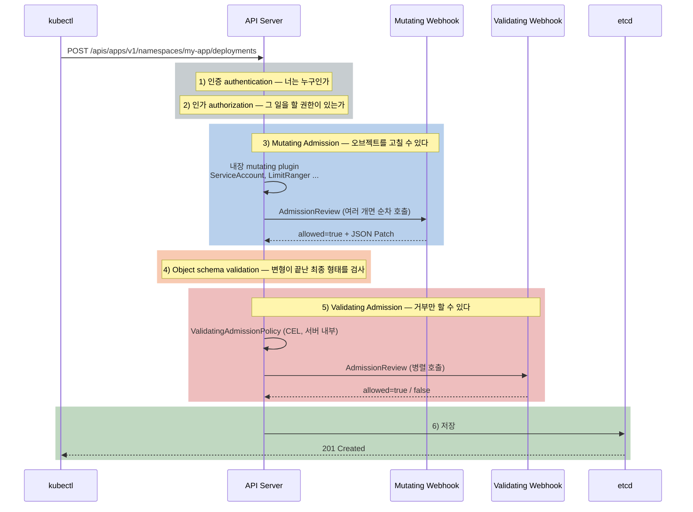
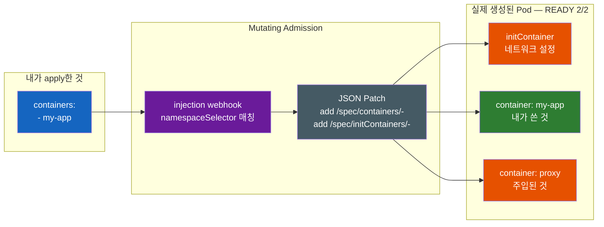
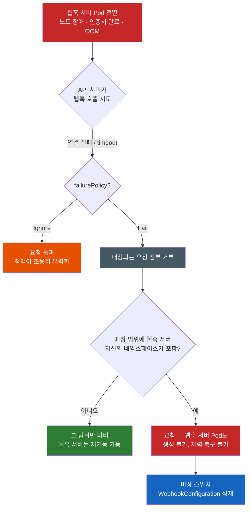

# 내가 만들지 않은 컨테이너가 왜 Pod에 들어와 있을까 — Admission Webhook

컨테이너를 하나만 정의했는데 `READY 2/2`가 뜬다. 반대로 문제없어 보이는 YAML이 "정책 위반"으로 거부당한다. 나는 그런 검사를 설정한 적이 없다. 누가 내 리소스를 고치고, 누가 거부하는가?

먼저 실제 장면부터 보자. 컨테이너 하나짜리 Deployment를 apply했다.

```yaml
# 내가 쓴 것 — 컨테이너는 분명히 하나다
spec:
  containers:
  - name: my-app
    image: my-app:1.0
```

```bash
$ kubectl get pod
NAME                      READY   STATUS    RESTARTS   AGE
my-app-7d9f8c6b4d-x2ktp   2/2     Running   0          12s
#                         ^^^ 2개? 하나만 적었는데?
```

`kubectl describe pod`를 보면 내가 쓰지 않은 컨테이너가 하나 더 있고, 있지도 않던 init 컨테이너까지 붙어 있다. YAML을 다시 봐도 내 잘못은 없다. **애초에 내가 보낸 YAML과 클러스터에 저장된 오브젝트가 다르기 때문이다.**

---

## 결론부터 말하면

**`kubectl apply`가 보낸 오브젝트는 그대로 저장되지 않는다.** API 서버는 요청을 받아 etcd에 쓰기 전까지 여러 관문을 통과시키는데, 그중 **admission** 단계에는 오브젝트를 **고치는(mutating)** 권한과 **거부하는(validating)** 권한이 있다. 내가 만들지 않은 컨테이너는 mutating admission이 주입한 것이고, 설정한 적 없는 정책 위반 거부는 validating admission이 낸 것이다.



여기서 놀라운 사실이 하나 더 있다. **웹훅을 하나도 설치하지 않은 평범한 클러스터에서도 내 YAML은 이미 조용히 수정되고 있다.** API 서버에는 admission plugin이 컴파일되어 들어 있고, 그중 상당수가 기본 활성화 상태다.

| 내장 plugin | 내 YAML에 하는 일 | 성격 |
|-------------|-------------------|------|
| `ServiceAccount` | ServiceAccount를 정해주고 API 토큰을 projected volume으로 붙인다 | Mutating + Validating |
| `LimitRanger` | 네임스페이스의 LimitRange에 따라 기본 requests/limits를 채운다 | Mutating + Validating |
| `ResourceQuota` | 네임스페이스 할당량을 넘으면 거부한다 | Validating |
| `PodSecurity` | 네임스페이스 라벨에 선언된 Pod Security Standards를 강제한다 | Validating |
| `DefaultStorageClass` | PVC에 StorageClass가 없으면 기본값을 채운다 | Mutating |
| `MutatingAdmissionWebhook` / `ValidatingAdmissionWebhook` | **외부 웹훅을 호출한다** — 확장 지점 | 각각 |

즉 "내 YAML이 그대로 저장된다"는 직관은 처음부터 틀렸다. 웹훅은 이 자리에 남의 코드를 꽂을 수 있게 열어둔 **확장 지점** 일 뿐이다. 이제 이 관문들을 하나씩 열어보자.

---

## 1. `kubectl apply`를 누르면 실제로 무슨 일이 벌어지는가

### 1-1. 여섯 개의 관문

`kubectl apply`는 결국 API 서버에 HTTP 요청 하나를 보내는 일이다. 그 요청은 다음 순서로 처리된다.

| 순서 | 단계 | 하는 일 | 실패하면 |
|------|------|---------|----------|
| 1 | **인증(authentication)** | 요청자가 누구인지 확정 | 401 |
| 2 | **인가(authorization)** | 그 사용자가 이 verb·리소스를 다룰 권한이 있는지 | 403 |
| 3 | **Mutating Admission** | 오브젝트를 **고친다** (기본값 채우기, 컨테이너 주입) | 거부 시 요청 실패 |
| 4 | **Object schema validation** | 최종 오브젝트가 API 스키마에 맞는지 | 422 등 |
| 5 | **Validating Admission** | 오브젝트를 **검사한다** (통과/거부만) | 거부 시 요청 실패 |
| 6 | **etcd 저장** | 비로소 클러스터의 사실이 된다 | — |

1·2단계에서 판단하는 것은 "이 요청을 보낸 주체가 누구고 무엇을 할 수 있는가"이지 오브젝트의 내용이 아니다. 반면 admission 단계는 공식 문서 표현대로 **"인가 모듈이 볼 수 있는 속성에 더해, 생성·수정되는 오브젝트의 내용 자체에 접근할 수 있다"**. 그래서 "replica가 5개를 넘으면 안 된다", "이미지 태그에 `latest`를 쓰면 안 된다" 같은 판단은 인가가 아니라 admission의 일이다.

ServiceAccount 신원과 RBAC verb 문법 같은 1·2단계의 상세는 [Pod는 어떻게 쿠버네티스 API에 자기를 증명할까 — ServiceAccount와 RBAC](Pod는-어떻게-쿠버네티스-API에-자기를-증명할까-ServiceAccount와-RBAC.md)에서 다룬다. 이 노트는 3~5단계에 집중한다.

또 하나 중요한 전제. **admission은 읽기 요청에는 걸리지 않는다.** 공식 문서가 못 박아 두듯 admission controller는 오브젝트를 생성·수정·삭제·프록시 연결하는 요청에만 작동하고, 단순히 읽는 요청에는 개입하지 않는다. 그래서 `kubectl get`이 느려지는 일은 없지만, `kubectl apply`는 웹훅 개수만큼 느려진다.

### 1-2. 왜 mutating이 validating보다 먼저인가

순서가 이렇게 정해진 이유는 하나뿐이다. **검사는 최종 형태를 대상으로 해야 의미가 있기 때문이다.**

만약 검증이 먼저였다면 이런 일이 벌어진다. 내가 컨테이너 하나짜리 Pod를 보내고, 검증 웹훅이 "모든 컨테이너에 CPU limit이 있어야 한다"를 확인해 통과시킨다. 그런데 그 뒤에 mutating 웹훅이 CPU limit 없는 프록시 컨테이너를 하나 주입한다. 결과는 **정책을 위반한 오브젝트가 정책 검사를 통과한 상태로 저장되는 것** 이다. 검증의 의미가 사라진다.

그래서 공식 문서는 이 원칙을 명시한다.

> 정책을 강제하기 위해 오브젝트의 **최종 상태** 를 반드시 봐야 하는 admission webhook은 validating admission webhook을 써야 한다. 오브젝트는 mutating webhook이 본 이후에도 변경될 수 있기 때문이다.

이 한 문장이 mutating과 validating을 나누는 근거 전부다. mutating은 "고칠 수 있지만 자기 뒤에 무엇이 올지 모르는" 단계이고, validating은 "고칠 수 없지만 모든 변형이 끝난 것을 보는" 단계다. 4단계의 스키마 검증이 mutating 다음에 오는 것도 같은 이유다 — 주입된 컨테이너까지 포함한 최종 오브젝트가 API 스키마에 맞는지를 봐야 한다.

### 1-3. 왜 "etcd 저장 전"이라는 점이 중요한가

admission은 저장 **전** 에 끼어든다. 이 위치가 컨트롤러와 admission을 완전히 다른 도구로 만든다.

컨트롤러는 이미 저장된 상태를 관찰하고 원하는 상태로 수렴시킨다(desired vs observed의 reconciliation loop는 [쿠버네티스는 어떻게 자기 자신을 확장할까 — CRD와 컨트롤러 그리고 Operator](쿠버네티스는-어떻게-자기-자신을-확장할까-CRD와-컨트롤러-그리고-Operator.md)가 다룬다). 즉 컨트롤러 방식으로 정책을 강제하면 **잘못된 오브젝트가 일단 클러스터에 들어온 뒤** 누군가 그것을 고치거나 지운다. 그 사이의 시간 동안 규칙을 어긴 Pod가 실제로 떠 있을 수 있다.

admission은 그 창을 없앤다. 규칙을 어긴 오브젝트는 **애초에 클러스터의 사실이 되지 못한다.** 사용자에게는 `kubectl apply`가 실패하고 그 자리에서 이유가 보인다. "잘못된 상태를 나중에 고치기"와 "잘못된 상태가 생기지 않게 하기"의 차이이며, 정책 강제를 admission에 두는 이유다.

---

## 2. admission은 웹훅만이 아니다

여기서 도입부의 미스터리로 돌아가기 전에 다리를 하나 놓아야 한다. **admission은 웹훅이라는 이름이 붙기 전에 이미 API 서버 안에 있었다.**

`kube-apiserver`에는 admission plugin들이 컴파일되어 들어 있고, `--enable-admission-plugins` / `--disable-admission-plugins`로 켜고 끈다. 쿠버네티스 v1.36 기준 기본 활성화 목록은 다음과 같다(공식 문서 원문 그대로).

```
CertificateApproval, CertificateSigning, CertificateSubjectRestriction, DefaultIngressClass,
DefaultStorageClass, DefaultTolerationSeconds, LimitRanger, MutatingAdmissionWebhook,
NamespaceLifecycle, PersistentVolumeClaimResize, PodSecurity, Priority, ResourceQuota,
RuntimeClass, ServiceAccount, StorageObjectInUseProtection, TaintNodesByCondition,
ValidatingAdmissionPolicy, ValidatingAdmissionWebhook
```

이 목록을 읽는 방식이 중요하다. 웹훅을 설치하지 않은 클러스터에서도 저 19개는 이미 돌고 있다. `ServiceAccount` plugin은 Pod에 ServiceAccount를 붙이고 API 토큰을 projected volume으로 마운트한다 — **내가 YAML에 volume을 하나도 쓰지 않았는데 Pod에 volume이 생기는 이유가 이것이다.** `LimitRanger`는 requests/limits를 채우고, `ResourceQuota`는 초과를 거부하고, `PodSecurity`는 네임스페이스 라벨에 선언된 보안 표준을 강제한다.

> **PodSecurity의 현재 위치.** 과거의 `PodSecurityPolicy`(PSP)는 v1.21에서 deprecated된 뒤 **v1.25에서 제거** 됐고, v1.25 이후 클러스터에서는 아예 동작하지 않는다. 그 자리를 대신하는 것이 같은 릴리스에서 **stable로 승격된 Pod Security Admission**, 즉 위 목록의 `PodSecurity` plugin이다. PSP처럼 별도 정책 오브젝트를 쓰지 않고 **네임스페이스에 라벨을 붙여** 표준(privileged/baseline/restricted)을 적용한다. 오래된 블로그를 보고 PSP YAML을 쓰려다 막히는 일이 아직 흔하다.

그리고 저 목록 안에 `MutatingAdmissionWebhook`과 `ValidatingAdmissionWebhook`이 있다. 이 둘이 하는 일은 정책 판단이 아니라 **"이 요청에 매칭되는 외부 웹훅을 호출하는 것"** 이다. 즉 admission이라는 파이프라인 자체는 원래부터 있었고, 웹훅은 그 파이프라인에 클러스터 밖의 코드를 꽂는 문이다.

---

## 3. 웹훅 — admission을 클러스터 밖으로 확장하기

### 3-1. WebhookConfiguration이 선언하는 것

웹훅을 등록한다는 것은 API 서버에게 **"이런 요청이 오면 저기로 물어봐라"** 를 알려주는 일이다. 그 선언이 `MutatingWebhookConfiguration` / `ValidatingWebhookConfiguration`이고, API 그룹은 안정 버전인 `admissionregistration.k8s.io/v1`이다.

```yaml
apiVersion: admissionregistration.k8s.io/v1
kind: ValidatingWebhookConfiguration
metadata:
  name: pod-policy.example.com
webhooks:
- name: pod-policy.example.com
  rules:                          # 어떤 요청에 반응할지
  - apiGroups:   [""]
    apiVersions: ["v1"]
    operations:  ["CREATE"]
    resources:   ["pods"]
    scope:       "Namespaced"
  clientConfig:                   # 어디로 물어볼지
    service:
      namespace: my-app
      name: policy-webhook
    caBundle: <CA_BUNDLE>         # API 서버가 이 서버를 신뢰할 근거
  namespaceSelector:              # 대상 범위 좁히기 (네임스페이스 라벨 기준)
    matchExpressions:
    - key: kubernetes.io/metadata.name
      operator: NotIn
      values: ["kube-system", "kube-node-lease"]
  admissionReviewVersions: ["v1"]
  sideEffects: None               # 필수 — 부수효과가 있는지 선언
  timeoutSeconds: 5               # 기본 10초, 허용 범위 1~30초
  failurePolicy: Fail             # 기본값 Fail
  matchPolicy: Equivalent         # 기본값 Equivalent
```

각 필드가 무엇을 결정하는지가 이 노트의 나머지 절반을 설명한다.

| 필드 | 결정하는 것 | 기본값 |
|------|-------------|--------|
| `rules` | 어떤 apiGroup·apiVersion·resource·operation·scope에 반응할지 | 없음(필수) |
| `clientConfig` | 호출 대상 — 클러스터 안 `service` 또는 외부 `url` | 없음(필수) |
| `caBundle` | API 서버가 웹훅 서버의 TLS 인증서를 검증할 CA | 없음 |
| `namespaceSelector` | **네임스페이스 라벨** 로 대상 좁히기 | 전체 |
| `objectSelector` | **오브젝트 라벨** 로 대상 좁히기 | 전체 |
| `failurePolicy` | 웹훅을 **호출할 수 없을 때** 요청을 통과시킬지 거부할지 | **`Fail`** |
| `timeoutSeconds` | 응답 대기 시간 (1~30) | **10** |
| `sideEffects` | 오브젝트 밖을 건드리는지 (`None` / `NoneOnDryRun`) | 없음(필수) |
| `matchPolicy` | 다른 API 버전으로 온 같은 리소스도 잡을지 (`Exact` / `Equivalent`) | **`Equivalent`** |
| `reinvocationPolicy` | 다른 plugin이 오브젝트를 고친 뒤 다시 호출받을지 | **`Never`** |

`matchPolicy`의 기본값이 `Equivalent`인 이유가 재미있다. 같은 리소스가 여러 API 그룹·버전으로 제공될 수 있어서, `apps/v1`에만 규칙을 걸어둔 웹훅이 다른 버전으로 온 요청을 놓칠 수 있다. `Equivalent`는 그런 요청도 웹훅이 등록한 버전으로 변환해 보내준다. 공식 문서도 `Equivalent`를 권장한다 — 클러스터를 업그레이드해 새 버전이 열릴 때 웹훅이 조용히 빠지는 사고를 막아준다.

### 3-2. AdmissionReview — 실제로 주고받는 것

API 서버는 웹훅에 `Content-Type: application/json`으로 POST를 보낸다. 본문은 `admission.k8s.io` API 그룹의 **`AdmissionReview`** 오브젝트다. 웹훅은 자기가 이해하는 버전을 `admissionReviewVersions`로 미리 선언해야 한다(필수 필드).

응답도 같은 `AdmissionReview`이고, `response`에 최소 두 필드만 있으면 된다 — 요청의 `uid`를 그대로 복사한 값, 그리고 `allowed`.

```json
// validating: 거부하면서 사용자에게 보일 메시지까지 지정
{
  "apiVersion": "admission.k8s.io/v1",
  "kind": "AdmissionReview",
  "response": {
    "uid": "<request.uid 그대로>",
    "allowed": false,
    "status": { "code": 403, "message": "image tag 'latest' is not allowed" }
  }
}
```

```json
// mutating: 통과시키면서 오브젝트를 고친다 — patchType은 JSONPatch만 지원
{
  "apiVersion": "admission.k8s.io/v1",
  "kind": "AdmissionReview",
  "response": {
    "uid": "<request.uid 그대로>",
    "allowed": true,
    "patchType": "JSONPatch",
    "patch": "W3sib3AiOiAiYWRkIiwgInBhdGgiOiAiL3NwZWMvcmVwbGljYXMiLCAidmFsdWUiOiAzfV0="
  }
}
```

여기서 중요한 비대칭이 드러난다. **validating 웹훅은 `allowed`만 답할 수 있고, mutating 웹훅은 거기에 JSON Patch를 얹을 수 있다.** 위 base64를 풀면 `[{"op": "add", "path": "/spec/replicas", "value": 3}]`이다. 즉 mutating 웹훅은 오브젝트를 통째로 돌려주지 않고 **패치만** 돌려준다. 내가 만들지 않은 컨테이너가 Pod에 들어와 있는 이유가 바로 이 몇 줄의 JSON Patch다.

거부 메시지에 웹훅이 직접 쓴 `message`가 담긴다는 점도 기억할 만하다. 나중에 디버깅에서 이 메시지가 결정적인 단서가 된다.

### 3-3. 사이드카 주입이 바로 이것이다

이제 도입부의 `READY 2/2`를 설명할 수 있다. 서비스 메시를 도입할 때 하는 일은 대개 이 한 줄이다.

```bash
$ kubectl label namespace my-app istio-injection=enabled
```

이 라벨은 Pod를 만들지 않는다. **네임스페이스에 라벨을 붙였을 뿐이다.** 그런데 이후 그 네임스페이스에서 생성되는 모든 Pod에 프록시 컨테이너와 초기화 컨테이너가 붙는다. 메커니즘은 정확히 3-1에서 본 그것이다.



메시 컨트롤 플레인이 `MutatingWebhookConfiguration`을 등록해 두고, 그 `namespaceSelector`가 방금 붙인 라벨을 매칭한다. Pod 생성 요청이 올 때마다 API 서버가 웹훅을 부르고, 웹훅은 컨테이너를 추가하는 JSON Patch를 돌려준다. Istio 공식 문서의 예제도 같은 장면을 보여준다 — 라벨 전에는 `1/1`, 라벨 후에는 `2/2`이고 `istio-init`·`istio-proxy` 컨테이너가 추가된다.

여기서 왜 **전 클러스터에 걸지 않고 라벨로 좁히는가** 가 핵심이다. 만약 selector 없이 모든 네임스페이스에 주입한다면 `kube-system`의 컨트롤 플레인 구성요소, CNI·CSI 플러그인 Pod, DNS Pod에까지 프록시가 주입된다. 그러면 클러스터의 네트워킹 자체가 아직 뜨지 않은 프록시에 의존하게 되고, 클러스터가 부팅되지 못한다. 공식 good practices 문서가 명시적으로 권고하는 바도 같다 — `kube-system` 네임스페이스의 오브젝트 매칭을 피하고, `kube-node-lease` 네임스페이스의 Lease 오브젝트는 절대 mutate하지 말라(노드 업그레이드가 실패할 수 있다). 웹훅에서 **범위를 좁히는 것은 최적화가 아니라 안전 장치다.**

(사이드카·서비스 메시를 **왜** 쓰는가, 그 가치와 비용은 [Ingress 리소스가 하나도 없는데 트래픽은 어떻게 들어올까 — 서비스 메시가 대체하는 것들](Ingress-리소스가-하나도-없는데-트래픽은-어떻게-들어올까-서비스-메시가-대체하는-것들.md)이 다룬다. Pod 안에서 init/sidecar 컨테이너가 어떤 수명주기를 갖는지는 [Kubernetes-Pod](Kubernetes-Pod.md)에 있다. 이 노트는 "어떻게 들어왔는가"만 책임진다.)

### 3-4. 웹훅은 반드시 HTTPS다 — caBundle과 인증서 만료 장애

`clientConfig`에 `caBundle`이 있는 이유를 짚어야 한다. API 서버가 웹훅을 호출한다는 것은 **클러스터의 모든 쓰기 요청 내용을 그 서버에 넘긴다** 는 뜻이다. 중간에 누가 가로채거나 웹훅 서버를 사칭하면 클러스터 전체가 조작된다. 그래서 웹훅 호출은 HTTPS만 허용되고, API 서버가 그 인증서를 검증할 CA를 `caBundle`(PEM을 base64로 담은 필드)로 미리 알려줘야 한다. `clientConfig.service`를 쓸 때는 서버 인증서가 `<svc_name>.<svc_namespace>.svc`에 대해 유효해야 한다.

문제는 이 인증서를 누가 관리하느냐다. 손으로 발급하면 만료일에 장애가 예약된다. 그래서 실무 표준은 **cert-manager** 같은 도구에 맡기는 것이다. cert-manager의 `cainjector`는 `ValidatingWebhookConfiguration` · `MutatingWebhookConfiguration` · `CustomResourceDefinition` · `APIService`의 `caBundle` 필드를 채워주며, 웹훅 설정에 `cert-manager.io/inject-ca-from: <namespace>/<certificate>` 애노테이션만 붙이면 CA 데이터가 자동으로 주입된다.

**인증서 만료가 어떻게 클러스터 장애로 번지는가** 가 여기서 나온다. 인증서가 만료되면 API 서버는 웹훅 서버의 TLS를 검증할 수 없다. 이것은 웹훅이 "거부했다"가 아니라 **"호출에 실패했다"** 로 분류된다. 공식 문서가 정리한 `failurePolicy` 적용 대상에 그대로 들어 있다.

- 웹훅 접속 시 네트워크 오류·타임아웃·연결 실패
- 웹훅이 2xx가 아닌 응답이나 잘못된 형식의 응답을 반환
- API 서버가 요청 직렬화나 HTTP 클라이언트 생성에 실패
- (mutating만) 응답의 patch type을 해석할 수 없음

반대로 웹훅이 정상적으로 도달했고 스스로 `allowed: false`로 거부한 경우는 **failure가 아니라 rejection** 이며, `failurePolicy`와 무관하게 항상 요청이 거부된다. 이 구분이 다음 절의 전부다.

---

## 4. 가장 위험한 함정 — `failurePolicy: Fail`과 자기 자신을 막는 교착

### 4-1. `Fail`은 안전한 기본값처럼 보인다

`failurePolicy`의 기본값은 `Fail`이다. 웹훅을 부를 수 없으면 요청을 거부한다. 보안 관점에서 지극히 합리적으로 들린다 — 검사할 수 없으면 통과시키지 않는 게 맞지 않나?

여기서 직관이 무너진다. 이 정책은 **웹훅 서버가 살아 있는 동안에만** 합리적이다. 웹훅 서버 Pod가 전부 죽으면 그 웹훅의 `rules`에 매칭되는 모든 리소스를 **아무것도 만들 수 없다.** 그리고 매칭 범위 안에 **웹훅 서버 자신의 Pod가 포함되어 있으면**, 웹훅 서버를 다시 띄우려는 요청조차 그 죽은 웹훅에 물어봐야 한다. 자력 복구가 불가능한 교착이다.



공식 good practices 문서는 이런 순환 의존을 **dependency loop** 로 부르며 두 가지 전형을 든다. 첫째, 두 웹훅이 서로의 Pod를 검사하는 경우 — 둘이 동시에 죽으면 어느 쪽도 시작할 수 없다. 둘째, 웹훅이 자신이 의존하는 애드온(네트워킹·스토리지 플러그인)을 가로채는 경우 — 둘이 함께 죽으면 어느 쪽도 동작할 수 없다.

그래서 처방은 범위를 좁히는 것이다. `namespaceSelector`로 시스템 네임스페이스와 웹훅 자신의 네임스페이스를 제외하고, `objectSelector`로 의존 애드온을 제외하고, 웹훅 서버는 여러 replica로 `ClusterIP` Service 뒤에 두고, `rules`를 정말 필요한 리소스·verb로만 최소화한다. 공식 문서의 배포 순서 권고도 이 사고방식이다 — **웹훅 서버를 먼저 띄우고, `failurePolicy: Ignore`로, `namespaceSelector`를 테스트 네임스페이스로 좁혀서 배포한 뒤** 문제가 없는지 보고 범위를 넓혀라.

### 4-2. 클러스터를 잠갔을 때 빠져나오는 길

이미 잠긴 뒤라면 답은 하나다. **웹훅 설정 오브젝트를 지우는 것이 사실상의 비상 스위치다.**

```bash
# 누가 끼어들고 있는지 확인
kubectl get validatingwebhookconfigurations,mutatingwebhookconfigurations

# 지목된 설정을 삭제 → API 서버가 더 이상 그 웹훅을 호출하지 않는다
kubectl delete validatingwebhookconfiguration <name>
```

이 스위치가 **항상 통한다** 는 보장이 어디서 오는지가 중요하다. Kyverno 공식 문서가 그 근거를 명시한다.

> 쿠버네티스는 `ValidatingWebhookConfiguration`이나 `MutatingWebhookConfiguration` 오브젝트를 admission controller에 보내지 않는다. 따라서 Kyverno 정책으로 이 오브젝트를 검증하거나 변형하는 것은 불가능하다.

즉 웹훅 설정 오브젝트 자체는 **구조적으로 웹훅으로 보호할 수 없다.** 뒤집어 말하면 어떤 웹훅도 "나를 지우려는 요청"을 막을 수 없다. 잠긴 클러스터에서 탈출하는 문이 언제나 열려 있는 이유다. 같은 문서가 실제 복구 절차로 제시하는 것도 정확히 이것이다 — 웹훅 설정을 삭제해서 Pod가 뜰 수 있게 만든 뒤 다시 기동한다.

그래서 이 오브젝트에 대한 쓰기 권한은 정확히 그만큼 위험하다. 공식 문서는 `admissionregistration.k8s.io/v1`의 `MutatingWebhookConfigurations`에 대한 **create·update·patch·delete·deletecollection** 권한을 신뢰할 수 있는 주체에게만 주라고 권고한다. 그 권한이 있으면 클러스터의 모든 쓰기 요청을 조작하거나 모든 정책을 무력화할 수 있다.

### 4-3. `Ignore`의 반대 위험 — 그리고 공식 권고

그렇다면 전부 `Ignore`로 두면 되는가? 여기서 반대편 위험이 있다. 보안 정책 웹훅이 `Ignore`면, 서버가 죽어 있는 동안 **정책이 조용히 무력화된다.** 요청은 통과하고, 아무 에러도 나지 않고, 아무도 모른다. 감사 로그에도 "거부됨"이 남지 않는다. 공격자 입장에서는 웹훅 서버 하나만 죽이면 정책이 사라지는 셈이다.

즉 `failurePolicy`는 **가용성과 강제력의 트레이드오프** 이고, 웹훅의 목적에 따라 답이 다르다.

| 웹훅의 목적 | 권장 | 이유 |
|-------------|------|------|
| 기본값·사이드카 주입 (mutating) | `Ignore` | 주입 실패가 배포 전체를 막는 것보다, 주입 없이 뜨는 게 덜 나쁘다 |
| 보안·컴플라이언스 검증 (validating) | `Fail` | 검사할 수 없으면 통과시켜선 안 된다 |

공식 good practices 문서는 여기서 한 걸음 더 나간 조합을 권한다. **mutating 웹훅은 `Ignore`로 fail open 시키고, 강제는 validating 단계에서 하라.**

> mutating 웹훅은 `failurePolicy`를 `Ignore`로 두어 "fail open"하게 하라. 그리고 validating controller로 요청의 상태가 정책을 만족하는지 검사하라.

이 조합이 우아한 이유는 두 위험을 동시에 피하기 때문이다. mutating이 실패해도 배포가 막히지 않고(가용성), 주입이 빠진 오브젝트는 뒤따르는 validating 단계에서 걸린다(강제력). 그리고 1-2절에서 본 원칙대로 validating은 **모든 변형이 끝난 최종 형태** 를 보므로 이 검사는 신뢰할 수 있다. `failurePolicy`를 웹훅 하나 단위로 고민하는 대신 **mutating과 validating의 역할 분담으로 푸는 것** 이 답이다.

### 4-4. 여러 웹훅의 순서와 재호출

웹훅이 여러 개면 또 다른 문제가 생긴다. 공식 문서에 따르면 mutating 웹훅은 **순차(serial)** 로 호출되고 각각이 오브젝트를 고칠 수 있다. 반면 validating 웹훅은 병렬로 호출되며 전부 통과해야 저장된다(고치지 않으므로 순서가 의미 없다).

순차라는 말은 **앞 웹훅의 결과를 뒤 웹훅이 본다** 는 뜻이다. 서로 같은 필드를 건드리면 최종 결과가 순서에 의존한다. 그런데 공식 good practices는 이렇게 못 박는다.

> mutating admission 웹훅은 일관된 순서로 실행되지 않는다. 여러 요인이 특정 웹훅이 호출되는 시점을 바꿀 수 있다. 웹훅이 admission 과정의 특정 지점에서 실행된다고 가정하지 마라.

즉 **순차 호출이지만 순서를 신뢰할 수는 없다.** 그래서 모든 mutating 웹훅은 **멱등(idempotent)** 해야 한다 — 자기가 이미 고친 오브젝트에 다시 실행돼도 추가 변경을 만들지 않아야 한다. 사이드카 주입 웹훅이 "이미 프록시 컨테이너가 있으면 아무것도 하지 않는다"를 반드시 체크하는 이유가 이것이다.

`reinvocationPolicy`는 이 문제의 부분적 해법이다. 여기서 정확히 구분해야 할 것이 있다.

- **내장 mutating plugin** 은 mutating 웹훅이 오브젝트를 고치면 **자동으로 다시 실행된다.** (그래서 주입된 컨테이너에도 LimitRanger의 기본값이 채워진다.)
- **mutating 웹훅** 은 자동 재호출되지 **않는다.** 재호출을 원하면 `reinvocationPolicy: IfNeeded`를 명시해야 한다. 기본값은 `Never`다.

`IfNeeded`도 완전한 보장은 아니다. 공식 문서는 추가 호출 횟수가 정확히 한 번이라는 보장이 없고, 재호출로 오브젝트가 또 바뀌면 다시 호출된다는 보장도 없다고 명시한다. 그래서 결론은 다시 같은 곳으로 온다 — **모든 변형이 완료된 상태를 확실히 검사하려면 validating admission 웹훅을 쓰라.** `reinvocationPolicy`에 기대는 대신 validating으로 최종 상태를 확인하는 것이 정석이다.

---

## 5. 웹훅 없이 하기 — CEL 기반 정책과 정책 엔진의 실체

### 5-1. Validating Admission Policy — 서버 안에서 검증하기

4절 전체가 하나의 문제로 요약된다. **웹훅은 클러스터 밖의 서버이고, 그 서버가 죽으면 admission이 무너진다.** TLS 인증서, replica, `failurePolicy`, 순환 의존 — 전부 "외부 서버"에서 파생된 비용이다.

그렇다면 검증 로직을 API 서버 **안에서** 실행할 수 있다면? 그것이 **ValidatingAdmissionPolicy** 다. CEL(Common Expression Language) 표현식으로 규칙을 쓰고, API 서버가 그것을 in-process로 평가한다.

```yaml
apiVersion: admissionregistration.k8s.io/v1
kind: ValidatingAdmissionPolicy
metadata:
  name: "demo-policy.example.com"
spec:
  failurePolicy: Fail
  matchConstraints:
    resourceRules:
    - apiGroups:   ["apps"]
      apiVersions: ["v1"]
      operations:  ["CREATE", "UPDATE"]
      resources:   ["deployments"]
  validations:
  - expression: "object.spec.replicas <= 5"   # 서버 안에서 평가된다
```
```yaml
apiVersion: admissionregistration.k8s.io/v1
kind: ValidatingAdmissionPolicyBinding
metadata:
  name: "demo-binding-test.example.com"
spec:
  policyName: "demo-policy.example.com"
  validationActions: [Deny]
  matchResources:
    namespaceSelector:
      matchLabels:
        environment: test          # 정책 정의와 적용 범위가 분리된다
```

정책 정의(`ValidatingAdmissionPolicy`)와 적용 범위(`...Binding`)를 분리하는 구조가 특징이다. 하나의 정책을 여러 범위에 다르게 붙일 수 있다.

**핵심 장점은 명확하다. 외부 서버가 없으니 4절의 가용성 문제가 사라진다.** 띄울 Pod도, 관리할 TLS 인증서도, 죽어서 클러스터를 잠글 서버도 없다. 공식 good practices 문서가 순환 의존을 피하는 방법의 첫 번째로 ValidatingAdmissionPolicy를 드는 것도 이 때문이다. 지연도 네트워크 왕복이 없어 훨씬 작다.

### 5-2. 현재 상태와 선택 기준

두 CEL 기반 정책의 성숙도는 이제 충분하다(2026년 7월 기준, 공식 문서 확인).

| 기능 | 상태 | API |
|------|------|-----|
| **ValidatingAdmissionPolicy** | v1.30 **stable(GA)** | `admissionregistration.k8s.io/v1` |
| **MutatingAdmissionPolicy** | v1.36 **stable(GA)**, 기본 활성화 | `admissionregistration.k8s.io/v1` |

`ValidatingAdmissionPolicy`는 2절의 기본 활성화 admission plugin 목록에도 들어 있다. `MutatingAdmissionPolicy`는 CEL의 오브젝트 생성 구문과 Server-Side Apply merge 전략(또는 JSON Patch)을 써서 **사이드카 주입·기본 라벨 설정 같은 변형까지 서버 안에서** 처리한다. 즉 3-3절의 사이드카 주입도 이제 웹훅 없이 선언할 수 있다.

그렇다면 웹훅은 언제 쓰는가. 공식 문서의 정리가 그대로 선택 기준이다.

| 요구 | 도구 | 이유 |
|------|------|------|
| 오브젝트 필드만 보고 판단 가능한 규칙 | **CEL 정책** | 외부 서버 없음. 공식 문서 권장 |
| 라벨·기본값·replica 조정 같은 단순 변형 | **MutatingAdmissionPolicy** | 위와 동일 |
| 외부 API 호출이 필요한 판단 (레지스트리 조회, 서명 검증 등) | **웹훅** | CEL은 외부 통신을 할 수 없다 |
| CEL로 표현하기 어려운 복잡한 로직 | **웹훅** | 임의의 코드를 쓸 수 있다 |

> 일반적으로 로직을 선언·설정하는 확장 가능한 방식이 필요하면 **웹훅** 을, 웹훅 서버를 운영하는 부담 없이 단순한 로직을 선언하려면 **내장 CEL 기반 admission** 을 쓰라. 쿠버네티스 프로젝트는 **가능하면 CEL 기반 admission을 권장한다.**

즉 방향은 분명하다. **웹훅은 "외부 세계와 대화해야 할 때"를 위한 도구로 좁혀지고 있다.**

### 5-3. 정책 엔진은 결국 웹훅이다

여기서 실무의 큰 그림이 맞춰진다. Kyverno나 OPA Gatekeeper 같은 정책 엔진을 설치하면 정책을 CRD로 선언하게 되는데, **그 정책이 실제로 강제되는 지점은 3절에서 본 그 웹훅이다.** Kyverno 공식 문서가 직접 밝힌다 — 설치 시 정책과 리소스 요청을 받기 위한 `ValidatingWebhookConfiguration`과 `MutatingWebhookConfiguration`을 만들고, admission controller Deployment가 API 서버의 웹훅 콜백을 처리한다.

그래서 정책 엔진에도 4절의 함정이 **그대로** 적용된다. Kyverno 문서가 직접 경고하는 시나리오가 정확히 그것이다 — 정책을 fail-closed로 설정한 상태에서 클러스터 장애가 나면 Kyverno Pod가 뜨지 못하고, **복구 방법은 웹훅 설정을 수동으로 삭제하는 것뿐이다.** 정책 엔진을 쓴다고 웹훅의 운영 부담이 사라지는 게 아니라, 남이 만든 웹훅을 운영하게 되는 것이다.

이 구조를 알면 공급망 보안이 왜 admission에 걸리는지도 보인다. [Helm과 Harbor를 왜 같이 써야 하는가](Helm과-Harbor를-왜-같이-써야-하는가.md)에서 다룬 이미지 서명 검증이 그 예다. "서명되지 않은 이미지를 쓰는 Pod를 거부한다"는 규칙은 레지스트리에 서명을 조회해야 하니 CEL로는 표현할 수 없다 — 즉 5-2절 표의 "외부 API 호출이 필요한 판단"에 해당하고, 그래서 정책 엔진의 **validating 웹훅** 으로 구현된다. 그리고 admission이므로 서명 없는 이미지의 Pod는 **애초에 etcd에 들어오지 못한다.**

CRD로 만든 커스텀 리소스를 검증할 때도 같은 웹훅 메커니즘이 쓰인다. 다만 공식 문서는 CRD의 경우 웹훅보다 **내장 검증·기본값 기능(OpenAPI 스키마, CEL validation rules)을 먼저 쓰라** 고 권한다. CRD와 컨트롤러 쪽 상세는 [쿠버네티스는 어떻게 자기 자신을 확장할까 — CRD와 컨트롤러 그리고 Operator](쿠버네티스는-어떻게-자기-자신을-확장할까-CRD와-컨트롤러-그리고-Operator.md)에 있다.

---

## 6. 디버깅 — 누가 내 리소스에 끼어들었나

이제 도입부의 두 미스터리를 실제로 추적할 수 있다.

**첫째, 누가 끼어들 수 있는지 목록을 본다.** 공식 문서가 안내하는 첫 명령이다. 내 웹훅을 하나도 만들지 않았어도 서드파티 애드온이 심어둔 웹훅이 있을 수 있다.

```bash
$ kubectl get mutatingwebhookconfigurations,validatingwebhookconfigurations
NAME                                          WEBHOOKS   AGE
mutatingwebhookconfiguration.../sidecar-injector    1      30d
validatingwebhookconfiguration.../policy-enforcer   3      12d
```

**둘째, 거부 메시지에서 웹훅 이름을 읽는다.** 3-2절에서 본 대로 거부 응답의 `status.message`가 사용자에게 그대로 전달되고, API 서버는 어느 웹훅이 거부했는지도 함께 알려준다.

```bash
$ kubectl apply -f my-app.yaml
Error from server: admission webhook "policy-enforcer.example.com" denied the request:
  image tag 'latest' is not allowed
#              ^^^^^^^^^^^^^^^^^^^^^^^^ 이 이름을 위 목록에서 찾으면 범인이 특정된다
```

`admission webhook "<이름>" denied the request` 형태가 보이면 **웹훅이 정상 동작하며 거부한 것**(rejection)이다. 반면 `failed calling webhook`, `context deadline exceeded`, `x509: certificate has expired` 같은 메시지가 보이면 **호출 자체가 실패한 것**(failure)이고, 3-4절에서 정리한 대로 `failurePolicy`가 적용된 결과다. 이 구분이 "정책을 고쳐야 하는가" vs "웹훅 서버를 살려야 하는가"를 가른다.

**셋째, `--dry-run=server`로 실제 관문을 통과시켜 본다.** 여기서 클라이언트 dry-run과의 차이가 결정적이다.

```bash
# client: API 서버에 보내지 않고 보낼 오브젝트만 출력한다 → admission을 전혀 거치지 않는다
kubectl apply -f my-app.yaml --dry-run=client

# server: 실제로 요청을 보내되 저장만 하지 않는다 → admission을 실제로 통과한다
kubectl apply -f my-app.yaml --dry-run=server

# -o yaml을 붙이면 "저장됐을 최종 오브젝트"가 그대로 출력된다 → 주입된 컨테이너를 눈으로 확인
kubectl apply -f my-app.yaml --dry-run=server -o yaml
```

공식 문서가 정리하는 서버 dry-run의 동작은 이렇다. **admission chain·검증·merge를 포함한 통상의 요청 단계를 모두 거치고, 저장 단계만 건너뛴다.** `?dryRun=All`이면 관련 admission controller가 실행되고 validating admission controller는 변형 이후의 요청을 검사하며 스키마 검증까지 일어난다. 그러고도 저장되지 않은 채 **"저장됐을 최종 오브젝트"** 가 응답으로 돌아온다.

그래서 서버 dry-run은 두 질문에 동시에 답한다. "이 YAML이 정책을 통과하는가?"와 **"통과한 뒤 내 오브젝트는 어떤 모습이 되는가?"** 후자가 도입부 미스터리의 직접적인 답이다. 주입된 컨테이너를 클러스터를 더럽히지 않고 미리 볼 수 있다.

여기에 3-1절의 `sideEffects` 필드가 왜 필수인지도 연결된다. 부수효과가 있는 웹훅은 `dryRun: true` 요청에서 그 효과를 억제해야 하고, 억제할 수 있다고(`NoneOnDryRun`) 또는 애초에 부수효과가 없다고(`None`) 명시적으로 선언하지 않으면 **dry-run 요청이 그 웹훅에 전달되지 않고 API 요청 자체가 실패한다.** 즉 `sideEffects`는 dry-run이 안전하게 동작하기 위한 계약이다.

---

## 정리

### 핵심 포인트

1. **내 YAML은 그대로 저장되지 않는다 — admission이 etcd 앞에 서 있다**
   - API 요청은 인증 → 인가 → **mutating admission** → 스키마 검증 → **validating admission** → etcd 저장 순서로 처리된다. mutating이 먼저인 이유는 검사가 최종 형태를 대상으로 해야 의미가 있기 때문이고, etcd 저장 전이라는 위치 때문에 잘못된 상태가 애초에 클러스터에 들어오지 못한다.

2. **admission은 웹훅만이 아니다 — 평범한 클러스터도 이미 내 YAML을 고친다**
   - `ServiceAccount`(토큰 볼륨), `LimitRanger`(기본 requests/limits), `ResourceQuota`(초과 거부), `PodSecurity`(보안 표준) 같은 내장 plugin이 기본 활성화되어 있다. 웹훅은 그 파이프라인에 클러스터 밖 코드를 꽂는 확장 지점이다. `PodSecurityPolicy`는 v1.25에서 제거되고 Pod Security Admission이 그 자리를 대신한다.

3. **사이드카 주입의 실체는 mutating webhook + `namespaceSelector`**
   - 네임스페이스에 라벨 하나를 붙이면 그 안의 Pod에 프록시가 주입되는 것은, 웹훅이 JSON Patch로 컨테이너를 추가하기 때문이다. 범위를 라벨로 좁히는 것은 최적화가 아니라 안전 장치다 — 시스템 네임스페이스까지 주입되면 클러스터 자체가 부팅되지 못한다.

4. **`failurePolicy`는 가용성과 강제력의 트레이드오프다**
   - 기본값 `Fail`은 웹훅 서버가 죽으면 매칭 리소스를 아무것도 만들 수 없게 하고, 매칭 범위에 웹훅 서버 자신이 포함되면 자력 복구 불가 교착이 된다. `Ignore`는 반대로 정책을 조용히 무력화한다. 공식 권고는 **mutating을 `Ignore`로 fail open 시키고 강제는 validating에서 하는 것** 이다. 잠긴 클러스터의 비상 스위치는 웹훅 설정 오브젝트 삭제이며, 웹훅 설정은 admission controller에 전달되지 않으므로 이 문은 언제나 열려 있다.

5. **외부 서버가 필요 없는 길이 열렸다 — 웹훅은 "외부와 대화할 때"로 좁혀진다**
   - CEL 기반 **ValidatingAdmissionPolicy(v1.30 GA)** 와 **MutatingAdmissionPolicy(v1.36 GA)** 는 API 서버 안에서 평가되므로 4번의 가용성 문제 자체가 없다. 공식 문서도 가능하면 CEL 기반을 권장한다. 반대로 이미지 서명 검증처럼 외부 API를 조회해야 하는 판단은 여전히 웹훅의 몫이고, Kyverno·OPA Gatekeeper 같은 정책 엔진의 실체도 결국 이 웹훅이다.

---

## 출처

- [Admission Controllers Reference | Kubernetes](https://kubernetes.io/docs/reference/access-authn-authz/admission-controllers/) — 기본 활성화 plugin 목록(v1.36), 각 plugin의 mutating/validating 성격, mutating 웹훅의 순차 호출, PodSecurity(v1.25 stable)
- [Dynamic Admission Control | Kubernetes](https://kubernetes.io/docs/reference/access-authn-authz/extensible-admission-controllers/) — `admissionregistration.k8s.io/v1`, AdmissionReview(`admission.k8s.io/v1`) 요청·응답, JSONPatch, `failurePolicy` 기본값 `Fail`, `timeoutSeconds` 기본값 10(1~30), `matchPolicy` 기본값 `Equivalent`, `reinvocationPolicy` 기본값 `Never`, `sideEffects`, `namespaceSelector`
- [Admission Webhooks Good Practices | Kubernetes](https://kubernetes.io/docs/concepts/cluster-administration/admission-webhooks-good-practices/) — 웹훅 목록 확인 명령, `kube-system`·`kube-node-lease` 제외 권고, dependency loop, fail open 권고, 순서 비의존·멱등성, 배포 순서, RBAC 제한, CRD 내장 검증 우선
- [Controlling Access to the Kubernetes API | Kubernetes](https://kubernetes.io/docs/concepts/security/controlling-access/) — 인증 → 인가 → admission 단계, admission이 오브젝트 내용에 접근한다는 점, 읽기 요청 미적용
- [Validating Admission Policy | Kubernetes](https://kubernetes.io/docs/reference/access-authn-authz/validating-admission-policy/) — `Kubernetes v1.30 [stable]`, Policy/Binding 구조
- [Mutating Admission Policy | Kubernetes](https://kubernetes.io/docs/reference/access-authn-authz/mutating-admission-policy/) — `Kubernetes v1.36 [stable]` (기본 활성화), CEL + Server-Side Apply / JSON Patch
- [Kubernetes API Concepts — Dry-run](https://kubernetes.io/docs/reference/using-api/api-concepts/#dry-run) — 서버 dry-run이 admission chain을 통과하고 저장 단계만 건너뛴다는 점
- [Kubernetes v1.25: Pod Security Admission Controller in Stable](https://kubernetes.io/blog/2022/08/25/pod-security-admission-stable/) — PSP 제거와 PSA stable 승격
- [Service Accounts | Kubernetes](https://kubernetes.io/docs/concepts/security/service-accounts/) — ServiceAccount 토큰이 projected volume으로 마운트되는 동작
- [Istio — Installing the Sidecar](https://istio.io/latest/docs/setup/additional-setup/sidecar-injection/) — mutating webhook admission controller 기반 자동 주입, `istio-injection=enabled` 라벨, `1/1` → `2/2`
- [cert-manager — CA Injector](https://cert-manager.io/docs/concepts/ca-injector/) — `cert-manager.io/inject-ca-from` 애노테이션으로 `caBundle` 자동 주입
- [Kyverno — Kubernetes Admission Controllers](https://kyverno.io/docs/guides/admission-controllers/) — mutating은 순차·validating은 병렬 호출
- [Kyverno — Installation / Troubleshooting](https://kyverno.io/docs/installation/) — 정책 엔진이 만드는 웹훅 설정, 웹훅 설정 오브젝트는 admission controller에 전달되지 않는다는 점, 교착 복구 절차
