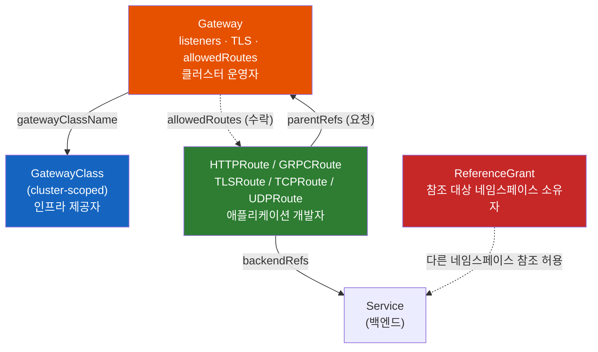
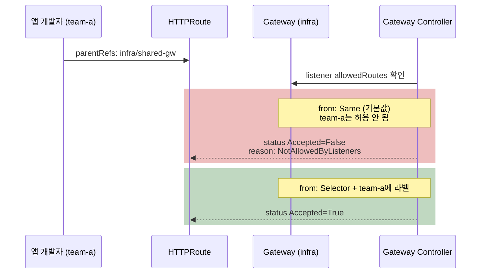
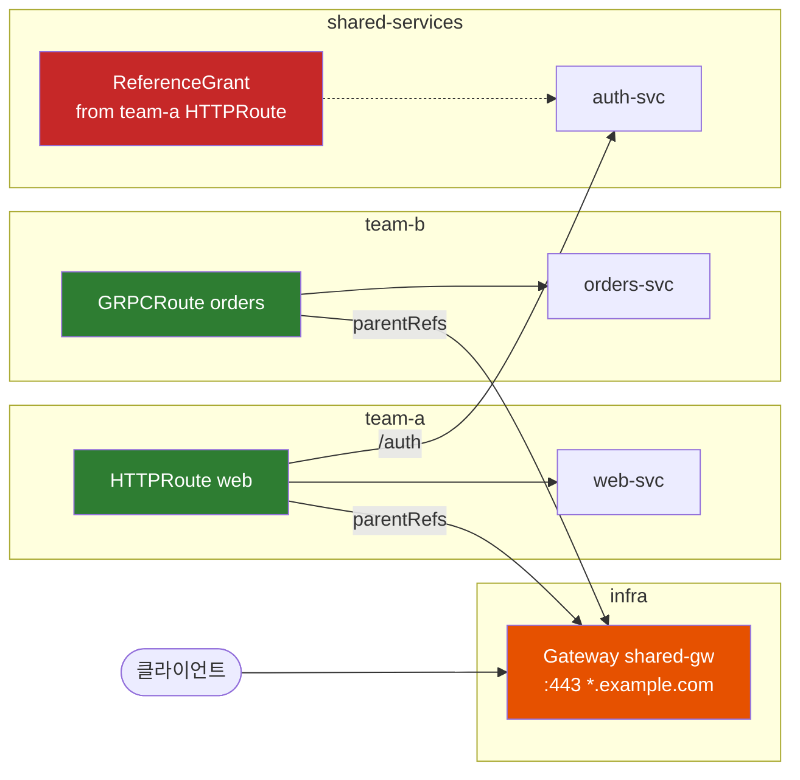

# 왜 Kubernetes Gateway API는 Ingress를 역할별로 쪼갰을까

Ingress 하나면 되던 일을 왜 GatewayClass, Gateway, HTTPRoute, ReferenceGrant 네 가지로 나눴을까? 그리고 Route를 만들었는데 트래픽이 안 들어오는 이유는 왜 대부분 "붙지 않아서"일까?

## 결론부터 말하면

**Gateway API는 Ingress의 필드를 다른 이름으로 옮긴 것이 아니다. "누가 무엇을 결정하는가"를 기준으로 리소스를 다시 나눈 것이다.** 인프라 제공자는 `GatewayClass`로 어떤 구현체를 쓸지 정하고, 클러스터 운영자는 `Gateway`로 포트·TLS·허용 네임스페이스를 정하고, 애플리케이션 개발자는 `HTTPRoute`로 경로와 백엔드를 정한다. 각자 자기 리소스만 고치면 된다.

역할을 나누면 **서로 다른 소유자의 리소스가 연결되는 지점** 이 생긴다. Gateway API는 이 연결을 **양쪽이 모두 동의해야 성립하는 핸드셰이크** 로 설계했다. Route가 `parentRefs`로 Gateway를 가리키고 Gateway의 listener가 `allowedRoutes`로 그 Route를 받아들여야 붙는다. 다른 네임스페이스의 Service나 Secret을 참조하려면 그 네임스페이스 쪽에 `ReferenceGrant`가 있어야 한다.



| 리소스 | 범위 | 누가 만드나 | 무엇을 결정하나 | Standard(GA) 편입 |
|--------|------|------------|----------------|-------------------|
| `GatewayClass` | 클러스터 | 인프라 제공자 | 어떤 컨트롤러가 처리할지 (`controllerName`) | v1.0 (2023-10) |
| `Gateway` | 네임스페이스 | 클러스터 운영자 | 주소, listener(포트·프로토콜·hostname·TLS), 붙을 수 있는 Route | v1.0 |
| `HTTPRoute` | 네임스페이스 | 앱 개발자 | 경로·헤더 매칭, 필터, 백엔드와 가중치 | v1.0 |
| `GRPCRoute` | 네임스페이스 | 앱 개발자 | gRPC service/method 매칭 | v1.1 (2024) |
| `TLSRoute` | 네임스페이스 | 앱 개발자 | SNI로 TLS 연결 분기 (Passthrough 또는 Terminate) | v1.5 (2026-02) |
| `TCPRoute` / `UDPRoute` | 네임스페이스 | 앱 개발자 | 포트 단위 L4 전달 | v1.6 (2026-06) |
| `ReferenceGrant` | 네임스페이스 | 참조 **당하는** 쪽 소유자 | 다른 네임스페이스의 참조 허용 | v1.5에서 `v1` |
| `ListenerSet` | 네임스페이스 | 팀 / 운영자 | 공유 Gateway에 listener를 따로 붙이기 | v1.5 |

> 이 노트는 2026년 9월, Gateway API **v1.6** 을 기준으로 쓴다. ingress-nginx 은퇴와 이전 경로는 [Kubernetes Ingress 12절](./Kubernetes-Ingress.md#12-2026년-현재--ingress-nginx-은퇴와-gateway-api), 메시 내부(east-west)에서 쓰는 GAMMA는 [서비스 메시 노트 6절](./Ingress-리소스가-하나도-없는데-트래픽은-어떻게-들어올까-서비스-메시가-대체하는-것들.md), 가중치로 하는 카나리 배포는 [Deployment Strategy 4.5.2](./Kubernetes-Deployment-Strategy.md)에서 다뤘다. 여기서는 리소스 모델과 "붙는 규칙"에 집중한다.

---

## 1. 왜 Ingress 하나로는 부족했나

### 1.1 Ingress 한 장에 세 사람의 결정이 섞여 있다

Ingress를 먼저 짚고 가자. **Ingress** 는 "`app.example.com/api`로 온 HTTP 요청은 `api-svc`로 보내라"는 규칙을 적는 쿠버네티스 리소스다. 규칙을 실제로 실행하는 것은 별도로 설치하는 **Ingress Controller** (NGINX, Traefik, AWS ALB 등)다.

작은 팀이라면 이 모델이 편하다. 한 사람이 Ingress 한 장에 호스트, 인증서, 경로를 모두 적으면 끝난다. 그런데 클러스터를 여러 팀이 같이 쓰기 시작하면 이상한 점이 보인다. Ingress 한 장에 적힌 내용을 결정하는 사람이 사실은 셋이다.

| Ingress의 필드 | 실제로 결정하는 사람 | 바꾸는 빈도 |
|---------------|--------------------|-----------|
| `ingressClassName` (어떤 컨트롤러) | 인프라·플랫폼 팀 | 거의 안 바뀜 |
| `tls` (어떤 인증서, 어느 호스트) | 클러스터 운영자, 보안 팀 | 인증서 갱신 때 |
| `rules` (경로 → Service) | 애플리케이션 개발자 | 배포할 때마다 |

세 사람의 결정이 한 리소스에 있으니 권한도 한 단위로만 줄 수 있다. 개발자에게 Ingress 수정 권한을 주면 경로와 함께 인증서와 호스트도 바꿀 수 있다. 반대로 운영자만 Ingress를 고치게 하면 개발자는 경로 하나를 추가할 때마다 티켓을 올려야 한다. 쿠버네티스 RBAC은 **리소스 단위** 로 권한을 주기 때문에 필드 단위로 나누는 방법이 없다.

### 1.2 표준에 없는 것은 annotation으로 흘러갔다

두 번째 문제는 표현력이다. Ingress 스펙이 표준으로 정한 것은 호스트, 경로, TLS 정도다. 헤더로 분기하기, 트래픽 10%만 새 버전에 보내기, 타임아웃, 경로 rewrite는 스펙에 없다. 그래서 컨트롤러마다 `nginx.ingress.kubernetes.io/canary-weight` 같은 **annotation** 으로 기능을 넣었다.

annotation은 쿠버네티스가 스키마 검증을 하지 않는 문자열 key-value다. 오타를 내도 `kubectl apply`는 성공하고, 컨트롤러가 조용히 무시한다. 무엇보다 **컨트롤러를 바꾸면 annotation을 전부 다시 써야 한다.** "쿠버네티스 표준 리소스"를 쓴다고 생각했는데, 실제로 기능이 들어 있는 부분은 특정 구현체 전용 문법이었던 것이다. 2026년 3월 ingress-nginx가 은퇴하면서 많은 팀이 이 비용을 한꺼번에 치르고 있다.

### 1.3 두 팀이 같은 호스트를 쓰면 어떻게 될까

세 번째 문제는 여러 팀이 쓰는 클러스터에서 드러난다. A팀과 B팀이 각자 Ingress에 `host: shop.example.com`, `path: /`를 적었다고 해보자. 어느 쪽이 이길까?

Ingress 스펙은 이 상황의 답을 정하지 않았다. 컨트롤러마다 병합하거나, 먼저 만든 쪽을 쓰거나, 나중 것으로 덮어쓴다. 게다가 **B팀이 A팀의 호스트를 가로채는 것을 막을 표준 장치가 없다.** 네임스페이스로 팀을 나눠도, 라우팅 테이블은 컨트롤러 안에서 하나로 합쳐지기 때문이다.

정리하면 Ingress의 한계는 세 가지다. 권한을 역할별로 나눌 수 없고, 고급 기능이 구현체 전용 문법에 묶여 있고, 여러 팀이 한 진입점을 안전하게 나눠 쓸 수 없다. Gateway API는 이 세 가지를 풀려고 설계됐다. 다만 세 번째는 Gateway API만으로 완전히 풀리지 않는다. 어디까지 막아 주는지는 2.4절에서 본다.

---

## 2. 핵심 개념 — 리소스 네 가지와 붙는 규칙

### 2.1 GatewayClass: "어떤 구현체로 처리할까"

**GatewayClass** 는 클러스터 전체에 하나씩 두는(cluster-scoped) 리소스로, "이 종류의 Gateway는 이 컨트롤러가 처리한다"를 선언한다. Ingress의 `IngressClass`에 해당한다.

```yaml
apiVersion: gateway.networking.k8s.io/v1
kind: GatewayClass
metadata:
  name: envoy
spec:
  controllerName: gateway.envoyproxy.io/gatewayclass-controller  # 구현체가 정한 고정 문자열
```

GatewayClass 하나는 컨트롤러 하나가 맡는다. 보통 구현체를 설치하면 GatewayClass가 함께 만들어진다. 인프라 팀이 이 리소스를 관리하고 앱 팀은 이름만 알면 된다.

### 2.2 Gateway: Ingress에는 없던 층

**Gateway** 는 "이 클러스터의 입구를 이렇게 연다"를 선언하는 리소스다. 여기에 이 설계의 핵심이 있다. Ingress 세계에는 Gateway에 해당하는 리소스가 없었다. 입구 설정은 컨트롤러의 Service(LoadBalancer)와 Ingress의 `tls` 필드에 흩어져 있었다.

Gateway에는 **listener** 가 여러 개 들어간다. listener 하나는 "이 포트에서 이 프로토콜로, 이 hostname에 대해, 이 인증서로 받는다"를 뜻한다.

```yaml
apiVersion: gateway.networking.k8s.io/v1
kind: Gateway
metadata:
  name: shared-gw
  namespace: infra                 # 운영자가 관리하는 네임스페이스
spec:
  gatewayClassName: envoy
  listeners:
  - name: https                    # Route가 sectionName으로 고를 수 있는 이름
    port: 443
    protocol: HTTPS
    hostname: "*.example.com"
    tls:
      mode: Terminate              # Gateway에서 TLS를 풀고 HTTP로 라우팅
      certificateRefs:
      - name: wildcard-cert        # 같은 네임스페이스의 Secret
    allowedRoutes:
      namespaces:
        from: Selector             # 라벨이 붙은 네임스페이스의 Route만 받는다
        selector:
          matchLabels:
            gateway-access: "true"
```

Gateway를 만들면 구현체가 실제 데이터 플레인(Envoy Pod, 클라우드 로드밸런서 등)을 만들거나 연결한다. 방식은 구현체마다 다르다. Envoy Gateway나 Istio는 Gateway마다 프록시 Deployment와 Service를 새로 띄우고, GKE는 Google Cloud 로드밸런서를 만든다. 그래서 "Gateway 하나 = 외부 IP 하나"가 되는 구현체가 많고, 이 점은 비용 설계에 영향을 준다.

### 2.3 Route: 프로토콜별로 나뉜 라우팅 규칙

**Route** 는 "들어온 요청을 어느 백엔드로 보낼까"를 적는 리소스다. Ingress는 HTTP만 다뤘지만 Gateway API는 프로토콜별로 Route 종류를 나눴다.

| Route | 무엇을 보고 분기하나 | 대표 용도 |
|-------|-------------------|----------|
| `HTTPRoute` | hostname, path, header, query, method | 일반 웹·API |
| `GRPCRoute` | gRPC service, method, header | gRPC 마이크로서비스 |
| `TLSRoute` | TLS의 SNI | listener가 `Passthrough`면 복호화 없이 백엔드로 넘기고(백엔드가 TLS 종료), `Terminate`면 Gateway가 TLS를 풀고 TCP 스트림을 넘긴다 |
| `TCPRoute` / `UDPRoute` | listener 포트 | DB, DNS, 게임 서버처럼 L7 정보가 없는 트래픽 |

HTTPRoute에서 Ingress annotation이 하던 일은 **스키마가 있는 필드** 가 됐다. 헤더 매칭은 `matches.headers`, 가중치는 `backendRefs[].weight`, rewrite·리다이렉트·헤더 수정은 `filters`로 쓴다. 필드 이름이 틀리면 API 서버가 거부하고, 구현체를 바꿔도 같은 YAML이 동작한다.

충돌 규칙도 스펙이 정한다. 같은 요청에 여러 Route 규칙이 맞으면 더 구체적인 쪽(정확한 hostname, 긴 경로, 헤더 매치가 많은 쪽 등)이 이긴다. 조건이 같으면 **먼저 만든 Route** 가, 만든 시각도 같으면 `namespace/name` 알파벳 순서로 앞선 쪽이 이긴다. 1.3절에서 컨트롤러마다 달랐던 결과가 구현체와 상관없이 하나로 정해진다.

### 2.4 붙이기: 양쪽이 동의해야 성립한다

역할을 나누면 새로운 문제가 생긴다. **앱 팀의 Route가 운영 팀의 Gateway에 어떻게 연결되는가?** Route가 원하는 Gateway를 마음대로 고를 수 있다면 1.3절의 호스트 가로채기가 그대로 남는다. Gateway가 Route를 일일이 지정해야 한다면, 개발자가 경로를 추가할 때마다 운영자에게 요청해야 하는 1.1절의 문제로 돌아간다.

Gateway API는 **양방향 핸드셰이크** 로 이 문제를 푼다. 두 조건이 모두 맞아야 Route가 붙는다.

1. **Route가 요청한다.** `spec.parentRefs`에 붙고 싶은 Gateway를 적는다. `sectionName`을 쓰면 특정 listener만 고를 수 있다.
2. **Gateway listener가 수락한다.** listener의 `allowedRoutes`가 Route를 허용해야 한다.

`allowedRoutes.namespaces.from`의 값은 세 가지다.

| 값 | 의미 | 쓰는 경우 |
|----|------|----------|
| `Same` **(기본값)** | Gateway와 같은 네임스페이스의 Route만 | 팀 전용 Gateway |
| `Selector` | 라벨 셀렉터에 맞는 네임스페이스의 Route만 | 여러 팀이 쓰는 공유 Gateway (권장) |
| `All` | 모든 네임스페이스 | 신뢰하는 단일 팀 클러스터 |

여기서 가장 흔한 함정이 나온다. **기본값이 `Same`** 이다. 운영자가 `infra` 네임스페이스에 Gateway를 만들고 `allowedRoutes`를 적지 않으면, 다른 네임스페이스의 HTTPRoute는 `parentRefs`를 제대로 적어도 붙지 않는다. `kubectl apply`는 성공하므로 에러도 보이지 않는다.



hostname에도 비슷한 규칙이 있다. Route의 `hostnames`와 listener의 `hostname`이 겹치는 부분이 있어야 붙는다. listener가 `*.example.com`인데 Route가 `api.other.com`이면 `NoMatchingListenerHostname`으로 거부된다. 운영자가 listener hostname으로 테두리를 치고, 앱 팀은 그 안에서만 호스트를 고른다.

그렇다면 1.3절의 호스트 가로채기는 완전히 막혔을까? **아니다.** Gateway API가 막아 주는 것은 두 가지다. 허락받지 않은 네임스페이스는 `allowedRoutes`에서 걸러지고, 허락받은 네임스페이스도 listener hostname 밖의 도메인은 쓸 수 없다. 하지만 `Selector`로 허용된 A팀과 B팀이 **둘 다** `shop.example.com`을 선언하는 것은 막지 않는다. 이때는 2.3절의 우선순위 규칙이 이긴 쪽을 정할 뿐이고, 누가 그 hostname의 주인인지는 확인하지 않는다. 이긴 쪽이 구현체와 상관없이 같다는 점만 Ingress보다 나아진 것이다.

팀별 hostname 소유권까지 보장하려면 두 가지 방법이 있다. 하나는 **팀마다 listener를 따로 두는 것** 이다. listener마다 `hostname`을 `a.example.com`처럼 고정하고 `allowedRoutes`를 그 팀 네임스페이스로만 열면, 다른 팀은 그 hostname에 붙을 수 없다. 2.6절의 ListenerSet이 이 방식을 팀에게 맡기는 도구다. 다른 하나는 `ValidatingAdmissionPolicy` 같은 **admission 정책** 으로 "이 네임스페이스는 이 hostname만 쓸 수 있다"를 강제하는 것이다.

### 2.5 ReferenceGrant: 참조 당하는 쪽이 허락한다

Route가 Gateway에 붙는 문제는 풀렸다. 그런데 참조는 이것만 있는 게 아니다. `team-a`의 HTTPRoute가 `shared-services` 네임스페이스의 `auth-svc`로 트래픽을 보내고 싶다면? `infra`의 Gateway가 `certs` 네임스페이스에 있는 인증서 Secret을 쓰고 싶다면?

네임스페이스를 넘는 참조를 그냥 허용하면 위험하다. 공격자가 자기 네임스페이스에 HTTPRoute를 만들고 `backendRefs`에 다른 팀의 내부 Service를 적으면, **컨트롤러가 대신 트래픽을 보내준다.** 컨트롤러는 모든 네임스페이스를 볼 권한이 있기 때문이다. 권한 있는 대리인이 권한 없는 사용자의 요청을 대신 수행하는 이런 공격을 **confused deputy** 라고 부른다. 실제로 Ingress·Endpoints 쪽에서 CVE-2021-25740이 이 유형으로 보고됐다.

**ReferenceGrant** 는 이 문제를 푸는 리소스다. 규칙은 하나다. **참조를 당하는 쪽 네임스페이스의 소유자가 ReferenceGrant를 만들어야 한다.**

```yaml
apiVersion: gateway.networking.k8s.io/v1   # v1.5부터 v1
kind: ReferenceGrant
metadata:
  name: allow-team-a-routes
  namespace: shared-services   # 참조 "대상"이 있는 네임스페이스에 만든다
spec:
  from:                        # 누가 참조하나
  - group: gateway.networking.k8s.io
    kind: HTTPRoute
    namespace: team-a
  to:                          # 무엇을 참조하게 허락하나
  - group: ""                  # core API group
    kind: Service
    # name을 생략하면 이 네임스페이스의 모든 Service
```

ReferenceGrant가 필요한 곳과 필요 없는 곳은 다음과 같다.

| 참조 | 필요한 것 |
|------|----------|
| Route `backendRefs` → 다른 네임스페이스 Service | 대상 네임스페이스에 **ReferenceGrant** |
| Gateway `certificateRefs` → 다른 네임스페이스 Secret | 대상 네임스페이스에 **ReferenceGrant** |
| Route `parentRefs` → 다른 네임스페이스 Gateway | ReferenceGrant 불필요. Gateway의 **allowedRoutes** 가 대신한다 (2.4절) |

ReferenceGrant가 없으면 Route는 붙지만 해당 백엔드로 보낼 수 없다. status에 `ResolvedRefs=False`, reason `RefNotPermitted`가 찍힌다.

### 2.6 ListenerSet: 공유 Gateway의 listener를 팀에게 맡기기

2.4절까지의 모델에는 빈틈이 하나 남아 있었다. **listener는 Gateway 안에만 적을 수 있었다.** 팀마다 자기 호스트와 인증서로 HTTPS listener를 추가하려면 운영 팀의 Gateway 리소스를 직접 고쳐야 했다. 역할을 나눴는데 listener만은 다시 한 리소스에 모이는 셈이다. 그리고 Gateway 하나에는 listener를 64개까지만 넣을 수 있다.

v1.5에서 Standard가 된 **ListenerSet** 이 이 빈틈을 메운다. 팀이 자기 네임스페이스에 listener 묶음을 만들고 공유 Gateway에 붙인다. Gateway 쪽은 `allowedListeners`로 받아들일 네임스페이스를 정한다. Route와 같은 양방향 핸드셰이크다.

```yaml
# 운영자: listener 위임을 허용
apiVersion: gateway.networking.k8s.io/v1
kind: Gateway
metadata:
  name: shared-gw
  namespace: infra
spec:
  gatewayClassName: envoy
  allowedListeners:
    namespaces:
      from: Selector
      selector:
        matchLabels:
          gateway-access: "true"
  listeners:
  - name: http
    port: 80
    protocol: HTTP
---
# team-a: 자기 호스트와 인증서로 listener 추가
apiVersion: gateway.networking.k8s.io/v1
kind: ListenerSet
metadata:
  name: team-a-listeners
  namespace: team-a
spec:
  parentRef:
    name: shared-gw
    namespace: infra
  listeners:
  - name: https-a
    port: 443
    protocol: HTTPS
    hostname: a.example.com
    tls:
      certificateRefs:
      - name: a-cert             # team-a 네임스페이스의 Secret
```

Route를 ListenerSet의 listener에 붙일 때는 `parentRefs`에 Gateway가 아니라 ListenerSet을 적는다(`kind: ListenerSet`, `name: team-a-listeners`, 필요하면 `sectionName: https-a`). 공유 Gateway를 가리키면 ListenerSet의 listener에는 붙지 않는다.

ListenerSet은 비교적 새 기능이라 구현체마다 지원 여부가 다르다. 쓰기 전에 5절의 conformance 표에서 `ListenerSet` 기능을 확인한다.

---

## 3. 실제 사례 — 공유 Gateway 하나를 두 팀이 쓰기

### 3.1 전체 구성

`infra` 네임스페이스의 Gateway 하나를 `team-a`(웹)와 `team-b`(gRPC)가 나눠 쓰고, `team-a`는 `shared-services`의 인증 서비스도 호출한다고 하자.



운영자는 2.2절의 Gateway를 만들고 두 팀 네임스페이스에 라벨을 붙인다.

```bash
kubectl label namespace team-a gateway-access=true
kubectl label namespace team-b gateway-access=true
```

### 3.2 team-a의 HTTPRoute

Ingress였다면 annotation이 필요했을 헤더 분기와 경로 rewrite가 모두 표준 필드로 들어간다.

```yaml
apiVersion: gateway.networking.k8s.io/v1
kind: HTTPRoute
metadata:
  name: web
  namespace: team-a
spec:
  parentRefs:
  - name: shared-gw
    namespace: infra
    sectionName: https          # 2.2절의 listener 이름
  hostnames:
  - shop.example.com            # listener의 *.example.com 안쪽이어야 붙는다
  rules:
  - matches:                    # 베타 테스터 헤더가 있으면 v2로
    - path: { type: PathPrefix, value: / }
      headers:
      - name: x-beta
        value: "true"
    backendRefs:
    - name: web-v2
      port: 8080
  - matches:                    # /auth는 다른 네임스페이스로 (ReferenceGrant 필요)
    - path: { type: PathPrefix, value: /auth }
    filters:
    - type: URLRewrite          # /auth/login → /login
      urlRewrite:
        path:
          type: ReplacePrefixMatch
          replacePrefixMatch: /
    backendRefs:
    - name: auth-svc
      namespace: shared-services
      port: 8080
  - matches:
    - path: { type: PathPrefix, value: / }
    backendRefs:
    - name: web-svc
      port: 8080
```

`/auth` 규칙은 2.5절의 ReferenceGrant가 `shared-services`에 있어야 동작한다.

### 3.3 team-b의 GRPCRoute

gRPC는 HTTP/2 위에서 `/패키지.서비스/메서드` 경로로 요청을 보낸다. HTTPRoute로 경로 매칭을 해도 되지만, GRPCRoute는 service와 method를 필드로 받으므로 의도가 더 분명하다.

```yaml
apiVersion: gateway.networking.k8s.io/v1
kind: GRPCRoute
metadata:
  name: orders
  namespace: team-b
spec:
  parentRefs:
  - name: shared-gw
    namespace: infra
  hostnames:
  - grpc.example.com
  rules:
  - matches:
    - method:
        service: shop.v1.OrderService   # 메서드를 생략하면 서비스 전체
    backendRefs:
    - name: orders-svc
      port: 9090
```

### 3.4 "Route를 만들었는데 안 된다" 진단 순서

Gateway API의 장점 하나는 **연결 결과가 status에 남는다** 는 것이다. Ingress에서는 컨트롤러 로그를 뒤져야 했던 정보를 `kubectl`로 볼 수 있다.

```bash
# 1. Gateway가 준비됐고 주소를 받았는가
kubectl get gateway -n infra shared-gw        # PROGRAMMED=True, ADDRESS 확인

# 2. Route가 붙었는가, 백엔드 참조가 풀렸는가
kubectl get httproute -n team-a web -o jsonpath='{range .status.parents[*]}{.parentRef.name}{"\n"}{range .conditions[*]}  {.type}={.status} {.reason}{"\n"}{end}{end}'

# 3. listener마다 붙은 Route 수
kubectl get gateway -n infra shared-gw -o jsonpath='{range .status.listeners[*]}{.name}: {.attachedRoutes}{"\n"}{end}'
```

| status | 흔한 원인 | 조치 |
|--------|----------|------|
| `Accepted=False` / `NotAllowedByListeners` | `allowedRoutes` 기본값 `Same`, 네임스페이스 라벨 누락 | listener의 `allowedRoutes`와 네임스페이스 라벨 확인 |
| `Accepted=False` / `NoMatchingListenerHostname` | Route `hostnames`가 listener `hostname` 밖에 있음 | hostname 맞추기 |
| `Accepted=False` / `NoMatchingParent` | `sectionName`·`port` 오타, listener 없음 | Gateway listener 이름 확인 |
| `ResolvedRefs=False` / `RefNotPermitted` | 다른 네임스페이스 백엔드에 ReferenceGrant 없음 | **대상** 네임스페이스에 ReferenceGrant 생성 |
| `ResolvedRefs=False` / `BackendNotFound` | Service 이름·포트 오류 | `kubectl get svc` 확인 |
| status는 모두 `True`인데 요청이 timeout | 백엔드 네임스페이스의 default-deny `NetworkPolicy`가 Gateway 프록시 Pod(`infra`)의 트래픽을 막음 | `allowedRoutes`·ReferenceGrant는 컨트롤러의 설정 허가일 뿐이다. 백엔드 쪽 NetworkPolicy에 Gateway Pod로부터의 ingress 규칙을 연다 |
| status가 아예 비어 있음 | 처리 결과를 보고한 컨트롤러가 없음 | `parentRefs`가 가리키는 Gateway가 실제로 있는지, 그 Gateway의 GatewayClass가 `ACCEPTED`인지, 해당 컨트롤러가 떠 있는지 차례로 확인 |

마지막 줄이 가장 헷갈린다. status가 비어 있는 것은 거부된 것이 아니다. **아무 컨트롤러도 그 Route를 자기 담당으로 보지 않았다는 뜻** 이다. 컨트롤러는 자기 GatewayClass에 속한 Gateway를 가리키는 Route만 처리하므로, `parentRefs`의 이름·네임스페이스 오타만으로도 이렇게 된다.

---

## 4. Ingress에서 옮기기 — ingress2gateway

기존 Ingress가 많다면 공식 변환 도구 **ingress2gateway** 로 시작한다. 2026년 기준 v1.0이 Gateway API v1.5 리소스를 생성하고, ingress-nginx, Traefik, Istio, Kong, Cilium, GCE, APISIX 등의 Ingress를 읽는다.

```bash
# 현재 kubeconfig 클러스터의 ingress-nginx Ingress를 읽어 Gateway API YAML로 출력 (적용은 하지 않음)
ingress2gateway print --providers=ingress-nginx --all-namespaces > gateway-resources.yaml

# 클러스터 대신 파일로 입력
ingress2gateway print --providers=ingress-nginx --input-file=ingress.yaml
```

변환되는 것과 안 되는 것의 경계를 알고 시작해야 한다.

| 자동 변환됨 | 직접 다시 설계해야 함 |
|------------|---------------------|
| `ingressClassName` → `gatewayClassName` | 컨트롤러별 annotation (rate limit, 인증, `configuration-snippet` 등) |
| `tls[].hosts` / `secretName` → HTTPS listener + `certificateRefs` | 네임스페이스 구조 (Gateway를 어디 두고 `allowedRoutes`를 어떻게 열지) |
| `rules[].host` → `hostnames` | 다른 네임스페이스 참조에 필요한 ReferenceGrant |
| path / pathType / backend → HTTPRoute `matches` + `backendRefs` | 구현체 고유 정책 리소스 (타임아웃·재시도 세부 설정 등) |
| 지원 목록에 있는 annotation의 **동작** (ingress-nginx는 CORS·backend TLS·정규식 매칭·rewrite 등 30개 이상) | 지원 목록에 없거나 의미가 딱 맞지 않는 annotation (경고로 표시됨) |

도구 README는 "annotation을 옮기려는 도구가 아니다"라고 밝힌다. annotation 문자열을 Gateway API 리소스에 그대로 **복사하지 않는다** 는 뜻이다. 지원하는 annotation은 그 동작을 Gateway API 필드로 **변환한다**. 2026년 3월 v1.0 발표 기준으로 ingress-nginx annotation 30개 이상이 여기에 해당한다. 지원하지 않거나 의미가 완전히 대응하지 않는 항목은 경고로 표시되고, 이 부분은 사람이 옮겨야 한다. 실무 순서는 다음과 같다.

1. `print`로 결과를 뽑아 **경고 목록** 부터 본다. 이전 작업량은 여기서 정해진다.
2. 변환 결과를 그대로 쓰지 말고 **Gateway를 공유할지, 네임스페이스를 어떻게 나눌지** 먼저 정한다. 도구는 Ingress마다 Gateway를 만들 수 있는데, 구현체에 따라서는 Gateway마다 로드밸런서가 생긴다.
3. 새 Gateway를 **다른 IP로** 띄우고, 같은 요청을 양쪽에 보내 응답을 비교한다.
4. DNS를 새 주소로 옮기고, 한동안 Ingress를 남겨 뒀다가 지운다.

---

## 5. 구현체와 CRD 고르기

### 5.1 Gateway API는 쿠버네티스에 기본으로 들어 있지 않다

Ingress API는 쿠버네티스 본체에 들어 있다. Gateway API는 **CRD로 따로 설치** 한다. 그래서 클러스터 버전과 Gateway API 버전이 따로 움직인다. v1.5·v1.6은 쿠버네티스 1.30 이상에서 쓸 수 있다(TLSRoute의 CEL 검증은 1.31 이상 필요).

CRD는 두 채널로 배포된다.

| 채널 | 들어 있는 것 | 권장 |
|------|------------|------|
| **Standard** | GA 리소스와 필드만. 하위 호환 보장 | 운영 클러스터 기본 |
| **Experimental** | Standard + 실험 리소스·필드. 깨지는 변경 가능 | 특정 기능이 꼭 필요할 때만 |

v1.6부터 **새로 추가되는** 실험 리소스는 별도 API group `gateway.networking.x-k8s.io`에 정의되고 이름에 `X`가 붙는다(`XBackend`, `XMesh` 등). GA가 되면 `gateway.networking.k8s.io`로 옮기고 `X`를 뗀다. 다만 이 규칙은 앞으로 추가되는 리소스에만 적용된다. 이전부터 있던 실험 API는 여전히 `gateway.networking.k8s.io/v1alpha2`·`v1alpha3` 같은 버전으로 남아 있으므로, API group만 보고 Standard라고 판단하면 안 된다. 설치한 릴리스의 CRD 채널과 `apiVersion`의 버전 문자열을 함께 확인한다.

설치할 때 함정이 두 가지 있다.

- **CRD를 누가 설치하나.** 많은 구현체가 Helm 차트에 Gateway API CRD를 포함한다. 구현체 두 개를 설치하거나 클라우드가 CRD를 관리하는 클러스터(GKE 등)에 차트로 다시 설치하면 CRD 버전이 서로 덮어쓰인다. 클러스터에서 CRD 설치 주체를 하나로 정한다.
- **Experimental CRD는 `kubectl apply --server-side=true`로 설치한다.** 크기가 커서 일반 apply가 annotation 크기 제한에 걸린다. v1.5부터는 채널을 잘못 바꾸거나 버전을 낮추는 위험한 작업을 막는 `safe-upgrades.gateway.networking.k8s.io` ValidatingAdmissionPolicy가 함께 설치된다.

### 5.2 구현체 선택

구현체마다 Gateway API를 얼마나 지원하는지는 공식 **conformance 보고서** 로 확인한다. 기능은 **Core** (모든 구현체가 반드시 지원), **Extended** (선택 지원, 지원한다면 스펙대로), **Implementation-specific** 세 단계로 나뉜다. 헤더 매칭은 Core지만 URL rewrite, 요청 미러링, 재시도는 Extended다. 쓰려는 기능이 Extended라면 보고서에서 그 기능 칸을 확인해야 한다.

| 상황 | 후보 | 이유 |
|------|------|------|
| 벤더 중립, Gateway API 네이티브 | **Envoy Gateway**, kgateway | 처음부터 Gateway API를 기준으로 만든 Envoy 기반 구현 |
| 이미 Istio 메시 사용 | **Istio** | ingress와 메시(GAMMA)를 같은 API로 |
| Cilium CNI 사용 | **Cilium** | 별도 프록시 설치 없이 CNI에 통합 |
| 기존 Ingress와 함께 운영 | **Traefik** | 컨트롤러 하나가 Ingress와 Gateway API를 동시에 처리해 점진 이전 가능 |
| NGINX 계열 유지 | **NGINX Gateway Fabric** | Gateway API 전용 구현체다. 기존 Ingress는 처리하지 않으므로 Ingress Controller와 나란히 두고 리소스를 변환하며 옮긴다 |
| 관리형 클라우드 LB | **GKE Gateway**, **AWS Load Balancer Controller** | 클라우드 LB를 직접 프로비저닝 (AWS는 2026년 기준 부분 conformance) |

---

## 6. 정리

### 핵심 포인트

1. **Gateway API는 리소스를 "누가 결정하나"로 나눴다**
   - `GatewayClass`(인프라) · `Gateway`(운영자) · `*Route`(개발자). Ingress 한 장에 섞여 있던 권한을 RBAC으로 따로 줄 수 있다.

2. **연결은 양쪽이 동의해야 성립한다**
   - Route의 `parentRefs`와 listener의 `allowedRoutes`가 모두 맞아야 붙는다. `allowedRoutes` 기본값은 `Same`이라, 다른 네임스페이스 Route가 안 붙는 가장 흔한 원인이다.

3. **다른 네임스페이스의 백엔드·Secret 참조는 참조 당하는 쪽이 허락한다**
   - 대상 네임스페이스에 `ReferenceGrant`를 둔다. confused deputy 공격을 막는 장치다. Route → Gateway 연결은 예외로 `allowedRoutes`가 담당한다.

4. **annotation이 표준 필드가 됐고, 결과는 status에 남는다**
   - 헤더 매칭·가중치·rewrite를 스키마 필드로 쓰고, 안 붙으면 `Accepted`/`ResolvedRefs` condition의 reason으로 원인을 바로 본다.

5. **2026년 9월 기준 최신은 v1.6**
   - HTTP·gRPC·TLS·TCP·UDP Route와 ReferenceGrant, ListenerSet이 모두 Standard다. CRD는 따로 설치하고 설치 주체는 하나로 정한다. 기능 지원 여부는 conformance 보고서로 확인한다.

> 📖 관련 문서:
> - [Kubernetes Ingress](./Kubernetes-Ingress.md) — Ingress 기본과 12절 ingress-nginx 은퇴
> - [Ingress 리소스가 하나도 없는데 트래픽은 어떻게 들어올까](./Ingress-리소스가-하나도-없는데-트래픽은-어떻게-들어올까-서비스-메시가-대체하는-것들.md) — 6절 GAMMA, `parentRef`가 Service를 가리키는 메시 라우팅
> - [Kubernetes Deployment Strategy](./Kubernetes-Deployment-Strategy.md) — 4.5.2 HTTPRoute `weight`로 하는 카나리
> - [쿠버네티스 Ingress와 Egress는 왜 대칭이 아닐까](./쿠버네티스-Ingress와-Egress는-왜-대칭이-아닐까.md) — Ingress 동결과 Gateway API 전망

---

## 출처

- [Gateway API 공식 문서](https://gateway-api.sigs.k8s.io/) — 공식 문서. 리소스 모델, 역할(persona), Route 연결 규칙
- [Gateway API — ReferenceGrant](https://gateway-api.sigs.k8s.io/reference/api-types/referencegrant) — 공식 문서. 참조 대상 네임스페이스에 생성, Core conformance 요구 사항
- [Gateway API — API Reference](https://gateway-api.sigs.k8s.io/reference/api-spec/main/spec) — 공식 스펙. Route-Gateway 연결이 ReferenceGrant 예외라는 규정, status reason 목록
- [gateway-api `apis/v1/shared_types.go`](https://github.com/kubernetes-sigs/gateway-api/blob/main/apis/v1/shared_types.go) — `RouteConditionReason` 상수 정의 (`NotAllowedByListeners`, `RefNotPermitted` 등 3.4절 진단 표의 reason 문자열)
- [Gateway API — Implementer's Guide](https://gateway-api.sigs.k8s.io/guides/implementers-guide) — 공식 문서. Core/Extended 기능 구분
- [Gateway API — Implementations](https://gateway-api.sigs.k8s.io/implementations/) — 공식 conformance 구현체 목록
- [GEP-709: Cross Namespace References from Routes](https://gateway-api.sigs.k8s.io/geps/gep-709) — ReferenceGrant 설계 배경, CVE-2021-25740과 confused deputy
- [Gateway API v1.6: TCPRoute and UDPRoute Graduate to Standard (Kubernetes Blog, 2026-08-03)](https://kubernetes.io/blog/2026/08/03/gateway-api-v1-6-release) — v1.6.0(2026-06-30), TCPRoute·UDPRoute GA, 실험 API group `gateway.networking.x-k8s.io`
- [Gateway API v1.5: Moving features to Stable (Kubernetes Blog, 2026-04-21)](https://kubernetes.io/blog/2026/04/21/gateway-api-v1-5) — v1.5(2026-02-27), ListenerSet·TLSRoute·CORS·ReferenceGrant v1, 쿠버네티스 1.30 이상
- [Gateway API 1.4: New Features (Kubernetes Blog, 2025-11-06)](https://kubernetes.io/blog/2025/11/06/gateway-api-v1-4) — v1.4에서 GRPCRoute CRD의 `spec` 필드가 필수가 된 변경 (GRPCRoute 자체는 v1.1부터 Standard)
- [kubernetes-sigs/gateway-api Releases](https://github.com/kubernetes-sigs/gateway-api/releases) — Experimental CRD server-side apply 안내, safe-upgrades VAP
- [Ingress2Gateway v1.0 (Kubernetes Blog, 2026-03-20)](https://kubernetes.io/blog/2026/03/20/ingress2gateway-1-0-release/) — ingress-nginx annotation 30개 이상 변환 지원
- [kubernetes-sigs/ingress2gateway](https://github.com/kubernetes-sigs/ingress2gateway) — 공식 변환 도구. 지원 provider, 변환 범위, annotation 비변환 원칙
