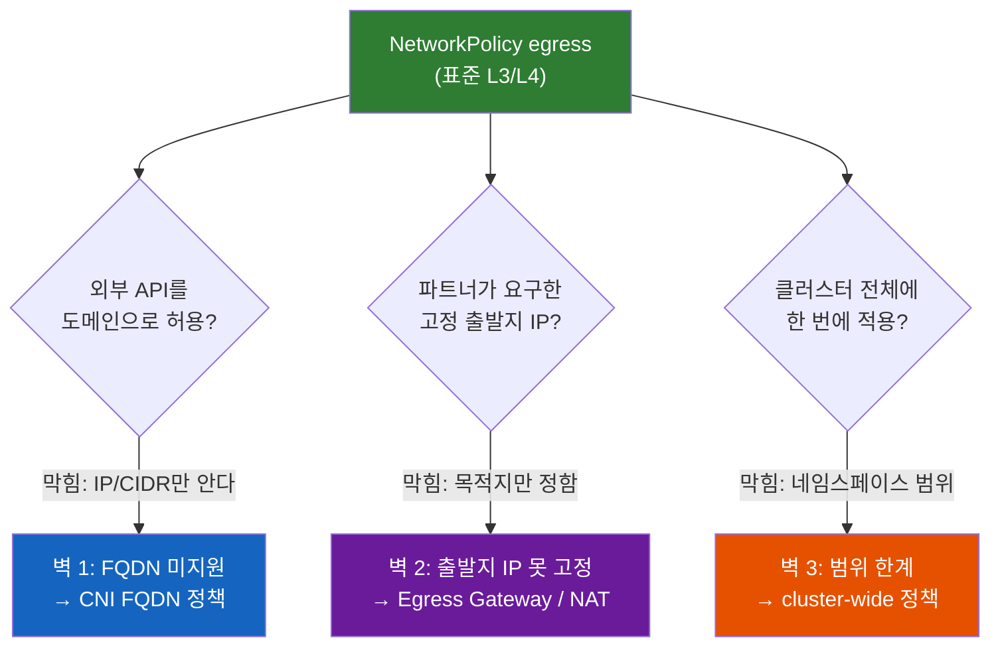
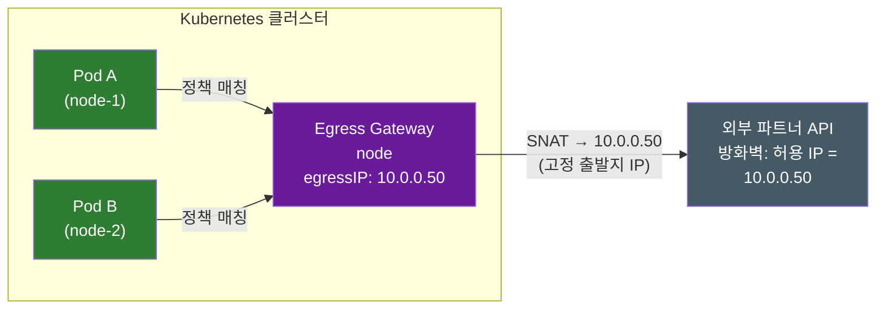
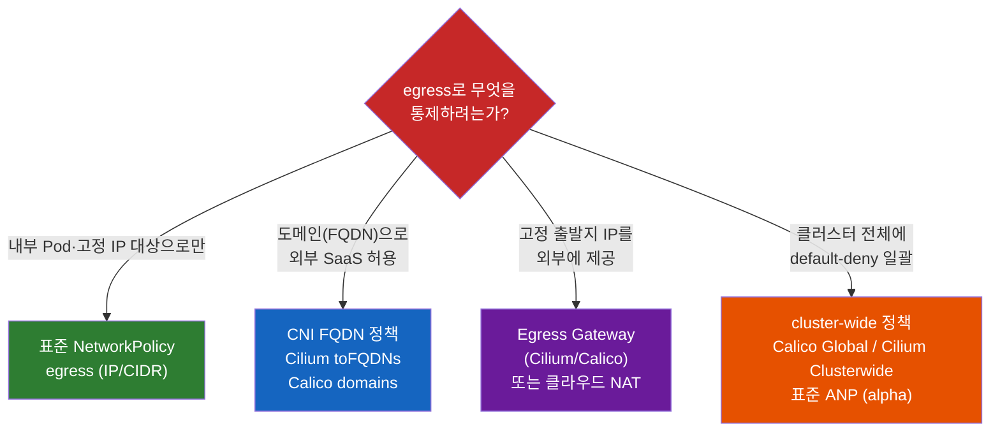

# 쿠버네티스 Egress 통제는 왜 NetworkPolicy 하나로 끝나지 않을까

프로덕션 클러스터를 잠그는 첫 단추는 보통 이렇게 시작한다. 네임스페이스에 `default-deny-egress`를 깔고, Pod가 통신을 시작할 수 있게 DNS(53 포트)만 열어준다. (`kind: Egress` 리소스가 따로 없고 NetworkPolicy의 `egress` 필드로 나가는 트래픽을 다룬다는 이야기, default-deny와 DNS 함정은 [[쿠버네티스-Ingress와-Egress는-왜-대칭이-아닐까]]에서 다뤘다.)

여기까지 오면 다음 요구가 자연스럽게 따라온다. **"이제 우리 결제 서비스가 외부 결제 게이트웨이(`api.payment.com`)랑 S3에만 나갈 수 있게 허용하자."** NetworkPolicy의 `egress`에 그 도메인을 적으려고 YAML을 여는 순간, 첫 번째 벽에 부딪힌다. **거기엔 도메인을 적는 칸이 없다.**

이 글은 그 벽에서 출발한다. 표준 NetworkPolicy로 egress를 잠그려다 만나는 **세 개의 벽**, 그리고 각각을 넘는 실무 도구를 YAML 수준에서 정리한다.

---

## 결론부터 말하면

표준 NetworkPolicy의 `egress`는 "나가는 트래픽을 제어한다"는 첫 단계까지만 책임진다. 현실의 egress 요구는 그 경계 밖에서 세 번 막힌다.



| 벽 | 표준 NetworkPolicy의 한계 | 넘는 도구 |
|----|--------------------------|-----------|
| **1. FQDN을 모른다** | 목적지를 IP/CIDR로만 지정. `api.payment.com` 같은 도메인 불가 | CNI FQDN 정책 (Cilium `toFQDNs`, Calico `domains`), GKE FQDNNetworkPolicy |
| **2. 출발지 IP를 못 고정한다** | "어디로 나갈지"만 정하고 "어떤 IP로 나갈지"는 정하지 못함 | Egress Gateway (Cilium·Calico), 클라우드 NAT Gateway |
| **3. 네임스페이스 범위다** | 정책이 한 네임스페이스 안에서만 유효 | cluster-wide 정책 (Calico Global, Cilium Clusterwide, 표준 AdminNetworkPolicy) |

핵심은 이거다. **egress 통제는 "NetworkPolicy"라는 단일 도구가 아니라, "무엇을 통제하려는가"에 따라 골라 쌓는 도구 스택이다.** 표준 리소스가 멈추는 지점을 알아야 그 다음 도구를 꺼낼 수 있다. 벽을 하나씩 넘어보자.

---

## 1. 첫 번째 벽 — NetworkPolicy는 도메인을 모른다

### 1-1. 왜 IP/CIDR만 되는가

표준 NetworkPolicy의 egress 규칙에서 외부 목적지를 지정하는 방법은 `ipBlock` 하나뿐이다.

```yaml
apiVersion: networking.k8s.io/v1
kind: NetworkPolicy
metadata:
  name: allow-egress-payment
  namespace: payment
spec:
  podSelector:
    matchLabels:
      app: checkout
  policyTypes:
  - Egress
  egress:
  - to:
    - ipBlock:
        cidr: 203.0.113.10/32   # ← IP만 적을 수 있다. 도메인 칸이 없다.
    ports:
    - protocol: TCP
      port: 443
```

`to:` 아래에 올 수 있는 건 `ipBlock`, `namespaceSelector`, `podSelector` 셋뿐이다. **`api.payment.com`이라고 적을 자리가 애초에 스키마에 없다.** 이건 버그가 아니라 설계다.

이유는 NetworkPolicy가 동작하는 계층에 있다. NetworkPolicy는 CNI 플러그인이 커널의 패킷 필터(iptables/eBPF)로 집행하는 **L3/L4 규칙**이다. 패킷이 흐르는 순간 커널이 보는 건 출발지/목적지 **IP와 포트**일 뿐, "이 패킷이 원래 어떤 도메인으로 향했는지"는 패킷 어디에도 적혀 있지 않다. 도메인→IP 변환(DNS)은 그보다 한참 앞, 애플리케이션이 연결을 맺기 전에 이미 끝나버린 별개의 사건이다. 그래서 IP 필터는 도메인을 알 길이 없다.

### 1-2. "그럼 S3 IP를 다 적으면 되잖아"가 안 되는 이유

여기서 흔한 반격이 나온다. "도메인이 안 되면 그 도메인의 IP를 전부 `ipBlock`에 적으면 되지 않나?" 결제 게이트웨이가 IP 한두 개면 그럴 수도 있다. 문제는 클라우드 SaaS다.

S3, `*.amazonaws.com`, 외부 모니터링(Datadog 등) 같은 엔드포인트는 **수백 개의 IP로 흩어져 있고, 그 IP 목록이 예고 없이 바뀐다.** 오늘 적어둔 CIDR이 내일 무효가 되면, 정책은 조용히 트래픽을 막거나(서비스 장애) 너무 넓게 열어둔(보안 구멍) 상태가 된다. IP를 손으로 관리하는 순간 정책은 깨지기로 예약된 셈이다.

즉 첫 번째 벽의 본질은 **"우리가 통제하고 싶은 단위(도메인)와 NetworkPolicy가 아는 단위(IP)가 다르다"**는 불일치다.

---

## 2. 벽 1을 넘기 — DNS를 가로채는 FQDN 정책

### 2-1. 아이디어: 정책 엔진이 DNS 응답을 엿본다

해법의 발상은 단순하다. **Pod가 던지는 DNS 질의의 응답을 정책 엔진이 가로채서, "이 도메인 → 방금 이 IP로 풀렸다"를 실시간으로 학습하고 IP allowlist를 자동 갱신한다.** 관리자는 도메인만 적고, IP 추적은 엔진이 대신한다. 이게 FQDN 기반 egress 정책이다.

단, **이건 표준 Kubernetes NetworkPolicy 기능이 아니다.** 공식 Network Policy API 프로젝트도 이 점을 명시한다 — 표준 NetworkPolicy v1은 FQDN egress 셀렉터를 지원하지 않으며, 이 공백을 메우려는 제안 NPEP-133("FQDN Selector for Egress Traffic")은 아직 **Experimental** 단계다. 그래서 현실의 FQDN 정책은 **CNI나 벤더의 확장 리소스(CRD)**로 구현된다.

### 2-2. Cilium — `toFQDNs` (eBPF + DNS 프록시)

Cilium은 `CiliumNetworkPolicy`라는 CRD로 도메인을 직접 받는다. DNS 질의를 프록시로 가로채 응답 IP를 eBPF 맵에 등록하는 방식이다.

```yaml
apiVersion: cilium.io/v2
kind: CiliumNetworkPolicy
metadata:
  name: allow-payment-fqdn
spec:
  endpointSelector:
    matchLabels:
      app: checkout
  egress:
  # 1) DNS 자체를 먼저 허용하고, 그 응답을 가로채겠다고 선언
  - toEndpoints:
    - matchLabels:
        io.kubernetes.pod.namespace: kube-system
        k8s-app: kube-dns
    toPorts:
    - ports:
      - port: "53"
        protocol: ANY
      rules:
        dns:
        - matchPattern: "*"      # DNS 응답을 관찰
  # 2) 도메인으로 목적지 지정
  - toFQDNs:
    - matchName: "api.payment.com"
    - matchPattern: "*.amazonaws.com"
    toPorts:
    - ports:
      - port: "443"
        protocol: TCP
```

### 2-3. Calico — `destination.domains`

Calico는 자체 `NetworkPolicy`(API 그룹 `projectcalico.org/v3`)의 egress 규칙에 `domains`를 받는다. **단, 이 FQDN(`domains`) 기능은 오픈소스 Calico에는 없고 상용 에디션(Calico Enterprise·Calico Cloud) 전용이다.** 오픈소스 Calico만 쓰는 환경이라면 이 예제는 동작하지 않으니, FQDN이 필요하면 Cilium(2-2)이나 GKE FQDNNetworkPolicy 쪽을 봐야 한다.

```yaml
apiVersion: projectcalico.org/v3
kind: NetworkPolicy
metadata:
  name: allow-payment-fqdn
  namespace: payment
spec:
  selector: app == "checkout"
  types:
  - Egress
  egress:
  - action: Allow
    protocol: TCP
    destination:
      domains:
      - "api.payment.com"
      - "*.amazonaws.com"
      ports:
      - 443
  # DNS 허용은 별도 규칙으로 반드시 함께
  - action: Allow
    protocol: UDP
    destination:
      ports:
      - 53
```

### 2-4. 꼭 짚어야 할 함정: FQDN 정책은 DNS 접근을 자동 허용하지 않는다

여기서 [[쿠버네티스-Ingress와-Egress는-왜-대칭이-아닐까]]에서 다룬 "DNS를 열어둬라"보다 **한 단계 더 깊은 함정**이 있다. 표준화 제안 NPEP-133이 명시하는 원칙이다.

> FQDN egress 정책은 그 자체로 워크로드에 in-cluster DNS 서비스(`kube-dns` 등)로의 통신 권한을 주지 않는다. DNS 서버로의 트래픽은 별도 규칙으로 허용해야 한다. 또한 FQDN 정책은 도메인 **해석(resolve)** 능력에는 관여하지 않고, 오직 해석된 IP로의 **통신**만 통제한다 — 즉 DNS 필터링이 아니다.

직관적으로는 "`api.payment.com`을 허용했으니 그 이름을 풀어보는 것도 당연히 되겠지"라고 생각하기 쉽다. 그러나 **도메인을 푸는 것(DNS 53)과 풀린 IP로 나가는 것(443)은 정책상 완전히 별개의 두 흐름**이다. 위 두 예제가 모두 DNS 규칙을 *따로* 둔 건 이 때문이다. FQDN 정책만 적고 DNS를 깜빡하면, 엔진이 응답을 가로챌 DNS 질의 자체가 막혀서 도메인 매칭이 영영 일어나지 않는다.

또 하나 실무에서 자주 터지는 함정이 **DNS 캐시와 TTL 불일치**다. 엔진은 가로챈 DNS 응답의 IP를 TTL 동안만 allowlist에 유지하다가 만료되면 제거한다. 그런데 애플리케이션(예: 기본 설정의 JVM)이 IP를 영구 캐시해두고 같은 IP로 재연결하면, 엔진 쪽 허용 목록에는 이미 그 IP가 없어 패킷이 조용히 드롭된다. CDN·GSLB처럼 질의마다 IP가 바뀌는 대상이면 이 불일치가 더 잦다. 그래서 애플리케이션 DNS 캐시 TTL을 낮추고 엔진의 FQDN 캐시 유지 시간(Cilium `--tofqdns-min-ttl` 등)을 함께 조율하는 게 중요하다.

### 2-5. 벤더 게이팅 — 왜 "CNI를 갈아끼우는가"

FQDN 정책이 표준이 아니다 보니, 환경마다 가용성이 들쭉날쭉하다. 이 비대칭이 "FQDN 하나 때문에 CNI를 통째로 바꾸는" 실무 결정의 배경이다.

| 환경 | FQDN egress 지원 |
|------|------------------|
| **Cilium** (CNI 교체/설치) | `toFQDNs`로 네이티브 지원 |
| **Calico** | `destination.domains` 지원 (일부는 상용 Calico 기능) |
| **GKE** | `FQDNNetworkPolicy` 리소스 (`--enable-fqdn-network-policy`) — GKE Enterprise 티어 |
| **AWS VPC CNI** | 네이티브 FQDN 미지원 (그래서 Cilium 등으로 교체하거나 별도 프록시) |
| **표준 NetworkPolicy** | 미지원 (NPEP-133 Experimental) |

기본 VPC CNI에 FQDN 기능이 없다는 이유만으로 Cilium을 도입하는 사례가 많은데, "도메인 하나 허용하려고 네트워킹 레이어를 통째로 교체"하는 셈이라 운영 복잡도가 크게 오른다. 표준이 아직 이 자리를 못 채우고 있다는 게 egress의 현주소다.

---

## 3. 두 번째 벽 — "어디로 나갈지"는 정해도 "어떤 IP로 나갈지"는 못 정한다

도메인 허용까지 끝냈다고 하자. 그런데 외부 파트너가 이렇게 요구한다. **"우리 방화벽은 출발지 IP 화이트리스트로 동작합니다. 당신들이 우리에게 접속할 때 쓰는 고정 IP를 알려주세요."**

NetworkPolicy를 아무리 들여다봐도 이걸 만족시킬 방법이 없다. NetworkPolicy의 egress는 **목적지(to)**를 통제하는 도구이지, **출발지 IP를 지정**하는 도구가 아니기 때문이다. ("고정 IP가 왜 어려운가 — Pod IP는 수시로 바뀌고 노드 IP로 SNAT되며 노드도 교체된다"는 배경은 [[쿠버네티스-Ingress와-Egress는-왜-대칭이-아닐까]] §3-2에 정리돼 있다. 여기서는 그걸 *어떻게 푸는가*에 집중한다.)

### 3-1. Egress Gateway — 트래픽을 한 노드로 모아 SNAT

해법은 **선택된 Pod들의 외부행 트래픽을 특정 게이트웨이 노드로 모으고, 그 노드의 고정 IP로 SNAT(출발지 주소 변환)** 하는 것이다. 어느 노드에 떠 있든 그 Pod들이 외부로 나갈 때의 출발지 IP는 항상 하나로 고정된다.



Cilium은 `CiliumEgressGatewayPolicy` CRD로 이걸 선언한다.

```yaml
apiVersion: cilium.io/v2
kind: CiliumEgressGatewayPolicy
metadata:
  name: egress-payment
spec:
  # 1) 어떤 Pod의 트래픽을 모을지
  selectors:
  - podSelector:
      matchLabels:
        app: checkout
        io.kubernetes.pod.namespace: payment   # Cilium은 네임스페이스를 이 특수 라벨로도 지정 (namespaceSelector로 분리해도 됨)
  # 2) 어떤 목적지로 향할 때 적용할지
  destinationCIDRs:
  - "203.0.113.0/24"
  # 3) 어느 노드를 게이트웨이로, 어떤 IP로 SNAT할지
  egressGateway:
    nodeSelector:
      matchLabels:
        node-role: egress-gateway
    egressIP: 10.0.0.50        # 외부 방화벽에 화이트리스트할 그 IP
```

세 가지 핵심 필드만 기억하면 된다. `selectors`(모을 Pod) · `destinationCIDRs`(적용할 목적지) · `egressGateway.egressIP`(고정 출발지 IP). `egressIP`는 반드시 게이트웨이 노드의 네트워크 인터페이스에 실제로 할당된 주소여야 하며, Cilium은 **BPF masquerading이 켜진 상태**를 전제로 한다.

### 3-2. 진짜 그 IP로 나가는지 검증하기

설정만 하고 "되겠지" 하면 안 된다. 매칭되는 Pod 안에서 공인 IP를 직접 찍어보는 게 가장 확실하다.

**검증의 함정 먼저 짚자.** Egress Gateway는 `destinationCIDRs`에 들어맞는 목적지로 향하는 트래픽에만 적용된다. 그런데 위 정책은 `203.0.113.0/24`로 목적지를 좁혀뒀다. 이 상태에서 `curl ifconfig.me`(전혀 다른 IP 대역)로 검증하면, 그 트래픽은 정책 범위 밖이라 게이트웨이를 **안 타고** 기본 경로로 나간다 — 검증이 거짓 실패한다. 그래서 검증할 때는 **목적지를 `destinationCIDRs` 안에 두어야** 한다. 둘 중 하나를 택한다.

- 파트너 API CIDR(`203.0.113.0/24`) **안의** 엔드포인트로 직접 확인하거나,
- 검증·일반 egress용으로 `destinationCIDRs`를 `["0.0.0.0/0", "::/0"]`로 넓힌 정책을 쓴다(이때 `ifconfig.me`도 게이트웨이를 탄다).

```bash
# 정책에 매칭되는 Pod로 들어가서
kubectl exec -it deploy/checkout -n payment -- sh

# 내가 외부에 보이는 출발지 IP를 확인
# (단, 이 대상 IP가 destinationCIDRs 안에 있어야 게이트웨이를 탄다)
curl -4 ifconfig.me
# 기대 출력: 10.0.0.50  ← egressIP와 일치해야 성공
# Pod IP나 노드 IP가 나오면 → 정책 미적용 (라벨·destinationCIDRs 확인)
```

라벨이 정책 셀렉터와 어긋나거나 목적지가 `destinationCIDRs` 밖이면, 트래픽은 게이트웨이를 거치지 않고 기본 경로(노드 IP SNAT)로 새어 나간다. 출력 IP가 기댓값과 다르면 거기서부터 디버깅한다.

> **실무 주의 — 게이트웨이 노드는 SPOF다.** 모든 egress를 한 노드로 모으는 구조라, 그 노드가 죽으면 매칭된 Pod들의 외부 통신이 끊기고 평상시에도 대역폭 병목이 될 수 있다. 프로덕션에서는 다중 게이트웨이 노드와 egress IP failover(HA) 구성을 함께 검토해야 한다.

### 3-3. 더 단순한 대안 — 클라우드 NAT Gateway

고정 egress IP가 필요한데 CNI Egress Gateway까지 운영하기 부담스럽다면, **클라우드 NAT Gateway**가 더 거친 대안이다. EKS/GKE/AKS에서 서브넷 단위로 outbound를 고정 공인 IP로 내보낸다.

차이는 **粒度(granularity)**다. Egress Gateway는 "라벨로 고른 특정 Pod"만 골라 고정 IP를 줄 수 있지만, NAT Gateway는 **그 서브넷의 모든 트래픽**에 일괄 적용된다. "결제 Pod만 이 IP로"가 필요하면 Egress Gateway, "이 노드풀 전체가 이 IP로 나가면 됨"이면 NAT Gateway가 맞다.

---

## 4. 세 번째 벽 — 정책이 네임스페이스를 넘지 못한다

마지막 벽은 운영 규모에서 드러난다. 표준 NetworkPolicy는 **네임스페이스 범위(namespace-scoped)** 리소스다. 한 NetworkPolicy는 자신이 속한 네임스페이스의 Pod에만 영향을 준다.

그래서 "클러스터의 **모든** 네임스페이스에 default-deny egress를 강제하고 싶다"는 보안 요구가 들어오면, 표준 도구로는 **네임스페이스 수만큼 같은 정책을 복제**해야 한다. 새 네임스페이스가 생길 때마다 누군가 정책을 또 붙여야 하고, 한 번 빠뜨리면 그 네임스페이스는 통째로 allow-all 구멍이 된다. 팀이 자유롭게 네임스페이스를 만드는 환경에서 이건 시간문제일 뿐인 사고다.

### 4-1. CNI의 cluster-wide 정책

CNI들은 이를 위해 클러스터 범위 CRD를 제공한다. 한 번 적용하면 네임스페이스 경계를 넘어 전체에 걸린다.

- **Calico**: `GlobalNetworkPolicy` — 클러스터 전역, `order`로 평가 우선순위 지정
- **Cilium**: `CiliumClusterwideNetworkPolicy` — 네임스페이스에 묶이지 않는 전역 정책

```yaml
# Calico: 클러스터 전역으로 승인된 외부 서비스만 egress 허용
apiVersion: projectcalico.org/v3
kind: GlobalNetworkPolicy
metadata:
  name: allow-approved-egress
spec:
  order: 100
  selector: has(app)        # app 라벨이 있는 모든 워크로드
  types:
  - Egress
  egress:
  - action: Allow
    protocol: TCP
    destination:
      domains:
      - "*.datadoghq.com"
      - "*.amazonaws.com"
      ports:
      - 443
  - action: Allow            # DNS는 여기서도 별도로
    protocol: UDP
    destination:
      ports:
      - 53
```

### 4-2. 표준화의 방향 — AdminNetworkPolicy

이 "관리자가 클러스터 전역 정책을 거는" 영역도 표준화가 진행 중이다. sig-network의 **Network Policy API** 프로젝트가 `AdminNetworkPolicy`(ANP)와 `BaselineAdminNetworkPolicy`(BANP)를 내놨는데, 일반 NetworkPolicy와 달리 **클러스터 범위 리소스**이고 관리자가 사용자 정책보다 우선하는(또는 기본값이 되는) 규칙을 건다.

다만 성숙도는 아직 이르다. ANP/BANP는 `policy.networking.k8s.io/v1alpha1` — **alpha** 단계이며, 프로젝트는 이를 다음 단계인 `ClusterNetworkPolicy`로 진화시키는 중이다. 즉 **방향은 표준 cluster-wide 정책이 맞지만, 2026년 현재 프로덕션의 주력은 여전히 Calico/Cilium의 CNI CRD**다. 표준이 GA에 닿기 전까지는 CNI 기능으로 이 벽을 넘는 게 현실적이다.

---

## 5. 정리 — egress는 단일 도구가 아니라 도구 스택이다

처음 질문으로 돌아가자. "default-deny 깔고 결제 API만 열자"는 단순한 요구가 왜 NetworkPolicy 하나로 안 끝났는가. 그 요구가 표준 NetworkPolicy의 세 가지 경계를 동시에 건드리기 때문이다.



| 통제 목표 | 도구 | 표준 여부 |
|-----------|------|-----------|
| 내부 Pod·고정 IP 대상 허용/차단 | NetworkPolicy `egress` (`ipBlock`) | **표준** |
| 외부 도메인(SaaS) 허용 | Cilium `toFQDNs` / Calico `domains` / GKE FQDNNetworkPolicy | CNI·벤더 (표준 NPEP-133 Experimental) |
| 고정 출발지 IP 제공 | Egress Gateway (SNAT) / 클라우드 NAT Gateway | CNI·인프라 |
| 클러스터 전역 일괄 정책 | Calico Global / Cilium Clusterwide / AdminNetworkPolicy | CNI 주력 (표준 ANP alpha) |

기억할 한 가지. **표준 NetworkPolicy가 어디서 멈추는지를 알아야, 다음에 어떤 도구를 꺼낼지 판단할 수 있다.** egress 통제에서 "NetworkPolicy로 안 되네?"는 막다른 길이 아니라, 요구가 L3/L4·목적지·네임스페이스라는 표준의 세 경계 중 어디를 넘었는지 알려주는 신호다. 그 경계를 읽으면 FQDN 정책인지, Egress Gateway인지, cluster-wide 정책인지가 따라 나온다.

> 📖 관련 문서: [[쿠버네티스-Ingress와-Egress는-왜-대칭이-아닐까]] — `kind: Egress`가 없는 이유, NetworkPolicy egress 기본기와 default-deny·DNS 함정, "Ingress"라는 단어의 두 얼굴

---

## 출처

- [Kubernetes 공식 — Network Policies](https://kubernetes.io/docs/concepts/services-networking/network-policies/) — 표준 NetworkPolicy egress와 `ipBlock`
- [Network Policy API (sig-network) — 프로젝트 홈](https://network-policy-api.sigs.k8s.io/) — AdminNetworkPolicy/BaselineAdminNetworkPolicy(v1alpha1), ClusterNetworkPolicy 진화
- [NPEP-133 — FQDN Selector for Egress Traffic](https://network-policy-api.sigs.k8s.io/npeps/npep-133-fqdn-egress-selector/) — 표준 FQDN egress 제안(Experimental)과 DNS 처리 원칙
- [Cilium — DNS based policies (`toFQDNs`)](https://docs.cilium.io/en/stable/security/policy/language/#dns-based) — FQDN egress 정책
- [Cilium — Egress Gateway](https://docs.cilium.io/en/stable/network/egress-gateway/egress-gateway/) — `CiliumEgressGatewayPolicy`, `egressIP`, SNAT 검증
- [Calico — Egress traffic / domain-based policy](https://docs.tigera.io/calico/latest/network-policy/) — `destination.domains`, GlobalNetworkPolicy
- [GKE — Control Pod egress with FQDN network policies](https://docs.cloud.google.com/kubernetes-engine/docs/how-to/fqdn-network-policies) — `FQDNNetworkPolicy`(GKE Enterprise)
- [Calico/Tigera — About Kubernetes Egress ("there is no Kubernetes Egress resource")](https://docs.tigera.io/calico/latest/about/kubernetes-training/about-kubernetes-egress)
