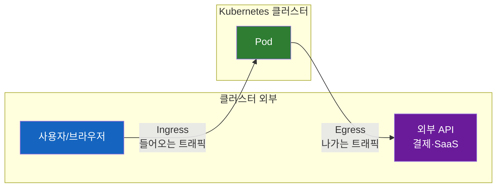
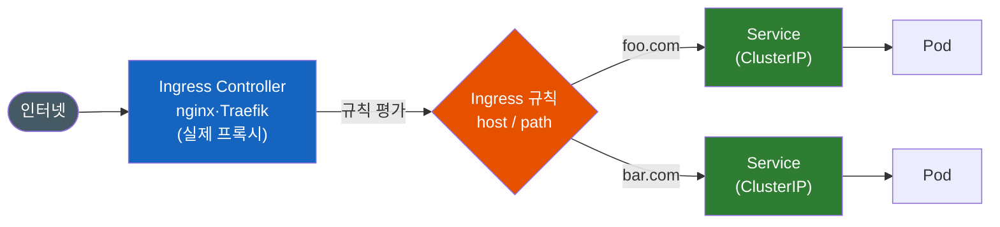
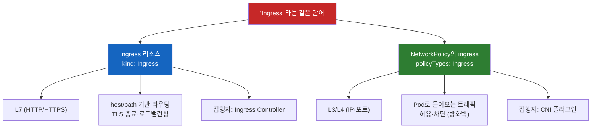

# 쿠버네티스 Ingress와 Egress는 왜 대칭이 아닐까?

쿠버네티스 매니페스트를 뒤지다 보면 `kind: Ingress`를 만난다. 이름이 "들어오는 트래픽(ingress)"이니, 자연스럽게 짝꿍을 기대하게 된다. **"들어오는 게 있으면 나가는 것도 있겠지? `kind: Egress`도 있을 거야."** 그런데 아무리 찾아도 `kind: Egress`는 나오지 않는다. 대신 NetworkPolicy 안에서 `egress:`라는 필드를 보게 되고, 동시에 거기서도 `ingress:`가 또 튀어나온다. 분명 방금 `kind: Ingress`를 봤는데, 왜 NetworkPolicy 안에 또 `ingress`가 있는 걸까?

이 혼란은 거의 모든 사람이 한 번씩 겪는다. 그리고 그 뿌리에는 **쿠버네티스의 Ingress와 Egress가 대칭이 아니라는** 사실이 있다.

---

## 결론부터 말하면

세 가지만 머리에 박으면 이 주제는 끝난다.

1. **Ingress는 독립된 리소스(`kind: Ingress`)지만, 그 짝이 되는 `kind: Egress` 리소스는 존재하지 않는다.** "나가는 트래픽" 제어는 별도 리소스가 아니라 **NetworkPolicy의 `egress` 필드**나 **Egress Gateway** 같은 다른 메커니즘으로 한다. 개념은 대칭이지만, 리소스 설계는 비대칭이다.

2. **"Ingress"라는 단어가 완전히 다른 두 가지를 가리킨다.** 하나는 **Ingress 리소스**(L7 HTTP 라우터, 클러스터의 정문), 다른 하나는 **NetworkPolicy의 `ingress`**(L3/L4 방화벽의 들어오는 방향). 이름만 같을 뿐 계층도 역할도 다르다.

3. **둘 다 리소스만 만들면 아무 일도 일어나지 않는다.** Ingress 리소스는 **Ingress Controller**가, NetworkPolicy는 **CNI 플러그인**이 있어야 실제로 동작한다. "선언"과 "집행"이 분리된 동일한 구조다.



방향으로만 보면 단순하다 — **Ingress = 외부에서 클러스터 안으로**, **Egress = 클러스터 안에서 외부로**. 복잡함은 "이걸 쿠버네티스가 어떤 리소스로 표현하느냐"에서 생긴다. 하나씩 쌓아 올라가 보자.

---

## 1. 왜 헷갈리는가 — "대칭일 것"이라는 직관의 함정

네트워킹에서 ingress와 egress는 오래된 짝꿍 용어다. 방화벽을 설정해 본 사람이라면 "inbound 규칙"과 "outbound 규칙"을 항상 한 쌍으로 다뤘을 것이다. 그래서 쿠버네티스에서 `kind: Ingress`를 보는 순간, 머릿속에 자동으로 `kind: Egress`라는 빈칸이 생긴다.

문제는 이 직관이 **두 군데에서 동시에 무너진다**는 점이다.

- **첫 번째 붕괴**: `kind: Egress` 리소스는 없다. Ingress는 단독 리소스인데 Egress는 그렇지 않다.
- **두 번째 붕괴**: 그렇다고 "나가는 트래픽" 개념이 없는 게 아니다. NetworkPolicy 안에 `egress`가 있다. 그런데 거기엔 `ingress`도 같이 있다. 방금 본 `kind: Ingress`와 이름이 똑같은데, 하는 일은 전혀 다르다.

즉 우리가 가진 "ingress/egress는 대칭이다"라는 직관이 쿠버네티스에서는 두 번 배신당한다. 이 글의 나머지는 이 두 배신을 하나씩 납득시키는 과정이다. 먼저 진짜 리소스인 Ingress부터 정확히 보자.

---

## 2. Ingress 리소스 — 클러스터의 L7 정문

### 2-1. Ingress는 무엇이고, 왜 생겼나

쿠버네티스 공식 문서는 Ingress를 이렇게 정의한다.

> "Ingress exposes HTTP and HTTPS routes from outside the cluster to services within the cluster. Traffic routing is controlled by rules defined on the Ingress resource."

핵심 단어는 **HTTP/HTTPS**다. Ingress는 **L7(애플리케이션 계층)** 에서 동작하는 **HTTP 라우터**다. 외부에서 들어온 요청을 hostname(`foo.com`)과 path(`/api`)를 보고 적절한 내부 서비스로 분배하고, TLS 종료와 로드밸런싱까지 처리한다.

그런데 왜 이런 게 따로 필요할까? 쿠버네티스에는 이미 외부로 서비스를 노출하는 `Service` 타입(`NodePort`, `LoadBalancer`)이 있는데 말이다. 여기서 직관이 한 번 무너진다 — **Service만으로는 비싸고 불편하기 때문**이다.

`Service.type=LoadBalancer`는 서비스 하나마다 클라우드 로드밸런서(=공인 IP, =매달 청구되는 비용)를 하나씩 잡아먹는다. 서비스가 10개면 LB도 10개다. 게다가 "`foo.com`은 A서비스로, `bar.com`은 B서비스로" 같은 host/path 기반 분기는 Service 혼자서는 불가능하다. 공식 문서도 이 지점을 정확히 짚는다.

> "Ingress ... lets you consolidate your routing rules into a single resource, so that you can expose multiple components of your workload, running separately in your cluster, behind a single listener."

**하나의 진입점 뒤에 여러 서비스를 통합**한다 — 이게 Ingress가 푸는 문제다. LB 하나로 수십 개 서비스를 라우팅하니 비용이 줄고, host/path 규칙으로 마이크로서비스를 깔끔하게 분기할 수 있다.

### 2-2. 트래픽은 실제로 어떻게 흐르나



여기서 가장 중요한 함정이 등장한다. **Ingress 리소스는 "규칙 선언서"일 뿐, 실제로 트래픽을 받아 라우팅하는 주체가 아니다.** 실제 프록시 역할은 **Ingress Controller**(ingress-nginx, Traefik 등)가 한다. 공식 문서의 경고가 단호하다.

> "You must have an Ingress controller to satisfy an Ingress. **Only creating an Ingress resource has no effect.**"

Ingress 리소스만 `kubectl apply` 하고 "왜 안 되지?"라고 묻는 건 흔한 첫 실수다. Controller가 없으면 규칙은 그냥 etcd에 적힌 글자일 뿐이다. (Ingress 뒤의 애플리케이션 Service들은 보통 클러스터 내부 전용인 `ClusterIP`면 충분하다. 외부 노출은 Controller가 전담하기 때문이다.)

### 2-3. Ingress YAML — host/path 라우팅과 TLS

다음은 공식 예제를 그대로 가져온 것이다. `foo.bar.com`과 `bar.foo.com`을 서로 다른 서비스로 보내는 name-based virtual hosting이다.

```yaml
apiVersion: networking.k8s.io/v1
kind: Ingress
metadata:
  name: name-virtual-host-ingress
spec:
  rules:
  - host: foo.bar.com
    http:
      paths:
      - pathType: Prefix
        path: "/"
        backend:
          service:
            name: service1      # foo.bar.com -> service1
            port:
              number: 80
  - host: bar.foo.com
    http:
      paths:
      - pathType: Prefix
        path: "/"
        backend:
          service:
            name: service2      # bar.foo.com -> service2
            port:
              number: 80
```

TLS 종료는 `spec.tls`에 인증서 Secret을 연결하기만 하면 된다.

```yaml
spec:
  tls:
  - hosts:
      - https-example.foo.com
    secretName: testsecret-tls   # type: kubernetes.io/tls Secret
  rules:
  - host: https-example.foo.com
    http:
      paths:
      - path: /
        pathType: Prefix
        backend:
          service:
            name: service1
            port:
              number: 80
```

마지막으로 **자주 하는 오해 하나**를 못 박아두자. Ingress는 "들어오는 트래픽 전부"가 아니라 **HTTP/HTTPS만** 다룬다. 공식 문서가 명시한다.

> "An Ingress does not expose arbitrary ports or protocols. Exposing services other than HTTP and HTTPS to the internet typically uses a service of type NodePort or LoadBalancer."

즉 임의의 TCP/UDP 포트나 비-HTTP 프로토콜은 Ingress의 영역이 아니다. 그건 여전히 `NodePort`/`LoadBalancer` Service가 담당한다.

---

## 3. Egress — 짝꿍 리소스가 없는 "나가는 트래픽"

이제 첫 번째 직관 붕괴를 정면으로 마주할 차례다. Ingress가 이렇게 잘 정의된 리소스라면, 반대 방향인 Egress도 `kind: Egress`로 깔끔하게 있어야 할 것 같다. 그런데 없다.

쿠버네티스 교육 자료(Calico)는 이 비대칭을 명확히 인정한다.

> "In contrast to ingress traffic, where Kubernetes has the Ingress resource type to help manage the traffic, **there is no Kubernetes Egress resource.** Instead, how egress traffic is handled at a networking level is determined by the Kubernetes network implementation."

### 3-1. 왜 Egress 리소스가 없어도 "제어"는 필요한가

리소스가 없다고 egress를 방치해도 된다는 뜻은 절대 아니다. 오히려 그 반대다. 기본 상태에서 **Pod의 나가는 트래픽은 전부 허용(allow-all)** 이다. 공식 문서가 분명히 말한다.

> "By default, a pod is non-isolated for egress; all outbound connections are allowed."

즉 아무 설정도 안 하면 클러스터의 모든 Pod가 인터넷 어디로든 자유롭게 나갈 수 있다. 프로덕션에서 이건 위험하다. 그래서 egress 제어가 필요한 이유는 명확하다.

- **데이터 유출(exfiltration) 방지** — 침해된 Pod가 외부로 데이터를 빼돌리는 걸 차단한다.
- **외부 API 화이트리스트** — 결제 게이트웨이, 특정 SaaS 같은 허용된 엔드포인트로만 나가게 한다.
- **컴플라이언스** — 쿠버네티스 보안 체크리스트는 "네임스페이스마다 모든 ingress·egress를 막는 default-deny 정책을 두라"고 권고한다(allow-list 방식).

### 3-2. 그럼 무엇으로 egress를 다루나

`kind: Egress` 하나로 안 되는 대신, **여러 메커니즘의 조합**으로 다룬다. 이게 비대칭의 실체다.

| 메커니즘 | 무엇을 하나 | 한계 |
|----------|-------------|------|
| **NetworkPolicy의 `egress`** | Pod가 나갈 수 있는 대상(IP/CIDR·포트·다른 Pod)을 허용/차단 (L3/L4) | 출발지 IP를 "고정"하지는 못함 |
| **CNI Egress Gateway** (Cilium·Calico) | 선택된 Pod의 트래픽을 게이트웨이 노드로 모아 **예측 가능한 고정 IP로 SNAT** | 별도 솔루션 설치·운영 필요 |
| **Istio Egress Gateway** | mesh를 나가는 트래픽을 전용 프록시로 모아 **모니터링·정책 집행·TLS origination** | 자체로 고정 IP/SNAT를 보장하지 않음 — 고정 IP는 전용 노드·공인 IP·NAT 등 인프라 설정과 결합해야 함 |
| **클라우드 NAT Gateway** (EKS/GKE/AKS) | 서브넷 단위로 outbound를 고정 공인 IP로 내보냄 | 서브넷의 모든 트래픽에 일괄 적용 |

> 같은 "Egress Gateway"라는 이름이지만 결이 다르다. **Cilium·Calico 계열은 SNAT로 고정 egress IP 자체를 제공**하는 데 초점이 있고, **Istio는 mesh egress를 한 지점으로 모아 통제·관측**하는 프록시에 가깝다(고정 IP가 필요하면 인프라를 따로 붙여야 한다).

여기서 **"고정 IP"** 가 왜 반복해서 등장하는지 짚어야 한다. Pod IP는 수시로 바뀌고, 기본적으로 외부로 나갈 때 노드 IP로 SNAT(masquerade)되는데 노드도 자주 교체된다. 그래서 **외부 시스템이 "출발지 IP 화이트리스트"를 요구할 때**(레거시 방화벽, 파트너 API 등) 클러스터의 egress를 예측 가능한 단일 IP로 모아야 한다. 이게 Egress Gateway와 클라우드 NAT Gateway의 핵심 존재 이유다. NetworkPolicy는 "어디로 나갈 수 있는가"는 정해도 "어떤 IP로 나가는가"는 못 정한다 — 그래서 둘이 역할이 다르고, 그래서 메커니즘이 여러 개로 쪼개진 것이다.

---

## 4. 두 번째 함정 — "Ingress"라는 단어의 두 얼굴

이제 가장 많은 사람을 넘어뜨리는 지점이다. NetworkPolicy를 열면 이런 게 보인다.

```yaml
spec:
  policyTypes:
  - Ingress     # ??? 방금 본 kind: Ingress랑 같은 건가?
  - Egress
```

방금 §2에서 `kind: Ingress`(L7 HTTP 라우터)를 배웠는데, NetworkPolicy 안에 또 `Ingress`가 나온다. **결론부터 말하면, 둘은 이름만 같고 완전히 다른 것이다.**



### 4-1. NetworkPolicy는 Pod 단위 L3/L4 방화벽이다

공식 문서의 정의를 보자.

> "If you want to control traffic flow at the IP address or port level (OSI layer 3 or 4), NetworkPolicies allow you to specify rules for traffic flow within your cluster, and also between Pods and the outside world."

즉 NetworkPolicy는 **IP와 포트 수준(L3/L4)의 Pod 방화벽**이다. Ingress 리소스가 "HTTP URL을 보고 라우팅하는 L7 라우터"라면, NetworkPolicy는 "어떤 IP·포트의 패킷을 통과시킬지 결정하는 L3/L4 필터"다. **계층 자체가 다르다.** 그래서 NetworkPolicy 안의 `Ingress`/`Egress`는 HTTP와 아무 상관이 없고, 단지 **트래픽의 방향**을 뜻한다.

> "The `policyTypes` field indicates whether or not the given policy applies to ingress traffic to selected pod, egress traffic from selected pods, or both."

- `Ingress` = 선택된 Pod로 **들어오는** 트래픽 규칙
- `Egress` = 선택된 Pod에서 **나가는** 트래픽 규칙

### 4-2. 핵심 규칙 — 한 번 선택되면 그 방향은 default-deny

NetworkPolicy를 이해하는 가장 중요한 규칙이 하나 있다. **어떤 Pod도 NetworkPolicy에 선택되지 않으면 모든 트래픽이 허용된다. 그러나 정책 하나라도 그 Pod를 특정 방향으로 선택하는 순간, 그 방향은 default-deny가 되고 명시적으로 허용한 것만 통과한다.**

```yaml
apiVersion: networking.k8s.io/v1
kind: NetworkPolicy
metadata:
  name: default-deny-egress
spec:
  podSelector: {}     # 네임스페이스의 모든 Pod 선택
  policyTypes:
  - Egress            # egress 방향을 isolated 상태로 전환
  # egress 규칙이 비어 있으므로 -> 나가는 연결 0개 = 전면 차단
```

`podSelector: {}`로 모든 Pod를 잡고 `policyTypes: [Egress]`만 두면, egress 허용 규칙이 하나도 없으니 **모든 outbound가 막힌다.** 반대로 특정 대상만 열어주려면 이렇게 한다(공식 예제의 egress 부분).

```yaml
spec:
  podSelector:
    matchLabels:
      role: db
  policyTypes:
  - Egress
  egress:
  - to:
    - ipBlock:
        cidr: 10.0.0.0/24    # 이 대역으로만
    ports:
    - protocol: TCP
      port: 5978             # 이 포트로만 나갈 수 있음
```

여기서 실무에서 가장 많이 터지는 함정 하나. **모든 egress를 막으면서 DNS(CoreDNS, 보통 53 포트)를 깜빡 허용 안 하면 해당 네임스페이스의 Pod들이 통신 장애를 일으킨다.** 이름 해석이 안 되니 어떤 통신도 시작되지 않는다. (NetworkPolicy는 네임스페이스 범위 리소스라 영향은 그 네임스페이스 안에 한정되지만, 그 안에서는 "잠근 문 옆에 창문을 안 열어둔" 셈이 된다.) default-deny egress를 적용할 땐 DNS 허용 규칙을 반드시 함께 둬야 한다.

### 4-3. Ingress 리소스 vs NetworkPolicy의 ingress — 최종 대조

| 항목 | **Ingress 리소스** | **NetworkPolicy의 `ingress`** |
|------|-------------------|------------------------------|
| `kind` | `Ingress` | `NetworkPolicy` |
| OSI 계층 | **L7** (HTTP/HTTPS만) | **L3/L4** (IP·TCP/UDP 포트) |
| 하는 일 | host/path 기반 **라우팅**, TLS 종료, 로드밸런싱 | Pod로 들어오는 트래픽 **허용/차단** (방화벽) |
| 식별 대상 | hostname, path, URL | IP/CIDR, 포트, Pod/Namespace 레이블 |
| 비유 | 건물 정문의 **안내 데스크**(어디로 갈지 라우팅) | 각 사무실 문의 **출입 통제**(통과/차단) |
| 집행 주체 | Ingress Controller | CNI 플러그인 |

**이름이 같다고 같은 개념이 아니다.** Ingress 리소스의 "ingress"는 *클러스터 외부에서 들어오는 HTTP 진입로*, NetworkPolicy의 "ingress"는 *Pod 기준 들어오는 방향*이라는 방화벽 용어일 뿐이다.

---

## 5. 선언과 집행의 분리 — 두 리소스가 공유하는 구조

지금까지 두 번 반복된 패턴이 있다. Ingress 리소스도 "만들기만 하면 효과 없음"이었고, NetworkPolicy도 마찬가지다.

> (NetworkPolicy) "Network policies are implemented by the network plugin. ... **Creating a NetworkPolicy resource without a controller that implements it will have no effect.**"

이건 우연이 아니라 쿠버네티스의 일관된 설계 철학이다. **리소스는 "원하는 상태(선언)"만 기술하고, 실제 동작(집행)은 별도의 컴포넌트가 담당한다.**

| 선언 (리소스) | 집행 (컨트롤러/플러그인) |
|---------------|--------------------------|
| Ingress 리소스 | Ingress Controller (nginx, Traefik …) |
| NetworkPolicy 리소스 | CNI 플러그인 (Calico, Cilium, Antrea …) |

그래서 두 경우 모두 똑같은 첫 실수가 나온다 — **"리소스를 분명히 만들었는데 왜 동작 안 하지?"** 답은 항상 같다. 집행할 컴포넌트가 클러스터에 없기 때문이다. (예: CNI로 Flannel만 쓰면 NetworkPolicy는 무시된다. Calico·Cilium 등 NetworkPolicy를 지원하는 CNI가 필요하다.)

---

## 6. 그래서, 언제 무엇을 쓰나 (실무 정리)

질문의 핵심인 "어디에 어떻게 쓰는지"를 시나리오로 정리한다.

**Ingress 리소스를 쓰는 경우** — *외부 트래픽을 받아들이고 라우팅*할 때.

- 웹 앱을 도메인으로 외부 공개: `app.example.com` → 내부 서비스
- 경로 기반 마이크로서비스 분기: `/api` → api 서비스, `/web` → web 서비스
- TLS 종료를 Ingress 계층에서 일괄 처리 (백엔드는 평문 통신에 집중)
- 서비스마다 LB를 만들지 않고 **단일 LB로 여러 서비스 노출 → 비용 절감**

**Egress 제어(NetworkPolicy / Egress Gateway)를 쓰는 경우** — *나가는 트래픽을 통제*할 때.

- 보안 규정: Pod가 임의의 외부 IP로 나가지 못하게 차단 (데이터 유출 방지)
- 결제·외부 API만 화이트리스트로 허용
- 외부 시스템이 요구하는 **고정 출발지 IP 확보** → Egress Gateway 또는 클라우드 NAT Gateway

### 한눈에 보는 4축 비교

| 축 | Ingress 리소스 | NetworkPolicy `ingress` | NetworkPolicy `egress` | Egress Gateway* |
|----|----------------|--------------------------|--------------------------|----------------|
| 방향 | 외부 → 클러스터 | → Pod (inbound) | Pod → (outbound) | Pod → 외부 |
| 계층 | L7 | L3/L4 | L3/L4 | L3/L4 + SNAT |
| 목적 | HTTP 라우팅·TLS·LB 통합 | Pod 수신 트래픽 제한 | 아웃바운드 목적지 제한 | 출발지 IP 고정 |
| 집행체 | Ingress Controller | CNI 플러그인 | CNI 플러그인 | Cilium·Calico |

> *표의 "Egress Gateway"는 고정 IP/SNAT를 직접 제공하는 **Cilium·Calico 계열** 기준이다. **Istio Egress Gateway**는 결이 달라서 mesh egress의 통제·관측·TLS origination이 목적이고, 고정 IP는 인프라를 따로 결합해야 한다(§3-2 참고).

### 흔한 오해 정리

| 오해 | 사실 |
|------|------|
| "Egress는 Ingress의 반대 **리소스**다" | `kind: Egress`는 없다. NetworkPolicy의 `egress` 필드나 Egress Gateway로 한다. |
| "Ingress 리소스 = NetworkPolicy의 `ingress`" | 전자는 L7 HTTP 라우터, 후자는 L3/L4 방화벽. 이름만 같다. |
| "리소스만 만들면 동작한다" | Ingress는 Controller, NetworkPolicy는 CNI 플러그인이 있어야 동작한다. |
| "Ingress는 모든 들어오는 트래픽을 처리한다" | HTTP/HTTPS만. 임의 포트·프로토콜은 NodePort/LoadBalancer Service의 몫. |

---

## 7. 오늘날(2026) 알아둘 것 — Ingress의 미래는 Gateway API

마지막으로 시의성 있는 변화 하나. 위에서 다룬 **Ingress 리소스 API는 현재 동결(frozen)** 상태다. 공식 문서가 직접 권고한다.

> "The Kubernetes project recommends using Gateway instead of Ingress. The Ingress API has been frozen."

2023년 10월 **Gateway API가 v1.0 GA**로 졸업하면서, 쿠버네티스는 Ingress의 후속으로 Gateway API를 공식 권장하기 시작했다. Ingress가 가진 한계 — 표현력 부족(header 매칭·트래픽 가중치를 controller별 annotation으로만 처리), provider 종속성, HTTP 외 프로토콜 미지원 — 를 표준 API로 풀어낸 것이다.

다만 **"Ingress는 죽었다"로 받아들이면 안 된다.** Ingress API는 여전히 GA 상태로 남아 있고 제거 계획도 없으며, 현재도 수많은 클러스터에서 멀쩡히 동작 중이다. 동결의 의미는 "더 이상 새 기능이 추가되지 않는다"이지 "쓰면 안 된다"가 아니다. 신규 설계라면 Gateway API를 검토하되, 기존 Ingress는 급히 걷어낼 필요가 없다. (참고로 가장 널리 쓰이던 ingress-nginx는 2026년 3월 유지보수가 종료되어 이후 버그 수정·보안 패치·업데이트가 제공되지 않는다. 신규 도입 시엔 Gateway API 계열 구현체를 함께 고려하는 게 좋다. 공식 마이그레이션 도구 `ingress2gateway`도 제공된다.)

NetworkPolicy는 이런 변화와 무관하게 현역 표준으로 그대로 쓰인다.

---

## 8. 정리

처음의 직관 — "ingress가 있으면 egress도 대칭으로 있겠지" — 가 왜 두 번 무너지는지 이제 분명하다.

- **첫 번째**: `kind: Egress` 리소스는 없다. Ingress만 단독 리소스이고, egress는 NetworkPolicy의 `egress` 필드 + Egress Gateway + 클라우드 NAT의 조합으로 다룬다. **개념은 대칭, 리소스 설계는 비대칭.**
- **두 번째**: "Ingress"는 두 얼굴을 가진다. **Ingress 리소스**(L7 HTTP 라우터)와 **NetworkPolicy의 `ingress`**(L3/L4 방화벽 방향). 이름만 같다.
- **공통 함정**: 둘 다 선언만으로는 무효다. Ingress Controller / CNI 플러그인이라는 집행 컴포넌트가 있어야 동작한다.

방향(들어옴/나감)은 단순하다. 복잡함은 전부 "쿠버네티스가 그 방향을 어떤 리소스와 계층으로 표현하느냐"에서 나온다. 이 매핑만 정리되면, `kind: Ingress`와 NetworkPolicy의 `ingress`가 나란히 나와도 더 이상 헷갈리지 않는다.

---

## 출처

- [Kubernetes 공식 — Ingress](https://kubernetes.io/docs/concepts/services-networking/ingress/)
- [Kubernetes 공식 — Ingress Controllers](https://kubernetes.io/docs/concepts/services-networking/ingress-controllers/)
- [Kubernetes 공식 — Network Policies](https://kubernetes.io/docs/concepts/services-networking/network-policies/)
- [Kubernetes 공식 — Service](https://kubernetes.io/docs/concepts/services-networking/service/)
- [Kubernetes 공식 — Gateway API](https://kubernetes.io/docs/concepts/services-networking/gateway/)
- [Kubernetes 공식 — Security Checklist](https://kubernetes.io/docs/concepts/security/security-checklist/)
- [Kubernetes Blog — Gateway API v1.0 GA (2023-10-31)](https://kubernetes.io/blog/2023/10/31/gateway-api-ga/)
- [Calico/Tigera — About Kubernetes Egress ("there is no Kubernetes Egress resource")](https://docs.tigera.io/calico/latest/about/kubernetes-training/about-kubernetes-egress)
- [Istio — Egress Gateways](https://istio.io/latest/docs/tasks/traffic-management/egress/egress-gateway/)
- [Cilium — Egress Gateway](https://docs.cilium.io/en/stable/network/egress-gateway/egress-gateway/)
- [Red Hat — Guide to Kubernetes Egress Network Policies](https://www.redhat.com/en/blog/guide-to-kubernetes-egress-network-policies)
- [IBM — What Are Ingress and Egress in Kubernetes](https://www.ibm.com/think/topics/ingress-vs-egress)
