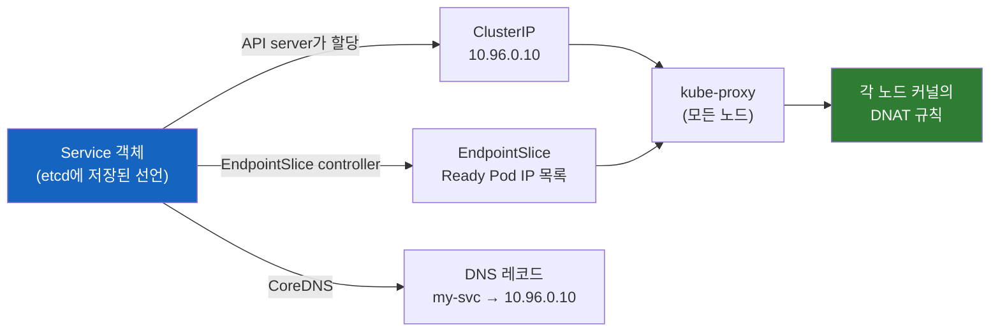
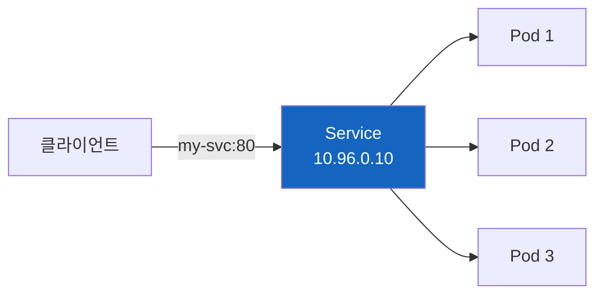
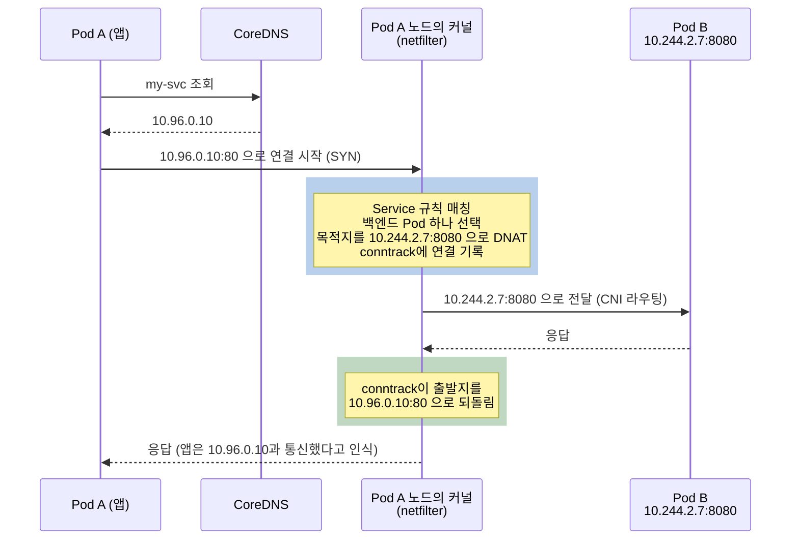
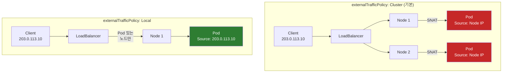

# 쿠버네티스 Service에는 왜 프로세스가 없을까

ClusterIP는 분명히 있는데 그 IP를 가진 서버는 어디에도 없다. 그럼 `curl http://my-svc`는 누가 받아서 Pod로 넘겨주는 걸까?

> Service의 기본 개념과 타입(ClusterIP, NodePort, LoadBalancer)은 [Kubernetes Service: ClusterIP, NodePort, LoadBalancer](./Kubernetes-Service-ClusterIP-NodePort-LoadBalancer.md)에서 먼저 다룬다. 이 글은 그 Service가 내부에서 실제로 어떻게 동작하는지를 파고든다.

## 결론부터 말하면

**Service에 프로세스가 없는 이유는 Service가 서버가 아니라 etcd에 저장된 선언이기 때문이다.** 실체는 모든 노드의 커널에 깔린 주소 변환(DNAT) 규칙이다. 패킷은 "Service라는 장비"를 거치지 않는다. 보내는 쪽 노드의 커널이 목적지를 Pod IP로 바꿔서 바로 보낸다.



이 정체를 알면 이상해 보이던 동작이 모두 설명된다.

| 현상 | 정체로 본 이유 |
|------|---------------|
| ClusterIP에 `ping`이 응답하지 않는다 | 그 IP를 가진 인터페이스가 없고, 규칙은 정의된 port에만 걸린다 |
| Pod를 늘려도 gRPC 부하가 한 Pod에 몰린다 | Pod 선택은 연결이 맺어질 때 한 번만 일어난다 |
| kube-proxy가 죽어도 트래픽이 바로 끊기지 않는다 | 규칙은 이미 커널에 쓰여 있고, 멈추는 건 갱신뿐이다 |
| `externalTrafficPolicy: Local`이어야 클라이언트 IP가 보인다 | `Cluster`에서는 다른 노드로 넘어갈 경우에 대비해 외부 트래픽의 출발지를 노드 IP로 바꾼다 |

---

## 1. 왜 "Service가 트래픽을 분산한다"는 말이 오해를 부를까?

### 1.1 우리가 그리는 그림

Pod는 교체될 때마다 IP가 바뀐다. 그래서 쿠버네티스는 **Service** 라는 리소스로 "이 라벨을 가진 Pod들"에게 고정된 이름과 IP를 붙여준다. 문서와 다이어그램은 보통 이렇게 그린다.



이 그림만 보면 Service는 nginx 같은 로드밸런서처럼 보인다. 트래픽을 받아서 뒤의 Pod들에게 나눠주는 중간 서버 말이다.

### 1.2 그런데 이상한 점이 있다

정말 중간 서버라면 어딘가에서 프로세스로 돌고 있어야 한다. 하지만 노드에 들어가 프로세스 목록을 뒤져도 "Service 프로세스"는 없다. `ip addr`로 네트워크 인터페이스를 다 봐도 `10.96.0.10`을 가진 장치는 보이지 않는다. 그런데도 클러스터의 모든 Pod에서 `10.96.0.10:80`으로 접속하면 응답이 온다.

더 이상한 일도 있다. 장애 대응 중에 `ping 10.96.0.10`을 쳐보면 응답이 없다. 그런데 바로 옆에서 `curl 10.96.0.10`은 성공한다. 서버가 있다면 ping에도 답해야 하지 않을까?

이 모순을 풀려면 Service가 "무엇"인지부터 다시 봐야 한다.

---

## 2. Service는 선언이고, 실체는 여러 컴포넌트가 나눠 만든다

### 2.1 etcd에 저장된 의도

Service를 `kubectl apply`하면 일어나는 일은 단 하나다. API server가 그 YAML을 etcd(쿠버네티스의 상태 저장소)에 저장한다. 저장된 내용은 "이 이름과 IP:port로 오는 연결은 selector에 맞는 Pod 중 하나로 보내라"는 **의도** 뿐이다. 트래픽을 받는 코드는 어디에도 없다.

이 의도를 실제 동작으로 바꾸는 건 여러 컴포넌트의 몫이다. 각 컴포넌트가 Service 객체를 watch(변경을 실시간으로 구독)하다가 자기 몫의 결과물을 만들어낸다.

| 컴포넌트 | 하는 일 | 결과물 |
|----------|---------|--------|
| **API server** | Service가 생성되면 Service CIDR 대역에서 IP 하나를 할당 | ClusterIP (가상 IP) |
| **EndpointSlice controller** | kube-controller-manager 안에서 selector에 맞는 Pod와 그 Ready 상태를 추적 | EndpointSlice (Service 뒤에 있는 Pod IP 목록 객체) |
| **kube-proxy** | 모든 노드에서 하나씩 돌며 Service와 EndpointSlice를 watch해 커널 규칙을 작성 | 각 노드의 iptables / nftables / IPVS 규칙 |
| **CoreDNS** | Service를 watch해 DNS 레코드 생성 | `my-svc.default.svc.cluster.local` → ClusterIP |

여기서 kube-proxy라는 이름이 오해를 부른다. 이름에 proxy가 들어가 있지만, 기본 모드에서 kube-proxy는 패킷을 직접 중계하지 않는다. 커널에 규칙을 써 넣고 빠지는 "규칙 작성자"다.

### 2.2 Spring Cloud로 비유하면

Spring Cloud를 써봤다면 Eureka와 Spring Cloud LoadBalancer 조합을 떠올리면 이해가 빠르다. Eureka가 서비스 인스턴스 목록을 들고 있고, 호출하는 쪽 애플리케이션 안의 LoadBalancer가 그 목록에서 하나를 골라 직접 연결한다. 중간에 별도의 로드밸런서 서버가 없다.

쿠버네티스도 같은 구조다. EndpointSlice가 레지스트리 역할을 하고, kube-proxy가 써 둔 커널 규칙이 클라이언트 측 로드밸런서 역할을 한다. 차이는 그 로드밸런서가 애플리케이션 코드가 아니라 **호출하는 쪽 노드의 커널** 에 있다는 점이다. 그래서 어떤 언어로 만든 앱이든 라이브러리 없이 같은 동작을 얻는다.

---

## 3. 패킷은 어디서 바뀌는가

그렇다면 실제 패킷은 어떤 길을 갈까? Pod에서 나간 패킷은 노드 커널의 **netfilter** (리눅스 커널의 패킷 필터링·변환 프레임워크로, iptables와 nftables가 이 위에서 동작한다)를 지난다. kube-proxy가 써 둔 규칙이 여기서 패킷을 붙잡아 **DNAT** (Destination NAT, 패킷의 목적지 주소를 다른 주소로 바꿔 쓰는 것)를 수행한다.



첫 패킷에서 목적지가 정해지면 **conntrack** (커널이 연결마다 주소 변환 결과를 기억해 두는 연결 추적 테이블)이 이를 기록한다. 같은 연결의 이후 패킷은 규칙을 다시 거치지 않고 conntrack 기록대로 같은 Pod로 가며, 응답 패킷의 출발지 주소도 conntrack이 원래의 ClusterIP로 되돌린다. 그래서 앱은 끝까지 `10.96.0.10`과 통신했다고 믿는다.

이 변환은 **보내는 쪽 노드** 에서 일어난다. 그래서 모든 노드에 같은 규칙이 깔려 있어야 하고, kube-proxy가 모든 노드에서 도는 이유가 여기에 있다. 백엔드를 고르는 방식은 모드마다 다르다. iptables·nftables 모드는 기본적으로 무작위로 고르고, IPVS 모드는 `rr`(round-robin) 같은 스케줄러 설정을 따른다.

---

## 4. ClusterIP는 어디에도 없는 IP다

### 4.1 규칙 속의 매칭 조건

이제 1.2절의 첫 번째 의문이 풀린다. ClusterIP는 어떤 네트워크 인터페이스에도 할당되지 않는다. 작성 시점의 기본값인 iptables 모드와 앞으로 기본값이 될 nftables 모드에서, ClusterIP는 netfilter 규칙 속의 매칭 조건으로만 존재한다. `ip addr`로는 보이지 않는데도 클러스터의 모든 노드에서 접근할 수 있는 것은 이 때문이다.

예외는 IPVS 모드다. IPVS는 노드 자신의 주소로 들어온 패킷만 처리하는 구조라서, kube-proxy가 모든 ClusterIP를 `kube-ipvs0`라는 dummy 인터페이스에 실제로 붙인다. 이 모드에서는 `ip addr show kube-ipvs0`에 ClusterIP가 줄줄이 보인다. 다만 이 예외는 사라지는 중이다.

| 모드 (Linux) | 상태 | ClusterIP가 존재하는 곳 |
|--------------|------|------------------------|
| **iptables** | 작성 시점의 기본값 | netfilter 규칙 안에만 |
| **nftables** | v1.33 GA, 향후 기본값 예정, kernel 5.13 이상 필요 | netfilter 규칙 안에만 |
| **IPVS** | v1.35 deprecated, v1.40부터 기본 비활성, v1.43 제거 예정 | `kube-ipvs0` dummy 인터페이스 |

공식 문서는 업그레이드 과정에서 기본값이 바뀌어 모드가 예기치 않게 달라지지 않도록, 모든 클러스터의 kube-proxy 설정에 모드를 명시하라고 권고한다.

### 4.2 구현이 바뀌어도 정체는 같다

Cilium의 kube-proxy replacement는 eBPF(커널 안에서 프로그램을 안전하게 실행하는 기술)로 앱의 `connect()` 시스템 콜 시점에 목적지를 Pod 주소로 바꿔버린다. 그래서 패킷에는 처음부터 ClusterIP가 실리지 않는다. netfilter든 eBPF든 "선언을 각 노드의 주소 변환으로 실현한다"는 점은 변하지 않는다.

### 4.3 직접 확인하기

```bash
# 1. kube-proxy가 어떤 모드로 도는지 확인
kubectl -n kube-system logs ds/kube-proxy | grep -i proxier
# "Using iptables Proxier" 형태로 출력된다

# 2. 노드에서 Service 규칙 직접 보기 (iptables 모드)
sudo iptables -t nat -L KUBE-SERVICES -n | grep 10.96.0.10

# 3. IPVS 모드라면 ClusterIP가 인터페이스에 보인다
ip addr show kube-ipvs0
```

---

## 5. 같은 원리로 읽는 Traffic Policy

Service에는 "규칙을 어떻게 쓸지"를 바꾸는 옵션이 있다. 정체를 알고 나면 이 옵션들이 왜 그렇게 동작하는지 자연스럽게 읽힌다.

### 5.1 externalTrafficPolicy: 클라이언트 IP는 왜 사라질까

NodePort나 LoadBalancer로 들어온 외부 트래픽은 먼저 아무 노드에나 도착한다. 기본값인 `Cluster`에서는 그 노드의 규칙이 클러스터 전체의 Pod 중에서 백엔드를 고르므로, 고른 Pod가 **다른 노드** 에 있을 수 있다. 그 경우 Pod의 응답은 이 노드로 돌아와야 conntrack이 주소를 되돌릴 수 있다. 그래서 노드는 DNAT와 함께 **SNAT** (Source NAT, 출발지 주소를 바꿔 쓰는 것)로 출발지를 자기 IP로 바꾼다. iptables 모드의 kube-proxy는 백엔드를 고르기 **전에** 외부 트래픽 전체에 이 표시를 해 두므로, 결과적으로 같은 노드의 Pod가 선택되어도 SNAT이 걸린다. 대가로 Pod는 클라이언트의 진짜 IP 대신 노드 IP를 보게 된다.

`Local`로 바꾸면 kube-proxy는 그 노드에 있는 Pod로만 보내는 규칙을 쓴다. 다른 노드로 넘기지 않으니 SNAT도 필요 없고, 노드에 도착한 출발지 IP가 그대로 보존된다. 단, 이것은 외부 LB가 클라이언트 IP를 그대로 노드까지 전달하는 경우의 이야기다. LB가 클라이언트 연결을 종료하고 새 연결을 맺는 프록시 방식이라면 Pod에는 LB의 IP가 보인다.

```yaml
apiVersion: v1
kind: Service
metadata:
  name: my-svc
spec:
  type: LoadBalancer
  externalTrafficPolicy: Local    # 기본값: Cluster
  selector:
    app: my-app
  ports:
  - port: 80
    targetPort: 8080
```



| 설정 | Source IP | 트래픽 분산 | 사용 시점 |
|------|-----------|------------|----------|
| **Cluster** (기본) | SNAT으로 가려짐 (같은 노드의 Pod로 가도 마찬가지) | 모든 노드의 Pod로 분산 | 일반적인 경우 |
| **Local** | **보존됨** | 도착한 노드의 Pod로만 | IP 기반 접근 제어, 로깅 |

`Local`에는 대가가 있다. Pod가 없는 노드로 트래픽이 도착하면 보낼 곳이 없어 **드롭** 된다. 그래서 쿠버네티스는 `Local`로 설정한 LoadBalancer Service에 `spec.healthCheckNodePort`를 자동으로 할당하고, 클라우드 LB는 이 포트로 "이 노드에 Pod가 있는가"를 검사해 Pod가 있는 노드로만 트래픽을 보낸다. 또 노드마다 Pod 수가 다르면 노드 단위로는 균등해도 Pod 단위로는 부하가 불균형해질 수 있다.

### 5.2 internalTrafficPolicy: 같은 노드의 Pod로만

클러스터 **내부** 트래픽에도 같은 원리가 적용된다. `internalTrafficPolicy: Local`이면 kube-proxy는 각 노드에서 그 노드의 Pod로만 보내는 규칙을 쓴다. 노드를 건너는 홉이 사라져 지연이 줄어든다.

```yaml
apiVersion: v1
kind: Service
metadata:
  name: my-svc
spec:
  type: ClusterIP
  internalTrafficPolicy: Local    # 기본값: Cluster
  selector:
    app: my-app
  ports:
  - port: 80
    targetPort: 8080
```

| 설정 | 동작 | 사용 시점 |
|------|------|----------|
| **Cluster** (기본) | 모든 노드의 Pod로 분산 | 일반적인 경우 |
| **Local** | 같은 노드의 Pod로만 | 지연 시간 최소화, 노드마다 Pod가 있는 DaemonSet 등 |

규칙이 "같은 노드의 Pod"만 가리키므로, 그 노드에 Pod가 없으면 트래픽은 **실패** 한다. 다른 노드에 멀쩡한 Pod가 있어도 넘어가지 않는다.

---

## 6. 같은 원리로 읽는 Session Affinity

### 6.1 연결은 이미 고정되어 있다

3장에서 봤듯이 Pod 선택은 연결의 첫 패킷에서 한 번 일어나고 conntrack에 고정된다. 즉 **열려 있는 연결 하나는 원래부터 한 Pod에 붙어 있다.** 문제는 같은 클라이언트가 **새 연결** 을 맺을 때다. 새 연결은 규칙을 처음부터 다시 타므로 다른 Pod로 갈 수 있다.

Session Affinity는 바로 이 "여러 연결 사이"를 고정하는 옵션이다. `sessionAffinity: ClientIP`로 설정하면 같은 클라이언트 IP의 새 연결도 정해진 시간 동안 같은 Pod로 보낸다. iptables 모드에서는 kube-proxy가 규칙에 `recent` 모듈 조건을 추가해 "최근 이 클라이언트 IP를 어느 Pod로 보냈는지"를 커널이 기억하게 하는 방식으로 구현한다.

```yaml
apiVersion: v1
kind: Service
metadata:
  name: my-svc
spec:
  type: ClusterIP
  sessionAffinity: ClientIP           # 기본값: None
  sessionAffinityConfig:
    clientIP:
      timeoutSeconds: 10800           # 3시간 (기본값)
  selector:
    app: my-app
  ports:
  - port: 80
    targetPort: 8080
```

| 설정 | 동작 |
|------|------|
| **None** (기본) | 새 연결마다 모드에 따라 백엔드 선택 (iptables·nftables: 무작위, IPVS: 스케줄러 설정) |
| **ClientIP** | 같은 클라이언트 IP의 새 연결은 timeout 동안 같은 Pod로 |

### 6.2 언제 사용하나?

| 상황 | Session Affinity |
|------|-----------------|
| Stateless 애플리케이션 | None (기본) |
| 세션을 Pod 메모리에 저장 | **ClientIP** |
| WebSocket 재연결 시 이전 Pod의 메모리 상태가 필요 | **ClientIP** (열려 있는 WebSocket 연결 하나는 이미 고정되어 있어 affinity가 필요 없다) |

`ClientIP`를 쓸 때 주의할 점이 두 가지 있다. 첫째, Pod가 죽으면 그 Pod 메모리의 세션은 사라진다. 프로덕션에서는 Redis 같은 외부 세션 스토어를 권장한다. 둘째, 이 방식은 **L4 레벨(IP 기반)** 이다. 회사 네트워크나 통신사 게이트웨이처럼 NAT 뒤에 있는 사용자들은 모두 같은 IP로 보이므로 트래픽이 한 Pod로 쏠릴 수 있다. 사용자 단위의 정교한 고정이 필요하다면 Ingress(L7) 레벨의 쿠키 기반 Sticky Session을 써야 한다.

---

## 7. 이 정체에서 나오는 실무 함정

Service가 서버가 아니라 커널 규칙이라는 사실을 모르면, 정상 동작을 장애로 착각하거나 진짜 장애를 놓치기 쉽다.

| 증상 | 왜 그런가 | 대응 |
|------|----------|------|
| ClusterIP에 `ping`이 응답하지 않음 | 규칙은 Service에 정의된 protocol·port(예: TCP 80)에만 매칭되는데 ICMP에는 port가 없다. IP를 가진 인터페이스도 없어 응답할 주체가 없다 (IPVS 모드는 노드에 바인딩되어 있어 응답할 수 있다) | 정상 동작이다. `curl`이나 `nc -zv my-svc 80`처럼 정의된 포트로 확인한다 |
| Pod를 늘려도 gRPC 부하가 한 Pod에 몰림 | Pod 선택은 연결의 첫 패킷에서 한 번만 일어난다. HTTP/2(gRPC)는 하나의 긴 연결에 모든 요청을 다중화하므로 전부 한 Pod에 고정된다. HTTP/1.1은 연결이 자연스럽게 교체되어 대체로 문제없다 | Headless Service(`clusterIP: None`)로 Pod 목록을 받고 gRPC 클라이언트에 `round_robin` 같은 요청 단위 분산 정책을 설정한다(기본 정책 `pick_first`는 주소 하나만 계속 쓴다). 또는 L7 프록시(서비스 메시 등)를 둔다 |
| 일부 노드에서만 간헐적으로 연결 실패 | kube-proxy는 규칙을 쓰기만 하고 패킷 처리는 커널이 한다. kube-proxy가 멈춰도 기존 규칙은 남아 트래픽은 흐르지만 갱신이 멈춘다. 그 사이 Pod가 교체되면 이미 사라진 Pod IP로 계속 보낸다 | EndpointSlice가 정상이면 해당 노드의 kube-proxy부터 확인한다: `kubectl -n kube-system get pods -l k8s-app=kube-proxy -o wide` (kubeadm 기준 라벨) |

---

## 8. 정리

### 핵심 포인트

1. **Service는 서버가 아니라 선언이다**
   - etcd에 저장된 의도를 API server, EndpointSlice controller, kube-proxy, CoreDNS가 나눠서 실체로 만든다
   - 실체는 모든 노드 커널에 깔린 DNAT 규칙이다

2. **주소 변환은 보내는 쪽 노드에서, 연결 단위로 일어난다**
   - 첫 패킷에서 Pod를 고르고 conntrack이 그 연결을 고정한다
   - 그래서 로드밸런싱은 요청 단위가 아니라 연결 단위다 (gRPC 쏠림의 원인)

3. **ClusterIP는 어떤 인터페이스에도 없다**
   - iptables·nftables 모드에서는 규칙 속 매칭 조건일 뿐이라 ping에 응답하지 않는다
   - IPVS 모드만 `kube-ipvs0`에 붙지만, v1.35부터 deprecated다

4. **Traffic Policy와 Session Affinity는 "규칙을 어떻게 쓸지"를 바꾸는 옵션이다**
   - `externalTrafficPolicy: Local`은 다른 노드로 넘기지 않아 SNAT이 없고 클라이언트 IP가 보존된다
   - `sessionAffinity: ClientIP`는 이미 고정된 연결이 아니라 같은 클라이언트의 새 연결들을 고정한다

> 📖 관련 문서:
> - [Kubernetes Service: ClusterIP, NodePort, LoadBalancer](./Kubernetes-Service-ClusterIP-NodePort-LoadBalancer.md)
> - [같은 LoadBalancer Service가 클라우드마다 다른 LB가 되는 이유](./같은-LoadBalancer-Service가-클라우드마다-다른-LB가-되는-이유.md)

---

## 출처

- [Kubernetes Documentation - Virtual IPs and Service Proxies](https://kubernetes.io/docs/reference/networking/virtual-ips/) - 공식 문서 (proxy mode, IPVS deprecation 일정, Session Affinity)
- [Kubernetes Documentation - Service Traffic Policy](https://kubernetes.io/docs/concepts/services-networking/service-traffic-policy/) - 공식 문서
- [Kubernetes Documentation - Using Source IP](https://kubernetes.io/docs/tutorials/services/source-ip/) - 공식 문서 (SNAT과 `externalTrafficPolicy: Local`)
- [Kubernetes Documentation - Cloud Controller Manager](https://kubernetes.io/docs/concepts/architecture/cloud-controller/) - 공식 문서
- [kubernetes/kubernetes - iptables proxier](https://github.com/kubernetes/kubernetes/blob/master/pkg/proxy/iptables/proxier.go) - Session Affinity의 `recent` 모듈 구현
- [Kubernetes Blog - IPVS-Based In-Cluster Load Balancing Deep Dive](https://kubernetes.io/blog/2018/07/09/ipvs-based-in-cluster-load-balancing-deep-dive/) - `kube-ipvs0` dummy 인터페이스 바인딩
- [Kubernetes Blog - gRPC Load Balancing on Kubernetes without Tears](https://kubernetes.io/blog/2018/11/07/grpc-load-balancing-on-kubernetes-without-tears/) - 연결 단위 로드밸런싱의 한계
- [KEP-5495: Deprecate ipvs mode in kube-proxy](https://www.kubernetes.dev/resources/keps/5495)
- [Cilium Documentation - Kubernetes Without kube-proxy](https://docs.cilium.io/en/stable/network/kubernetes/kubeproxy-free/) - socket-level load balancer
