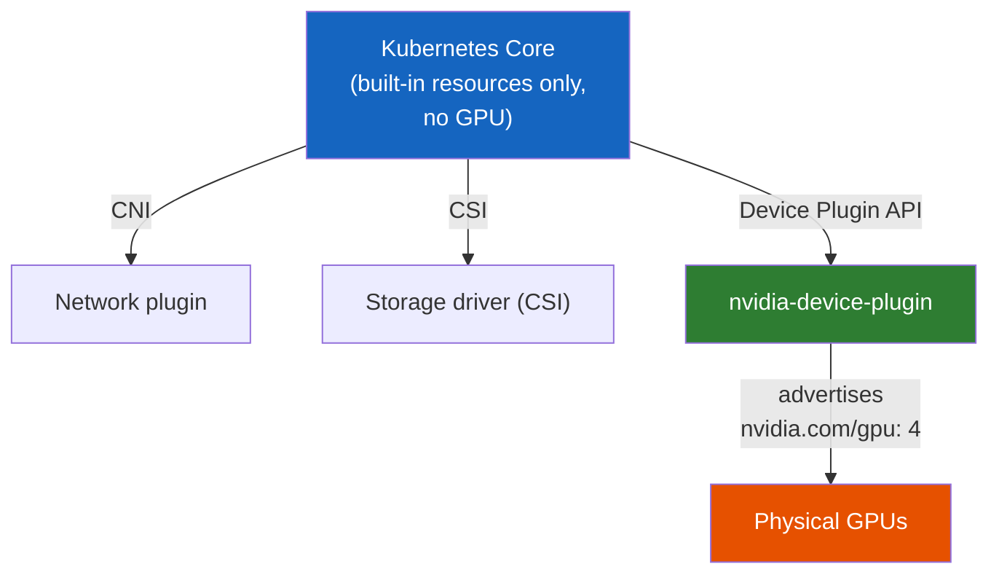
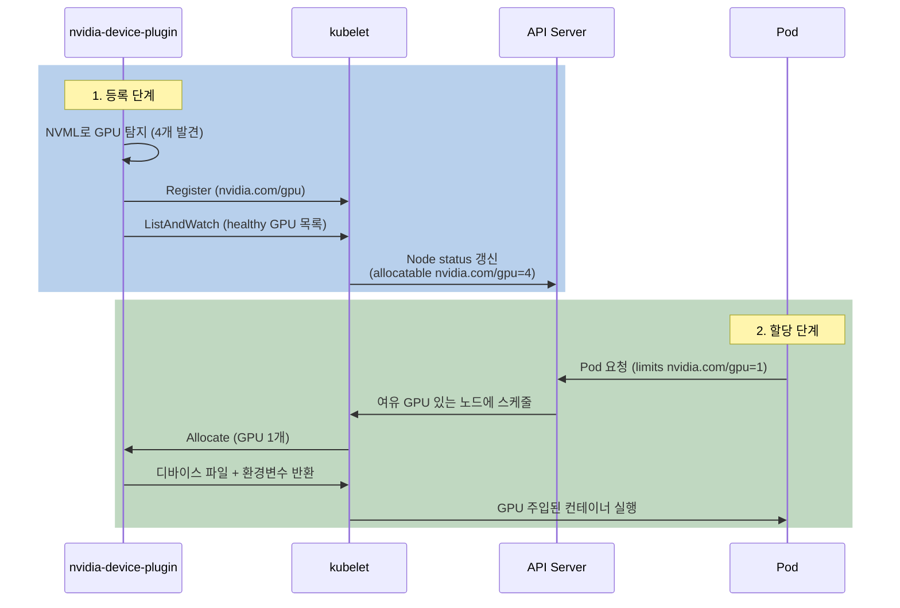

# 쿠버네티스는 GPU를 모른다 — nvidia-device-plugin은 어떻게 GPU를 자원으로 통역하는가

쿠버네티스가 GPU를 직접 관리하는 걸까? 스케줄러의 내장 자원 목록에 GPU는 없는데, 어떻게 `nvidia.com/gpu: 1` 같은 요청을 처리할 수 있을까?

## 결론부터 말하면

**쿠버네티스 코어는 GPU를 모른다.** 스케줄러가 본래 이해하는 **내장 자원(built-in resource)** 은 `cpu`, `memory`, `ephemeral-storage`, `hugepages-<size>` 같은 정해진 목록뿐이다. GPU·FPGA·고성능 NIC 같은 특수 하드웨어는 **이 목록에 없고**, **Device Plugin** 이라는 확장 인터페이스를 통해 "곁다리로" 끼워 넣는다.

`nvidia-device-plugin`은 그 Device Plugin 인터페이스의 **NVIDIA 구현체**다. 즉 "쿠버네티스가 GPU를 관리한다"가 아니라, **NVIDIA가 만든 플러그인이 GPU를 쿠버네티스에게 '셀 수 있는 자원'으로 통역해 주는 것**이다. 이는 네트워크를 CNI에, 스토리지를 CSI에, 컨테이너 런타임을 CRI에 위임하는 것과 **완전히 동일한 철학**이다.



| 위임 영역 | 인터페이스 | 코어가 정의하는 것 | 벤더가 구현하는 것 |
|-----------|-----------|---------------------|---------------------|
| 네트워크 | **CNI** | "Pod에 IP를 붙여라" | Calico, Cilium, Flannel... |
| 스토리지 | **CSI** | "볼륨을 붙였다 떼어라" | EBS, Ceph, Longhorn... |
| 컨테이너 런타임 | **CRI** | "컨테이너를 띄워라" | containerd, CRI-O... |
| **특수 하드웨어** | **Device Plugin** | "이 노드에 장치가 몇 개 있나" | **nvidia-device-plugin**, AMD, Intel... |

## 1. 왜 쿠버네티스는 GPU를 직접 다루지 않을까?

여기서 자연스러운 의문이 생긴다. GPU는 AI 워크로드의 핵심인데, 왜 쿠버네티스는 처음부터 GPU를 1급 시민으로 다루지 않았을까? `cpu`, `memory`는 아는데 `gpu`는 모른다니, 빠뜨린 걸까?

빠뜨린 게 아니라 **의도적으로 안 넣은 것**이다. 생각해 보면 세상의 하드웨어는 GPU 하나가 아니다. NVIDIA GPU, AMD GPU, FPGA, InfiniBand 어댑터, 고성능 NIC, TPU... 게다가 같은 NVIDIA GPU라도 드라이버 버전, 초기화 방식, 디바이스 파일 경로가 제품마다 다르다. 만약 쿠버네티스 코어가 이 모든 하드웨어를 직접 코드로 끌어안으려 했다면 어떻게 됐을까?

새 GPU 모델이 나올 때마다 쿠버네티스 본체를 수정해야 한다. NVIDIA의 드라이버 버그 하나를 고치려면 쿠버네티스 릴리스를 기다려야 한다. 코어는 하드웨어 벤더의 사정에 끌려다니며 비대해진다. **이건 지속 가능하지 않다.**

그래서 쿠버네티스는 다른 길을 택했다. 코어는 "장치를 어떻게 발견하고 광고하고 할당하는가"라는 **규칙(인터페이스)만 정의**하고, 실제 하드웨어를 다루는 일은 그 규칙을 따르는 **외부 플러그인에 위임**한다. 이것이 2017년 v1.8에서 등장한 **Device Plugin Framework** 다.

## 2. 일관된 철학: 코어는 인터페이스, 구현은 위임

이 위임 패턴은 Device Plugin만의 것이 아니다. 쿠버네티스를 관통하는 **설계 철학**이다. 쿠버네티스가 거대한 생태계를 이루면서도 코어가 비교적 날씬하게 유지되는 비결이 바로 여기 있다.

> 코어는 "**무엇을(What)**" 할지 인터페이스로만 못 박는다. "**어떻게(How)**" 할지는 벤더가 플러그인으로 구현해 꽂는다.

전기 콘센트를 떠올리면 쉽다. 콘센트(인터페이스)는 220V·규격화된 구멍 모양만 정의한다. 거기에 선풍기를 꽂든 노트북 충전기를 꽂든(구현), 콘센트는 자신을 바꿀 필요가 없다. 새 가전이 나와도 규격만 맞으면 그대로 꽂힌다. 쿠버네티스의 CNI·CSI·CRI·Device Plugin이 전부 이런 "콘센트"다.

그래서 `nvidia-device-plugin`을 이해하는 가장 정확한 관점은 이렇다 — **이것은 쿠버네티스의 일부가 아니라, 쿠버네티스가 만들어 둔 콘센트에 NVIDIA가 꽂은 어댑터다.** 쿠버네티스 코어 코드 어디에도 "NVIDIA"라는 단어는 없다. GPU를 아는 것은 오직 이 플러그인뿐이고, 코어는 그저 플러그인이 보고하는 `nvidia.com/gpu`라는 **이름 붙은 숫자**를 셀 뿐이다.

## 3. nvidia-device-plugin이 GPU를 통역하는 과정

그렇다면 이 "통역"은 구체적으로 어떻게 일어날까? 핵심 무대는 각 노드에서 컨테이너를 실제로 띄우는 에이전트인 **kubelet**이다. Device Plugin은 kubelet과 gRPC로 대화하며, 크게 **등록 단계**와 **할당 단계** 두 막으로 나뉜다.



**등록 단계**부터 보자. `nvidia-device-plugin`은 GPU가 달린 모든 노드에 **DaemonSet** 으로 배포된다(노드마다 정확히 하나씩 떠야 하니 DaemonSet이 딱 맞다). 이 등록은 **사용자 파드와 무관하게, 디바이스 플러그인 파드가 노드에서 한 번 구동될 때** 일어난다. 플러그인 파드가 뜨면 먼저 NVIDIA의 라이브러리 **NVML(NVIDIA Management Library)** 로 노드에 GPU가 몇 개 있는지, 건강한지를 조사한다. 그다음 kubelet이 열어 둔 유닉스 소켓(`/var/lib/kubelet/device-plugins/`)으로 접속해 자신을 **등록(Register)** 한다. 이때 넘기는 핵심 정보가 자원 이름이다.

여기서 그 독특한 이름 규칙이 등장한다. Device Plugin이 광고하는 자원 이름은 반드시 `vendor-domain/resourcetype` 형식이어야 한다 — 그래서 `nvidia.com/gpu`다. 도메인을 붙이는 이유는 명확하다. AMD가 `amd.com/gpu`를, Intel이 `intel.com/...`을 동시에 광고해도 충돌하지 않게, **자원 이름 공간을 벤더별로 격리** 하는 것이다.

등록 후 플러그인은 `ListAndWatch`로 건강한 GPU 목록을 kubelet에 스트리밍한다. kubelet은 이걸 받아 API 서버에 노드 상태를 갱신한다. 이제 비로소 다음이 보인다.

```bash
$ kubectl describe node gpu-node-01
Capacity:
  cpu:                32
  memory:             257640Mi
  nvidia.com/gpu:     4      # <- 플러그인이 광고해서 생긴 "확장 자원"
Allocatable:
  nvidia.com/gpu:     4
```

`cpu`, `memory`는 쿠버네티스에 내장된 자원이지만, `nvidia.com/gpu`는 **플러그인이 보고했기 때문에 동적으로 생긴** 자원이다. 이런 것을 **Extended Resource** 라 부른다. 플러그인 파드를 내리면 이 줄도 사라진다.

이제 **할당 단계**다. 사용자가 파드에서 GPU를 요청한다.

```yaml
resources:
  limits:
    nvidia.com/gpu: 1   # GPU는 limits로만 지정 (정수, 오버커밋 불가)
```

참고로 확장 자원은 `requests`와 `limits` 값이 반드시 같아야 해서, 위처럼 `limits`만 적으면 `requests`도 자동으로 같은 값이 된다("limits로만 지정"한다는 관용 표현은 이 규칙 때문이다). 스케줄러는 `nvidia.com/gpu` 여유분이 있는 노드를 찾아 파드를 배치한다. 여기까지는 cpu·memory를 스케줄링하는 것과 똑같다 — 스케줄러 입장에서 GPU는 그냥 "이름이 좀 긴 셀 수 있는 자원"일 뿐이다. 노드에 배치가 끝나면 kubelet이 플러그인의 `Allocate()`를 호출하고, 플러그인은 컨테이너에 꽂아야 할 **디바이스 파일(`/dev/nvidia0` 등)과 환경변수**를 돌려준다. kubelet은 이 정보로 컨테이너를 띄운다. 통역 완료다.

## 4. 플러그인 하나로는 GPU가 안 돌아간다

여기서 가장 흔한 오해를 짚어야 한다. **`nvidia-device-plugin`만 설치하면 GPU가 동작할 것 같지만, 그렇지 않다.** 플러그인은 "GPU가 몇 개인지 세서 광고하고, 할당 시 디바이스 파일을 알려주는" 역할만 한다. 정작 컨테이너가 GPU를 실제로 만지려면 그 아래에 깔린 다른 층들이 모두 갖춰져 있어야 한다.

| 계층 | 역할 | 없으면? |
|------|------|---------|
| **NVIDIA 드라이버** (호스트) | 커널이 GPU를 인식 | OS가 GPU 자체를 못 본다 |
| **nvidia-container-toolkit** | 컨테이너 런타임이 GPU 디바이스를 컨테이너 안으로 노출 | 컨테이너 안에서 GPU에 접근 불가 |
| **nvidia-device-plugin** | 쿠버네티스에 GPU를 "셀 수 있는 자원"으로 광고 | 스케줄러가 GPU를 모른다 |

즉 device-plugin은 **쿠버네티스 레이어의 통역사**일 뿐, GPU 접근의 실제 배관은 드라이버와 container-toolkit이 담당한다. 셋이 톱니바퀴처럼 맞물려야 비로소 파드가 GPU를 쓴다.

실무에서는 이 세 가지를 하나씩 수동으로 까는 대신 **NVIDIA GPU Operator** 를 쓴다. GPU Operator는 드라이버·toolkit·device-plugin·모니터링까지 한 번에 자동 배포·관리해 주는 쿠버네티스 오퍼레이터다. 노드에 GPU가 추가되면 알아서 필요한 컴포넌트를 깔아 준다.

## 5. 한계와 미래: 통째 할당, 그리고 DRA

마지막으로 이 모델의 한계를 알아야 실무 함정을 피한다. Device Plugin 모델에서 **GPU는 기본적으로 통째로 할당** 된다. 파드 하나가 `nvidia.com/gpu: 1`을 점유하면, 그 GPU가 10%만 쓰이고 있어도 다른 파드는 끼어들 수 없다(오버커밋 불가). 비싼 H100을 한 파드가 독점하는 셈이라, GPU 클러스터의 비용 효율에서 가장 아픈 지점이다.

이를 쪼개 쓰려면 별도 기법이 필요하다 — 시간 분할인 **Time-Slicing**, 프로세스 공유인 **MPS**, 또는 하드웨어 차원에서 GPU를 여러 인스턴스로 가르는 **MIG(Multi-Instance GPU)** 다. 이들이 device-plugin에 광고되는 방식도 다르다. Time-Slicing은 물리 GPU 1개를 같은 `nvidia.com/gpu` 자원 N개로 **수량만 부풀려** 광고한다(같은 GPU를 N개 파드가 시분할). 반면 MIG를 `mixed` 전략으로 켜면 `nvidia.com/gpu` 대신 `nvidia.com/mig-1g.10gb`처럼 **프로파일별로 세분화된 자원 이름** 을 광고한다(`single` 전략에서는 MIG 조각도 `nvidia.com/gpu`로 노출된다). 하지만 이들조차 Device Plugin의 근본 한계 위에서의 우회책이다. Device Plugin이 광고하는 것은 결국 **"있다/없다 + 개수"라는 단순한 정수** 일 뿐, "이 GPU는 80GB 메모리에 NVLink로 연결돼 있다" 같은 풍부한 속성을 표현하지 못하기 때문이다.

그래서 쿠버네티스 커뮤니티는 더 정교한 후계 모델을 만들었다. **DRA(Dynamic Resource Allocation)** 다. DRA는 드라이버가 하드웨어를 **풍부한 속성과 제약 조건** 으로 기술하게 해, "메모리 40GB 이상 + 특정 MIG 프로파일 + NVLink로 묶인 GPU 2개"처럼 세밀하게 요청할 수 있다. DRA는 v1.26 알파로 시작해 v1.32에서 베타로 올라섰고, **v1.34(2025년 8월)에서 핵심 API(`resource.k8s.io`)가 GA(정식)로 승격** 됐다. 나아가 **2026년 KubeCon Europe에서 NVIDIA가 자사 DRA 드라이버를 CNCF에 기증** 하면서 차세대 표준으로 자리를 굳혔다.

여기서 중요한 점 — DRA가 등장했다고 해서 쿠버네티스의 철학이 바뀐 건 아니다. DRA 역시 **코어는 인터페이스만 정의하고 드라이버에 위임** 한다. 표현력이 "정수 개수"에서 "속성과 제약"으로 풍부해졌을 뿐, 1막에서 본 그 위임 철학의 연장선이다. 당장은 대부분의 클러스터가 여전히 device-plugin으로 돌아가지만, 새 GPU 인프라를 설계한다면 DRA를 염두에 둘 시점이다.

## 정리

### 핵심 포인트

1. **쿠버네티스 코어는 GPU를 모른다 — 플러그인이 통역한다**
   - 스케줄러의 내장 자원 목록(`cpu`, `memory`, `ephemeral-storage`, `hugepages-<size>`)에 GPU는 없다. `nvidia-device-plugin`이 GPU를 `nvidia.com/gpu`라는 셀 수 있는 자원으로 광고해야 비로소 코어가 인식한다.

2. **"코어는 인터페이스, 구현은 위임"이라는 일관된 철학**
   - CNI(네트워크)·CSI(스토리지)·CRI(런타임)와 똑같이, Device Plugin은 코어가 만들어 둔 "콘센트"이고 nvidia-device-plugin은 거기 꽂힌 어댑터다. 그래서 코어 코드에 "NVIDIA"는 없다.

3. **플러그인은 통역사일 뿐, 혼자서는 GPU를 못 돌린다**
   - 드라이버(호스트 인식) + container-toolkit(컨테이너 노출) + device-plugin(쿠버네티스 광고)이 함께 있어야 한다. 실무에서는 GPU Operator로 한 번에 관리한다.

4. **기본은 GPU 통째 할당 — 미래는 DRA**
   - Device Plugin은 GPU를 정수 단위로만 다뤄 1파드=1GPU 독점이 기본. 쪼개려면 Time-Slicing/MPS/MIG가 필요하다. 더 정교한 후계 모델 DRA가 v1.34에서 GA로 승격되며 본격화됐지만, 위임 철학은 그대로다.

---

## 출처

- [Device Plugins | Kubernetes](https://kubernetes.io/docs/concepts/extend-kubernetes/compute-storage-net/device-plugins/) - 공식 문서
- [Schedule GPUs | Kubernetes](https://kubernetes.io/docs/tasks/manage-gpus/scheduling-gpus/) - 공식 문서
- [Kubernetes 1.26: Device Manager graduates to GA](https://kubernetes.io/blog/2022/12/19/devicemanager-ga/) - 쿠버네티스 공식 블로그
- [NVIDIA/k8s-device-plugin](https://github.com/NVIDIA/k8s-device-plugin) - nvidia-device-plugin 공식 저장소
- [GPU Orchestration in Kubernetes: Device Plugin or GPU Operator?](https://thenewstack.io/gpu-orchestration-in-kubernetes-device-plugin-or-gpu-operator/) - The New Stack
- [Kubernetes GPU Orchestration in 2026: DRA, KAI Scheduler, and Grove](https://www.spheron.network/blog/kubernetes-gpu-orchestration-2026) - DRA 최신 동향
