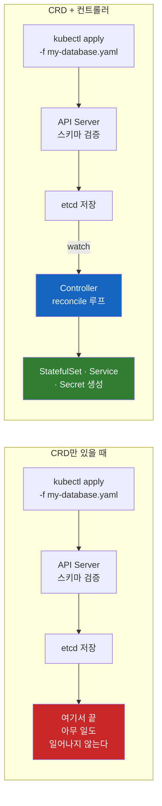
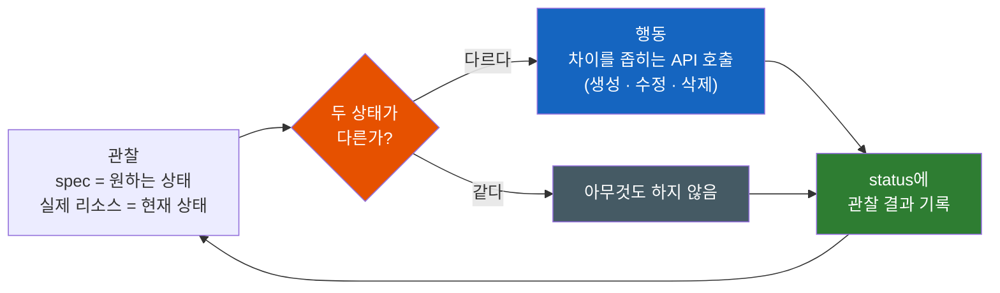
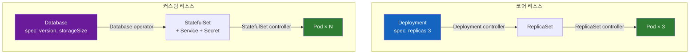

# 쿠버네티스는 어떻게 자기 자신을 확장할까 — CRD와 컨트롤러, 그리고 Operator

운영 중인 클러스터에서 `kubectl api-resources`를 실행하면, 쿠버네티스 공식 문서 어디에도 없는 `kind`가 수십 개 쏟아진다. 그런데 그것들도 `kubectl apply -f`로 만들어지고 `kubectl get`으로 조회된다. Deployment와 완전히 같은 방식으로 다뤄지는데, 쿠버네티스 코어에는 없는 타입이다. API는 어떻게 이렇게 늘어났고, 왜 그게 Deployment와 구별되지 않는가?

---

## 결론부터 말하면

**API 서버는 타입을 저장할 뿐, 그 타입에 의미를 부여하는 것은 컨트롤러다.** 그리고 **코어 리소스도 정확히 같은 방식으로 동작한다.**

`CustomResourceDefinition`(CRD)을 apply하면 API 서버에 새 엔드포인트와 스키마가 생긴다. 여기까지가 API 서버의 일이다 — YAML을 검증해서 etcd에 저장하는 것. 그 리소스를 보고 "그래서 Pod를 몇 개 띄우고, 디스크를 붙이고, 백업을 뜬다"를 실행하는 주체는 **별도로 돌고 있는 컨트롤러** 다. 그래서 CRD만 만들고 커스텀 리소스를 apply하면 **아무 일도 일어나지 않는다.**



| 역할 | 담당 | 하는 일 |
|------|------|---------|
| **타입과 저장** | API 서버 (+ CRD) | 새 엔드포인트 개설, 스키마 검증, etcd에 저장, watch 스트림 제공 |
| **의미와 실행** | 컨트롤러 | spec을 읽고 실제 상태와 비교해 차이를 좁히는 행동, status 보고 |
| **도메인 운영 지식** | Operator | 위 컨트롤러 + "이 소프트웨어를 어떻게 운영하는가"(백업·승격·업그레이드) |

공식 문서가 이 분리를 한 문장으로 못 박는다.

> On their own, custom resources let you store and retrieve structured data. When you combine a custom resource with a *custom controller*, custom resources provide a true *declarative API*.

이 글은 그 문장을 따라간다. CRD를 만들면 정확히 무엇이 생기는지, 왜 그것만으로는 아무 일도 안 일어나는지, 컨트롤러가 붙으면 무엇이 달라지는지, 그리고 **왜 Deployment도 결국 같은 구조인지** 까지.

---

## 1. CRD를 apply하면 정확히 무엇이 생기는가

CRD는 "쿠버네티스 API에 새 타입을 등록해 달라"는 요청서다. 그 자체가 하나의 쿠버네티스 리소스이고, 안정 버전은 `apiextensions.k8s.io/v1`(GA)다.

```yaml
apiVersion: apiextensions.k8s.io/v1
kind: CustomResourceDefinition
metadata:
  name: databases.example.com     # <plural>.<group> 형식이 강제된다
spec:
  group: example.com
  scope: Namespaced               # 이 타입의 인스턴스를 네임스페이스에 둘지, 클러스터 전역에 둘지
  names:
    plural: databases
    singular: database
    kind: Database
    shortNames: [db]              # kubectl get db 가 동작하게 된다
  versions:
  - name: v1
    served: true                  # 이 버전의 REST 엔드포인트를 열 것인가
    storage: true                  # etcd에 저장할 때 쓸 버전 (정확히 하나만 true)
    schema:
      openAPIV3Schema:            # v1에서는 스키마가 필수다 (beta에서는 선택이었다)
        type: object
        properties:
          spec:
            type: object
            properties:
              version: { type: string }
              storageSize: { type: string }
            required: [version]
    subresources:
      status: {}                  # 5절에서 다룬다
```

이 파일 하나를 apply하는 순간 생기는 것들이 있다.

먼저 **새 REST 엔드포인트** 가 열린다. `/apis/example.com/v1/namespaces/my-app/databases` 같은 경로가 생기고, API 서버가 이 경로의 요청을 직접 처리한다. 이 시점부터 `kubectl get databases`가 "the server doesn't have a resource type" 에러를 내지 않는다. `kubectl api-resources`에도 나타난다 — 처음의 질문, 공식 문서에 없는 `kind`가 수십 개 나오는 이유가 바로 이것이다. 누군가 이 클러스터에 CRD를 그만큼 설치했다는 뜻이다.

둘째로 **스키마 검증** 이 붙는다. `openAPIV3Schema`에 적힌 구조가 그대로 검증 규칙이 되어, 오타 난 필드나 타입이 틀린 값은 apply 단계에서 거부된다. `apiextensions.k8s.io/v1`에서는 이 구조적 스키마(structural schema)가 **필수** 다 — beta 시절에는 생략할 수 있었지만 v1에서는 없으면 CRD 자체가 거부된다. API 서버가 저장 전에 요청을 검증하고 etcd에 쓰는 이 전체 흐름(인증 → 인가 → admission → 검증 → 저장)은 [내가 만들지 않은 컨테이너가 왜 Pod에 들어와 있을까 — Admission Webhook](내가-만들지-않은-컨테이너가-왜-Pod에-들어와-있을까-Admission-Webhook.md)에서 다룬다.

셋째로 **기존 생태계가 전부 따라붙는다.** 이게 CRD의 진짜 가치다. 새 타입은 `kubectl`의 모든 서브커맨드(`get`, `describe`, `edit`, `apply`, `label`)를 그냥 쓸 수 있고, RBAC의 대상이 되어 `resources: ["databases"]`로 권한을 나눌 수 있고, `kubectl get -w`나 클라이언트 라이브러리의 watch가 그대로 동작하고, 라벨과 어노테이션과 `ownerReferences`도 코어 리소스와 똑같이 붙는다. 자체 API 서버를 한 줄도 쓰지 않고 이 모든 것을 얻는다.

여기까지 오면 자연스럽게 이런 기대가 생긴다. **"타입이 생겼으니, 이제 이 리소스를 만들면 뭔가 돌아가겠지."**

---

## 2. 그런데 아무 일도 일어나지 않는다

커스텀 리소스를 만들어 보자.

```yaml
apiVersion: example.com/v1
kind: Database
metadata:
  name: my-db
  namespace: my-app
spec:
  version: "16"
  storageSize: 20Gi
```

```bash
$ kubectl apply -f my-db.yaml
database.example.com/my-db created      # 성공했다

$ kubectl get databases -n my-app
NAME    AGE
my-db   30s                             # 조회도 된다

$ kubectl get pods,statefulsets,pvc -n my-app
No resources found in my-app namespace. # 그런데 아무것도 없다
```

**이 지점이 이 글의 전환점이다.** apply는 성공했고, `kubectl get`으로 조회되고, `kubectl edit`으로 수정도 된다. 리소스는 분명히 "존재"한다. 그런데 Pod도, StatefulSet도, PVC도 없다. 30분을 기다려도 없다.

버그가 아니다. **CRD는 스키마가 있는 저장소일 뿐이기 때문이다.** API 서버가 하는 일은 "이 YAML을 스키마로 검증해서 etcd에 저장하고, 요청이 오면 되돌려주는" 것까지다. 그 안에 적힌 `version: "16"`이 "PostgreSQL 16을 띄워라"라는 뜻인지, "16개의 무언가를 만들어라"라는 뜻인지, API 서버는 알지도 못하고 알 필요도 없다. **의미를 부여하는 것은 API 서버의 일이 아니다.**

이 착각이 흔한 이유는 코어 리소스에서는 그 경계가 안 보이기 때문이다. Deployment를 apply하면 Pod가 알아서 생기니까 "API 서버가 만들어 주는 것"처럼 느껴진다. 실제로는 Deployment도 똑같다 — API 서버는 그것을 저장했을 뿐이고, 별도로 돌고 있던 컨트롤러가 그것을 보고 움직인 것이다. 우리가 그 컨트롤러를 설치한 기억이 없는 이유는, 쿠버네티스가 처음부터 그것을 `kube-controller-manager` 안에 넣어 함께 띄워 줬기 때문이다. 4절에서 이 이야기로 돌아온다.

그래서 답은 하나다. **누군가 이 리소스를 보고 움직여 줘야 한다.**

---

## 3. 그래서 컨트롤러가 필요하다 — reconciliation loop

컨트롤러는 특별한 것이 아니다. **API 서버에 접속해 특정 타입을 지켜보며, "원하는 상태"와 "실제 상태"의 차이를 계속 좁히는 프로그램** 이다. 클러스터 안에서 그냥 Deployment로 돌아가는 평범한 Pod일 뿐이다.

공식 문서는 이것을 로봇공학의 **제어 루프(control loop)** 로 설명한다.

> In robotics and automation, a *control loop* is a non-terminating loop that regulates the state of a system.

가장 좋은 비유는 문서에 나오는 온도조절기다. 온도를 22도로 맞춰 두는 것이 **원하는 상태(desired state)** 이고, 지금 방의 온도가 **현재 상태(current state)** 다. 온도조절기는 이 둘을 계속 비교하다가 차이가 있으면 히터를 켜거나 끈다. 목표에 도달하면 아무것도 하지 않는다. 컨트롤러가 하는 일이 정확히 이것이다.



2절의 `Database`에 컨트롤러를 붙이면 이렇게 된다. 컨트롤러는 `Database` 타입을 watch하다가 `my-db`가 생긴 것을 안다. 그리고 "이 이름에 해당하는 StatefulSet이 있나?"를 조회한다. 없다. 그래서 만든다. Service도 없으니 만든다. 비밀번호 Secret도 만든다. 다음 루프에서 다시 조회한다. 이제 다 있다. 그러면 **아무것도 하지 않는다.**

여기서 컨트롤러는 대개 "직접 하는" 것이 아니라 API 서버에 다른 리소스를 만들어 달라고 요청한다는 점이 중요하다. 공식 문서가 Job 컨트롤러를 예로 들어 설명하듯, Job 컨트롤러는 Pod나 컨테이너를 직접 실행하지 않는다. API 서버에 "Pod를 만들어라"라고 말할 뿐이고, 그러면 또 다른 컨트롤러와 kubelet이 그다음을 이어받는다. 컨트롤러들은 서로를 직접 호출하지 않고, **API 서버에 쓴 상태를 통해서만 대화한다.**

### 3-1. level-triggered vs edge-triggered — 신뢰성의 핵심

이제 이 루프의 가장 중요한 성질로 들어간다. 위 다이어그램에서 컨트롤러가 무엇을 보는지 다시 보라. **"무슨 이벤트가 왔는가"가 아니라 "지금 상태가 어떤가"를 본다.**

두 설계 방식을 구별해야 한다.

| 방식 | 판단 근거 | 이벤트를 놓치면 |
|------|-----------|-----------------|
| **edge-triggered** (변화 기반) | "방금 무엇이 변했다"는 이벤트 | 그 변화는 영구히 반영되지 않는다. 이벤트를 재생(replay)해야 복구된다 |
| **level-triggered** (상태 기반) | "지금 원하는 상태와 실제 상태가 무엇인가" | 다음 루프에서 어차피 다시 비교하므로 저절로 복구된다 |

쿠버네티스는 후자를 **설계 원칙으로 못 박았다.** 공식 설계 원칙 문서의 표현이다.

> Functionality must be level-based, meaning the system must operate correctly given the desired state and the current/observed state, regardless of how many intermediate state updates may have been missed. Edge-triggered behavior must be just an optimization.

마지막 문장이 핵심이다. **watch 이벤트는 최적화일 뿐이다.** 컨트롤러가 watch를 쓰는 이유는 "폴링보다 빠르게 알기 위해서"이고, 판단의 근거는 이벤트가 아니라 그때 조회한 실제 상태다. 그래서 이런 일들이 자동으로 해결된다.

네트워크가 끊겨 이벤트 몇 개를 놓쳐도 다음 루프에서 상태를 비교하면 차이가 드러난다. 컨트롤러 Pod가 재시작되면 그동안의 이벤트는 전부 사라지지만, 컨트롤러는 부팅 시 해당 타입 **전체를 다시 훑어(full resync)** 상태를 맞추므로 스스로 정합을 회복한다. 누군가 손으로 StatefulSet을 지워 버려도, 컨트롤러는 "있어야 할 것이 없다"를 발견하고 다시 만든다. API 서버의 상태가 곧 진실이고, 컨트롤러는 언제 끼어들어도 진실만 보면 무엇을 해야 할지 알아낸다.

같은 문서가 이 태도를 이렇게 표현한다 — "열린 세계를 가정하라(assume an open world)". 사용자가 ReplicaSet이 관리하는 Pod를 죽이는 것도 허용하고, 그냥 다시 만든다.

**그리고 이것이 곧 멱등성(idempotency) 요구로 이어진다.** 같은 리소스에 대한 reconcile은 수백 번 반복 호출될 수 있다. 이벤트가 중복되거나, 다른 리소스 변경 때문에 트리거되거나, 주기적 resync로 불려서다. 그러므로 reconcile 함수는 **"이미 되어 있으면 아무것도 하지 않는다"** 를 반드시 만족해야 한다. "이벤트를 받았으니 StatefulSet을 만든다"라고 쓰면 중복 생성이나 에러로 무너진다. "있어야 할 StatefulSet이 있는지 확인하고, 없으면 만들고, 다르면 맞춘다"라고 써야 한다. level-triggered 설계는 신뢰성을 주는 대신 이 규율을 요구한다.

### 3-2. 이것이 선언적 모델의 실체다

[Kubernetes Introduction](Kubernetes-Introduction.md)에서 "쿠버네티스는 선언적(declarative)"이라고 했던 그 말의 정체가 이것이다. 선언적이라는 건 YAML을 쓴다는 문법 이야기가 아니다.

> The Kubernetes declarative API enforces a separation of responsibilities. You declare the desired state of your resource. The Kubernetes controller keeps the current state of Kubernetes objects in sync with your declared desired state.

사용자는 **원하는 상태를 쓰고** 끝낸다. 절차를 지시하지 않는다. 절차를 실행하고, 실패하면 다시 시도하고, 누가 망가뜨리면 되돌리는 것은 컨트롤러의 몫이다. 명령형 API라면 "이걸 해라"라고 지시하고 그 명령이 실패하면 사용자가 재시도해야 한다. 선언적 모델에서는 재시도가 시스템의 기본 동작이다. **선언적 모델 = 스키마 있는 저장소 + level-triggered 컨트롤러** 인 셈이고, CRD는 앞의 절반, 컨트롤러가 뒤의 절반이다.

---

## 4. 코어 리소스도 완전히 같은 방식으로 동작한다

이 글에서 딱 하나만 기억한다면 이 절이다. 지금까지 설명한 "CRD + 컨트롤러"는 **확장을 위한 예외적 기법이 아니다. 쿠버네티스가 자기 자신을 만드는 방식과 동일한 것이다.**

Deployment를 apply하면 무슨 일이 일어나는지 되짚어 보자. API 서버는 Deployment를 검증해서 etcd에 저장한다. 그것으로 끝이다. 그다음 **Deployment 컨트롤러** 가 그것을 watch하다가 ReplicaSet을 만든다. 이번엔 **ReplicaSet 컨트롤러** 가 ReplicaSet을 watch하다가 Pod를 만든다. 그리고 **스케줄러** 가 노드가 배정되지 않은 Pod를 watch하다가 노드를 배정하고, **kubelet** 이 자기 노드에 배정된 Pod를 watch하다가 컨테이너를 띄운다. 어디에도 "누가 누구를 직접 호출한다"가 없다. 전부 **API 서버에 쓰고, 상대는 그걸 읽고 반응하는** 구조다.



두 체인이 구조적으로 구별되지 않는다. 차이는 **컨트롤러가 어디서 돌고 있는가** 하나뿐이다. Deployment 컨트롤러는 컨트롤 플레인의 `kube-controller-manager` 안에 내장되어 클러스터와 함께 뜨고, `Database` 컨트롤러는 우리가 설치한 Deployment로 뜬다. 공식 문서도 이 대칭을 인정한다 — 컨트롤러는 컨트롤 플레인 밖에서 돌 수 있고, 직접 만들어 Pod 세트로 띄울 수도 있다.

그래서 처음의 질문에 답이 나온다. **왜 커스텀 리소스가 Deployment와 구별되지 않는가?** 구별할 근거가 없기 때문이다. 둘 다 API 서버에 등록된 타입이고, 둘 다 별도 컨트롤러가 의미를 부여하며, 둘 다 spec/status 규약과 watch와 RBAC을 공유한다. Deployment는 "먼저 만들어진, 그리고 기본으로 딸려 오는" 커스텀 리소스인 셈이다. (Deployment → ReplicaSet → Pod 체인과 롤링 업데이트의 상세는 [Kubernetes ReplicaSet Deployment](Kubernetes-ReplicaSet-Deployment.md)에서 다룬다.)

실물로 확인하고 싶다면 [Tekton의 Pipeline과 PipelineRun은 왜 따로 존재할까](Tekton의-Pipeline과-PipelineRun은-왜-따로-존재할까.md)를 보라. Tekton의 `Pipeline`·`Task`·`PipelineRun`은 전부 CRD로 만들어진 타입이고, 그 YAML이 실제 Pod와 컨테이너로 내려가는 것은 Tekton 컨트롤러가 하는 일이다. `kubectl get pipelineruns`가 `kubectl get deployments`와 똑같이 동작하는 이유가 이 절의 내용이다.

---

## 5. spec과 status의 분리 — 누가 쓰는 칸인가

컨트롤러가 등장하면 새로운 문제가 생긴다. 사용자와 컨트롤러가 **같은 객체를 동시에 쓴다.** 사용자는 "원하는 상태"를 쓰고 싶고, 컨트롤러는 "관찰한 결과"를 쓰고 싶다. 이 둘이 한 칸에 섞이면 서로를 덮어쓴다.

그래서 쿠버네티스 API 규약은 처음부터 객체를 두 칸으로 나눴다. `spec`은 **사람이 쓰는 칸**, `status`는 **컨트롤러가 쓰는 칸** 이다. API 규약 문서는 권한 경계까지 못 박는다.

> [users are] granted full write access to `spec` and read-only access to status, while relevant controllers are granted read-only access to `spec` but full write access to status

CRD에서 이 분리를 실제로 강제하는 장치가 **status 서브리소스** 다. 앞의 CRD 예제에 있던 `subresources: { status: {} }` 한 줄이 그것이고, 켜면 세 가지가 달라진다.

첫째, `/status`라는 **별도 엔드포인트** 가 생긴다. 이는 RBAC에서 `databases/status`라는 독립적인 대상이 되므로, "컨트롤러 ServiceAccount에는 status 쓰기만, 사용자에게는 spec 쓰기만" 같은 권한 분리가 가능해진다. (RBAC 문법과 ServiceAccount는 [Pod는 어떻게 쿠버네티스 API에 자기를 증명할까 — ServiceAccount와 RBAC](Pod는-어떻게-쿠버네티스-API에-자기를-증명할까-ServiceAccount와-RBAC.md)에서 다룬다.)

둘째, **덮어쓰기가 구조적으로 차단된다.** 공식 문서의 규칙이 명확하다 — 메인 리소스로 오는 `PUT`/`POST`/`PATCH` 요청은 `status` 변경을 무시하고, `/status`로 오는 `PUT` 요청은 `status` 외의 모든 변경을 무시한다. 사용자가 `kubectl apply`로 status를 건드릴 수도, 컨트롤러가 실수로 사용자의 spec을 되돌릴 수도 없다.

셋째, `.metadata.generation`의 증가 규칙이 쓸모 있어진다. 규칙은 이렇다.

> The `.metadata.generation` value is incremented for all changes, except for changes to `.metadata` or `.status`.

즉 **spec이 바뀔 때만 `generation`이 오른다.** 이것이 실무에서 꽤 중요한 필드 하나를 가능하게 한다.

### observedGeneration — "컨트롤러가 아직 못 봤다"를 아는 방법

컨트롤러가 `status`에 `observedGeneration`을 기록하는 관행이 여기서 나온다. API 규약의 정의는 "원하는 상태의 변경에 반응할 책임이 있는 컴포넌트가 가장 최근에 관찰한 `generation`"이다.

이게 왜 필요한지는 아주 흔한 상황에서 드러난다. `Database`의 `spec.version`을 16에서 17로 바꾸고 바로 status를 봤다고 하자. `status.phase: Ready`가 찍혀 있다. 업그레이드가 벌써 끝난 걸까? 아니다. **컨트롤러가 아직 내 변경을 못 봤을 뿐** 이고, 그 `Ready`는 바꾸기 **전** 상태에 대한 보고다.

```bash
$ kubectl get database my-db -o jsonpath='{.metadata.generation}{"\t"}{.status.observedGeneration}'
7	6      # spec은 7세대인데 컨트롤러는 6세대까지만 봤다 → status는 아직 옛 이야기
```

두 숫자가 같아질 때만 status를 믿을 수 있다. 이 규약이 없다면 "적용이 끝났는지"를 판단할 방법이 없어, 배포 자동화가 옛 상태를 보고 성공을 선언하게 된다.

---

## 6. finalizer — 리소스를 지웠는데 사라지지 않는다

다음 함정은 삭제에서 나온다. 컨트롤러가 만든 것이 클러스터 안에만 있는 게 아닐 수 있다. 클라우드 로드밸런서, 외부 DNS 레코드, S3의 백업 파일 같은 것들이다. 그렇다면 `Database` 객체가 지워지는 순간 그것들은 누가 치우는가? 객체가 이미 사라졌다면 컨트롤러는 무엇을 치워야 할지조차 알 수 없다.

그래서 쿠버네티스는 **삭제를 두 단계로 나눈다.** `metadata.finalizers`에 키가 하나라도 있으면, 삭제 요청은 **즉시 삭제가 아니라 "삭제 예약"** 이 된다.

```bash
$ kubectl delete database my-db
database.example.com "my-db" deleted   # 메시지는 이렇게 나오지만

$ kubectl get database my-db -o yaml | grep -A3 metadata:
metadata:
  deletionTimestamp: "2026-07-28T09:14:22Z"   # 삭제 예약 시각이 찍혔을 뿐
  finalizers:
  - example.com/cleanup-backups               # 이 키가 남아 있는 동안은 안 사라진다
```

공식 문서의 설명은 이렇다. finalizer가 있는 객체에 대한 첫 삭제 요청은 `metadata.deletionTimestamp`를 채우지만 객체를 지우지 않는다. 그 값이 설정되면 `finalizers` 목록에서는 **항목을 제거할 수만 있다**(추가는 불가). 그리고 `deletionTimestamp`를 본 컨트롤러가 자기가 담당하는 finalizer의 정리 작업을 수행하고, 끝나면 목록에서 자기 키를 뺀다. **목록이 비면 그때 쿠버네티스가 실제로 객체를 삭제한다.**

정상 동작은 이렇다. 삭제 요청 → `deletionTimestamp` 찍힘 → 컨트롤러가 마지막 백업을 뜨고 클라우드 리소스를 정리 → 자기 finalizer 제거 → 객체 소멸. 순서가 보장되므로 "객체는 사라졌는데 클라우드에 고아 리소스가 남는" 사고가 나지 않는다.

### 실무 함정: 컨트롤러가 죽은 상태에서 지우면 영원히 Terminating

문제는 그 finalizer를 뗄 주체가 컨트롤러라는 점이다. **컨트롤러가 죽어 있거나 이미 삭제된 상태에서 리소스를 지우면, 뗄 사람이 없으므로 객체는 영원히 `Terminating`에 갇힌다.** 오퍼레이터를 uninstall한 뒤에 남은 커스텀 리소스를 정리하려다 이 상황에 빠지는 것이 가장 흔한 시나리오다. 네임스페이스 하나가 통째로 `Terminating`에서 안 내려가는 사건의 원인도 대개 그 안의 어떤 리소스에 남은 finalizer다.

여기서 반드시 알아야 할 사실이 있다. **`--force`로는 통과하지 못한다.** 공식 문서의 문장이다.

> While any finalizers remain it is also impossible to force the deletion of an object.

`kubectl delete --force --grace-period=0`은 Pod의 graceful 종료 대기를 건너뛰는 옵션이지, finalizer를 무시하는 옵션이 아니다. 두 개는 전혀 다른 메커니즘이고, 흔히 뒤섞여 쓰인다.

출구는 하나뿐이다. `metadata.finalizers`를 직접 비우는 것이다.

```bash
# 최후의 수단 — 무엇을 포기하는지 알고 써야 한다
kubectl patch database my-db -p '{"metadata":{"finalizers":[]}}' --type=merge
```

이 명령이 하는 일을 정확히 이해해야 한다. 이건 "정리를 완료했다고 통보하는" 것이 아니라 **"정리를 하지 않기로 결정하는" 것** 이다. 컨트롤러가 하려던 일 — 마지막 백업, 클라우드 로드밸런서 해제, 외부 DNS 레코드 삭제, 볼륨 스냅샷 — 이 전부 실행되지 않은 채 객체만 사라진다. 결과는 **아무도 소유권을 주장하지 않는 고아 리소스** 이고, 클라우드 리소스라면 조용히 과금이 계속된다. 쿠버네티스 문서가 이 행동에 경고를 붙인 이유다 — finalizer는 이유가 있어서 붙었으므로, 그 목적을 이해하고 **다른 방법으로 정리를 마쳤을 때만** 강제로 떼라.

그래서 올바른 순서는 이것이다. 먼저 컨트롤러를 되살려서 스스로 정리하게 하고, 그게 불가능하면 클라우드 콘솔에서 해당 리소스를 사람이 직접 지운 뒤, 그다음에 finalizer를 뗀다.

---

## 7. Operator = CRD + 컨트롤러 + 도메인 운영 지식

지금까지의 재료를 조립하면 Operator가 나온다. 공식 문서의 정의는 간결하다.

> Operators are software extensions to Kubernetes that make use of custom resources to manage applications and their components. Operators follow Kubernetes principles, notably the control loop.

그런데 왜 이런 것이 필요한가. 이 질문은 StatefulSet의 경계를 보면 선명해진다.

데이터베이스를 쿠버네티스에 올린다고 하자. [StatefulSet](Kubernetes-StatefulSet.md)은 Pod에 **안정적인 이름과 순서, 그리고 각자의 디스크** 를 준다. 여기까지는 훌륭하다. 그런데 실제 운영에서 필요한 것들을 떠올려 보라.

primary가 죽었을 때 세 replica 중 **어느 것을 primary로 승격** 해야 하는가? 복제 지연이 가장 적은 것을 골라야 하는데, 그 판단 기준은 그 데이터베이스의 복제 프로토콜에 있다. 백업은 **언제 어떤 방식으로** 떠야 하는가? 물리 백업인지 논리 백업인지, WAL을 어디까지 보관해야 하는지는 그 소프트웨어의 사정이다. 메이저 버전 업그레이드는 **어떤 순서로** 해야 하는가? replica를 먼저 올리고 primary를 나중에 올려야 하는지, 스키마 마이그레이션을 어느 시점에 끼워야 하는지도 마찬가지다.

**쿠버네티스는 이것을 알 수 없다.** 알아서도 안 된다. 이건 특정 소프트웨어의 도메인 지식이고, 쿠버네티스가 세상의 모든 데이터베이스의 승격 규칙을 코어에 담을 수는 없다. 그래서 지금까지 이 일은 사람이 했다 — 위키에 적힌 런북(runbook)을 보고, 새벽에 호출을 받아, 손으로 명령을 쳤다.

**Operator는 그 런북을 컨트롤러 코드로 옮긴 것이다.** 공식 문서가 이를 사람 운영자(SRE) 비유로 설명하는 이유다 — 특정 애플리케이션을 돌보는 사람은 "이 시스템이 어떻게 동작해야 하는지, 어떻게 배포하고, 문제가 생기면 어떻게 반응해야 하는지"에 대한 깊은 지식을 갖고 있고, Operator 패턴은 그 지식을 코드로 포착한다. 문서가 드는 예가 정확히 런북의 항목들이다 — 온디맨드 배포, 백업과 복원, 애플리케이션 코드와 DB 스키마의 동시 업그레이드, 실패 시뮬레이션, 그리고 **분산 애플리케이션의 리더 선출**.

### Operator Capability Level — 어디까지 자동화했는가

Operator라고 다 같은 수준이 아니다. Operator Framework는 성숙도를 5단계로 정의한다. 각 단계는 누적적이다.

| Level | 이름 | 자동화한 것 |
|-------|------|-------------|
| **I** | Basic install | 애플리케이션 프로비저닝과 설정 관리 자동화 |
| **II** | Seamless Upgrades | 패치·마이너 버전 업그레이드 지원 |
| **III** | Full lifecycle | 앱·스토리지 수명주기 — 백업, 장애 복구 |
| **IV** | Deep Insights | 메트릭, 알림, 로그 처리, 워크로드 분석 |
| **V** | Auto Pilot | 수평·수직 스케일링, 설정 자동 튜닝, 이상 감지, 스케줄링 튜닝 |

이 표를 읽는 법은 "몇 레벨이 좋다"가 아니다. **오퍼레이터를 도입할 때 "우리가 런북에서 지우고 싶은 항목이 몇 레벨에 있는가"를 확인하는 체크리스트** 로 쓰는 것이다. 설치만 자동화된 Level I 오퍼레이터를 도입하고 "이제 백업도 알아서 되겠지"라고 기대하면 사고가 난다.

> 어떤 Database Operator들이 있는지, 그리고 "StatefulSet을 직접 관리할까 vs Operator를 쓸까"의 판단 기준은 [Kubernetes StatefulSet](Kubernetes-StatefulSet.md)의 12절에서 상세히 다룬다.

---

## 8. CRD가 안 맞는 자리 — Aggregated API Server

CRD가 만능은 아니다. 공식 문서는 쿠버네티스 API를 확장하는 방법이 **두 가지** 라고 명시하고, 그 둘을 쉬움과 유연함의 트레이드오프로 배치한다.

> CRDs are simple and can be created without any programming. API Aggregation requires programming, but allows more control over API behaviors like how data is stored and conversion between API versions.

CRD는 **etcd에 저장되는 선언적 리소스** 에 맞는다. 개수가 적고, 크기가 작고, 자주 바뀌지 않고, 사람이 읽고 쓰며, 동작이 CRUD에 가까운 것들이다. 반대로 이런 경우에는 CRD로 안 된다 — **저장을 직접 통제해야 하거나**(자체 백엔드, 또는 대량·고빈도 데이터), **응답을 저장된 값이 아니라 그때그때 계산해서 만들어야 하는** 경우다. etcd는 그런 용도로 설계되지 않았고, 문서도 애플리케이션 데이터를 커스텀 리소스에 담지 말라고 명시적으로 경고한다.

그럴 때 쓰는 것이 **Aggregation Layer** 다. `APIService` 객체를 등록해 API 경로의 일부를 "찜"하면, `kube-apiserver`가 그 경로로 오는 요청을 **외부 서비스로 프록시** 한다. 사용자 입장에서는 그냥 쿠버네티스 API가 넓어진 것처럼 보인다.

| | CRD | Aggregated API (`APIService`) |
|---|-----|------------------------------|
| 구현 비용 | YAML 하나, 코딩 불필요 | API 서버를 직접 구현해 운영해야 한다 |
| 저장 | API 서버가 etcd에 저장 | 무엇을 어디에 저장할지(혹은 저장하지 않을지) 자유 |
| 응답 | 저장된 값을 돌려준다 | 요청 시점에 계산해서 만들 수 있다 |
| 적합한 것 | 선언적 설정 리소스 | 계산형·비영속 API, 버전 변환 세밀 제어 |

이 방식의 대표 사례가 **Metrics API** 다. `kubectl top`이 보여주는 숫자는 etcd에 저장된 값이 아니라 그 순간 수집·집계된 값이라, 애초에 CRD로 표현할 수 없다. 그래서 metrics-server는 `APIService`로 등록된 aggregated API로 구현된다. 이 파이프라인의 상세는 [kubectl top의 숫자는 어디서 오는가 — metrics-server와 Prometheus의 역할 분담](kubectl-top의-숫자는-어디서-오는가-metrics-server와-Prometheus의-역할-분담.md)에서 다룬다.

---

## 9. 실무 함정들

**CRD는 클러스터 스코프다.** 공식 문서의 표현대로 "CustomResourceDefinitions themselves are non-namespaced and are available to all namespaces". `spec.scope: Namespaced`는 **그 타입의 인스턴스** 가 네임스페이스에 속한다는 뜻이고, CRD 자체는 클러스터 전역이다. 결과는 이렇다 — 두 팀이 같은 오퍼레이터의 다른 버전을 원하면 **CRD 하나를 두고 충돌한다.** 네임스페이스로 격리할 수 없다. 한쪽이 CRD를 업그레이드하면 다른 쪽 리소스의 스키마도 함께 바뀐다. 멀티테넌트 클러스터에서 오퍼레이터 도입을 클러스터 관리자 승인 사항으로 두는 이유다.

**CRD를 삭제하면 그 타입의 모든 커스텀 리소스가 함께 삭제된다.** 이건 되돌릴 수 없다. 공식 문서의 문장이다.

> When you delete a CustomResourceDefinition, the server will uninstall the RESTful API endpoint and delete all custom objects stored in it.

그리고 "나중에 같은 CRD를 다시 만들면 비어 있는 상태로 시작한다"고 덧붙인다. 즉 **복구 경로가 없다.** `kubectl delete crd databases.example.com` 한 줄이 클러스터의 모든 `Database` 객체를 지운다. 오퍼레이터를 정리할 때 순서가 중요한 이유가 이것이다.

**Helm으로 설치한 오퍼레이터를 uninstall해도 CRD는 남는다.** 이건 버그가 아니라 **의도된 안전장치** 다. Helm은 `crds/` 디렉터리의 CRD를 install 시점에만 설치하고, 그 뒤로는 관여하지 않는다. 공식 문서의 표현은 "There is no support at this time for upgrading or deleting CRDs using Helm"이고, 그 이유를 "의도치 않은 데이터 손실의 위험 때문에 커뮤니티 논의를 거친 명시적 결정"이라고 밝힌다. 바로 위 함정과 이어 읽으면 납득이 된다 — CRD 삭제는 그 타입의 모든 데이터를 지우는 행동인데, `helm uninstall`의 부수 효과로 그런 일이 일어나면 안 된다. 대신 오퍼레이터를 완전히 걷어낼 때는 CRD를 사람이 명시적으로 지워야 한다는 부담이 남는다. (Helm의 릴리스 모델은 [Helm — 쿠버네티스의 패키지 매니저는 왜 필요한가](Helm-쿠버네티스의-패키지-매니저는-왜-필요한가.md)에서 다룬다.)

**컨트롤러는 넓은 RBAC을 요구한다.** 컨트롤러는 자기 CR뿐 아니라 **그것으로부터 만드는 모든 리소스** 에 대한 권한이 필요하다. `Database` 오퍼레이터라면 StatefulSet·Service·Secret·PVC에 대한 생성·수정·삭제 권한을 전부 요구하고, 대상 네임스페이스를 한정할 수 없으면 ClusterRole로 올라간다. 즉 **오퍼레이터 설치는 상당한 권한을 클러스터에 상주시키는 결정** 이다. 권한 설계는 [Pod는 어떻게 쿠버네티스 API에 자기를 증명할까 — ServiceAccount와 RBAC](Pod는-어떻게-쿠버네티스-API에-자기를-증명할까-ServiceAccount와-RBAC.md)에서 다룬다.

**검증은 사다리로 생각하라.** "스키마로 안 되면 웹훅"이 아니다. 세 단계다. 먼저 **구조적 스키마** 로 타입·필수 필드·범위를 잡고, 그것으로 부족하면 **CEL 검증 규칙**(`x-kubernetes-validations`)을 스키마 안에 직접 넣는다 — `self.minReplicas <= self.replicas` 같은 필드 간 규칙을 웹훅 없이 표현할 수 있고, **v1.29에서 stable** 이 됐다. 쿠버네티스가 이 기능을 만든 목표 자체가 "예전에 웹훅을 만들어야 했던 검증 사례의 대다수를 흡수하는 것"이었다. 그래도 남는 것 — 클러스터 밖 상태를 조회해야 하거나, 다른 객체와 교차 검증해야 하는 경우 — 에만 **검증 웹훅** 을 꺼낸다. 웹훅의 동작 방식은 [내가 만들지 않은 컨테이너가 왜 Pod에 들어와 있을까 — Admission Webhook](내가-만들지-않은-컨테이너가-왜-Pod에-들어와-있을까-Admission-Webhook.md)에서 다룬다.

**여러 버전을 공존시킬 때는 `served`와 `storage`를 구별하라.** CRD의 `spec.versions`에서 `served`는 "이 버전의 엔드포인트를 열어 둘 것인가"이고, `storage`는 "etcd에 저장할 때 어떤 버전으로 쓸 것인가"다. **`storage: true`는 정확히 하나만** 가능하다. `v1alpha1`과 `v1`을 동시에 서비스하면 API 서버는 저장 버전과 요청 버전 사이를 변환해야 하는데, 필드 이름이 그대로인 경우는 문제없지만 구조가 바뀌었으면 **conversion webhook** 을 등록해 변환을 직접 구현해야 한다. 오퍼레이터 업그레이드 시 리소스가 깨지는 사고의 흔한 원인이라, 다중 버전 CRD는 처음부터 변환 전략을 정하고 시작하는 게 좋다.

---

## 정리

### 핵심 포인트

1. **API 서버는 저장하고, 컨트롤러가 의미를 부여한다**
   - CRD를 apply하면 새 엔드포인트·스키마 검증·kubectl·RBAC·watch가 생긴다. 하지만 커스텀 리소스를 만들어도 **아무 일도 일어나지 않는다.** CRD는 스키마가 있는 저장소일 뿐이고, 그것을 보고 움직이는 컨트롤러가 붙어야 실체가 생긴다.

2. **코어 리소스도 완전히 같은 구조다 — 이게 이 글의 결론**
   - Deployment 컨트롤러가 ReplicaSet을 만들고, ReplicaSet 컨트롤러가 Pod를 만든다. CRD + 컨트롤러는 예외적 확장 기법이 아니라 **쿠버네티스가 자기 자신을 만드는 방식** 이다. 차이는 컨트롤러가 `kube-controller-manager`에 내장됐는지, 우리가 Deployment로 띄웠는지 하나뿐이다.

3. **level-triggered가 신뢰성의 근원이고, 그 대가가 멱등성이다**
   - 컨트롤러는 "무슨 이벤트가 왔는가"가 아니라 **"지금 상태가 어떤가"** 를 본다. 공식 설계 원칙은 "edge-triggered 동작은 최적화일 뿐"이라고 못 박는다. 그래서 이벤트를 놓쳐도, 컨트롤러가 재시작돼도, 누가 리소스를 손으로 지워도 다음 루프에서 복구된다. 대신 reconcile은 **몇 번 불려도 같은 결과** 여야 한다.

4. **spec은 사람이, status는 컨트롤러가 쓴다**
   - status 서브리소스로 분리하면 권한을 나눌 수 있고 서로 덮어쓰지 않는다. `spec`이 바뀔 때만 `metadata.generation`이 오르므로, `status.observedGeneration`과 비교해 **컨트롤러가 내 변경을 봤는지** 판별할 수 있다.

5. **finalizer는 삭제를 두 단계로 나눈다 — 그리고 `--force`로는 못 뚫는다**
   - finalizer가 남아 있으면 객체는 `deletionTimestamp`만 찍힌 채 `Terminating`에 머문다. 컨트롤러가 죽어 있으면 영원히 갇힌다. `finalizers`를 손으로 비우는 것은 "정리가 끝났다"가 아니라 **"정리를 하지 않기로 결정하는"** 행동이고, 고아 클라우드 리소스가 남는다.

6. **Operator는 런북을 컨트롤러 코드로 옮긴 것이다**
   - StatefulSet은 안정적인 이름·순서·디스크까지만 준다. primary 승격, 백업 시점, 업그레이드 순서는 그 소프트웨어의 도메인 지식이라 쿠버네티스가 알 수 없다. Capability Level(설치 → 업그레이드 → 백업·복구 → 심층 인사이트 → 자동 파일럿)은 "우리 런북에서 지우고 싶은 항목이 몇 레벨인가"를 확인하는 체크리스트로 쓴다.

---

## 출처

- [Custom Resources | Kubernetes](https://kubernetes.io/docs/concepts/extend-kubernetes/api-extension/custom-resources/) — 공식 문서. CRD vs Aggregated API 비교, "custom resources let you store and retrieve structured data" 원문, 선언적 API의 책임 분리
- [Extend the Kubernetes API with CustomResourceDefinitions | Kubernetes](https://kubernetes.io/docs/tasks/extend-kubernetes/custom-resources/custom-resource-definitions/) — 공식 문서. `apiextensions.k8s.io/v1`, 구조적 스키마 필수화, CRD는 non-namespaced, CRD 삭제 시 모든 커스텀 객체 삭제, `served`/`storage`, status 서브리소스와 `.metadata.generation` 규칙, finalizer 동작, CEL 검증 규칙(v1.29 stable)
- [Kubernetes Controllers | Kubernetes](https://kubernetes.io/docs/concepts/architecture/controller/) — 공식 문서. 제어 루프와 온도조절기 비유, Job 컨트롤러가 Pod를 직접 실행하지 않는다는 설명, 컨트롤러를 컨트롤 플레인 밖에서 실행하기
- [Finalizers | Kubernetes](https://kubernetes.io/docs/concepts/overview/working-with-objects/finalizers/) — 공식 문서. `deletionTimestamp`, `Terminating`, finalizer를 손으로 제거하지 말라는 경고
- [Operator pattern | Kubernetes](https://kubernetes.io/docs/concepts/extend-kubernetes/operator/) — 공식 문서. Operator 정의, 사람 운영자(SRE) 비유, 백업·업그레이드·리더 선출 등 자동화 대상
- [Kubernetes API Aggregation Layer | Kubernetes](https://kubernetes.io/docs/concepts/extend-kubernetes/api-extension/apiserver-aggregation/) — 공식 문서. `APIService` 등록과 프록시, metrics-server 사례
- [Kubernetes API Conventions (sig-architecture)](https://github.com/kubernetes/community/blob/master/contributors/devel/sig-architecture/api-conventions.md) — 공식 규약. spec/status 분리와 권한 경계, level-based 동작, `metadata.generation`과 `status.observedGeneration`
- [Kubernetes Design Principles](https://github.com/kubernetes/design-proposals-archive/blob/main/architecture/principles.md) — 공식 설계 원칙(아카이브). "Functionality must be level-based... Edge-triggered behavior must be just an optimization"
- [Operator Capabilities | Operator Framework](https://operatorframework.io/operator-capabilities) — Capability Level I~V 정의
- [Custom Resource Definitions | Helm Docs](https://helm.sh/docs/chart_best_practices/custom_resource_definitions/) — `crds/` 디렉터리, Helm이 CRD를 업그레이드·삭제하지 않는 이유
- [Kubernetes 1.25: CRD Validation Rules Graduate to Beta](https://kubernetes.io/blog/2022/09/23/crd-validation-rules-beta/) — CEL 검증 규칙이 웹훅을 대체하는 배경
