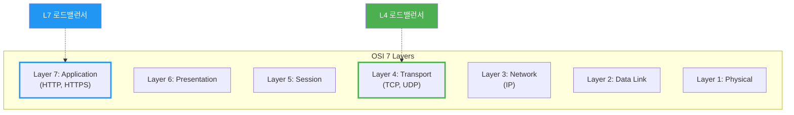
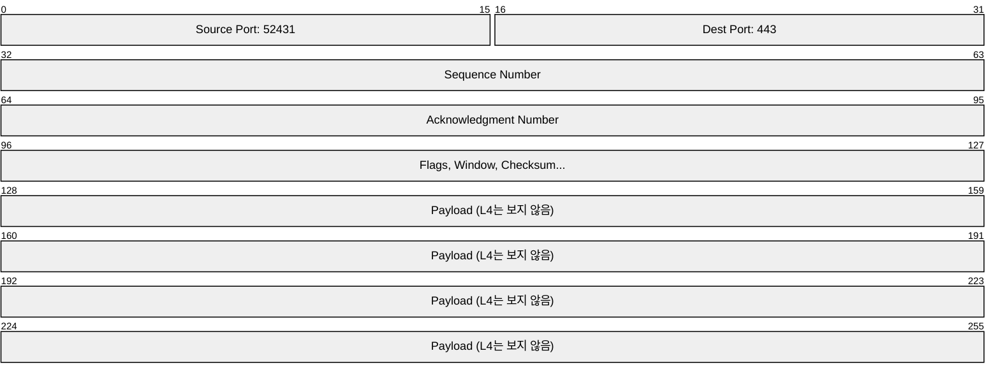
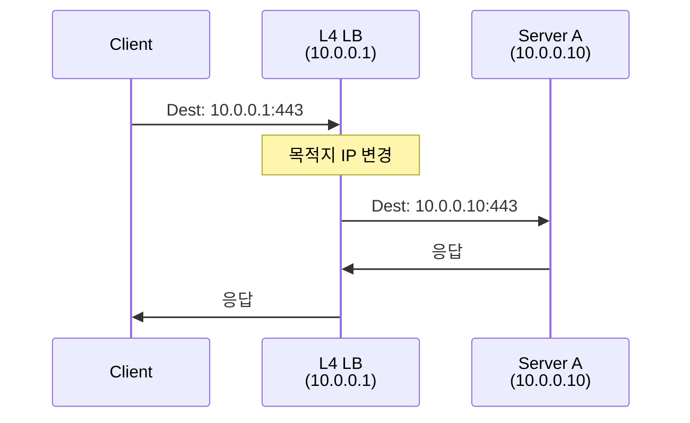
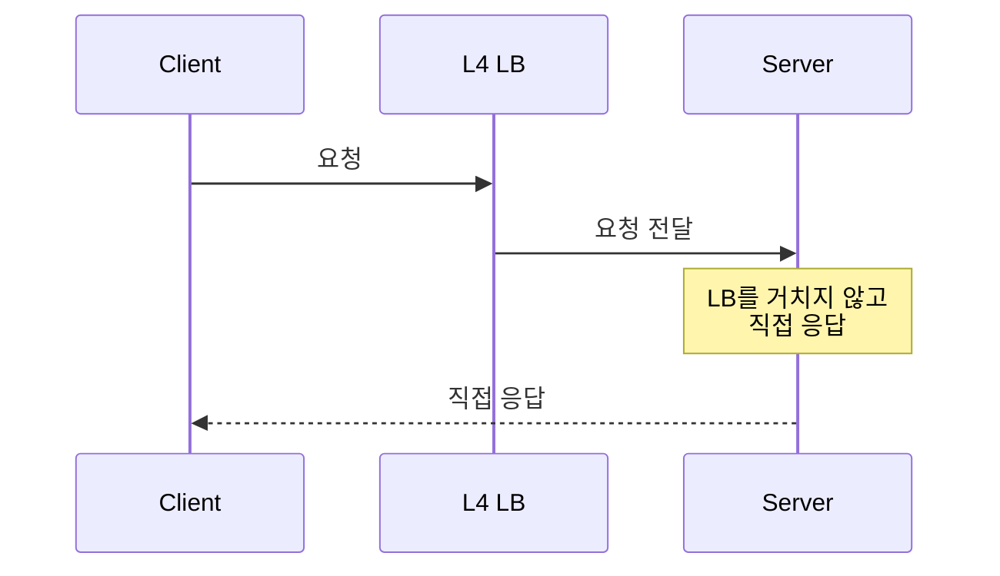
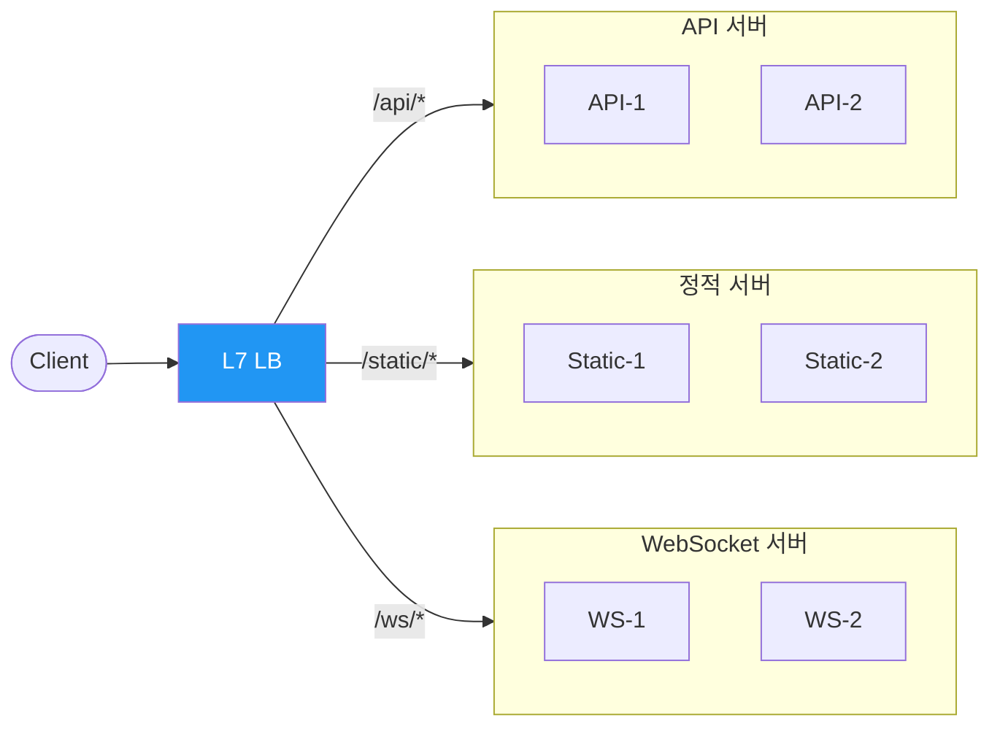
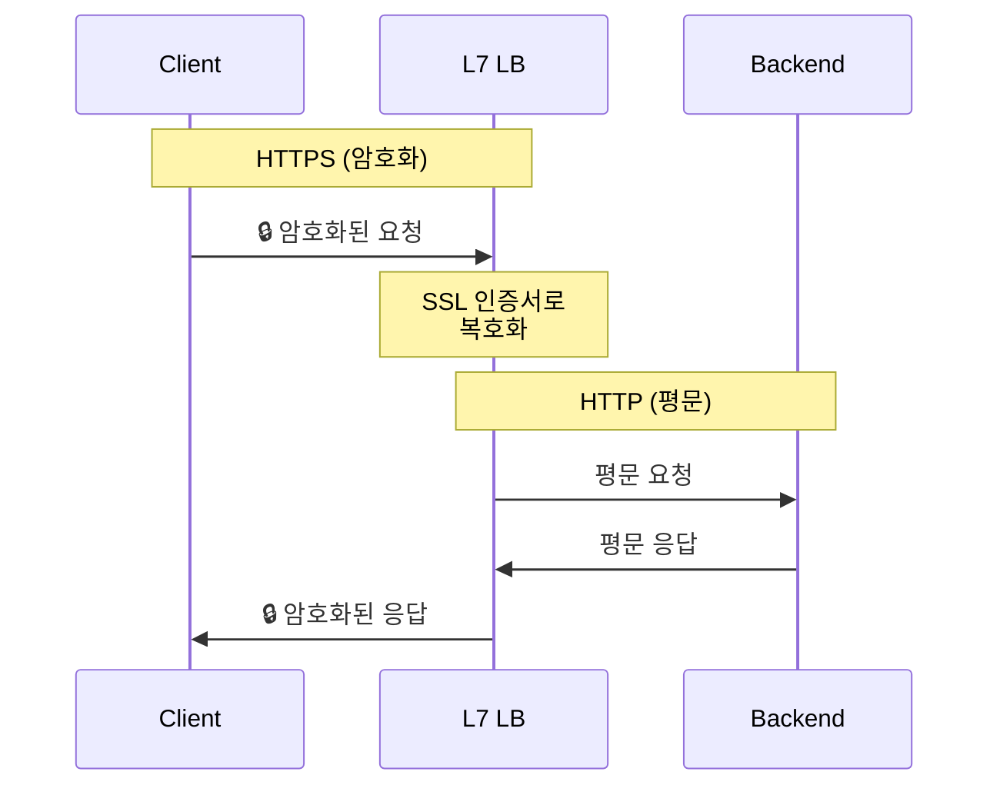
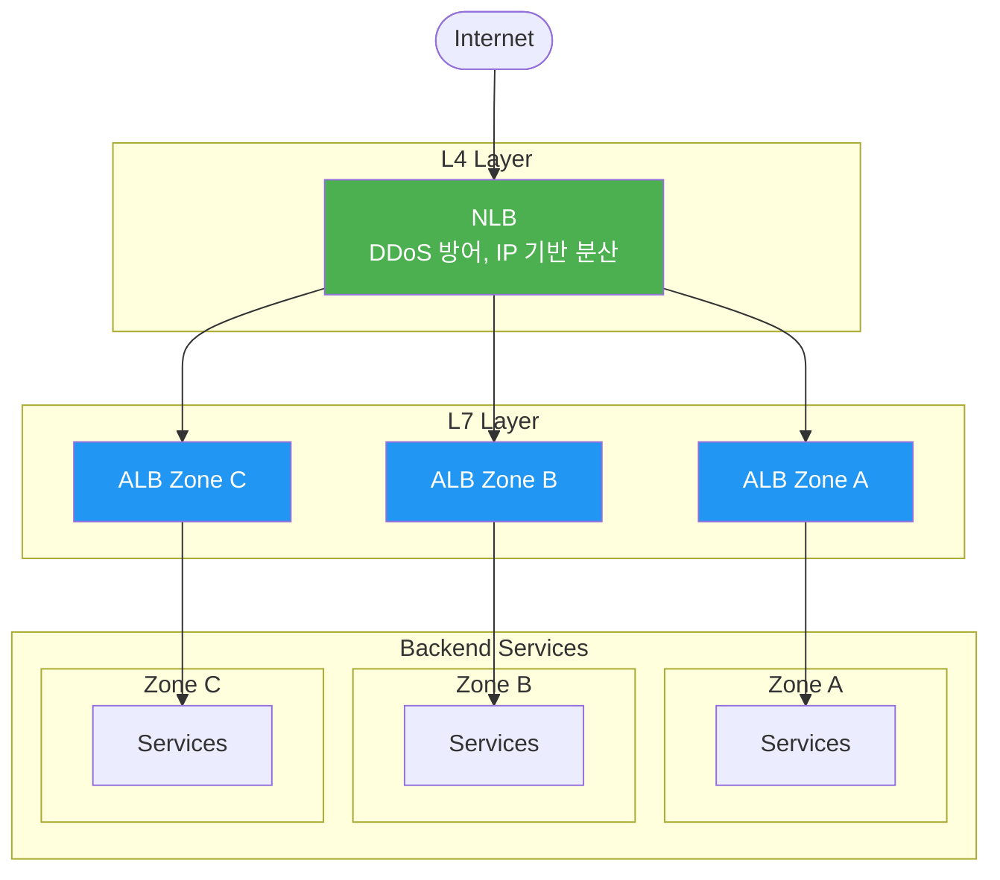
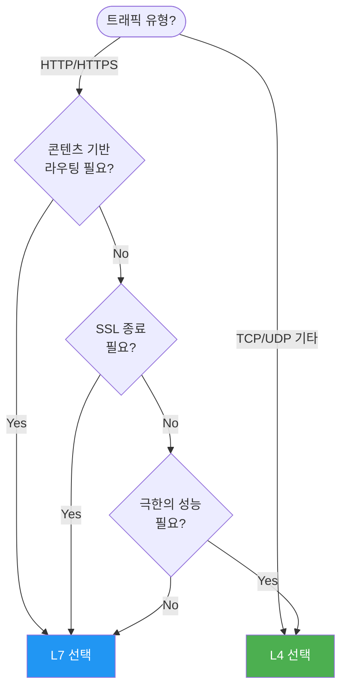

# L4와 L7 로드밸런서의 차이

로드밸런서는 OSI 계층에 따라 L4(Transport)와 L7(Application)으로 나뉘며, 각각 다른 정보를 보고 다른 방식으로 트래픽을 분산한다.

## 결론부터 말하면

**L4 로드밸런서**는 IP 주소와 포트만 보고 빠르게 분산하고,
**L7 로드밸런서**는 HTTP 헤더, URL, 쿠키까지 분석해서 똑똑하게 라우팅한다.

```
L4: "203.0.113.50:443 으로 왔네? → 서버 A로 보내"
L7: "/api/users 요청이고 Cookie에 beta=true가 있네? → 베타 서버로 보내"
```

| 특성 | L4 | L7 |
|------|----|----|
| 분석 대상 | IP, Port | URL, 헤더, 쿠키 |
| 속도 | 빠름 | 상대적으로 느림 |
| SSL 종료 | ❌ | ✅ |
| 콘텐츠 라우팅 | ❌ | ✅ |
| 대표 서비스 | AWS NLB | AWS ALB, Nginx |

---

## 1. OSI 모델에서의 위치

왜 L4, L7이라고 부를까? OSI 7계층 모델에서 동작하는 계층이 다르기 때문이다.



L4 로드밸런서는 4계층(Transport)까지만 올라가서 TCP/UDP 정보를 본다. L7 로드밸런서는 7계층(Application)까지 올라가서 HTTP 프로토콜 전체를 이해한다.

---

## 2. L4 로드밸런서: 빠르고 단순하게

### 2.1 무엇을 보는가?

L4 로드밸런서는 패킷의 **헤더**만 본다. 안에 뭐가 들어있는지(payload)는 관심 없다.



이 정보만으로 어떻게 분산할까? 간단한 알고리즘을 사용한다:

| 알고리즘 | 동작 방식 |
|----------|-----------|
| **Round Robin** | 서버에 순차적으로 1→2→3→1→2→3... |
| **Least Connections** | 현재 연결이 가장 적은 서버로 |
| **Source IP Hash** | 같은 클라이언트 IP는 항상 같은 서버로 |
| **Weighted** | 서버 성능에 따라 가중치 부여 (3:2:1) |

### 2.2 NAT 방식

L4 로드밸런서는 두 가지 방식으로 트래픽을 전달한다.

**DNAT (Destination NAT)**: 가장 일반적인 방식



**DSR (Direct Server Return)**: 고성능이 필요할 때



DSR은 응답 트래픽이 로드밸런서를 거치지 않아서 대용량 응답(동영상, 파일 다운로드)에 유리하다.

### 2.3 언제 L4를 선택하는가?

- **극한의 성능**: 수백만 동시 연결 처리
- **비-HTTP 프로토콜**: 게임 서버, IoT, 데이터베이스 클러스터링
- **SSL 패스스루**: 백엔드에서 직접 SSL 처리해야 할 때
- **단순 분산**: 복잡한 라우팅 로직이 필요 없을 때

---

## 3. L7 로드밸런서: 똑똑하게 라우팅

### 3.1 무엇을 보는가?

L7 로드밸런서는 HTTP 요청 전체를 파싱한다. URL 경로, 헤더, 쿠키, 심지어 요청 본문까지 분석할 수 있다.

```http
GET /api/users HTTP/1.1          ← URL 경로
Host: api.example.com            ← 호스트 헤더
Cookie: session=abc123           ← 쿠키
X-User-Id: 12345                 ← 커스텀 헤더
Authorization: Bearer eyJ...     ← 인증 토큰
Content-Type: application/json
```

이 모든 정보를 기반으로 라우팅 결정을 내릴 수 있다.

### 3.2 콘텐츠 기반 라우팅

L7의 핵심 기능이다. URL 패턴에 따라 다른 서버 그룹으로 보낸다.



Nginx 설정 예시:

```nginx
upstream api_servers {
    server 10.0.1.10:8080;
    server 10.0.1.11:8080;
}

upstream static_servers {
    server 10.0.2.10:80;
    server 10.0.2.11:80;
}

server {
    # URL 경로 기반 라우팅
    location /api/ {
        proxy_pass http://api_servers;
    }

    location /static/ {
        proxy_pass http://static_servers;
    }

    # 헤더 기반 라우팅 (A/B 테스트)
    location / {
        if ($http_x_beta_user = "true") {
            proxy_pass http://beta_servers;
        }
        proxy_pass http://production_servers;
    }
}
```

### 3.3 SSL 종료 (SSL Termination)

L7 로드밸런서의 또 다른 핵심 기능이다. HTTPS 암호화/복호화를 로드밸런서에서 처리한다.



왜 이렇게 할까?

| 이점 | 설명 |
|------|------|
| **백엔드 부담 감소** | CPU 집약적인 SSL 처리를 LB가 담당 |
| **인증서 중앙 관리** | 서버마다 인증서 설치할 필요 없음 |
| **내부 통신 최적화** | 백엔드 간 평문 통신으로 속도 향상 |
| **검사 가능** | 복호화된 트래픽에 WAF 적용 가능 |

### 3.4 고급 기능들

L7 로드밸런서가 제공하는 부가 기능들:

| 기능 | 설명 |
|------|------|
| **Session Affinity** | 쿠키 기반으로 같은 사용자를 같은 서버로 (Sticky Session) |
| **Health Check** | `GET /health` 호출 후 200 응답 확인 |
| **Request Rewrite** | URL, 헤더 변경 (`/old-api` → `/v2/api`) |
| **Rate Limiting** | IP/사용자별 초당 요청 수 제한 |
| **WAF** | SQL Injection, XSS 공격 차단 |
| **Canary 배포** | 트래픽의 5%만 새 버전으로 |

### 3.5 언제 L7을 선택하는가?

- **마이크로서비스**: URL 기반 서비스 라우팅
- **API 게이트웨이**: 인증, 레이트 리밋, 요청 변환
- **멀티 테넌트**: Host 헤더로 고객별 분리
- **점진적 배포**: Canary, Blue-Green 배포
- **보안**: WAF, 봇 차단 필요

---

## 4. 직접 비교

같은 요청을 L4와 L7가 어떻게 다르게 처리하는지 보자.

```http
POST /api/v2/orders HTTP/1.1
Host: shop.example.com
Cookie: user_tier=premium
X-Region: asia
```

| 관점 | L4 로드밸런서 | L7 로드밸런서 |
|------|---------------|---------------|
| **보는 정보** | `203.0.113.50:443` | URL, Host, Cookie, 모든 헤더 |
| **라우팅 결정** | "다음 서버 차례" (Round Robin) | "premium 고객이니 전용 서버로" |
| **SSL** | 그대로 패스스루 | 복호화 후 평문 전달 |
| **세션 유지** | 같은 IP면 같은 서버 (불완전) | 쿠키 기반 정확한 세션 유지 |
| **장애 감지** | TCP 연결 가능 여부만 | HTTP 200 응답 확인 |

전체 비교표:

| 특성 | L4 로드밸런서 | L7 로드밸런서 |
|------|---------------|---------------|
| **OSI 계층** | Transport (4계층) | Application (7계층) |
| **분석 대상** | IP, Port | URL, 헤더, 쿠키, 본문 |
| **처리 속도** | 매우 빠름 | 상대적으로 느림 |
| **리소스 사용** | 낮음 | 높음 |
| **SSL 종료** | ❌ (패스스루만) | ✅ |
| **콘텐츠 라우팅** | ❌ | ✅ |
| **세션 유지** | IP Hash만 | 쿠키 기반 |
| **프로토콜** | TCP, UDP, 모든 것 | HTTP, HTTPS, gRPC |
| **비용** | 저렴 | 상대적으로 비쌈 |
| **AWS 서비스** | NLB | ALB |

---

## 5. 실전 아키텍처: 함께 사용하기

실제 프로덕션에서는 L4와 L7를 계층적으로 조합한다.



왜 이렇게 구성할까?

| 계층 | 역할 |
|------|------|
| **L4 (NLB)** | 고가용성, DDoS 방어, 가용 영역 간 분산 |
| **L7 (ALB)** | SSL 종료, 스마트 라우팅, WAF 적용 |

### AWS 구성 예시

```yaml
# 일반적인 웹 서비스
Internet → Route 53 → ALB → ECS/EKS

# 고성능 + 마이크로서비스
Internet → NLB → ALB → Services

# 실시간 게임/IoT
Internet → NLB → EC2 (UDP/TCP)

# 내부 gRPC 통신
Service A → ALB (gRPC) → Service B
```

---

## 6. 결정 가이드

어떤 로드밸런서를 선택해야 할지 결정하는 플로우:



간단히 정리하면:

| 상황 | 선택 |
|------|------|
| 게임 서버, IoT, 데이터베이스 | **L4** |
| 초당 수백만 연결 처리 | **L4** |
| 마이크로서비스 API 게이트웨이 | **L7** |
| URL/헤더 기반 라우팅 필요 | **L7** |
| Canary/Blue-Green 배포 | **L7** |
| WAF, 보안 기능 필요 | **L7** |
| 잘 모르겠다 | **L7** (더 유연함) |

---

## 출처

- [AWS - Elastic Load Balancing 유형](https://docs.aws.amazon.com/elasticloadbalancing/latest/userguide/how-elastic-load-balancing-works.html) - 공식 문서
- [NGINX - What Is Layer 4 Load Balancing?](https://www.f5.com/glossary/layer-4-load-balancing)
- [NGINX - What Is Layer 7 Load Balancing?](https://www.f5.com/glossary/layer-7-load-balancing)
- [Google Cloud - Load balancing overview](https://cloud.google.com/load-balancing/docs/load-balancing-overview)
- [HAProxy Documentation - Layer 4 vs Layer 7](https://www.haproxy.com/documentation/haproxy-enterprise/administration/high-availability/active-active/#option-2%3A-two-tiers-of-load-balancers)
