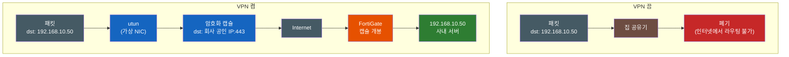
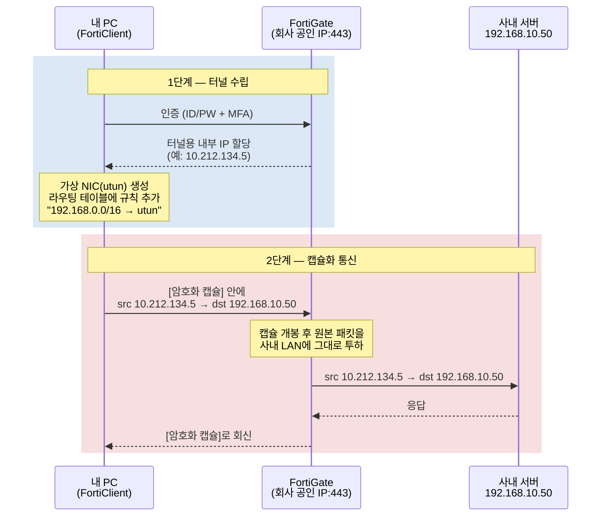
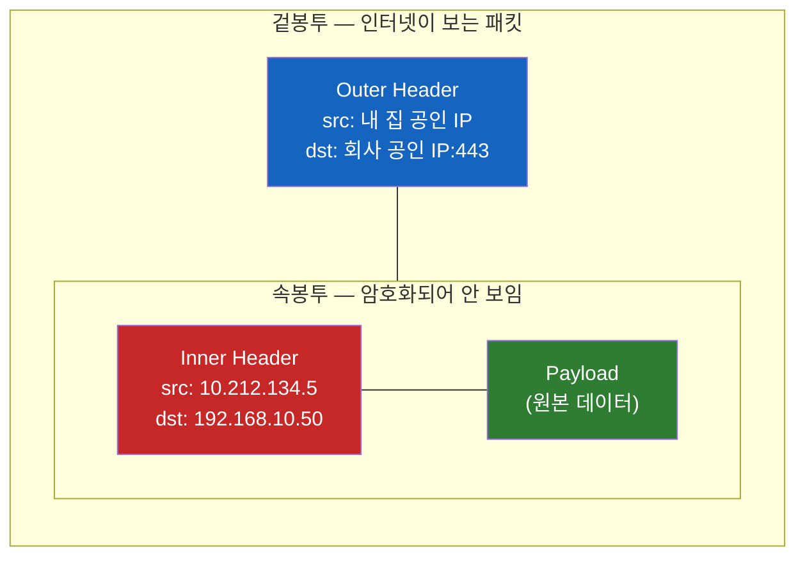

# VPN은 어떻게 나를 회사망 안으로 데려가는가

회사 노트북에서 FortiClient를 켜는 순간, 집에서는 절대 안 열리던 `192.168.10.50` 사내 시스템이 갑자기 열린다. 끄면 다시 안 된다. 매일 누르는 그 연결 버튼이 정확히 무엇을 바꾸는 걸까? [Forward Proxy 문서](../proxy/Forward-Proxy와-Reverse-Proxy-누구의-대리인인가.md)에서 VPN을 "클라이언트의 대리인 진영"으로 분류했지만, 사실 VPN은 프록시처럼 *대신 다녀오는* 존재가 아니다. 이 문서는 "VPN을 켜면 사설 IP가 접근된다"는 일상적 마법을 **가상 NIC, 라우팅 테이블, 캡슐화** 세 가지 부품으로 분해하는 것이 목표다.

## 결론부터 말하면

VPN은 **내 PC와 회사망 사이에 깔린 가상의 랜선** 이다. 연결 버튼을 누르면 (1) PC에 가상 네트워크 카드가 생기고, (2) 회사망의 내부 IP를 하나 할당받으며, (3) 라우팅 테이블에 "사내 대역은 이 가상 카드로 보내라"는 규칙이 추가된다. 이후 사내 IP로 향하는 패킷은 **통째로 암호화되어 "회사 공인 IP:443"으로 가는 평범한 패킷 안에 밀봉** 되어 인터넷을 건넌다. 즉 내가 원격에서 회사에 *접근* 하는 게 아니라, 논리적으로 **내 PC가 회사망 안의 한 노드가 되는 것** 이다.



같은 목적지의 패킷인데 운명이 갈리는 이유는 단 하나 — **라우팅 테이블에 그 패킷을 받아줄 경로가 있느냐** 다. VPN이 하는 일의 본질은 그 경로를 만들어주는 것이다.

## 1. 왜 평소에는 192.168.x.x가 안 되는가

마법을 해부하려면 먼저 "왜 원래 안 되는지"부터 알아야 한다. `192.168.0.0/16`, `10.0.0.0/8`, `172.16.0.0/12` — 이 세 대역은 [RFC 1918](https://datatracker.ietf.org/doc/html/rfc1918)이 정한 **사설 IP(Private IP) 대역** 이다. 누구나 자기 네트워크 안에서 자유롭게 쓰라고 떼어둔 주소라서, 전 세계 수억 개의 네트워크가 같은 `192.168.0.1`을 동시에 쓰고 있다. 우리 집 공유기도, 옆집 공유기도, 회사 사내망도 전부.

그래서 인터넷의 라우터들은 이 대역으로 가는 패킷을 **전달하지 않고 버린다.** "192.168.10.50으로 보내줘"라는 요청은 "철수네 집으로 배달해줘"라고 말하는 것과 같다 — 전 세계에 철수네 집이 수억 개라 어디로 보낼지 정할 수 없기 때문이다. 사내망의 `192.168.10.50`은 **회사 건물 안에서만 유효한 주소** 인 셈이다.

그렇다면 집에 있는 내 PC가 그 주소에 닿으려면 방법은 하나뿐이다. **패킷이 어떻게든 회사 건물 안에서 출발한 것처럼 만들어야 한다.** 물리적으로 회사에 랜선을 꽂을 수 없으니, 논리적으로 꽂는 수밖에 없다. 그 "논리적 랜선"이 바로 VPN — Virtual Private Network, 이름 그대로 **가상으로 사설망에 들어가는 기술** 이다.

## 2. FortiClient를 켜면 일어나는 일 — 세 가지 부품

회사에서 흔히 쓰는 FortiClient는 회사 네트워크 입구에 있는 **FortiGate** 라는 방화벽 장비와 짝을 이루는 VPN 클라이언트다. 연결 방식은 SSL-VPN(TCP 443 위에서 TLS로 터널을 만드는 방식) 또는 IPsec인데, 어느 쪽이든 메커니즘의 뼈대는 같다 — 다만 기존 배포에서 흔했던 SSL-VPN tunnel mode는 **FortiOS 7.6.3부터 제거되어 IPsec VPN으로 마이그레이션** 하도록 안내되고 있으니, 최신 장비라면 IPsec으로 동작하고 있을 가능성이 높다. 연결 버튼을 누르면 다음 순서로 일이 진행된다.



### 부품 1 — 가상 NIC: 존재하지 않는 랜선 꽂기

인증이 끝나면 FortiClient는 운영체제에 **가상 네트워크 인터페이스** 를 만든다. macOS에서는 `utun`, Linux에서는 `tun`, Windows에서는 TAP 어댑터나 Wintun 드라이버 기반의 가상 어댑터라는 이름으로 보인다. 물리적 랜 카드(NIC)가 케이블에서 전기 신호를 받아 패킷을 꺼내는 장치라면, 가상 NIC은 **케이블 대신 소프트웨어(FortiClient)가 패킷을 넣고 빼는 가짜 랜 카드** 다. OS 입장에서는 진짜 NIC과 구별이 없다 — IP를 붙일 수 있고, 라우팅 대상이 될 수 있다.

그리고 FortiGate는 이 가상 NIC에 **사내망용 내부 IP를 하나 발급해준다.** FortiGate 설정의 IP Pool(기본 객체 이름이 `SSLVPN_TUNNEL_ADDR1`이다)에서 하나를 꺼내주는 것인데, 이 순간이 결정적이다. 내 PC는 물리적으로는 집 소파 위에 있지만, **회사망의 주소 체계 안에서 유효한 IP를 가진 노드** 가 됐다. 회사에 출입증이 생긴 게 아니라, 회사 조직도에 내 자리가 생긴 것에 가깝다.

### 부품 2 — 라우팅 테이블: 교통 표지판 바꿔치기

가상 NIC이 생겨도 OS가 그쪽으로 패킷을 보내지 않으면 의미가 없다. 그래서 FortiClient는 OS의 **라우팅 테이블** 을 수정한다. 라우팅 테이블은 "이 대역으로 가는 패킷은 이 인터페이스로 내보내라"는 교통 표지판 목록인데, 여기에 한 줄이 추가된다.

| 목적지 대역 | 게이트웨이/인터페이스 | 의미 |
|------------|---------------------|------|
| `default` (0.0.0.0/0) | `en0` (Wi-Fi) | 평소 모든 트래픽은 집 공유기로 |
| **`192.168.0.0/16`** | **`utun4` (VPN)** ← 추가됨 | **사내 대역은 VPN 터널로** |

질문의 핵심이었던 **"VPN을 켜면 192가 되는" 현상의 정체가 바로 이 한 줄** 이다. VPN을 켜기 전에는 `192.168.10.50`행 패킷이 default 규칙을 따라 집 공유기로 갔다가 버려졌지만, 이제는 더 구체적인(longest prefix match) 규칙에 걸려 `utun`으로 들어간다. 끄면 이 줄이 삭제되니 다시 안 되는 것이고.

> **DNS도 함께 바뀐다.** 실무에서는 IP 대신 `gitlab.company.local` 같은 사내 도메인으로 접속하는 경우가 더 많은데, 이 도메인은 공용 DNS(8.8.8.8 등)에는 등록되어 있지 않다. 그래서 FortiGate는 내부 IP와 함께 **사내 DNS 서버 주소도 내려주고** , FortiClient가 이를 OS의 DNS 설정에 끼워 넣는다. 사내 도메인 쿼리만 사내 DNS로 보내는 구성을 **Split DNS** 라고 부른다. 즉 VPN은 "패킷의 길"(라우팅)과 "이름의 길"(DNS)을 동시에 바꿔서, 회사 안에 앉아 있을 때와 같은 경험을 만들어준다.

### 부품 3 — 캡슐화: 패킷 안의 패킷

그런데 `utun`으로 들어간 패킷의 목적지는 여전히 사설 IP다. 인터넷에 그대로 내보내면 §1에서 본 대로 버려진다. 여기서 VPN의 마지막 부품, **캡슐화(encapsulation)** 가 등장한다. FortiClient는 `utun`에서 꺼낸 원본 패킷을 **통째로 암호화한 뒤, 새 패킷의 payload로 집어넣는다.**



겉봉투의 목적지는 **회사의 공인 IP:443** — 인터넷이 얼마든지 배달할 수 있는 평범한 주소다. 인터넷의 라우터들은 겉봉투만 보고 배달하므로, 속에 사설 IP 패킷이 들었는지 알지도 못하고 알 필요도 없다. 회사에 도착하면 FortiGate가 봉투를 까서 원본 패킷을 사내 LAN에 풀어놓는다. 사설 IP 패킷이 인터넷을 *건넌* 게 아니라, 공인 IP 패킷 안에 **밀봉되어 밀항** 한 것이다. 응답은 같은 과정을 거꾸로 밟아 돌아온다.

이것이 "터널"이라는 비유의 실체다. 땅 위(인터넷)의 규칙으로는 통과할 수 없는 화물(사설 IP 패킷)을, 땅 밑에 뚫은 전용 통로(암호화 캡슐)로 통과시킨다. SSL-VPN이 굳이 443 포트를 쓰는 이유도 여기 있다 — 호텔이든 카페든 HTTPS(443)를 막는 네트워크는 없으므로, **어디서든 뚫리는 터널** 이 된다. 겉으로는 그냥 웹 트래픽처럼 보이니까. 다만 이 "443 = HTTPS처럼 보임"은 SSL-VPN 기준이고, **IPsec 방식이라면 겉봉투의 규격이 달라진다** — 키 교환(IKE)은 UDP 500에서 이뤄지고, 실제 데이터는 ESP(IP 프로토콜 50번)로 나르거나 NAT 통과를 위해 UDP 4500으로 한 번 더 감싼다(NAT-T). IPsec을 TCP 443에 싣는 구성도 있지만 그건 HTTPS가 아니라 IKE/ESP를 443 포트에 실은 것이다. 봉투 규격이 무엇이든 "원본 패킷을 밀봉해 공인 IP로 운반한다"는 본질은 같다.

## 3. Split Tunnel vs Full Tunnel — 표지판을 몇 개나 바꾸는가

부품 2에서 라우팅 테이블에 "사내 대역만" 추가하는 경우를 봤는데, 사실 이건 회사 정책에 따라 두 가지로 갈린다. 차이는 오직 **라우팅 테이블을 어떻게 바꾸느냐** 뿐이다.

| | Split Tunnel | Full Tunnel |
|---|---|---|
| **라우팅 변경** | 사내 대역(예: 192.168.0.0/16)만 utun으로 | **default route 자체** 를 utun으로 교체 |
| **유튜브 트래픽** | 집 인터넷으로 직행 (빠름) | 회사를 경유해서 나감 (느림) |
| **회사의 통제력** | 사내 트래픽만 보임 | **모든** 트래픽 검사 가능 |
| **FortiGate 설정** | Split Tunneling 활성화 + Routing Address 지정 | Split Tunneling 비활성화 (default route를 터널로 푸시) |

VPN을 켰더니 유튜브까지 느려졌다면 Full Tunnel이다. 모든 패킷이 회사까지 갔다가 회사의 게이트웨이를 통해 인터넷으로 나가는, 물리적으로 먼 길을 돌기 때문이다. 회사 입장에서는 보안 검사(웹 필터링, 멀웨어 스캔)를 전 트래픽에 적용할 수 있어 이 방식을 선호하는 경우가 많다 — 이 지점에서 VPN은 [Forward Proxy 문서](../proxy/Forward-Proxy와-Reverse-Proxy-누구의-대리인인가.md)에서 본 사내 게이트웨이와 같은 역할을 겸하게 된다.

> **두 가지 디테일.** 첫째, Full Tunnel에서 "모든 트래픽을 utun으로"라면 **캡슐 패킷 자체도 터널로 들어가 무한 루프가 되지 않을까?** 그래서 VPN 클라이언트는 default route를 바꾸기 전에 "회사 공인 IP로 가는 경로만은 물리 NIC(en0)을 타라"는 **host route 예외** 를 먼저 심어둔다. 둘째, 집 공유기 대역과 사내 대역이 겹치면(예: 둘 다 `192.168.0.0/24`) 라우팅이 모호해져 "VPN은 켜졌는데 특정 사내 IP만 안 되는" 장애가 난다. 기업들이 사내망을 가정용 공유기 기본값(`192.168.0.x`, `192.168.1.x`)을 피해 `10.x`의 덜 흔한 서브넷으로 설계하는 공학적 이유가 이것이다.

### 내 눈으로 직접 확인하기

이 모든 설명은 macOS에서 명령 두 개로 검증할 수 있다. VPN을 켠 상태와 끈 상태에서 각각 실행해보자.

```bash
# 1. FortiClient가 만든 가상 NIC과 할당받은 내부 IP
ifconfig | grep -A 3 utun

# 2. 라우팅 테이블 — 사내 대역이 utun으로 향하는 규칙
netstat -rn | grep -E "utun|192\.168"
```

VPN을 켜면 `utun` 인터페이스에 내부 IP가 붙어 있고 라우팅 테이블에 사내 대역 규칙이 보인다. 끄면 둘 다 사라진다. "연결 버튼"의 실체가 결국 **인터페이스 하나와 라우팅 규칙 몇 줄** 이라는 것을 직접 확인할 수 있다.

## 4. 그래서 VPN은 Forward Proxy인가

[Forward Proxy 문서](../proxy/Forward-Proxy와-Reverse-Proxy-누구의-대리인인가.md)의 기준 — "누구를 대리하는가" — 으로 보면 VPN은 분명 클라이언트 진영이다. 클라이언트의 트래픽을 모아 내보내고, 클라이언트의 원래 IP를 가린다. 하지만 메커니즘을 뜯어본 지금은 결정적 차이를 말할 수 있다.

| | Forward Proxy | VPN |
|---|---|---|
| **동작 계층** | L7 — HTTP 요청을 **이해하고** 처리 | L3 — IP 패킷을 **내용 모른 채** 운반 |
| **연결 구조** | TCP 연결 2개 (나→프록시, 프록시→서버) | 논리적 1개 (내 패킷이 그대로 도착) |
| **목적지 서버가 보는 출발지** | 프록시의 IP | 터널이 할당한 내부 IP (사내망에선 내가 보임) |
| **비유** | 대리인이 내 말을 듣고 **대신 주문** | 회사까지 깔린 **긴 랜선** |

프록시는 내 HTTP 요청을 *읽고*, 자기 이름으로 새 요청을 만들어 보내는 대리인이다. VPN은 내 IP 패킷을 *읽지 않고*, 봉투에 넣어 옮기는 운송 터널이다. 그래서 프록시는 URL 차단 같은 내용 기반 정책을 자연스럽게 걸 수 있고, VPN은 어떤 프로토콜이든(HTTP든 SSH든 DB 커넥션이든) 구분 없이 통과시킨다. 같은 "클라이언트의 대리인"이지만 **프록시는 대신 다녀오고, VPN은 나를 그곳에 데려다 놓는다.**

참고로 이 "터널에 다른 트래픽을 실어 나른다"는 아이디어 자체는 VPN의 전유물이 아니다. [SSH 터널링](../security/SSH-터널링을-통한-안전한-데이터베이스-접속.md)은 같은 원리를 SSH 연결 위에서, 특정 포트 하나만 대상으로 구현한 것이다. VPN이 "건물 전체로 가는 전용 도로"라면 SSH 터널은 "특정 방 하나로 가는 비밀 통로"인 셈이다.

## 5. 정리

### 핵심 포인트

1. **VPN은 원격 접근이 아니라 편입이다**
   - 가상 NIC + 내부 IP 할당으로 내 PC가 회사망의 노드가 된다.
   - "192.168.x.x에 접근된다"가 아니라 "나도 192.168.x.x 옆집이 된다"에 가깝다.

2. **마법의 정체는 라우팅 테이블 한 줄이다**
   - "사내 대역 → utun" 규칙이 추가되면 되고, 삭제되면 안 된다.
   - Split/Full Tunnel의 차이도 결국 이 표지판을 몇 개 바꾸느냐의 차이다.

3. **사설 IP 패킷은 캡슐화로 밀항한다**
   - 인터넷은 RFC 1918 대역을 라우팅하지 않는다.
   - 원본 패킷을 암호화해 "회사 공인 IP"행 패킷의 payload로 밀봉한다. SSL-VPN이면 443/TLS라 평범한 HTTPS처럼 보이고, IPsec이면 ESP·UDP 4500 등 다른 규격의 봉투를 쓴다.

4. **Proxy는 대리인, VPN은 순간이동 문**
   - 프록시(L7)는 내 요청을 이해하고 대신 다녀온다.
   - VPN(L3)은 내 패킷을 이해하지 않고 나를 그곳에 데려다 놓는다.

### 다음으로 읽기

- [Forward Proxy와 Reverse Proxy — 누구의 대리인인가](../proxy/Forward-Proxy와-Reverse-Proxy-누구의-대리인인가.md) — VPN과 같은 진영인 Forward Proxy의 본진
- [SSH 터널링을 통한 안전한 데이터베이스 접속](../security/SSH-터널링을-통한-안전한-데이터베이스-접속.md) — 같은 터널링 원리의 포트 단위 버전
- [네트워크 방향 용어 정리](../network/네트워크-방향-용어-정리-Upstream-Downstream-Ingress-Egress.md) — 터널 트래픽의 Ingress/Egress 관점

---

## 출처

- [RFC 1918 — Address Allocation for Private Internets](https://datatracker.ietf.org/doc/html/rfc1918) — 사설 IP 대역의 정의와 "인터넷에서 라우팅되지 않는다"는 규칙의 원전
- [Microsoft Learn — VPN routing decisions](https://learn.microsoft.com/en-us/windows/security/operating-system-security/network-security/vpn/vpn-routing) — Split/Force(Full) Tunnel이 라우팅 테이블 조작이라는 공식 설명
- [Fortinet Docs — SSL VPN tunnel mode](https://docs.fortinet.com/document/fortigate/7.6.0/new-features/155142/migration-from-ssl-vpn-tunnel-mode-to-ipsec-vpn-7-6-3) — FortiGate의 클라이언트 IP 할당(IP Pool) 동작
- [FortiGate SSL VPN configuration (SAMURAJ-cz)](https://www.samuraj-cz.com/en/article/fortigate-ssl-vpn-configuration) — Tunnel Mode, `SSLVPN_TUNNEL_ADDR1`, Split Tunneling 설정 상세
- [Auvik — VPN Split Tunneling](https://www.auvik.com/franklyit/blog/vpn-split-tunneling) — 캡슐화("원본 패킷을 암호화해 새 헤더를 씌운다") 메커니즘 설명
- [Cloudflare — What is a VPN?](https://www.cloudflare.com/learning/access-management/what-is-a-vpn/) — VPN 개념 일반론
