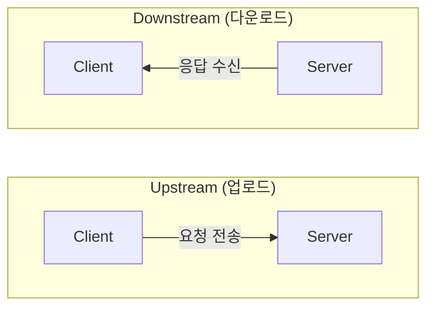
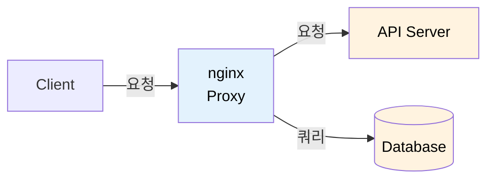
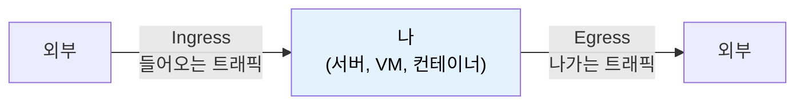
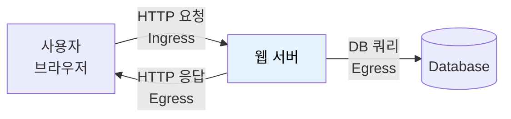
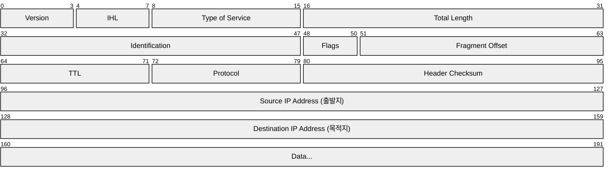
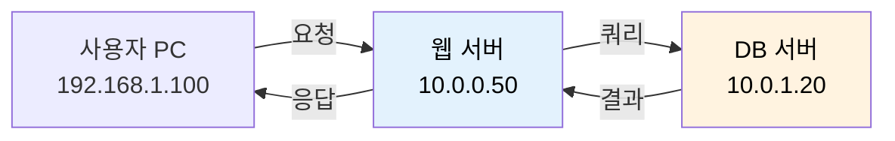
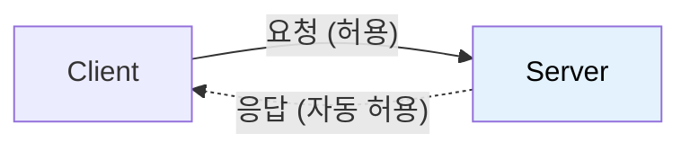

# 네트워크 방향 용어 정리-Upstream, Downstream, Ingress, Egress

네트워크 용어 중 방향과 관련된 개념들이 헷갈리는 이유는, 같은 트래픽도 **어디서 바라보느냐**에 따라 다르게 불리기 때문이다. 이 문서에서는 핵심 개념들을 정리한다.

## 결론부터 말하면

| 개념 | 관점 | 용어 | 의미 |
|------|------|------|------|
| **Upstream / Downstream** | 상대적 (데이터 흐름) | Upstream | 데이터를 보내는 방향 (클라이언트 → 서버) |
| | | Downstream | 데이터를 받는 방향 (서버 → 클라이언트) |
| **Ingress / Egress** | 나 기준 (들어옴/나감) | Ingress (Inbound) | 외부 → 나 (들어오는 트래픽) |
| | | Egress (Outbound) | 나 → 외부 (나가는 트래픽) |
| **Source / Destination** | 절대적 (패킷 정보) | Source IP | 패킷을 보낸 곳 (출발지) |
| | | Destination IP | 패킷이 가는 곳 (목적지) |

## 1. Upstream과 Downstream

### 물의 흐름에서 유래한 용어

강물을 생각해보자:
- **Upstream** (상류): 물이 흘러오는 쪽, 물을 거슬러 올라가는 방향
- **Downstream** (하류): 물이 흘러가는 쪽, 물을 따라 내려가는 방향

네트워크에서도 비슷하다. 데이터가 "흘러가는" 방향을 기준으로 한다.

### 클라이언트-서버 관점 (가장 흔한 사용)



| 방향 | 설명 | 예시 |
|------|------|------|
| **Upstream** | 클라이언트 → 서버 | 파일 업로드, HTTP 요청, 댓글 작성 |
| **Downstream** | 서버 → 클라이언트 | 파일 다운로드, HTTP 응답, 영상 스트리밍 |

**인터넷 속도 표기에서:**
```
인터넷 100Mbps/10Mbps = 다운로드 100Mbps / 업로드 10Mbps
                        (Downstream)      (Upstream)
```

ADSL, 케이블 인터넷 등은 대부분 **비대칭**(Asymmetric)이다. 다운로드가 더 빠른 이유는 일반 사용자가 데이터를 받는 경우가 더 많기 때문이다.

### 서비스 아키텍처 관점 (주의 필요!)

마이크로서비스나 nginx 설정에서는 **의존성 방향**을 기준으로 upstream/downstream을 사용한다. 이때 의미가 살짝 다르다.



**nginx 입장에서:**
- API Server, Database = **Upstream** (내가 의존하는 서비스)
- Client = **Downstream** (나에게 의존하는 쪽)

**nginx.conf 예시:**
```nginx
# nginx가 요청을 보내는 "상위" 서버들을 upstream으로 정의
upstream backend {
    server api1.example.com:8080;
    server api2.example.com:8080;
}

server {
    location / {
        proxy_pass http://backend;  # upstream으로 전달
    }
}
```

왜 이렇게 부를까? "**내가 의존하는 서비스 = upstream**"이라고 생각하면 된다. 강물의 상류가 하류에 물을 공급하듯이, upstream 서비스가 downstream 서비스에 데이터/기능을 제공한다.

### 정리: Upstream/Downstream의 두 가지 의미

| 관점 | Upstream | Downstream |
|------|----------|------------|
| **트래픽 흐름** (클라이언트 관점) | 클라이언트 → 서버 (업로드) | 서버 → 클라이언트 (다운로드) |
| **서비스 의존성** (아키텍처 관점) | 내가 의존하는 서비스 | 나에게 의존하는 서비스 |

## 2. Ingress와 Egress (Inbound와 Outbound)

이 용어들은 **"나"를 기준**으로 한다. 방화벽, 보안 그룹, 쿠버네티스 등에서 자주 사용한다.

### 기본 개념



| 용어 | 다른 표현 | 의미 | 예시 |
|------|----------|------|------|
| **Ingress** | Inbound | 외부 → 나 | 사용자가 웹서버에 접속 |
| **Egress** | Outbound | 나 → 외부 | 서버가 외부 API 호출 |

### 실제 예시: 웹 서버



**웹 서버 입장에서:**
- **Ingress**: 사용자의 HTTP 요청이 들어옴
- **Egress**: HTTP 응답을 보내거나, DB에 쿼리를 보냄

### 방화벽/보안 그룹 규칙

AWS Security Group이나 GCP Firewall에서 자주 보는 설정:

**Inbound Rules (Ingress):**

| Type | Protocol | Port | Source | Description |
|------|----------|------|--------|-------------|
| HTTP | TCP | 80 | 0.0.0.0/0 | 웹 트래픽 허용 |
| HTTPS | TCP | 443 | 0.0.0.0/0 | HTTPS 허용 |
| SSH | TCP | 22 | 10.0.0.0/8 | 내부망 SSH만 |

**Outbound Rules (Egress):**

| Type | Protocol | Port | Destination | Description |
|------|----------|------|-------------|-------------|
| All | All | All | 0.0.0.0/0 | 모든 외부 허용 |

## 3. Source와 Destination (출발지와 목적지)

이 용어들은 **패킷 자체**에 대한 것이다. 어디서 바라보든 변하지 않는 **절대적인 값**이다.

### IP 패킷의 구조



| 필드 | 영어 | 의미 |
|------|------|------|
| **출발지 IP** | Source IP | 패킷을 보낸 호스트의 IP |
| **목적지 IP** | Destination IP | 패킷이 도착해야 할 호스트의 IP |
| **출발지 포트** | Source Port | 보내는 쪽의 포트 번호 |
| **목적지 포트** | Destination Port | 받는 쪽의 포트 번호 |

### 요청과 응답에서 Source/Destination

HTTP 통신을 예로 들어보자:

**1. HTTP 요청** (클라이언트 → 서버)

| 필드 | 값 | 설명 |
|------|-----|------|
| Source IP | 192.168.1.100 | 클라이언트 |
| Source Port | 54321 | 임시 포트 |
| Destination IP | 10.0.0.50 | 서버 |
| Destination Port | 443 | HTTPS |

**2. HTTP 응답** (서버 → 클라이언트) - Source/Destination이 뒤바뀜!

| 필드 | 값 | 설명 |
|------|-----|------|
| Source IP | 10.0.0.50 | 서버 |
| Source Port | 443 | HTTPS |
| Destination IP | 192.168.1.100 | 클라이언트 |
| Destination Port | 54321 | 임시 포트 |

**중요**: 요청과 응답에서 Source와 Destination이 **서로 뒤바뀐다**!

### 방화벽 규칙에서의 Source/Destination

**Ingress(인바운드) 규칙:**
```
방향: Ingress (외부 → 나)
Source: 허용할 출발지 IP (예: 0.0.0.0/0 = 모든 IP)
Destination: 나 자신 (규칙이 적용되는 대상)
```

**Egress(아웃바운드) 규칙:**
```
방향: Egress (나 → 외부)
Source: 나 자신
Destination: 허용할 목적지 IP (예: 특정 API 서버만)
```

### 실전 예시: AWS Security Group

```
# 인바운드 규칙 (Ingress)
# "어디서(Source) 들어오는 것을 허용할까?"

Type        Protocol  Port   Source
SSH         TCP       22     10.0.0.0/8      # 내부망에서만 SSH 허용
HTTP        TCP       80     0.0.0.0/0       # 모든 IP에서 HTTP 허용
Custom TCP  TCP       8080   sg-abc123       # 특정 보안그룹에서만

# 아웃바운드 규칙 (Egress)
# "어디로(Destination) 나가는 것을 허용할까?"

Type        Protocol  Port   Destination
HTTPS       TCP       443    0.0.0.0/0       # 모든 곳으로 HTTPS 허용
MySQL       TCP       3306   10.0.2.0/24     # DB 서브넷으로만 MySQL
```

## 4. 모든 개념을 합쳐서 이해하기

### 시나리오: 사용자가 웹사이트에 접속



**Step 1:** 사용자 → 웹 서버 (HTTP 요청)

| 관점 | 용어 | 값 |
|------|------|-----|
| 패킷 정보 | Source IP | 192.168.1.100 |
| 패킷 정보 | Destination IP | 10.0.0.50 |
| 사용자 PC 입장 | 방향 | **Egress** (나가는 트래픽) |
| 웹 서버 입장 | 방향 | **Ingress** (들어오는 트래픽) |
| 트래픽 흐름 | 관점 | 사용자의 **Upstream** |

**Step 2:** 웹 서버 → DB 서버 (쿼리)

| 관점 | 용어 | 값 |
|------|------|-----|
| 패킷 정보 | Source IP | 10.0.0.50 |
| 패킷 정보 | Destination IP | 10.0.1.20 |
| 웹 서버 입장 | 방향 | **Egress** (나가는 트래픽) |
| DB 서버 입장 | 방향 | **Ingress** (들어오는 트래픽) |
| 아키텍처 관점 | DB는 웹 서버의 | **Upstream** (의존 대상) |

### 방화벽 규칙 설계

위 시나리오에서 필요한 보안 규칙:

**웹 서버 보안 그룹**

| 방향 | 허용 | 설명 |
|------|------|------|
| Inbound | TCP 443 from 0.0.0.0/0 | 모든 사용자가 HTTPS로 접속 가능 |
| Inbound | TCP 22 from 10.0.0.0/8 | 내부망에서만 SSH 접속 가능 |
| Outbound | TCP 3306 to 10.0.1.0/24 | DB 서브넷으로만 MySQL 연결 가능 |
| Outbound | TCP 443 to 0.0.0.0/0 | 외부 API 호출 허용 |

**DB 서버 보안 그룹**

| 방향 | 허용 | 설명 |
|------|------|------|
| Inbound | TCP 3306 from 10.0.0.0/24 | 웹 서버 서브넷에서만 MySQL 접속 가능 |
| Inbound | (0.0.0.0/0 없음) | 인터넷에서 직접 접속 불가! |
| Outbound | TCP 443 to 0.0.0.0/0 | 패치 다운로드 등을 위해 허용 |

## 5. Stateful vs Stateless 방화벽

### Stateful (상태 저장)

대부분의 현대 방화벽(AWS Security Group 등)은 **Stateful**이다.



> Inbound 규칙만 설정해도 응답은 자동으로 나감!

### Stateless (상태 비저장)

AWS Network ACL 등은 **Stateless**다.

> 요청과 응답을 각각 별도로 허용해야 함

| 규칙 | 설정 | 용도 |
|------|------|------|
| Inbound | TCP 443 허용 | 요청 받기 |
| Outbound | TCP 1024-65535 허용 | 응답 보내기 (클라이언트 임시 포트) |

## 6. 자주 하는 실수와 해결

### 실수 1: "왜 접속이 안 되지?"

**상황**: 웹 서버에 Inbound 443만 열었는데 접속 안 됨

| 원인 | 설명 |
|------|------|
| 원인 1 | Outbound가 막혀있음 (Stateless 방화벽인 경우) |
| 원인 2 | 서버가 외부 API를 호출하는데 그 Egress가 막혀있음 |
| 원인 3 | 라우팅 문제 (보안 그룹은 OK인데 경로가 없음) |

### 실수 2: "Source와 Destination 헷갈림"

| 생각 | 올바른 이해 |
|------|------------|
| "서버로 들어오니까 Destination이 중요하겠지?" | Ingress 규칙에서는 **Source**(출발지)를 제한한다. "어디서 오는 것을 허용할까?" |
| | Egress 규칙에서는 **Destination**(목적지)을 제한한다. "어디로 가는 것을 허용할까?" |

### 실수 3: "Upstream/Downstream 반대로 이해"

**nginx upstream 설정:**
- upstream = nginx가 요청을 "보내는" 서버들
- 데이터 흐름상 downstream이 아닌가? → **아니다!**

**이유**: 서비스 의존성 관점에서 명명됨
- nginx는 backend에 "의존"한다
- 의존 대상 = **upstream**

## 7. 한눈에 보는 정리표

| 용어 | 의미 | 예시 |
|------|------|------|
| **Upstream** | 데이터 보내는 방향 / 의존하는 서비스 | 파일 업로드, nginx의 backend |
| **Downstream** | 데이터 받는 방향 / 나에게 의존하는 서비스 | 파일 다운로드, nginx의 client |
| **Ingress** (Inbound) | 들어오는 트래픽 (외부 → 나) | 사용자 요청 수신 |
| **Egress** (Outbound) | 나가는 트래픽 (나 → 외부) | API 호출, 응답 전송 |
| **Source IP** | 패킷의 출발지 | 요청 보낸 클라이언트 |
| **Destination IP** | 패킷의 목적지 | 요청 받는 서버 |

## 출처

- [Upstream (networking) - Wikipedia](https://en.wikipedia.org/wiki/Upstream_(networking))
- [Downstream (networking) - Wikipedia](https://en.wikipedia.org/wiki/Downstream_(networking))
- [Upstream/Downstream terminology - Stack Overflow](https://stackoverflow.com/questions/32364579/upstream-downstream-terminology-used-backwards-e-g-nginx)
- [AWS Security Group Rules](https://docs.aws.amazon.com/vpc/latest/userguide/security-group-rules.html)
- [GCP Firewall Rules](https://cloud.google.com/firewall/docs/firewalls)
- [Inbound vs Outbound Firewall Rules - Tufin](https://www.tufin.com/blog/inbound-vs-outbound-firewall-rules-simplifying-network-security)
