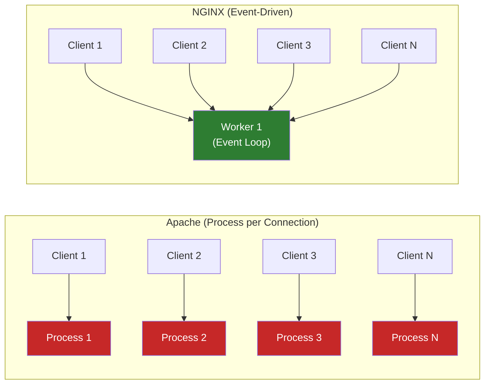
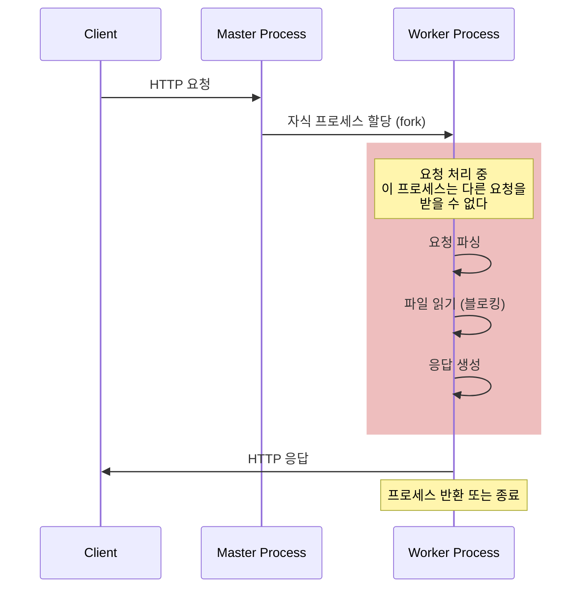
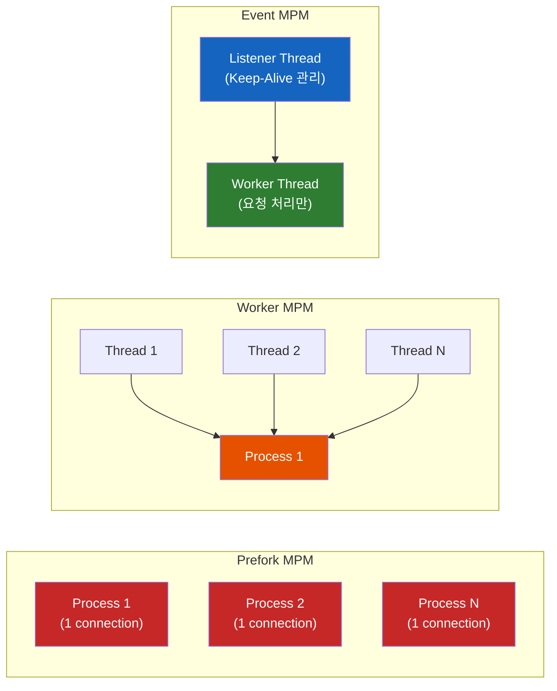
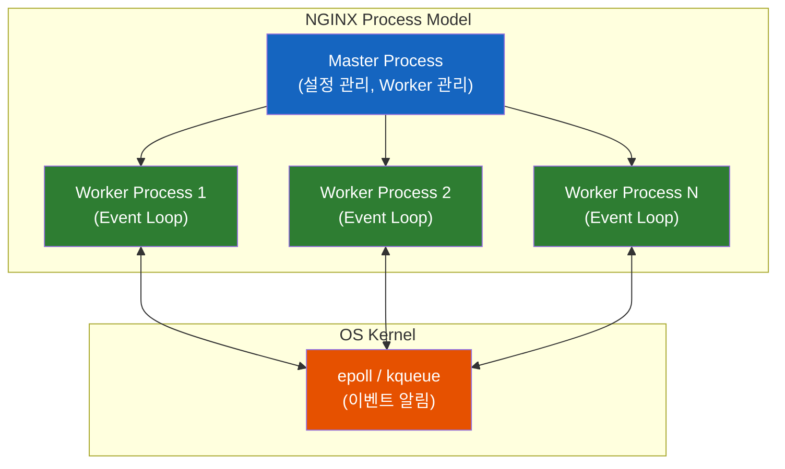
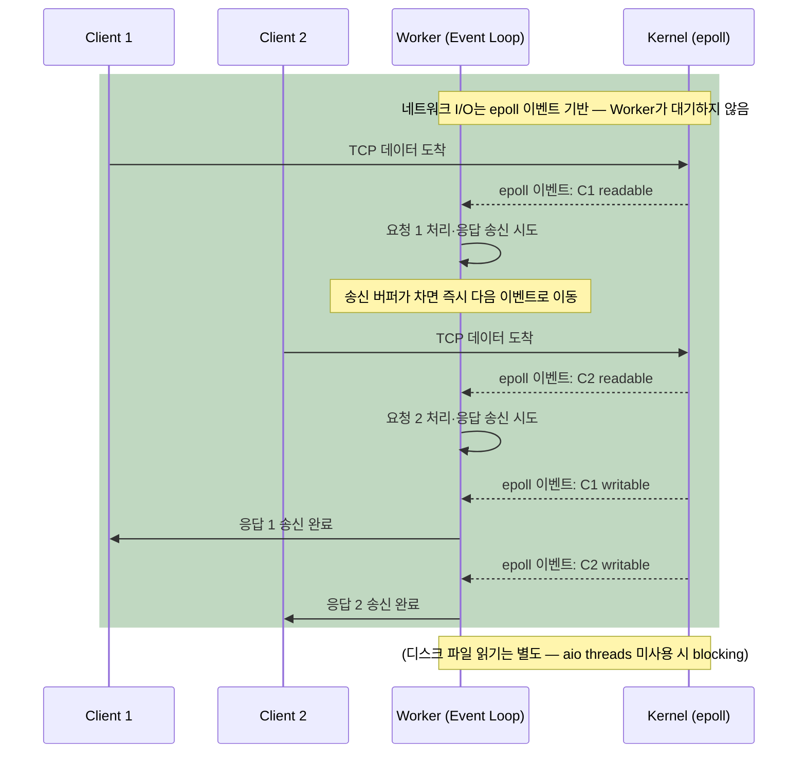
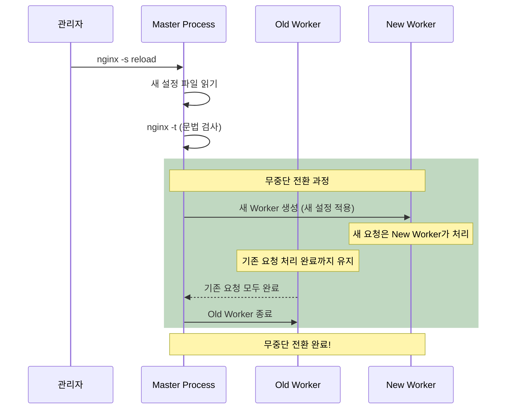

# C10K 문제 - Apache와 NGINX가 선택한 서로 다른 길

1999년, 한 가지 질문이 인터넷 업계를 뒤흔들었다. "웹 서버 하나가 동시에 10,000개의 커넥션을 처리할 수 있을까?" 같은 문제 앞에서 Apache와 NGINX는 왜 서로 다른 해답을 내놓았을까?

## 결론부터 말하면

**Apache는 커넥션 하나당 프로세스(또는 스레드)를 할당하는 구조** 라서, 동시 접속이 늘어나면 메모리와 CPU가 기하급수적으로 소모된다. **NGINX는 이벤트 기반 비동기 아키텍처** 로 하나의 Worker 프로세스가 수천 개의 커넥션을 동시에 처리한다.



| 항목 | Apache (Prefork) | NGINX |
|------|-----------------|-------|
| 아키텍처 | 프로세스/스레드 기반 | 이벤트 기반 (비동기) |
| 동시 접속 1만 개 | 프로세스 1만 개 필요 | Worker 몇 개로 처리 |
| 메모리 사용 | 커넥션 비례 증가 | 거의 일정 |
| Context Switching | 매우 빈번 | 거의 없음 |
| 정적 파일 처리 | 느림 | **매우 빠름** |

## 1. C10K 문제 — 왜 "1만 명"이 한계였을까?

1999년, Dan Kegel이 **"The C10K Problem"** 이라는 글을 발표했다. C10K는 **Concurrent 10,000 connections** 의 약자다. 당시 인터넷이 폭발적으로 성장하면서, 하나의 서버가 동시에 1만 개의 커넥션을 처리해야 하는 상황이 현실로 다가왔다.

그런데 왜 1만 개가 문제였을까? 하드웨어가 부족해서? 아니다. 2000년대 초반에도 서버 하드웨어는 1만 개의 커넥션을 감당할 수 있었다. **문제는 소프트웨어 아키텍처에 있었다.**

### 1.1 Apache의 Prefork MPM — "손님마다 웨이터 한 명"

Apache의 기본 동작 모델인 **Prefork MPM** 을 레스토랑으로 비유하면 이렇다. 손님(Client)이 한 명 들어올 때마다 전담 웨이터(Process)를 한 명 배치한다. 손님이 메뉴를 고르는 동안에도, 음식이 나오기를 기다리는 동안에도, 웨이터는 그 자리에서 아무것도 하지 않고 **대기** 한다.



손님이 10명이면? 웨이터 10명. 100명이면? 웨이터 100명. 그런데 **10,000명이면?** 웨이터 10,000명을 고용해야 한다. 이것이 바로 C10K 문제의 핵심이다.

Java 개발자라면 이런 비유가 와닿을 것이다. Apache의 Prefork MPM은 마치 **Tomcat의 `maxThreads`가 커넥션 수만큼 필요한 상황** 과 같다. 스레드 풀이 고갈되면? 새로운 요청은 큐에서 대기하거나 거부된다.

### 1.2 구체적으로 뭐가 문제인가?

동시 접속 10,000개 상황에서 Apache에 발생하는 문제를 구체적으로 살펴보자.

**첫째, 메모리 폭발.** Apache의 Worker 프로세스 하나가 약 2~10MB의 메모리를 차지한다. 10,000개면? 최소 20GB에서 최대 100GB의 메모리가 필요하다. 당시 서버 메모리가 4~8GB였던 시절이다.

**둘째, Context Switching 오버헤드.** OS가 10,000개의 프로세스를 번갈아 실행하려면 CPU가 **프로세스 간 전환 작업** 에 대부분의 시간을 쓰게 된다. 실제 요청을 처리하는 것보다 프로세스를 교체하는 데 더 많은 CPU를 소모하는 아이러니가 발생한다.

**셋째, 대부분의 시간은 "대기".** 웹 서버의 요청 처리에서 실제 CPU 연산 시간은 극히 짧다. 대부분의 시간은 네트워크 I/O, 디스크 I/O를 **기다리는** 시간이다. 그런데 Apache는 기다리는 동안에도 프로세스를 하나 점유하고 있다. 이것은 엄청난 자원 낭비다.

그렇다면 Apache는 이 문제를 그냥 방치했을까? 아니다. Apache도 반격했다.

## 2. Apache의 반격 — 가만히 당하고만 있지 않았다

Apache를 만든 사람들도 바보가 아니다. C10K 문제를 인식하고, **3번이나 아키텍처를 바꿨다.**

### 2.1 MPM의 진화: Prefork → Worker → Event

| MPM | 시기 | 방식 | 동시 접속 처리 |
|-----|------|------|--------------|
| **Prefork** | 초기 (기본) | 커넥션당 프로세스 fork | 수백 개 수준 |
| **Worker** | Apache 2.0 (2002) | 멀티스레드 (프로세스 안에 스레드) | 수천 개 수준 |
| **Event** | Apache 2.4 (2012) | Keep-Alive 비동기 처리 | 수만 개 가능 |

**Worker MPM** 은 프로세스 하나 안에 여러 스레드를 두는 방식이다. Prefork가 손님마다 웨이터를 한 명 붙였다면, Worker MPM은 "팀장 한 명이 여러 웨이터를 관리하는 구조"다. 프로세스 수가 줄어들면서 메모리 사용량이 크게 개선되었다. Java의 Tomcat이 스레드 풀로 동작하는 것과 비슷한 구조다.

**Event MPM** 은 더 나아가서, Keep-Alive 상태의 유휴 커넥션을 별도 스레드가 비동기로 관리한다. 실제 요청이 들어올 때만 Worker 스레드를 할당하는 구조다. NGINX와 비슷한 이벤트 기반 사고를 도입한 것이다.



### 2.2 그럼에도 NGINX가 우세한 이유

Apache Event MPM이 상당히 개선된 것은 사실이다. 하지만 핵심적인 차이가 남아있다.

**"처음부터 설계한 것" vs "기존 구조 위에 덧붙인 것"** 의 차이다. Apache Event MPM은 Keep-Alive 처리만 비동기이고, **실제 요청 처리는 여전히 스레드 기반** 이다. 반면 NGINX는 요청의 전체 라이프사이클이 이벤트 기반이다.

또한 Apache는 `.htaccess` 파일을 매 요청마다 디렉토리별로 읽어야 하는 구조적 부담이 있다. 유연하지만 그만큼 느리다. NGINX는 이런 기능 자체가 없어서 (설정은 중앙 집중) 정적 파일 처리에서 압도적으로 빠르다.

### 2.3 Apache가 더 나은 경우도 있다

공정하게 말하면, **Apache가 아직도 쓰이는 데는 분명한 이유가 있다.**

- `.htaccess`로 디렉토리별 설정 가능 — 공유 호스팅 환경에서 필수
- `mod_rewrite`, `mod_security` 등 풍부한 모듈 생태계 (단, `mod_php`는 PHP-FPM 보급 이후 사실상 폐기 흐름)
- 동적 콘텐츠는 결국 백엔드(PHP-FPM, WSGI/ASGI 서버 등)가 처리하므로 웹 서버 자체의 처리 격차는 크지 않음
- 설정이 더 직관적이라는 의견도 많음

실무에서는 **NGINX를 리버스 프록시/정적 파일 서빙** 앞단에 두고, **뒤에 Apache나 Tomcat을 WAS로 배치** 하는 조합도 흔하다. "승자독식"이 아니라 "적재적소"인 셈이다.

## 3. NGINX의 해답 — 이벤트 기반 아키텍처

2004년, 러시아 개발자 Igor Sysoev가 NGINX를 공개했다. 그는 Apache의 문제를 정면으로 해결하기 위해 **처음부터 완전히 다른 구조** 로 설계했다.

### 3.1 "웨이터 한 명이 홀 전체를 관리한다"

NGINX의 모델은 효율적인 레스토랑과 같다. 웨이터 한 명이 여러 테이블을 동시에 관리한다. 주문을 받고, 주방에 전달하고, 다른 테이블로 이동해서 물을 가져다주고, 다시 돌아와서 음식을 서빙한다. **기다리는 시간에 가만히 서 있지 않는다.**

이것이 **이벤트 기반 비동기 아키텍처** 의 핵심이다. 하나의 Worker 프로세스가 이벤트 루프를 돌면서, "준비된" 커넥션만 처리하고, I/O를 기다려야 하는 커넥션은 잠시 내려놓는다.



### 3.2 Master-Worker 구조

NGINX는 크게 **Master 프로세스** 와 **Worker 프로세스** 로 구성된다.

**Master 프로세스** 는 직접 요청을 처리하지 않는다. 설정 파일을 읽고, Worker 프로세스를 생성하고 관리하는 "관리자" 역할만 한다. 이 역할 분리가 나중에 설명할 **무중단 배포(Graceful Reload)** 의 핵심이 된다.

**Worker 프로세스** 는 실제 클라이언트 요청을 처리한다. 각 Worker는 **단일 스레드** 로 동작하지만, 이벤트 루프를 통해 수천 개의 커넥션을 동시에 처리한다. Worker 수는 보통 **CPU 코어 수** 와 동일하게 설정한다.

```nginx
# nginx.conf
worker_processes auto;  # CPU 코어 수만큼 자동 설정

events {
    worker_connections 1024;  # Worker당 최대 동시 커넥션 수
    use epoll;                # Linux에서 epoll 사용 (macOS는 kqueue)
}
```

Java 개발자에게 익숙한 비유로 설명하면, NGINX의 Worker는 **Netty의 EventLoop** 와 동일한 개념이다. Spring WebFlux가 Netty 기반으로 비동기 요청을 처리하는 것과 같은 원리다.

### 3.3 왜 이벤트 기반이 빠른가?

핵심은 **"네트워크에서 기다리지 않는다"** 는 것이다. NGINX의 **네트워크 I/O**는 `epoll`(Linux)/`kqueue`(BSD·macOS)를 통한 이벤트 기반으로 처리된다. 한 커넥션이 데이터 수신·송신을 기다리는 동안 Worker는 그 자리를 비우고, 준비된 다른 커넥션의 이벤트를 즉시 처리한다.

> 다만 **디스크 파일 I/O는 별개의 문제다.** Linux 기준 NGINX의 기본 파일 읽기는 여전히 blocking이며, 큰 파일이나 느린 디스크에서 Worker가 잠시 멈출 수 있다. 진짜 비동기 디스크 I/O가 필요하면 `aio threads` 또는 `aio on; directio` 같은 설정을 별도로 켜야 한다(공식 문서: `ngx_http_core_module#aio`).



이 차이가 동시 접속 수가 늘어날수록 극적으로 벌어진다. Apache는 커넥션 수에 비례해서 리소스가 증가하지만, NGINX는 커넥션이 늘어나도 Worker 수는 그대로다. **리소스 사용량이 거의 일정하다.**

## 4. NGINX 설치 및 핵심 명령어

### 4.1 설치

```bash
# Ubuntu/Debian
sudo apt update
sudo apt install nginx

# CentOS/RHEL
sudo yum install epel-release
sudo yum install nginx

# macOS (Homebrew)
brew install nginx
```

설치 후 NGINX의 주요 파일 위치는 다음과 같다.

| 파일/디렉토리 | 역할 |
|--------------|------|
| `/etc/nginx/nginx.conf` | 메인 설정 파일 |
| `/etc/nginx/conf.d/` | 추가 설정 파일 디렉토리 |
| `/var/log/nginx/access.log` | 접근 로그 |
| `/var/log/nginx/error.log` | 에러 로그 |
| `/usr/share/nginx/html/` | 기본 정적 파일 디렉토리 |

> macOS에서 Homebrew로 설치한 경우 경로가 다르다: `/opt/homebrew/etc/nginx/nginx.conf`

### 4.2 기본 명령어

```bash
# 시작
sudo systemctl start nginx    # systemd 기반
sudo nginx                    # 직접 실행

# 중지
sudo systemctl stop nginx
sudo nginx -s stop            # 즉시 중지 (SIGTERM)

# 상태 확인
sudo systemctl status nginx

# 설정 파일 문법 검사 (매우 중요!)
sudo nginx -t
```

`nginx -t`는 **설정을 변경할 때마다 반드시 실행** 해야 하는 명령어다. 문법 오류가 있는 설정을 반영하면 서버가 다운될 수 있기 때문이다.

### 4.3 무중단 배포를 위한 명령어 — Graceful Reload

여기서 앞서 설명한 **Master-Worker 구조** 가 빛을 발한다. NGINX가 무중단으로 설정을 반영할 수 있는 이유는 Master와 Worker가 분리되어 있기 때문이다.

```bash
# 무중단 설정 반영 (Graceful Reload)
sudo nginx -s reload
```

이 한 줄의 명령어 뒤에서 일어나는 일을 살펴보자.



**핵심 포인트:** Old Worker는 처리 중인 요청이 모두 끝날 때까지 살아있고, 새로운 요청만 New Worker로 전달된다. 그래서 **단 한 건의 요청도 유실되지 않는다.**

이것을 가능하게 하는 것이 NGINX의 시그널 시스템이다.

| 명령어 | 시그널 | 동작 |
|--------|--------|------|
| `nginx -s stop` | SIGTERM | 즉시 종료 (처리 중인 요청 끊김) |
| `nginx -s quit` | SIGQUIT | 우아한 종료 (처리 완료 후 종료) |
| `nginx -s reload` | SIGHUP | 무중단 설정 반영 |
| `nginx -s reopen` | SIGUSR1 | 로그 파일 재오픈 (로그 로테이션) |

실무에서의 무중단 배포 워크플로우는 이렇다.

```bash
# 1. 설정 변경
sudo vim /etc/nginx/conf.d/my-app.conf

# 2. 문법 검사 (반드시!)
sudo nginx -t

# 3. 문법 검사 통과 시에만 반영
sudo nginx -t && sudo nginx -s reload
```

**`nginx -t && nginx -s reload`** 패턴은 실무에서 반드시 습관처럼 사용해야 한다. `&&` 연산자 덕분에 문법 검사가 실패하면 reload가 실행되지 않아, 잘못된 설정으로 서비스가 중단되는 것을 방지한다.

## 5. 정리

### 핵심 포인트

1. **Apache의 초기 한계는 "커넥션 = 프로세스" 구조에서 비롯된다**
   - 동시 접속이 늘어나면 메모리, CPU, Context Switching 비용이 선형으로 증가한다
   - 이것이 1999년 제기된 C10K 문제의 본질이다

2. **Apache도 진화했다 — 하지만 한계가 있다**
   - Prefork → Worker(멀티스레드) → Event(비동기 Keep-Alive) 로 3번 아키텍처를 바꿨다
   - Event MPM은 상당히 개선되었지만, 요청 처리 자체는 여전히 스레드 기반이다

3. **NGINX는 이벤트 기반 비동기 아키텍처로 C10K를 근본적으로 해결했다**
   - 처음부터 이벤트 기반으로 설계하여, 요청의 전체 라이프사이클이 비동기다
   - 커넥션이 증가해도 리소스 사용량이 거의 일정하다

4. **Master-Worker 분리가 무중단 배포를 가능하게 한다**
   - `nginx -s reload`로 Old Worker → New Worker 전환
   - 처리 중인 요청은 유실 없이 완료된 후 Old Worker가 종료된다
   - 실무 필수 패턴: `nginx -t && nginx -s reload`

5. **승자독식이 아니라 적재적소**
   - NGINX는 정적 파일 서빙, 리버스 프록시에서 압도적이다
   - Apache는 `.htaccess`, 모듈 생태계 등 유연성에서 여전히 강점이 있다
   - 실무에서는 NGINX(앞단) + Apache/Tomcat(뒷단) 조합도 흔하다

---

## 출처

- [NGINX Documentation](https://nginx.org/en/docs/) - 공식 문서
- [The C10K Problem - Dan Kegel](http://www.kegel.com/c10k.html) - C10K 문제 원문
- [NGINX vs Apache: Architectural Differences (Archive)](https://web.archive.org/web/2024/https://www.nginx.com/blog/nginx-vs-apache-our-view/) - NGINX 공식 블로그 (원본은 f5.com으로 이전됨)
- [Apache MPM Documentation](https://httpd.apache.org/docs/2.4/mpm.html) - Apache 공식 문서
