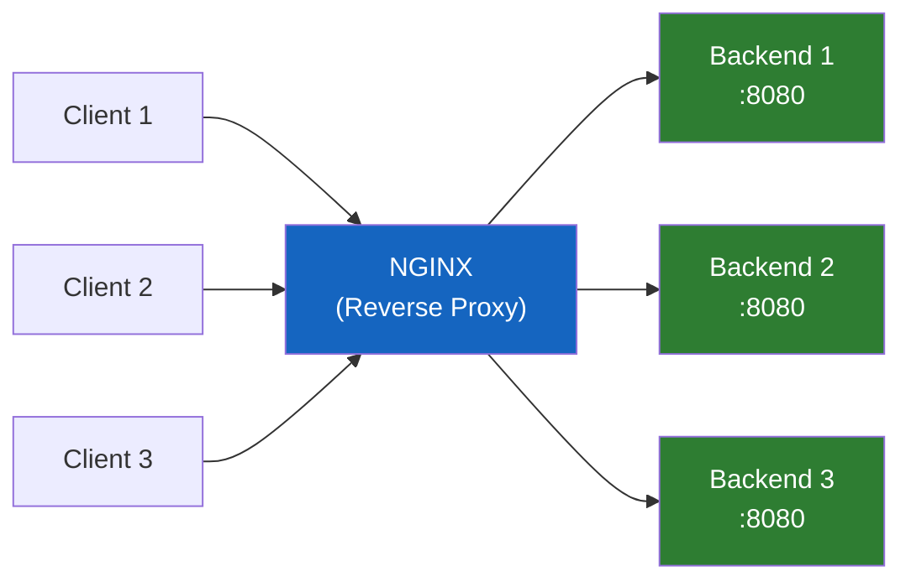
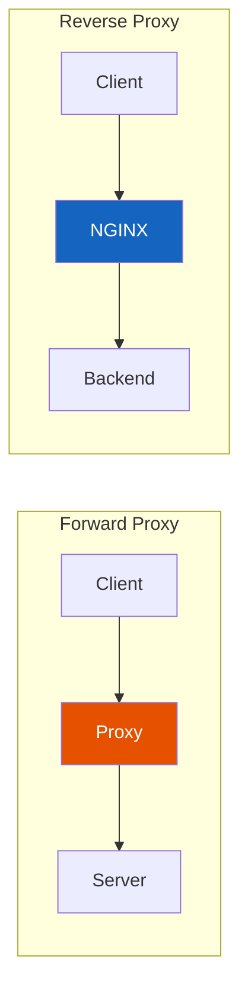
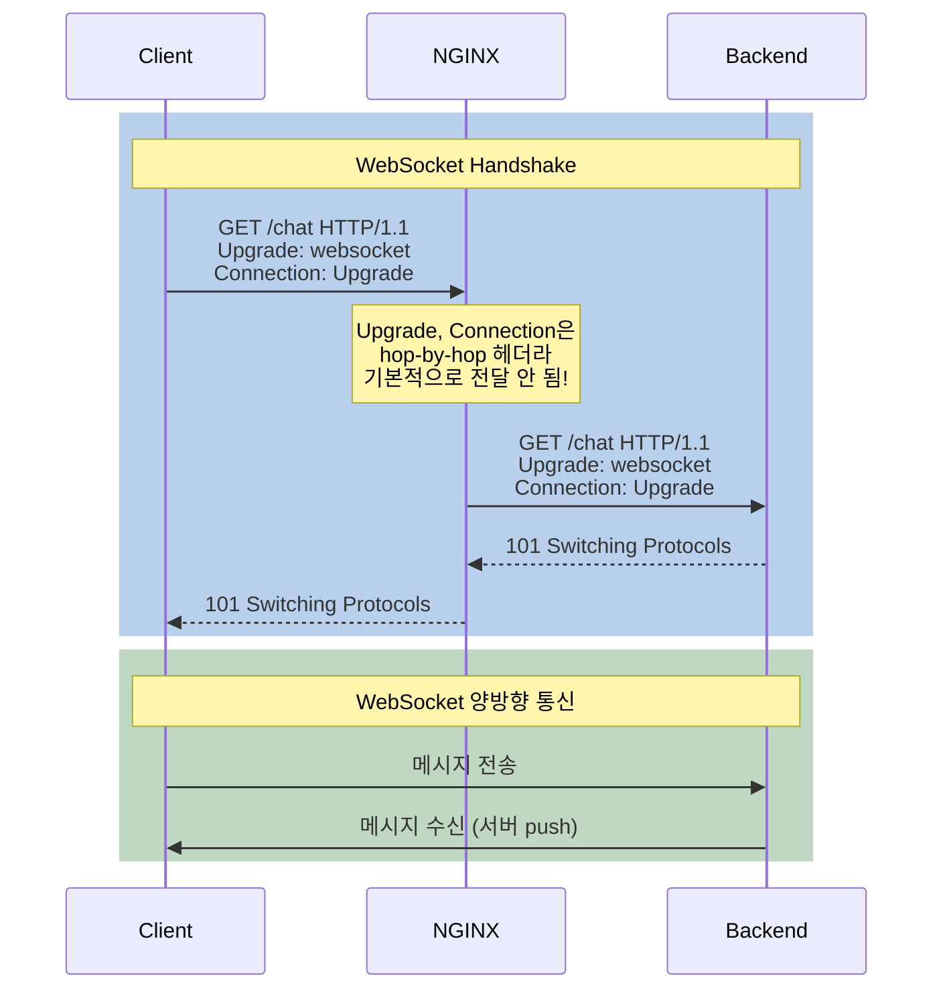
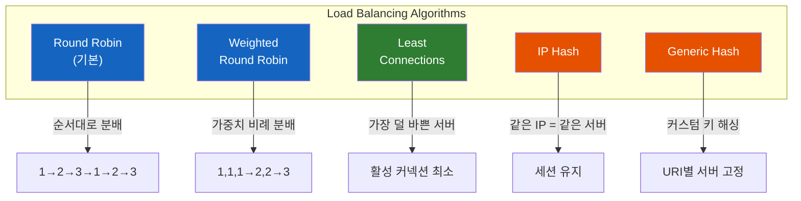

# NGINX 리버스 프록시와 로드밸런싱 완전 정복

NGINX에 `proxy_pass`만 적으면 리버스 프록시가 동작한다. 하지만 "동작한다"는 것과 "제대로 동작한다"는 것은 전혀 다르다. 왜 NGINX는 기본적으로 백엔드에 HTTP/1.0으로 연결하고, WebSocket은 왜 추가 설정 없이는 작동하지 않을까?

## 결론부터 말하면

NGINX 리버스 프록시는 **클라이언트와 백엔드 서버 사이에서 요청을 중계** 한다. 역사적으로 NGINX는 upstream에 **HTTP/1.0**을 기본으로 사용해서 Keep-Alive·WebSocket 등에 명시적 설정이 필요했다. **NGINX 1.29.7부터는 기본값이 HTTP/1.1로 바뀌고 upstream `keepalive`도 기본 활성화**되어 이 제약이 상당 부분 사라졌지만, 1.29.6 이하(배포판 stable 라인 다수)에서는 여전히 명시적 설정이 필수다. 로드밸런싱은 `upstream` 블록에 서버를 나열하고 알고리즘을 선택하는 것으로 구성한다.



| 기능 | 지시어 | 핵심 포인트 |
|------|--------|-----------|
| HTTP 리버스 프록시 | `proxy_pass` | 1.29.6 이하: 기본 HTTP/1.0 + Keep-Alive 없음 / 1.29.7+: 기본 HTTP/1.1 + keepalive 활성화 |
| WebSocket 프록시 | `proxy_set_header Upgrade` | hop-by-hop 헤더 명시 전달 필요 |
| 로드밸런싱 | `upstream` + 알고리즘 | 5가지 알고리즘 선택 가능 |

## 1. 왜 리버스 프록시가 필요한가?

### 1.1 Forward Proxy vs Reverse Proxy

프록시(Proxy)는 "대리인"이라는 뜻이다. 누구를 대리하느냐에 따라 두 종류로 나뉜다.

**Forward Proxy** 는 **클라이언트를 대리** 한다. 회사에서 직원들의 인터넷 접속을 중앙에서 관리하거나, VPN을 통해 IP를 숨기는 것이 Forward Proxy다. 서버는 클라이언트의 실제 IP를 모른다.

**Reverse Proxy** 는 **서버를 대리** 한다. 클라이언트는 NGINX의 주소만 알고, 뒤에 있는 백엔드 서버의 존재를 모른다. Java 개발자라면 Spring Cloud Gateway나 API Gateway가 바로 Reverse Proxy의 구현체다.



### 1.2 리버스 프록시가 주는 이점

단순히 요청을 전달하는 것뿐 아니라, 리버스 프록시는 다양한 역할을 수행한다.

- **보안:** 백엔드 서버의 IP와 구조를 외부에 숨긴다
- **SSL 터미네이션:** NGINX에서 HTTPS를 처리하고, 백엔드는 HTTP로 통신 (성능 향상)
- **로드밸런싱:** 여러 백엔드 서버에 트래픽을 분산
- **캐싱:** 자주 요청되는 응답을 NGINX가 캐싱하여 백엔드 부하 감소
- **압축:** gzip 압축을 NGINX 레벨에서 처리 ([gzip 설정 상세](NGINX-성능-최적화-설정-Process-Model부터-Compression까지.md))

## 2. HTTP 리버스 프록시 설정

### 2.1 기본 설정 — proxy_pass

가장 간단한 리버스 프록시 설정이다.

```nginx
server {
    listen 80;
    server_name api.example.com;

    location / {
        proxy_pass http://localhost:8080;
    }
}
```

이것만으로도 동작한다. 하지만 이 설정에는 **세 가지 문제** 가 있다.

### 2.2 문제 1: 백엔드가 클라이언트 정보를 모른다

NGINX가 요청을 중계하면, 백엔드 서버가 보는 클라이언트 IP는 **NGINX의 IP** 가 된다. 원래 클라이언트의 IP, 프로토콜(HTTP/HTTPS), 호스트 정보가 사라진다.

```nginx
location / {
    proxy_pass http://localhost:8080;

    # 원본 요청 정보를 백엔드에 전달
    proxy_set_header Host $host;                        # 원래 도메인
    proxy_set_header X-Real-IP $remote_addr;            # 클라이언트 실제 IP
    proxy_set_header X-Forwarded-For $proxy_add_x_forwarded_for;  # 프록시 체인 IP
    proxy_set_header X-Forwarded-Proto $scheme;         # http 또는 https
}
```

Spring Boot에서 `HttpServletRequest.getRemoteAddr()`로 클라이언트 IP를 가져올 때, 이 헤더가 없으면 항상 NGINX의 IP가 반환된다. `X-Forwarded-For` 헤더를 통해 원본 클라이언트 IP를 전달하는 것이 필수다.

### 2.3 문제 2: 오래된 NGINX는 upstream에 HTTP/1.0으로 연결한다

이 항목은 NGINX 버전에 따라 동작이 크게 다르다.

| 버전 | `proxy_http_version` 기본 | upstream `keepalive` |
|------|--------------------------|---------------------|
| **~1.29.6** | **1.0** (Keep-Alive 없음) | 명시적 `keepalive N` 필요 |
| **1.29.7+** | **1.1** | upstream 블록의 `keepalive` 기본 활성화, `Connection` 프록시 헤더 기본 미전송 |

1.29.7 이전 버전에서는(주요 배포판의 stable 패키지가 여전히 이 라인이라 실무에서 흔하게 마주친다) 매 upstream 요청마다 TCP 커넥션을 새로 맺고 끊는 심각한 성능 낭비가 발생한다. 그래서 다음 설정으로 명시적으로 활성화해야 한다.

```nginx
location / {
    proxy_pass http://localhost:8080;

    proxy_http_version 1.1;              # HTTP/1.1로 업그레이드 (1.29.7+에서는 기본값)
    proxy_set_header Connection "";      # Connection: close 헤더가 백엔드로 새지 않도록 차단
}
```

`Connection ""` 설정의 의도는 클라이언트가 보낸 `Connection: close` 헤더가 그대로 백엔드로 전달되는 것을 방지하기 위해서다.

여기에 더해, NGINX가 백엔드와의 커넥션을 실제로 **재사용(Pooling)** 하려면 `upstream` 블록에 `keepalive` 지시어를 추가해야 한다(1.29.6 이하 기준).

```nginx
upstream backend_api {
    server 10.0.1.10:8080;
    server 10.0.1.11:8080;

    keepalive 32;  # Worker당 유지할 유휴 Keep-Alive 커넥션 수
}
```

`keepalive 32`는 각 Worker 프로세스가 **최대 32개의 유휴 커넥션을 풀에 유지**한다는 의미다.

> **호환성 팁:** 위 명시적 설정은 1.29.7+에서도 그대로 정상 동작한다(기본값과 일치하거나 안전한 명시일 뿐). 새 프로젝트가 1.29.7+만 타겟한다면 위 설정을 생략해도 동일하게 작동한다.

### 2.4 문제 3: 응답이 느린 백엔드에 대한 타임아웃

백엔드가 응답하지 않으면 클라이언트도 무한정 기다리게 된다. 타임아웃을 설정하여 적절한 시점에 에러를 반환해야 한다.

```nginx
location / {
    proxy_pass http://localhost:8080;

    proxy_connect_timeout 10s;   # 백엔드 연결 타임아웃
    proxy_send_timeout 60s;      # 요청 전송 타임아웃
    proxy_read_timeout 60s;      # 응답 대기 타임아웃
}
```

### 2.5 실무 프록시 템플릿

위의 세 가지 문제를 모두 해결한 실무 템플릿이다. NGINX의 `include` 지시어로 공통 설정을 `snippets/proxy-params.conf`에 분리하면 여러 서버에서 재사용할 수 있다.

```nginx
# /etc/nginx/snippets/proxy-params.conf
proxy_http_version 1.1;
proxy_set_header Connection "";
proxy_set_header Host $host;
proxy_set_header X-Real-IP $remote_addr;
proxy_set_header X-Forwarded-For $proxy_add_x_forwarded_for;
proxy_set_header X-Forwarded-Proto $scheme;

proxy_connect_timeout 10s;
proxy_send_timeout 60s;
proxy_read_timeout 60s;

proxy_buffering on;
proxy_buffer_size 4k;
proxy_buffers 8 32k;
```

```nginx
# /etc/nginx/conf.d/api.conf
server {
    listen 80;
    server_name api.example.com;

    location / {
        proxy_pass http://localhost:8080;
        include /etc/nginx/snippets/proxy-params.conf;
    }
}
```

## 3. WebSocket 프록시 — 왜 추가 설정이 필요한가?

### 3.1 HTTP와 WebSocket의 차이

HTTP는 요청-응답 구조다. 클라이언트가 요청하면 서버가 응답하고 끝이다. 하지만 채팅, 실시간 알림, 게임 같은 서비스는 **서버가 먼저 데이터를 보내야** 한다. 이때 사용하는 것이 WebSocket이다.

WebSocket은 처음에 HTTP로 연결을 시작한 후, `Upgrade` 헤더를 통해 **프로토콜을 전환** 한다. 이 과정을 **WebSocket Handshake** 라 부른다.



### 3.2 핵심 문제: hop-by-hop 헤더

`Upgrade`와 `Connection`은 **hop-by-hop 헤더** 다. 이 헤더들은 HTTP 스펙상 **프록시를 거칠 때 전달되지 않는다.** NGINX도 이 규칙을 따르기 때문에, 기본 설정으로는 `Upgrade` 헤더가 백엔드에 도달하지 않아 WebSocket Handshake가 실패한다.

그래서 **명시적으로 전달** 해야 한다.

```nginx
location /ws/ {
    proxy_pass http://localhost:8080;
    proxy_http_version 1.1;

    # WebSocket 핵심 설정
    proxy_set_header Upgrade $http_upgrade;       # Upgrade 헤더 전달
    proxy_set_header Connection "upgrade";        # Connection 헤더를 "upgrade"로 설정

    # WebSocket 타임아웃 (기본 60초 → 연결 유지를 위해 늘림)
    proxy_read_timeout 3600s;    # 1시간
    proxy_send_timeout 3600s;
}
```

`proxy_read_timeout`이 중요하다. 기본값 60초는 WebSocket 연결이 **60초 동안 데이터가 없으면 끊긴다** 는 의미다. 실시간 채팅에서 1분 동안 메시지가 없으면 연결이 끊기면 곤란하므로, 적절히 늘려야 한다. 다만 너무 길게 설정하면 유휴 커넥션이 리소스를 낭비하므로, 애플리케이션 레벨의 ping/pong과 병행하는 것이 좋다.

### 3.3 HTTP와 WebSocket을 한 location에서 처리

같은 경로에서 일반 HTTP 요청과 WebSocket 요청이 모두 들어오는 경우, `map`을 사용하여 조건부 설정을 할 수 있다.

```nginx
# http 블록에 선언
map $http_upgrade $connection_upgrade {
    default upgrade;
    ''      close;
}

server {
    location / {
        proxy_pass http://localhost:8080;
        proxy_http_version 1.1;
        proxy_set_header Upgrade $http_upgrade;
        proxy_set_header Connection $connection_upgrade;  # 조건부 설정
    }
}
```

`map`은 `$http_upgrade` 변수의 값에 따라 `$connection_upgrade` 변수를 동적으로 설정한다. WebSocket 요청이면 `upgrade`, 일반 HTTP 요청이면 `close`가 된다. NGINX 공식 문서에서도 이 패턴을 권장한다.

## 4. 로드밸런싱 — 5가지 알고리즘

### 4.1 upstream 블록

로드밸런싱은 `upstream` 블록에 백엔드 서버 목록을 정의하는 것으로 시작한다.

```nginx
upstream backend_api {
    server 10.0.1.10:8080;
    server 10.0.1.11:8080;
    server 10.0.1.12:8080;
}

server {
    listen 80;
    server_name api.example.com;

    location / {
        proxy_pass http://backend_api;  # upstream 이름으로 참조
        include /etc/nginx/snippets/proxy-params.conf;
    }
}
```

별도 설정이 없으면 **Round Robin** 이 기본 알고리즘으로 적용된다.

### 4.2 5가지 로드밸런싱 알고리즘



**1. Round Robin (기본)**

요청을 서버에 순서대로 돌아가며 분배한다. 설정이 가장 간단하고, 서버 성능이 동일할 때 적합하다.

```nginx
upstream backend {
    server 10.0.1.10:8080;  # 1번째 요청
    server 10.0.1.11:8080;  # 2번째 요청
    server 10.0.1.12:8080;  # 3번째 요청 → 다시 1번
}
```

**2. Weighted Round Robin**

서버 성능이 다를 때, `weight`로 분배 비율을 조정한다. weight가 높은 서버가 더 많은 요청을 받는다.

```nginx
upstream backend {
    server 10.0.1.10:8080 weight=5;  # 50%의 요청
    server 10.0.1.11:8080 weight=3;  # 30%의 요청
    server 10.0.1.12:8080 weight=2;  # 20%의 요청
}
```

**3. Least Connections**

**현재 활성 커넥션이 가장 적은 서버** 에 요청을 보낸다. 요청 처리 시간이 일정하지 않은 경우에 효과적이다.

```nginx
upstream backend {
    least_conn;
    server 10.0.1.10:8080;
    server 10.0.1.11:8080;
    server 10.0.1.12:8080;
}
```

Spring Boot처럼 요청마다 처리 시간이 크게 다른 애플리케이션에서는 Least Connections가 Round Robin보다 균등한 부하 분산을 만들어낸다.

**4. IP Hash**

**클라이언트 IP 주소를 해싱** 하여 항상 같은 서버로 보낸다. 세션 기반 애플리케이션에서 **세션 어피니티(Session Affinity)** 가 필요할 때 사용한다.

```nginx
upstream backend {
    ip_hash;
    server 10.0.1.10:8080;
    server 10.0.1.11:8080;
    server 10.0.1.12:8080;
}
```

> **주의:** IP Hash를 사용하면 로드밸런싱이 불균등해질 수 있다. 회사 네트워크처럼 같은 공인 IP를 사용하는 수백 명의 사용자가 모두 같은 서버로 몰리기 때문이다. 가능하면 세션을 Redis 같은 외부 저장소로 분리하고, Least Connections를 쓰는 것이 더 나은 선택이다.
>
> **버전별 sticky 가용성:**
> - **~1.29.5 (그리고 그 이전의 LTS 라인)**: 쿠키 기반 `sticky` 디렉티브는 **NGINX Plus(상용) 전용**. 오픈소스에서 쿠키 기반 sticky가 필요하면 OpenResty(Lua)나 `nginx-sticky-module-ng` 같은 third-party 모듈을 별도 빌드해야 했다.
> - **1.29.6+ (오픈소스에 편입)**: `upstream` 블록의 `sticky` 디렉티브가 오픈소스에도 추가되어 쿠키 기반 세션 어피니티를 기본 제공. `server` 디렉티브의 `route`/`drain` 파라미터도 함께 추가되어 수동 세션 라우팅·드레이닝이 가능해졌다. IP Hash의 "공인 IP 중복" 문제 없이 세션을 유지할 수 있다.

**5. Generic Hash**

커스텀 키를 기반으로 해싱한다. 예를 들어 **요청 URI를 키로 사용** 하면, 같은 URL 요청이 항상 같은 서버로 가서 캐시 적중률을 높일 수 있다.

```nginx
upstream backend {
    hash $request_uri consistent;  # URI 기반 해싱, consistent 해싱 사용
    server 10.0.1.10:8080;
    server 10.0.1.11:8080;
    server 10.0.1.12:8080;
}
```

`consistent` 파라미터를 추가하면 **Consistent Hashing** 이 적용되어, 서버가 추가/제거되어도 기존 매핑이 최소한으로 변경된다.

### 4.3 알고리즘 선택 가이드

| 상황 | 권장 알고리즘 | 이유 |
|------|-------------|------|
| 서버 성능 동일, 처리 시간 균일 | Round Robin | 가장 단순하고 효과적 |
| 서버 성능이 서로 다름 | Weighted Round Robin | 성능 비례 분배 |
| 처리 시간이 요청마다 다름 | **Least Connections** | 실시간 부하 기반 분배 |
| 세션 유지 필수 (레거시) | IP Hash | 같은 클라이언트 = 같은 서버 |
| 캐시 적중률 최적화 | Generic Hash (URI) | 같은 URL = 같은 서버 |

### 4.4 헬스 체크와 장애 대응

NGINX는 **Passive Health Check** 을 기본 지원한다. 백엔드 서버가 응답하지 않으면 자동으로 비활성화한다.

```nginx
upstream backend {
    server 10.0.1.10:8080 max_fails=3 fail_timeout=30s;
    server 10.0.1.11:8080 max_fails=3 fail_timeout=30s;
    server 10.0.1.12:8080 backup;   # 위 서버들이 모두 다운되면 사용
}
```

| 파라미터 | 의미 |
|---------|------|
| `max_fails=3` | 3번 연속 실패하면 서버를 비활성화 |
| `fail_timeout=30s` | 30초 후 다시 시도 |
| `backup` | 다른 모든 서버가 다운된 경우에만 사용 |
| `down` | 수동으로 비활성화 (유지보수 시) |

```nginx
# 장애 시 다음 서버로 재시도
proxy_next_upstream error timeout http_502 http_503 http_504;
proxy_next_upstream_tries 3;        # 최대 3번 재시도
proxy_next_upstream_timeout 30s;    # 재시도 전체 타임아웃
```

## 5. 정리

### 핵심 포인트

1. **upstream HTTP 버전의 기본값은 NGINX 버전에 따라 다르다**
   - **1.29.6 이하**: 기본 `proxy_http_version 1.0` + upstream keepalive 비활성 → `proxy_http_version 1.1` + `proxy_set_header Connection ""` + upstream 블록의 `keepalive N` 명시 필요
   - **1.29.7+**: 기본 `proxy_http_version 1.1` + upstream keepalive 기본 활성화 → 추가 설정 없이도 Keep-Alive로 연결됨
   - 버전과 무관하게 `Host`, `X-Real-IP`, `X-Forwarded-For` 헤더는 명시적으로 전달해야 백엔드가 클라이언트 정보를 알 수 있다

2. **WebSocket 프록시는 hop-by-hop 헤더 문제를 해결해야 한다**
   - `Upgrade`와 `Connection` 헤더를 명시적으로 전달해야 Handshake가 성공한다
   - `proxy_read_timeout`을 늘려야 유휴 시간에 연결이 끊기지 않는다

3. **로드밸런싱 알고리즘은 상황에 맞게 선택하라**
   - 대부분의 상황: **Least Connections** 가 가장 균등한 분배를 만든다
   - 세션 유지 필요: IP Hash (하지만 Redis 세션 분리가 더 나은 선택)
   - 캐시 최적화: Generic Hash with consistent

---

## 출처

- [NGINX Documentation - Reverse Proxy](https://docs.nginx.com/nginx/admin-guide/web-server/reverse-proxy/) - 공식 문서
- [NGINX Documentation - WebSocket proxying](https://nginx.org/en/docs/http/websocket.html) - WebSocket 프록시 공식 문서
- [NGINX Documentation - ngx_http_upstream_module](https://nginx.org/en/docs/http/ngx_http_upstream_module.html) - upstream/로드밸런싱 공식 문서
- [NGINX Load Balancing: Complete Guide (2026)](https://www.getpagespeed.com/server-setup/nginx/nginx-load-balancing) - 로드밸런싱 알고리즘 상세 가이드
