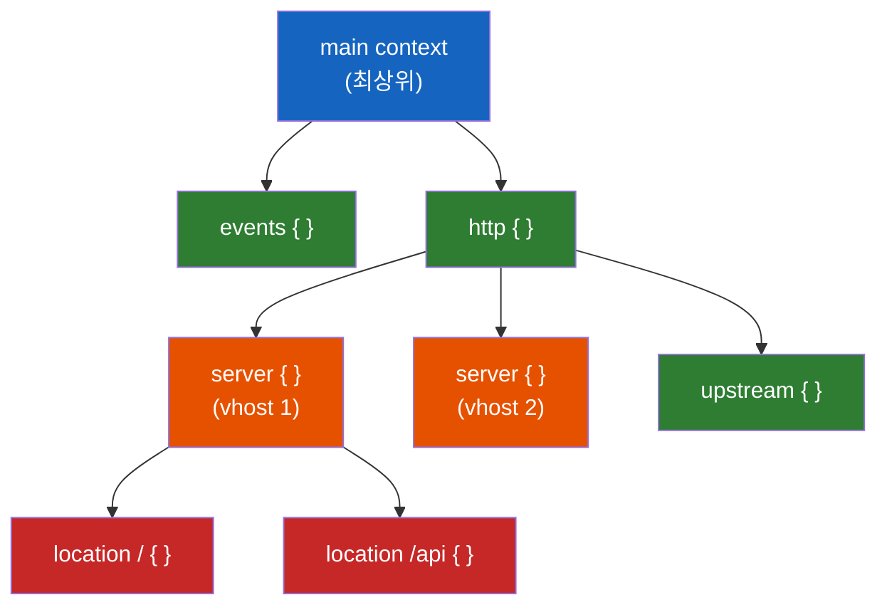
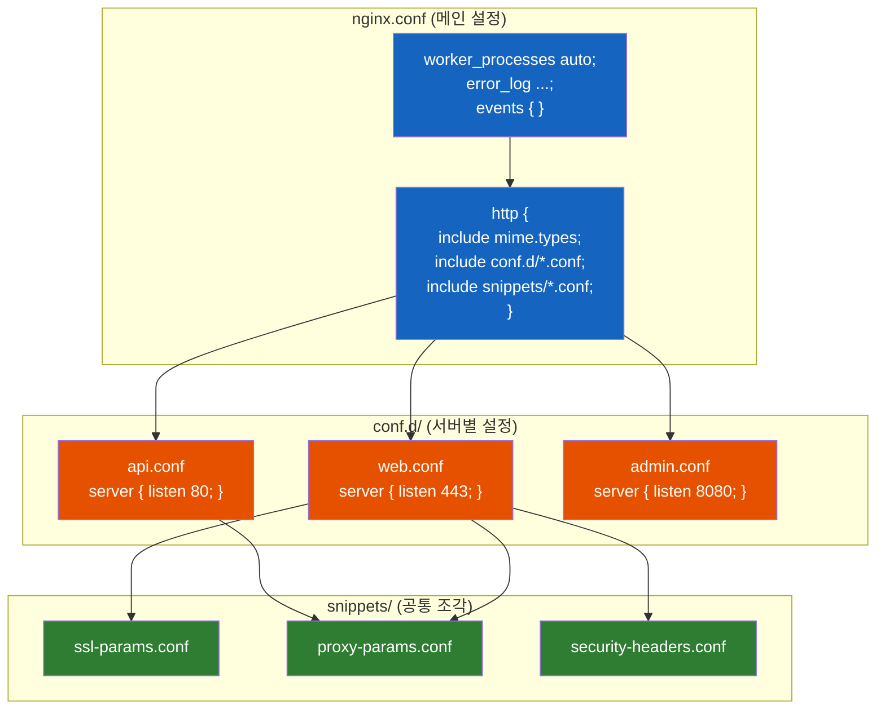

# NGINX 설정의 철학 - Context Block부터 모듈화까지

`nginx.conf`는 왜 중괄호 안에 중괄호가 있고, 어떤 설정은 바깥에 쓰고 어떤 설정은 안에 쓸까? 이 구조를 이해하면 수백 줄의 설정 파일도 한눈에 읽힌다.

## 결론부터 말하면

NGINX 설정은 **Context Block의 부모-자식 트리 구조** 로 이루어져 있다. 부모에서 선언한 설정은 자식에게 **상속** 되고, 자식에서 같은 설정을 선언하면 **덮어쓰기(Override)** 된다. 그리고 `include` 지시어를 통해 설정을 파일 단위로 **모듈화** 할 수 있다.



Java 개발자라면 이렇게 이해하면 된다.

| NGINX | Java/Spring 비유 |
|-------|-----------------|
| `main` context | `application.yml` 최상위 |
| `http` block | Spring MVC 설정 영역 |
| `server` block | 가상 호스트 = `@Profile` 별 설정 |
| `location` block | `@RequestMapping` 경로 매핑 |
| `include` | `@Import`, `spring.config.import` |
| 상속 + 덮어쓰기 | `application.yml` → `application-dev.yml` 오버라이드 |

## 1. 왜 Context Block 구조인가?

### 1.1 만약 평면 구조라면?

NGINX 설정이 만약 하나의 플랫한 파일이라면 어떨까?

```nginx
# 만약 평면 구조라면... (가상의 Bad 예시)
listen 80;
server_name api.example.com;
root /var/www/api;
listen 443;
server_name web.example.com;
root /var/www/web;
gzip on;  # 이건 어디에 적용되는 거지?
```

어떤 `listen`이 어떤 `server_name`과 짝인지 알 수 없다. `gzip on`은 전체에 적용되는 건지, 특정 서버에만 적용되는 건지 모호하다. 이것은 마치 모든 Bean을 한 파일에 등록하면서 어떤 프로파일에 속하는지 구분하지 않는 것과 같다.

### 1.2 Context Block이 해결하는 것

NGINX는 이 문제를 **중괄호(`{ }`)로 감싸는 블록 구조** 로 해결했다. 각 블록은 명확한 **적용 범위(scope)** 를 가진다.

```nginx
# Context Block 구조 (실제 NGINX)
http {
    gzip on;  # http 블록 안의 모든 서버에 적용

    server {
        listen 80;
        server_name api.example.com;
        root /var/www/api;
    }

    server {
        listen 443 ssl;
        server_name web.example.com;
        root /var/www/web;
    }
}
```

이제 `gzip on`이 모든 서버에 적용된다는 것이 구조적으로 명확하다. 각 `server` 블록은 독립적인 가상 호스트를 정의한다. Java의 패키지 구조가 클래스의 소속을 명확히 하듯, Context Block은 설정의 소속을 명확히 한다.

## 2. Context Block의 계층 구조

NGINX의 Context Block은 정해진 부모-자식 관계를 따른다. 아무 블록 안에 아무 블록을 넣을 수 없다.

### 2.1 각 Context의 역할

**main context** 는 설정 파일의 최상위 레벨이다. `nginx.conf` 파일에서 어떤 블록에도 속하지 않는 영역이 main context다. Worker 프로세스 수, 에러 로그 경로 같은 **전역 설정** 을 여기에 둔다.

```nginx
# main context (최상위)
worker_processes auto;
error_log /var/log/nginx/error.log;
pid /run/nginx.pid;

events {
    # events context
}

http {
    # http context
}
```

**events context** 는 이벤트 처리 관련 설정만 담는다. Worker당 최대 커넥션 수, 이벤트 모델(epoll/kqueue) 같은 **커넥션 레벨 설정** 이 여기에 들어간다.

**http context** 는 HTTP 프로토콜과 관련된 모든 설정의 부모다. MIME 타입, 로그 포맷, gzip 같은 **HTTP 공통 설정** 을 여기에 선언하면 모든 하위 server/location에 적용된다.

**server context** 는 하나의 **가상 호스트(Virtual Host)** 를 정의한다. 도메인명, 포트, SSL 인증서 같은 설정이 여기에 온다. Apache의 `<VirtualHost>`와 같은 역할이다.

**location context** 는 **URI 경로별 처리 규칙** 을 정의한다. "이 경로로 들어온 요청은 이렇게 처리해라"를 설정하는 곳이다. Spring의 `@RequestMapping`과 같은 역할이다.

### 2.2 허용되는 부모-자식 관계

아무데나 아무 블록을 넣으면 `nginx -t`에서 에러가 난다.

| 자식 Block | 허용되는 부모 |
|-----------|-------------|
| `events` | main만 가능 |
| `http` | main만 가능 |
| `server` | http만 가능 |
| `location` | server, 또는 다른 location (중첩 가능) |
| `upstream` | http만 가능 |

```nginx
# ❌ Error: server를 main에 직접 쓸 수 없다
server {
    listen 80;
}

# ✅ Correct: server는 http 안에 있어야 한다
http {
    server {
        listen 80;
    }
}
```

## 3. 상속과 덮어쓰기 — NGINX만의 특수한 규칙

여기서부터가 진짜 중요하다. NGINX의 상속 규칙은 직관적이지만, **한 가지 함정** 이 있다.

### 3.1 기본 상속: 부모의 설정이 자식에게 내려간다

```nginx
http {
    gzip on;              # http 레벨에서 선언
    gzip_min_length 1000;

    server {
        listen 80;
        server_name example.com;
        # gzip on;              ← 안 써도 상속받아서 적용됨
        # gzip_min_length 1000; ← 이것도 상속됨

        location / {
            root /var/www/html;
            # gzip on;          ← 여기까지 상속됨
        }
    }
}
```

부모(http)에서 선언한 `gzip on`이 자식(server)과 손자(location)까지 자동으로 내려간다. Java의 `application.yml`에서 공통 설정을 최상위에 두면 모든 프로파일에 적용되는 것과 같은 원리다.

### 3.2 덮어쓰기: 자식에서 재선언하면 부모 설정을 무시한다

```nginx
http {
    gzip on;

    server {
        listen 80;
        server_name static.example.com;
        # gzip on; ← 상속됨

        location /already-compressed {
            gzip off;  # ← 이 location에서만 gzip 비활성화 (덮어쓰기)
        }
    }
}
```

`/already-compressed` 경로는 이미 압축된 파일을 서빙하는 곳이니, 여기서만 gzip을 끄고 싶다. 자식 블록에서 같은 지시어를 재선언하면 부모 설정을 **덮어쓴다.**

### 3.3 함정: 배열형 지시어의 "전체 교체"

**여기가 핵심이다.** NGINX에서 가장 흔한 실수가 바로 이것이다.

`add_header`처럼 **여러 번 선언할 수 있는 지시어** 는 자식에서 하나만 재선언해도 **부모의 모든 값이 사라진다.**

```nginx
http {
    add_header X-Frame-Options "SAMEORIGIN";
    add_header X-Content-Type-Options "nosniff";
    add_header X-XSS-Protection "1; mode=block";

    server {
        listen 80;

        location /api {
            add_header X-Custom "my-api";
            # ⚠️ 위의 3개 보안 헤더가 모두 사라진다!
            # X-Custom만 남는다
        }
    }
}
```

이것은 **"합쳐지기(merge)"가 아니라 "전체 교체(replace)"** 되는 방식이다. 자식에서 `add_header`를 하나라도 쓰면, 부모의 모든 `add_header`가 무시된다.

```nginx
# ✅ 올바른 방법: 자식에서 필요한 헤더를 모두 다시 선언
location /api {
    add_header X-Frame-Options "SAMEORIGIN";
    add_header X-Content-Type-Options "nosniff";
    add_header X-XSS-Protection "1; mode=block";
    add_header X-Custom "my-api";  # 추가 헤더
}
```

| 지시어 타입 | 상속 방식 | 예시 |
|-----------|----------|------|
| **단일값** 지시어 | 자식에서 재선언하면 해당 값만 덮어씀 | `gzip`, `root`, `index` |
| **배열형** 지시어 | 자식에서 하나만 재선언해도 **전체 교체** | `add_header`, `proxy_set_header` |

> 이 함정은 실무에서 정말 자주 발생한다. 보안 헤더를 http 레벨에 열심히 설정해놨는데, 특정 location에서 `add_header`를 하나 추가하는 순간 보안 헤더가 전부 날아가는 사고가 생긴다.

> **버전별 대응 방법:**
> - **~1.29.2 (그 이전 LTS 라인 다수)**: NGINX는 이 "전체 교체" 동작을 끄는 공식 옵션을 제공하지 않았다. 회피 방법은 두 가지다.
>   1. **자식 블록에서 부모의 모든 헤더를 명시적으로 다시 선언** — 단순·확실하지만 중복이 많다.
>   2. **공통 헤더를 snippet 파일로 분리하고, 헤더가 필요한 모든 location에 `include`로 주입** — 본문 4.2절의 모듈화 패턴(`snippets/security-headers.conf`)이 이 문제의 표준 해법이다.
> - **1.29.3+**: `add_header_inherit`과 `add_trailer_inherit` 디렉티브가 새로 추가되어 부모 블록의 헤더 상속 동작을 직접 제어할 수 있다(공식 changelog: "Feature: the add_header_inherit and add_trailer_inherit directives"). 정확한 인자 값과 기본 동작은 `ngx_http_headers_module` 공식 문서에서 확인하는 것을 권장한다 — 신규 디렉티브라 행동 세부가 다듬어지는 단계일 수 있다.

## 4. Include를 활용한 모듈화

설정이 커지면 하나의 `nginx.conf`에 모든 것을 담는 것은 유지보수의 악몽이 된다. NGINX는 `include` 지시어로 이 문제를 해결한다.

### 4.1 include는 "텍스트 복사-붙여넣기"다

`include`의 동작 원리는 놀라울 정도로 단순하다. C의 `#include`와 똑같이, **해당 파일의 내용을 그 자리에 그대로 삽입** 한다.

```nginx
# nginx.conf
http {
    include /etc/nginx/mime.types;        # MIME 타입 정의 삽입
    include /etc/nginx/conf.d/*.conf;     # conf.d 디렉토리의 모든 .conf 파일 삽입
}
```

와일드카드(`*`)를 사용하면 디렉토리 안의 모든 매칭 파일을 한 번에 포함할 수 있다. 이것이 NGINX 모듈화의 핵심이다.

### 4.2 실무 모듈화 패턴

실무에서는 보통 다음과 같은 구조로 설정을 분리한다.



**nginx.conf** 는 최소한으로 유지한다. 전역 설정과 `include`만 남긴다.

```nginx
# /etc/nginx/nginx.conf — 최소한의 메인 설정
worker_processes auto;
error_log /var/log/nginx/error.log warn;
pid /run/nginx.pid;

events {
    worker_connections 1024;
}

http {
    include /etc/nginx/mime.types;
    default_type application/octet-stream;

    # 공통 설정
    sendfile on;
    keepalive_timeout 65;

    # 로그 포맷
    log_format main '$remote_addr - $remote_user [$time_local] '
                    '"$request" $status $body_bytes_sent';

    # 서버별 설정 로드
    include /etc/nginx/conf.d/*.conf;
}
```

**conf.d/api.conf** 는 하나의 서버(가상 호스트)를 정의한다.

```nginx
# /etc/nginx/conf.d/api.conf
server {
    listen 80;
    server_name api.example.com;

    include /etc/nginx/snippets/security-headers.conf;
    include /etc/nginx/snippets/proxy-params.conf;

    location / {
        proxy_pass http://backend_api;
    }
}
```

**snippets/security-headers.conf** 는 여러 서버에서 재사용하는 공통 조각이다.

```nginx
# /etc/nginx/snippets/security-headers.conf
add_header X-Frame-Options "SAMEORIGIN" always;
add_header X-Content-Type-Options "nosniff" always;
add_header X-XSS-Protection "1; mode=block" always;
add_header Referrer-Policy "strict-origin-when-cross-origin" always;
```

### 4.3 모듈화의 핵심 원칙

이 패턴이 왜 강력한지 정리하면 이렇다.

**첫째, 관심사의 분리.** 서버별 설정(`conf.d/`)과 공통 설정(`snippets/`)이 분리된다. 새 서비스를 추가할 때 `conf.d/`에 파일 하나만 추가하면 된다. 기존 설정을 건드릴 필요가 없다.

**둘째, DRY(Don't Repeat Yourself).** 보안 헤더, SSL 파라미터, 프록시 설정 같은 공통 조각을 `snippets/`에 한 번만 정의하고, 필요한 곳에서 `include`한다. 보안 정책이 바뀌면 snippet 하나만 수정하면 모든 서버에 반영된다.

**셋째, 안전한 배포.** 서비스를 내릴 때 `conf.d/api.conf`를 `conf.d/api.conf.disabled`로 이름만 바꾸면 된다. 와일드카드(`*.conf`)에 매칭되지 않아 자동으로 제외된다.

```bash
# 서비스 비활성화 (파일 삭제 없이)
mv /etc/nginx/conf.d/api.conf /etc/nginx/conf.d/api.conf.disabled
nginx -t && nginx -s reload

# 서비스 재활성화
mv /etc/nginx/conf.d/api.conf.disabled /etc/nginx/conf.d/api.conf
nginx -t && nginx -s reload
```

## 5. 정리

### 핵심 포인트

1. **NGINX 설정은 Context Block의 트리 구조다**
   - `main → http → server → location` 순으로 계층이 내려간다
   - 각 블록은 명확한 적용 범위(scope)를 가진다

2. **상속은 편리하지만, 배열형 지시어의 "전체 교체" 함정에 주의하라**
   - 단일값 지시어(`gzip`, `root`)는 자식에서 해당 값만 덮어쓴다
   - 배열형 지시어(`add_header`, `proxy_set_header`)는 자식에서 하나만 써도 부모 것이 **전부 사라진다**

3. **include로 모듈화하여 관심사를 분리하라**
   - `conf.d/*.conf`로 서버별 설정 분리
   - `snippets/*.conf`로 공통 조각 재사용
   - 서비스 비활성화는 파일 확장자 변경으로 안전하게 처리

---

## 출처

- [NGINX Documentation - Configuration File Structure](https://nginx.org/en/docs/beginners_guide.html#conf_structure) - 공식 문서
- [NGINX Documentation - ngx_http_core_module](https://nginx.org/en/docs/http/ngx_http_core_module.html) - HTTP Core 모듈 공식 문서
- [NGINX Documentation - include directive](https://nginx.org/en/docs/ngx_core_module.html#include) - include 지시어 공식 문서
