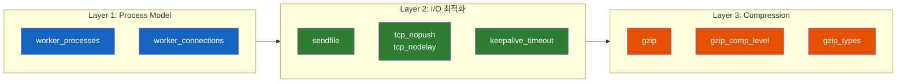
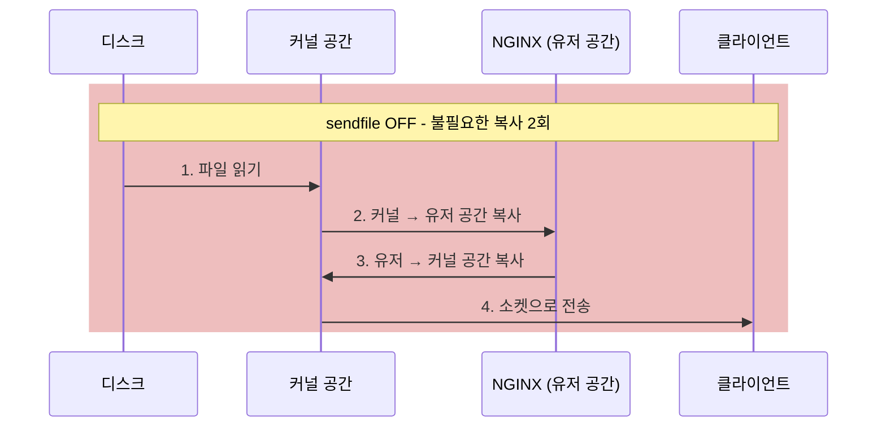
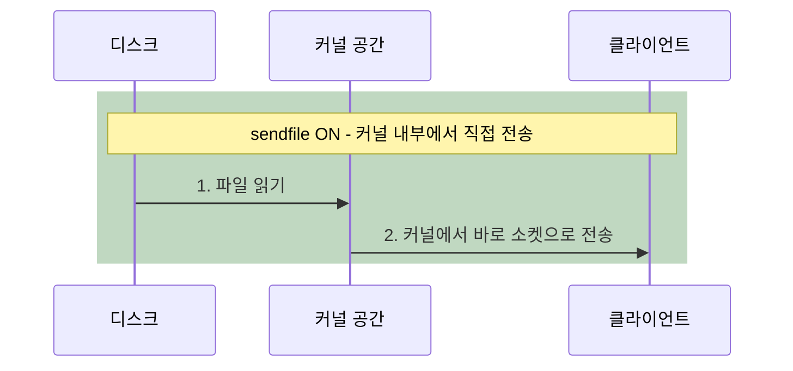

# NGINX 성능 최적화 설정 - Process Model부터 Compression까지

NGINX를 설치하고 기본 설정으로 돌리면 잘 동작한다. 하지만 "잘 동작한다"와 "최적으로 동작한다"는 전혀 다른 이야기다. 기본값의 어떤 부분이 병목이 되고, 어떻게 바꿔야 할까?

## 결론부터 말하면

NGINX 성능 최적화는 크게 **세 가지 레이어** 에서 이루어진다. **Process Model** (CPU 활용), **I/O 설정** (파일 전송 효율), **Compression** (네트워크 대역폭 절약). 이 세 가지를 올바르게 설정하면 같은 하드웨어에서 처리량이 수배 향상된다.



| 레이어 | 설정 | 효과 |
|--------|------|------|
| Process Model | `worker_processes`, `worker_connections` | CPU 코어를 빠짐없이 활용 |
| I/O 최적화 | `sendfile`, `tcp_nopush`, `keepalive` | 불필요한 복사와 패킷을 제거 |
| Compression | `gzip`, `gzip_comp_level`, `gzip_types` | 네트워크 전송량 60~80% 감소 |

## 1. Process Model 설정 — CPU를 빠짐없이 활용하라

### 1.1 worker_processes: 몇 개의 Worker를 띄울 것인가?

앞선 TIL에서 NGINX의 Master-Worker 구조를 살펴봤다. Master는 관리만 하고, 실제 요청은 Worker가 처리한다. 그렇다면 Worker를 몇 개 띄워야 할까?

**정답은 CPU 코어 수와 동일하게 설정하는 것이다.** Worker 하나는 하나의 CPU 코어에 바인딩되어 동작하기 때문에, 코어 수보다 적으면 놀고 있는 코어가 생기고, 많으면 Context Switching 오버헤드가 발생한다.

```nginx
# 방법 1: 자동 감지 (권장)
worker_processes auto;  # CPU 코어 수를 자동 감지하여 설정

# 방법 2: 수동 지정
worker_processes 4;     # 4코어 서버인 경우
```

`auto`를 쓰면 NGINX가 시스템의 CPU 코어 수를 감지해서 자동으로 맞춘다. 대부분의 경우 `auto`가 최선이다.

Java에서 `Runtime.getRuntime().availableProcessors()`로 스레드 풀 크기를 정하는 것과 같은 원리다.

### 1.2 worker_connections: Worker당 최대 동시 커넥션

```nginx
events {
    worker_connections 1024;  # 기본값은 512, 실무에서는 보통 1024 이상으로 설정
}
```

Worker 하나가 동시에 처리할 수 있는 최대 커넥션 수다. NGINX 전체의 최대 동시 커넥션 수는 이 공식으로 계산된다.

$$\text{Max Connections} = \text{worker\_processes} \times \text{worker\_connections}$$

예를 들어 `worker_processes 4`이고 `worker_connections 1024`이면, 최대 동시 커넥션은 $4 \times 1024 = 4,096$개다.

하지만 여기서 주의할 점이 있다. 리버스 프록시로 사용하는 경우, **하나의 클라이언트 요청이 2개의 커넥션을 사용한다** — 클라이언트와의 커넥션 1개, 백엔드 서버와의 커넥션 1개. 그래서 리버스 프록시 환경에서의 실제 최대 동시 사용자 수는 절반이다.

$$\text{Max Clients (reverse proxy)} = \frac{\text{worker\_processes} \times \text{worker\_connections}}{2}$$

```nginx
# 실무 권장 설정
events {
    worker_connections 4096;  # 리버스 프록시 환경에서는 넉넉하게
    use epoll;                # Linux에서 가장 효율적인 이벤트 모델
    multi_accept on;          # Worker가 한 번에 여러 커넥션을 수락
}
```

`multi_accept on`은 Worker가 이벤트 루프 한 번에 하나의 커넥션만 수락하는 대신, **대기 중인 모든 커넥션을 한 번에 수락** 하게 한다. 트래픽이 몰릴 때 응답 지연을 줄여준다.

### 1.3 Worker CPU Affinity

특정 Worker를 특정 CPU 코어에 고정(pinning)할 수도 있다. Context Switching을 완전히 제거하고, CPU 캐시 적중률을 높이는 효과가 있다.

```nginx
# 자동 바인딩 (권장)
worker_cpu_affinity auto;

# 수동 바인딩 (4코어 예시)
worker_processes 4;
worker_cpu_affinity 0001 0010 0100 1000;  # 각 Worker를 각 코어에 1:1 매핑
```

대부분의 경우 `auto`로 충분하다. 수동 설정은 NUMA 아키텍처나 초고성능 튜닝이 필요한 환경에서만 사용한다.

## 2. I/O 최적화 — 불필요한 복사를 제거하라

### 2.1 sendfile: 커널에서 직접 전송

NGINX가 정적 파일을 클라이언트에게 보낼 때, 기본적으로는 다음과 같은 과정을 거친다.



유저 공간으로 데이터를 복사했다가 다시 커널 공간으로 돌려보내는 과정이 **완전히 불필요** 하다. NGINX는 파일 내용을 수정하지 않고 그대로 전달할 뿐이니까.



`sendfile on`을 설정하면 커널이 **유저 공간을 거치지 않고 직접** 파일을 소켓으로 전송한다. 이것을 **Zero-Copy** 라고 부른다.

```nginx
http {
    sendfile on;  # Zero-Copy 활성화
}
```

Java에서 `FileChannel.transferTo()`나 `Files.copy()`가 내부적으로 같은 시스템 콜(`sendfile()`)을 사용하는 것과 동일한 원리다.

### 2.2 tcp_nopush + tcp_nodelay: 패킷 전송 최적화

이 두 설정은 이름만 보면 서로 반대인 것 같지만, 실제로는 **함께 사용** 할 때 가장 효과적이다.

**tcp_nopush** 는 응답 헤더와 파일 데이터를 **하나의 패킷으로 묶어서** 보낸다. `sendfile`과 함께 사용해야 효과가 있다. 작은 패킷 여러 개 대신 큰 패킷 하나를 보내면 네트워크 오버헤드가 줄어든다.

**tcp_nodelay** 는 작은 데이터를 즉시 전송한다. TCP의 Nagle 알고리즘이 작은 패킷을 모아서 보내려고 기다리는 것을 방지한다. Keep-Alive 커넥션에서 응답 지연을 줄여준다.

```nginx
http {
    sendfile on;
    tcp_nopush on;   # 응답을 묶어서 전송 (sendfile과 함께)
    tcp_nodelay on;  # 작은 패킷 즉시 전송 (Keep-Alive 시)
}
```

이 둘이 충돌하지 않는 이유는 적용 시점이 다르기 때문이다.

| 설정 | 적용 시점 | 효과 |
|------|----------|------|
| `tcp_nopush` | 응답 전송 시작 | 헤더 + 본문을 묶어서 전송 |
| `tcp_nodelay` | 마지막 패킷 전송 시 | 남은 데이터 즉시 전송 |

NGINX는 먼저 `tcp_nopush`로 큰 패킷을 효율적으로 보내고, 마지막 남은 조각은 `tcp_nodelay`로 즉시 전송한다. 함께 사용하면 **처리량(throughput)과 지연(latency) 모두** 개선된다.

### 2.3 keepalive_timeout: 커넥션 재사용

HTTP Keep-Alive는 하나의 TCP 커넥션으로 여러 요청을 처리하는 기능이다. 매 요청마다 TCP 3-way handshake를 다시 하지 않아도 되니, 특히 정적 리소스가 많은 페이지에서 성능이 크게 향상된다.

```nginx
http {
    keepalive_timeout 65;     # Keep-Alive 유지 시간 (초)
    keepalive_requests 1000;  # 하나의 커넥션으로 처리할 최대 요청 수
}
```

`keepalive_timeout 65`는 클라이언트가 65초 동안 추가 요청을 보내지 않으면 커넥션을 닫겠다는 뜻이다. 너무 길면 유휴 커넥션이 리소스를 낭비하고, 너무 짧으면 Keep-Alive의 이점을 못 누린다.

## 3. Compression — 네트워크 전송량을 줄여라

### 3.1 왜 압축이 필요한가?

웹 페이지의 HTML, CSS, JavaScript는 **텍스트** 다. 텍스트는 압축 효율이 매우 높다. 100KB짜리 JavaScript 파일을 gzip으로 압축하면 보통 20~30KB로 줄어든다. **네트워크 전송량이 60~80% 감소** 한다.

물론 압축에는 CPU 비용이 든다. 하지만 대부분의 웹 서버에서 병목은 CPU가 아니라 **네트워크 대역폭** 이다. CPU를 조금 더 쓰고 대역폭을 크게 절약하는 것이 합리적인 트레이드오프다.

### 3.2 gzip 기본 설정

```nginx
http {
    gzip on;                  # gzip 압축 활성화
    gzip_vary on;             # Vary: Accept-Encoding 헤더 추가
    gzip_proxied any;         # 프록시된 요청도 압축
    gzip_min_length 256;      # 256바이트 이하는 압축하지 않음
}
```

`gzip_vary on`은 `Vary: Accept-Encoding` 헤더를 응답에 추가한다. CDN이나 프록시 캐시가 압축된 버전과 비압축 버전을 올바르게 구분하여 캐싱하도록 하는 중요한 설정이다.

`gzip_min_length 256`은 너무 작은 파일을 압축하지 않도록 한다. 압축 자체의 오버헤드 때문에, 아주 작은 파일은 압축 후 오히려 크기가 커질 수 있기 때문이다.

### 3.3 gzip_comp_level: 압축률 vs CPU 사이의 트레이드오프

```nginx
gzip_comp_level 6;  # 1(최소 압축, 빠름) ~ 9(최대 압축, 느림)
```

압축 레벨은 1에서 9까지 설정할 수 있다. 숫자가 높을수록 압축률이 좋아지지만 CPU를 더 많이 사용한다.

| 레벨 | 압축률 | CPU 사용 | 권장 상황 |
|------|--------|---------|----------|
| 1~2 | 낮음 | 매우 적음 | CPU가 병목인 환경 |
| **4~6** | **적절** | **적절** | **대부분의 실무 환경 (권장)** |
| 7~9 | 높음 | 매우 많음 | 대역폭이 극히 제한된 환경 |

핵심은 레벨 4~6 사이에서 **압축률 대비 CPU 소모의 효율이 가장 좋다** 는 것이다. 레벨 6에서 9로 올려도 압축률은 1~2%밖에 개선되지 않지만, CPU 사용량은 크게 증가한다. 수확체감의 법칙이다.

### 3.4 gzip_types: 무엇을 압축할 것인가?

```nginx
gzip_types
    text/plain
    text/css
    text/javascript
    text/xml
    application/json
    application/javascript
    application/xml
    application/xml+rss
    application/atom+xml
    image/svg+xml;
```

**텍스트 기반 콘텐츠만 압축해야 한다.** 이미지(JPEG, PNG, WebP), 동영상, 이미 압축된 파일(zip, gz)은 gzip으로 다시 압축해봐야 크기가 거의 줄어들지 않으면서 CPU만 낭비한다.

> `text/html`은 기본적으로 항상 압축 대상에 포함되므로 `gzip_types`에 명시하지 않아도 된다. 명시하면 오히려 경고가 발생할 수 있다.

### 3.5 실무 Compression 템플릿

위의 모든 설정을 조합한 실무용 템플릿이다.

```nginx
# /etc/nginx/snippets/compression.conf
gzip on;
gzip_vary on;
gzip_proxied any;
gzip_comp_level 6;
gzip_min_length 256;
gzip_buffers 16 8k;
gzip_http_version 1.1;
gzip_types
    text/plain
    text/css
    text/javascript
    text/xml
    application/json
    application/javascript
    application/x-javascript
    application/xml
    application/xml+rss
    application/atom+xml
    font/opentype
    image/svg+xml;
```

이전 TIL에서 배운 모듈화 패턴을 적용하면, 이 파일을 `snippets/compression.conf`에 저장하고 필요한 서버에서 `include`하면 된다.

```nginx
# /etc/nginx/conf.d/web.conf
server {
    listen 80;
    server_name example.com;

    include /etc/nginx/snippets/compression.conf;

    location / {
        root /var/www/html;
    }
}
```

## 4. 종합 — 기본 성능 최적화 템플릿

지금까지 다룬 세 가지 레이어를 하나로 합치면, 대부분의 실무 환경에서 바로 사용할 수 있는 기본 템플릿이 완성된다.

```nginx
# /etc/nginx/nginx.conf — 성능 최적화 기본 템플릿
worker_processes auto;
worker_cpu_affinity auto;
worker_rlimit_nofile 65535;  # Worker당 열 수 있는 최대 파일 수

error_log /var/log/nginx/error.log warn;
pid /run/nginx.pid;

events {
    worker_connections 4096;
    use epoll;
    multi_accept on;
}

http {
    include /etc/nginx/mime.types;
    default_type application/octet-stream;

    # I/O 최적화
    sendfile on;
    tcp_nopush on;
    tcp_nodelay on;

    # Keep-Alive
    keepalive_timeout 65;
    keepalive_requests 1000;

    # Compression
    include /etc/nginx/snippets/compression.conf;

    # 로그
    log_format main '$remote_addr - $remote_user [$time_local] '
                    '"$request" $status $body_bytes_sent '
                    '"$http_referer" "$http_user_agent"';
    access_log /var/log/nginx/access.log main;

    # 서버별 설정
    include /etc/nginx/conf.d/*.conf;
}
```

## 5. 정리

### 핵심 포인트

1. **worker_processes auto로 CPU 코어를 빠짐없이 활용하라**
   - Worker 수 = CPU 코어 수가 최적
   - 리버스 프록시 환경에서는 `worker_connections`를 넉넉하게 (커넥션 2배 소모)

2. **sendfile + tcp_nopush + tcp_nodelay는 세트로 켜라**
   - `sendfile`: 유저 공간 복사 제거 (Zero-Copy)
   - `tcp_nopush`: 헤더+본문 묶어서 전송
   - `tcp_nodelay`: 마지막 조각 즉시 전송

3. **gzip_comp_level은 4~6이 최적의 트레이드오프다**
   - 텍스트 기반 콘텐츠만 압축, 이미지/동영상은 제외
   - 레벨 7 이상은 CPU 대비 압축률 개선이 미미하다

4. **모듈화 패턴으로 설정을 관리하라**
   - 압축 설정은 `snippets/compression.conf`로 분리
   - 이전 TIL에서 배운 `include` + `snippets/` 패턴을 실제로 적용

---

## 출처

- [NGINX Documentation - ngx_core_module](https://nginx.org/en/docs/ngx_core_module.html) - worker_processes, worker_connections 공식 문서
- [NGINX Documentation - ngx_http_core_module](https://nginx.org/en/docs/http/ngx_http_core_module.html) - sendfile, tcp_nopush 공식 문서
- [NGINX Documentation - ngx_http_gzip_module](https://nginx.org/en/docs/http/ngx_http_gzip_module.html) - gzip 설정 공식 문서
- [NGINX Tuning For Best Performance](https://github.com/denji/nginx-tuning) - 성능 튜닝 가이드
