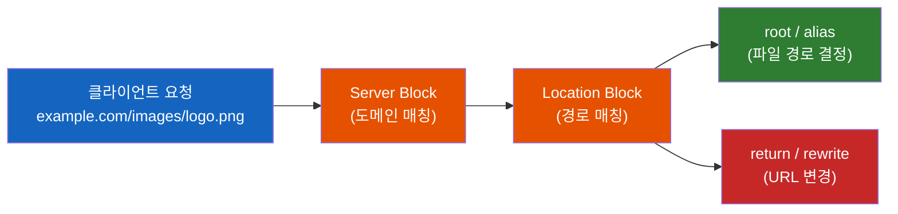
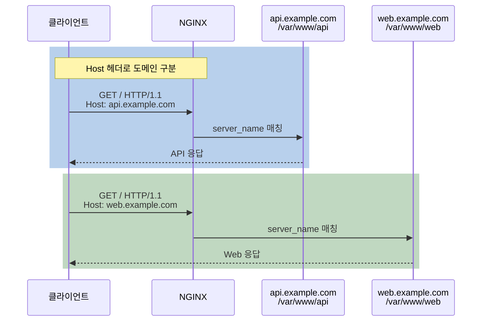

# NGINX 요청 라우팅의 모든 것 - root부터 rewrite까지

클라이언트가 `https://example.com/images/logo.png`을 요청하면, NGINX는 어떤 서버 블록에서, 어떤 디렉토리의, 어떤 파일을 찾아서 응답할까? 그리고 URL이 바뀌었을 때 어떻게 새 경로로 안내할까?

## 결론부터 말하면

NGINX의 요청 라우팅은 **3단계** 로 이루어진다. 먼저 **Server Block** 이 어떤 도메인의 요청인지 판별하고, **Location Block** 이 경로를 매칭하고, 그 안에서 **root/alias** 가 실제 파일 시스템 경로를 결정한다. URL 변경이 필요하면 **return/rewrite** 로 리다이렉트한다.



| 구성 요소 | 역할 | Spring 비유 |
|----------|------|------------|
| `server` block | 도메인별 요청 분기 | `@Profile` 또는 가상 호스트 |
| `location` block | URI 경로별 처리 | `@RequestMapping` |
| `root` | location 경로를 **붙여서** 파일 탐색 | 기본 리소스 경로 |
| `alias` | location 경로를 **교체하여** 파일 탐색 | 경로 리매핑 |
| `return` | 즉시 상태 코드 + URL 응답 (빠름) | `HttpServletResponse.sendRedirect()` |
| `rewrite` | 정규식으로 URL 변환 (유연함) | URL 필터/인터셉터 |

## 1. root vs alias — 한 글자 차이가 만드는 404

### 1.1 root: location 경로를 "붙인다"

`root`는 가장 기본적인 파일 경로 지시어다. 동작 원리는 단순하다. **root 경로 + location 경로 + 파일명** 을 합쳐서 파일을 찾는다.

```nginx
location /images/ {
    root /var/www;
}
```

클라이언트가 `/images/logo.png`을 요청하면:

$$\text{실제 경로} = \text{root} + \text{location} + \text{파일} = \texttt{/var/www} + \texttt{/images/} + \texttt{logo.png}$$

결과: `/var/www/images/logo.png`

이것은 직관적이다. **URL의 디렉토리 구조가 파일 시스템의 디렉토리 구조와 동일할 때** 완벽하게 작동한다.

### 1.2 alias: location 경로를 "교체한다"

그런데 만약 파일은 `/data/static/logo.png`에 있는데, URL은 `/images/logo.png`으로 서빙하고 싶다면? `root`로는 불가능하다. `/data/static/images/logo.png`을 찾게 되니까.

이때 `alias`를 쓴다. `alias`는 location 경로를 **그대로 버리고**, 지정한 경로로 **교체** 한다.

```nginx
location /images/ {
    alias /data/static/;
}
```

클라이언트가 `/images/logo.png`을 요청하면:

$$\text{실제 경로} = \text{alias} + \text{(URI - location)} = \texttt{/data/static/} + \texttt{logo.png}$$

결과: `/data/static/logo.png`

`/images/` 부분이 사라지고 `/data/static/`으로 교체된 것이다.

### 1.3 실수하기 쉬운 핵심 차이

같은 설정이 `root`와 `alias`에서 어떻게 다르게 동작하는지 비교하면 차이가 명확해진다.

```nginx
# root 사용
location /images/ {
    root /data;
}
# 요청: /images/logo.png → 탐색: /data/images/logo.png ✅

# alias 사용
location /images/ {
    alias /data/;
}
# 요청: /images/logo.png → 탐색: /data/logo.png ✅
```

| 요청 URI | `root /data;` 결과 | `alias /data/;` 결과 |
|----------|-------------------|---------------------|
| `/images/logo.png` | `/data/images/logo.png` | `/data/logo.png` |
| `/images/icons/home.svg` | `/data/images/icons/home.svg` | `/data/icons/home.svg` |

> **흔한 실수:** `alias`와 `location`의 끝 슬래시를 불일치시키는 것이다. **location 경로의 끝 슬래시 유무와 alias 경로의 끝 슬래시 유무를 일치시켜야 한다.** `location /images/`에 `alias /data`(슬래시 없음)로 쓰면 `/datalogo.png`을 찾게 되어 404가 발생한다.

### 1.4 언제 무엇을 쓸까?

```nginx
# ✅ root: URL 구조 = 파일 시스템 구조일 때
server {
    root /var/www/html;  # server 레벨에서 한 번 선언

    location / { }           # /var/www/html/index.html
    location /css/ { }       # /var/www/html/css/style.css
    location /js/ { }        # /var/www/html/js/app.js
}

# ✅ alias: URL 구조 ≠ 파일 시스템 구조일 때
location /downloads/ {
    alias /mnt/nfs/shared-files/;  # 완전히 다른 경로로 매핑
}
```

**원칙: `root`를 기본으로 쓰고, URL과 파일 경로가 다를 때만 `alias`를 쓴다.** `root`는 server 레벨에서 한 번 선언하면 모든 location에 상속되므로, 대부분의 경우 `root`가 더 깔끔하다.

## 2. Virtual Host — 하나의 서버에서 여러 도메인 서빙

### 2.1 왜 Virtual Host가 필요한가?

서버 한 대에 IP 주소는 하나인데, `api.example.com`과 `web.example.com` 두 도메인을 동시에 서비스해야 한다면? IP 주소만으로는 어떤 도메인의 요청인지 구분할 수 없다.

HTTP/1.1부터 요청 헤더에 `Host` 필드가 포함된다. NGINX는 이 `Host` 헤더를 읽어서 어떤 server 블록으로 보낼지 결정한다. 이것이 **Virtual Host** (NGINX에서는 **Server Block** 이라 부른다)의 원리다.



### 2.2 Server Block 설정

```nginx
# /etc/nginx/conf.d/api.conf
server {
    listen 80;
    server_name api.example.com;

    root /var/www/api;
    index index.html;

    location / {
        try_files $uri $uri/ =404;
    }
}

# /etc/nginx/conf.d/web.conf
server {
    listen 80;
    server_name web.example.com www.web.example.com;

    root /var/www/web;
    index index.html;

    location / {
        try_files $uri $uri/ =404;
    }
}
```

`server_name`에는 여러 도메인을 공백으로 구분하여 나열할 수 있다. 와일드카드(`*.example.com`)와 정규식(`~^www\.(.+)\.example\.com$`)도 지원한다.

### 2.3 server_name 매칭 우선순위

여러 server 블록이 있을 때, NGINX는 정해진 우선순위에 따라 매칭한다. 이 순서를 모르면 "왜 내 설정이 안 먹히지?" 하고 삽질하게 된다.

| 우선순위 | 매칭 방식 | 예시 |
|---------|----------|------|
| 1 (최우선) | **정확한 이름** | `server_name example.com;` |
| 2 | **앞쪽 와일드카드** | `server_name *.example.com;` |
| 3 | **뒤쪽 와일드카드** | `server_name web.*;` |
| 4 | **정규식** (선언 순서) | `server_name ~^www\.(.+)\.example\.com$;` |
| 5 (최후) | **default_server** | `listen 80 default_server;` |

```nginx
# default_server: 어떤 server_name도 매칭되지 않을 때의 기본 처리
server {
    listen 80 default_server;
    server_name _;           # 관례적으로 "_"를 사용 (의미 없는 이름)

    return 444;              # 연결 끊기 (NGINX 전용 코드)
}
```

`default_server`를 명시하지 않으면 **설정 파일에서 가장 먼저 나오는 server 블록** 이 기본 서버가 된다. 이것은 의도치 않은 동작을 유발할 수 있으므로, 명시적으로 `default_server`를 설정하는 것이 좋다.

> `return 444`는 NGINX 전용 비표준 코드로, 아무 응답 없이 즉시 연결을 끊는다. 유효하지 않은 도메인으로 들어오는 요청(봇, 스캐너 등)을 차단할 때 유용하다.

### 2.4 실무 디렉토리 구조

이전 TIL에서 배운 모듈화 패턴을 적용하면, 도메인별로 설정 파일을 분리한다.

```bash
/etc/nginx/
├── nginx.conf                    # 메인 설정 (include conf.d/*.conf)
├── conf.d/
│   ├── default.conf              # default_server 설정
│   ├── api.example.com.conf      # API 서버
│   └── web.example.com.conf      # 웹 서버
└── snippets/
    ├── ssl-params.conf           # 공통 SSL 설정
    └── security-headers.conf     # 공통 보안 헤더
```

파일명을 **도메인 이름으로 짓는 것** 이 관례다. 어떤 파일이 어떤 도메인을 담당하는지 한눈에 알 수 있기 때문이다.

## 3. Redirect와 Rewrite — URL을 바꾸는 두 가지 방법

### 3.1 왜 URL 변경이 필요한가?

실무에서 URL을 변경해야 하는 상황은 흔하다.

- HTTP → HTTPS 강제 리다이렉트
- `www.example.com` → `example.com` 통합
- 사이트 리뉴얼로 URL 구조가 변경됨 (`/blog/123` → `/posts/123`)
- 이전 API 버전의 요청을 새 버전으로 전환

NGINX에서 URL을 변경하는 방법은 두 가지다: **`return`** 과 **`rewrite`**.

### 3.2 return: 단순하고 빠른 리다이렉트

`return`은 정규식을 사용하지 않고, **즉시 상태 코드와 URL을 응답** 한다. 가장 빠르고 가장 권장되는 리다이렉트 방법이다.

```nginx
# HTTP → HTTPS 강제 리다이렉트 (가장 흔한 패턴)
server {
    listen 80;
    server_name example.com;
    return 301 https://$host$request_uri;
}

# www → non-www 통합
server {
    listen 80;
    server_name www.example.com;
    return 301 https://example.com$request_uri;
}
```

`$host`는 요청의 도메인, `$request_uri`는 쿼리 스트링을 포함한 전체 URI다. `return 301`은 **영구 리다이렉트** 로, 브라우저와 검색엔진에 "이 URL은 영구적으로 이동했다"고 알린다.

| 상태 코드 | 의미 | 용도 |
|----------|------|------|
| `301` | Moved Permanently | 영구 이동 (SEO에 영향, 브라우저가 캐싱) |
| `302` | Found (Temporary) | 임시 이동 (A/B 테스트, 점검 모드) |
| `307` | Temporary Redirect | 302와 유사하지만 HTTP 메서드 유지 |
| `308` | Permanent Redirect | 301과 유사하지만 HTTP 메서드 유지 |
| `444` | (NGINX 전용) | 응답 없이 연결 끊기 |

### 3.3 rewrite: 정규식으로 유연한 URL 변환

`rewrite`는 정규식을 사용해서 URL을 **변환** 한다. `return`으로는 불가능한 복잡한 URL 변환이 필요할 때 쓴다.

```nginx
# 구문: rewrite regex replacement [flag];

# /blog/123 → /posts/123 변환
rewrite ^/blog/(\d+)$ /posts/$1 permanent;

# /user/john/profile → /profile?username=john 변환
rewrite ^/user/(.+)/profile$ /profile?username=$1 redirect;
```

`$1`은 정규식의 첫 번째 캡처 그룹이다. Java의 `Pattern`/`Matcher`에서 `matcher.group(1)`과 같은 역할이다.

**rewrite의 flag:**

| Flag | 동작 | 상태 코드 |
|------|------|----------|
| `last` | 현재 위치에서 중단하고, 변환된 URI로 **다시 location 매칭** | (내부 전환) |
| `break` | 현재 location 안에서 변환된 URI로 처리, **재매칭 없음** | (내부 전환) |
| `redirect` | 클라이언트에게 **임시 리다이렉트** 응답 | 302 |
| `permanent` | 클라이언트에게 **영구 리다이렉트** 응답 | 301 |

### 3.4 return vs rewrite — 언제 무엇을 쓸까?

**원칙: `return`을 쓸 수 있으면 `return`을 쓰라.** `return`이 `rewrite`보다 빠른 이유는, `return`은 정규식 엔진을 거치지 않고 즉시 응답을 반환하기 때문이다.

```nginx
# ✅ return이 적합한 경우: 단순 리다이렉트
server {
    listen 80;
    return 301 https://$host$request_uri;  # 빠르고 명확
}

# ✅ rewrite가 필요한 경우: URL 패턴 변환
location /old-api/ {
    rewrite ^/old-api/v1/users/(\d+)$ /api/v2/users/$1 permanent;
    # 경로 일부를 캡처하여 새 URL에 삽입해야 함
}
```

| 상황 | 권장 | 이유 |
|------|------|------|
| HTTP → HTTPS | `return` | URL 구조 변경 없음, 단순 프로토콜 변경 |
| www → non-www | `return` | 도메인만 변경 |
| `/old-path` → `/new-path` | `return` | 고정된 경로 변경 |
| `/blog/{id}` → `/posts/{id}` | `rewrite` | 동적 값 캡처 필요 |
| URL 일부를 쿼리 스트링으로 변환 | `rewrite` | 구조적 URL 변환 |

> **성능 팁:** `rewrite`를 server 레벨에 두면 모든 요청에 대해 정규식이 실행된다. 가능하면 `location` 안에 두어 매칭 범위를 좁히는 것이 좋다.

## 4. 정리

### 핵심 포인트

1. **`root`는 경로를 "붙이고", `alias`는 경로를 "교체한다"**
   - URL 구조와 파일 시스템이 같으면 `root` (기본), 다르면 `alias`
   - `alias`는 반드시 끝에 슬래시(`/`)를 붙여야 한다

2. **Server Block은 `Host` 헤더로 도메인을 구분한다**
   - 매칭 우선순위: 정확한 이름 > 와일드카드 > 정규식 > default_server
   - `default_server`를 명시하지 않으면 첫 번째 server 블록이 기본이 된다

3. **단순 리다이렉트는 `return`, 복잡한 URL 변환은 `rewrite`**
   - `return`은 정규식 없이 즉시 응답하므로 더 빠르다
   - `rewrite`는 301/302만 반환 가능, `return`은 모든 상태 코드 사용 가능
   - `return`을 쓸 수 있는 상황이면 항상 `return`을 쓰라

---

## 출처

- [NGINX Documentation - ngx_http_core_module (root, alias)](https://nginx.org/en/docs/http/ngx_http_core_module.html) - 공식 문서
- [NGINX Documentation - Server names](https://nginx.org/en/docs/http/server_names.html) - server_name 매칭 규칙 공식 문서
- [NGINX Documentation - ngx_http_rewrite_module](https://nginx.org/en/docs/http/ngx_http_rewrite_module.html) - rewrite, return 공식 문서
- [NGINX Rewrite Rules: Complete URL Rewriting Guide](https://www.getpagespeed.com/server-setup/nginx/nginx-rewrite-rules) - rewrite vs return 비교
