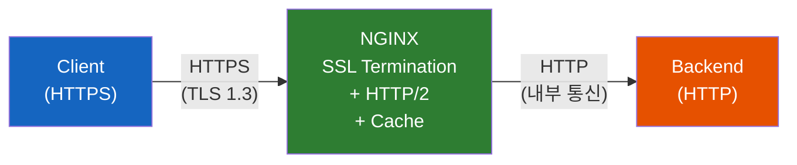
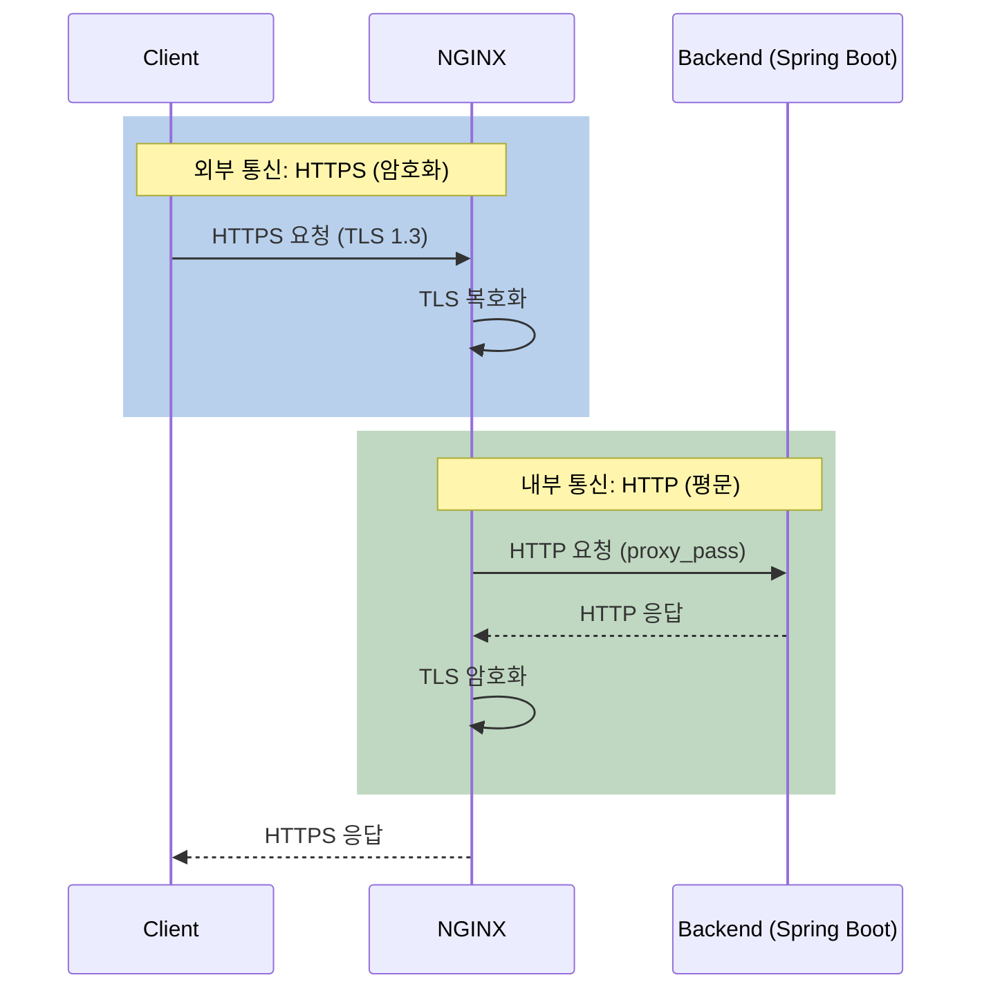

# NGINX 프로덕션 배포 - HTTPS와 HTTP/2, 그리고 캐싱

개발 환경에서는 HTTP로 충분하다. 하지만 프로덕션에 올리는 순간, HTTPS 없이는 브라우저가 경고를 띄우고, HTTP/2 없이는 성능의 절반을 버리게 된다. 그리고 캐싱 없이는 백엔드가 모든 요청을 직접 처리해야 한다.

## 결론부터 말하면

프로덕션 NGINX는 **SSL/TLS 터미네이션** 으로 HTTPS를 처리하고, **HTTP/2** 로 멀티플렉싱 성능을 확보하며, **프록시 캐싱과 버퍼링** 으로 백엔드 부하를 줄인다. 이 세 가지가 "개발 환경 NGINX"와 "프로덕션 NGINX"를 구분짓는 핵심이다.



| 기능 | 역할 | 효과 |
|------|------|------|
| SSL Termination | NGINX에서 TLS 처리, 백엔드는 HTTP | 백엔드 CPU 부담 제거 |
| HTTP/2 | 멀티플렉싱, 헤더 압축 | 동시 요청 처리 성능 향상 |
| 프록시 캐싱 | 자주 요청되는 응답을 NGINX가 캐싱 | 백엔드 호출 횟수 감소 |
| 버퍼링 | 느린 클라이언트로부터 백엔드 보호 | 백엔드 응답 시간 단축 |

## 1. HTTPS/SSL 설정 — SSL Termination

### 1.1 왜 NGINX에서 SSL을 처리하는가?

SSL/TLS 암호화/복호화는 CPU 집약적 작업이다. 만약 백엔드 서버(Spring Boot, Express 등)가 직접 SSL을 처리하면, 요청 처리와 암호화를 모두 담당해야 해서 성능이 떨어진다.

**SSL Termination** 은 NGINX가 TLS를 처리하고, 백엔드와는 **평문 HTTP** 로 통신하는 패턴이다. NGINX는 TLS 처리에 최적화되어 있고, 백엔드는 비즈니스 로직에만 집중할 수 있다.



### 1.2 SSL 기본 설정

```nginx
server {
    listen 443 ssl;
    server_name example.com;

    # 인증서 경로
    ssl_certificate /etc/letsencrypt/live/example.com/fullchain.pem;
    ssl_certificate_key /etc/letsencrypt/live/example.com/privkey.pem;

    # TLS 프로토콜 (1.2 + 1.3만 허용)
    ssl_protocols TLSv1.2 TLSv1.3;

    location / {
        proxy_pass http://localhost:8080;
        include /etc/nginx/snippets/proxy-params.conf;
    }
}

# HTTP → HTTPS 강제 리다이렉트
server {
    listen 80;
    server_name example.com;
    return 301 https://$host$request_uri;
}
```

`ssl_protocols TLSv1.2 TLSv1.3`은 2026년 기준 표준이다. TLS 1.0과 1.1은 보안 취약점이 있어 주요 브라우저에서 이미 지원을 중단했다.

### 1.3 SSL 성능 최적화

TLS Handshake는 비용이 크다. 매 연결마다 Handshake를 반복하면 성능이 떨어지므로, **세션 캐싱** 과 **OCSP Stapling** 으로 최적화한다.

```nginx
# /etc/nginx/snippets/ssl-params.conf
ssl_protocols TLSv1.2 TLSv1.3;

# 세션 캐싱 — Handshake 결과를 재사용
ssl_session_cache shared:SSL:10m;   # 10MB 공유 캐시 (약 4만 세션)
ssl_session_timeout 1d;              # 세션 유효 시간 24시간
ssl_session_tickets off;             # 별도 ticket key rotation 없이 켜두면 PFS가 깨질 수 있어 비활성화

# OCSP Stapling — 인증서 검증 속도 향상
ssl_stapling on;
ssl_stapling_verify on;
resolver 8.8.8.8 8.8.4.4 valid=300s;

# 보안 헤더
add_header Strict-Transport-Security "max-age=31536000; includeSubDomains" always;
```

**SSL Session Cache** 는 TLS Handshake 결과를 메모리에 캐싱하여, 같은 클라이언트가 재방문할 때 **Full Handshake 없이 빠르게 연결** 할 수 있게 한다. `shared:SSL:10m`은 모든 Worker 프로세스가 공유하는 10MB 캐시를 만든다.

**OCSP Stapling** 은 인증서 유효성 검증을 NGINX가 미리 해두는 기능이다. 이것 없이는 클라이언트가 직접 CA(인증 기관)에 문의해야 해서 연결 시간이 늘어난다.

**HSTS(Strict-Transport-Security)** 는 브라우저에게 "앞으로 이 사이트는 무조건 HTTPS로 접속하라"고 알려준다. 첫 방문 이후에는 HTTP → HTTPS 리다이렉트조차 발생하지 않아 보안과 성능이 모두 향상된다.

## 2. HTTP/2 — 멀티플렉싱의 힘

### 2.1 왜 HTTP/2인가?

HTTP/1.1은 하나의 TCP 커넥션에서 **한 번에 하나의 요청** 만 처리할 수 있다. 웹 페이지를 로딩하면 CSS, JS, 이미지 등 수십 개의 리소스를 가져와야 하는데, HTTP/1.1에서는 여러 TCP 커넥션을 병렬로 열어야 한다 (브라우저는 보통 도메인당 6개로 제한).

HTTP/2는 하나의 TCP 커넥션에서 **여러 요청/응답을 동시에 처리(Multiplexing)** 할 수 있다. 커넥션을 하나만 유지하면서도 수십 개의 리소스를 병렬로 가져온다.

| 기능 | HTTP/1.1 | HTTP/2 |
|------|---------|--------|
| 요청 처리 | 1커넥션 = 1요청 | 1커넥션 = 다수 요청 (멀티플렉싱) |
| 헤더 | 텍스트 (매번 전체 전송) | HPACK 압축 (중복 제거) |
| 서버 푸시 | 불가 | 사양상 가능하지만 **Chrome 106(2022.9)·Firefox 등 주요 브라우저에서 지원 중단** — 사실상 사용 불가 |
| 필수 조건 | 없음 | **TLS 필수** (사실상) |

### 2.2 HTTP/2 설정

NGINX 1.25.1부터 HTTP/2 설정 문법이 변경되었다. 이전 방식은 deprecated되었으므로 주의해야 한다.

```nginx
# ❌ 구버전 (1.25.1 이전) — deprecated
server {
    listen 443 ssl http2;  # listen에 http2 포함
}

# ✅ 현재 (1.25.1 이후) — http2를 별도 지시어로 분리
server {
    listen 443 ssl;
    http2 on;              # 별도 지시어로 HTTP/2 활성화

    server_name example.com;
    ssl_certificate /etc/letsencrypt/live/example.com/fullchain.pem;
    ssl_certificate_key /etc/letsencrypt/live/example.com/privkey.pem;

    include /etc/nginx/snippets/ssl-params.conf;

    location / {
        proxy_pass http://localhost:8080;
        include /etc/nginx/snippets/proxy-params.conf;
    }
}
```

`http2 on;`으로 분리된 이유는, HTTP/2 활성화를 `listen` 옵션이 아닌 **`http`·`server` 컨텍스트의 독립 지시어**로 옮겨 listen 디렉티브를 단순화하기 위해서다(공식 문서: `ngx_http_v2_module`의 `http2` directive). 같은 포트에서 HTTP/1.1과 HTTP/2는 여전히 ALPN을 통해 동시에 처리된다.

## 3. 프록시 버퍼링과 캐싱

### 3.1 버퍼링 — 느린 클라이언트로부터 백엔드 보호

NGINX의 **프록시 버퍼링** 은 백엔드의 응답을 NGINX가 먼저 받아 메모리에 저장한 후, 클라이언트에게 천천히 전달하는 기능이다.

왜 이것이 중요한가? 모바일 네트워크처럼 느린 클라이언트가 응답을 천천히 받으면, **백엔드 프로세스가 그 시간 동안 점유** 된다. 버퍼링을 켜면 백엔드는 응답을 NGINX에 빠르게 전달하고 즉시 해방되어, 다음 요청을 처리할 수 있다.

```nginx
location / {
    proxy_buffering on;           # 기본값이 on
    proxy_buffer_size 4k;         # 응답 헤더용 버퍼
    proxy_buffers 8 32k;          # 응답 본문용 버퍼 (8개 × 32KB)
    proxy_busy_buffers_size 64k;  # 클라이언트 전송 중 사용할 버퍼
}
```

> **주의:** SSE(Server-Sent Events)나 스트리밍 응답에서는 `proxy_buffering off;`로 설정해야 한다. 버퍼링이 켜져 있으면 NGINX가 응답 전체를 모을 때까지 기다려서, 실시간 이벤트가 지연된다.

```nginx
# SSE 엔드포인트 — 버퍼링 비활성화
location /events {
    proxy_pass http://localhost:8080;
    proxy_buffering off;     # 스트리밍 응답을 즉시 전달
    proxy_cache off;
    proxy_read_timeout 86400s;
}
```

### 3.2 캐싱 — 백엔드를 호출하지 않고 응답

NGINX는 백엔드 응답을 디스크에 캐싱하여, 동일한 요청이 다시 들어오면 **백엔드에 요청하지 않고** NGINX가 직접 응답할 수 있다.

```nginx
# http 블록에서 캐시 경로 정의
http {
    proxy_cache_path /var/cache/nginx
        levels=1:2
        keys_zone=app_cache:10m    # 10MB 메모리로 키 관리
        max_size=1g                 # 디스크 최대 1GB
        inactive=60m                # 60분 미사용 시 삭제
        use_temp_path=off;
}
```

```nginx
# 정적 리소스 캐싱
location ~* \.(css|js|png|jpg|jpeg|gif|ico|svg|woff2)$ {
    proxy_cache app_cache;
    proxy_cache_valid 200 7d;      # 200 응답은 7일간 캐싱
    proxy_cache_use_stale error timeout updating;  # 오류 시 오래된 캐시 사용

    add_header X-Cache-Status $upstream_cache_status;  # 디버깅용
    proxy_pass http://localhost:8080;
}

# API 응답 단기 캐싱
location /api/ {
    proxy_cache app_cache;
    proxy_cache_valid 200 30s;     # API는 30초만 캐싱
    proxy_cache_methods GET HEAD;   # GET, HEAD만 캐싱

    proxy_pass http://localhost:8080;
}
```

`X-Cache-Status` 헤더를 추가하면 응답이 캐시에서 왔는지 확인할 수 있다.

| X-Cache-Status | 의미 |
|----------------|------|
| `HIT` | 캐시에서 응답 (백엔드 호출 없음) |
| `MISS` | 캐시에 없어서 백엔드 호출 |
| `EXPIRED` | 캐시가 만료되어 백엔드 재요청 |
| `STALE` | 만료된 캐시를 사용 (백엔드 오류 시) |
| `BYPASS` | 캐시를 건너뛰고 백엔드 직접 호출 |

## 4. 종합 — 프로덕션 설정 템플릿

지금까지 다룬 HTTPS, HTTP/2, 버퍼링, 캐싱을 모두 합친 프로덕션 설정이다.

```nginx
# /etc/nginx/conf.d/production.conf
server {
    listen 443 ssl;
    http2 on;
    server_name example.com;

    # SSL
    ssl_certificate /etc/letsencrypt/live/example.com/fullchain.pem;
    ssl_certificate_key /etc/letsencrypt/live/example.com/privkey.pem;
    include /etc/nginx/snippets/ssl-params.conf;

    # 정적 파일 (캐싱 + 장기 브라우저 캐시)
    location ~* \.(css|js|png|jpg|jpeg|gif|ico|svg|woff2)$ {
        proxy_cache app_cache;
        proxy_cache_valid 200 7d;
        expires 30d;
        add_header Cache-Control "public, immutable";
        add_header X-Cache-Status $upstream_cache_status;
        proxy_pass http://localhost:8080;
    }

    # API
    location /api/ {
        proxy_pass http://localhost:8080;
        include /etc/nginx/snippets/proxy-params.conf;
    }

    # SSE (버퍼링 끄기)
    location /events {
        proxy_pass http://localhost:8080;
        proxy_buffering off;
        proxy_cache off;
        proxy_http_version 1.1;
        proxy_set_header Connection "";
        proxy_read_timeout 86400s;
    }

    # WebSocket
    location /ws {
        proxy_pass http://localhost:8080;
        proxy_http_version 1.1;
        proxy_set_header Upgrade $http_upgrade;
        proxy_set_header Connection "upgrade";
        proxy_buffering off;
        proxy_read_timeout 86400s;
    }
}

# HTTP → HTTPS 리다이렉트
server {
    listen 80;
    server_name example.com;
    return 301 https://$host$request_uri;
}
```

## 5. 정리

### 핵심 포인트

1. **SSL Termination으로 백엔드 부담을 제거하라**
   - NGINX에서 TLS 처리, 백엔드는 HTTP로 통신
   - `ssl_session_cache`와 OCSP Stapling으로 TLS Handshake 성능 최적화
   - HSTS 헤더로 HTTPS 강제

2. **HTTP/2는 `http2 on;`으로 활성화한다 (1.25.1+)**
   - 구문법 `listen 443 ssl http2;`는 deprecated
   - 멀티플렉싱으로 하나의 커넥션에서 다수 요청 동시 처리
   - TLS가 사실상 필수 (브라우저가 TLS 없는 HTTP/2 미지원)

3. **버퍼링은 기본 ON, 스트리밍은 OFF**
   - 일반 요청: `proxy_buffering on` — 느린 클라이언트로부터 백엔드 보호
   - SSE/스트리밍: `proxy_buffering off` — 실시간 데이터 즉시 전달

4. **캐싱으로 백엔드 호출을 줄여라**
   - 정적 리소스: 장기 캐싱 (7일+)
   - API 응답: 단기 캐싱 (30초~5분)
   - `X-Cache-Status` 헤더로 캐시 동작 확인

---

## 출처

- [NGINX Documentation - ngx_http_ssl_module](https://nginx.org/en/docs/http/ngx_http_ssl_module.html) - SSL 설정 공식 문서
- [NGINX Documentation - ngx_http_v2_module](https://nginx.org/en/docs/http/ngx_http_v2_module.html) - HTTP/2 설정 공식 문서
- [NGINX Documentation - ngx_http_proxy_module](https://nginx.org/en/docs/http/ngx_http_proxy_module.html) - 프록시 버퍼링/캐싱 공식 문서
- [NGINX TLS 1.3 Hardening: A+ SSL Configuration Guide](https://www.getpagespeed.com/server-setup/nginx/nginx-tls-1-3-hardening) - SSL 하드닝 가이드
- [Mozilla SSL Configuration Generator](https://ssl-config.mozilla.org/) - SSL 설정 생성기
