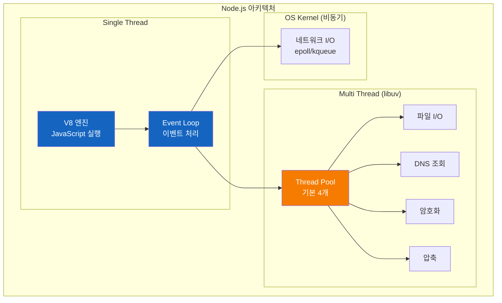
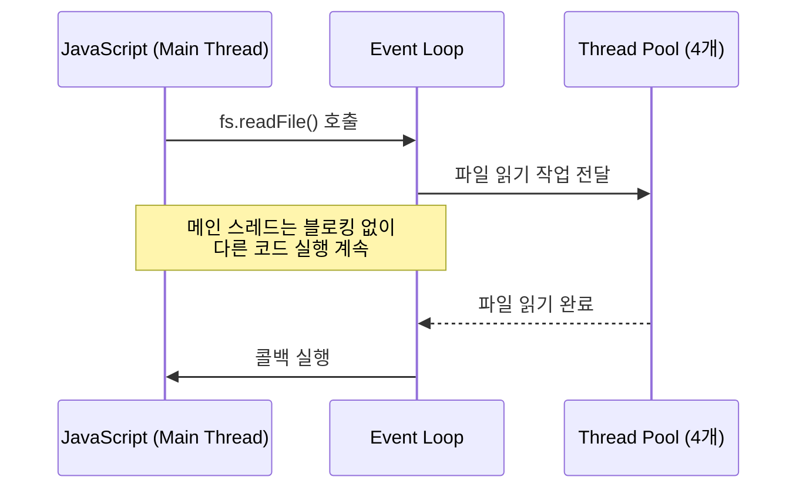

# Node.js가 싱글스레드라는 미신

"Node.js는 싱글스레드라서 CPU 집약적 작업에 약하다" - 이 말을 몇 번이나 들어봤을까?

## 결론부터 말하면

**Node.js는 싱글스레드가 아니다.** "JavaScript 실행"만 단일 스레드일 뿐, 내부적으로는 멀티스레드를 적극 활용한다.



| 구분 | 스레드 | 처리 방식 |
|------|--------|----------|
| JavaScript 코드 실행 | **단일** | V8 엔진 |
| Event Loop | **단일** | libuv |
| 파일 I/O | **멀티** | libuv Thread Pool |
| DNS 조회 | **멀티** | libuv Thread Pool |
| 암호화/압축 | **멀티** | libuv Thread Pool |
| 네트워크 I/O | **OS 커널** | epoll/kqueue 비동기 |

---

## 1. 왜 "싱글스레드"라는 오해가 생겼을까?

### 1.1 개발자가 보는 세계

Node.js로 코드를 작성할 때, 우리는 멀티스레드를 전혀 의식하지 않는다. `new Thread()`도 없고, `synchronized`도 없다. 그냥 JavaScript를 쓸 뿐이다.

```javascript
// 이 코드는 어떻게 실행될까?
console.log('1');
console.log('2');
console.log('3');
```

당연히 1, 2, 3 순서대로 출력된다. 단일 스레드에서 순차 실행되기 때문이다. 비동기 코드도 마찬가지다.

```javascript
setTimeout(() => {
    console.log('콜백 실행');
}, 1000);

console.log('다음 코드');
```

"다음 코드"가 먼저 출력되고, 1초 후에 "콜백 실행"이 출력된다. 하지만 **콜백을 실행하는 것도 같은 단일 스레드**다.

이렇게 개발자 입장에서는 모든 것이 단일 스레드로 보인다. 그래서 "Node.js는 싱글스레드"라고 생각하기 쉽다.

### 1.2 그런데 이상한 점이 있다

만약 정말 싱글스레드라면, 이 코드는 어떻게 동작해야 할까?

```javascript
const fs = require('fs');

// 파일 4개를 "동시에" 읽는다
const start = Date.now();

fs.readFile('file1.txt', () => console.log('file1:', Date.now() - start, 'ms'));
fs.readFile('file2.txt', () => console.log('file2:', Date.now() - start, 'ms'));
fs.readFile('file3.txt', () => console.log('file3:', Date.now() - start, 'ms'));
fs.readFile('file4.txt', () => console.log('file4:', Date.now() - start, 'ms'));
```

싱글스레드라면 순차적으로 읽어야 한다. file1을 다 읽고, file2를 읽고... 각 파일이 10ms 걸린다면 총 40ms가 걸려야 정상이다.

**하지만 실제 출력은?**

```
file1: 12ms
file2: 13ms
file3: 11ms
file4: 14ms
```

거의 동시에 완료된다! 어떻게 싱글스레드에서 이게 가능할까?

### 1.3 더 극적인 예시

암호화는 CPU를 많이 쓰는 작업이다. 이것도 테스트해보자.

```javascript
const crypto = require('crypto');

const start = Date.now();

// PBKDF2 암호화 4개를 동시에 실행
crypto.pbkdf2('password', 'salt', 100000, 512, 'sha512', () => {
    console.log('1:', Date.now() - start, 'ms');
});
crypto.pbkdf2('password', 'salt', 100000, 512, 'sha512', () => {
    console.log('2:', Date.now() - start, 'ms');
});
crypto.pbkdf2('password', 'salt', 100000, 512, 'sha512', () => {
    console.log('3:', Date.now() - start, 'ms'));
});
crypto.pbkdf2('password', 'salt', 100000, 512, 'sha512', () => {
    console.log('4:', Date.now() - start, 'ms');
});
```

각 암호화가 1초 걸린다고 가정하자. 싱글스레드라면 4초가 걸려야 한다.

**실제 출력 (4코어 기준):**

```
1: 980ms
2: 985ms
3: 990ms
4: 995ms
```

4개가 거의 동시에 완료됐다. **1초 만에!** 싱글스레드로는 절대 불가능한 결과다.

---

## 2. 비밀은 libuv에 있다

### 2.1 Node.js의 진짜 구조

Node.js는 혼자 일하지 않는다. 뒤에서 **libuv**라는 강력한 조력자가 있다.


**libuv**는 Node.js의 비동기 I/O를 담당하는 C 라이브러리다. Ryan Dahl이 Node.js를 만들 때 직접 개발했다. 왜 필요했을까?

JavaScript 자체에는 파일을 읽거나, 네트워크 통신을 하는 기능이 없다. 브라우저에서는 브라우저가 이런 기능을 제공하지만, 서버에서는? Node.js가 직접 제공해야 한다. 그 역할을 libuv가 한다.

### 2.2 libuv의 Thread Pool

libuv의 핵심은 **Thread Pool**이다. 기본적으로 **4개의 스레드**를 미리 만들어두고, 무거운 작업을 이 스레드들에게 분배한다.



이제 아까의 파일 읽기 예시가 이해된다:

```javascript
fs.readFile('file1.txt', callback);  // → Thread 1에 할당
fs.readFile('file2.txt', callback);  // → Thread 2에 할당
fs.readFile('file3.txt', callback);  // → Thread 3에 할당
fs.readFile('file4.txt', callback);  // → Thread 4에 할당

// 4개의 스레드가 동시에 파일을 읽는다!
// 그래서 거의 동시에 완료되는 것
```

### 2.3 Thread Pool을 사용하는 작업들

모든 작업이 Thread Pool을 사용하는 것은 아니다. 특정 작업들만 사용한다.

| 작업 | Thread Pool 사용 | 이유 |
|------|-----------------|------|
| 파일 I/O | ✅ | OS마다 비동기 파일 I/O 지원이 제각각 |
| DNS lookup | ✅ | `getaddrinfo()`가 블로킹 함수 |
| 암호화 (crypto) | ✅ | CPU 집약적 작업 |
| 압축 (zlib) | ✅ | CPU 집약적 작업 |
| 네트워크 I/O | ❌ | OS 커널이 비동기로 처리 |
| 타이머 | ❌ | Event Loop가 직접 처리 |

왜 이렇게 나뉠까? 다음 섹션에서 설명한다.

---

## 3. 네트워크 I/O가 특별한 이유

### 3.1 파일 vs 네트워크

파일 I/O와 네트워크 I/O는 둘 다 "I/O"지만, OS 입장에서는 완전히 다르다.

**파일 I/O의 문제:**

```c
// 리눅스에서 파일 읽기 (C 코드)
int fd = open("file.txt", O_RDONLY);
char buffer[1024];
read(fd, buffer, 1024);  // 이 순간 블로킹!
```

파일 시스템은 디스크에 접근해야 한다. 리눅스의 `read()` 함수는 디스크에서 데이터를 읽어올 때까지 **블로킹**된다. 비동기 파일 I/O(`aio_read`)도 있지만, OS마다 지원이 다르고 복잡하다.

그래서 libuv는 간단한 전략을 택했다: **Thread Pool에서 블로킹 I/O를 실행하자.** 메인 스레드가 블로킹되지 않으면 된다.

**네트워크 I/O는 다르다:**

```c
// 리눅스에서 네트워크 I/O
int epfd = epoll_create1(0);
epoll_ctl(epfd, EPOLL_CTL_ADD, socket_fd, &event);
epoll_wait(epfd, events, MAX_EVENTS, -1);  // 이벤트 기반!
```

네트워크 I/O는 OS 커널이 **비동기 API**를 제공한다. 리눅스는 `epoll`, macOS는 `kqueue`, Windows는 `IOCP`. 이 API들은 "데이터가 도착하면 알려줘"라고 등록만 해두면, 커널이 알아서 알려준다.

Thread Pool이 필요 없다. OS가 이미 비동기로 처리해주니까.

### 3.2 왜 이게 중요할까?

Thread Pool은 기본 4개다. 만약 네트워크 I/O도 Thread Pool을 사용했다면?

```javascript
// 10,000개의 동시 HTTP 요청
for (let i = 0; i < 10000; i++) {
    fetch(`https://api.example.com/${i}`);
}
```

Thread 4개로 10,000개 요청을 처리해야 한다. 한 번에 4개씩밖에 못 한다. 끔찍하게 느릴 것이다.

하지만 실제로는? OS 커널의 `epoll`이 10,000개 소켓을 동시에 감시한다. Thread Pool 개수와 무관하게 **수만 개의 동시 연결**을 처리할 수 있다.

이것이 Node.js가 I/O 집약적 작업에 강한 이유다.

---

## 4. Thread Pool 크기의 함정

### 4.1 기본 4개의 한계

아까 파일 4개를 동시에 읽는 예시를 다시 보자. 그런데 파일이 5개라면?

```javascript
const start = Date.now();

fs.readFile('file1.txt', () => console.log('1:', Date.now() - start));
fs.readFile('file2.txt', () => console.log('2:', Date.now() - start));
fs.readFile('file3.txt', () => console.log('3:', Date.now() - start));
fs.readFile('file4.txt', () => console.log('4:', Date.now() - start));
fs.readFile('file5.txt', () => console.log('5:', Date.now() - start));  // 5번째!
```

**출력:**

```
1: 12ms
2: 11ms
3: 13ms
4: 12ms
5: 24ms  ← 왜 두 배나 걸릴까?
```

Thread Pool이 4개뿐이기 때문이다. file5는 다른 작업이 끝날 때까지 **대기**해야 한다.

### 4.2 Thread Pool Starvation

더 심각한 상황을 상상해보자. 암호화 작업 4개가 Thread Pool을 모두 점유하고 있다면?

```javascript
// 암호화 4개가 Thread Pool을 점유 (각 1초 소요)
crypto.pbkdf2('pw', 'salt', 100000, 512, 'sha512', callback);
crypto.pbkdf2('pw', 'salt', 100000, 512, 'sha512', callback);
crypto.pbkdf2('pw', 'salt', 100000, 512, 'sha512', callback);
crypto.pbkdf2('pw', 'salt', 100000, 512, 'sha512', callback);

// 이 파일 읽기는 언제 실행될까?
fs.readFile('important.txt', callback);  // 1초 후에야 시작됨!
```

단순한 파일 읽기조차 1초를 기다려야 한다. 모든 Thread가 암호화에 묶여있기 때문이다.

이것을 **Thread Pool Starvation**(스레드 풀 고갈)이라고 한다. 실제 서비스에서 이런 상황이 발생하면 응답 지연이 급격히 증가한다.

### 4.3 해결책: Thread Pool 크기 조절

```bash
# Thread Pool 크기를 16개로 늘리기
UV_THREADPOOL_SIZE=16 node app.js
```

```javascript
// 또는 코드에서 (반드시 최상단에!)
process.env.UV_THREADPOOL_SIZE = 16;
```

| 설정 | 최소 | 기본 | 최대 |
|------|------|------|------|
| UV_THREADPOOL_SIZE | 1 | 4 | 1024 |

**언제 늘려야 할까?**
- 파일 I/O가 많은 서비스
- DNS 조회가 많은 서비스
- 암호화/압축 작업이 많은 서비스

**주의:** 무작정 늘리면 메모리 사용량이 증가하고, 컨텍스트 스위칭 오버헤드가 생긴다. 적절한 값을 찾아야 한다.

---

## 5. JavaScript 레벨에서의 멀티스레드

지금까지는 libuv의 Thread Pool 이야기였다. 개발자가 직접 제어할 수 없는 영역이다.

하지만 Node.js 10.5부터 **Worker Threads**가 도입되면서, JavaScript 코드도 별도 스레드에서 실행할 수 있게 되었다.

### 5.1 왜 Worker Threads가 필요할까?

CPU 집약적인 작업을 메인 스레드에서 하면 어떻게 될까?

```javascript
const express = require('express');
const app = express();

app.get('/heavy', (req, res) => {
    // 피보나치 계산 (CPU 집약적)
    const result = fibonacci(45);  // 수 초 소요
    res.json({ result });
});

app.get('/light', (req, res) => {
    res.json({ message: 'Hello' });
});

app.listen(3000);
```

누군가 `/heavy`를 호출하면? 피보나치 계산이 끝날 때까지 **모든 요청이 블로킹**된다. `/light`를 호출한 사용자도 수 초를 기다려야 한다.

Event Loop가 단일 스레드이기 때문이다. CPU를 오래 점유하는 작업이 있으면 다른 모든 것이 멈춘다.

### 5.2 Worker Threads로 해결

```javascript
// main.js
const { Worker } = require('worker_threads');
const express = require('express');
const app = express();

app.get('/heavy', (req, res) => {
    // 별도 스레드에서 실행
    const worker = new Worker('./fibonacci-worker.js', {
        workerData: { n: 45 }
    });

    worker.on('message', (result) => {
        res.json({ result });
    });

    worker.on('error', (err) => {
        res.status(500).json({ error: err.message });
    });
});

app.get('/light', (req, res) => {
    res.json({ message: 'Hello' });  // 즉시 응답 가능!
});

app.listen(3000);
```

```javascript
// fibonacci-worker.js
const { parentPort, workerData } = require('worker_threads');

function fibonacci(n) {
    if (n <= 1) return n;
    return fibonacci(n - 1) + fibonacci(n - 2);
}

const result = fibonacci(workerData.n);
parentPort.postMessage(result);
```

이제 `/heavy`가 실행 중이어도 `/light`는 즉시 응답한다. CPU 집약적 작업이 별도 스레드에서 실행되기 때문이다.

### 5.3 Worker Threads vs Child Process vs Cluster

Node.js에서 병렬 처리를 위한 세 가지 옵션이 있다. 언제 뭘 써야 할까?

| 방식 | 단위 | 메모리 | 통신 속도 | 용도 |
|------|------|--------|----------|------|
| **Worker Threads** | 스레드 | 공유 가능 | 빠름 | CPU 집약적 작업 분산 |
| **Child Process** | 프로세스 | 격리 | 느림 (IPC) | 외부 프로그램 실행 |
| **Cluster** | 프로세스 | 격리 | 느림 (IPC) | 서버 수평 확장 |

**Worker Threads**는 메모리를 공유할 수 있어서 데이터 전달이 빠르다. CPU 집약적 작업에 적합하다.

**Cluster**는 여러 Node.js 프로세스를 띄워서 멀티코어를 활용한다. 웹 서버 확장에 적합하다.

```javascript
// Cluster 예시: 4코어 활용
const cluster = require('cluster');
const http = require('http');
const numCPUs = require('os').cpus().length;

if (cluster.isMaster) {
    // 마스터: 워커 생성
    for (let i = 0; i < numCPUs; i++) {
        cluster.fork();
    }
} else {
    // 워커: HTTP 서버 실행
    http.createServer((req, res) => {
        res.end('Hello from worker ' + process.pid);
    }).listen(8000);
}
```

---

## 6. 정리: Node.js의 진짜 모습

### 6.1 전체 그림

```
┌─────────────────────────────────────────────────────────────┐
│                     Node.js Process                          │
├─────────────────────────────────────────────────────────────┤
│                                                              │
│  ┌─────────────────────────────────────────────────────┐    │
│  │  Main Thread                                         │    │
│  │  ├─ V8 Engine: JavaScript 실행                       │    │
│  │  └─ Event Loop: 이벤트 처리, 콜백 디스패치           │    │
│  └─────────────────────────────────────────────────────┘    │
│                           │                                  │
│                           ▼                                  │
│  ┌─────────────────────────────────────────────────────┐    │
│  │  libuv Thread Pool (기본 4개)                        │    │
│  │  ├─ 파일 I/O                                         │    │
│  │  ├─ DNS lookup                                       │    │
│  │  ├─ crypto (암호화)                                  │    │
│  │  └─ zlib (압축)                                      │    │
│  └─────────────────────────────────────────────────────┘    │
│                           │                                  │
│                           ▼                                  │
│  ┌─────────────────────────────────────────────────────┐    │
│  │  OS Kernel                                           │    │
│  │  └─ 네트워크 I/O (epoll/kqueue/IOCP)                 │    │
│  └─────────────────────────────────────────────────────┘    │
│                                                              │
│  ┌─────────────────────────────────────────────────────┐    │
│  │  Worker Threads (개발자가 생성)                       │    │
│  │  └─ CPU 집약적 JavaScript 코드 실행                  │    │
│  └─────────────────────────────────────────────────────┘    │
│                                                              │
└─────────────────────────────────────────────────────────────┘
```

### 6.2 핵심 요약

1. **"싱글스레드"는 JavaScript 실행에만 해당**
   - Event Loop와 V8은 단일 스레드
   - 하지만 I/O는 libuv Thread Pool이 병렬 처리

2. **libuv Thread Pool의 역할**
   - 파일 I/O, DNS, 암호화, 압축 담당
   - 기본 4개, 필요시 `UV_THREADPOOL_SIZE`로 조절

3. **네트워크 I/O는 OS 커널이 처리**
   - Thread Pool과 무관하게 수만 개 동시 연결 가능
   - 이것이 Node.js가 I/O에 강한 이유

4. **CPU 집약적 작업은 별도 처리 필요**
   - Worker Threads로 메인 스레드 블로킹 방지
   - Cluster로 멀티코어 활용

### 6.3 면접에서 이렇게 대답하자

> "Node.js가 싱글스레드라는 말은 반만 맞습니다. **JavaScript 실행과 Event Loop**는 단일 스레드지만, **I/O 작업은 libuv의 Thread Pool**이 병렬로 처리합니다. 네트워크 I/O는 OS 커널의 비동기 API를 사용하고요. 그래서 Node.js는 I/O 집약적 작업에 강합니다. CPU 집약적 작업이 필요하면 Worker Threads를 사용하면 됩니다."

---

## 출처

- [Node.js가 싱글스레드 서버라는 미신 - Naver Financial](https://medium.com/naverfinancial/node-js가-싱글스레드-서버라는-미신-feat-node-js의-대용량-데이터-처리-cf1d651290be)
- [libuv Design Overview](https://docs.libuv.org/en/v1.x/design.html) - libuv 공식 문서
- [Node.js Worker Threads](https://nodejs.org/api/worker_threads.html) - 공식 문서
- [Don't Block the Event Loop](https://nodejs.org/en/docs/guides/dont-block-the-event-loop) - Node.js 공식 가이드
