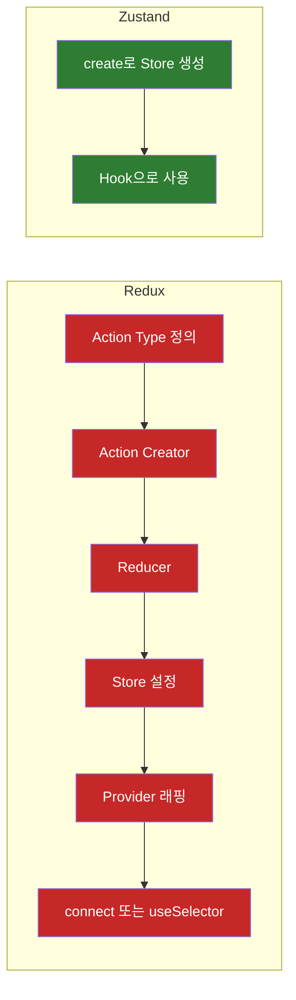
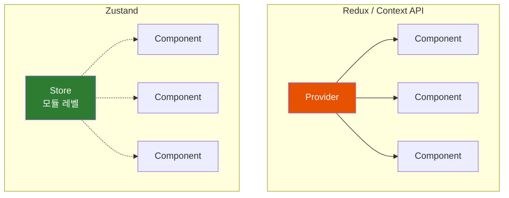
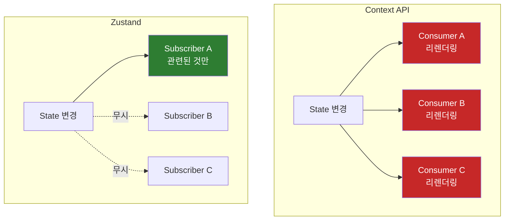
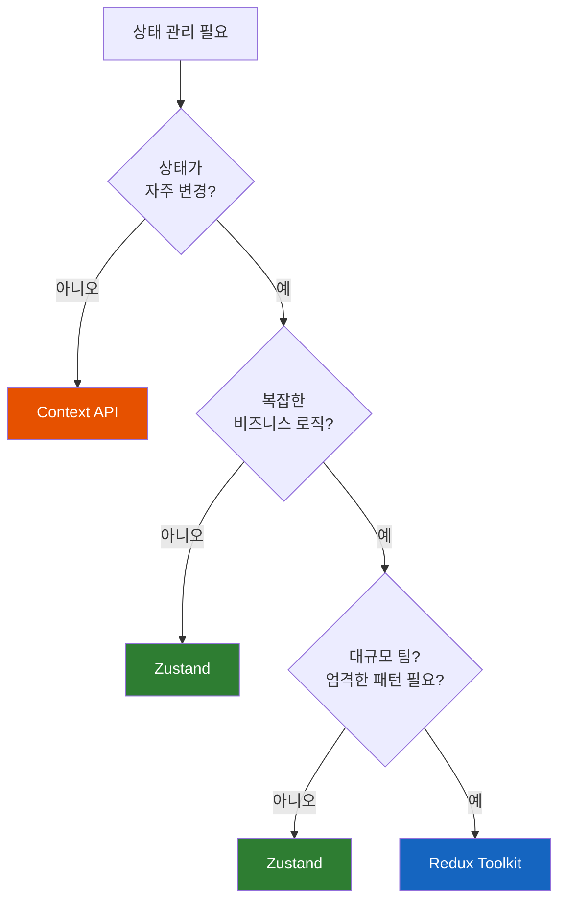

# Zustand: Redux 보일러플레이트에 지쳤다면

"Redux는 강력하지만... 로딩 스피너 하나 추가하는데 200줄이라고?"

## 결론부터 말하면

**Zustand는 ~1KB 크기의 경량 상태 관리 라이브러리** 로, Redux의 복잡한 보일러플레이트 없이 전역 상태를 관리할 수 있다. Provider도 필요 없고, reducer도 없다. 그냥 **create 하나로 store를 만들고, Hook처럼 사용** 하면 된다.

```typescript
// Zustand: 이게 전부다
const useStore = create((set) => ({
  bears: 0,
  increase: () => set((state) => ({ bears: state.bears + 1 }))
}))

// 컴포넌트에서 사용
const bears = useStore((state) => state.bears)
```



| 비교 | Redux | Zustand |
|------|-------|---------|
| 번들 크기 | ~11KB | **~1KB** |
| Provider 필요 | ✅ 필수 | ❌ 불필요 |
| 보일러플레이트 | actions, reducers, types... | **create 하나** |
| 학습 곡선 | 가파름 | **완만함** |
| DevTools | ✅ 지원 | ✅ 지원 |
| TypeScript | ✅ 지원 | ✅ 지원 (보통 `create<State>()(...)`로 상태 타입 명시 권장 — [공식 가이드](https://zustand.docs.pmnd.rs/guides/typescript)) |

---

## 1. 왜 또 다른 상태 관리가 필요했을까?

### 1.1 Redux의 영광과 고통

2015년, Redux는 React 생태계의 구원자였다. Flux 아키텍처를 단순화하고, 예측 가능한 상태 관리를 제공했다. 하지만 시간이 지나면서 문제가 드러났다.

간단한 카운터를 만들어보자. Redux로.

```typescript
// 1. Action Types
const INCREMENT = 'counter/INCREMENT'
const DECREMENT = 'counter/DECREMENT'

// 2. Action Creators
const increment = () => ({ type: INCREMENT })
const decrement = () => ({ type: DECREMENT })

// 3. Reducer
const counterReducer = (state = { count: 0 }, action) => {
  switch (action.type) {
    case INCREMENT:
      return { ...state, count: state.count + 1 }
    case DECREMENT:
      return { ...state, count: state.count - 1 }
    default:
      return state
  }
}

// 4. Store 설정
const store = configureStore({
  reducer: { counter: counterReducer }
})

// 5. Provider로 감싸기
<Provider store={store}>
  <App />
</Provider>

// 6. 컴포넌트에서 사용
const count = useSelector(state => state.counter.count)
const dispatch = useDispatch()
dispatch(increment())
```

카운터 하나에 이 정도 코드가 필요하다. Redux Toolkit이 많이 개선했지만, 여전히 slice, reducer, action 구조를 따라야 한다.

### 1.2 Context API의 반란과 좌절

2023년쯤, 많은 개발자들이 외쳤다. "Redux 필요 없어! Context API로 충분해!"

```typescript
// Context로 전역 상태 관리
const UserContext = createContext()

function UserProvider({ children }) {
  const [user, setUser] = useState(null)
  return (
    <UserContext.Provider value={{ user, setUser }}>
      {children}
    </UserContext.Provider>
  )
}
```

깔끔해 보인다. 하지만 앱이 커지면?

```typescript
// Provider Hell
function App() {
  return (
    <ThemeProvider>
      <AuthProvider>
        <UserProvider>
          <CartProvider>
            <NotificationProvider>
              <ModalProvider>
                {children}
              </ModalProvider>
            </NotificationProvider>
          </CartProvider>
        </UserProvider>
      </AuthProvider>
    </ThemeProvider>
  )
}
```

이것이 악명 높은 **Provider Hell** 이다. 들여쓰기가 점점 깊어진다.

더 심각한 문제가 있다. **성능** 이다. Context의 값이 바뀌면, 그 Context를 구독하는 **모든 컴포넌트가 리렌더링** 된다. 테마만 바꿨는데 장바구니 컴포넌트가 리렌더링되는 상황이 발생한다.

### 1.3 그래서 Zustand가 등장했다

Zustand(독일어로 "상태")는 pmndrs(Poimandres) 팀이 만들었다. React Three Fiber, Jotai, React Spring을 만든 그 팀이다. 그들의 철학은 간단하다: **복잡한 것을 단순하게.**

---

## 2. Zustand의 핵심 개념

### 2.1 Store 생성: 이게 전부다

```typescript
import { create } from 'zustand'

interface BearState {
  bears: number
  increase: () => void
  decrease: () => void
  reset: () => void
}

const useBearStore = create<BearState>((set) => ({
  bears: 0,
  increase: () => set((state) => ({ bears: state.bears + 1 })),
  decrease: () => set((state) => ({ bears: state.bears - 1 })),
  reset: () => set({ bears: 0 })
}))
```

끝이다. Action type? 필요 없다. Reducer? 필요 없다. Provider? **필요 없다.**

### 2.2 컴포넌트에서 사용하기

```typescript
function BearCounter() {
  // 필요한 상태만 선택 (selector)
  const bears = useBearStore((state) => state.bears)
  return <h1>{bears} bears around here</h1>
}

function Controls() {
  const increase = useBearStore((state) => state.increase)
  return <button onClick={increase}>Add bear</button>
}
```

여기서 중요한 점이 있다. **selector를 사용하면 해당 상태가 변경될 때만 리렌더링** 된다. `bears`만 구독한 컴포넌트는 `bears`가 바뀔 때만 리렌더링된다. Context API의 "모든 구독자 리렌더링" 문제가 없다.

### 2.3 왜 Provider가 필요 없을까?

Redux나 Context는 React 컴포넌트 트리를 통해 상태를 전달한다. 그래서 최상단에 Provider가 필요하다.

Zustand는 다르다. **모듈 레벨에서 store를 생성** 한다. JavaScript 모듈 시스템을 활용해서, import하는 곳 어디서든 같은 store 인스턴스를 참조한다.



---

## 3. 실전 패턴

### 3.1 비동기 작업

API 호출은 어떻게 할까? 그냥 async/await 쓰면 된다.

```typescript
interface UserState {
  user: User | null
  isLoading: boolean
  error: string | null
  fetchUser: (id: string) => Promise<void>
}

const useUserStore = create<UserState>((set) => ({
  user: null,
  isLoading: false,
  error: null,

  fetchUser: async (id: string) => {
    set({ isLoading: true, error: null })

    try {
      const response = await fetch(`/api/users/${id}`)
      const user = await response.json()
      set({ user, isLoading: false })
    } catch (error) {
      set({ error: error.message, isLoading: false })
    }
  }
}))
```

Redux Thunk나 Redux Saga 같은 미들웨어가 필요 없다. 그냥 JavaScript다.

### 3.2 Persist 미들웨어: 새로고침해도 상태 유지

```typescript
import { create } from 'zustand'
import { persist, createJSONStorage } from 'zustand/middleware'

const useAuthStore = create(
  persist(
    (set) => ({
      token: null,
      user: null,
      login: (token, user) => set({ token, user }),
      logout: () => set({ token: null, user: null })
    }),
    {
      name: 'auth-storage', // localStorage key
      storage: createJSONStorage(() => sessionStorage) // sessionStorage도 가능
    }
  )
)
```

새로고침해도 로그인 상태가 유지된다. 자동으로 localStorage에 저장하고, 복원한다.

### 3.3 Immer 미들웨어: 불변성 쉽게 다루기

중첩된 객체를 업데이트할 때 spread 연산자 지옥에서 벗어나자.

```typescript
import { create } from 'zustand'
import { immer } from 'zustand/middleware/immer'

interface State {
  user: {
    profile: {
      name: string
      settings: {
        theme: string
        notifications: boolean
      }
    }
  }
  updateTheme: (theme: string) => void
}

const useStore = create<State>()(
  immer((set) => ({
    user: {
      profile: {
        name: 'John',
        settings: {
          theme: 'light',
          notifications: true
        }
      }
    },

    // Immer 없이: spread 지옥
    // updateTheme: (theme) => set((state) => ({
    //   user: {
    //     ...state.user,
    //     profile: {
    //       ...state.user.profile,
    //       settings: {
    //         ...state.user.profile.settings,
    //         theme
    //       }
    //     }
    //   }
    // }))

    // Immer와 함께: 직접 수정하듯이
    updateTheme: (theme) => set((state) => {
      state.user.profile.settings.theme = theme
    })
  }))
)
```

### 3.4 DevTools 연동

Redux DevTools와 연동할 수 있다. 시간 여행 디버깅이 가능해진다.

```typescript
import { create } from 'zustand'
import { devtools } from 'zustand/middleware'

const useStore = create(
  devtools(
    (set) => ({
      count: 0,
      increment: () => set(
        (state) => ({ count: state.count + 1 }),
        false,  // replace 여부
        'increment'  // action 이름 (DevTools에 표시)
      )
    }),
    { name: 'MyStore' }
  )
)
```

### 3.5 미들웨어 조합하기

미들웨어는 조합할 수 있다.

```typescript
import { create } from 'zustand'
import { devtools, persist } from 'zustand/middleware'
import { immer } from 'zustand/middleware/immer'

const useStore = create<State>()(
  devtools(
    persist(
      immer((set) => ({
        // store 정의
      })),
      { name: 'my-store' }
    ),
    { name: 'MyStore' }
  )
)
```

---

## 4. 성능 비교

### 4.1 리렌더링 동작



### 4.2 번들 사이즈 비교

성능(렌더링 시간/메모리)은 앱 구조·구독 패턴·React 버전에 따라 크게 달라져 일반화된 수치를 제시하기 어렵다. 신뢰할 수 있는 객관적 지표는 **번들 사이즈**다([Bundlephobia](https://bundlephobia.com/) 기준, minified + gzipped):

| 라이브러리 | 번들 사이즈 (gzip) | 비고 |
|------------|-------------------|------|
| Zustand | **약 1 KB** | 코어만 |
| Redux 5.x (코어) | 약 1.6 KB | 코어만 — Provider, useSelector 등은 react-redux 별도 |
| Redux Toolkit | 약 12–14 KB | RTK + Immer + Reselect 포함 |
| react-redux | 약 6–7 KB | RTK와 함께 사용 시 합산 |
| Context API | 0 KB | React 빌트인 |

> **렌더링 성능 비교가 궁금하다면** 자신의 시나리오로 직접 측정하는 것이 가장 정확하다 — [react-state-bench](https://github.com/pmndrs/zustand#comparison-with-other-libraries) 공식 비교나 React DevTools Profiler를 활용하자. 일반화된 ms/MB 수치는 환경에 따라 수 배 이상 차이날 수 있다.

### 4.3 불필요한 리렌더링 방지: useShallow

여러 상태를 한 번에 가져올 때는 `useShallow`를 사용한다.

```typescript
import { useShallow } from 'zustand/react/shallow'

// BAD: 객체를 반환하면 매번 새 객체라서 항상 리렌더링
const { user, settings } = useStore((state) => ({
  user: state.user,
  settings: state.settings
}))

// GOOD: useShallow로 selector를 감싸서 shallow 비교
const { user, settings } = useStore(
  useShallow((state) => ({ user: state.user, settings: state.settings }))
)
```

> **Note**: [Zustand 5.0(2024년 10월 14일 릴리스)](https://github.com/pmndrs/zustand/releases/tag/v5.0.0) 이전에는 `useStore(selector, shallow)` 형태로 두 번째 인자에 비교 함수를 넘겼지만, 5.0부터는 두 번째 인자가 제거되어 `useShallow` 훅으로 selector를 감싸는 방식만 지원한다.

---

## 5. 언제 무엇을 써야 할까?

### 5.1 Decision Matrix



### 5.2 사용 시나리오

| 상황 | 추천 |
|------|------|
| 테마, 인증, 언어 설정 | Context API |
| 중소규모 앱의 전역 상태 | **Zustand** |
| 복잡한 폼 상태 | **Zustand** + Immer |
| 대규모 팀, 엄격한 패턴 필요 | Redux Toolkit |
| 서버 상태 (API 데이터) | React Query / TanStack Query |

### 5.3 하이브리드 접근

실제 프로젝트에서는 여러 도구를 조합하는 것이 현명하다.

```typescript
// 서버 상태: React Query
const { data: user } = useQuery(['user', id], fetchUser)

// 클라이언트 상태: Zustand
const theme = useThemeStore((state) => state.theme)
const isModalOpen = useUIStore((state) => state.isModalOpen)

// 간단한 전역 값: Context
const locale = useContext(LocaleContext)
```

---

## 6. 정리

### 6.1 Zustand를 선택해야 하는 이유

1. **단순함**: create 하나로 store 생성, Provider 불필요
2. **작은 크기**: ~1KB, 번들 사이즈 걱정 없음
3. **유연함**: 미들웨어로 필요한 기능만 추가
4. **성능**: selector 기반으로 불필요한 리렌더링 방지
5. **TypeScript**: 자동 타입 추론

### 6.2 주의할 점

- **대규모 팀**: Redux의 엄격한 패턴이 코드 일관성에 도움될 수 있음
- **시간 여행 디버깅**: Redux DevTools 연동은 가능하지만, Redux만큼 강력하진 않음
- **서버 상태**: API 캐싱, 리페칭 등은 React Query가 더 적합

### 6.3 마이그레이션 치트시트

**Context API → Zustand:**

```typescript
// Before: Context
const UserContext = createContext()
function UserProvider({ children }) {
  const [user, setUser] = useState(null)
  return (
    <UserContext.Provider value={{ user, setUser }}>
      {children}
    </UserContext.Provider>
  )
}

// After: Zustand
const useUserStore = create((set) => ({
  user: null,
  setUser: (user) => set({ user })
}))
// Provider 삭제, 바로 import해서 사용
```

**Redux → Zustand:**

```typescript
// Before: Redux slice
const userSlice = createSlice({
  name: 'user',
  initialState: { value: null },
  reducers: {
    setUser: (state, action) => { state.value = action.payload }
  }
})

// After: Zustand
const useUserStore = create((set) => ({
  user: null,
  setUser: (user) => set({ user })
}))
```

---

## 출처

- [Zustand GitHub](https://github.com/pmndrs/zustand) - 공식 저장소
- [Zustand npm](https://www.npmjs.com/package/zustand) - npm 패키지
- [State Management in 2026: Zustand vs Jotai vs Redux Toolkit vs Signals](https://dev.to/jsgurujobs/state-management-in-2026-zustand-vs-jotai-vs-redux-toolkit-vs-signals-2gge)
- [Beyond Redux: Is Zustand the Future of React State Management?](https://www.linkedin.com/pulse/beyond-redux-zustand-future-react-state-management)
