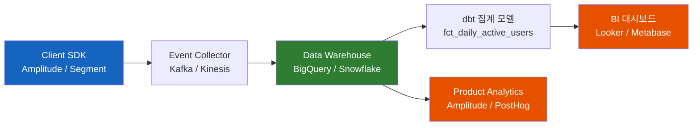
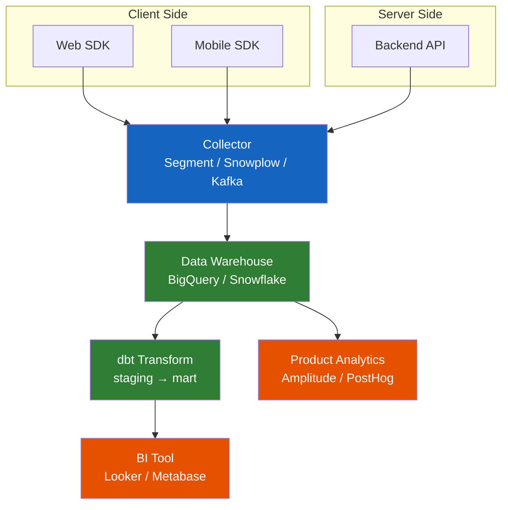
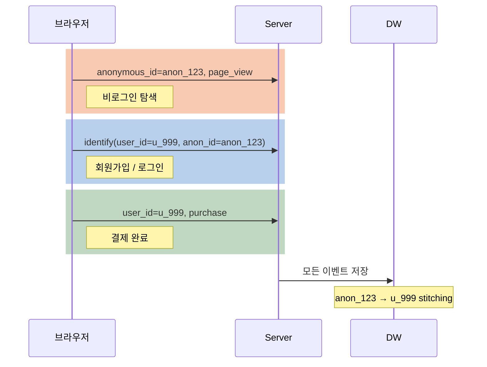
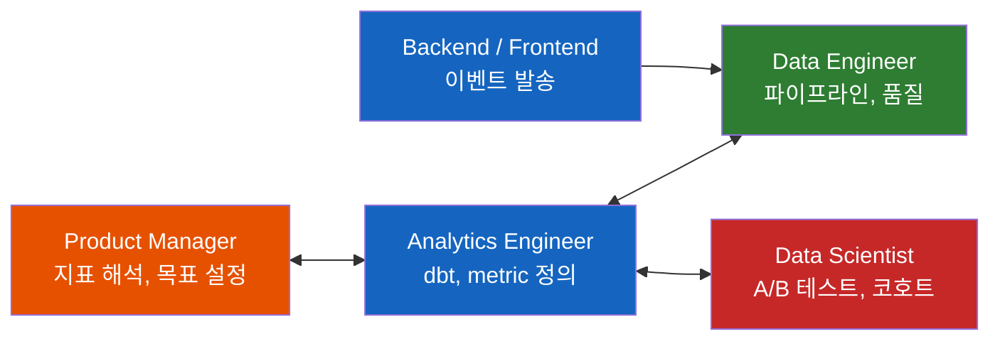

# 왜 서비스 회사는 DAU/MAU 정의에 그토록 집착할까?

SI/B2B만 해온 백엔드 개발자가 서비스 회사로 넘어갈 때 가장 낯선 광경이 있다. PM과 데이터팀이 분기 내내 "우리 제품의 '활성'이 뭐냐"로 회의한다. 왜 숫자 집계가 아니라 정의에서 출발할까?

## 결론부터 말하면

**DAU/MAU는 집계 로직이 아니라 "Active의 정의"를 합의하는 문제다.** 정의만 정해지면 나머지는 "Client SDK 발송 → Collector 수집 → Warehouse 저장 → dbt 집계 → BI/Analytics 시각화"의 5단계 파이프라인에서 기계적으로 계산된다. Java 백엔드 개발자가 가장 놓치기 쉬운 지점은 **"도메인 이벤트는 분석 이벤트가 될 수 없다"** 는 원칙이다.



| 단계 | 담당 도구 | 책임자 |
|------|-----------|--------|
| 정의 | 문서 / 합의 | PM + Data team |
| 수집 | Amplitude, Segment, Snowplow | 백엔드 / 프론트 |
| 저장 | BigQuery, Snowflake | Data Engineer |
| 집계 | dbt, SQL | Analytics Engineer |
| 시각화 | Looker, Amplitude | PM, DS |

## 1. 왜 숫자보다 "정의"가 먼저인가?

서비스 회사의 회의에 처음 들어가 보면 이상한 장면이 펼쳐진다. **숫자 하나를 두고 분기 내내 싸운다.** 그 숫자의 이름은 DAU, "Daily Active Users"다. 정의상 단순해 보이는 지표인데, 문제는 "Active"가 도대체 뭐냐는 것이다.

그래서 제품 유형마다 답이 다르다. 아래 표는 **공개된 업계 레퍼런스와 사례 기반의 예시**로, 각 회사의 내부 공식 정의와 정확히 일치한다고 보장하기는 어렵다(정확한 수치는 회사마다 비공개인 경우가 많다).

| 제품 유형 | "Active"의 예시 정의 |
|-----------|---------------------|
| Slack형 메신저 | 해당 날짜에 메시지 전송 또는 읽기 수행 |
| Notion형 협업 도구 | 문서 열람 또는 편집 1회 이상 |
| Netflix형 스트리밍 | 일정 시간 이상 콘텐츠 재생 (예: 5분) |
| Duolingo형 학습 앱 | 학습 세션 1회 완료 |
| YouTube형 동영상 | 영상 재생 일정 초수 이상 (예: 30초) |

눈치챘겠지만 **"로그인"은 아무도 안 쓴다.** 왜일까?

모바일 앱은 백그라운드에서 토큰을 갱신하면서 자동으로 서버에 붙는다. SSO를 쓰는 B2B SaaS는 아침에 한 번 로그인하면 종일 세션이 살아있다. 푸시 알림이 오면 앱이 깨어나기도 한다. **로그인 기반 DAU는 "허수 Active"로 가득 찬 가짜 숫자**다.

그래서 업계에는 이런 격언이 있다. **"Active의 정의는 당신 제품의 North Star Metric의 절반이다."** 실제로 Duolingo는 CURR(Current User Retention Rate)을 North Star로 정하면서 DAU를 350% 성장시킨 유명한 사례를 남겼다. 숫자가 아니라 **"어떤 행동을 유도할 것인가"** 를 먼저 정했기 때문이다.

정의를 한 번 정하면 바꾸기도 어렵다. **Definition drift** 라고 부르는 이 문제는 과거 지표와 현재 지표를 비교 불가능하게 만든다. 그래서 정의 변경 시에는 **old/new를 동시에 계산하는 dual-running 기간**을 두는 게 실무 표준이다.

## 2. "정의"가 정해지면 나머지는 파이프라인

여기서부터는 엔지니어링의 세계다. 성숙한 서비스 회사의 분석 파이프라인은 예외 없이 5단계로 구성된다.

### 2.1 이벤트 스키마 - 계약의 출발점

모든 건 여기서 시작한다. 클라이언트가 서버로 쏘는 이벤트 JSON이다.

```json
{
  "event_name": "message_sent",
  "user_id": "u_12345",
  "anonymous_id": "anon_abc",
  "device_id": "dev_xyz",
  "timestamp": "2026-04-19T08:13:22Z",
  "session_id": "sess_...",
  "properties": {
    "channel_id": "c_99",
    "message_length": 42
  }
}
```

이 스키마는 **"분석용 계약(contract)"** 으로 관리된다. 백엔드의 도메인 이벤트와는 의도적으로 분리한다. 이유는 4장에서 자세히 설명한다.

### 2.2 수집 → 저장 → 집계의 실제 구조



실제로 dbt로 작성하는 DAU 집계 모델은 이런 모양이다.

```sql
-- models/mart/fct_daily_active_users.sql (BigQuery 기준. Snowflake는 CONVERT_TIMEZONE 사용)
SELECT
  DATE(event_time, 'Asia/Seoul')   AS activity_date,
  COUNT(DISTINCT resolved_user_id) AS dau  -- 3장 stitching으로 익명+로그인을 합친 canonical ID
FROM {{ ref('stg_events') }}
WHERE event_name IN ('message_sent', 'message_read')  -- "Active"의 정의를 코드로 박는 지점
  AND is_internal_user = FALSE                         -- 사내 테스트 계정 제외
  AND is_bot = FALSE                                   -- 봇 트래픽 제외
GROUP BY 1
```

**네 가지만 기억하자.** 첫째, `WHERE event_name IN (...)`이 "Active"의 정의를 SQL로 옮기는 유일한 지점이다. 둘째, 타임존은 한국 서비스라면 `Asia/Seoul`을 명시해야 한다(자세한 방향성 함정은 4.3에서 다룬다). 셋째, **집계에 쓰는 ID는 원본 `user_id`가 아니라 stitching이 끝난 `resolved_user_id`여야 한다.** 이 필드는 클라이언트가 보내는 원본 이벤트에는 존재하지 않는다. DW 안에서 `user_mapping` 테이블과 JOIN하거나 Segment/CDP의 identity resolution을 거쳐 **DW-side에서 파생되는 값**이다. 원본 `user_id` 필드만 쓰면 3장에서 설명하는 익명 활동이 통째로 누락된다. 넷째, **봇/내부 계정 필터를 빼먹으면 숫자가 유의미하게 부풀려질 수 있다** (서비스 트래픽 구조에 따라 체감 차이가 크다).

## 3. 가장 까다로운 지점 - Identity Stitching

지금까지는 쉬운 부분이었다. 진짜 어려운 건 **"로그인 전 익명 사용자와 로그인 후 사용자를 하나의 사람으로 연결"** 하는 문제다.

만약 한 사용자가 이런 경로를 거친다면 어떻게 추적해야 할까?



Segment 같은 CDP(Customer Data Platform)는 **identify() 호출**로 이 연결을 자동화한다. 내부적으로는 Snowplow의 공식 예시처럼 매핑 테이블을 구축하는 SQL을 돌린다.

```sql
CREATE TABLE derived.user_mapping AS (
  SELECT domain_userid, user_id
  FROM atomic.events
  WHERE domain_userid IS NOT NULL
    AND user_id IS NOT NULL
  GROUP BY 1, 2
);
```

이게 왜 중요할까? **stitching이 깨지면 "유입 → 전환" funnel이 통째로 끊긴다.** 광고 비용 대비 전환율(CAC)을 잘못 계산하고, retention curve가 왜곡되고, 개인화 추천이 엉뚱한 걸 보여준다. 실제로 **e-커머스 트래픽의 90~98%가 익명 상태**라는 2025년 Retail Systems 통계를 고려하면, stitching이 망가지면 분석 자체가 무의미해진다는 말이 과장이 아니다.

## 4. Java 백엔드 개발자가 놓치는 네 가지 함정

여기가 이 글의 핵심이다. Spring/JPA로 8~9년차를 보낸 개발자가 서비스 회사로 옮기면서 가장 당황하는 지점들이다.

### 4.1 도메인 이벤트 ≠ 분석 이벤트

DDD를 해본 개발자는 Kafka로 도메인 이벤트를 쏘는 데 익숙하다. `OrderPlaced`, `UserRegistered` 같은 것들이다. 이걸 그대로 분석용으로 쓰면 안 될까?

**안 된다.** 이유는 세 가지다.

| 항목 | 도메인 이벤트 | 분석 이벤트 |
|------|---------------|-------------|
| 목적 | 서비스 간 통신, 상태 복원 | 사용자 행동 이해 |
| 스키마 변경 | 엄격한 버전 관리 필요 | 실험 때문에 자주 바뀜 |
| PII 포함 | 가능 (내부 경계 내부) | 최소화 필수 |
| 발송 빈도 | 드물게, 정확히 1번 | 많이, 중복 허용 |

도메인 이벤트 스키마를 분석팀이 마음대로 바꾸기 시작하면 서비스가 깨진다. 반대로 개발자가 도메인 편의로 바꾸면 분석이 깨진다. 둘의 이해관계가 근본적으로 다르기 때문에 **별도 계약(contract)으로 분리**하는 게 유일한 답이다.

### 4.2 Micrometer/Prometheus는 DAU용이 아니다

이게 진짜 함정이다. Spring Boot에 Micrometer를 붙여봤다면 "`meterRegistry.counter("dau").tag("user_id", userId).increment()` 이렇게 찍으면 되는 거 아닌가?"라고 생각할 수 있다.

**절대 안 된다.** Prometheus는 시계열 DB고, 라벨 카디널리티가 폭발하면 메모리를 다 먹고 죽는다. 10만 유저만 있어도 서버가 무너진다. Micrometer는 **"TPS, latency, 에러율" 같은 시스템 메트릭 전용**이다. Prometheus 공식 instrumentation 가이드는 **한 메트릭의 라벨 카디널리티를 10 미만으로 유지하고, 100을 넘어갈 조짐이 보이면 차원을 축소하거나 로그/분석 파이프라인 같은 다른 처리 방식을 검토하라**고 권한다. `user_id`는 애초에 이 범주에 해당하지 않는 식별자다.

사용자 유니크 집계는 반드시 **이벤트 기반 파이프라인 + 데이터 웨어하우스**로 간다. 두 도구는 이름만 비슷할 뿐 동작 원리와 목적이 완전히 다르다.

### 4.3 타임존과 Window 정의

MAU가 "월간 활성"이라면 "월"이 무엇인지도 정해야 한다. 두 가지 해석이 있다.

- **달력 기준월(calendar month)**: 4월 1일 ~ 4월 30일
- **롤링 28일(L28)**: 오늘 기준 지난 28일

도구마다 calendar month, rolling 28일(L28), rolling 30일 중 어느 것을 기본 윈도우로 쓰는지가 다르다. **어느 쪽인지 명시하지 않으면 숫자가 10~30% 벌어진다.** Amplitude처럼 널리 쓰는 도구도 차트 설정과 버전에 따라 윈도우가 바뀌니 "우리 대시보드의 MAU가 어느 기준으로 집계되는지"를 문서화에 직접 확인해야 한다.

타임존도 동일한 함정이다. KST는 UTC보다 9시간 빠르다. 그래서 한국 서비스가 UTC 날짜 기준으로 집계하면 **KST 자정 ~ 오전 9시 사이에 발생한 이벤트가 "전날"의 UTC 날짜로 잡힌다.** 출근길 아침 사용량이 어제 숫자로 들어가는 셈이니, 대시보드를 보면서 "월요일이 왜 이렇게 활기찰까?"를 오해하기 쉽다.

### 4.4 Stickiness = DAU/MAU

마지막으로 반드시 알아둘 비율 하나.

$$
\text{Stickiness} = \frac{\text{DAU}}{\text{MAU}}
$$

해석 기준은 다음과 같다.

| Stickiness | 의미(월간 활성 사용자가 평균적으로 돌아오는 날 수 비율) |
|------------|------|
| < 0.1 | MAU가 평균 월 3일 이하 활성 (뉴스레터 수준) |
| 0.1 ~ 0.2 | MAU가 평균 주 1~2회 활성 (일반 SaaS) |
| 0.2 ~ 0.5 | MAU가 한 달 중 꽤 많은 날 활성 (**훌륭함**) |
| > 0.5 | MAU가 평균 월 절반 이상 활성 (Meta / TikTok 급) |

주의할 점은 Stickiness가 **"하루에 몇 번 사용하는지"** 는 말해주지 않는다는 것이다. 하루 여러 번 사용 여부는 `sessions per user per day`나 `events per DAU` 같은 별도 지표로 본다. 면접에서 "우리 제품의 Stickiness는 얼마입니까?"라고 역질문할 수 있다면, 제품 감각이 있다는 시그널이 된다.

## 5. 2026년 현재 기준 대표 스택

실무에서 어떤 도구를 쓰는지 한눈에 보이도록 정리했다.

| 분류 | 도구 | 특징 |
|------|------|------|
| 통합 SaaS | **Amplitude** | 엔터프라이즈 표준. 비싸지만 분석 기능이 강력 |
| 통합 SaaS | **Mixpanel** | Amplitude와 거의 동일. 2025년 Feature Flag 재출시 |
| 오픈소스/저렴 | **PostHog** | 자체 호스팅 가능. 분석 + 세션 녹화 + 플래그 통합 |
| CDP | **Segment** | 여러 목적지로 fan-out. identity 해결의 원조 |
| Self-hosted | **Snowplow** | 완전 제어 가능. 대기업/규제 산업 선호 |
| DW | **BigQuery / Snowflake** | 압도적 표준. Redshift / Databricks도 선택지 |
| Transform | **dbt** | metric catalog의 사실상 표준 |
| BI | **Looker / Metabase / Superset** | 취향 / 예산 / 폐쇄성에 따라 선택 |

스타트업은 보통 **"Amplitude 또는 PostHog로 시작 → 규모 커지면 Snowflake + dbt로 자체 구축"** 의 경로를 걷는다. PostHog는 기술팀 주도 스타트업의 새로운 기본값으로 빠르게 자리 잡고 있다.

## 6. 조직은 어떻게 관리하는가

기술 스택보다 놓치기 쉬운 건 **조직 분담**이다. DAU/MAU에는 한 명의 주인이 없다.



대부분의 성숙한 서비스 회사는 **Metric Catalog** (Looker의 LookML, dbt의 metrics layer, Cube.dev 같은 도구)를 운영한다. 이게 없으면 팀마다 다른 DAU 숫자를 들고 와서 "누가 맞냐"로 싸우게 된다. **"DAU는 하나의 숫자가 아니라 하나의 계약"** 이라는 사실을 이해하는 게 이 장의 핵심이다.

## 7. 정리

### 핵심 포인트

1. **DAU/MAU는 집계가 아니라 합의다**
   - "Active"의 정의가 제품의 North Star Metric과 직결된다
   - 로그인이 아니라 "가치 있는 행동"을 정의해야 허수가 빠진다

2. **5단계 파이프라인으로 계산된다**
   - 이벤트 수집 → Warehouse → dbt → BI의 고정된 순서
   - 각 단계마다 다른 역할(PM, AE, DE, DS)이 책임을 나눠 갖는다

3. **Identity Stitching이 진짜 어려운 부분이다**
   - 익명 → 로그인 연결이 깨지면 funnel / retention이 무의미해진다
   - Segment의 `identify()`나 Snowplow의 user_mapping이 이 역할을 맡는다

4. **Java 개발자의 4대 함정**
   - 도메인 이벤트와 분석 이벤트를 혼용하지 말 것
   - Micrometer / Prometheus로 DAU를 계산하지 말 것 (cardinality 폭발)
   - 타임존과 L28 vs calendar month를 반드시 명시할 것
   - Stickiness(DAU/MAU)는 "하루 여러 번"이 아니라 "월 중 며칠 활성"의 빈도 지표임을 기억할 것

---

## 출처

- [Segment - Identity Resolution Guide](https://gopages.segment.com/rs/667-MPQ-382/images/Identity-Resolution_A-guide-to-the-post-cookie-world.pdf) - 공식 가이드
- [Snowplow - Identity Stitching Q&A for Data Engineers](https://snowplow.io/blog/identity-stitching-in-snowplow-a-q-a-for-data-engineers)
- [Statsig - Active Users: DAU, WAU, MAU Explained](https://www.statsig.com/perspectives/active-users-dau-wau-and-mau-explained)
- [Adapty - DAU, WAU & MAU: Understanding Active Users Metrics](https://adapty.io/blog/dau-wau-mau-active-users/)
- [UXCam - North Star Metric Framework 2025](https://uxcam.com/blog/north-star-metric-framework/)
- [Vision Labs - Best Product Analytics Tools (2026)](https://visionlabs.com/blog/best-product-analytics-tools/)
- [PostHog vs Mixpanel In-depth Tool Comparison (2025)](https://posthog.com/blog/posthog-vs-mixpanel)
- [Pendo - Product Management 101: DAU/WAU/MAU](https://www.pendo.io/pendo-blog/product-management-101-dau-wau-mau/)
- [Retail Systems - The Anonymous Visitor Challenge (2025)](https://www.retail-systems.com/rs/the-anonymous-visitor-challenge-ai-powered-personalization.php) - 3장 "e-커머스 익명 트래픽 90~98%" 인용 근거
- [Prometheus - Instrumentation Best Practices](https://prometheus.io/docs/practices/instrumentation/) - 4.2장 라벨 카디널리티 가이드
